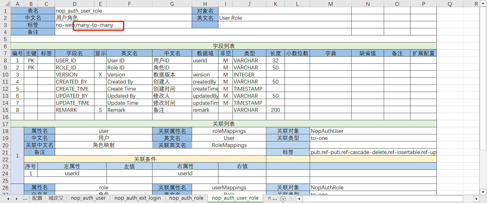

# Many-to-Many Relationship

[Video Demonstration](https://www.bilibili.com/video/BV1Ks4y1E7pw/)

In the database layer, a many-to-many relationship is typically implemented by introducing an intermediate association table, such as `nop_auth_user_role`, which establishes a connection between `user_id` and `role_id`.

The NopOrm engine does not natively support built-in many-to-many relationships. Instead, it only supports `to-one` and `to-many` relationship types.

Nop's approach is to generate some helper functions at the application level and decompose the many-to-many relationship into a one-to-many structure. The specific implementation is as follows:

```java
import java.util.List;

class NopAuthUser extends OrmEntity {
  public IOrmEntitySet<NopAuthUserRole> getUserRoles() {
    return new OrmEntitySet<>(NopAuthUserRole.class);
  }

  public List<NopAuthRole> getRelatedRoleList() {
    // getRefProps is a helper function that retrieves properties from the entity set
    return (List<NopAuthRole>) OrmEntityHelper.getRefProps(getUserRoles(), "role");
  }

  public List<String> getRelatedRoleIdList() {
    return (List<String>) OrmEntityHelper.getRefProps(getUserRoles(), "roleId");
  }

  public void setRelatedRoleIdList(List<String> roleIds) {
    // setRefProps internally checks if roleId exists, whether to create a new NopAuthUserRole,
    // and whether to delete any unused entities
    OrmEntityHelper.setRefProps(getUserRoles(), "roleId", roleIds);
  }
}
```

The `OrmEntityHelper` only provides some helper functions at the Java entity level to simplify the process of retrieving related properties from the association set.

> By leveraging the object relationships provided by the ORM engine, we can expose numerous helpful `get/set` methods on aggregated entities through GraphQL services, thereby simplifying the external interface.


## Excel Model Configuration

In the Excel data model, you only need to add a many-to-many tag to the intermediate entity. This will automatically generate the corresponding methods.




## UI Controls

By default, many-to-many properties are displayed as dropdowns. For example, `relatedRoleIdList` can be displayed using a picker control.


## Using Many-to-Many Tables as One-to-One

Although intermediate tables are generally used for many-to-many relationships, sometimes we only have one-to-one relationships. In such cases, you can mark it as one-to-one in the Excel model and it will generate the corresponding properties.


## Many-to-Many Related Attribute Configuration

In a relational database, many-to-many relationships are implemented by adding an intermediate table. The structure of a typical many-to-many relationship is as follows:

```
MiddleTable(sid, refId1, refId2) 
refId1 corresponds to the association property refProp1, and refId2 corresponds to the association property refProp2
```

* MiddleTable must have the `many-to-many` tag and must also have two `to-one` relationships.
* refProp1 points to the first associated entity, and refProp2 points to the second associated entity.
* The table can have its own sid field or use refId1 and refId2 as composite keys without adding additional intermediate table primary keys.
* In MiddleTable, you can use `orm:manyToManyRefSetName1` to represent the property name for the first associated entity. If not specified, it defaults to `related{refProp2}List`.
* Similarly, `orm:manyToManyRefSetName2` is used for the second associated entity.
* `orm:manyToManyRefSetDisplayName1` represents the display name corresponding to `orm:manyToManyRefSetName1`.

These extended properties are part of the ORM model and will be used in the generated XMeta metadata.

The generated XMeta in the first entity contains the following configuration:

```xml
<meta>
  <props>
    <prop name="middleTables" orm:manyToManyRefProp="refId2" ext:kind="to-many"
          orm:leftJoinProp="id" orm:rightJoinProp="refId1">
      <schema>
        <item bizObjName="MiddleTable"/>
      </schema>
    </prop>

    <prop name="relatedRefProp1List" graphql:labelProp="relatedRefProp1List_label">
      <schema>
        <item bizObjName="EntityName2"/>
      </schema>
    </prop>

    <prop name="relatedRefProp1List_label">
      <schema type="String"/>
    </prop>

    <prop name="relatedRefProp1List_ids" graphql:labelProp="relatedGroupList_label">
      <schema type="List&lt;String&gt;">
        <item bizObjName="EntityName2"/>
      </schema>
    </prop>

  </props>
</meta>
```

* In the association properties pointing to the middle table, `orm:leftJoinProp` refers to the property on the current entity, typically set to `id`, while `orm:rightJoinProp` refers to the corresponding field in the middle table.
* The `orm:manyToManyRefProp` corresponds to the reference property for a many-to-many relationship on the other side.
* A many-to-many relationship will automatically generate an associated object collection, such as `relatedRefProp1List`.
* The `graphql:labelProp` refers to the display name, which is derived from the properties read from each entity and concatenated into `relatedRefProp1List_label`.
