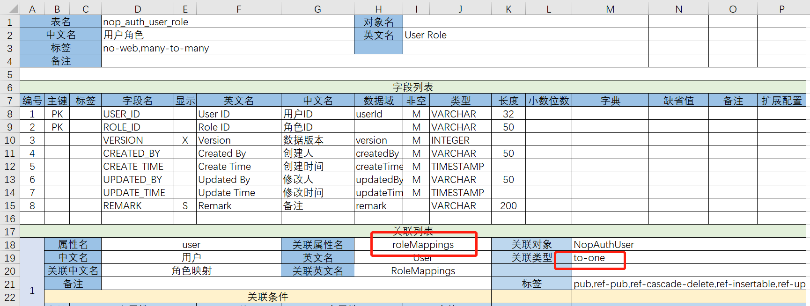

# Many-to-One or One-to-One Associations

In the Excel data model, you only need to configure the foreign key from the child table to the parent table:
to-one association. If you want to add a collection property on the parent entity, simply set the associated property name (relatedPropName) on the to-one association.



For example, in the nop_auth_user_role table, the user_id field is associated with the nop_auth_user table. You only need to add a to-one association property in the configuration of nop_auth_user_role, with the property name user, and the associated entity object is NopAuthUser. Because the associated property name roleMappings is set, during code generation a collection property of type Set<NopAuthUserRole> named roleMappings will be added on the NopAuthUser object. The pseudo-code of the generated entity classes is as follows:

```java
class NopAuthUserRole {
    String userId;
    NopAuthUser user;

    // ...
}

class NopAuthUser {
    //...
    Set<NopAuthUserRole> roleMappings;
}
```

## Avoid Circular Dependencies
To prevent circular dependencies between tables, you can set `ignoreDepends="true"` on a `to-one` association, which corresponds to setting the [Ignore Association] property to TRUE in the Excel model.
For example, in the nop-auth module, `app.orm.xml` configures the mutual relationship between the User table and the Department table.

## Support for Association Queries

Once association properties are defined, backend code can directly use association queries. However, to expose GraphQL services, you still need to configure this in the meta file.

> Requiring configuration in the meta file is primarily for security considerations, to avoid exposing too much functionality to the frontend and causing security vulnerabilities — for example, the frontend repeatedly issuing various complex queries on associated large tables.

### Add queryable and sortable tags to associated objects

If the associated to-one property has the queryable tag, it means all properties on the associated object can participate in queries. If it has the sortable tag, it means all properties on the associated object can be used as sort conditions.
Just add the corresponding tags in the Excel data model.

### Configure Queryable Fields Individually

If you do not wish to expose all properties on the associated object, you can specify them individually.

See the configuration in [NopAuthOpLog.xmeta](https://gitee.com/canonical-entropy/nop-entropy/blob/master/nop-auth/nop-auth-service/src/main/resources/_vfs/nop/auth/model/NopAuthOpLog/NopAuthOpLog.xmeta).

```xml

<meta>
    <props>
        <prop name="session.loginAddr" displayName="Login Address" queryable="true" sortable="true">
        </prop>
    </props>
</meta>
```

queryable indicates that the field is queryable, and sortable indicates that the field is sortable. You can also set properties such as insertable and updatable.

### Use Associated Properties on the Frontend

In the frontend XView model, you can use fields like session.loginAddr.

```xml

<grid>
    <cols>
        <col id="sessionId"/>
        <col id="session.loginAddr" sortable="true"/>
    </cols>
</grid>
```

The sortable on the prop in the meta indicates whether the backend service supports sorting, whereas the sortable on the prop in the grid indicates whether sorting is allowed on the frontend.

sessionId is an existing field in the list. session.loginAddr is a newly added associated field; it is inserted after the sessionId field.

>

Nop platform's Delta merge strategy will try to preserve the original node order; see [x-override.md](https://gitee.com/canonical-entropy/nop-entropy/blob/master/docs/dev-guide/xlang/x-override.md) for the specific rules.

<!-- SOURCE_MD5:d8e6a840e74f66547896f34f6e8abf75-->
