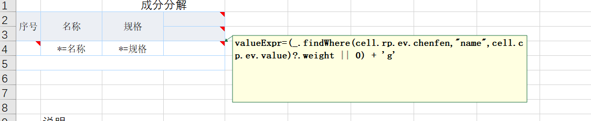

# Dynamic Column Expansion

Report requirements: Display component columns according to a preset component list, and then for each row, show the corresponding component if it exists.


Backend data:

```javascript
let ds1 = [
 { "名称":"A", "规格": "x",  chenfen: [ { name: "001", weight: 3}, {name: "003", weight:4}] },
 { "名称": "B", "规格": "y", chenfen: [  { name: "001", weight: 5}, {name: "005", weight:6}]  }
];
let chenfenList = [
    {value: "001",name:"成分1" },
    {value: "002",name:"成分2" }, 
    {value: "003",name:"成分3" },
    {value: "004",name:"成分4" },
    {value: "005",name:"成分5" },
    {value: "006",name:"成分6" },
] 
```

[View Report Template](https://gitee.com/canonical-entropy/nop-entropy/blob/master)

The basic approach is:

1. Use expandExpr to expand according to the specified list.
2. In a cell, you can use cell.rowParent.expandValue and cell.colParent.expandValue to get the corresponding expansion object from the row/column parent cell.
3. In valueExpr, you can use the collection functions provided by Underscore to perform collection lookups.

## 1. Configure row expansion in cell A4


* expandType=r indicates a row expansion
* expandExpr=ds1 indicates expanding according to dataset ds1
* valueExpr=cell.ei+1 indicates the cell displays the expansion index (starting from 0) + 1

## 2. Configure column expansion in cell D3


* expandType=c indicates a column expansion
* expandExpr=chenfenList indicates expanding according to chenfenList
* valueExpr=cell.ev.name indicates the displayed content is the name property of the expansion object
* colParent=D5 indicates that cell D5 is its column parent; when D3 expands, D5 will expand along with it

## 3. Configure the column parent in cell D2


* colParent=D3 indicates that when cell D3 expands, cell D2 will be copied along with it
* valueExpr=cell.cp.ei + 1 indicates that the value of cell D2 is colParent.expandValue.expandIndex + 1

## 4. Use an expression to get the value in cell D4



\*`valueExpr=(_.findWhere(cell.rp.ev.chenfen,"name",cell.cp.ev.value)?.weight || 0) + 'g'`
This indicates using the findWhere function on the [Underscore](https://gitee.com/canonical-entropy/nop-entropy/blob/master/nop-kernel/nop-core/src/main/java/io/nop/core/lang/utils/Underscore.java) class to find the object in the chenfen list whose name equals the specified value, and then display its weight property.
In report expressions, you can use all built-in functions and objects of the XLang language, and you can define local functions in the [Before Expand] section.

<!-- SOURCE_MD5:ade6f31e1375ed6e43b5c254679fa3aa-->
