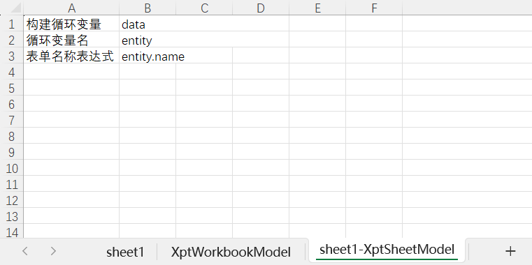
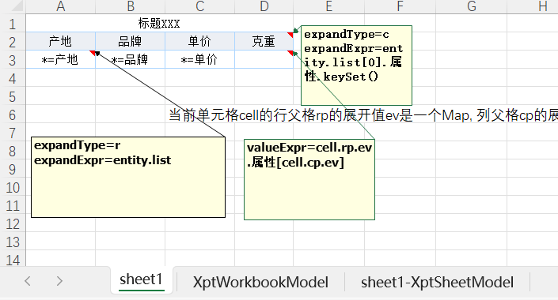

  # NopReport Example: Dynamic Sheets and Columns

Video Lecture: https://www.bilibili.com/video/BV1fKXkYWEQJ/

NopReport is a powerful open-source report engine that supports various complex report formats. It is generally considered to be more powerful than commercial report engines such as FineReport.

Unlike general commercial report engines, NopReport not only supports flat DataSet data structures but also allows the use of nested object structures as data sources. The report can be generated based on domain objects.

The following example demonstrates how to generate multiple dynamic sheets and columns based on a complex JSON data structure.


The input data is a nested structure:

```json
[
  {
    "name": "Apple",
    "list": [
      {
        "price": "3.2",
        "origin": "Shandong",
        "properties": {
          "weight": "100",
          "size": "medium",
          "color": "red"
        }
      }
    ]
  },
  {
    "name": "Banana",
    "list": [
      {
        "price": "2.1",
        "origin": "Shandong",
        "properties": {
          "length": "150",
          "ripeness": "medium",
          "storage": "low-temperature"
        }
      }
    ]
  }
]
```

## Export Template

### Sheet Page Configuration

In the NopReport report template, you can specify a corresponding report model for each sheet page. For example, the configuration of the `sheet1` model is located in the `sheet1-XptSheetModel` page.



*  [Build Loop Variable]: This field configures an Xpl template fragment to return a data list. When exporting reports, NopReport will generate multiple sheets according to this data list. If the list is empty, it will skip generating the sheet.
    The `data` variable in the example represents returning the current context's `data` variable, which is a List.

*  [Loop Variable Name]: This field specifies the loop variable name for dynamic generation. For example, in the case where `data` corresponds to a List, each item in the list will have an entity corresponding to the variable name. If not specified, the default value is `sheetLoopVar`. Simultaneously, during the loop process, the current index of the loop will correspond to the variable name `sheetLoopIndex`.

*  [Form Name Expression]: This field specifies the dynamic generation of Excel sheet names. For example, in the case where `entity.name` represents taking the `name` property from the current loop variable as the form name.

### Cell Expansion Configuration



A3 cell configuration for row expansion:

*  `expandType=r` indicates row expansion
*  `expandExpr=entity.list` represents taking the `list` property from the current context's `entity` object as the cycle expansion data

D2 cell configuration for column expansion:

*  `expandType=c` indicates column expansion
*  `expandExpr=entity.list[0].属性.keySet()` 
    represents taking the `keySet` of the `properties` field of the first item in the list from the current context's `entity` object as the cycle expansion data.
*   `*=产地` is a simplified expression for `valueExpr`, used to take the specified property value from the current expanded value as the cell value.


D3 cell uses `valueExpr` to get dynamic column values, specifically configured as `valueExpr=cell.rp.ev.属性[cell.cp.ev]`

*  `cell.rp` represents the row parent cell of the current cell, which is the most left side expansion cell A3
*   `ev` indicates taking the expanded value of the cell, which is an item in the `entity.list`
*  `cell.cp` represents the column parent cell of the current cell, which is the upper side expansion cell D2
*   `cell.cp.ev` corresponds to the dynamic property name, and `cell.rp.ev.属性[cell.cp.ev]` indicates taking the properties field from the current row, then taking the value according to the property name.

## Import Configuration


You are a computer field translation expert, translating the following Chinese technical document snippet into clear, accurate, and professional English. Preserve markdown formats such as titles, lists, code blocks, and links.

The content to be translated is within the `<TRANSLATE_SOURCE>` and `</TRANSLATE_SOURCE>` tags, while the translation result is output between the `<TRANSLATE_RESULT>` and `</TRANSLATE_RESULT>` tags.

For example:
```
<TRANSLATE_SOURCE>
  Hello  
</TRANSLATE_SOURCE> 
翻译结果为
<TRANSLATE_RESULT>
  你好  

You are a translation expert in the field of computer science, and you will translate the following Chinese technical document fragment into clear, accurate, and professional English. Preserve markdown formatting such as titles, lists, code blocks, and links.

The content to be translated is located between `<TRANSLATE_SOURCE>` and `</TRANSLATE_SOURCE>`, while the translation result will be output between `<TRANSLATE_RESULT>` and `</TRANSLATE_RESULT>` tags. For example:

```markdown
<TRANSLATE_SOURCE>
Hello  
</TRANSLATE_SOURCE>
```

Translation result:
```markdown
<TRANSLATE_RESULT>
你好 