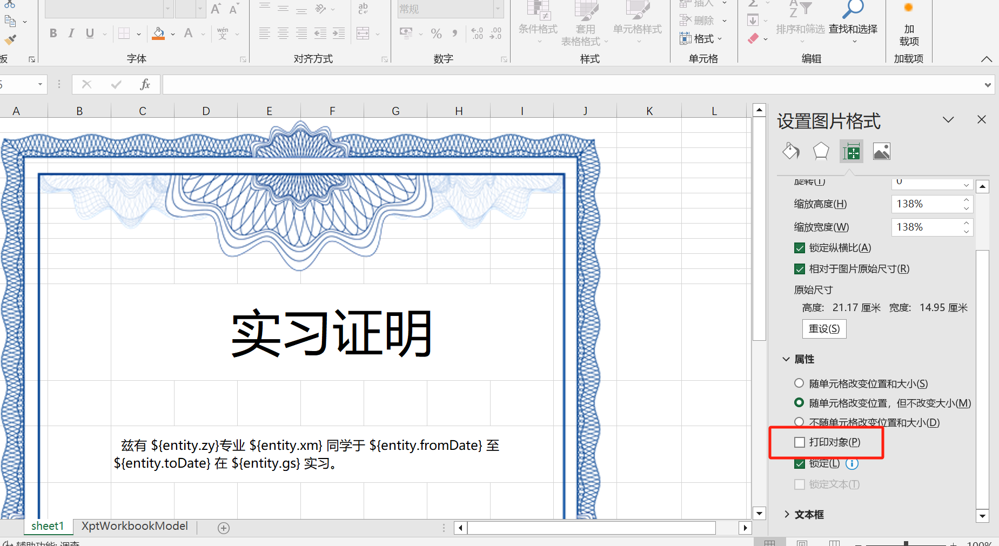
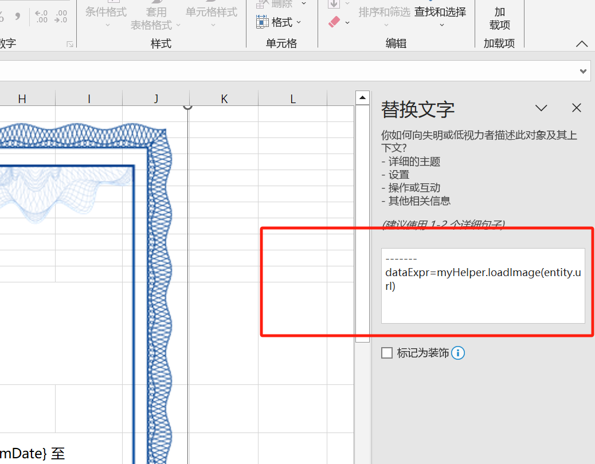

# Overlay Printing (套打)

The approach for overlay printing is as follows:
1. Insert the pre-printed form as an image into the report.
2. Set the image to not print (hide it in the print output).

## Dynamically Generate Images

If the image is not static and must be generated dynamically based on conditions, configure a data generation expression.

Right-click the image and select "View Alt Text". In the "Alt Text" pane, use a dataExpr expression to generate the image data; the expression must return a byte[] or an IResource.

Note: Insert a separate line containing only "-----" to indicate that the following is the expression section.

The application must implement the actual image loading; "myHelper" is only a sample object. You can use inject during the "Before Expand" phase to obtain your helper object from the bean container, or use the import syntax to bring in external helper classes.

<!-- SOURCE_MD5:3f64369281184aacb71c6cf8d691b18b-->
