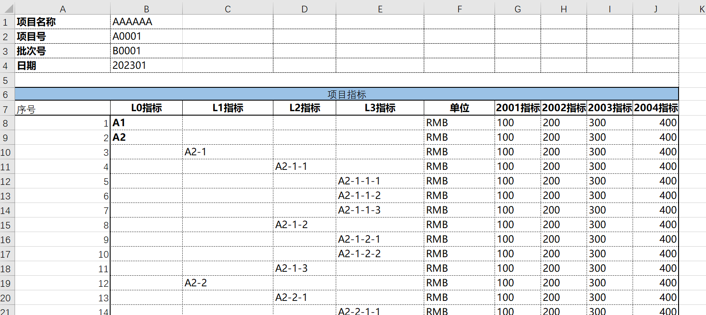

# Excel Data Import and Export

In the Nop platform, you only need to add an imp.xml import model to parse complex business objects stored in Excel. For the exact definition of the imp model, see [imp.xdef](https://gitee.com/canonical-entropy/nop-entropy/blob/master/nop-xdefs/src/main/resources/_vfs/nop/schema/excel/imp.xdef)

## Basic Principles

* For ordinary fields, parse assuming the label is on the left and the value on the right.
* For list fields, parse assuming the label is on top and the list below.
* The first column of a list must be a numeric column; the numbers need not be unique, nor does the index column need to be defined among the fields. It is only used to determine the range of list rows.
* The key is to be able to clearly identify parent-child relationships in the overall structure. A parent field must cover the range of its child fields. Only then can automatic parsing be achieved.
* A label can correspond to either a field's displayName or name.
* Field order does not affect parsing. The fields defined in imp.xml constitute the superset; the actual template can use only a subset.
* However, fields marked as mandatory must exist in the template; otherwise, if their values are empty after parsing, an exception will be thrown.

## Configuration Notes

## How to Parse Lists

* Mark list=true on the sheet or field to indicate a list will be parsed.
* The first column of a list must be a numeric column; the numbers need not be unique, nor does the index column need to be defined among the fields. It is only used to determine the range of list rows.

## How to Parse a Set of Sheets to Obtain a Value

```xml
<sheet name="ss" namePattern=".*" multiple="true" multipleAsMap="true" field="ss">

</sheet>
```

* namePattern specifies a regular expression that describes how to match the corresponding sheets.
* multiple=true indicates that multiple sheets will be matched.
* multipleAsMap=true indicates that after parsing the matched sheets, the results will be aggregated into a Map keyed by sheetName. If this attribute is not specified or set to false, the results from multiple sheets will be merged into a single List.

## Using an Import Template to Implement Export

1. First, create an empty import template by removing the imported data while retaining the serial-number column of list data. See [template.orm.xlsx](https://gitee.com/canonical-entropy/nop-entropy/blob/master/nop-orm-model/src/main/resources/_vfs/nop/orm/imp/template.orm.xlsx) for an example.
2. In the imp.xml file, point to the import template via the templatePath attribute.

```xml
<imp x:schema="/nop/schema/excel/imp.xdef" xmlns:x="/nop/schema/xdsl.xdef" xmlns:c="c" xmlns:xpt="xpt"
     templatePath="template.orm.xlsx" >
</imp>
```

ExcelReportHelper provides methods to automatically generate HTML or XLSX files from the imported business data.

```javascript
    Object bean = ExcelHelper.loadXlsxObject("/nop/test/imp/test5.imp.xml", resource);
    String html = ExcelReportHelper.getHtmlForXlsxObject(impModelPath, bean, scope);
    ExcelReportHelper.saveXlsxObject(impModelPath, resource, bean);
```

With the help of the imp model, Excel can be regarded as a serialized form of Java objects. Similar to automatic bidirectional conversion between JSON and Java objects, we can achieve automatic bidirectional conversion between Excel and Java objects.

For a concrete example, see [TestImportExcelModel.java](https://gitee.com/canonical-entropy/nop-entropy/blob/master/nop-biz/src/test/java/io/nop/biz/impl/TestImportExcelModel.java)

## Dynamically Determining Which Columns to Import

Example configuration [test3.imp.xml](https://gitee.com/canonical-entropy/nop-entropy/blob/master/nop-biz/src/test/resources/_vfs/nop/test/imp/test3.imp.xml),
test case [TestParseTreeTable.java](https://gitee.com/canonical-entropy/nop-entropy/blob/master/nop-biz/src/test/java/io/nop/biz/impl/TestParseTreeTable.java)

By using fieldDecider, you can dynamically determine the parsing configuration corresponding to data columns. For example, columns such as “2002指标” and “2003指标” change dynamically; we want to parse these columns and convert them into a list attribute.


```xml
<field name="columns" displayName="项目指标" list="true">
    <fields>
        <field name="name" displayName="指标" mandatory="true"/>

        <field name="indexValue" displayName="X年指标" virtual="true">
            <schema stdDomain="int"/>
            <valueExpr>
                // If this is the first time accessing the indexValues property, automatically create a List
                let list = record.makeList('indexValues')
                let year = fieldLabel.$removeTail('指标').$toInt()
                list.add({ year, value})
            </valueExpr>

            <xpt:labelExpandExpr>
                <!-- The externally provided list of years -->
                indexYears
            </xpt:labelExpandExpr>

            <!-- Build the field label dynamically based on the expansion expression value -->
            <xpt:labelValueExpr>
                cell.ev + '指标'
            </xpt:labelValueExpr>

            <xpt:valueExpr>
                _.findWhere(cell.rp.ev.indexValues,'year',cell.cp.ev.$toInt()).value
            </xpt:valueExpr>
        </field>

    </fields>

    <!-- If the field label ends with '指标', apply the parsing rule named 'indexValue' -->
    <fieldDecider>
        fieldLabel.endsWith("指标") ? "indexValue" : null
    </fieldDecider>
</field>
```

* virtual=true indicates a virtual field. During import, only the field’s valueExpr is executed, and the returned value will not be set onto the record’s property.
* When valueExpr executes, you can reference the field’s label via fieldLabel, the value parsed from the cell via value, and the current cell via cell.
* Tags prefixed with xpt: are used during data export. xpt:labelExpandExpr is used to dynamically generate table columns.
* xpt:valueExpr returns the value of the cell corresponding to the dynamically generated column. cell.rp.ev is equivalent to cell.rowParent.expandValue for obtaining the row parent’s expanded value, while cell.cp.ev corresponds to cell.colParent.expandValue for obtaining the column parent’s expanded value. _.findWhere dynamically looks up the value corresponding to the current cell based on the row parent and column parent values.

## Dynamically Setting Cell Styles

When exporting data, you can add dynamic styles: apply a specified style when a cell’s value meets certain conditions. For example, set the cell background to red when its value is greater than 300.

```xml
<field>
    <xpt:labelStyleIdExpr>
        cell.ev == 2002 ? 'red' : null
    </xpt:labelStyleIdExpr>

    <xpt:styleIdExpr>
        cell.value > 300 ? 'red' : null
    </xpt:styleIdExpr>
</field>
```

You need to add a Sheet named XptWorkbookModel in the data template to define named styles.


The actual export result is


## Support for Composite Headers

Import can support multi-level headers (currently only two levels are supported)


The export result is


When configuring the imp.xml import model, only the lowest-level fields are considered for matching; group fields do not directly participate in matching.

Add a groupField configuration to the field, which refers to another field configuration where you can configure export-related options such as `xpt:labelExpandExpr`.

```xml
<fields>
    <field name="indexValue" displayName="X年" virtual="true" groupField="group">
        <schema stdDomain="int"/>
        <valueExpr>
            // If this is the first time accessing the indexValues property, automatically create a List
            let list = record.makeList('indexValues')
            let year = fieldLabel.$removeTail('年').$toInt()
            let group = labelData.groupLabel
            list.add({ year, value,group})
        </valueExpr>

        <xpt:labelExpandExpr>
            <!-- The externally provided list of years. You can also access the group cell’s value via cell.cp.ev -->
            indexYears
        </xpt:labelExpandExpr>

        <!-- Build the field label dynamically based on the expansion expression value -->
        <xpt:labelValueExpr>
            cell.ev + '年'
        </xpt:labelValueExpr>

        <!-- xpt:valueExpr runs during export, while valueExpr runs during import. Because they execute at different times,
        the available variables in their contexts also differ. During export, the main variables are cell and xptRt,
        namely variables in NopReport. During import, they are record, cell, fieldLabel, etc.,
        and concepts like rowParent and colParent do not exist at that time.
        -->
        <xpt:valueExpr>
            // cell.cp.cp takes the column parent’s column parent of the current cell.
            // cp is short for colParent. The column parent of the current cell is the cell where the dynamically expanded column’s label resides. The parent of the label cell is the group cell.
            _.findWhere(cell.rp.ev.indexValues,{ year: cell.cp.ev.$toInt(), group: cell.cp.cp.value})?.value
        </xpt:valueExpr>

        <xpt:labelStyleIdExpr>
            cell.ev == 2002 ? 'red' : null
        </xpt:labelStyleIdExpr>

        <xpt:styleIdExpr>
            cell.value > 300 ? 'red' : null
            <!--cell.value == 'A2' ? 'red' : null-->
        </xpt:styleIdExpr>
    </field>

    <!--
    The groupField attribute of the indexValue field points to this grouping field. The main purpose here is to bring in the labelExpandExpr configuration, that is, some related configurations for report export.
    -->
    <field name="group" displayName="group">
        <schema stdDomain="string" />
        <xpt:labelExpandExpr>
            groups
        </xpt:labelExpandExpr>
    </field>
</fields>
```

When importing specific data cells, you can access the corresponding labelCell and groupCell, as well as the related field configuration, via the labelData variable (of type LabelData).

## Integration with the Spring Framework

To use the Nop platform’s Excel import/export capability, simply add the following modules to your pom file

```xml

<dependencies>
  <!-- Integrate the Nop platform with the Spring framework; no database or Web environment dependency -->
  <dependency>
    <groupId>io.github.entropy-cloud</groupId>
    <artifactId>nop-spring-core-starter</artifactId>
  </dependency>

  <!-- Excel parsing and reporting engine support -->
  <dependency>
    <groupId>io.github.entropy-cloud</groupId>
    <artifactId>nop-report-core</artifactId>
  </dependency>
</dependencies>

```

For a sample project, see [nop-spring-report-demo](https://gitee.com/canonical-entropy/nop-entropy/tree/master/nop-demo/nop-spring-report-demo)
<!-- SOURCE_MD5:a8e79a52aa2545c3819f8680481fc27b-->
