# Source Code Analysis of the Nonlinear Chinese-Style Reporting Engine NopReport

In daily development, we often need to import and export Excel data, generate Excel and Word reports, etc. Common packages like [easyexcel](https://github.com/alibaba/easyexcel) and [poi-tl](https://github.com//poi-tl) rely on the underlying POI engine, which is bulky and struggles with complex, irregular tables. When creating complex Chinese-style reports, one usually needs to use report engines provided by professional report software companies such as Runqian and FanRuan.

Many years ago, Runqian pioneered a nonlinear report generation algorithm that supports symmetric expansion across rows and columns, which later became a leader in commercial reporting software. Subsequent report software like FanRuan has mimicked similar report generation algorithms. The NopReport reporting engine offers a very lightweight open-source implementation (about 3,000 lines of code) of this algorithm, making it easy to customize and extend. This article introduces the fundamental principles behind the NopReport reporting engine and the technical details of the nonlinear report generation algorithm.

Algorithm walkthrough video: https://www.bilibili.com/video/BV17g4y1o7wr/
Usage example video: https://www.bilibili.com/video/BV1Sa4y1K7tD/
Engine usage documentation: https://zhuanlan.zhihu.com/p/620250740

## I. Design of the Report Model DSL

## The Report Model as an Extension of the Excel Model

According to Reversible Computation theory, a Template can be viewed as an abstraction of the original model object and, at the structural level, as an enhancement of the original model object. In other words, any original model object should be considered a valid template object. Guided by this design philosophy, NopReport designs the DSL of the report model as an extension of the Excel model, adding a model subnode on top of Excel’s DSL.

> Any Excel file can be regarded as a valid report template; a report template can be seen as a regular Excel file plus extended model information.

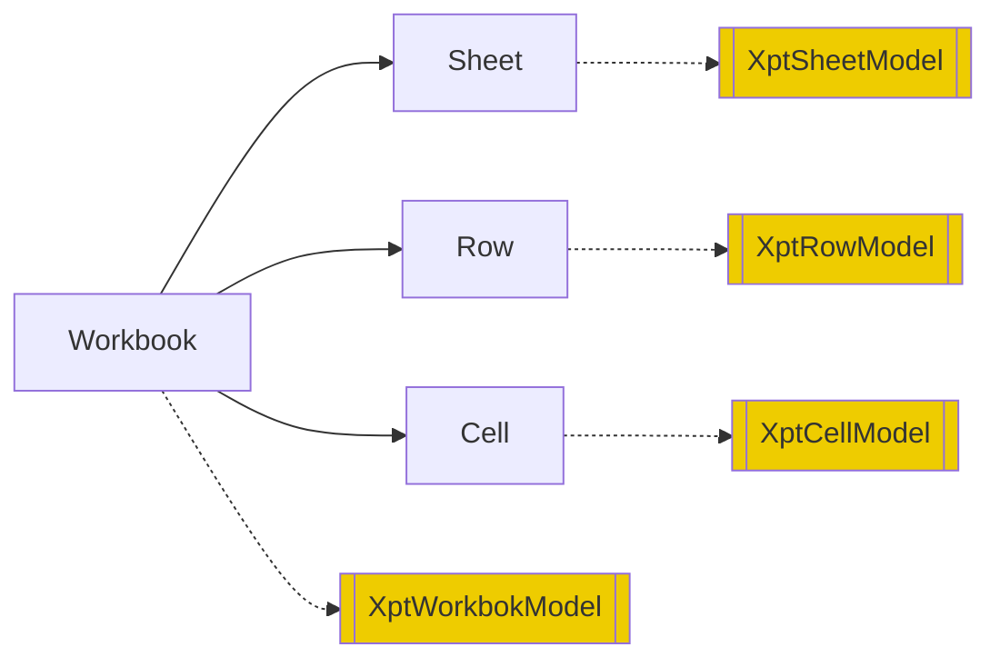

The corresponding meta-model definition is:

```xml
<workbook>
   <model>...</model>
   <sheets>
      <sheet name="!string">
         <model>...</model>
         <rows>
            <row>
               <model>...</model>
               <cells>
                  <cell  mergeAcross="!int=0" mergeDown="!int=0" styleId="string" >
                     <model>...</model>
                     <value xdef:value="any"/>
                     <comment xdef:value="string" />
                  </cell>
               </cells>
            </row>
         </rows>
      </sheet>
   </sheets>
</workbook>
```

The DSL’s attribute design remains largely consistent with Excel’s settings in the OOXML standard, facilitating bidirectional conversion with the Excel format.

## Leveraging Excel’s Built-in Mechanisms to Achieve Visualization

We can utilize some of Excel’s built-in extension mechanisms to store extended model information, thereby turning Excel into a visual report designer.

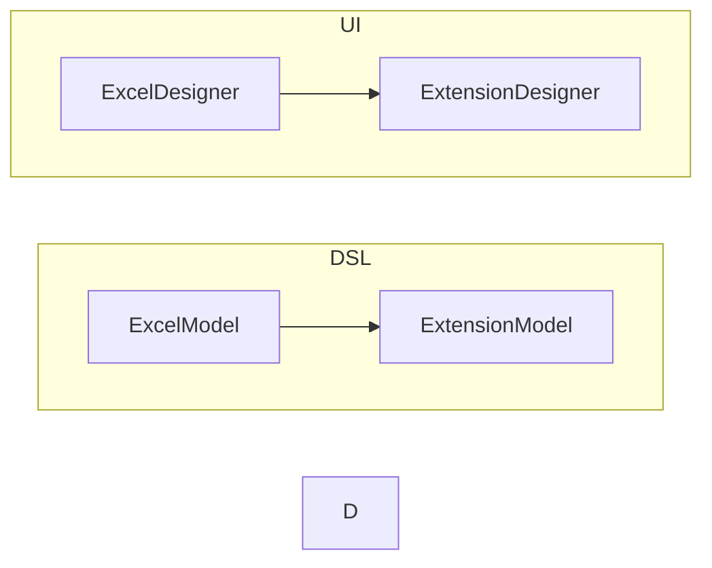

1. Use the cell’s Comment to store extended model information


2. Use a dedicated Sheet to store extended model information
   

**If the Excel tool introduces a custom Schema mechanism, it can automatically perform format validation for the extended model.**

**If all upstream and downstream tools adhere to the principles of Reversible Computation, these tools can automatically achieve seamless integration.**

## II. Theory of Nonlinear Chinese-Style Reports


Alumnus Jiang Buxing, founder of Runqian, invented the theory behind the nonlinear Chinese-style report model. It is a truly original technology in the field of report engines. Subsequent commercial report companies such as FanRuan have continued this Excel-like cell expansion design philosophy.


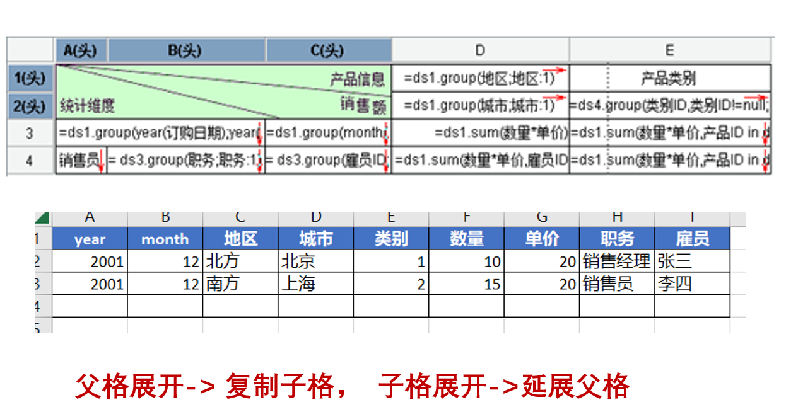

> Nonlinear reports are defined in contrast to linear reports. Foreign tools like Crystal Reports can only expand in a single direction, with the column direction generally fixed, which is why they are categorized as linear reports. In nonlinear reports, both rows and columns form complex, tree-like nested relationships, no longer a linear layout.

NopReport provides an open-source implementation of the nonlinear report expansion algorithm. However, its specific implementation details are inferred from the user documentation of related report tools and are not directly related to the original report tools’ implementations.

## Execution Logic of the Report Engine

NopReport’s functionality is implemented in the [ReportEngine](https://gitee.com/canonical-entropy/nop-entropy/blob/master/nop-report/nop-report-core/src/main/java/io/nop/report/core/engine/ReportEngine.java) object, and its main tasks can be divided into the following three parts:

1. Parse: Parse the report model from xpt or xpt.xlsx files
   - [Parse the Excel file to obtain an ExcelWorkbook object](https://gitee.com/canonical-entropy/nop-entropy/blob/master/nop-format/nop-ooxml/nop-ooxml-xlsx/src/main/java/io/nop/ooxml/xlsx/parse/ExcelWorkbookParser.java)
   - [Convert ExcelWorkbook to the report model](https://gitee.com/canonical-entropy/nop-entropy/blob/master/nop-report/nop-report-core/src/main/java/io/nop/report/core/build/ExcelToXptModelTransformer.java)
   - [Analyze parent-child relationships among cells and initialize various relational information in the report model](https://gitee.com/canonical-entropy/nop-entropy/blob/master/nop-report/nop-report-core/src/main/java/io/nop/report/core/build/XptModelInitializer.java)
2. [Generate](https://gitee.com/canonical-entropy/nop-entropy/blob/master/nop-report/nop-report-core/src/main/java/io/nop/report/core/engine/ExpandedSheetGenerator.java): Dynamically expand based on the report model and generate an ExpandedSheet
   - [Expand](https://gitee.com/canonical-entropy/nop-entropy/blob/master/nop-report/nop-report-core/src/main/java/io/nop/report/core/engine/expand/TableExpander.java): First perform expansion according to parent-child relationships
   - [Evaluate](https://gitee.com/canonical-entropy/nop-entropy/blob/master/nop-report/nop-report-core/src/main/java/io/nop/report/core/engine/ExpandedSheetEvaluator.java): Execute each cell’s valueExpr to produce the cell value and display text
3. [Render](https://gitee.com/canonical-entropy/nop-entropy/blob/master/nop-report/nop-report-core/src/main/java/io/nop/report/core/engine/renderer/HtmlReportRendererFactory.java): Choose different renderers based on renderType to generate output files

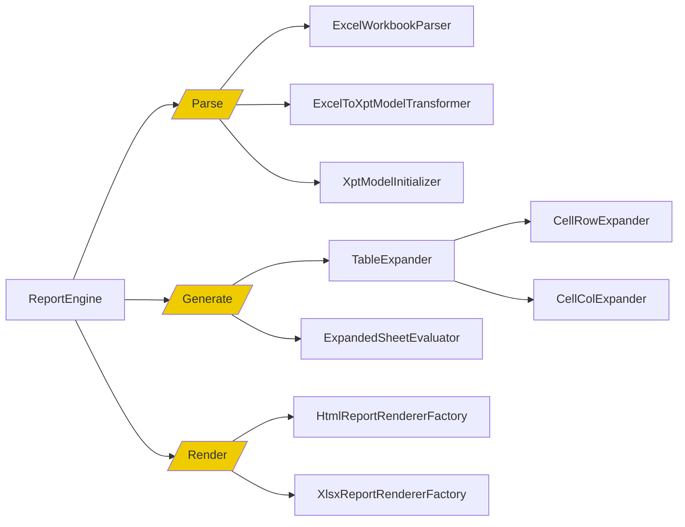

## Table Expansion

The key technology of a nonlinear report engine is the expansion algorithm for the report template. The basic idea is: when a parent cell expands, it automatically recursively copies all child cells; when a child cell expands, it automatically extends the parent cells in the same row or the same column.

> If the parent cell and the expanding cell are not in the same row or the same column, the parent cell does not need to be extended.

Specific process:

1. From top to bottom, left to right, execute the expansion logic of cells sequentially.
2. If the parent cell has not yet expanded, expand the parent cell first.

The implementation code is in [TableExpander.java](https://gitee.com/canonical-entropy/nop-entropy/blob/master/nop-report/nop-report-core/src/main/java/io/nop/report/core/engine/expand/TableExpander.java)

```java
public void expand(IXptRuntime xptRt) {
   do {
      ExpandedCell cell = processing.poll();
      if (cell == null)
            return;

      if (cell.isRemoved() || cell.isExpanded())
            continue;

      if (cell.getColParent() != null && !cell.getColParent().isExpanded()) {
            processing.push(cell);
            processing.push(cell.getColParent());
            continue;
      }

      if (cell.getRowParent() != null && !cell.getRowParent().isExpanded()) {
            processing.push(cell);
            processing.push(cell.getRowParent());
            continue;
      }

      getCellExpander(cell).expand(cell, processing, xptRt);
   } while (true);
}
```

## Cell Expansion

1. Run expandExpr to obtain the list of expansion objects
2. Reuse the current cell as the first cell after expansion
3. Then copy it n-1 times using this cell as the template
4. Extend the parent cells

```javascript
// CellRowExpander
expandList = runExpandExpr(cell, xptRt)
cell.expandIndex = 0
cell.expandedValue = expandList[0]

expandCount = duplicate(expandedList, cell)
expandCells(cell, expandCount)
```

Newly inserted cells need to establish parent-child relationships, and care must be taken to maintain the rowDescendants collection for all parent cells. Here we adopt a space-for-time approach.

```java
    public void addRowChild(ExpandedCell cell) {
        if (rowDescendants == null)
            rowDescendants = new HashMap<>();

        addToList(rowDescendants, cell);

        ExpandedCell p = rowParent;
        while (p != null) {
            if (p.rowDescendants == null)
                p.rowDescendants = new HashMap<>();
            addToList(p.rowDescendants, cell);
            p = p.getRowParent();
        }
    }
```

- Row parent cells and row child cells are not necessarily in the same row, but a row parent cell governs a contiguous region that contains all its row children. Regions under different parent cells do not intersect; they only nest, forming a strict tree structure.
- Similarly, the logic for column parent cells is analogous.


## Hierarchical Coordinates

The concept of hierarchical coordinates, invented in the nonlinear report model theory, provides a precise and efficient way to access expanded cells, greatly simplifying the expression of report calculation logic. Common calculations such as year-over-year and month-over-month can be easily expressed using hierarchical coordinates.

```mermaid
graph LR
Hierarchical Coordinates --> ExpandedCellSet
```

A hierarchical coordinate is essentially a selector. Through hierarchical coordinates, you can locate and select sets of cells that meet conditions within the tree structure composed of parent and child cells.

```
Hierarchical coordinate format: CellName[rowCoordinates ; colCoordinates]
```

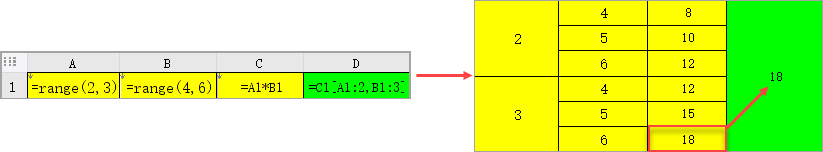

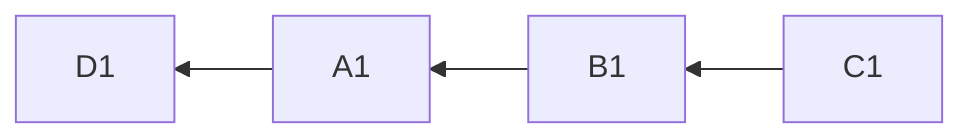

D1 is A1’s rowParent, so when A1 expands, D1 will automatically extend.

Hierarchical coordinates can use relative coordinates to access sibling nodes.

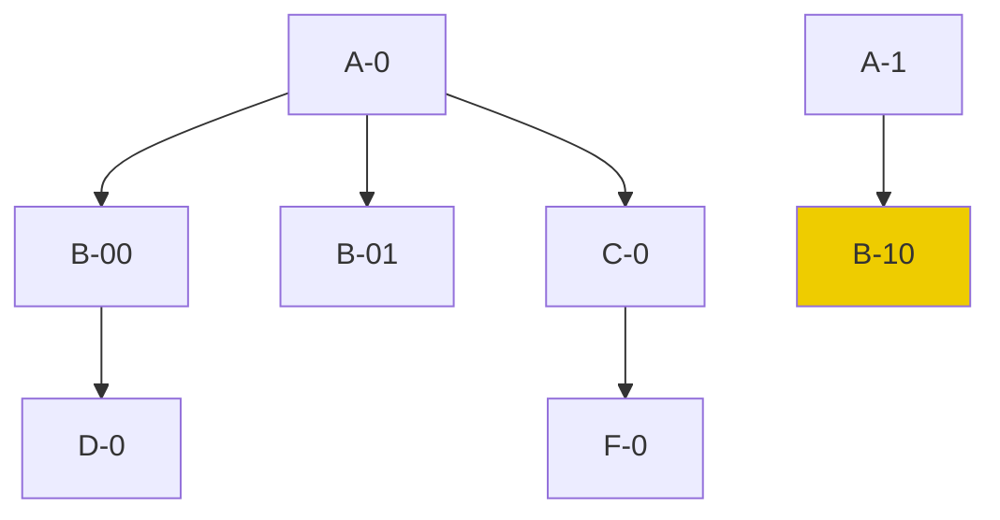

Assuming the parent-child structure above, in node B-10, the coordinate `D[A:-1,B:1]` points to node D-0

1. A:-1 indicates the previous A node relative to the current one, i.e., A-0
2. B:1 indicates the first B node within the A-0 scope, i.e., B-00
3. Find the D node within the B-00 scope, resulting in D-0

## III. Explanation of Core Data Structures

## Expanded Cell: ExpandedCell

The core data structure in the cell expansion algorithm for nonlinear reports is ExpandedCell. Its design must support fast insertion and copying, and rows and columns occupy symmetric roles (all row-specific operations can be directly translated into column-specific operations).

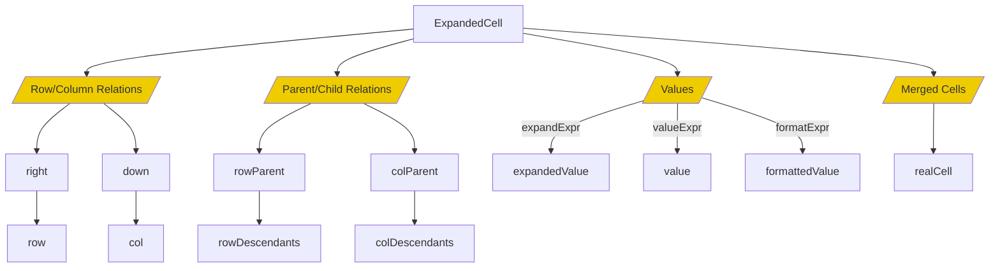

```java
public class ExpandedCell implements ICellView {
   ExpandedRow row;
   ExpandedCol col;

   ExpandedCell right;
   ExpandedCell down;


   // For merged cells, realCell points to the top-left cell
   ExpandedCell realCell;
   int mergeDown;
   int mergeAcross;


   ExpandedCell rowParent;
   ExpandedCell colParent;

   // Recursively contains all descendant cells
   Map<String, List<ExpandedCell>> rowDescendants = null;
   Map<String, List<ExpandedCell>> colDescendants = null;

   // Value computed by expandExpr
   Object expandedValue;
   int expandedIndex;

   // Value computed by valueExpr, executed after parent/child cells have been expanded
   Object value;

   // value is the in-memory value; when displayed, formatExpr is executed to get the formatted value
   Object formattedValue;

   boolean removed;

   // valueExpr has been executed; value is available
   boolean evaluated;

   // Cache for dynamic computations related to the cell
   Map<String, Object> computedValues;
}
```

1. ExpandedCell exists simultaneously in Row and Col; rows and columns are symmetrical.
2. Form two singly linked lists via down and right.
3. For merged cells, insert cell placeholders and use realCell to point to the top-left cell.
4. Rows and columns each maintain their own parent-child relationships.

NopReport distinguishes between expandedValue, value, and formattedValue:

1. expandedValue is the result computed by expandExpr, i.e., the value obtained during the expansion of parent-child cells. At the time expandExpr is executed, the hierarchical coordinate system has not yet been established, so you cannot use hierarchical coordinates to access other cells.
2. After parent and child cells have finished expanding, valueExpr can be used to compute the cell’s value. During computation, other cells’ values can be accessed via hierarchical coordinates. If valueExpr is not specified, then value = expandedValue.
3. When the cell’s value is displayed as text, formatExpr will be executed if configured, and formattedValue = value.

## Dynamic Dataset: DynamicReportDataSet

The data type most commonly used by users in a report engine is the dataset, typically read via JDBC as a list. NopReport provides the DynamicReportDataSet structure to simplify the engine’s use of tabular data.

See [DynamicReportDataSet.java](https://gitee.com/canonical-entropy/nop-entropy/blob/master/nop-report/nop-report-core/src/main/java/io/nop/report/core/dataset/DynamicReportDataSet.java)

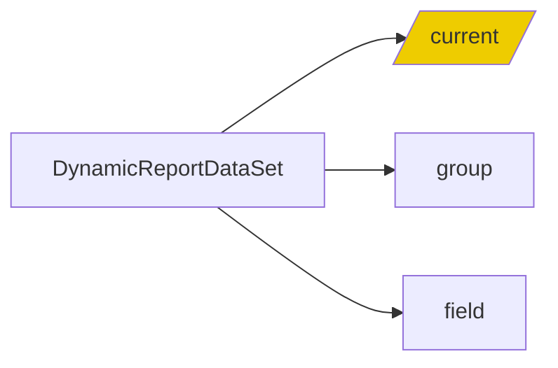

1. DynamicReportDataSet offers a large number of collection selection and computation functions such as group/groupBy/where/filter/sort/field/select/sum/max/min.
2. Its computation results are closely related to the current cell; it retrieves the current cell via xptRt.cell, then intersects with the parent cell’s expandedValue to obtain the data set currently being processed.
3. The current() function performs dynamic lookup to obtain the currently available data list.

> A configuration like ds=ds1, expandType=r, field=xxx is effectively equivalent to expandType=r,expandExpr=ds1.group("xxx"), which will set the expandedValue of the expanded cell to the grouped-and-aggregated child dataset.
> 
> A cell may simultaneously have both a row parent and a column parent. When executing a function like ds1.field(name), it will take the intersection of the child datasets from the row and column parents to obtain the currently visible list, and then perform the corresponding operation.

## Report Context: XptRuntime

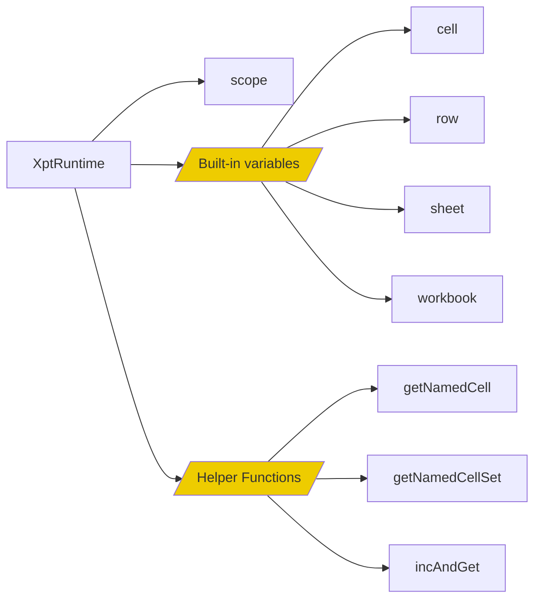

During the execution of the report expansion algorithm, XptRuntime records the cell currently being processed, allowing expressions to use relative hierarchical coordinates to locate cells.

XptRuntime also provides some functions that use relative coordinates, for example, getNamedCells(cellName) returns all cells generated by the specified template cell that are visible to the current cell. Here, “visible” means belonging to the same nearest parent cell.

## IV. Design of the Report Expression Engine

Expressions in the report engine need to incorporate hierarchical coordinate syntax to simplify data access logic.

NopReport’s ReportExpr is fully based on extensions to the built-in XScript expression engine, thus retaining the capabilities of object method invocation and local function definition. Additionally, by using Lambda expressions, it avoids introducing special programming syntax into the expression language. See [ReportExpressionParser.java](https://gitee.com/canonical-entropy/nop-entropy/blob/master/nop-report/nop-report-core/src/main/java/io/nop/report/core/expr/ReportExpressionParser.java)

**Unlike typical report engines, NopReport’s expression engine does not embed any knowledge about datasets.**

> When earlier report engines were developed, functional programming concepts were not yet widespread, so special syntax was often introduced into the expression engine to support dataset transformation and filtering. Nowadays, similar functionality can be achieved using collection functions such as map, filter, flatMap, and reduce, making special syntax unnecessary and simplifying the implementation of the expression engine.

## Simplification via Interfaces

```mermaid
graph LR

 Hierarchical Coordinates --> a[ExpandedCellSet]

 a[ExpandedCellSet] --> iterator
 a[ExpandedCellSet] --> value
```

1. Hierarchical coordinate expressions like `A1`, `A1:B5`, and `A3[A2:-1]` return an [ExpandedCellSet](https://gitee.com/canonical-entropy/nop-entropy/blob/master/nop-report/nop-report-core/src/main/java/io/nop/report/core/model/ExpandedCellSet.java) object at runtime.

2. ExpandedCellSet implements the `Iterable<Object>` interface and can be treated as a collection of values. In programming, it can be processed uniformly like a regular list of values. See the Excel function implementations in [ReportFunctions.java](https://gitee.com/canonical-entropy/nop-entropy/blob/master/nop-report/nop-report-core/src/main/java/io/nop/report/core/functions/ReportFunctions.java).

```java
public static Number SUM(@Name("values") Object values) {
   if (values == null)
      return null;

   Iterator<Object> it = CollectionHelper.toIterator(values, true);
   Number ret = 0;

   while (it.hasNext()) {
      Object value = it.next();
      if (!(value instanceof Number))
            continue;
      ret = MathHelper.add(ret, value);
   }
   return ret;
}
```

3. For an expression like `A3 + 2 > B5`, the compiler will recognize hierarchical coordinates and transform it into `A3.value + 2 > B5.value`. ExpandedCellSet defines the getValue method, which returns the value of the first cell in the set.

```java
    @Override
    public Object getValue() {
        if (cells.isEmpty())
            return null;
        ExpandedCell cell = cells.get(0);
        return cell.getValue();
    }
```

## Function Definition

- Register global functions in the report engine via [ReportFunctionProvider](https://gitee.com/canonical-entropy/nop-entropy/blob/master/nop-report/nop-report-core/src/main/java/io/nop/report/core/functions/ReportFunctionProvider.java).

- NopReport does not define any special function interfaces; any Java static function can be registered as an expression function. In contrast, functions defined by typical report engines are designed specifically for the engine, are not reusable outside it, and must be written according to certain conventions, requiring knowledge of the report engine.

- Currently built-in functions can be found in [ReportFunctions.java](https://gitee.com/canonical-entropy/nop-entropy/blob/master/nop-report/nop-report-core/src/main/java/io/nop/report/core/functions/ReportFunctions.java)

## Performance Optimization

- NopReport does not use the POI library; even the XML parser is hand-implemented. It provides a custom streaming parsing and generation toolset for Excel files, avoiding the complexity and performance overhead of the POI library and drastically reducing runtime code size.

- Report expansion is purely functional, so expression results can be cached. ExpandedCell provides a cache collection and can be used as follows:

```java
   ExpandedCell firstCell = xptRt.getNamedCell(cellName);
   // Use the computed attributes of the first cell to cache the aggregation result
   Number sum = (Number) firstCell.getComputed(XptConstants.KEY_ALL_SUM,
            c -> SUM(xptRt.getNamedCellSet(cellName)));
```

Concrete examples can be found in the implementation of functions such as PROPORTION in [ReportFunctions.java](https://gitee.com/canonical-entropy/nop-entropy/blob/master/nop-report/nop-report-core/src/main/java/io/nop/report/core/functions/ReportFunctions.java).

## V. Extensible Design

Unlike typical report engines, NopReport does not introduce any additional plugin mechanism, nor does it design an SPI service provider interface. Leveraging the Nop platform’s built-in Delta customization capability and the XPL template language, it achieves extensibility beyond other engines.

1. The report DSL extensively supports the XPL template language in configurations such as beginLoop and beforeExpand.
2. In xpl sections, you can use the `<c:import>` tag to include external template libraries, which can be customized via the Delta mechanism.
3. In xpl sections, you can import Java classes via import statements and inject beans from the IoC container using `inject(beanName)`.
4. Via ReportFunctionProvider, you can register any Java static function as a function usable in report expressions.

For example, you can include the Runqian SPL computation engine via the spl.xlib tag library to obtain datasets.

```xml
<beforeExpand>
   <spl:MakeDataSet xpl:lib="/nop/report/spl/spl.xlib" dsName="ds1" src="/nop/report/demo/spl/test-data.splx"/>

   <c:script>
      import xx.MyBean;

      const myHelper = inject("myHelper");
      assign("ds2", myHelper.genDataSet())
   </script>
</beforeExpand>
```

**With an IoC container and a template language, there is generally no need to design additional plugin mechanisms.** Even complex extension mechanisms such as remotely loading JARs and dynamically initializing beans can be introduced via the Xpl tag library, with tag calls abstracting away all underlying complexity.

## Model-based Data Import

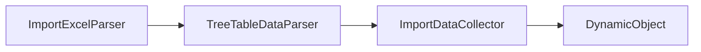

ImportExcelParser analyzes the layout of cells within the ExcelWorkbook and identifies tree structures according to general rules, parsing them into objects.


ExcelTemplateToXptModelTransformer analyzes the structure of the ExcelWorkbook and automatically converts it into a report model.

The low-code platform NopPlatform, designed based on Reversible Computation theory, is open-sourced:

- gitee: https://gitee.com/canonical-entropy/nop-entropy
- github: https://github.com/entropy-cloud/nop-entropy
- Development examples: https://gitee.com/canonical-entropy/nop-entropy/blob/master/docs-en/tutorial/tutorial.md
- Documentation index: https://gitee.com/canonical-entropy/nop-entropy/blob/master/docs-en/index.md

<!-- SOURCE_MD5:f5dfecebaa7776ac4717b00982efb59c-->
