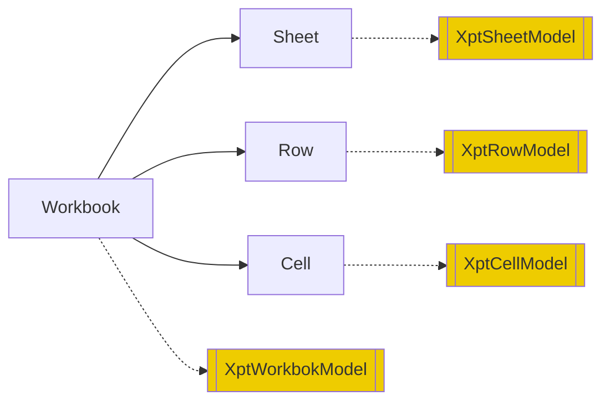
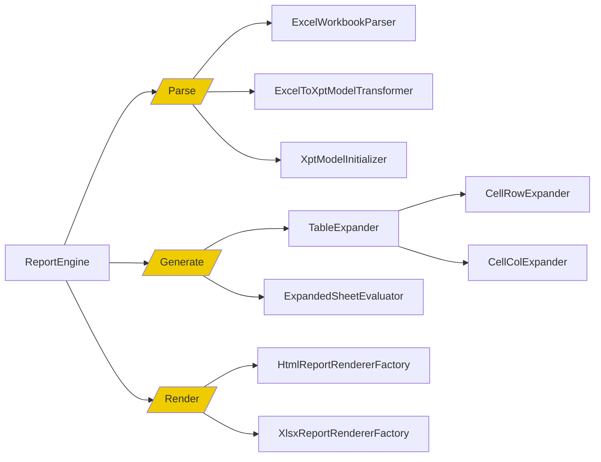
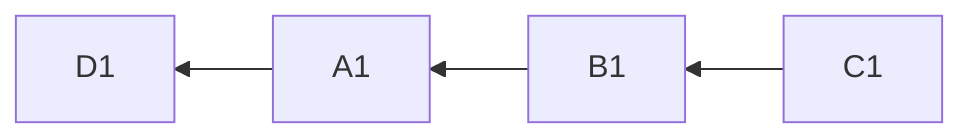
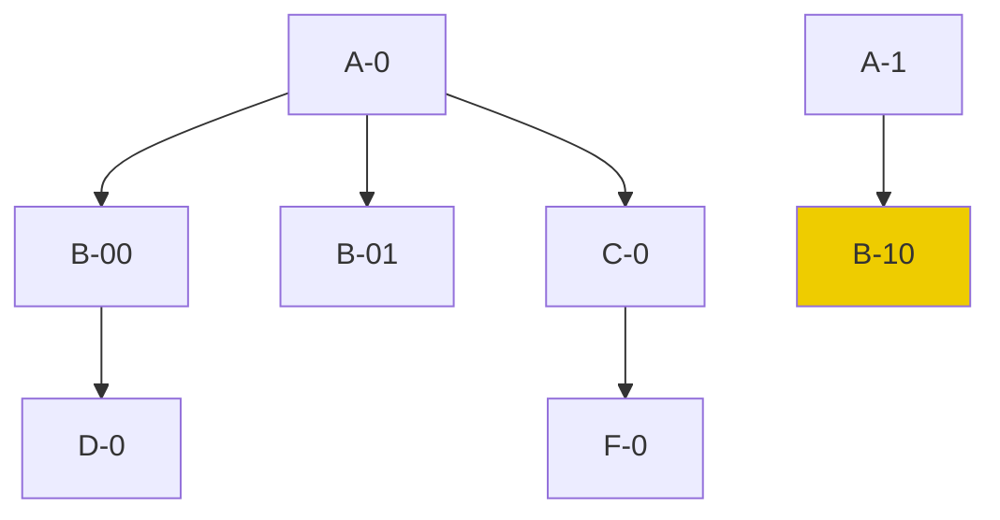
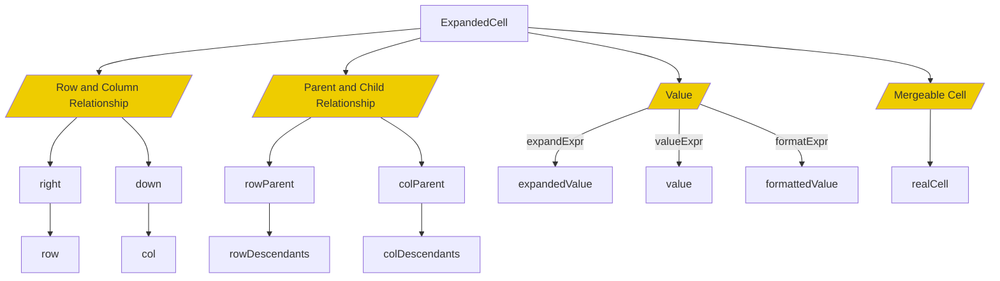
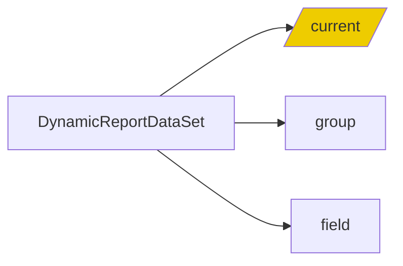
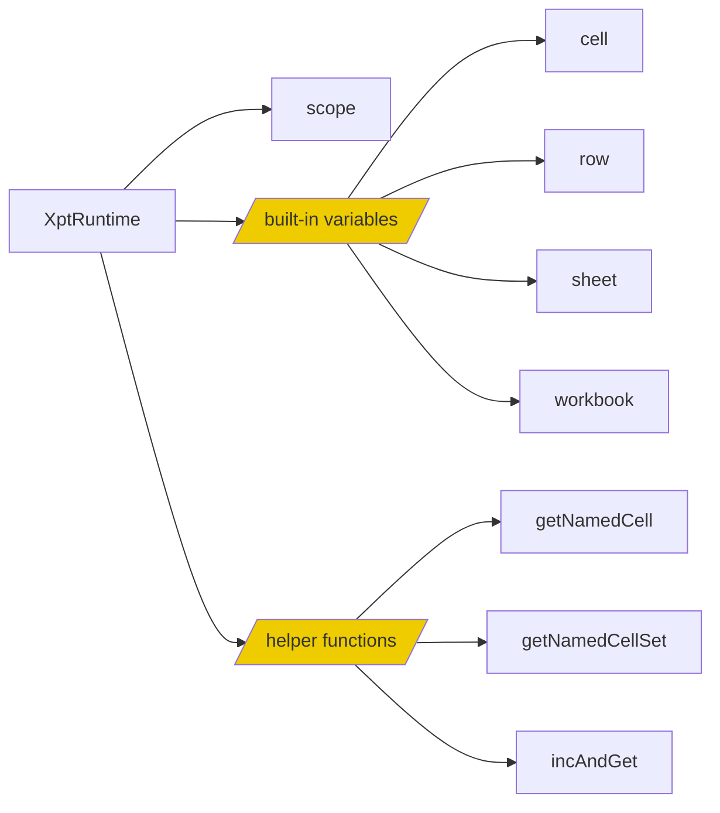
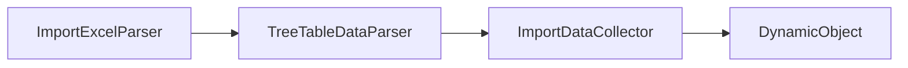

# Nonlinear Chinese-style Report Engine: NopReport Source Code Analysis

In daily development, we often need to import and export Excel data and generate Excel and Word reports. Popular tools like [easyexcel](https://gitee.com/easyexcel/easyexcel) and [poi-tl](https://gitee.com/mirrors/poi-tl) rely on the POI engine at their core, leading to bloated sizes while also complicating the handling of complex structured tables. When creating complex Chinese-style reports, it is still common to use professional report software such as Rundown and Fawnsoft, which provide their own report engines.

Years ago, Rundown Company pioneered a nonlinear report generation algorithm that supports row-column symmetry expansion. This later developed into a leading commercial reporting software solution, with subsequent report software like Fawnsoft following similar algorithms. NopReport provides an open-source implementation of this algorithm (approximately 3,000 lines of code), making it easy to customize and extend. This article details the basic implementation principles of the NopReport report engine and the technical specifics of the nonlinear report generation algorithm.

Video explanation of the algorithm: [https://www.bilibili.com/video/BV17g4y1o7wr/](https://www.bilibili.com/video/BV17g4y1o7wr/)
Usage example video: [https://www.bilibili.com/video/BV1Sa4y1K7tD/](https://www.bilibili.com/video/BV1Sa4y1K7tD/)
Engine usage documentation: [https://zhuanlan.zhihu.com/p/620250740](https://zhuanlan.zhihu.com/p/620250740)

## I. Report Model DSL Design

## Report Model as an Extension of Excel Models

Based on reversible computation theory, the template (Template) can be viewed as an abstraction of the original model object at the structural level, effectively enhancing it. This means that any original model object can be considered a legitimate template object. Under this design philosophy, NopReport's report model DSL is designed as an extension of Excel models. It builds upon Excel's DSL by adding `model` nodes.

> Any Excel file can be considered a valid report template. A report template is essentially an enhanced Excel file with additional model information.



The corresponding meta-model is defined as:

```xml
<workbook>
   <model>...</model>
   <sheets>
      <sheet name="!string">
         <model>...</model>
         <rows>
            <row>
               <model>...</model>
               <cells>
                  <cell  mergeAcross="!int=0" mergeDown="!int=0" styleId="string" >
                     <model>...</model>
                     <value xdef:value="any"/>
                     <comment xdef:value="string" />
                  </cell>
               </cells>
            </row>
         </rows>
      </sheet>
   </sheets>
</workbook>
```

The DSL's attribute design aligns closely with the attributes in the OOXML standard for Excel, facilitating bidirectional conversion between Excel formats.

## Leveraging Excel's Built-in Mechanisms for Visualization

We can leverage Excel's built-in mechanisms to save extended model information, effectively transforming Excel into a report designer with visualization capabilities.


1. Utilizing Cell Comments to Store Extended Model Information

  
  

2. Use separate Sheet pages to save extended model information
   

**If Excel tools introduce a custom Schema mechanism, it can automatically implement format validation for extended models.**

**If all upstream and downstream tools satisfy the reversible computation principle, these tools can automatically achieve seamless integration.**

## II. Chinese-style Nonlinear Report Theory


Mr. Jiang Buqing, founder of Rundu Company, invented the related theory of the nonlinear Chinese-style report model, which is a truly original technology in the report engine field. Subsequent business report companies such as Fansoft Report followed this Excel cell expansion design philosophy.


> Nonlinear reports are defined relative to linear reports. Foreign Crystal Reports can only extend in one direction, with fixed columns, so they are classified as linear reports. Nonlinear reports, on the other hand, have complex tree-like nested relationships between rows and columns, no longer a simple linear layout.

NopReport provides an open-source implementation of the nonlinear report expansion algorithm, but its specific implementation details are inferred from the usage documentation of related report tools, not directly related to the original report tool's implementation plan.

## Execution Logic of Report Engine

The functionality of NopReport is implemented in the [ReportEngine](https://gitee.com/canonical-entropy/nop-entropy/blob/master/nop-entropy/nop-report/nop-report-core/src/main/java/io/nop/report/core/engine/ReportEngine.java) object. Its main work can be divided into the following three parts:

1. Parse: Extract the report model from xpt files or xpt.xlsx files
   * [Parse Excel files to obtain ExcelWorkbook objects](https://gitee.com/canonical-entropy/nop-entropy/blob/master/nop-ooxml/nop-ooxml-xlsx/src/main/java/io/nop/ooxml/xlsx/parse/ExcelWorkbookParser.java)
   * [Convert ExcelWorkbook to report models](https://gitee.com/canonical-entropy/nop-entropy/blob/master/nop-report/nop-report-core/src/main/java/io/nop/report/core/build/ExcelToXptModelTransformer.java)
   * [Analyze cell parent-child relationships and initialize association information in the report model](https://gitee.com/canonical-entropy/nop-entropy/blob/master/nop-report/nop-report-core/src/main/java/io/nop/report/core/build/XptModelInitializer.java)
2. [Generate](https://gitee.com/canonical-entropy/nop-entropy/blob/master/nop-report/nop-report-core/src/main/java/io/nop/report/core/engine/ExpandedSheetGenerator.java): Dynamically expand the report model to generate ExpandedSheet
   * [Expand](https://gitee.com/canonical-entropy/nop-entropy/blob/master/nop-report/nop-report-core/src/main/java/io/nop/report/core/engine/expand/TableExpander.java): Expand based on parent-child relationships first
   * [Evaluate](https://gitee.com/canonical-entropy/nop-entropy/blob/master/nop-report/nop-report-core/src/main/java/io/nop/report/core/engine/ExpandedSheetEvaluator.java): Evaluate each cell's valueExpr to generate cell values and display text


3. [Rendering](https://gitee.com/canonical-entropy/nop-entropy/blob/master/nop-report/nop-report-core/src/main/java/io/nop/report/core/engine/renderer/HtmlReportRendererFactory.java): Selects a different Renderer based on renderType to generate output files



## Table Expansion

The core technology of the nonlinear report engine lies in its table expansion algorithm. The basic idea is that **during parent cell expansion, all child cells are automatically recursively copied, while during child cell expansion, the parent cell's same row or column is automatically expanded**.

> If a parent cell and an expanding cell are not in the same row or column, no expansion is needed.

Detailed process:

1. Process each cell from top to bottom and left to right
2. If a parent cell has not been expanded, expand it first

The implementation code can be found in [TableExpander.java](https://gitee.com/canonical-entropy/nop-entropy/blob/master/nop-report/nop-report-core/src/main/java/io/nop/report/core/engine/expand/TableExpander.java)

```java
public void expand(IXptRuntime xptRt) {
    do {
        ExpandedCell cell = processing.poll();
        if (cell == null)
            return;

        if (cell.isRemoved() || cell.isExpanded())
            continue;

        if (cell.getColParent() != null && !cell.getColParent().isExpanded()) {
            processing.push(cell);
            processing.push(cell.getColParent());
            continue;
        }

        if (cell.getRowParent() != null && !cell.getRowParent().isExpanded()) {
            processing.push(cell);
            processing.push(cell.getRowParent());
            continue;
        }

        getCellExpander(cell).expand(cell, processing, xptRt);
    } while (true);
}
```

## Cell Expansion

1. Run expandExpr to obtain expanded objects list
2. Recycle the current cell as the first cell after expansion
3. Then create n-1 copies using this cell as a template
4. Expand the parent cell

```javascript
// CellRowExpander
const expandList = runExpandExpr(cell, xptRt);
cell.expandIndex = 0;
cell.expandedValue = expandList[0];

const expandCount = duplicate(expandedList, cell);
expandCells(cell, expandCount);
```

Newly inserted cells need to establish parent-child relationships while maintaining all parent cells' rowDescendants collections. We adopted a space-for-time approach here.

```java
public void addRowChild(ExpandedCell cell) {
    if (rowDescendants == null)
        rowDescendants = new HashMap<>();

    addToList(rowDescendants, cell);

    ExpandedCell p = rowParent;
    while (p != null) {
        if (p.rowDescendants == null)
            p.rowDescendants = new HashMap<>();
        addToList(p.rowDescendants, cell);
        p = p.getRowParent();
    }
}
```

* A row parent and its children do not necessarily reside in the same row, but a row parent will oversee a contiguous block containing all of its row children. **Children under different parents will never overlap; they will form a strict hierarchical tree structure**.
* The logic for column parents is analogous.


## Hierarchy Coordinates

The concept of hierarchy coordinates, invented in the nonlinear reporting model theory, provides an efficient and precise way to access expanded cells. Using it can significantly simplify the expression of report computation logic.
Common calculations like synchronized, gap analysis, etc., can be easily expressed using hierarchy coordinates.

```mermaid
graph LR
hierarchy coordinates --> ExpandedCellSet
```

A hierarchy coordinate is equivalent to a selector. Through hierarchy coordinates, you can navigate and select sets of cells that meet conditions within the tree structure formed by parent-child cell groups.

```
Hierarchy coordinate format: CellName[rowCoordinates ; colCoordinates]
```




D1 is the rowParent of A1, so when A1 expands, D1 will automatically expand.

Hierarchy coordinates allow accessing sibling nodes using relative coordinates.



Assuming the structure above, the coordinate `D[A:-1,B:1]` points to D-0:
1. A:-1 indicates the previous A node, i.e., A-0
2. B:1 indicates the first B node within the range of A-0, which is B-00
3. It searches for D nodes within B-00 and finds D-0

## 3. Core Data Structure Explanation

## ExpandedCell: Core Data Structure in Nonlinear Report Expansion

In the algorithm for expanding cells in a nonlinear report, the ExpandedCell data structure plays a central role. Its design must support efficient insertion and copying, while ensuring that rows and columns are symmetric (all row-related operations can be directly translated into column operations).




```java
public class ExpandedCell implements ICellView {
    ExpandedRow row;
    ExpandedCol col;

    ExpandedCell right;
    ExpandedCell down;


    // For mergeable cells, realCell is set to the top-left cell
    ExpandedCell realCell;
    int mergeDown;
    int mergeAcross;


    ExpandedCell rowParent;
    ExpandedCell colParent;

    // Recursively includes all child cells
    Map<String, List<ExpandedCell>> rowDescendants = null;
    Map<String, List<ExpandedCell>> colDescendants = null;

    // Value calculated from expandExpr
    Object expandedValue;
    int expandedIndex;

    // Value calculated from valueExpr, executed after parent and child cells are fully expanded
    Object value;

    // Value stored in memory, converted to displayable format using formatExpr when shown on the interface
    Object formattedValue;

    boolean removed;

    // valueExpr has been evaluated, so value is available
    boolean evaluated;

    // Cache dynamic calculations related to cells
    Map<String, Object> computedValues;
}
```

1. ExpandedCell exists simultaneously in Row and Column, maintaining symmetry between row and column
2. Uses down and right to form two one-way lists
3. For merged cells, an placeholder cell is inserted, pointing to the top-left cell via realCell
4. Maintains parent-child relationships for rows and columns separately

NopReport distinguishes between expandedValue, value, and formattedValue

1. expandedValue is the result of expandExpr, computed during the expansion of parent and child cells. Since the hierarchy is not yet established at this stage, it cannot be used to access other cells via the hierarchy
2. After parent and child cells are fully expanded, valueExpr can be used to compute the cell's value. During computation, other cells' values can be accessed using the hierarchy. If no valueExpr is provided, value = expandedValue
3. The cell's value is formatted for display by applying formatExpr if configured, resulting in formattedValue

## Dynamic Dataset: DynamicReportDataSet

In report engines, the most common data type used by users is the dataset, typically fetched via JDBC as a list of data. NopReport provides the DynamicReportDataSet structure to simplify the report engine's use of table data.

See code at [DynamicReportDataSet.java](https://gitee.com/canonical-entropy/nop-entropy/blob/master/nop-report/nop-report-core/src/main/java/io/nop/report/core/dataset/DynamicReportDataSet.java)



1. DynamicReportDataSet provides numerous collection selection and operation functions such as group/groupBy/where/filter/sort/field/select/sum/max/min等.
2. Its computation results are closely related to the current cell, and it retrieves the current cell based on xptRt.cell, then obtains the intersection of the expandedValue from its parent cell to get the data set being processed.
3. The current() function implements dynamic lookup of the available data list.

> Configuration like `ds=ds1, expandType=r, field=xxx` is equivalent to `expandType=r, expandExpr=ds1.group("xxx")`, which sets the expandedValue of the expanded cell to the grouped and aggregated sub-data set.
>
> A cell may simultaneously have row parent and column parent. When executing functions like ds1.field(name), it will take the intersection of the sub-data sets from both row parent and column parent, resulting in a list of currently visible data sets before performing any operations.

## Context for Reports: XptRuntime



XptRuntime records the currently processing cell during the expansion algorithm execution, allowing the use of relative hierarchical coordinates in expressions.

XptRuntime also provides some functions using relative coordinates, such as getNamedCells(cellName), which returns all visible cells generated by the specified template cell in the current cell's context. Here, "visible" refers to belonging to the same nearest parent cell.

## Four. Design of Report Expression Engine

The expression engine within the report needs to introduce hierarchical coordinate syntax to simplify data retrieval logic.

NopReport's ReportExpr is fully based on the built-in XScript expression engine, retaining the ability to call object methods and define local functions while avoiding the need for special programmatic syntax in the expression language. See [ReportExpressionParser.java](https://gitee.com/canonical-entropy/nop-entropy/blob/master/nop-report/nop-report-core/src/main/java/io/nop/report/core/expr/ReportExpressionParser.java)

**Unlike general report engines, NopReport's expression engine does not contain any built-in knowledge about data sets**

> In early report engines, function programming concepts were not prevalent during development, so special syntax was often introduced in the expression engine to support data set transformations and filters. However, with the availability of map、filter、flatMap、reduce等 collection functions, similar functionality no longer requires special syntax. This also simplifies the implementation of the expression engine.

## Simplified via Interface

```mermaid
graph LR

 Hierarchical Coordinate --> a[ExpandedCellSet]

 a[ExpandedCellSet] --> iterator
 a[ExpandedCellSet] --> value
```

1. Expressions like `A1`, `A1:B5`, and `A3[A2:-1]` will return an [ExpandedCellSet](https://gitee.com/canonical-entropy/nop-entropy/blob/master/nop-report/nop-report-core/src/main/java/io/nop/report/core/model/ExpandedCellSet.java) object at runtime.

2. ExpandedCellSet implements the Iterable<Object> interface and can be treated as a value set, allowing it to be uniformly handled like a standard list during programming. See the implementation of Excel functions in [ReportFunctions.java](https://gitee.com/canonical-entropy/nop-entropy/blob/master/nop-report/nop-report-core/src/main/java/io/nop/report/core/functions/ReportFunctions.java).

```java
public static Number SUM(@Name("values") Object values) {
    if (values == null)
        return null;

    Iterator<Object> it = CollectionHelper.toIterator(values, true);
    Number ret = 0;

    while (it.hasNext()) {
        Object value = it.next();
        if (!(value instanceof Number))
            continue;
        ret = MathHelper.add(ret, value);
    }
    return ret;
}
```

3. For expressions like `A3 + 2 > B5`, the compiler identifies the hierarchical coordinates and converts them into `A3.value + 2 > B5.value`. The ExpandedCellSet defines a getValue method to retrieve the value of the first cell in the collection.

```java
@Override
public Object getValue() {
    if (cells.isEmpty())
        return null;
    ExpandedCell cell = cells.get(0);
    return cell.getValue();
}
```

## Function Definitions

* Register global functions with [ReportFunctionProvider](https://gitee.com/canonical-entropy/nop-entropy/blob/master/nop-report/nop-report-core/src/main/java/io/nop/report/core/functions/ReportFunctionProvider.java) in the report engine.

* NopReport does not define any special function interfaces. Any Java static method can be registered as an expression function. However, functions designed for report engines in general cannot be used outside of the report engine. Writing them also requires certain conventions and knowledge of the report engine to ensure compatibility.

* The built-in functions are located in [ReportFunctions.java](https://gitee.com/canonical-entropy/nop-entropy/blob/master/nop-report/nop-report-core/src/main/java/io/nop/report/core/functions/ReportFunctions.java).

## Performance Optimization

* NopReport does not use the POI library, nor does it rely on XML parsers. Instead, it manually implements a set of tools for parsing and generating Excel files in a stream-like manner, avoiding the complexity and performance overhead associated with the POI library. This also significantly reduces runtime code size.

* Since the report is implemented as pure functional computation, the results of expressions can be cached. The ExpandedCell provides a caching collection that can be used to:

```java
ExpandedCell firstCell = xptRt.getNamedCell(cellName);
// Utilize the computed properties of the first cell to cache summary results
Number sum = (Number) firstCell.getComputed(XptConstants.KEY_ALL_SUM,
        c -> SUM(xptRt.getNamedCellSet(cellName)));

Specific examples can be seen in the implementation of the PROPORTION function in [ReportFunctions.java](https://gitee.com/canonical-entropy/nop-entropy/blob/master/nop-report/nop-report-core/src/main/java/io/nop/report/core/functions/ReportFunctions.java).

## Five. Scalable Design

Unlike general report engines, NopReport does not introduce any additional plugin mechanisms or SPI service interface mechanisms. Instead, it leverages the built-in Delta customization capabilities of the Nop platform and the XPL template language to achieve a level of scalability that other engines cannot match.

1. The Report DSL design supports XPL template language in numerous configurations, such as `beginLoop` and `beforeExpand`
2. In the XPL section, you can use the `<c:import>` tag to import external template libraries, which can be customized using the Delta customization mechanism
3. In the XPL section, you can import Java classes via `import` statements and inject beans from the IoC container using the `inject(beanName)` function
4. Any static Java functions can be registered as reportable functions through `ReportFunctionProvider`

For example, you can use the `spl.xlib` tag library to import the Ruanqian SPL calculation engine to compute the dataset.

```xml
<beforeExpand>
   <spl:MakeDataSet xpl:lib="/nop/report/spl/spl.xlib" dsName="ds1" src="/nop/report/demo/spl/test-data.splx"/>

   <c:script>
      import xx.MyBean;

      const myHelper = inject("myHelper");
      assign("ds2", myHelper.genDataSet())
   </script>
</beforeExpand>
```

**With the IoC container and template language, additional plugin mechanisms are generally no longer required**. Even complex extension mechanisms like remote loading of Jar packages and dynamic initialization of beans can be handled by importing libraries via Xpl tag libraries and calling them to hide all underlying complexity.

## Data Import Modeling



The `ImportExcelParser` will analyze the layout of cells in an ExcelWorkbook, identify a Tree structure based on common rules, and resolve it into objects.


The `ExcelTemplateToXptModelTransformer` analyzes the structure of an ExcelWorkbook and automatically converts it into a report model.

Based on reversible computation theory, the low-code platform NopPlatform has been open-sourced:

- GitHub: [https://github.com/entropy-cloud/nop-entropy](https://github.com/entropy-cloud/nop-entropy)
- Gitee: [https://gitee.com/canonical-entropy/nop-entropy](https://gitee.com/canonical-entropy/nop-entropy)
- Development Examples: [https://gitee.com/canonical-entropy/nop-entropy/blob/master/docs/tutorial/tutorial.md](https://gitee.com/canonical-entropy/nop-entropy/blob/master/docs/tutorial/tutorial.md)
- Documentation Entry: [https://gitee.com/canonical-entropy/nop-entropy/blob/master/docs/index.md](https://gitee.com/canonical-entropy/nop-entropy/blob/master/docs/index.md)
- Theory Introduction: [https://zhuanlan.zhihu.com/p/64004026](https://zhuanlan.zhihu.com/p/64004026)
- Reversible Computation Theory and Nop Platform Introduction & Q&A: [https://www.bilibili.com/video/BV14u411T715/](https://www.bilibili.com/video/BV14u411T715/)