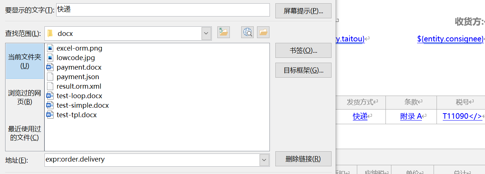
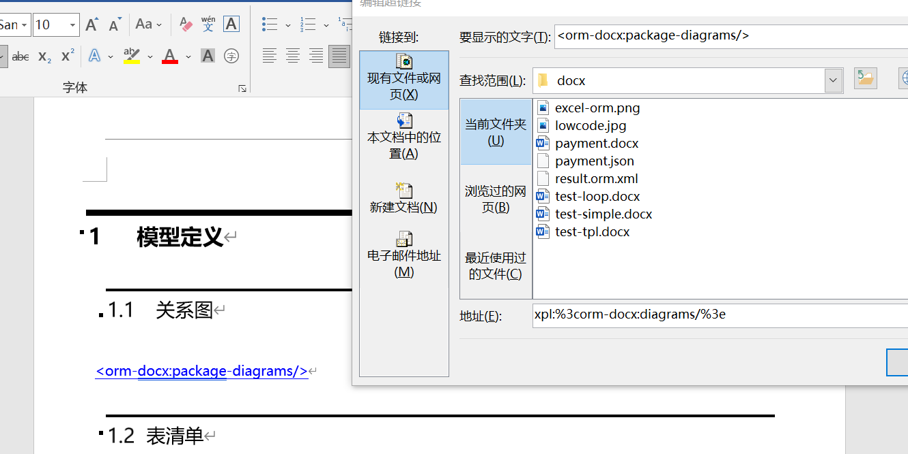
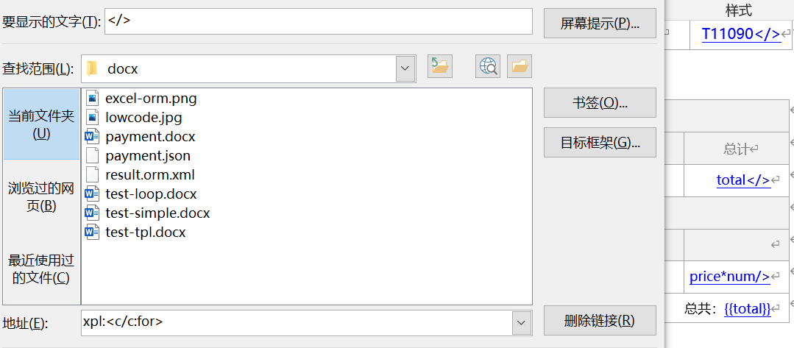
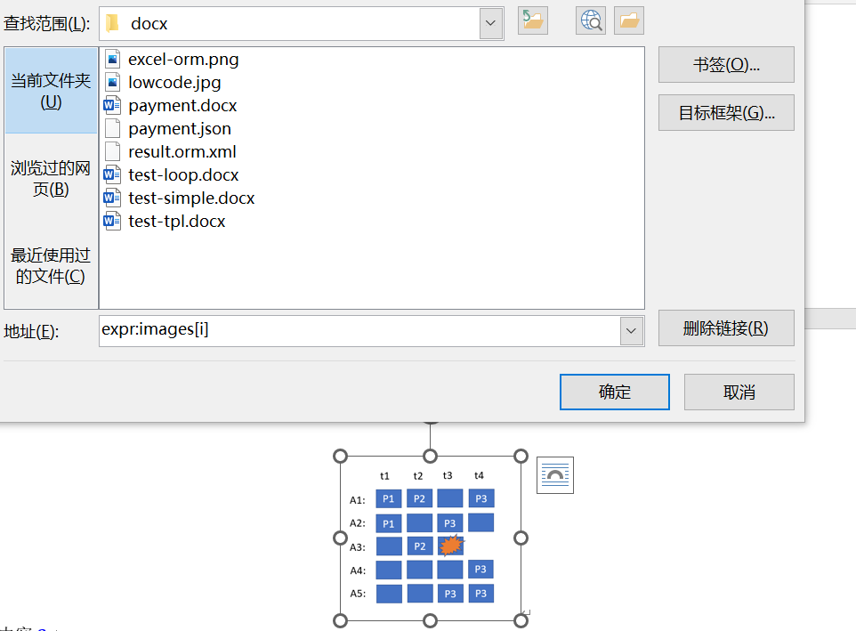
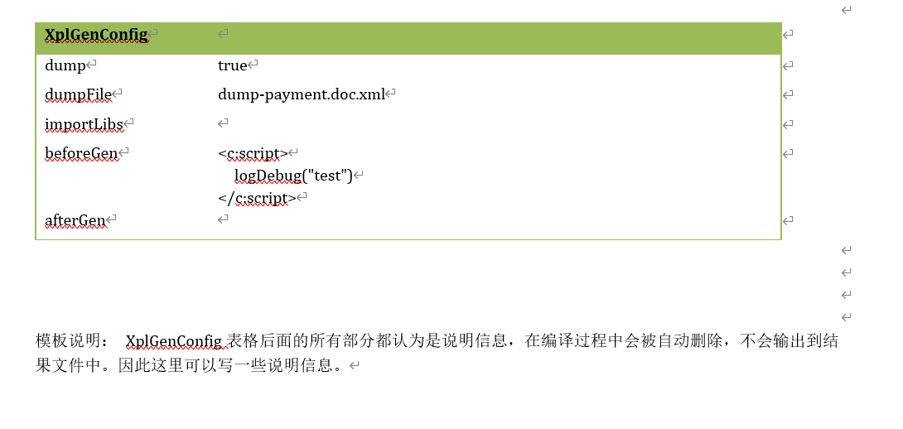

Adding a small amount of annotations to a Word file is enough to turn it into an export template.

# 1. Add hyperlinks to text in the template that needs to be replaced



The link text can be sample content, such as delivery, and the link address must be in the format `expr:EL expression`, which indicates how to fetch data, for example expr: order.delivery.

The hyperlink element retains all style settings, and its insertion position is accurate within the document structure (inserted fields may sometimes end up outside a paragraph). Compared with directly inserting text via poi-tl, using hyperlinks better preserves the original presentation layout. Especially when the expression content is long, you can replace it with sample text to avoid table distortion or unwanted line breaks caused by overly long text. Expressing the expression via a hyperlink avoids occupying display space; when the cursor hovers over the hyperlink, the related content is shown automatically.

If there is enough display space, you can use the link text itself as the expression. In this case, the link address format is `expr:` or `xpl:`. When the link address contains no expression content, the link text will be used as the expression. For example, `${entity.consignee}` in the figure.

> expr: indicates insertion of an EL expression; the built-in expression syntax is close to JavaScript
>
> xpl: indicates insertion of an xpl template language snippet; it supports embedded expression output like a${b}c, and also more complex tag structures.

## 2. Hyperlinks can denote insertion of a complete code block



Through an `xpl:` hyperlink, you can insert a complete xpl tag; the specific tag implementation can output arbitrary code blocks. For example

```
<package-diagrams outputMode="xml">
   <source>
       ....
       <w:drawing>
         ...
       </w:drawing>
   </source>
</package-diagrams>
```

## 3. Represent nested block structures by inserting paired hyperlinks



You can insert paired hyperlinks `xpl:<c:for var="order" items="${entity.orders}>"` and `xpl:</c:for>` to indicate that the content between them should be wrapped inside a `<c:for>` loop tag.

Compared with poi-tl, this approach is more flexible: it allows custom tags, enforces strict variable scope definitions, and avoids introducing various ad-hoc convention syntaxes.

## 4. Add hyperlinks to images that need to be replaced



Via expr, you can specify the image resource object (the expression should return an IResource interface). Compared with poi-tl’s image embedding method, this approach lets you visually adjust the image size and display style.

## 5. Embed EL expressions directly

In Word text, you can directly insert EL expressions like `${expr}`. Sometimes, due to font-related issues, one expression may be split into multiple `<w:t>` tags, causing the EL expression to be parsed incorrectly.
In that case, select the expression text and add a hyperlink with the link address set to `xpl:`. Also note that characters like `${` must be ASCII (English) characters; do not mistakenly use full-width Chinese variants.
If you need to output the `${` characters in the final result, you can escape them as `${'$'}{'`.

## 6. Introduce initialization code via XplGenConfig configuration

poi-tl is a so-called logic-less template engine: it has no complex control structures or variable assignments—only tags. This reduces the implementation complexity of the engine, but it also means data preparation must be done in Java code. It further makes built-in rendering strategies rather rigid; deviating slightly from the default design scenarios often requires separate Java coding.

If we aim to build a Word template management platform, the template itself must possess some logical independence. Many initialization and data preparation tasks should be completed within the template, rather than relying on external code to prepare context data variables.



You can insert an XplGenConfig configuration table at the end of the template. It supports the following options

* dump: During compilation, the template is transformed into XPL template language code. This switch controls whether to print the transformed result for debugging and inspection.

* dumpFile: When dump=true, controls which file the transformed code is written to. The process formats the XML (XML inside a docx file has no indentation by default, making it inconvenient to inspect).

* importLibs: Import custom tag libraries. By default, /nop/ooxml/xlib/docx-gen.xlib is included.

* beforeGen: Initialization code executed before template generation.

* afterGen: Code executed after template generation.

A Word template is first converted into XPL template language, then compiled and rendered as an XPL template. You can inspect the converted code via dumpFile; its overall structure is similar to

```xml
<c:unit>
  <c:import from="/nop/test/orm-docx.xlib"/>
  <c:import from="/nop/ooxml/xlib/docx-gen.xlib"/>
  <c:out escape="none"><?xml version="1.0" encoding="UTF-8"?>
</c:out>
  <c:unit xpl:outputMode="none">
    <c:script>logInfo("test")</c:script>
  </c:unit>
  <w:document>
      ...
  </w:document>
</c:unit>
```

When the xpl template compilation encounters an error, an exception is thrown containing the error details and the exact line number. The line number corresponds to a position in the dumpFile, for example

```
io.nop.api.core.exceptions.NopEvalException:
NopEvalException[seq=1,errorCode=nop.err.commons.text.scan-unexpected-char,
params={pos=19, reader=${model.displayNam[e], expected=}, eof=true},
desc=读取到的下一个字符不是期待的字符[}]]
@_loc=[68:35:0:0]file:/C:/can/entropy-cloud/nop-ooxml/nop-ooxml-docx/dump-tpl.doc.xml
  @@c:unit/w:document/w:body/w:p[2]/w:r/w:t@@[68:12:0:0]file:/C:/can/entropy-cloud/nop-ooxml/nop-ooxml-docx/dump-tpl.doc.xml
```

The above error indicates a syntax error at line 68, column 35 in dump-tpl.doc.xml. It also shows the internal XLang stack information rather than a Java function stack trace. The corresponding code is

```xml
  <w:t>${model.displayName</w:t>
```

Concrete template example and output

[payment.docx](https://gitee.com/canonical-entropy/nop-entropy/tree/master/nop-ooxml/nop-ooxml-docx/src/test/resources/payment.docx)

[result-payment.docx](https://gitee.com/canonical-entropy/nop-entropy/tree/master/nop-ooxml/nop-ooxml-docx/src/test/resources/result-payment.docx)

## 7. Automatic line breaks
If the text contains carriage returns and you want Word output to automatically wrap lines, use the `<docx-gen:r-br>` tag.

Tags with the `docx-gen:r-` prefix generate `<w:r>` runs. Within the tag, you can read the styles configured in Word via the `rPr` child node.


<!-- SOURCE_MD5:f489b69f7454d34a0c101fa16ddcca19-->
