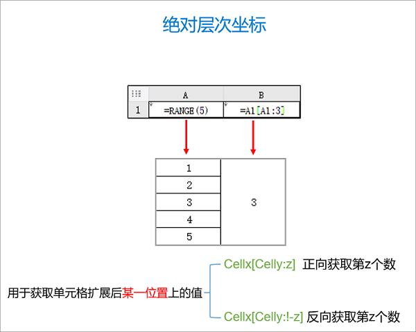

# Report Engine

## Data Initialization

In the Excel report file, the overall report initialization logic is set via the Sheet named XptWorkbookModel. It corresponds to the XptWorkbookModel definition in the workbook.xdef meta-model.

Typically, we execute initialization code in the xpl block under 【Before Expansion】, for example:

```
<c:script>
  let entity = {...}
  assign("entity",entity);

  let ds1 = [...];
  xptRt.makeDs("ds1",ds1);
</c:script>
```

The assign call sets variables into the scope context so they can be used in report cells. Otherwise, the variable’s scope is limited to the script itself and will not be exposed to the external environment.
The xptRt.makeDs function wraps a list of data into a ReportDataSet object and sets it in the scope context.

## Cell Expressions

In a cell, you can set its value using EL expressions, e.g., ${entity.name}.

In the execution environment of a cell expression, there is a global variable xptRt, corresponding to the IXptRuntime type, which provides the following properties and methods

- xptRt.cell : the current cell, of type ExpandedCell
- xptRt.row  : the current row
- xptRt.table: the current table
- xptRt.sheet: the current Excel sheet
- xptRt.workbook: the current Excel workbook
- xptRt.field(name): obtain a field value from the nearest enclosing environment object
- cell: equivalent to xptRt.cell
- row: equivalent to xptRt.row
- table: equivalent to xptRt.table
- sheet: equivalent to xptRt.sheet
- workbook: equivalent to xptRt.workbook

### Properties on the cell object

cell corresponds to the ExpandedCell type

* rowParent or rp: row parent cell
* colParent or cp: column parent cell
* expandValue or ev: the item value returned by the cell’s expansion expression
* expandIndex or ei: the index within the parent cell when expanding, starting from 0
* value: the current cell value

## Cell Expansion

You can define the following properties in the cell comment

- expandType: r indicates expansion along rows, while c indicates expansion along columns

- expandExpr: if non-empty, the expression should return a collection; the current cell will expand into multiple cells according to the values in this collection.

- ds: the current data source object

- field: if expandExpr is not specified and field is specified, the current dataset will be aggregated by this field, and the expansion will be performed based on the grouping.

- keepExpandEmpty: when the expansion collection returns empty, by default the corresponding cell and its child cells will be removed. However, if keepExpandEmpty is set, those unexpanded cells are kept, but their values will be set to null

- rowParent: row parent cell. Must be a cell with expandType set. When a row parent cell expands, it copies all its child cells. If not specified, it is searched to the left.

- colParent: column parent cell. Must be a cell with expandType set. When a column parent cell expands, it copies all its child cells. If not specified, it is searched upward.

- expandMinCount: controls the minimum number of elements during expansion; if expandExpr returns fewer elements, null is padded.

- expandMaxCount: controls the maximum number of elements during expansion. Rows beyond this will be automatically discarded
* If rowParent and colParent are set to A0, they are root cells with no parent.
* formatExpr: a cell has two properties, value and formattedValue. value is the computed value, while formattedValue is the formatted value. If formatExpr is configured, formattedValue is set to the value of formatExpr.
* dict: if a dictionary table is configured and formatExpr is not configured, formattedValue is automatically computed as the label of the dictionary item. In other words, what is displayed on the UI is the text translated by the dictionary.
   If neither formatExpr nor dict is configured, the Excel cell style formatting rules, if any, will be considered and used to derive formattedValue
* rowTestExpr: if it returns false, the entire row will be automatically deleted
* colTestExpr: if it returns false, the entire column will be automatically deleted

For the properties configurable in comments, refer to the model section of the cell node in the workflow.xdef meta-model.

In cell text, we can write expressions directly. The advantage is that the expression content can be seen directly in the UI, without needing to expand the comment.
Two text expression formats are supported:

1. EL expression: e.g., ${entity.myField}
2. Expansion expression: it uses `*=` as a prefix
   A. `*=fieldName` is equivalent to configuring field=fieldName
   B. `*=^ds1!fieldName` is equivalent to configuring expandType=r, ds=ds1, field=fieldName
   C. `*=>ds1!fieldName` is equivalent to configuring expandType=c, ds=ds1, field=fieldName
   D. `*=^fieldName@data` is equivalent to configuring expandType=r, expandExpr=data, field=fieldName

## Hierarchical Coordinates

Hierarchical coordinates are a data positioning method for reports originally created by Runqian Report. The current implementation on the Nop platform is similar to FineReport’s design: [Hierarchical Coordinates](https://help.fanruan.com/finereport/doc-view-3802.html)

Hierarchical coordinates are divided into relative coordinates and absolute coordinates:





## Overall Report Configuration

### Configure global parameters in the sheet 【XptWorkbookModel】

* Before Expansion: xpl code invoked before the report engine executes the expansion algorithm. You can prepare data here. Use the assign function to set data into the report context
* Delete hidden cells: by default hidden rows or columns are output; you can set this to true so that hidden columns are removed during output.

## Common Formulas

1. In cell C3 (Proportion), directly use the proportion formula: =PROPORTION(B3); Proportion: the ratio of the current value to the total

2. Comparison: compare the current value with the first value. Calculation formula: current value minus the first value (C2/C2[A2:1])

3. Month-over-month: the current value compared to last month’s value; calculation formula IF(B4.expandIndex > 0 , C4 / C4[B4:-1] , '--'), where B4 is the month and C4 is the amount

4. Cell expansion position: A2.expandIndex starts from 0, corresponding to the &A2 expression in FineReport

5. Year-over-year comparison:

## Built-in Functions

See the functions defined in [ReportFunctions](https://gitee.com/canonical-entropy/nop-entropy/blob/master/nop-report/nop-report-core/src/main/java/io/nop/report/core/functions/ReportFunctions.java)
class.

* SUM
* PRODUCT
* COUNT
* COUNTA
* AVERAGE
* MIN
* MAX
* NVL(value, defaultValue): returns defaultValue when value is null
* PROPORTIION: proportion
* RANK: compute ranking
* ACCSUM: cumulative sum

## Exporting Excel Formulas

If an Excel formula is configured in an Excel cell, then when exporting to Excel, valueExpr will be converted into an Excel formula. For example, SUM(A3) can, after report expansion, become
SUM(A3:D5)

For complex hierarchical coordinate expressions that cannot be directly represented with Excel formulas, you can configure valueExpr and then set exportFormula=true on the cell.

## Integration with Runqian SPL

Runqian has open-sourced a data processing middleware that can process heterogeneous data using mechanisms similar to report expressions. The SPL processing engine can be easily integrated into the Nop platform. See [spl.md](spl.md)

## Common Expressions

* xptRt.seq(seqName): equivalent to seqName ++, i.e., read the variable value corresponding to seqName, perform an increment operation, and then return the value before incrementing. If the variable does not exist initially, it is assumed to be initialized to 1

## Debugging

In the 【XptWorkbookModel】 configuration, you can set `dump=true` to enable debug file output. During template expansion, each intermediate result will be output to the dumpDir directory, whose default value is `./target`.


The debug file name format is `{seq}-{cellPos}.html`


The content of each cell in the debug file is `cellText <- cellLayerCoordinate`.

At the same time, the parent–child relationships of report cells will be printed in the logs.

## FAQ:

### 1. What is the difference between the cell expansion value `cell.expandValue` and the cell value `cell.value`?

Expansion and value calculation are two steps. The first step is expansion based on hierarchical coordinates, using the expansion expression expandType, yielding the expansion value expandValue.
Only cells with expandType and expandExpr set have an expansion value.

After all expansions are complete, cell value computation is performed, at which point valueExpr is used to compute the cell value. If valueExpr is not set, the cell will take the expansion value expandValue as its default value.

### 2. How to support multiple empty rows by default

* Configure expandInplaceCount on the cell, and implement insertion of multiple rows in the template. If the number returned by the expansion expression is less than this value, there is no need to add new cells. In other words, if space is already reserved in the template, it can be directly reused

### 3. When there are too many data items, how to display only the first few

You can configure the cell’s expandExpr to control the returned items during expansion. A simpler approach is to control it via expandMinCount

### 4. Cells on the right should not follow expansion of the left-side cell
Set the row parent via rowParent. The report expansion rule is that when a cell expands, it automatically copies all its child cells, and also automatically expands parent cells in the same row. By default, a cell on the right will search to the left for the expanding cell as its row parent. You can adjust parent–child relationships to change expansion results.

<!-- SOURCE_MD5:2f8956e4988206cb062b5a0758c574df-->
