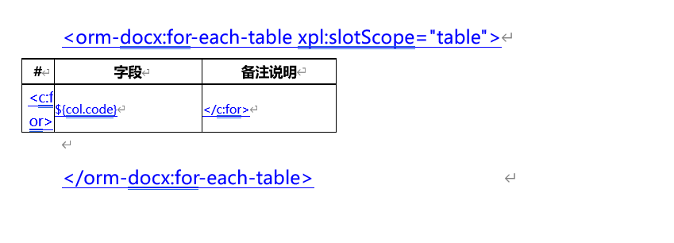
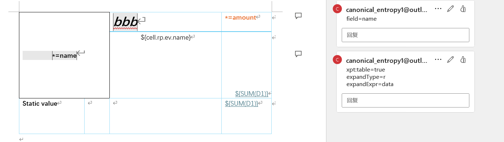
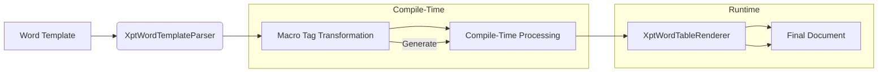

# Integrate NopReport to Dynamically Generate Word Tables

Tutorial video: https://www.bilibili.com/video/BV1jxu8znEo8/

## I. Background and Requirements

In [How to Implement a Visual Word Template Similar to poi-tl in About 800 Lines of Code](https://zhuanlan.zhihu.com/p/537439335), we introduced a solution that embeds extended information via Word hyperlinks to implement report templates. Its core principles are:

1. Leverage Nop platform's built-in XML-based XPL template language
2. Replace hyperlinks in the Word template with XPL template tags



For example, the above Word template will be translated into the following XPL implementation

```xml
<orm-docx:for-each-table xpl:slotScope="table">
  <w:tbl>
    ...
    <c:for var="col" items="${table.columns.subList(0,3)}">
      <w:tr w:rsidR="00AD00A2" w14:paraId="2EAAC2A3" w14:textId="77777777" w:rsidTr="00AD00A2">
        ...
      </w:tr>
    </c:for>
  </w:tbl>
</orm-docx:for-each-table>
```

The key point of the above design is that **we do not need to understand the styling details of Office XML at all; we only need to insert loop tags and expression tags in the right places to achieve dynamic Word generation**. Therefore, implementation is very simple—requiring fewer than 1,000 lines of code.

However, its drawback is limited functionality, making it hard to meet complex table requirements. On the other hand, the Nop platform comes with a very powerful Chinese-style reporting engine, NopReport, which allows defining reports directly using Excel templates; see [Open-Source Chinese-Style Reporting Engine Using Excel as the Designer: NopReport](https://zhuanlan.zhihu.com/p/620250740) for details.

So, can we bring NopReport’s capabilities into Word templates and use NopReport to dynamically generate Word tables? The answer is yes—and the implementation is very simple.

The `nop-report-docx` module provides a solution based on NopReport’s Chinese-style report expansion algorithm, enabling:

- Dynamic column generation
- Automatic cell merging
- Complex table layouts
- Grouped data presentation

## II. Table Template Configuration

### 2.1 Enable NopReport Table Expansion

Insert the following annotation in the first cell of the table:

```xml
xpt:table=true
```

### 2.2 Configure Expansion Expressions

Multiple expression configuration methods are supported:

**Annotation attribute configuration**:

- `expandType`: defines the expansion type
- `expandExpr`: sets the expansion expression

**In-cell expressions**:

- `${expr}`: standard expression syntax
- `*=name`: field declaration syntax



### 2.3 Usage Example

Use XptWordTemplateParser to parse and obtain a WordTemplate, then call the WordTemplate’s generateToFile function.

```java
public class TestXptWordTemplate extends JunitBaseTestCase {
    @Test
    public void testXptTable() {
        IResource resource = getResource("/test/test-word-report.docx");
        WordTemplate tpl = new XptWordTemplateParser().parseFromResource(resource);
        IEvalScope scope = XLang.newEvalScope();
        scope.setLocalValue("data", Arrays.asList(Map.of("name", "a", "amount", 100),
                Map.of("name", "b", "amount", 200)));
        tpl.generateToFile(getTargetFile("test-result.docx"), scope);
    }
}
```

## III. Technical Implementation



### 3.1 Table Structure Transformation

`XptWordTemplateParser` identifies the annotated table and converts it to the following structure:

```xml
<docx-gen:GenXptTable
  xpl:lib="/nop/report/xlib/docx-gen.xlib"
  dump="true">
  <w:tbl>
    <!-- Original table content -->
  </w:tbl>
</docx-gen:GenXptTable>
```

### 3.2 Macro Tag Processing

The `<doc-gen:GenXptTable>` macro tag parses the Word table into an ExcelTable at compile time and generates an XptWordTableRenderer:

```xml
<GenXptTable macro="true">
  <attr name="dump" stdDomain="boolean"/>
  <slot name="default" slotType="node"/>

  <source>
    <c:script><![CDATA[
        import io.nop.report.docx.parse.XptWordTableParser;

        // Parse table at compile time
        const output = XptWordTableParser.fromCompileScope($scope)
                         .compileTable(
                           slot_default.child(0),
                           get('ofcPkg'),
                           dump
                         );

        // Generate AST and pass the compilation result
        let ast = xpl `<c:ast>${output.generateToWriter($out.writer,$scope)}</c:ast>`;
        return ast.replaceIdentifier('output', output);
     ]]></c:script>
  </source>
</GenXptTable>
```

**Key steps**:

1. Invoke `compileTable` at compile time to generate the template object
2. Pass the compilation result to runtime via AST transformations
3. At runtime, render directly using the precompiled `XptWordTableRenderer`

### 3.3 Report Expansion and Rendering

```java
public class XptWordTableRenderer implements ITextTemplateOutput {
  private final ExcelSheet xptModel;

  public XptWordTableRenderer(ExcelSheet xptModel) {
    this.xptModel = xptModel;
  }

  @Override
  public void generateToWriter(Writer out, IEvalContext context) throws IOException {
    XptRuntime xptRt = new XptRuntime(context.getEvalScope());
    ExcelWorkbook wk = new ExcelWorkbook();
    xptRt.setWorkbook(wk);

    ExpandedSheet sheet = new ExpandedSheetGenerator(wk).generateSheet(xptModel, xptRt, new HashMap<>());
    renderExpandedSheet(out, sheet, xptRt);
  }

  protected void renderExpandedSheet(Writer out, ExpandedSheet sheet, IXptRuntime xptRt) throws IOException {

    CollectXmlHandler handler = new CollectXmlHandler(out).indentRoot(false).indent(true);

    ExpandedTable table = sheet.getTable();
    handler.beginNode("w:tbl");
    XNode node = (XNode) sheet.getModel().prop_get(VAR_XPT_NODE);
    XNode tblPr = node.childByTag("w:tblPr");
    if (tblPr != null) {
      tblPr.process(handler);
    }
    handler.beginNode("w:tblGrid");
    for (int i = 0, n = table.getColCount(); i < n; i++) {
      int width = UnitsHelper.pointsToTwips(table.getColWidth(i, DEFAULT_WIDTH));
      handler.simpleNode(null, "w:gridCol", Map.of("w:w", vl(null, width)));
    }
    handler.endNode("w:tblGrid");

    for (int i = 0, n = table.getRowCount(); i < n; i++) {
      ExpandedRow row = table.getRow(i);
      XNode tr = (XNode) row.getModel().prop_get(VAR_XPT_NODE);
      XNode trPr = tr.childByTag("w:trPr");
      handler.beginNode(tr.getLocation(), tr.getTagName(), tr.attrValueLocs());
      if (trPr != null)
        trPr.process(handler);
      renderCells(row, handler, xptRt);
      handler.endNode(tr.getTagName());
    }
    handler.endNode("w:tbl");
  }
  // ...
}
```

- The XptWordTableRenderer member variable xptTable is the report model object obtained by parsing the Word table
- ExpandedSheetGenerator executes the report expansion algorithm, producing an ExpandedSheet from an ExcelSheet
- ExpandedSheet/ExpandedCell can return the report model object via getModel, which stores the original Word table styles (as XNode) in the model’s extended properties
- Generate the final XML file using the saved Word style objects. There is essentially no need to understand Word’s style structure; you only need to modify parts like `w:tblW`/`w:gridCol`.

## IV. Key Design Points

XptWordTemplate’s design fully leverages the Nop platform’s built-in extensibility, using metaprogramming to tie various structural transformations together.

1. The overall principle remains unchanged: convert Word XML into XPL tags based on annotation information in the Word template.
2. `<docx-gen:GenXptTable>` performs a local structural transformation at compile time, storing parse results in compile-time variables without needing extra intermediate storage.
3. When parsing the Word table into an ExcelTable, only cell sizes, merge relationships, etc. are handled; there is no need to parse cell style configurations. The Word cell’s corresponding XNode is stored as an extended property on the ExcelCell.
4. XptWordTableRenderer first calls ExpandedSheetGenerator to perform the report expansion, then dynamically generates Word XML using the saved Word table style information.

<!-- SOURCE_MD5:b876c330a91bf2b3598cf34fe78f1523-->
