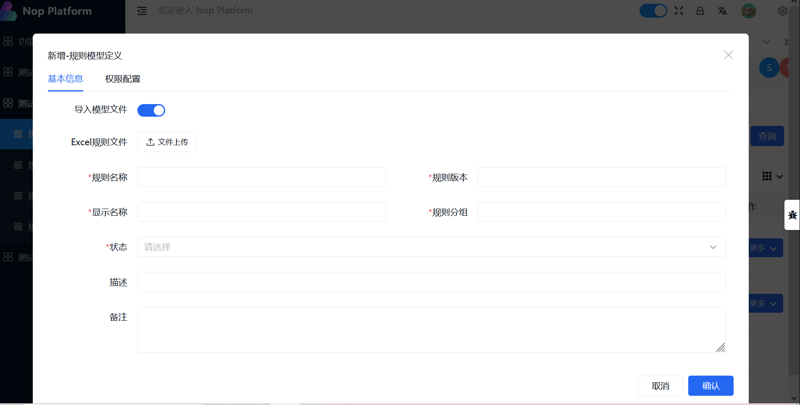
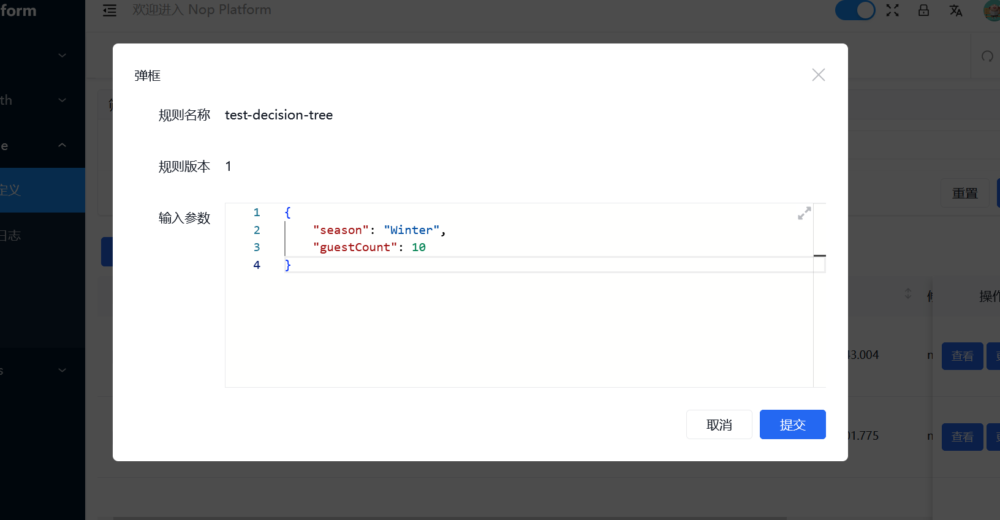
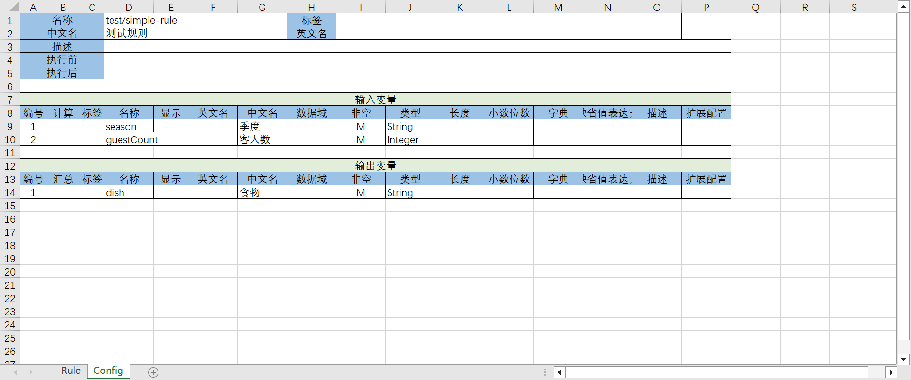
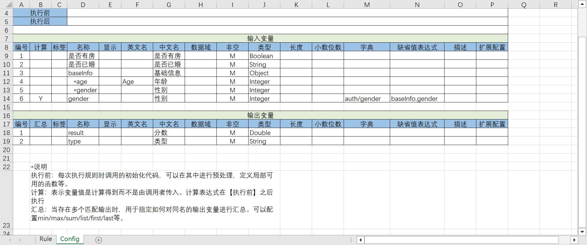
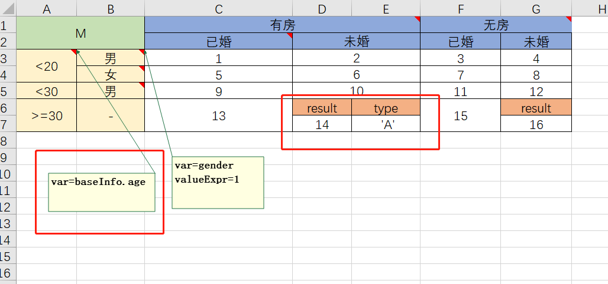

# NopRule: A Rule Engine That Uses Excel as a Visual Designer

Decision trees and decision matrices are intuitive representations of complex IF-ELSE logic for business users and are the most common and useful parts of a rule engine. Popular rule engines such as Drools do offer richer feature sets, notably the so-called RETE algorithm for efficiently reusing frequently repeated expression fragments; however, in real-world business applications the need to use the RETE algorithm is rare. In most cases we downgrade the rule engine to decision tables and decision matrices.

> A reasonable ordering of nodes in decision trees and decision matrices already provides execution optimization. In scenarios that truly require the RETE algorithm, it is typically difficult for most people to grasp intuitively, making it unsuitable for direct configuration by business users.
> Even developers may struggle with its execution details; a hand-crafted implementation can be easier to optimize. A basic decision table plus flowchart-like execution control is often more practical than using the RETE algorithm.

NopRule is a very lightweight rule engine that can be embedded in Java applications or exposed as a microservice for remote invocation.
It provides an online visual design interface and can store rule models in a database for dynamic updates. It also supports static model files, removing any dependency on database storage.

Similar to the NopReport reporting engine, NopRule can use Excel as the visual design tool, directly importing Excel-format rule models to greatly simplify the design and use of business rules.

## I. Usage

Following the approach in the nop-quarks-demo project, add the following modules to your pom file:

```xml
    <dependency>
        <groupId>io.github.entropy-cloud</groupId>
        <artifactId>nop-rule-service</artifactId>
    </dependency>

    <dependency>
        <groupId>io.github.entropy-cloud</groupId>
        <artifactId>nop-rule-web</artifactId>
    </dependency>
```

nop-rule-service provides the backend rule services. nop-rule-web contains the corresponding AMIS-based frontend management pages.

In `/_vfs/nop/demo/app.action-auth.xml`, import nop-rule.action-auth.xml, which defines the menu items used for testing

```xml
<auth x:extends="/nop/auth/auth/nop-auth.action-auth.xml,/nop/sys/auth/nop-sys.action-auth.xml,
    /nop/rule/auth/nop-rule.action-auth.xml">
</auth>
```

After startup, visit http://localhost:8080/#/NopRuleDefinition-main


## 1.1 Rule Invocation

You can call the remote rule service via the [RuleService](https://gitee.com/canonical-entropy/nop-entropy/blob/master/nop-rule/nop-rule-api/src/main/java/io/nop/rule/api/RuleService.java) interface

```javascript
Map<String,Object> inputs = new HashMap<String,Object>();
inputs.put("season","Winter");
inputs.put("guestCount",10);

RuleRequestBean request = new RuleRequestBean();
request.setRuleName("test-decision-table");
request.setInputs(inputs);

RuleResponseBean response = ruleService.executeRule(ApiRequest.build(inputs)).get();
Map<String,Object> outputs = response.getOutputs();
```

If embedded within a Java application, you can call the IRuleManager interface directly to reduce request-object wrapping and conversion

```javascript
IRuleManager ruleManager = getRuleManager();
IRuleRuntime ruleRt = ruleManager.newRuntime();
ruleRt.setInput("season", "Winter");
ruleRt.setInput("guestCount", 4);
Map<String, Object> output = ruleManager.executeRule("test/test-table", null, ruleRt);
System.out.println(JsonTool.serialize(ruleRt.getLogMessages(), true));
assertEquals("Roastbeef", output.get("dish"));
```

For detailed examples, see [TestRuleExprParser](https://gitee.com/canonical-entropy/nop-entropy/blob/master/nop-rule/nop-rule-core/src/test/java/io/nop/rule/core/expr/TestRuleExprParser.java)

When calling via RuleManager (embedded), you can pass complex input objects; when calling via RuleService, input variables should be JSON data.

## 1.2 Importing Models

On the Rule Model management page, both create and update operations allow you to import the model definition by uploading an Excel model file.



## 1.3 Testing Rules

After importing a rule model, click the Test Rule button on the row to open the test page.



After clicking Submit, a result display page is shown, where **it includes the returned set of output variables and the detailed log information produced during rule execution, revealing the exact match order and results of each rule node**.

## II. Configuration

## 2.1 Excel Model Configuration

An Excel rule model must contain two sheets: the Rule sheet configures decision rules, and the Config sheet defines input/output variables and other metadata.



Input variables are those used for rule evaluation; output variables are produced by rule nodes that meet the match conditions. To support online visual design, you need to specify display names and data types for input and output variables.

**Input variables support complex object structures**.


1. Prefix one or more `*` characters to the variable name to indicate nested object structures; the number of `*` characters corresponds to the nesting level.
2. Setting the [Calculated] column to Y indicates that this property is not provided by the external caller but is computed dynamically from output data and contextual environment variables. The expression used for the computation is specified by the [Default Expression] column.
3. Rule matching may produce multiple execution branches, each possibly generating output variables. By configuring the [Aggregate] column, you can specify how to consolidate multiple outputs into the final returned output value.

## 2.2 Rule Expressions

Configure rule evaluation expressions (RuleExpr) in input-column cells. Its syntax resembles Friendly Enough Expression Language (FEEL) and is a more readable variant of XLang Expression, parsed by [RulExprParser](https://gitee.com/canonical-entropy/nop-entropy/blob/master/nop-rule/nop-rule-core/src/main/java/io/nop/rule/core/expr/RuleExprParser.java).


1. true and false can directly specify match or no match
2. A hyphen '-' denotes true, i.e., always match
3. A numeric literal indicates strict equality match
4. A quoted string literal indicates strict equality match
5. A lone identifier is not interpreted as a variable but as a string literal. To compare against a variable, use the form == myVar
6. Comparison operators and and/or/not are supported, as are parentheses. All supported comparison operators are defined in the [FilterOp](https://gitee.com/canonical-entropy/nop-entropy/blob/master/nop-kernel/nop-core/src/main/java/io/nop/core/model/query/FilterOp.java) class
7. All global functions registered in XScript are supported

## Auto-Executed Functions After Rule Matching
Sometimes after a Rule expression matches, we want to dynamically generate output variables via a complex function. In this case, you can invoke a custom function in the output-variable column. Functions can be defined in the [Config] sheet.


## 2.3 Decision Table Configuration

For an example configuration, see [decision-tree.rule.xlsx](https://gitee.com/canonical-entropy/nop-entropy/blob/master/nop-rule/nop-rule-service/cases/io/nop/rule/service/entity/TestNopRuleDefinitionBizModel/testImport/input/decision-tree.rule.xlsx)


The top-left cell of a decision table must be the letter T (Table). It is followed by input columns and output columns. Each column in the input and output sections corresponds to an input or output variable name.

## 2.4 Decision Matrix Configuration

For an example configuration, see [decision-matrix.rule.xlsx](https://gitee.com/canonical-entropy/nop-entropy/blob/master/nop-rule/nop-rule-service/cases/io/nop/rule/service/entity/TestNopRuleDefinitionBizModel/testDecisionMatrix/input/decision-matrix.rule.xlsx)


The top-left cell of a decision matrix must be the letter M (Matrix).



1. You can configure input variable names in the first cell of each left-side column and the first cell of each header row.
2. Use the cell comment valueExpr to specify an expression; in that case the cell text is only a display label. If not configured, the cell text itself is treated as the expression.
3. Multiple output values can be configured

### 2.5 Online Editing

Decision tree models can be edited online; rule-match conditions are configured using AMIS's ConditionBuilder control


## III. Design Principles

Within the overall design of the Nop platform, NopRule abstracts complex evaluation logic; its core component is the Filter model


## 3.1 Filter Model

The filter model is defined by the [filter.xdef](https://gitee.com/canonical-entropy/nop-entropy/blob/master/nop-kernel/nop-xdefs/src/main/resources/_vfs/nop/schema/query/filter.xdef) meta-model and describes complex and/or conditions

```xml
<and>
    <or>
        <eq name="status" value="1" />
        <eq name="status" value="2" />
    </or>
    <gt name="amount" value="3" />
</and>
```

1. The Nop platform consistently uses the Filter model wherever conditional logic must be expressed; in Java this corresponds to the ITreeBean type
2. With bidirectional XML/JSON conversion, Filter models can be stored in XML or JSON
3. Advanced queries in the Nop platform use the Filter model, which the backend converts to SQL via the [FilterBeanToSQLTransformer](https://gitee.com/canonical-entropy/nop-entropy/blob/master/nop-kernel/nop-core/src/main/java/io/nop/core/lang/sql/FilterBeanToSQLTransformer.java) class
4. The frontend AMIS ConditionBuilder control persists complex conditions as Condition objects. [ConditionExprHelper](https://gitee.com/canonical-entropy/nop-entropy/blob/master/nop-frontend-support/nop-web-page/src/main/java/io/nop/web/page/condition/ConditionExprHelper.java) performs bidirectional conversion between Condition and the Filter model.
5. The Filter model can be compiled into an IEvalPredicate via [FilterBeanToPredicateTransformer](https://gitee.com/canonical-entropy/nop-entropy/blob/master/nop-rule/nop-rule-core/src/main/java/io/nop/rule/core/model/compile/FilterBeanToPredicateTransformer.java) to execute filtering logic directly in memory,
6. Filter models can also be executed in memory via [FilterBeanEvaluator](https://gitee.com/canonical-entropy/nop-entropy/blob/master/nop-kernel/nop-core/src/main/java/io/nop/core/model/query/FilterBeanEvaluator.java)
7. The Filter model and the Expression language support reversible conversion via [FilterBeanExpressionCompiler](https://gitee.com/canonical-entropy/nop-entropy/blob/master/nop-kernel/nop-xlang/src/main/java/io/nop/xlang/xpl/tags/FilterBeanExpressionCompiler.java) and [ExpressionToFilterBeanTransformer](https://gitee.com/canonical-entropy/nop-entropy/blob/master/nop-kernel/nop-xlang/src/main/java/io/nop/xlang/expr/filter/ExpressionToFilterBeanTransformer.java)

## 3.2 Schema Model

Wherever an object type needs to be defined, the Nop platform uniformly uses the schema model, defined by the meta-model [schema.xdef](https://gitee.com/canonical-entropy/nop-entropy/blob/master/nop-kernel/nop-xdefs/src/main/resources/_vfs/nop/schema/schema/schema.xdef).

1. XDef meta-models and Schema models can be converted to each other. XDef defines XML structures, while Schema defines objects and JSON structures.
2. [SimpleSchemaValidator](https://gitee.com/canonical-entropy/nop-entropy/blob/master/nop-kernel/nop-xlang/src/main/java/io/nop/xlang/xmeta/SimpleSchemaValidator.java) can verify whether a value conforms to the schema constraints
3. [XSchemaToJsonSchema](https://gitee.com/canonical-entropy/nop-entropy/blob/master/nop-kernel/nop-xlang/src/main/java/io/nop/xlang/xmeta/jsonschema/XSchemaToJsonSchema.java) converts schema objects into JSON Schema definitions
4. [ConditionSchemaHelper](https://gitee.com/canonical-entropy/nop-entropy/blob/master/nop-frontend-support/nop-web-page/src/main/java/io/nop/web/page/condition/ConditionSchemaHelper.java) transforms input-variable definitions from the rule model into schema definitions supported by the frontend ConditionBuilder control.

## 3.3 Excel Data Model

The Nop platform provides bidirectional conversion between the Excel data model and Java domain-model objects, enabling Excel parsing and object export to Excel without coding. For details, see [excel-import.md](https://gitee.com/canonical-entropy/nop-entropy/blob/master/docs/dev-guide/report/excel-import.md)

* When parsing Excel-format rule models, NopRule uses the standard Excel conversion mechanism for the Config sheet.

```
 RuleModel rule = ImportModelHelper.parseSheet(sheetModel, configSheet, compileTool, scope, RuleModel.class);
```

* NopRule defines external service interfaces using an Excel-formatted API model and automatically generates the corresponding interface definitions and service skeleton classes; see [nop-rule.api.xlsx](https://gitee.com/canonical-entropy/nop-entropy/blob/master/nop-rule/model/nop-rule.api.xlsx)

## Summary

NopRule is implemented using the Nop platform's core technical strategy:

1. Define domain models via meta-models
2. Prefer automatic inference to achieve bidirectional model conversion, minimizing hard-coded logic
3. By reusing foundational generic models such as Filter and Expression, we can quickly assemble more complex domain models, such as rule models

The low-code platform NopPlatform, designed based on Reversible Computation theory, is open source:

- gitee: [canonical-entropy/nop-entropy](https://gitee.com/canonical-entropy/nop-entropy)
- github: [entropy-cloud/nop-entropy](https://github.com/entropy-cloud/nop-entropy)
- Development examples: [docs/tutorial/tutorial.md](https://gitee.com/canonical-entropy/nop-entropy/blob/master/docs/tutorial/tutorial.md)
- [Principles of Reversible Computation and Nop Platform Introduction & Q&A — Bilibili](https://www.bilibili.com/video/BV1u84y1w7kX/)
<!-- SOURCE_MD5:8e12bca01b1390b0c37e4d671185f2d8-->
