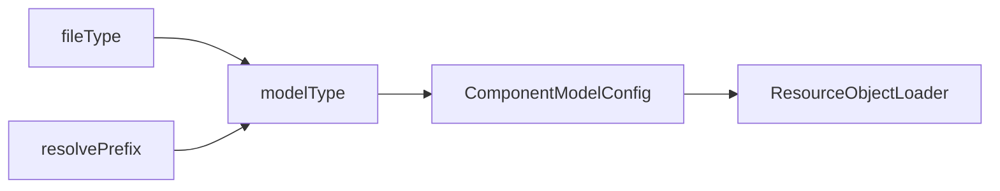

# Loading DSL Model Files

[Bilibili explainer video](https://www.bilibili.com/video/BV1rH4y117hd/)

In the Nop platform, ResourceComponentManager is uniformly used to load DSL models.

```javascript
model = ResourceComponentManager.instance().loadComponentModel(path);
```

## Two path formats are supported when loading:

1. A regular virtual path, e.g., `/nop/rule/test/myRule/v1.rule.xml`, which directly specifies the corresponding resource file; the VirtualFileSystem handles Delta path resolution.
2. Use the resolve mechanism to dynamically determine the resource file, e.g., `resolve-rule:test/myRule`. The underlying target can be a resource file managed by the virtual file system or a data record stored in the database.

## Registering Loaders

During platform initialization, it automatically collects the registration info defined in all /nop/core/registry/xxx.register-model.xml model registration files, establishing a mapping between file type (fileType) and loader (ResourceObjectLoader).

> The difference between fileType and fileExt is that fileType looks for the last two dots in the fileName, rather than the last one. For example, a.orm.xml corresponds to fileType=orm.xml, while fileExt=xml.

### Registration Configuration for the RuleModel Loader

```xml
<model x:schema="/nop/schema/register-model.xdef" xmlns:x="/nop/schema/xdsl.xdef"
       name="rule">

    <!--
        resolve-rule: Search for model files with different suffixes under /nop/rule; if none exist, use nopDaoRuleModelLoader to look them up in the database.
    -->
    <resolve-handler resolveInDir="/nop/rule" defaultLoaderBean="nopDaoRuleModelLoader" />

    <loaders>

        <loader fileType="rule.xlsx"
                class="io.nop.rule.core.model.compile.RuleExcelModelLoader"/>

        <loader fileType="rule.xml"
                class="io.nop.rule.core.model.compile.RuleDslModelLoader"/>

    </loaders>

</model>
```

resolve-rule:test/myRule/v1 will look for

1. /nop/rule/test/myRule/v1.rule.xlsx
2. /nop/rule/test/myRule/v1.rule.xml
3. Check the rule model defined in the NopRuleDefinition table, ruleName=test/myRule

## Implementation of loadComponentModel

The basic logic is to determine the model type (modelType) based on the file type or the resolve prefix, then obtain the registered ComponentModelConfig via modelType, and use the Loader defined therein to actually parse the DSL model.

* ResourceLoadingCache is used during loading to cache parsing results.
* ResourceLoadingCache automatically tracks changes in model dependencies. If any file on which the model parsing depends changes, the model cache will automatically become invalid.



1. Derive fileType from the virtual file path vPath, and then obtain modelType.
2. Alternatively, derive modelType from a dynamic resolve path like `resolve-{modelType}:`.
3. Fetch the corresponding ResourceLoadingCache based on modelType.
4. ResourceLoadingCache checks whether the dependent files in the depends set have changed; if not, it returns the cached parsing result.
5. Within the ResourceLoadingCache’s Loader, obtain the specific Loader based on fileType.

Currently, the system has two built-in special loaders that can directly use meta-model definitions without writing custom Loader classes.

1. xslx-loader: parses Excel model files
2. xdsl-loader: parses XML files defined by xdef models

For example, the ORM model registration configuration is:

```xml
<model x:schema="/nop/schema/register-model.xdef" xmlns:x="/nop/schema/xdsl.xdef"
       name="orm">
    <loaders>
        <xlsx-loader fileType="orm.xlsx" impPath="/nop/orm/imp/orm.imp.xml"/>
        <xdsl-loader fileType="orm.xml" schemaPath="/nop/schema/orm/orm.xdef"/>
    </loaders>
</model>
```
<!-- SOURCE_MD5:2726bcb0668cfbfc8edcd46ee02b0e90-->
