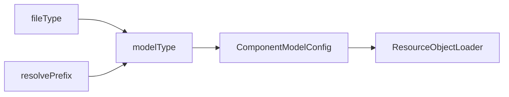

# DSL Model File Loading

[Bilibili Video Explanation](https://www.bilibili.com/video/BV1rH4y117hd/)

In the Nop platform, unified use of ResourceComponentManager is made for loading DSL models.

```javascript
model = ResourceComponentManager.instance().loadComponentModel(path);
```

## Loading Supports Two Path Formats:

1. Normal virtual path, such as `/nop/rule/test/myRule/v1.rule.xml`, directly specifying the corresponding resource file, handled by VirtualFileSystem to resolve Delta paths.
2. Using resolve mechanism dynamically determine the resource file, such as `resolve-rule:test/myRule`, where the underlying resource can be managed by VirtualFileSystem or stored in the database.

## Register Loader

During platform initialization, all `/nop/core/registry/xxx.register-model.xml` model registration files are automatically collected to establish a mapping between file type and loader (ResourceObjectLoader).

> **Note**: The difference between `fileType` and `fileExt` lies in that `fileType` searches for the last two dots in the filename, not the last dot. For example, `a.orm.xml` corresponds to `fileType=orm.xml`, while `fileExt=xml`.

### RuleModel Loader Registration Configuration

```xml
<model x:schema="/nop/schema/register-model.xdef" xmlns:x="/nop/schema/xdsl.xdef"
       name="rule">
    <!--
    resolve-rule: Looks for model files with different suffixes in the `/nop/rule` directory. If not found, it uses `nopDaoRuleModelLoader` to search in the database.
    -->
    <resolve-handler resolveInDir="/nop/rule" defaultLoaderBean="nopDaoRuleModelLoader" />

    <loaders>
        <loader fileType="rule.xlsx"
                class="io.nop.rule.core.model.compile.RuleExcelModelLoader"/>

        <loader fileType="rule.xml"
                class="io.nop.rule.core.model.compile.RuleDslModelLoader"/>
    </loaders>

</model>
```

resolve-rule:test/myRule/v1 will search for:

1. `/nop/rule/test/myRule/v1.rule.xlsx`
2. `/nop/rule/test/myRule/v1.rule.xml`
3. `testRule` defined in the NopRuleDefinition table, with ruleName=test/myRule.

## loadComponentModel Implementation

The basic logic is to determine the model type based on file type or resolve prefix, then obtain the registered ComponentModelConfig using the determined model type, and use the corresponding loader to actually parse the DSL model.

- During loading, ResourceLoadingCache is utilized for caching of parsing results.
- ResourceLoadingCache automatically tracks changes in model dependencies. If any dependent file changes during parsing, the cache will automatically invalidate.



1. Determine file type based on virtual path (vPath), then determine model type (modelType).
2. Or determine model type using `resolve-{modelType}` dynamic parsing mechanism.
3. Obtain ResourceLoadingCache based on modelType.
4. ResourceLoadingCache checks if any dependencies have changed; if so, returns cached parsing result.


5. In the Loader of ResourceLoadingCache, retrieve the specific Loader based on fileType.

The system currently has two built-in loaders that can be used directly without needing to write a custom Loader class.

1. xslx-loader: Parsers Excel model files
2. xdsl-loader: Parses xdef-defined XML files

For example, the registration configuration of an ORM model is as follows:

```xml
<model x:schema="/nop/schema/register-model.xdef" xmlns:x="/nop/schema/xdsl.xdef"
       name="orm">
    <loaders>
        <xlsx-loader fileType="orm.xlsx" impPath="/nop/orm/imp/orm.imp.xml"/>
        <xdsl-loader fileType="orm.xml" schemaPath="/nop/schema/orm/orm.xdef"/>
    </loaders>
</model>
```
