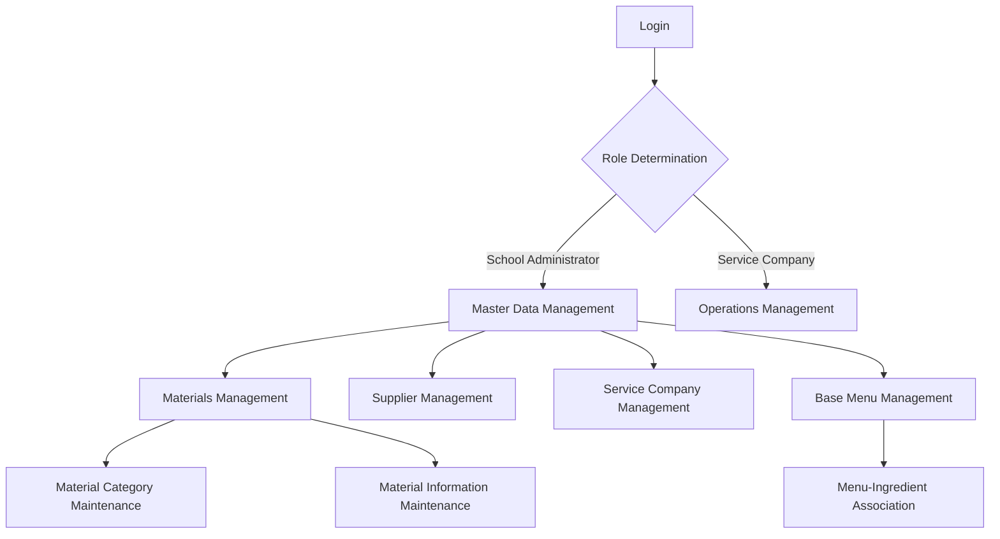
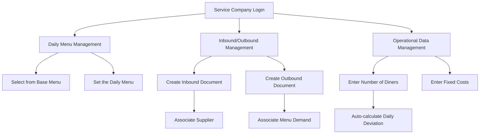
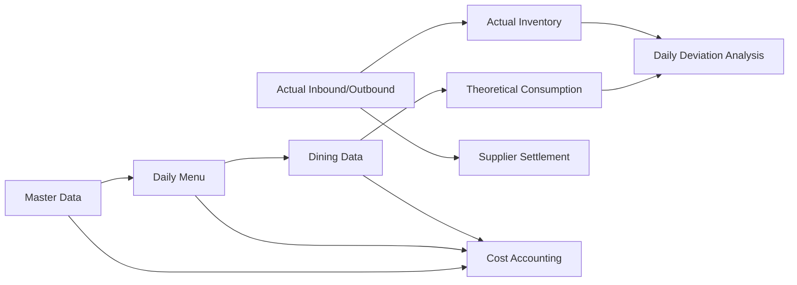

# Detailed Design of the Canteen Material Management System

## Roles and Permissions Design

### 1. Role Definitions

| Role Name | Description | System Permissions |
|---------|------|---------|
| School Administrator | Responsible for maintaining system master data, daily supervision, and statistical analysis | Master Data Management, Data Query, Statistical Analysis |
| Service Company Administrator | Management personnel of the cafeteria operating unit, responsible for daily operational data entry | Operations Management, Data Entry, Supplier Settlement |

### 2. Permission Matrix

| Module | Sub-function | School Administrator | Service Company Administrator |
|---------|--------|------------|----------------|
| Materials Management | CRUD | Read/Write | Read-Only |
| Supplier Management | CRUD | Read/Write | Read-Only |
| Service Company Management | CRUD | Read/Write | Read-Only (Self only) |
| Base Menu Management | CRUD | Read/Write | Read-Only |
| Warehouse Management | CRUD | Read-Only | Read/Write (Own only) |
| Daily Menu Management | CRUD | Read-Only | Read/Write (Own only) |
| Inbound/Outbound Management | CRUD | Read-Only | Read/Write (Own only) |
| Inventory Counting | Operations | Read-Only | Read/Write (Own only) |
| Supplier Settlement | Operations | Read-Only | Read/Write |
| Operational Data Management | CRUD | Read-Only | Read/Write (Own only) |
| Statistical Analysis | Various Reports | Read/Write | Read-Only (Own data only) |

## Menu Design

### 1. School Administrator Menu
- Master Data Management
  - Materials Management
  - Supplier Management
  - Service Company Management
  - Base Menu Management
- Supervision Center
  - Inbound/Outbound Query
  - Operational Data Query
  - Inventory Monitoring
- Statistical Analysis
  - Material Statistics Report
  - Cost Analysis Report
  - Operational Performance Analysis
- System Settings
  - User Management
  - Role Permissions
  - System Parameters

### 2. Service Company Administrator Menu
- Operations Management
  - Warehouse Management
  - Daily Menu
  - Inbound/Outbound Management
  - Inventory Counting
- Supplier Settlement
  - Settlement Document Management
  - Payment Records
- Operational Data
  - Number of Diners Entry
  - Fixed Cost Entry
  - View Daily Deviation
- Data Query
  - Inventory Query
  - Historical Menus
  - Inbound/Outbound Records

## Detailed Design of Functional Modules

### 1. Master Data Management Module

#### Feature List (Priority)
1. Materials Management (P0)
  - Multi-level Material Category Management
  - Material CRUD operations
  - Material Image Upload
  - Material Inventory Query
2. Supplier Management (P0)
  - Supplier CRUD
  - Enable/Disable Supplier
  - Supplier Qualification Management
3. Service Company Management (P0)
  - Service Company CRUD
  - Enable/Disable Service Company
4. Base Menu Management (P1)
  - Base Menu CRUD
  - Menu Ingredient Management
  - Menu Cost Calculation

#### Interaction Flowchart

#### Core Business Logic
- Material categories use a tree structure and support unlimited levels
- Material codes are auto-generated following the rule "Category Code + Serial Number"
- Enable/disable status of suppliers and service companies affects related business operations
- Base menus associate ingredients with materials and automatically calculate dish costs

### 2. Operations Management Module

#### Feature List (Priority)
1. Warehouse Management (P1)
  - Warehouse CRUD
2. Daily Menu Management (P0)
  - Select from Base Menu
  - Manage by Date
  - Lock on Settlement Date
3. Inbound/Outbound Management (P0)
  - Inbound Document Management
  - Outbound Document Management
  - Whole In/Whole Out
  - Document Locking
4. Inventory Counting (P1)
  - Inventory Stocktake
  - Handle Inventory Gain/Loss
5. Supplier Settlement (P1)
  - Generate Settlement Documents
  - Payment Records
6. Operational Data Management (P0)
  - Number of Diners Entry
  - Fixed Cost Entry
  - Daily Deviation Calculation

#### Interaction Flowchart

#### Core Business Logic
- Daily menus must be selected from the base menu and cannot be customized
- Inbound/outbound documents contain line items and affect real-time inventory
- Outbound operations can be associated with menus to automatically calculate theoretical consumption
- Daily Deviation = Theoretical Consumption (based on number of diners) − Actual Outbound Quantity
- Data after the settlement day is automatically locked and cannot be modified

### 3. Statistical Analysis Module

#### Feature List (Priority)
1. Material Statistics (P1)
  - Inbound/Outbound Summary
  - Inventory Alerts
2. Cost Analysis (P0)
  - Dish Cost Analysis
  - Operational Cost Analysis
3. Operational Performance (P1)
  - Service Company Performance
  - Supplier Evaluation

#### Core Business Logic
- Cross analysis based on the time dimension, material dimension, and service company dimension
- Cost analysis combines actual consumption with theoretical consumption based on standard recipes
- Performance evaluation considers indicators such as cost control and inventory turnover rate

## Data Flow Design

## Key Business Rules

1. Data Locking Rules:
  - Automatically lock related data after the settlement day
  - Manually locked documents require superior-level unlocking

2. Inventory Change Rules:
  - Inbound increases inventory
  - Outbound decreases inventory
  - Adjust inventory for gains/losses from stocktake

3. Access Control Rules:
  - Service companies can only operate on their own data
  - Sensitive operations must be recorded in the operation log

4. Cost Calculation Rules:
  - Dish Cost = ∑ (Ingredient Quantity × Latest Inbound Unit Price)
  - Operational Cost = Fixed Cost + Ingredient Cost

5. Deviation Analysis Rules:
  - Daily Deviation Rate = (Actual Consumption − Theoretical Consumption) / Theoretical Consumption
  - Continuous abnormal deviations trigger alerts

<!-- SOURCE_MD5:575e4a0a36a2a3ec36aa4a966b2840e5-->
