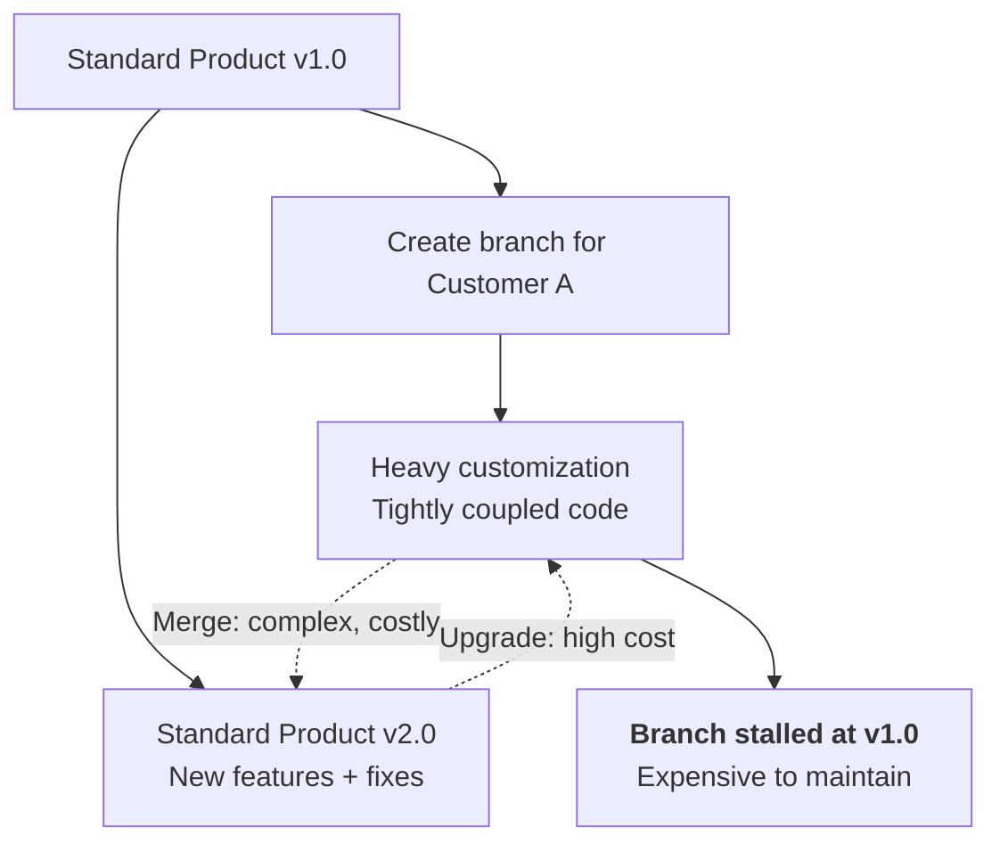
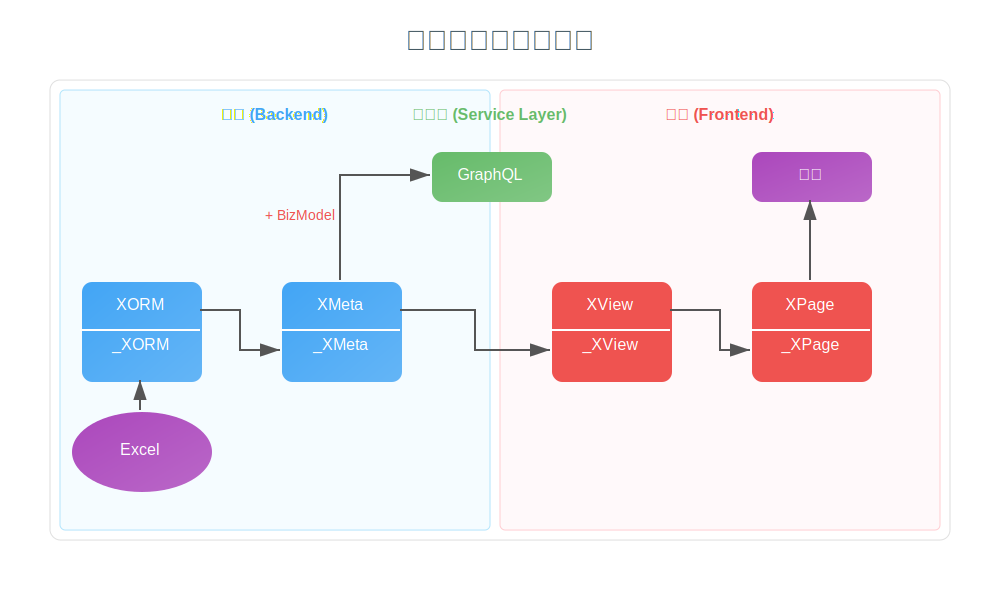

# Nop Platform: Next-Generation Software Architecture Based on Reversible Computation Theory

## About the Author

- Graduated in 2002 from the Department of Engineering Physics, Tsinghua University
- 20+ years of architecture design experience
- Currently Chief Architect for the China region at a large multinational company
- Responsible for APAC next-generation credit card core system architecture design
- Proposer of the Reversible Computation theory and founder of the open-source Nop platform

## Talk Agenda
1. Why a next-generation software architecture is needed 
2. Introduction to Reversible Computation 
3. Overall architecture of the Nop platform ️
4. Core engines and technology comparisons 
5. How to integrate and apply


## Current Predicament: The Quagmire of Customized Development



**Vicious cycle:**
- Accumulation of technical debt
- Branch proliferation
- Maintenance cost grows exponentially

## Theoretical Bottlenecks of Traditional Approaches

### Granularity Paradox
- Goal: Build a large, general-purpose common core
- Contradiction: Reuse happens on the common part between A and B, which is smaller than both A and B
- Result: Fundamental conflict between the coarse-grained goal of whole reuse and the fine-grained means of component abstraction

### Prediction Paradox
- Requirement: Predefine stable extension points
- Dilemma:
  - Few extension points → rigid architecture
  - Many extension points → architecture dissolution
- Result: Perfectly predicting future changes is impossible

Conclusion: This is the theoretical ceiling of “assembly-style reuse”, not an engineering problem.

## Inspiration from Physics

Wave-particle duality: quantum entities have two mutually exclusive yet complementary descriptions—wave and particle

- Particle perspective: reductionism
  - Decomposition and composition of discrete entities
  
- Wave perspective: superposition
  - Non-invasive superposition and interference of continuous patterns

Question: Can we build software via non-invasive superposition rather than assembly?

### Natural Evolution of Theory: Reversible Computation

- Object-oriented: implicit Delta (A > B) — reuse constrained by inheritance
- Component-oriented: explicit addition (A = B + C) — Delta C becomes a component
- Reversible Computation: algebraic transformation (B = A + (-C)) — introduces a formal inverse element

Core formula: `App = Delta x-extends Generator<DSL>`


### Real-World Reference: Docker as a Practice of Reversible Computation

Docker build process
` App = DockerBuild<Dockerfile> overlay-fs BaseImage`

| Docker Concept | Reversible Computation Concept |
|----------------|-------------------------------|
| DockerBuild<Dockerfile> | Generator<DSL> |
| overlay-fs (union file system) | x-extends (Delta merge) |

Any innovation around Delta can be subsumed under the framework of Reversible Computation theory.

### Delta Customization
Non-invasive, precise modifications

1. File-level override: Delta layer files `/_delta/xxx/` automatically override base files
2. In-file merge: Precise, surgical modifications to XML/JSON/YAML structural trees

```xml
<!-- Delta file example -->
<beans x:extends="super">
    <bean id="service" class="com.cust.a.CustomService"/> 
    <bean id="oldService" x:override="remove"/>
	 <bean id="auditLogger" class="com.customer.AuditLogger"
          feature:on="auditing.enabled"/>
</beans>
```

## Nop Platform Core Architecture

 <!-- width:400px;height:auto; -->

- Foundation Layer: XLang language | Delta merge | Unified metaprogramming framework
- Engine Layer: DSL forest based on a unified XDSL mechanism 
- Application Layer: DDD domain design | Full code generation
- Global Delta customization: Non-invasive modifications at any level, balancing standardization and personalization

## Why Nop Is the Next-Generation Software Architecture

- Reconstructs the software production paradigm based on Reversible Computation theory:
   The core is an algebraic software generation paradigm of Generator + Delta, providing a new mathematical foundation and decoupling approach that surpasses traditional “assembly-style” development

- Significantly reduces system complexity through model-driven and language-oriented approaches:
    Compared to traditional Spring/microservices architectures, declarative domain-specific languages (DSLs) replace large amounts of glue code and configuration, reducing code volume by more than tenfold and greatly lowering cognitive load.

- Provides a theory-level solution for system-level extensibility and productized reuse:
    Through metaprogramming and Delta customization, achieves non-invasive system-level extension, enabling coarse-grained software products (e.g., an entire SaaS platform) to be efficiently and losslessly reused and customized like classes, offering a feasible technical path for “software product line” engineering.


## Nop vs. Spring Tech Stack Comparison

| Domain         | Nop           | Spring           |
|----------------|---------------|------------------|
| Scripting Language | XLang         | Spring EL/FreeMarker |
| Dependency Injection | NopIoC        | Spring IoC       |
| Data Access       | NopORM        | JPA/MyBatis      |
| Web Services        | NopGraphQL    | SpringMVC        |
| Distributed       | NopRPC/NopTcc    | Feign/Seata  |
| Business Process       | NopWorkflow/NopTaskFlow   | Flowable         |
| Business Rules | NopRule | Drools|
| Batch Processing     | NopBatch      | Spring Batch     |
| Reporting       | NopReport     | JasperReports    |


## Nop: Framework-neutral, Seamless Integration

- Collaboration, not replacement: Nop adopts a framework-neutral design and can work with foundational frameworks such as Spring, Quarkus, and Solon
- Pluggable capabilities: Individual components can be selected as needed, with virtually no mutual dependencies

| Adoption Mode | Capabilities Gained | Applicable Scenarios |
|---------------|---------------------|----------------------|
| Full-stack usage | Maximum innovation capability and customizability | New system development |
| Component selection | Use engines like ORM/Report standalone | Partial enhancement of existing systems |
| Mechanism reuse | Introduce only Delta customization capability | Quickly achieve productized customization |

Use Nop to enhance existing systems, not to tear them down and rebuild

## Full-stack Model-Driven Development



The Nop platform’s built-in development process forms a complete model-driven development loop:
Excel data model → ORM model → Meta metadata model → Front-end view model → Page files, with each stage supporting Delta adjustments

## Customization Examples
- Data model customization: flexible adjustments to table fields and relationships
- Extension field support: one-click enablement of built-in dynamic extension capability
- Service interface customization: freely customize message request and response structures
- Process customization: rewrite business processing logic and rules
- Bean component customization: remove and replace platform components
- Page view customization: component replacement and partial page reuse

All customization changes require no modifications to the base product or the Nop platform

### Summary and Outlook

Nop’s paradigm shift:
- From “Extension Points Everywhere” to “Overlays Above Everything”
- From “1 core + N forks” to “1 base + N deltas”
- Effective System = Base ⊕ ΔIndustry ⊕ ΔRegion ⊕ ΔCustomer

Vision: Provide key technical support for intelligent software production in the AI era

### Q&A

Questions and discussion

- WeChat Official Account 
- WeChat Group 

<!-- SOURCE_MD5:3af457eb23a6b0a16cef4e74fc3ffa10-->
