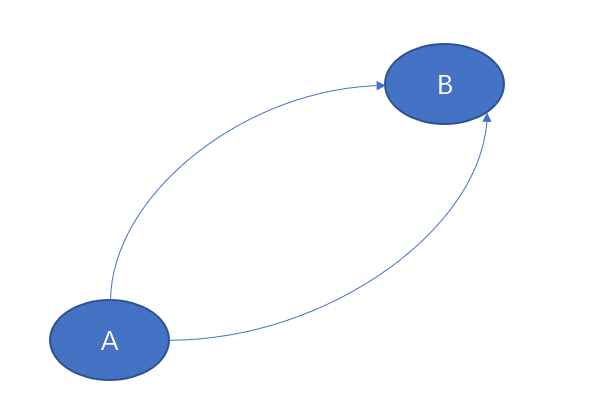

# Revisiting Baidu AMIS and Declarative Programming

In response to my previous article [Why Baidu AMIS is an excellent design](https://zhuanlan.zhihu.com/p/599773955), someone raised a question: Is the [Api object](https://aisuda.bce.baidu.com/amis/zh-CN/docs/types/api) defined in AMIS really necessary? Traditional event listening approaches can solve the problem—what’s the point of introducing an extra concept?

To answer this, let’s look at a concrete example:

```json
{
    "type": "form",
    "body":[
        {
        "type": "select",
           "name": "a",
           "options" : [ ...]
        },
        {
            "type": "select",
            "name": "b",
            "source": {
                "method" : "post",
                "url" : "/get-related-options",
                "data": {
                     "value": "${a}"
                 }
            }
        }
    ]
}
```

In the example above, the first select control is named a, meaning its selected value corresponds to the variable named a in the contextual environment. The select control can be regarded as both a viewer and an editor of that variable. The other select control’s source attribute corresponds to an [Api-typed object](https://aisuda.bce.baidu.com/amis/zh-CN/docs/types/api). It listens to changes in variable a through a data-binding expression and, when a changes, automatically executes an AJAX call to retrieve a new list of options.

In this example, event binding and event handling for the select control are implicit. We don’t see explicit trigger timings, nor can we directly intervene in the handling process. Does this imply we lose fine-grained control over the program’s logic?

If we recall the evolution of frontend frameworks, this is not something to worry about, because we have been consistently moving away from fine-grained control over low-level details. In the era when jQuery was popular, we frequently manipulated underlying DOM model objects, calling methods on DOM objects to find child nodes, update attributes, and so on. For instance, to implement editing of list data, create/update/delete operations required listening to the click events of corresponding buttons, then locating target DOM objects by class or id and invoking methods on those objects to update the UI. In modern frameworks like Vue and React, the presence of DOM objects has been reduced to a minimum. The virtual DOM is merely a data record generated by templates or JSX, rather than an object with intrinsic standalone value and a large number of properties and methods. Based on the virtual DOM concept, we only need to write a render function against the current state data; when the state data is added, modified, or deleted, the frontend framework will automatically derive the update logic for the UI.

By giving up explicit use of DOM objects and fine-grained control over the DOM update process, we gain a more compact way to express business logic, as well as the ability to migrate to non-browser runtimes via React Native.

> Many data-driven frameworks are also gradually enhancing their observability. They can listen to data changes via watch or subscribe, and even support history and time-travel. The difference from traditional event listening is that we are not listening to component events unrelated to the business; instead, we directly listen to changes in business data or actions with clear business semantics.

## Declarative vs. Imperative

The evolution of frontend frameworks can be viewed as a continuous transition from the imperative programming paradigm to the declarative programming paradigm.



Imperative means we explicitly specify an execution path from A to B, with every step’s detail under our control. Declarative means we merely state that we need to move from A to B. Since multiple potential paths may exist, the system will, according to certain rules or cost considerations, automatically derive a specific path from A to B.

Because declarative approaches focus only on the endpoints of a path and ignore many details, they naturally introduce optimization opportunities. For example, in Vue and React, the virtual DOM produced by the render function represents the UI structure we expect to produce. Through virtual DOM diff operations, we can analyze which parts of the UI actually change relative to the previous state, and then automatically generate an optimal DOM update strategy. If we handwrite DOM read/write methods, a non-optimized read/write order may cause the browser’s layout engine to run multiple times, leading to poor performance.

Declarative styles focus only on the effect on the final state, without caring about the precise steps and order of the intermediate process, which often allows optimization via caching or deferred processing. For example, within one event trigger, a state variable might be modified multiple times; we only need to ensure that the last modification is ultimately reflected in the UI, while the previous changes can be automatically ignored.

State is the endpoint of the path; essentially, it is the surface of the path. When we examine the state space formed by business states, we generally find that the number of states we need to pay attention to is far less than the number of possible transition paths (akin to dimensionality reduction). For example, if our data-binding expression uses only the state variable a, then no matter which path leads to the state a=1, the triggered related computations are identical.

> In physics, at the introductory level we learn Newtonian mechanics, which uses the concept of force and focuses on precise trajectories of motion and the external forces at every point along them. In more advanced formulations, we use energy and action, solving for the optimal path between two points in state space that minimizes the action to derive the process that occurs in the real physical world.

In a low-code frontend framework like AMIS, information transmission is implemented as much as possible using reactive data binding, thus minimizing the need for imperative code and increasing the share of declarative descriptions across the page. On further reflection, once reactive data binding is comprehensively adopted, the importance of component objects themselves diminishes (similar to DOM objects). At the implementation level, we may even avoid requiring the underlying runtime to provide corresponding component structures!

```html
<select id="a" onchange="handleChange">
</select>
<select id="b">
</selection>

<script>
function handleChange(value){
    fetchRelatedOptions(value).then(result=>{
        getComponent('b').setOptions(result)
    })
}
</script>
```

In traditional event handler functions, we obtain the relevant component object and call its methods, such as getComponent('b').setOptions(result). This requires the system to provide a code-accessible component object at runtime, and that it must expose a setOptions member function. When using reactive Api objects, we can express business logic without touching the concept of Components at all—every input, output, and processing step is business-related state data, rather than UI components and their properties. AMIS’s JSON description is merely information fed to the underlying engine; it does not require corresponding components to exist at runtime, nor does it require underlying components to provide the properties used in the JSON description. We can entirely decompose a complex component into multiple atomic components at compile time, and the runtime only needs to support certain atomic components. For example, in the Nop platform, based on AMIS JSON we provide a compile-time control. During the loading of AMIS JSON, we identify compile-time XPL tags and execute them to dynamically generate AMIS descriptions. This can be seen as a purely functional component that exists only at compile time and not at runtime.

> AMIS also performs some structural transformations when loading JSON descriptions to handle version compatibility, such as converting deprecated property names. If we explicitly use those component property names in code, compatibility handling becomes significantly more difficult.

## Natural evolution of data binding: from computed to Api

The [Api object](https://aisuda.bce.baidu.com/amis/zh-CN/docs/types/api) in AMIS can be viewed as a natural evolution of the reactive data binding mechanism.

In Vue 3.0, values passed to component props fall into three categories: 1) constant values, 2) variable values, and 3) Ref references (conceptually, a Reactive object can be regarded as a special kind of Ref). A Ref reference is essentially an information conduit: construct once (pass in and hold the Ref), use many times (each time a new value flows through the Ref, external observers are automatically triggered). To maximize the value of this conduit, we obviously need to enrich the sources of conduit data and support recombination and processing of that data.

[computed](https://vue3js.cn/reactivity/computed.html) is a special Ref—it is no longer a simple mutable value, but is associated with executable code. Computed is essentially a wrapper around a function, but we only care about its return value. From a data perspective, a function becomes a reactive value with automatic updates. Anywhere a value is required, a computed value can be naturally supplied.

Computed is a Ref wrapper around a synchronous function, whereas AMIS’s Api object can be considered a Ref wrapper around a remote asynchronous call. Building on this, we can further wrap streaming data—this is the Service container in AMIS. A Service container can encapsulate a WebSocket connection; each time backend data is received, it automatically updates its current value. It can also perform polling at regular intervals and update the current value upon data retrieval.

> My personal view is that, if designing from scratch, AMIS’s Service and Api concepts could be unified, and the Service container’s Schema-loading capability split out.

## Summary

From the perspective of declarative programming, introducing the Api object in the AMIS framework is an entirely reasonable and natural choice.

<!-- SOURCE_MD5:c946cc0207f2ca3ff39f155eacff0e40-->
