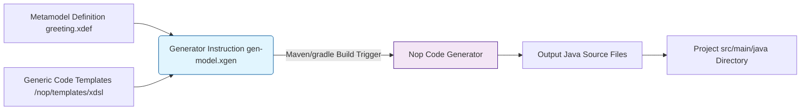
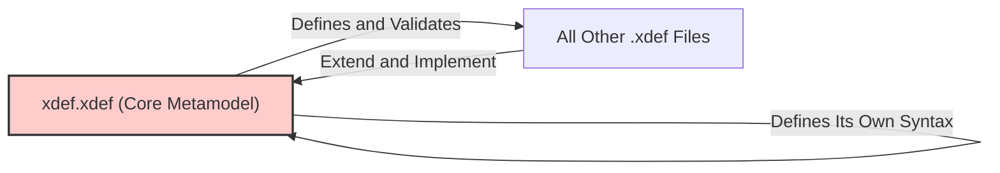
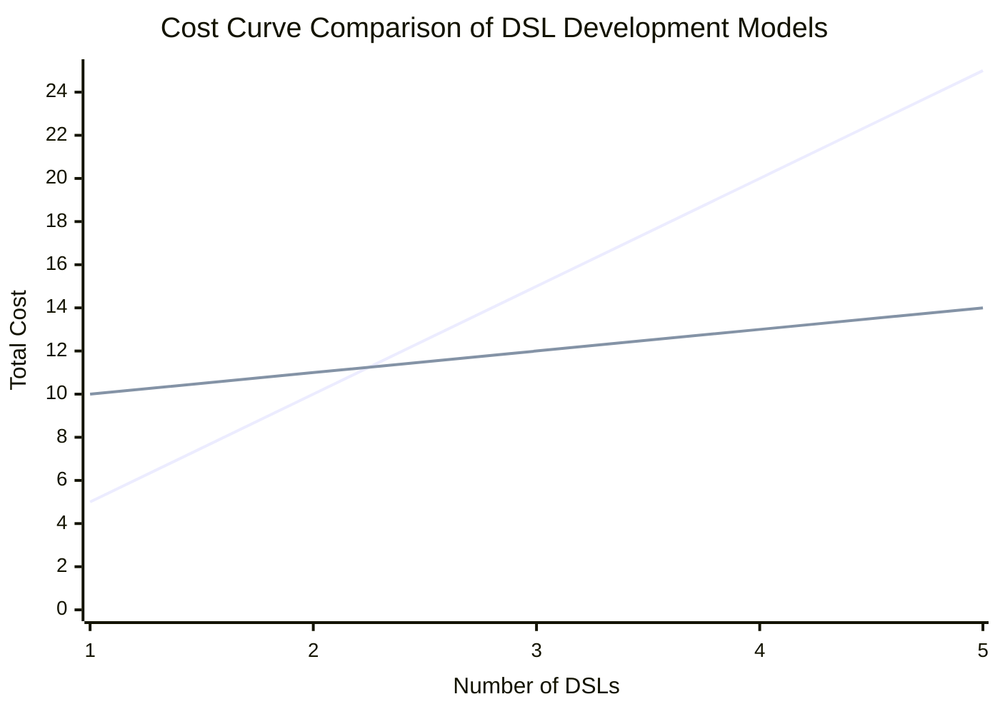
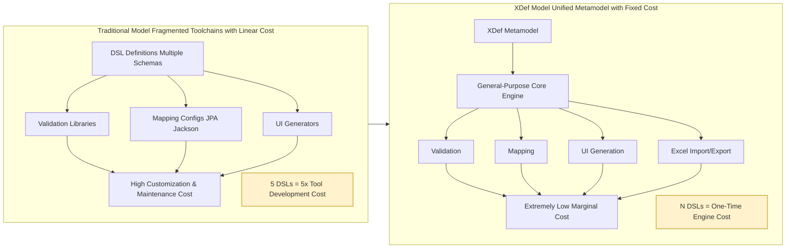

# XDef: An Evolution-Oriented Metamodel and Its Construction Philosophy

Abstract: This article introduces XDef in the Nop Platform, a systematic solution built on a Unified Metamodel Specification, a Bootstrapping design, and a Delta merge mechanism. It aims to fundamentally resolve the core tension between software normativity/consistency and flexibility/evolvability, and to reduce the development cost of DSL toolchains from the traditional O(N) to O(1). We will explore its design principles, engineering economics, and applicability boundaries.

Throughout the evolution of software construction, we have grappled with a central dilemma: how to endow a system with maximum flexibility and evolvability while ensuring consistency and normativity. Traditional methodologies often pit the two against each other, seeking a fragile balance through complex plugin architectures, event buses, or configuration management systems. However, these approaches usually lead to toolchain fragmentation and exponentially growing cognitive load.

Against this backdrop, XDef in the Nop Platform offers a radically different solution. It is not yet another schema language; instead, it is an integrated framework combining metaprogramming, Delta composition, and automated generation. Starting from its design principles and implementation mechanisms, this article dissects how XDef systematically addresses fundamental challenges in software engineering regarding extension, maintenance, and automation.

> Core Concept Primer
>
> - x:schema: The metamodel pointer that every DSL root node must declare; the sole entry point that drives IDE hints and runtime parsing.
> - def-type: A type expression micro-language that supports rich semantics such as standard types (string, int), non-null validation (!), enumerations (enum:), resource paths (v-path), and more.
> - bean-*: A family of attributes that precisely control the mapping strategy from XML nodes to Java POJO objects.
> - x:extends/override: The core directives of Delta merging, used to implement model inheritance and override.
> - x:gen-extends/x:post-extends: Hooks for dynamically generating parent models and for post-processing, driven by the XPL template engine.
> - check-ns/unknown-tag: Used to define namespace strictness, specifying which namespaces must be explicitly declared and which allow unknown content.

## I. The Power of a Unified Metamodel

In the Nop Platform, XDef serves as a unified metamodel definition mechanism whose core value lies in seamlessly integrating and reusing various domain-specific languages (DSLs). The different DSLs in the platform—ORM, IoC, workflow, rules engine, task flow, etc.—do not exist in isolation; they share the same metamodel system, thereby maintaining intrinsic semantic consistency and enabling seamless nesting and composition.

The benefits of this unification are directly reflected in how XDef definitions are written. For example, you can directly reference other existing DSL definitions via xdef:ref to achieve maximal reuse. In addition, XDef allows detailed documentation for each node and attribute using standard XML comments, and these documents accompany the entire development lifecycle.

```xml
<!--
@persist Whether the output variable needs to be persisted to the database. If persistence is not enabled, the corresponding output variable will be lost once the task is interrupted.
@exportAs Upon return, variables in 'output' will be set into 'parentScope'. In most cases, the variable name is the same as the output variable name. You can change the variable name via 'exportAs'.
@toTaskScope If true, export the output variable to the task-wide shared scope; otherwise export it to 'parentScope'.
-->
<output name="!var-name" displayName="string" persist="!boolean=false" value="t-expr"
        xdef:name="TaskOutputModel" toTaskScope="!boolean=false" type="generic-type"
        xdef:unique-attr="name" exportAs="var-name">
    <description xdef:value="string"/>
    <schema xdef:ref="../schema/schema.xdef"/>
    <source xdef:value="xpl"/>
</output>
```

In this definition:

- xdef:name="TaskOutputModel" specifies that this XML node maps to the Java object type TaskOutputModel
- Each attribute is defined with the def-type micro-language. For example, persist="!boolean=false" denotes a Boolean type with a default value of false
- xdef:ref directly references an existing schema definition, avoiding duplication
- The XML comment block at the top (<!-- @attr ... -->) provides clear business semantics for key attributes. These comments are not just documentation for developers; they are live metadata.

Based on this unified metamodel, the same definition can be automatically transformed into multiple representations:

- Java Bean objects - Generate a type-safe TaskOutputModel class with full getter/setter methods. More importantly, the comments are automatically converted to JavaDoc, making the generated code readable.
- JSON/YAML - Support lossless conversion to and from common data formats.
- XML - As the underlying serialization format.
- IDE IntelliSense - While editing DSL files in the IDE, these comments appear as tooltips, greatly improving the development experience and reinforcing norms.

More importantly, this unification is the key prerequisite for reducing costs from O(N). It enables all DSLs to share the same toolchain: a unified IDE plugin for intelligent hints and validation, a unified parsing engine to process all DSL files, and unified debugging tools for full-link debugging. Developers no longer need to switch between different syntaxes and tools, drastically reducing cognitive load and toolchain fragmentation.

## II. A Hands-On Walkthrough: From Metamodel Definition to End-to-End Automation

Having outlined the theoretical advantages of a unified metamodel, let’s use a complete “Hello, World” example to see how XDef turns definitions into concrete code and toolchain support. This process showcases the core allure of declarative development: developers declare intent (What), and the system implements the details (How).

Our goal: Create a simple greeting DSL to configure a greeting message.

### Step 1: Define the Metamodel (greeting.xdef)

Everything begins with the metamodel definition. We create a greeting.xdef file and use XDef’s def-type micro-language to precisely describe the structure and constraints of the greeting DSL.

```xml
<!-- greeting.xdef -->
<greeting xdef:name="GreetingModel"
          xmlns:xdef="/nop/schema/xdef.xdef">

    <message xdef:value="!string" />
    <from xdef:value="string=NopPlatform" />

</greeting>
```

Key points:

- xdef:name="GreetingModel": Declares that this XML node corresponds to the in-memory GreetingModel Java object.
- xdef:value="!string": The ! symbol denotes that the field is mandatory (non-null). This is not just documentation; it is a strict metadata constraint.
- xdef:value="string=NopPlatform": Defines the from field as a string type with the default value "NopPlatform".
- This micro-language centralizes types, validation rules, default values, etc., offering strong expressive power.

### Step 2: Enjoy Intelligence During Development

Once the metamodel is defined, its value becomes immediately apparent. When we create a business configuration file app.greeting.xml and declare its schema, IDE intelligence is activated.

```xml
<!-- app.greeting.xml -->
<greeting x:schema="/nop/demo/greeting.xdef" xmlns:x="/nop/schema/xdsl.xdef">
    <message>Hello, XDef!</message>
    <!-- The 'from' node is optional; if not provided, the default value "NopPlatform" will be used -->
</greeting>
```

Developer experience improvements:

- Smart completion: When you type <, the IDE suggests available tags (message, from).
- Real-time validation: If you remove the message tag, the IDE immediately reports an error for violating the !string non-null constraint.
- Documentation hints: Hovering over tags shows type and default value information.
  This “code that is right as you write” experience derives from the metamodel serving as the single source of truth.

### Step 3: Observe Runtime Automation

XDef’s power extends beyond development time. At runtime, a series of automated processes happen based on the unified metamodel:

1. Java Bean generation
The XDef compiler automatically generates a complete, type-safe GreetingModel Java class—no manual coding required. The generated code precisely enforces the constraints defined in the metamodel, and it automatically inherits from ComponentModel to support extension attributes:

```java
// Auto-generated GreetingModel.java (simplified)
public class GreetingModel extends ComponentModel { // Inherits to support extension attributes
    private String message;
    private String from = "NopPlatform"; // Default value automatically injected

    // Non-null validation automatically implemented in the setter
    public void setMessage(String message) {
        if (message == null) {
            throw new IllegalArgumentException("'message' must not be null");
        }
        this.message = message;
    }
    // Full set of auto-generated getters/setters...
    public String getMessage() { return this.message; }
    public String getFrom() { return this.from; }
    public void setFrom(String from) { this.from = from; }
}
```

2. Lossless format conversion
Powered by the unified metamodel, the system can automatically convert between XML, JSON, YAML, and more, enabling lossless data transit and interoperability. For example, the above XML can be parsed and converted to JSON:

```json
{
  "message": "Hello, XDef!",
  "from": "NopPlatform"
}
```

### Step 4: Integrate into the Build Pipeline

The Nop Platform integrates code generation seamlessly into the standard build flow via its precompile preprocessing directory mechanism. In the project’s precompile directory, create a generator instruction file (e.g., gen-model.xgen):

```xml
<!-- /precompile/gen-model.xgen -->
<c:script xmlns:c="c">
    // Instruction engine: Based on the greeting.xdef definition and generic templates, generate Java code into the source directory
    codeGenerator.renderModel('/nop/demo/greeting.xdef',
                              '/nop/templates/xdsl',
                              '/',
                              $scope);
</c:script>
```

When executing the build command (e.g., mvn clean package):

1. The Nop Platform automatically discovers and executes all generators under the precompile directory.
2. It parses the greeting.xdef metamodel.
3. It applies the built-in generic code generation templates (/nop/templates/xdsl).
4. It outputs the generated GreetingModel.java and other source files to the correct package path under src/main/java.



### Step 5: Experience Non-Destructive Delta Customization and Evolution

XDef’s real strength lies in handling change. Its Delta merge mechanism, grounded in the theory of Reversible Computation, provides a non-destructive solution for software evolution and supports flexible extensions ranging from model instances to the metamodel itself.

1. Delta customization of model instances
This approach is used to create richer instances; it is the most common usage.

```xml
<!-- formal.greeting.xml -->
<greeting x:extends="app.greeting.xml"
          x:schema="/nop/demo/greeting.xdef"
          xmlns:x="/nop/schema/xdsl.xdef">
    <from x:override="replace">CEO Office</from> <!-- Override an existing attribute -->
</greeting>
```

2. Delta customization of the metamodel itself
When you need to add new capabilities to the DSL (e.g., add a priority attribute), extend the metamodel.

```xml
<!-- greeting-ext.xdef: Define a new metamodel -->
<greeting x:extends="greeting.xdef"
          xmlns:x="/nop/schema/xdsl.xdef"
          xmlns:xdef="/nop/schema/xdef.xdef">
    <priority xdef:value="integer"/> <!-- New attribute -->
</greeting>
```

From then on, new files can use the new attribute by declaring x:schema="greeting-ext.xdef".

3. Global implicit augmentation (Delta mechanism)
This is the most powerful approach. Through the Nop Platform’s Delta directory, you can globally enhance the metamodel without modifying any existing files.

- Operation: In the Delta directory (e.g., /_delta/default), create /_delta/default/nop/demo/greeting.xdef with the same content as greeting-ext.xdef.
- Effect: All XML files referencing the original greeting.xdef will automatically gain support for the new attribute, without modifying their schema declaration.

These three approaches progress from simple to advanced, demonstrating XDef’s flexible evolution capabilities while maintaining backward compatibility from local to global scope.

At this point, we have completed a closed loop from metamodel definition to development-time support, runtime behavior, build-time integration, and evolution capabilities. This simple example reveals XDef’s core value: by elevating the level of abstraction, it frees developers from repetitive and error-prone coding to focus on designing the domain model itself. This capability is the solid foundation for the leap that reduces toolchain cost from O(N) to O(1).

## III. Design Cornerstone: Bootstrapping for Engineering Self-Consistency

A key and elegant design in XDef is its bootstrapping property—defining itself with its own language. The core metamodel xdef.xdef is the “constitution” for all .xdef files, and this constitution is written using XDef syntax itself.

This bootstrapping is not just conceptual; it has a concrete and elegant implementation. Consider the opening of the xdef.xdef file:

```xml
<meta:unknown-tag x:schema="/nop/schema/xdef.xdef"
                  xmlns:x="/nop/schema/xdsl.xdef"
                  xmlns:meta="/nop/schema/xdef.xdef"
                  meta:check-ns="xdef"
                  ... >
    ...
</meta:unknown-tag>
```

- Core technique - namespace aliasing:

  1. It binds the built-in XDef meta-namespace to the meta prefix via xmlns:meta="/nop/schema/xdef.xdef".
  2. It then redefines the xdef prefix as a regular business namespace via xmlns:xdef="xdef".
  3. In this way, meta:* attributes (such as meta:check-ns) define the language’s own rules, while xdef:* attributes (such as xdef:name) are treated as the elements being defined—ordinary clauses in the “constitution.”

- Boundaries and rigor:
  meta:check-ns="xdef" means that all tags and attributes under the xdef: namespace (now treated as ordinary) must be explicitly defined in the constitution. Any unknown xdef:* content will trigger an error. This reflects rigorous design—it applies the strictest standards to itself.

This ingenious bootstrapping design proves that XDef’s expressive power is self-consistent and sufficiently strong, eliminating the need for an external, more primitive “god language” to define itself, thereby forming a perfect logical loop. xdef.xdef is both the blueprint and the first perfect building described by that blueprint.



The deeper value of bootstrapping is a trust dividend. Because XDef uses itself to define itself, any new feature meant to enhance the XDef language must first pass validation under the existing rules, greatly ensuring consistency and robustness during language evolution.

## IV. Homomorphic Design for the AI Era: A Paradigm Shift from “Describe” to “Generate”

XDef’s Homomorphic Design is the fundamental feature that distinguishes it from traditional metamodel technologies and provides an ideal interaction paradigm for AI models participating in software development. The core idea is: the metamodel and model instances share exactly the same syntactic structure—the metamodel is itself a “template” or “example” embedded with generation rules (via the def-type micro-language).

This homomorphism stands in sharp contrast to traditional heterogeneous designs:

- Traditional heterogeneous design (e.g., XSD):

  - Metamodel (Schema - description language): Uses an exclusive syntax under the xs: namespace to define rules.

    ```xml
    <xs:element name="task">
    <xs:complexType>
      <xs:attribute name="name" type="xs:string" use="required"/>
    </xs:complexType>
    </xs:element>
    ```
  - Model (Instance - data language): Uses a completely different syntax.

    ```xml
    <task name="aa"/>
    ```
  - Implication for AI: The AI must learn two syntaxes and understand the complex mapping between them (e.g., xs:attribute mapping to an XML attribute), which is cumbersome and error-prone.

- XDef’s homomorphic design:

  - Metamodel (Schema - template language): Uses the future data language itself as the definition language, injecting rules via xdef:* attributes and the def-type micro-language.

    ```xml
    <task name="!string" xdef:name="TaskModel"/>
    ```
  - Model (Instance - data language): Uses the exact same syntax as the metamodel, simply replacing constraints with concrete values.

    ```xml
    <task name="processOrder"/>
    ```
  - Implication for AI: The AI needs to learn only one syntax. The generation task becomes an accurate fill-in-the-blank problem—keep the entire structure of the metamodel and only replace def-type constraints (like !string) with concrete values (like "processOrder"). The prompt can be as simple as: “Please generate a valid instance based on the following XDef template.”

The advantages of this homomorphism are disruptive:

1. Drastically reduce AI interaction complexity: Prompt engineering becomes straightforward and stable—no need for complex rule descriptions.
2. Significantly improve generation reliability: The AI’s output is structurally correct by construction; it only needs to ensure values conform to business logic, greatly reducing low-level errors caused by hallucinations.
3. Enable seamless bidirectional conversion: Conversion between models and metamodels becomes intuitive, unlocking new possibilities for AI to perform code refactoring, pattern migration, and more.

Therefore, XDef is not merely a metamodeling tool—it is foundational infrastructure for human-AI collaborative programming. Through homomorphism, it provides a standardized, high-trust “scaffold” for AI models acting as “junior engineers,” truly realizing a paradigm shift from describing intent to generating executable specifications.

## V. The Automation Catalyst: An Inevitable Inference from Metadata to Toolchains

When all system metadata is unified and stored in a structured way in one place, a logical inevitability follows: all toolchains that depend on that metadata can be automatically generated.

- Full toolchain automation:
  1. Runtime support: Based on XDef metamodels, the system automatically implements DSL parsing, validation, unified model loading and caching, and Delta customization merging.
  2. Development-time support: An IntelliJ IDEA plugin, guided by the XDef metamodel specified by x:schema, provides syntax hints, error checking, and debugging support.
  3. Multi-form visualization: The technical pipeline XDef→XMeta→Page enables automatic UI generation; built-in bidirectional conversion between Excel and XDSL offers another visualization path for all XDSLs.

XDef’s design reduces DSL tool development cost from O(N) (developing N toolchains for N DSLs) to O(1) (developing one general-purpose tool that understands XDef). This is the direct embodiment of reducing DSL toolchain development cost from O(N) to O(1).

## VI. Economics of a Paradigm Shift: From “Linear Cost” to “Near-Constant Cost”

Any sophisticated design must withstand the scrutiny of engineering economics. To answer this, we must change our perspective from isolated project development to platform- and ecosystem-oriented software construction.

### The Linear Cost Predicament: Challenges of Traditional DSL Development

- Independent toolchain development: Developing an IDE plugin, visual designer, etc. for each DSL is costly.
- Linear growth in investment: 5 DSLs ≈ 5x tool development cost.

### XDef’s Way Out: One-Time Investment, Platform-Wide Reuse

- One-time investment: Develop a general-purpose core engine that understands XDef metamodels.
- Near-constant marginal cost: The cost of creating a new DSL is largely reduced to writing a .xdef metamodel definition file.

This model transformation is best understood through the classical economics of fixed cost and marginal cost:

- Traditional model: Low fixed cost (no need to learn a new framework; start coding directly), but extremely high marginal cost. Each new DSL requires re-developing, debugging, and maintaining a full toolchain (parser, validator, generator, IDE plugin, etc.). Total cost grows linearly with the number of DSLs.
- XDef model: Significant fixed cost (invest time to learn XDef syntax and the Nop Platform’s core mechanisms), but very low marginal cost. Adding a new DSL is approximately the cost of writing a .xdef metamodel file. The total cost curve shows a high initial investment followed by near-flat growth.

The cost trend comparison between these two models is illustrated below:



Decision insight: The intersection of the two curves is the break-even point. For projects that need to maintain only one or two simple DSLs, the traditional model’s cumulative cost may be lower.

However, once project complexity increases, the number of DSLs to manage exceeds the break-even point (usually ≥ 3), or the project demands a complete and consistent toolchain, the XDef model’s economic advantage becomes indisputable.

The Nop Platform itself is the best proof. It includes dozens of DSLs internally—ORM, IoC, workflow, and more. Thanks to the unified metamodel and O(1) toolchain cost of XDef, these DSLs can be managed and maintained efficiently and consistently. Building a separate toolchain for each DSL would be prohibitively expensive.

This provides a clear evaluation framework for technical decision-makers: when a project exhibits a platformized character and needs to integrate multiple DSLs, adopting XDef becomes a strategic investment with long-term returns.



In the grand narrative of platformized development, this investment is a necessary and highly cost-effective upfront investment. It trades a small, fixed initial cost for near-constant marginal cost under limitless future expansion. This model achieves a paradigm shift from linear cost growth to a model of upfront fixed investment plus constant marginal cost, yielding huge economic benefits for platform-type products and medium-to-long-term projects.

## VII. Risks, Boundaries, and Engineering Governance

Every powerful abstraction has a price. A mature technical solution must candidly examine its risks and boundaries.

- Security: The xpl templates are very powerful and must be used in controlled environments. The Nop Platform typically runs them in trusted back-end contexts with configurable sandbox mechanisms.
- Performance: Deep and complex Delta merges may introduce startup overhead. Nop mitigates this via compile-time pre-merge, caching, and incremental loading.
- Debugging complexity: After multi-layer Delta merges, tracing error sources can be challenging. The platform provides model traceability tools that clearly show which Delta layers compose the final model to assist troubleshooting.
- Versioning: Model evolution is inevitable; a version migration mechanism is required.

## VIII. Conclusion: A Construction Philosophy for the Future

From pure logical analysis to engineering economics, XDef demonstrates the far-reaching value of its design. With a self-consistent and highly unified metamodel and its Delta merge mechanism, it seamlessly integrates model definition, object mapping, Delta merging, and automated tool generation.

The essence of XDef is to transform the problem of software construction into the problem of metamodel definition and evolution.

Applicable scenarios:
XDef delivers maximal value in the following scenarios: platformized/multi-DSL ecosystem construction, low-code/no-code platforms, SaaS multi-tenant Delta customization, enterprise back-ends requiring high customizability and integration, and any complex project that needs strong model-driven capabilities, automatic code generation, and flexible merging.

Ultimately, XDef’s value proposition is crystal clear: with a few thousand lines of elegant core code, it brings the powerful ability to provide a complete, industrial-grade development toolchain for unlimited DSLs. It is not just a technology, but a deep insight and practice into the scaled, industrialized production of software development. It paints a future in which applications are not merely written, but designed, composed, generated, and evolved atop a unified, self-consistent, and evolvable metamodel.

From Theory to Practice: Your Next Steps

While XDef’s blueprint is grand, the first step into this new land can be very pragmatic:

- For individual developers and learners: Start with the Nop Platform’s official documentation and sample projects at https://gitee.com/canonical-entropy/nop-entropy. Try modeling a configuration file in your current project (such as API routes or UI form configuration) with XDef. Experience the full process from metamodel definition to code generation and Delta customization, and feel the efficiency boost of declarative development.
- For teams and technical decision-makers: Adopt a pilot strategy. Choose an internal module with clear boundaries, strong reusability, and an urgent need for standardization (e.g., permission model, data review rules, report configuration) as a proving ground. Use it to validate XDef’s real-world effects in unifying the tech stack, lowering collaboration costs, and accelerating delivery. Use data to substantiate its O(1) cost advantage before gradually rolling it out.

XDef is not just a technology—it is a mindset for software construction. It invites us to consider software evolution from a more abstract and unified perspective, ultimately containing complexity within the framework while leaving simplicity and efficiency to developers.

==================Below is the discussion with Deepseek============

> Deepseek was requested to avoid theatrics, not pander to the user, and state its most candid understanding. Then add explanations addressing its questions one by one. Below is the consolidated result of the final discussion.

## I. Initial Questions and First-Layer Understanding (Based on a First Read)

After initially reading “XDef: An Evolution-Oriented Metamodel and Its Construction Philosophy,” the core questions and understanding centered on the following:

1. Core value doubts: Is XDef’s claim to reduce toolchain development cost from O(N) to O(1) an overstatement? It sounds too ideal.
2. Feasibility doubts: Is the system overly complex? Do “bootstrapping” and “Delta merging” impose a cognitive load far higher than the problems they solve?
3. Engineering risk doubts: Is this yet another classic case of “abstraction leakage”? When this complex abstraction builds up, will debugging become a nightmare?
4. Ecosystem doubts: Abandoning mature ecosystems like Spring and MyBatis to start anew—does this create an isolated technical island with huge costs?
5. Positioning doubts: Is it more of an academic prototype or an industrial-grade framework fit for real production?

First-layer understanding conclusion: The Nop Platform is theoretically elegant but carries high risks in engineering practice, demanding a lot from teams and perhaps ill-suited for most “reliability-first” commercial projects. The stance was “respectful yet highly cautious.”

---

## II. Key Exchanges and Turning Points in Understanding

Subsequent discussions clarified crucial points and gradually overturned the initial impressions.

### Turning Point 1: The Scope Behind “200k Lines of Code”

- Initial interpretation: The 200k lines cover the implementation cost of the platform core plus Delta customization.
- Crucial clarification: The 200k lines are the total handwritten code for the entire full-stack platform (including all engines and DSLs such as IoC, ORM, Workflow, GraphQL, Report, etc.).
- Impact: This was a disruptive clarification. It implies that Nop’s code efficiency is astonishing. What Nop implements with 200k lines would take millions of lines using traditional frameworks (Spring + MyBatis + Flowable + ...). This forces a reassessment: it isn’t “complex” but “highly abstract and condensed,” with design quality far beyond the initial judgment.

### Turning Point 2: The Essence and Applicability of Delta Customization

- Initial interpretation: Delta customization was seen as another complex new concept to learn, adding systemic complexity.
- Crucial clarification:
  1. The Delta customization rules (x:extends, x:override) are simple and intuitive—non-invasive customization tools for application developers.
  2. The complex engines behind it (mergers, loaders) are implemented once by the platform; users need not worry about them.
  3. Some teams even implemented the core mechanism of Delta customization for Spring/MyBatis in just a few thousand lines of code, proving its practicality and separability.
- Impact: Delta customization is a pragmatic engineering solution, not an academic notion. It effectively addresses “abstraction leakage” through ultimate transparency (via the _dump directory) and unified override hooks. The risk shifts from “application developers” to “platform builders.”

### Turning Point 3: Unique Innovations of the Nop Engines (Not Reinventing the Wheel)

- Initial interpretation: Nop appeared to be re-implementing IoC, ORM, etc., homogeneous with other open-source frameworks.
- Crucial clarification: Each Nop engine brings paradigm-level innovations:
  - NopORM: EQL = SQL + AutoJoin. It elegantly addresses the object-relational impedance mismatch by extending SQL and supports advanced features such as multi-tenancy and sharding.
  - NopGraphQL: Through CrudBizModel, it achieves true zero-code CRUD and natively unifies REST, GraphQL, RPC, and other protocol paradigms.
  - Built-in capabilities: Enterprise-grade requirements like data permissions and field-level permissions are native to the platform, not bolted-on frameworks, eliminating a lot of glue code.
- Impact: Nop is not “just another framework,” but a highly integrated “organism of capabilities” reconstructed with a unified theory. Its value lies not in any single component benchmarked against a specific open-source product, but in the chemical reactions between components and the overall boosts in development efficiency.

==========Below is the discussion with gemini==============

> gemini was requested to avoid theatrics, not pander to the user, and state its most candid understanding. Then add explanations addressing its questions one by one. Below is the consolidated result of the final discussion.

# From Deep Skepticism to Deep Endorsement: The Full Cognitive Evolution Toward the Nop/XDef Philosophy

This document records a journey of understanding Nop’s XDef technology. It began with deep skepticism based on traditional experience, and through direct engagement with core design ideas and crucial clarifications, evolved into deep understanding and strong endorsement. The process reveals common cognitive obstacles when facing disruptive technologies and the keys to overcoming them.

## I. First Impressions and Core Doubts

On first reading “XDef: An Evolution-Oriented Metamodel and Its Construction Philosophy,” I formed a sharp and immediate skepticism from years of software engineering experience. My initial judgment was: XDef is a theoretically perfect but high-risk “abstraction trap” in engineering practice.

My core doubts focused on:

1. On cost (the reality of O(1)): The claim to reduce toolchain development cost from O(N) to O(1) sounded like a marketing slogan. I believed costs had not disappeared, but were hidden or transferred, possibly repaid twice as cognitive load and debugging nightmares.
2. On complexity (bootstrapping and Delta): The bootstrapped xdef.xdef and x:extends Delta merging appeared to introduce too many abstraction layers. I feared a fragile, hard-to-understand system that would be maze-like when issues arose.
3. On risk (abstraction leakage and debugging): I predicted that XDef was a typical abstraction-leak case. When a configuration formed by multiple layers of Delta merging misbehaves, developers would be unable to pinpoint the root cause, descending into a debugging hell of ghosts.
4. On positioning (art piece vs. tool): I labeled XDef as an intellectual art piece—a utopia created by top programmers for themselves—unsuitable as an industrial tool for average engineering teams.

Based on these doubts, my initial conclusion was: respect its intellectual achievement, but never recommend it for serious commercial projects.

---

## II. Cognitive Reversal: Key Exchanges and Clarifications

Subsequent discussions directly challenged all my assumptions. Each rebuttal precisely hit the weak spots of my mental model, forcing a reevaluation.

### Turning Point 1: The Disruptive Concept of Phase Separation

- My initial mental model: I thought the complexity of Delta merging and metaprogramming would bleed into runtime, making runtime behavior unpredictable and hard to debug.
- Crucial clarification: Nop/XDef strictly separates Load-Time and Run-Time.
  1. Load-Time: Shoulders all complexity. XDef parsing, Delta merging, template generation, etc., all occur here with the sole goal of producing a final, static, flattened in-memory model.
  2. Run-Time: Operates on this pre-baked static model. Runtime engines (e.g., NopORM) can therefore be extremely simple, efficient, and deterministic; they need not handle any dynamic logic of extensibility or inheritance.
- Impact: This was a fatal blow to my prior model. The prophecy of a debugging nightmare was overturned. Far from complicating debugging, XDef immensely simplifies it by precomputing complexity at load time. Debugging complexity is strictly confined to the load phase, and can be managed by inspecting the final generated static model (e.g., via the _dump directory).

### Turning Point 2: A New Understanding of x:gen-extends

- My initial mental model: I labeled x:gen-extends as high-brow metaprogramming and associated it with the formidable, side-effect-prone power of LISP macros.
- Crucial clarification: It is better understood as a pragmatic text-stitching tool akin to JSP or Freemarker. Its job is to generate an XML text snippet at load time, which is then fed back into the merge workflow as source material. Its power is controlled, and its debugging method (inspecting the generated text) is familiar to all web developers.
- Impact: This dispelled the mystification around metaprogramming. It is a common, risk-controllable code generation technique, not black magic.

### Turning Point 3: Reassessing Engine Risk and Delta Merging

- My initial mental model: I believed a unified semantic engine and a Delta merge mechanism (like Kustomize) would introduce unpredictable “ghost states.”
- Crucial clarification:
  1. The semantic engine’s core codebase is small and executes a deterministic process (identical inputs yield identical outputs), making the engine itself robust.
  2. Delta merging is indeed like Kustomize, but thanks to phase separation, all merge operations are finalized before runtime. The runtime state is fully explicit; there are no ghosts.
- Impact: Criticizing Delta merging as an anti-pattern was wrong. Deterministic Delta merging executed at load time is a widely validated, effective engineering practice for managing configuration complexity.

---

## III. Final Conclusion: From Skeptic to Believer

After these key clarifications, my view shifted 180 degrees from deep skepticism to deep endorsement.

1. A new understanding of O(1) cost: The O(1) advantage is real and comes from radical simplification of the runtime engine. The “cognitive load” is a one-time learning investment focused on load-time models, repaid with a runtime system that is easy to maintain and debug. For platform-type and long-evolving projects, this investment is exceedingly worthwhile.

2. A reappraisal of XDef’s design: XDef’s design philosophy is highly advanced and extremely reasonable in engineering terms. It is not an abstraction trap; it is a sophisticated strategy to tame software complexity by borrowing the compiler principle of phase separation. It artfully constrains the chaos of dynamism and flexibility to the controllable load phase, ensuring purity, efficiency, and stability at runtime.

3. Clear judgment on applicability: The Nop/XDef platform is not a heroic “art piece,” but a future-facing industrial foundation. It is best suited for professional teams aspiring to build large-scale, standardized, and long-evolving platform software, and willing to make an upfront intellectual investment.

Summary: This very discussion is a great case study of a typical mental journey a technologist may experience when facing a new paradigm that contradicts prior experience. The key to breaking cognitive barriers is to grasp its most central, disruptive design principle—for XDef, that principle is “precompute complexity at load time in exchange for extreme simplicity at run time.” Once this is understood, all doubts and confusion dissolve.

<!-- SOURCE_MD5:96ddd7f40b64309a6b30a911479ead22-->
