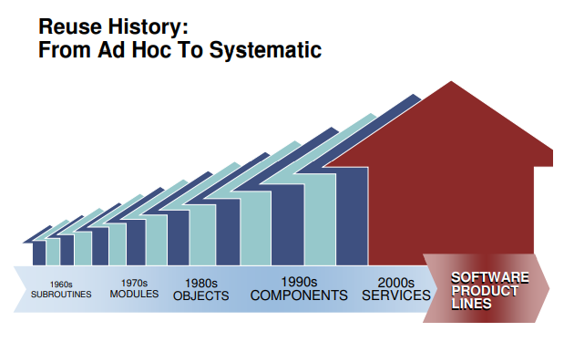
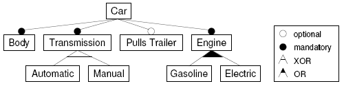
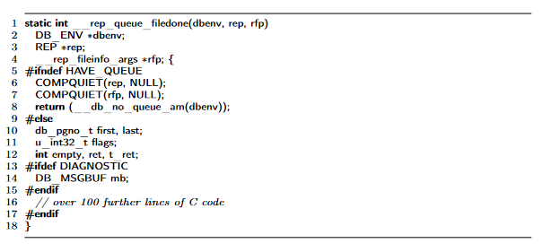
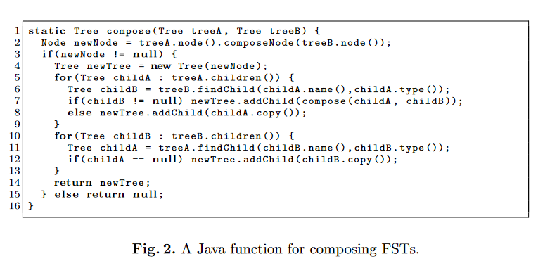
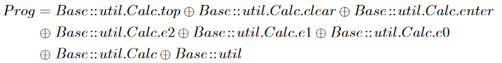
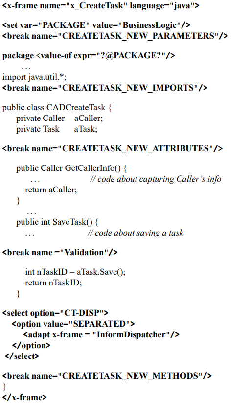
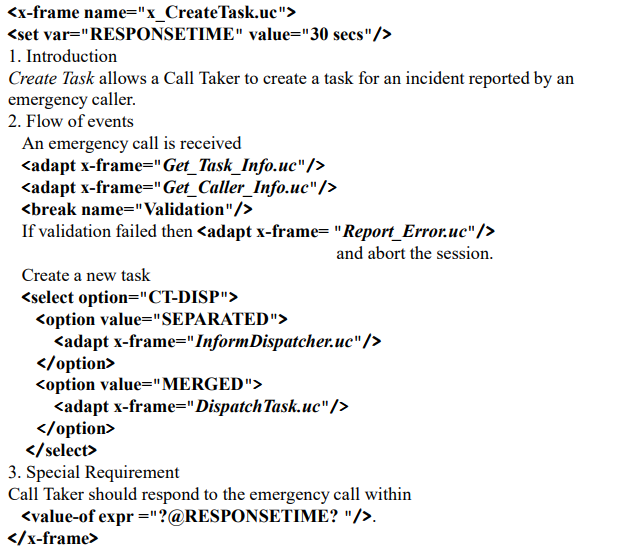

# Delta Oriented Programming from the Perspective of Reversible Computation

Many years ago, because I needed to brief management and tout the originality and universality of Reversible Computation theory, I did some literature research and reviewed papers from the International Conference on Software Engineering (ICSE) over the years. I found the most closely related theories to be Feature Oriented Programming (FOP) from 1997[\[2\]](#f2)[\[3\]](#f3) and Delta-Oriented Programming (DOP), proposed around 2010 by Professor Schaefer from Germany[\[7\]](#f7)[\[8\]](#f8). I proposed Reversible Computation in around 2007[\[12\]](#f12)
[\[13\]](#f13)[\[14\]](#f14). Its intellectual roots are not in traditional software engineering or even computer science; my academic background is theoretical physics, and I was not familiar with the historical achievements in software engineering theory beforehand. Consequently, at the level of first principles, Reversible Computation is different from existing theories in academia. In this article, I briefly introduce the differences and connections between Reversible Computation and related theories.

## I. Software Product Line Engineering and Variability Management

When discussing software engineering theory, one cannot overlook the Software Engineering Institute (SEI) at Carnegie Mellon University. It is not only a leading authority in the theoretical community, but also a model of theory in close contact with practice (famously raking in licensing fees for CMM certification each year). Since SEI proposed the so-called Software Product Lines theory[\[1\]](#f1), numerous academic theories have gone through a recalibration process to align their concepts with the discourse of software product lines. Software Product Line Engineering is a comprehensive theory spanning management and technology, attempting to use all feasible means to solve the grand challenge of system-level and product-level software reuse (far beyond fine-grained component reuse).

The core technical problem posed by Software Product Line Engineering is so-called variability management. This is almost a catch-all problem. Nearly all the difficulties we encounter during software development and evolution can be easily attributed to insufficient capacity to cope with change. After recalibration, FOP positioned itself as a natural and efficient approach to implementing software product lines. Later, DOP presented itself as an improvement over FOP’s shortcomings, likewise as a key technical means to realize variability management. By the same calibration logic, Reversible Computation can be seen as a further development and enhancement of DOP. Of course, in reality Reversible Computation predates DOP and follows a completely different line of thought.

The true difficulty of variability management, in theoretical terms, lies in effectively controlling unexpected changes. If we are very familiar with a domain and the modes of change in the domain are confined to a limited set, we can place a few well-chosen extension points at key locations and handle variability with ease. But if the set of potential change points keeps growing and the modes of change continually innovate (in other words, if the degrees of freedom of change increase without bound, approaching infinity), then sooner or later the degrees of freedom of change will exceed what manual enumeration can control. In such an evolutionary scenario filled with unknowns, how can we effectively describe and control infinitely many degrees of change? In physics, this is essentially a solved problem.

In high school we learn Newtonian physics—rigid-body mechanics in classical mechanics. Its worldview is entirely mechanistic: the motion of a rigid body is fully described by a few parameters such as center-of-mass coordinates, size, shape, and orientation; the internal structure of the body is unobservable and irrelevant; rigid bodies interact through direct contact; and their shapes must match precisely to form a seamless whole (compare this with the black-box model of software components). Even in classical mechanics, slightly more advanced perspectives switch to the Lagrangian or Hamiltonian formulations, whose spirit is a turn toward a field-theoretic worldview. A “field” is essentially an all-pervasive coordinate system where at every point of the coordinate system you can specify a physical quantity. A field has infinitely many degrees of freedom, but via the coordinate system it is describable, definable, and researchable; at each point of the coordinate system we can precisely measure local variations. In the same spirit, the basic setup of Reversible Computation is to first establish a sufficiently fine-grained and general domain-description coordinate system, in which we can both precisely target a location for action and infer the location from an action (uniqueness of coordinates). Once we establish a field-like perspective, we can proceed in the next section to analyze FOP and DOP.

## II. From Feature-Oriented (FOP) to Delta-Oriented (DOP)

Feature-Oriented Programming, as the name suggests, places its core concept on the notion of a “feature.” So what is a feature? According to [\[3\]](#f3):

> A feature is a unit of functionality of a software system that satisfies a requirement, represents a design decision, and provides a potential configuration option.

For example, in the feature model above, a Car must have an Engine feature, which can be fuel-based, electric, or even hybrid. The Transmission can be automatic or manual but cannot be both. In Software Product Line Engineering, concrete software development resembles checking boxes in a configuration menu when buying a car (or, analogously, ordering dishes at a restaurant). After selecting the specified features, a generator converts them into executable code to automatically produce a runnable program.

FOP’s basic insight is that features (the content we care about at the business layer) generally do not align well with object-oriented (component) or functional decomposition and almost inevitably become a crosscutting concern. This is easy to understand. Features are valuable, identifiable structures in the problem space, whereas components/functions are effective abstractions and descriptions in the solution space. The structural mapping from problem space to solution space is nontrivial in general business environments, so the two descriptions cannot be effectively aligned. Borrowing the parlance of AI, we can say: useful features are distributed.

In Software Product Line Engineering, one basic technique for realizing feature definition and composition is C-like preprocessing (conditional compilation).

FOP’s contribution to Software Product Line Engineering is that it provides a more standardized and powerful mechanism for feature definition and composition[\[5\]](#f5)[\[6\]](#f6).

1. Define a language-agnostic Feature Structure Tree (FST)
2. Implement feature composition via language-independent Tree Superimposition

An FST is a generic tree structure in which each node has a name and type, and child nodes have distinct names so they can be distinguished. Tree Superimposition is the merge process between two trees: nodes are merged level by level according to name, and the types of merged nodes must match.

> Superimposition is the process of composing software artifacts by merging their corresponding substructures.

Early FOP did not recognize the generality of tree structures and tree-merge algorithms; instead, it extended the syntax of existing languages.

A series of works by Apel around 2008–2009[\[4\]](#f4)[\[5\]](#f5)[\[6\]](#f6) elevated FOP to a new level of abstraction. Not only code files but also documents, test cases, and all related artifacts can be brought under the umbrella of the Feature Structure Tree. FeatureHouse[\[6\]](#f6) augments EBNF grammar rules with FOP-related annotations to introduce general merge rules for arbitrary syntactic structures (no longer requiring an FOP-specific programming language), greatly expanding FOP’s applicability.

> FEATUREHOUSE relies  on  three  ingredients:
> 
> (1) a  language-independent  model  of  software  artifacts
> 
> (2) superimposition  as  a  language-independent  composition paradigm
> 
> (3)  an artifact language specification based on attribute grammars.

This suite of FOP practices is easy to understand in light of the previous section. The FST is a general-purpose descriptive coordinate system in which all artifacts necessarily can be decomposed to obtain a unique, definitive representation. The reason for using a tree structure is that in a tree the path from any node to the root is unique and can thus be used as a coordinate. After fixing the coordinate, the merge process at a coordinate point is entirely generic—completely independent of specific business logic and business structure. This is expressed very clearly in the Feature Algebra introduced by Apel[\[4\]](#f4).

Comparing this with AOP reveals something interesting. AOP’s pointcut mechanisms are very powerful and can directly use complex operators such as regular expressions for filtering and selection, but they sacrifice the uniqueness of coordinates and make it difficult to establish a Feature Algebra. Moreover, AOP is tightly bound to programming languages and is hard to extend to other artifacts. So expressive power is not everything we should pursue. Reversible Computation places great emphasis on reversibility; behaviors so powerful that they undermine reversibility should be constrained or even prohibited.

Although FOP looks quite complete as a theory, from the perspective of Reversible Computation it still has considerable room for development. In 2010, Schaefer identified a limitation of FOP and proposed Delta-Oriented Programming. Schaefer’s observation was:

> It is not possible to start  from  an  existing  legacy  application  comprising  a  larger  set of features and to **remove** features.

If we discard all business interpretations of “feature” and define it directly as a functional Delta, we immediately see that FOP includes only override and add operations and does not define a delete operation! DOP initially introduced a Java-like syntax: DeltaJ[\[10\]](#f10).

Later DOP, taking a page from FeatureHouse, introduced DeltaEcore[\[11\]](#f11), providing delta structures for arbitrary grammars.

At first, DOP required a core product; all deltas would apply to the core product to produce the final product. However, from the standpoint of Reversible Computation, in the presence of an identity element, deltas and wholes are mutually translatable. Schaefer soon discovered this as well and promptly published another paper[\[8\]](#f8) pointing out that a core product is unnecessary; delta modules alone can construct all systems.

Viewed through Reversible Computation, DOP still has ample room for development—most obviously, it lacks the generator part. Moreover, compared with Reversible Computation, DOP’s understanding of Delta is still rather rudimentary. A few days ago, taowen mentioned a paper[\[15\]](#f15) describing a delta-related technique called XVCL, which also bears some similarities to DOP. In the next section, I analyze the differences between the delta concept in Reversible Computation and techniques such as DOP and XVCL.

## III. XVCL and Frame Technology

XVCL claims its theoretical basis stems from “Frame technology,” which in turn claims conceptual origins in the AI notion of “Frame,” a concept invented by Minsky in 1975 (everyone needs a respectable intellectual forebear when publishing). Put simply, a Frame is a structural template (archetype) with some holes—called slots—that can be customized; it is essentially not so different from a Vue component.

> 1. Choose an example X
> 2. Mark the parts of X that are prone to change, turning them into frame parameters (slots), and use the original content of example X as default values (slot bodies) (... okay, that’s essentially a Vue component)

There is a 2008 interview with Bassett, the inventor of Frame technology[\[17\]](#f17), which includes some interesting viewpoints (basically ones I’ve expressed based on Reversible Computation; call it “great minds think alike,” or perhaps history is a loop?):

1. Frames can effectively describe cases like “A is very similar to B, except ...” and “A is very similar to B+C, except ...”
2. Copy-pasting and modifying code is labor-intensive and unreliable; using frame directives to add/delete/modify code is faster and more precise
3. Frames can be nested into a Frame Tree and layered atop structures expressed in any language (e.g., by adding frame annotations to natural-language documents to enable frame expansion for documentation)
4. Under the frame perspective, maintenance is no longer a process disjoint from development. The entire development process, like maintenance, is realized by progressively adding frame deltas externally (no need to modify the original frame—just add annotations to the original frame)
5. Similar programs often differ by small amounts of code; the difference can be confined in the frame delta, typically only 5%–15% of the total
6. Every domain has a natural graininess. Concrete implementation technologies (e.g., classes, functions) can fragment the natural structure into overly fine pieces (hundreds or thousands of tiny classes and functions), causing unnecessary complexity
7. Frames are based on a semi-lattice mathematical structure and can handle multiple inheritance issues (basically similar to Scala’s traits, avoiding conceptual conflicts by defining an override order)
8. A frame is an archetype that can be viewed as the central element of a fuzzy set. Unlike other abstraction techniques, you do not need to ensure that a frame’s abstraction is perfectly correct ahead of time. If you later find more variation points are needed, simply add slot annotations to the original frame (fully compatible with existing code and with no runtime cost).

Despite how intriguing these viewpoints sound, the corresponding XVCL implementation is straightforward.

XVCL is similar to a template language in which you can define variables, conditionals, loops, etc. The adapt directive is like a function call and can be nested to call other frames. The break tag marks an extension point, similar to slot in Vue. Because it resembles a template language, it can generate code as well as documents—for example, Use Case documents.

XVCL and Vue components are still different. XVCL provides a form of delta programming: when invoking other frames via the adapt tag, you can control customization with insert-before/insert/insert-after, etc. (during adapt, the insert tags modify the parts marked by break tags in the base frame); using insert empty can also delete the default content.

Compared to the C preprocessor, XVCL is an improvement because it can be applied to files of any text format, not just specific programming languages (although any template language can do this). It also has stricter variable scoping rules and provides a controlled delta customization mechanism (the C preprocessor cannot provide slot customization).

However, from the analytical framework of Reversible Computation, the coordinate system XVCL establishes is actually weaker than FeatureHouse’s[\[6\]](#f6): XVCL decomposes the system into frames and introduces break markers within frames to construct a coordinate system supporting customization, but frame files are essentially unorganized relative to each other. FeatureHouse, by contrast, at least manages all artifacts via the directory structure and defines merge operators at every directory level. This two-level abstraction of frame–break is roughly analogous to a class–member structure; FeatureHouse’s Feature Structure Tree can readily simulate the frame mechanism. Compared to XVCL, DOP also provides greater capabilities for feature composition.

Although FOP, DOP, and Frame Technology all adopt the concept of Delta, the Delta they define differs significantly from the Delta in Reversible Computation. Reversible Computation asserts that Delta is not only about expressing differences; more importantly, it implies a reversible operational structure that can effectively limit entropy increase in the system. When designing based on Reversible Computation, any mechanism introduced requires paired design (forward and inverse). I will elaborate on the differences in the next section.

## IV. What’s Different about Reversible Computation?

In the introductory article on Reversible Computation[\[18\]](#f18), I first articulated a heuristic viewpoint: Reversible Computation can be regarded as a third logical path to Turing-complete general computation, alongside Turing machines and the lambda calculus. The point of emphasizing this is to underscore that Reversible Computation is not just a programming trick or a domain-specific design pattern; it is a universal computational structure applicable at various levels of abstraction and in various application domains. Reversible Computation is closely related to the physical concept of entropy, and the laws it reveals extend beyond software application systems.

Reversible Computation introduces the core notion of a reversible Delta, explicitly stating that Whole = Identity + Delta, and therefore Whole and Delta are mutually transformable. A basic corollary is that the Whole and the Delta can be isomorphic and should be constrained by the same schema. This differs greatly from DOP and XVCL, where Deltas appear as modification actions and the way Deltas are expressed is entirely different from that of wholes. If so, how do we describe the delta of a delta? When wholes and deltas are isomorphic, a delta of a delta is still just an ordinary delta. Many people see a delta as base + patch and assume base is primary while patch is secondary. In fact, the base can be seen as a patch of patches; base and patch are duals and need not be treated differently in theory. A Delta has standalone value; it does not need to be attached to a base to be understood.

In XVCL, we must proactively insert break tags in code to mark extension points. However, the universality of Reversible Computation leads to the following fact: a DSL model is both an entity defined within a coordinate system and also constitutes the coordinate system itself. There is no need to add extra descriptive information for extension points in the model; instead, we can follow FeatureHouse’s approach and add a small amount of annotation to the EBNF/Schema definitions.

In FOP, the feature model is extremely high level—essentially degenerating into a tree of toggles—making it hard to capture complex domain logic; meanwhile, the specific techniques to express features are very low level, generally similar to general-purpose programming language syntax or directly tied to a general-purpose language (e.g., Java). This causes the process of compiling feature combinations into a concrete product to be bound to many detailed concerns, making it difficult to scale to complex application scenarios. (This is why examples in FOP papers are often toy projects.) Reversible Computation clarifies the centrality of DSLs and points the way for the progressive introduction of domain knowledge.

1. How do DSLs compose seamlessly? While the intrinsic structure of a DSL is described by a tree, each node can have a different surface-level textual syntax and can be associated with a different visual UI. Different DSLs can therefore be nested seamlessly.
2. How do different DSLs share some information and avoid logical conflicts? $ DSL_2 = Generator\langle DSL_1\rangle  + Delta $. We can reverse-extract shared information from the DSL1 model, then propagate it into the DSL2 model via a generator; non-shared parts can be described directly via Deltas.

Even though FOP introduces a general tree structure in the form of the Feature Structure Tree, like many mainstream practices in industry it also falls into the trap of type theory. Type theory can be seen as providing a two-layer coordinate system: any structure has a definite type, and based on property names or method names we can locate specified substructures (a kind of local relative coordinate). The customization process is also two-step: (1) locate the object by type, (2) open the object and modify its properties or methods. However, using type as a coordinate system is clearly imprecise and incomplete.

A coordinate system’s minimal capability is to provide the following two operations:

1. value = get(path)
2. set(path, value)

Every object we need to identify should have a unique access coordinate in this coordinate system.

But the essence of a type is the merged expression of similar structures: different objects can share the same type. This makes unique localization in the domain space by type anything but guaranteed. A basic problem: how do we locate an element in an array (elements in an array have the same type)? We can use array indices as local coordinates within the array, but such a coordinate representation is generally unstable. When inserting an element in the array, the indices of all subsequent elements shift. By referencing the implementation of virtual DOM diff algorithms, we can see the necessity of assigning each array element a special id attribute as its stable coordinate representation. Of course, we could extend the type system to include this concept in the type definition. But if a model object will always have only one instance, it is questionable how necessary it is to confine ourselves to type theory.

The Feature Structure Tree in FOP corresponds to package–class–method organizational levels. When we need specialization, this inevitably leads to the introduction of a large number of unnecessary types. Reversible Computation organizes by domain structure (a DSL model itself may correspond to multiple levels rather than just class–method), explicitly stipulating the uniqueness of coordinates on the domain structure, so every structure has a unique coordinate representation. The generator acts like a mapping function that maps one object’s coordinate representation to a new coordinate representation (akin to a physical system evolving in phase space). The generator itself is expressed under the same coordinate system and can be driven to evolve by the same dynamics. Compared with FOP, Reversible Computation is clearly more adaptable.

FOP and DOP are valuable academic explorations into how to build complex systems, and they have indeed inspired me. In particular, I have incorporated the idea of feature selectors into Reversible Computation, allowing the use of the annotation `feature:on='feature-selection-expression'` at any model node to decide whether to enable the feature-related part. This processing occurs before model structure parsing, so it is a completely general mechanism, independent of any specific DSL model.

## V. Open-Source Implementation of Reversible Computation

If you’ve made it this far, there probably aren’t many of you—thanks for sticking around. If you are genuinely interested in Reversible Computation and find pure theory too nebulous, you might say: show me the code. We can do that. I have open-sourced a reference implementation of Reversible Computation: Nop Platform 2.0. The backend uses Java (no Spring dependency), and the frontend uses Vue 3.0. The first phase of open source covers the entire chain from model definition to GraphQL services. The plan is to showcase:

1. Model-driven code generation: input only an Excel-format data model to obtain a complete, runnable front- and back-end codebase that supports CRUD for multi master–detail data structures.
2. Progressive model enhancement: perform incremental fine-tuning on top of generated code. Manual tweaks and auto-generated code are isolated and do not interfere with each other.
3. Visualization based on homomorphic mapping: code and visual models are two homomorphic representations of the same logical structure; a visual designer is generated automatically from the meta-model definition.
4. Multi-version delta customization: customize different implementation logic for different deployment versions without modifying main program code. Customizations are stored as Deltas, down to the granularity of a single function or UI button.
5. Co-evolution of designer and application: the designer itself is also model-driven and is not a fixed tool. It can be customized and optimized for specific applications and evolves as application functionality grows. Designer customization uses exactly the same mechanism as application customization.
6. Compile-time metaprogramming: define new models at any time via meta-modeling and automatically obtain corresponding parsers, validators, visual designers, etc. Extensive model construction and transformation work is done at compile time, simplifying runtime structures and enabling the same model to be adapted to multiple runtime engines.
7. Unified GraphQL services, messaging services, and batch processing services: with no programming, the same business logic can be published as an online GraphQL service, a message-queue processing service, or a batch file processing job, with automatic batch load and batch commit optimizations.
8. Model-driven automated testing: write no test code. During system debugging, service I/O and database change records can be automatically captured and replayed. The automated test engine identifies randomly generated primary keys and master–detail relationships and performs appropriate validations.
9. Instant updates via change detection: automatically detect model file changes and recompile immediately. FileWatch monitors file changes and triggers recompilation proactively.
10. Sharding, multi-tenancy, and distribution: built-in support for complex application scenarios.

Subsequently, we will progressively open-source IDE plugins and runtime engines including WorkflowEngine, RuleEngine, ReportEngine, and JobEngine, and integrate the GraalVM virtual machine. We will implement the XLang runtime based on the Truffle framework and support compilation to native binaries.

Project links:

- gitee: [canonical-entropy/nop-entropy](https://gitee.com/canonical-entropy/nop-entropy)
- github: [entropy-cloud/nop-entropy](https://github.com/entropy-cloud/nop-entropy)
- Development tutorial: [docs/tutorial/tutorial.md](https://gitee.com/canonical-entropy/nop-entropy/blob/master/docs/tutorial/tutorial.md)
- [可逆计算原理和Nop平台介绍及答疑\_哔哩哔哩\_bilibili](https://www.bilibili.com/video/BV1u84y1w7kX/)

## References

\[1\]: [Software Product Lines Essentials](https://resources.sei.cmu.edu/asset_files/Presentation/2008_017_001_24246.pdf)

\[2\]: [An Overview of Feature-Oriented Software Development](http://www.jot.fm/issues/issue_2009_07/column5.pdf)

\[3\]: [Feature-Oriented Software Development:A Short Tutorial on Feature-Oriented Programming,Virtual Separation of Concerns, and Variability-AwareAnalysis](https://www.cs.cmu.edu/~ckaestne/pdf/gttse11.pdf)

\[4\]: [An Algebra for Features and Feature Composition](https://www.infosun.fim.uni-passau.de/cl/publications/docs/AMAST2008.pdf)

\[5\]: [Superimposition: A Language-Independent Approach to Software Composition](https://www.se.cs.uni-saarland.de/publications/docs/MIP-0711.pdf)

\[6\]: [FEATUREHOUSE: Language-Independent, Automated Software Composition](https://www.infosun.fim.uni-passau.de/cl/publications/docs/ICSE2009fh.pdf)</pan>

\[7\]: [Delta Oriented Programming](https://homepages.dcc.ufmg.br/~figueiredo/disciplinas/lectures/dop_v01.pdf)

\[8\]: [Pure Delta-oriented Programming](https://www.se.cs.uni-saarland.de/apel/FOSD2010/49-schaefer.pdf)

\[9\]: [Refactoring Delta-Oriented Software Product Lines](https://www.isf.cs.tu-bs.de/cms/team/schulze/pubs/2013/AOSD2013-DOR.pdf)

\[10\]:[https://deltajava.org/](https://deltajava.org/)

\[11\]: [DeltaEcore—A Model-Based Delta Language Generation Framework](https://subs.emis.de/LNI/Proceedings/Proceedings225/81.pdf)

\[12\]: [Witrix架构分析](http://www.blogjava.net/canonical/archive/2007/09/23/147641.html)

\[13\]: [从编写代码到制造代码](http://www.blogjava.net/canonical/archive/2009/02/15/254784.html)

\[14\]: [模型驱动的数学原理](http://www.blogjava.net/canonical/archive/2011/02/07/343919.html)

\[15\]: [XVCL: a mechanism for handling variants insoftware product lines](https://core.ac.uk/download/pdf/82147954.pdf)

\[16\]: [ANALYSIS AND DEBUGGING OF META-PROGRAMS IN XVCL](https://core.ac.uk/download/pdf/48627012.pdf)

\[17\]: [Frame technology](http://www.stephenibaraki.com/cips/v46/bassett.html)

\[18\]: [可逆计算：下一代软件构造理论](https://zhuanlan.zhihu.com/p/64004026)

<!-- SOURCE_MD5:554a7478dba22de40146d92f697b640d-->
