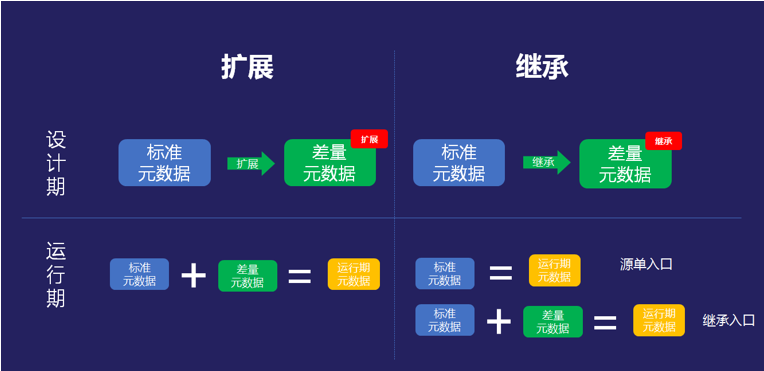

# Differences Between Kingdee Cloud Galaxy's Extension and Nop Platform's Delta

Recently a colleague pointed me to a Kingdee Cloud Galaxy article, [It's already 1202, and some still don't know the difference between extension and inheritance](https://developer.kingdee.com/article/263716004755702784?productLineId=29&lang=zh-CN), which introduces a so-called Extension concept that differs from traditional inheritance. This concept is not original to Cloud Galaxy; the odoo framework has a similar approach, see [Inheritance and Extension](https://www.cnblogs.com/baishoujing/p/6399147.html). An interesting question is: Is the `x:extends` operation in the Nop Platform the same concept as Cloud Galaxy’s Extension? The answer is: No, they are not the same. Extension is merely an ad hoc, problem-specific, incomplete solution, whereas Delta merging in the Nop Platform is a higher-level abstraction. It defines a complete mathematical operation mechanism at the mathematical level, effectively introducing a standardized, new low-level syntactic structure.

## I. Differences Between Inheritance and Extension

In Cloud Galaxy’s definition:

> Extension and inheritance are collectively referred to as extension development, a development mode provided by Kingdee Cloud Galaxy for personalized development on existing entities.



From Cloud Galaxy’s article, we can see they have clearly recognized that extension is essentially a Delta. Inheritance, at the abstract level, combines a standard structure with a Delta structure to produce a new structure. That is, inheritance preserves the original structure and the original entity name, but adds a new entity name and new entity structure.

> ClassB = ClassA  + Delta

Extension, on the other hand, directly replaces the original structure after combining with the Delta structure. In other words, it preserves the entity’s name, so all places that refer to the entity will automatically use the extended entity structure.

> ClassA <- ClassA + Delta

## II. Differences Between Delta and Extension

Reversible Computation theory, which I proposed around 2007 as the next-generation software construction theory supporting the Language Oriented Programming paradigm, defines a rigorous set of Delta operation mechanisms at the mathematical level and solidifies them into concrete programming syntax via the XLang programming language. The Delta in Reversible Computation is a truly original concept, drawing ideas from foundational theories in physics and mathematics such as differential dynamical systems, perturbation theory, the second law of thermodynamics, and group theory, and it is not directly related to the extension concept in software engineering.

> For an introduction to Reversible Computation theory, see [Reversible Computation: Next-Generation Software Construction Theory](https://zhuanlan.zhihu.com/p/64004026) and [What exactly does “reversible” mean in Reversible Computation Theory?](https://www.zhihu.com/question/645650082).

Compared to the Delta concept in Reversible Computation, extension can be regarded as an ad hoc solution based on programmer experience and tailored to specific application scenarios, whereas Delta is a systematic, mathematically well-defined, and broader general software construction principle (Docker technology can be considered a concrete instance of Reversible Computation). Specifically, there are the following differences:

### 2.1 Cloud Galaxy’s Extension Targets Only a Few Specific Models

In Cloud Galaxy, extension is mainly applied to a small set of fixed models such as entity models and view models. To support the extension concept, corresponding implementation code must be added to the entity model engine and view model engine. In other words, it is a mechanism specifically designed and developed for a few particular models. For each model, the specific Delta contents and Delta merge rules must be implemented with custom code. Put differently, there is no unified Delta structure definition and merge rule; Cloud Galaxy defines an extension mechanism per specific model at the model level.

> EntityModelA <-MergerForEntityModel(EntityModelA, DeltaForEntityModel)
> 
> ViewModelA <- MergerForViewModel(ViewModelA, DeltaForViewModel)

The likely implementation process is: first parse to obtain an EntityModel object, then apply a specific EntityModelMerger to merge the EntityModel and DeltaForEntityModel. The concrete merge algorithm must be separately crafted for different models.

In Reversible Computation, Delta merging is done at a unified structural layer beneath the model layer, independent of specific models. The merge rules are specified by the xdef meta-model.

> XNode = Loader(virtualPath)
> 
> Model = Parser(XNode)

In the Nop Platform, we use a virtual file system to uniformly manage model files, then use a unified XNode loader to parse into general XNode nodes, during which the Delta merge algorithm is performed. After obtaining the XNode, we parse it into specific models. In other words, it’s not `EntityModel = EntityModel + Delta`, but rather `XNode = XNode + Delta`, `EntityModel = Parser(XNode)`. Delta merging operates not at the specific model level, but at the unified XNode structural layer under meta-model constraints.

All mathematical theorems only need to be proven once, and everyone else in the world doesn’t need to prove them again. Similarly, the laws of Delta operations only need to be defined once in the Nop Platform, and all models (both current and future) won’t need to implement them. Compared to Cloud Galaxy’s extension concept, Delta is defined at a higher level of abstraction and is essentially different in approach.

For details on the XNode merge algorithm, see [XDSL: A General-Purpose DSL Design](https://mp.weixin.qq.com/s/usInt7_odzvFzuiIUPw4iQ) and [A General Delta Quantization Mechanism](https://mp.weixin.qq.com/s/27x95zc-YrVCBPhedBPq5w)

### 2.2 Delta Merge Operates on Tree Structures and Includes Deletion Semantics

Traditional inheritance and extension are essentially based on class structures, and a class is a two-level structure: class name + member list. Within a class, we locate a specific method or property by its name. Structurally, a class is analogous to a Map, and class inheritance/extension at the structural level can be understood as a Map overlay merge.

```
Map = Map extends Map
```

If a property has an internal structure, e.g., it is an object or a list, general class extension will only override the entire property and lacks a suitable method to locate a particular entry or sub-property within the property.

Reversible Computation explicitly introduces the concept of a domain coordinate system, emphasizing that every syntax node has a unique, locatable domain coordinate. If hierarchical coordinates are used, a tree structure naturally emerges. In a tree, the path from the root to the current node is an absolute coordinate, and the node’s name within its parent scope can be considered its relative coordinate. Delta merging is defined on tree structures rather than Map structures.

```
Tree = Tree x-extends Tree
```

When using XML for storage, we introduce a specially agreed-upon `x:extends` attribute for XML nodes:

```xml
<orm x:schema="/nop/schema/orm/orm.xdef"
     x:extends="base.orm.xml">
    <x:post-extends>
        <orm-gen:JsonComponentSupport xpl:lib="/nop/orm/xlib/orm-gen.xlib"/>
    </x:post-extends>
    <entities>
      <entity name="xxx.MyEntity">
            <columns>
                <column name="jsonExt" code="JSON_EXT" propId="101" tagSet="json"                           stdSqlType="VARCHAR"
                        precision="4000"/>
                <column name="status" x:override="remove" />
            </columns>
        <!-- The component configuration will be auto-generated in the end
           <components>
              <component name="jsonExtComponent"
                         class="io.nop.orm.component.JsonOrmComponent">
                 <prop name="jsonText" column="jsonExt" />
              </component>
           </components>
         -->
      </entity>
    </entities>
</orm> 
```

With `x:extends` you can inherit an existing Tree structure and then freely customize any attribute on any node within this complex, nested Tree structure. During merging from the root downward, if a node is a collection, its elements must have a name/id attribute that can be used for unique identification.

Delta merging provides deletion semantics; for example, in the example above `x:override="remove"` indicates deleting the current node. Traditional inheritance/extension mechanisms generally do not provide true deletion semantics—most support only addition, with modification being rare. However, Reversible Computation is a software construction theory oriented toward long-term evolution of program structures, and evolution must allow breaking existing structures; therefore, it necessarily includes deletion and update semantics.

Beyond merge operations between two static Tree structures, the complete form of Reversible Computation requires introducing dynamic Generators.

```
App = Delta x-extends Generator<DSL>
```

Reflected at the structural level, this is:

```
Tree = Tree x-extends Tree<Tree>
```

> The entire application can be expressed by a single Tree (source directory tree + the source’s abstract syntax tree), Delta itself can also be expressed as a Tree. A Generator is essentially a piece of code, expressible as an Abstract Syntax Tree (AST), and a DSL (domain-specific language) is likewise expressed using an AST.

In the example above, `x:post-extends` is a kind of dynamic generation mechanism that can dynamically generate the base node used for Delta merging.

### 2.3 A Complete Theory of Delta

Although Cloud Galaxy’s extension concept mentions Delta, its understanding of Delta is limited to a shallow, commonsense level. In Reversible Computation, Delta is closer to the mathematical concept of a group, far surpassing extension in conceptual consistency and completeness. For the relationship between groups and Delta, see [A Delta Concept Analysis for Programmers, Using Git and Docker as Examples](https://mp.weixin.qq.com/s/D5bDNkMJ9gYrFb0uDj2EzQ).

First, based on A = 0 + A, any full content is a special case of Delta. We can express Delta and full content in the same form; there is no need to define a special form for Delta. If Delta and full use the same form, a necessary corollary is that the Delta of a Delta is still an ordinary Delta. This enables richer Delta application patterns.

Second, Delta in Reversible Computation satisfies associativity. We can use this to define Base-independent Delta merge operations and achieve independent management of Deltas. In other words, even before knowing which Base they will be applied to, multiple Deltas can be merged into a new Delta.

```
A = (B+Delta1) + Delta2 = B + (Delta1 + Delta2)
```

Third, Delta exists independently of the Base; the same Delta can be applied to multiple different Bases.

```
A = A1 + Delta,  B = B1 + Delta
```

Using this, we can develop new software reuse patterns—for example, introduce workflow support to any entity via a workflow Delta. In the Nop Platform, we combine metaprogramming with Delta to implement many high-order reuse patterns unimaginable in traditional software engineering. Moreover, they are all completed at compile time, have no impact on runtime performance, and do not bring complexity to runtime.

For more, see [A Reversible Computation Theory Analysis for Programmers](https://mp.weixin.qq.com/s/aT99VX6ecmZXdemBPnBcoQ) and [A Supplement to the Reversible Computation Theory Analysis for Programmers](https://mp.weixin.qq.com/s/zGfo7pvKjOCa11PYLJHzzA)

### 2.4 Multiple Delta Branches


In Cloud Galaxy’s article, it is mentioned that one difference between extension and inheritance is: “an object can only be extended once, but the extended object can be extended again; an object can be inherited multiple times, and the inherited object can continue to be inherited multiple times.” That is, as shown above, extension can form only a single extension chain, while inheritance can form multiple different inheritance chains. In Reversible Computation, however, Delta does not have such a restriction. In the Nop Platform’s implementation, we can allow multiple Delta extension chains by assigning different names to Deltas. For example:

```
/_delta/hunan/abc
/_delta/anhui/abc
/_delta/product/abc
/abc
```

In the example above, `/_delta/hunan/abc` indicates that the file abc is defined in the Delta layer with `deltaId=hunan`, whereas `/_delta/product/abc` indicates that the file abc is defined in the Delta layer with `deltaId=product`. In `/_delta/hunan/abc`, we can use `x:extends="super"` to indicate inheriting the content from the upper layer. If the `x:extends` attribute is not set, it means the current file will overwrite the file from the upper layer, rather than merging the two.

In the configuration file, we can control how multiple Delta layers are stacked via `nop.core.vfs.delta-layer-ids=hunan,product`. In other words, using this additional assembly mechanism, we can break Cloud Galaxy’s restriction of allowing only a single extension chain.

## III. Concrete Implementation of Reversible Computation
Although we do not know the specific implementation details of Cloud Galaxy’s extension mechanism, if it is implemented at the model layer, it will inevitably lead to a large amount of redundant code and a high risk of various latent inconsistencies. In the Nop Platform, implementing Delta operations and dynamic Delta generation requires only a few thousand lines of code (excluding the implementation of the XScript scripting language itself; in principle existing script engine implementations could be used, but they would lack some convenient metaprogramming features), and all Reversible Computation support can be encapsulated under a unified model loader abstraction. That is, by simply replacing the common `JsonReader.readJson(classPath)` call used in ordinary Java projects with Nop’s `ResourceComponentManager.instance().loadComponentModel(virtualPath)`, we immediately gain a suite of Delta operation support mechanisms: Delta merging, dynamic model generation, model parsing cache, model dependency tracking, etc. At the same time, multi-tenant support is obtained automatically—each tenant can have its own distinct Delta definitions. For a design principles overview, see [Seeing Low-Code Platform Design Through Tensor Product]()
<!-- SOURCE_MD5:491b2691afd4057b822eaa0ed5592fa0-->
