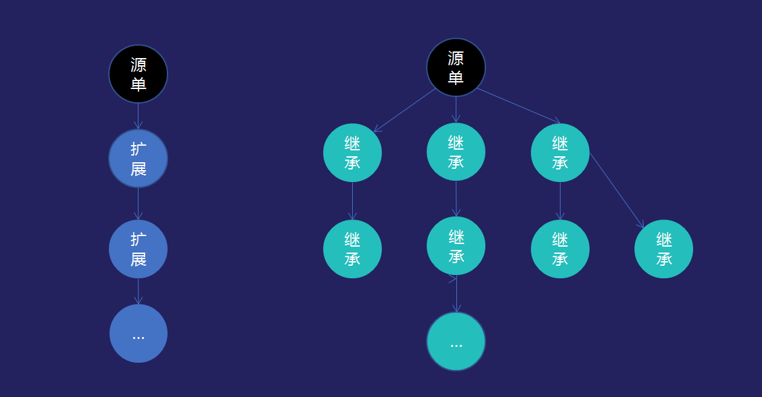

# Goldwing Cloud's Extension vs. Nop Platform's Delta

Recent discussions have sparked my interest in an article on [Goldwing Cloud's article on Extensions](https://developer.kingdee.com/article/263716004755702784?productLineId=29&lang=en). The article addresses the fundamental difference between the concept of **Extension** and traditional inheritance concepts. This concept is not original to Goldwing Cloud; similar approaches exist in Odoo framework, as discussed in [Inheritance and Extension](https://www.cnblogs.com/baishoujing/p/6399147.html).

An intriguing question arises: Is Nop platform's `x:extends` operator equivalent to Goldwing Cloud's **Extension**? The answer is no. **Extension** is an ad hoc, problem-specific solution that does not provide a complete abstraction layer, while Nop platform's Delta merge operates at a higher level of abstraction, defining a robust mathematical operation mechanism akin to standardization.


## Section 1: Inheritance vs. Extension


## In Goldwing Cloud's Definition:

- **Extension** and inheritance are collectively referred to as extension development, employed during personalized development for existing entities in Goldwing Cloud.

- **Goldwing Cloud** explicitly recognizes the essence of **Extension**, treating it as a form of delta data (Delta) that distinguishes modified entities from their original state. Inheritance, on the other hand, preserves and builds upon the original structure while introducing changes through deltas.

- Mathematically:
  
  - **Inheritance**: ClassB = ClassA + Delta  
    - This maintains the original class structure and name but introduces new properties via delta.

  - **Extension**: ClassA <- ClassA + Delta  
    - This replaces the original structure with a modified version, applying deltas directly to update existing properties.


### Example:

```markdown
ClassB = ClassA + Delta  # Inheritance example

ClassA <- ClassA + Delta  # Extension example
```


- The Delta concept in Goldwing Cloud is rooted in mathematical theories such as differential equations, system dynamics, and thermodynamics.
  
- It serves as a universal construction principle for software development, abstracting complex systems into modular components.

- Goldwing Cloud's Delta is not limited to specific applications; it provides a systematic approach for building and integrating new features.


- In Nop platform, `x:extends` is a specific feature used to inherit properties from parent classes.
  
- It allows developers to reuse existing functionality without duplicating code, making it an ad hoc solution tailored for particular needs.


1. **Abstraction Level**:  
   - Goldwing Cloud's Delta operates at a higher level of abstraction compared to Nop platform's `x:extends`.
   
2. **Mathematical Foundation**:  
   - Goldwing Cloud's approach is grounded in rigorous mathematical principles, ensuring comprehensive and scalable solutions.
   - Nok平台的扩展是特定编程范式，主要用于代码复用。

3. **Scalability**:  
   - Delta in Goldwing Cloud allows for systematic integration of new features across multiple modules, making it ideal for large-scale applications.
   - 扩展在Nop平台中主要适用于小型或特定的扩展需求。


```markdown


EntityModelA <- MergerForEntityModel(EntityModelA, DeltaForEntityModel)
ViewModelA <- MergerForViewModel(ViewModelA, DeltaForViewModel)


1. Parse EntityModelA into its constituent parts.
2. Apply MergerForEntityModel to merge DeltaForEntityModel with EntityModelA.
3. Similarly process ViewModelA.


The merged entity Model = Parser(Model) transforms raw data into a structured format.
```


```markdown
ClassA <- ClassA + Delta  # Direct replacement of properties
ViewModel <- ViewModel + Delta  # Same principle applied to views


ViewModel <- MergerForViewModel(ViewModel, DeltaForViewModel)


```


Goldwing Cloud's **Extension** and Nop platform's Delta are distinct approaches tailored for different development needs. While both aim to enhance modularity and reusability, they cater to different audiences and application scopes.


The **Nop platform** uses a virtual file system to manage model files uniformly. It employs a unified XNode loader to parse generic XNode nodes, implementing the Delta merge algorithm during this process. After obtaining an XNode, it further parses it into a specific model. This is not done by simply adding `Delta` to `EntityModel`, but rather through:

```
XNode = XNode + Delta
EntityModel = Parser(XNode)
```

The Delta merge operation does not directly affect the specific model layer but operates on the meta-model constraints of XNode at a more abstract level.


## Mathematical Proof and Delta Definition

**All mathematical proofs should be proven once, and others need not be proven.** Similarly, the rules for Delta operations should be defined only within the **Nop platform**, ensuring that all current and future models are covered without needing individual implementations. In contrast to the vast expanse of cloud concepts, Delta operates at a higher level of abstraction.

For an in-depth explanation of the specific XNode merge algorithm, refer to:

- [XDSL: Domain-Specific Language Design](https://mp.weixin.qq.com/s/usInt7_odzvFzuiIUPw4iQ)
- [General Delta Mechanism](https://mp.weixin.qq.com/s/27x95zc-YrVCBPhedBPq5w)


Traditional inheritance and extension are fundamentally class-based, treating a class as a two-level structure: **className + memberList**. Within a single class, methods and properties are located using method names and property names. From a structural perspective, a class can be viewed as a Map structure, where inheritance and extension at the structural level correspond to Map merging.

```
Map = Map extends Map
```

If a class possesses internal structure, such as being an object or a collection, typical class extension will only cover the entire property without providing a way to target specific members or sub-members. The Delta merge algorithm does not attempt to modify internal structures but operates on the structural level.

In reversible computation theory, the concept of domain coordinates was explicitly introduced, emphasizing that each syntax node possesses a unique set of domain coordinates for identification. From this perspective, a path from the root to a particular node represents its absolute coordinate, while the node's name within its parent scope serves as a relative coordinate. Delta merging operates on the structural level, not on Map structures.

```
Tree = Tree x-extends Tree
```

When using XML storage, `x:extends` introduces a special convention for XML nodes:

```xml
<orm x:schema="/nop/schema/orm/orm.xdef" x:extends="base.orm.xml">
  <x:post-extends>
    <orm-gen:JsonComponentSupport xpl:lib="/nop/orm/xlib/orm-gen.xlib"/>
  </x:post-extends>
  <entities>
    <entity name="xxx.MyEntity">
      <columns>
        <column name="jsonExt" code="JSON_EXT" propId="101" tagSet="json"
                  stdSqlType="VARCHAR" precision="4000"/>
        <column name="status" x:override="remove"/>
      </columns>
      <!-- Automatically generated component configurations -->
      <components>
        <component name="jsonExtComponent"
                   class="io.nop.orm.component.JsonOrmComponent">
          <prop name="jsonText" column="jsonExt"/>
        </component>
      </components>
    </entity>
  </entities>
</orm>
```

Using `x:extends` allows inheriting existing Tree structures while allowing customization of complex nested Tree structures at any level. When merging from the root downward, if it's a collection node, it requires that the collection element possess a unique name/id pair for precise identification.


Traditionally, inheritance and extension mechanisms in many systems are mostly focused on adding new functionality rather than providing true deletion capabilities. Most systems only support addition or modification of existing structures. However, reversible computation is a theoretical foundation for software construction that deals with the long-term evolution of program structures. Evolution inevitably requires the ability to destroy existing structures, which necessitates both deletion and update semantics.


### 2.1 The Complete Theory of Differentials

The concept of *Differential* (Delta) has been extended by various systems, but its understanding is often limited to a shallow awareness on the consciousness level. In contrast, the *Reversible Computation* theory's Delta represents a mathematical concept akin to a *Group*. While groups in mathematics have properties like closure and associativity, the structure of Delta in this context exceeds these characteristics in terms of consistency and completeness.

The relationship between *Groups* and Differentials can be explored through examples such as Git and Docker. For instance, using `git checkout` and `docker build`, one can manage versions of code (differentials) while maintaining a persistent state.


### 2.1.1 Properties of Reversible Computation

1. **Closure**: Any program structure formed by the differential merge remains consistent under further operations.
   - Example: `(B + Delta1) + Delta2 = B + (Delta1 + Delta2)`
   
2. **Associativity**: The order of applying differentials does not affect the outcome.
   - Example: `A = A1 + Delta; B = B1 + Delta` ensures both A and B are derived from the same Delta.

3. **Composability**: A single differential can be applied to multiple program structures without interference.
   - Example: `A = A1 + Delta; B = B1 + Delta`

These properties allow for rich patterns of differential application, far beyond simple version control.


```
App = App x-extends Generator<DSL>
Tree = Tree x-extends Tree<Tree>
```

In terms of program structure:

```
App = (B + Delta1) + Delta2
Tree = B + (Delta1 + Delta2)
```

The same Delta can be applied to multiple structures:

```
A = A1 + Delta
B = B1 + Delta
```

This allows for advanced patterns such as workflow-based differential application, which has been implemented in systems like Nop. There, both metaprogramming and Differentials are integrated, enabling unprecedented levels of abstraction in software engineering.


For a deeper dive into the theory behind reversible computation and its implications on programming abstractions, we recommend exploring [Reversible Computation Theory for Programmers](https://mp.weixin.qq.com/s/aT99VX6ecmZXdemBPnBcoQ) and its extensions ([Supplemental Readings](https://mp.weixin.qq.com/s/zGfo7pvKjOCa11PYLJHzzA)).




In the Nop article, it is mentioned that while extension and inheritance both allow for growth, they differ in their ability to evolve:
- A single node can be extended multiple times but can only merge once.
- An extended node can inherit from multiple parents.

This forms a unique extension chain (as illustrated), allowing for flexible and dynamic program evolution. Unlike traditional systems where extensions are linear, Nop's Delta system enables branching through naming:

```
/_delta/hunan/abc
/_delta/anhui/abc
/_delta/product/abc
/abc
```

Each path represents a different Delta branch, with `/_delta/hunan/abc` indicating an extension with `hunan` as the Delta ID. If no `x:extends="super"` is defined, the file will override the parent instead of merging.

## Configuration File Setup
In the configuration file, the stacking of multiple Delta layers can be controlled using `nop.core.vfs.delta-layer-ids=hunan,product`. This allows for flexible layer management within the Nop platform.


While the exact implementation details of CloudSky's expansion mechanism remain unknown, implementing reversible computation at the model level inevitably leads to significant code redundancy and potential inconsistencies. In the Nop platform, implementing delta operations and dynamic delta generation requires only a few thousand lines of code (not considering XScript scripting language implementation details; it can still utilize existing script engine implementations but lacks some useful meta-programming capabilities). All reversible computation support can be encapsulated within a unified model loader abstraction. This means that replacing the standard `JsonReader.readJson(classPath)` call in Java applications with Nop's `ResourceComponentManager.instance().loadComponentModel(virtualPath)` will immediately provide delta merging, dynamic model generation, model parsing cache, and dependency tracking among other delta computation features. Additionally, multi-tenant support is automatically enabled, allowing each tenant to define their own unique Delta configurations.


For detailed design principles, refer to [Tensor Tensor Low-Code Platform Design]。

