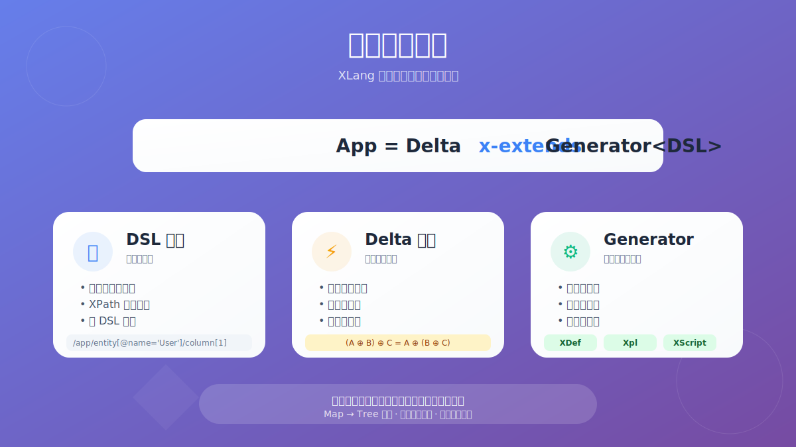

# The Essence of DDD: A Complete Guide from Philosophy to Mathematics to Engineering Practice—The Theory Volume

The prevalence of microservices has sparked a renaissance for Domain-Driven Design (DDD). However, a profound debate persists in the industry about whether, and how, its best practices can or should be standardized into a unified technical framework. In the process of implementing DDD, many design meetings are filled with pointless arguments over technical details, with no one able to convince the others.

So, what exactly are the advantages of DDD? Is it about better adapting to the object-oriented ecosystem? Or is it about aligning the team's mental model and clearly mapping managerial resistance into the technical world, thereby bridging the chasm between technology and business? Or perhaps, does it possess a certain technical inevitability that can be proven at a mathematical level? This article, combining the theory of (Generalized) Reversible Computation and the technical implementation of the open-source low-code platform, Nop Platform, will dissect the technical core of DDD.

> The (Generalized) Reversible Computation theory mentioned in this article is not the same as the concept of Reversible Computing in physics. It does not refer to the reverse execution of computational instructions but rather to an expanded understanding of the concept of "reversibility" at the level of software construction. See [Reversible Computation: The Next-Generation Software Construction Theory](https://mp.weixin.qq.com/s/CwCQgYqQZxYmlZcfXEWlgA) and [Generalized Reversible Computation: Naming and Interpretation of a Software Construction Paradigm](https://mp.weixin.qq.com/s/pNXPEvyVB7ljOhBQVh6c-A).

> The Nop Platform is an open-source reference implementation of the (Generalized) Reversible Computation theory. Nop is a recursive acronym for "Nop is not Programming."

## I. The Standard Understanding of DDD: Strategic and Tactical Design

If we were to ask a large AI model: Do you understand DDD? Do you know why it works?

GPT-5 would likely provide the following standard answer:

---------------------------------

Yes, I do. Domain-Driven Design (DDD) is both a mindset and a set of practices used in complex business domains to closely align software design with domain knowledge, enabling the faster and more stable delivery of evolvable systems.

## What It Is (A Two-Layered Perspective)

### Strategic Design: Mapping the Business Landscape, Defining Boundaries, and Team Collaboration

*   **Domain/Subdomain:** Decompose business capabilities (Core, Supporting, Generic).
*   **Bounded Context:** Use a consistent model and terminology within a clear boundary. Contexts communicate through integration patterns (e.g., Anti-Corruption Layer).
*   **Ubiquitous Language:** Business and technical teams share a common language to avoid "translation loss."

### Tactical Design: How to Model and Implement within a Boundary

*   **Entity/Value Object, Aggregate & Aggregate Root:** Define invariants and transaction consistency boundaries.
*   **Domain Service, Domain Event, Repository, Factory, Specification, etc.**
*   **Ports & Adapters (Hexagonal Architecture):** Isolate the domain from infrastructure.

## Why It Works (The Underlying Mechanisms)

*   **Reduces Cognitive and Communication Overhead:** The Ubiquitous Language and collaborative modeling make implicit rules explicit, reducing the "paraphrasing layer" between requirements and code.
*   **Manages Complexity:** Bounded Contexts break down large problems into smaller, "high cohesion, low coupling" problems. Aggregates localize strong consistency constraints.
*   **Ensures Business Correctness:** Invariants are embedded in the model (rather than scattered in controllers/SQL/validators), making "invalid states unrepresentable."
*   **Promotes Evolution:** Clear boundaries and inward-facing dependencies facilitate refactoring and replacement. Domain events and eventual consistency enable looser coupling for cross-boundary collaboration.
*   **Socio-Technical Alignment:** Leverages Conway's Law by aligning team boundaries with Bounded Contexts, reducing cross-team friction.
*   **Focuses Resources:** Classifying subdomains into Core, Supporting, and Generic helps concentrate modeling and engineering efforts on the "differentiating value" of the core domain.

## When It's a Good Fit

*   For long-term, evolvable projects with complex business rules and changing concepts (e.g., e-commerce orders, financial risk control, supply chain planning).
*   When multiple teams are collaborating, system boundaries are unclear, and integration is complex.
*   When strict control over invariants and consistency is required.

## When It's Not a Good Fit

*   For small, short-lived projects that are primarily CRUD-based with simple rules; a simpler architecture is more efficient in these cases.

## How to Get Started (Practical Advice)

*   **Discovery & Alignment**
    *   Use Domain Interviews, Event Storming, and Domain Storytelling to map out processes and events.
    *   Partition subdomains and assess their value (distinguish Core/Supporting/Generic), aligning them with team boundaries.
*   **Drawing Boundaries & Integration**
    *   Define Bounded Contexts and Context Maps (Shared Kernel, Published Language, Anti-Corruption Layer, etc.).
*   **Modeling & Implementation**
    *   Use invariants to define Aggregates; favor small aggregates. Use events or process orchestration (Saga/Process Manager) for eventual consistency across aggregates.
    *   Prioritize Value Objects (immutable, easy to test); use Entities only when an identity is truly needed.
    *   Application Services orchestrate use cases, Domain Services contain cross-aggregate domain logic, and Repositories are only responsible for persisting Aggregate Roots.
    *   Use Ports & Adapters to isolate external systems and infrastructure.
*   **Iteration**
    *   Evolve the model as understanding deepens; refactor frequently. Measure change costs and defect rates to validate if boundaries are appropriate.

## A Simplified Example (E-commerce)

*   **Bounded Contexts:** Catalog, Pricing, Ordering, Payment, Shipping.
*   **Ordering Context Aggregate:** `Order` (Invariants: total amount = sum of line items; state transitions are restricted; an order cannot be paid for twice).
*   **Cross-Context:** An `OrderPlaced` event notifies the Inventory and Shipping contexts. After successful payment, a `PaymentConfirmed` event is published, and the order status is updated asynchronously. An Anti-Corruption Layer (ACL) adapts different models between boundaries to avoid shared database coupling.

## Common Pitfalls

*   Using only "tactical patterns" (Entity/Repository) without strategic design, resulting in a Big Ball of Mud.
*   Treating DDD as a "microservices silver bullet": Microservices are a deployment decision, while DDD is a modeling and collaboration method. DDD can be implemented first within a modular monolith.
*   Over-enforcing consistency: Forcing invariants that span multiple contexts into a single transaction, leading to high coupling and performance/availability issues.
*   Failing to implement the language: Using business terms in meetings but switching to technical jargon in the code, breaking the Ubiquitous Language.

## One-Sentence Summary

DDD is effective because it uses clear business boundaries, a shared language, and explicit invariants to directly reflect the knowledge structure of a complex business in the code and team collaboration, thereby reducing complexity, increasing correctness, and supporting continuous evolution.

------------End of GPT-5's creation---------

## II. The First Principle of DDD: Discovering and Expressing the Inherent Laws of the Domain

As a mature software engineering methodology, DDD is inevitably a comprehensive socio-technical system involving **management, technology, and external environmental constraints**.

The reason DDD is often difficult to "perfectly implement" is precisely that it attempts to solve real-world problems entangled with various non-technical factors. For instance, when we collaborate with an external team with varying technical skills, high communication costs, and even conflicting interests, **these human and organizational issues of interest and coordination (so-called "office politics") directly influence the system's interface design, module division, and even technology choices**. This fully demonstrates that many of DDD's design decisions are often rooted in **human factors, communication games, and inter-organizational interest coordination**.

However, is this the whole truth of DDD? If we temporarily strip away its socio-technical shell and focus purely on the technical domain, do the patterns advocated by DDD still exhibit some form of technical superiority? In other words, why is a pattern like "Aggregate Root" technically better at controlling state transitions than an arbitrary combination of objects? Why is the division of "Bounded Contexts" better at reducing coupling than a monolithic model?

**If DDD can indeed solve technical problems widely and effectively, there must be an underlying essential reason at a mathematical level—a manifestation of some objective law that is independent of people and environment.**

The starting point of this objective law can be boiled down to one core insight: **business logic is, in essence, technology-agnostic**. It is a pure information description of concepts, rules, and processes within a domain. Therefore, the most stable and time-resistant software structure is one that can **use, and only use**, the concepts from the business domain to express business logic. The "and only use" here is key; it means maximizing the avoidance of "technical noise"—those accidental factors originating from specific implementation technologies like databases, message queues, and web frameworks.

Once we can achieve this, we obtain a description built entirely on the **domain's inherent structure**. By shedding the accidental nature of technical implementations, this description gains long-term stability. More importantly, because it directly reflects the laws of the domain itself, it appears **conceptually purer** and more elegant.

**The domain possesses an inherent regularity, which is the core reason why a domain model can endure through business development cycles and provide lasting value.** Imagine if a domain had no inherent laws. In that case, writing code directly for specific business scenarios would suffice. Why bother extracting a stable domain model that can adapt to various business developments? Why is this "intermediate layer" necessary? This is like in software product line engineering, where the reason we extract core assets and variability mechanisms is precisely that we believe there are stable, abstractable, and reusable structures behind a series of similar products. **The value of a domain model lies precisely in its ability to capture the stable, essential, and inherently regular parts of the domain problem space.**

> We can often observe that a business log table designed by a business expert with no knowledge of distributed systems to ensure process correctness is strikingly similar in structure to a Saga log or event sourcing table designed by a distributed systems expert to ensure data consistency.
> This is because they are facing the same fundamentally constrained problem: "how to ensure overall correctness in a multi-step, unreliable process." It is the inherent structure of the problem itself that often leads its solutions to converge on similar structures.

From this perspective, DDD's tactical patterns (Aggregate, Entity, Value Object, Domain Service, etc.) are no longer just "best practices" but a series of tools and constraints we've invented to build a **technology-neutral, pure expression system for business logic**. DDD is technically effective because it guides us to discover and construct a **structurally more refined "computational model"** that is closer to the essence of the domain problem, rather than scattering business logic haphazardly and accidentally across various corners tightly coupled with technical implementation.

**This is also the most fundamental reason why the "Ubiquitous Language" is so important.** It is not just to make the team's communication "smoother" or to improve daily interactions, but to **ensure that the business logic in the code accurately maps the domain's inherent laws using the problem's own language, avoiding contamination by implementation details**. When we insist on using domain concepts instead of technical concepts to express business logic, we are actually ensuring that the code maps the stable structure of the domain, not the accidental features of a specific technology stack. Only a domain model built this way can remain stable and continue to provide value through business evolution and technological change.

## III. The Art of Decomposition: Vertical Slicing and Horizontal Layering

Having understood that the goal of DDD is to capture the inherent laws of a domain, a subsequent question arises: How do we systematically construct this "computational model" that reflects the domain's laws? A powerful mental framework is to **view software design essentially as a process of "divide and conquer" over a complex problem space, a process that can be reduced to two fundamental dimensions of decomposition: vertical and horizontal.**

### Vertical Decomposition: The Natural Emergence of Object-Orientation

If we want to decompose a complex design space, the most direct goal is to **minimize the coupling between the resulting parts**. The ideal situation is for the decomposed parts to be able to evolve completely independently and in parallel.

1.  **First-Level Decomposition and Object Naming**: To achieve this isolation, the primary task is to find the dimension that "slices the system most cleanly" (the primary decomposition dimension). The choice of this dimension directly corresponds to which **core components** we conceptualize the system into. When we assign names to these components—such as "Order," "Customer," "Inventory"—we are, in fact, performing **object decomposition**. This is the most fundamental means of abstraction because it directly corresponds to our cognitive division of core entities in the problem domain. A proper object decomposition has the highest internal cohesion and the weakest inter-component associations.

2.  **Second-Level Decomposition and Internal Structure**: After identifying the core objects, we naturally need to describe the internal composition of each object. At this point, the second-level decomposed parts cannot be completely unrelated (otherwise, they should have been independent first-level objects). These "somewhat related yet somewhat different" structures are precisely what define an object's internal characteristics and behaviors. In the programming world, they are naturally named **properties (data)** and **methods (functions)**. This is not a coincidence but a consequence of data and functions being the most basic building blocks of the programming universe.

Therefore, **vertical decomposition is a process that naturally leads to object-oriented abstraction**. By identifying the core concepts in the domain and their internal constitution, it encapsulates the system's complexity into a series of modular units with clear boundaries and well-defined responsibilities.

#### Engineering Implementation of Vertical Decomposition: From Conceptual Splitting to Addressable Domain Coordinates

> "The nameless is the beginning of heaven and earth. The named is the mother of all things."

The essence of vertical decomposition is to introduce structural asymmetry into an initially homogeneous and egalitarian space of functions and data by identifying "intrinsic relatedness," thereby allowing higher-level concepts (objects) to "naturally emerge."

> The earliest programming languages consisted of the 0s and 1s of binary machine language, represented by punched paper tapes. Assembly language "gave aliases" to instructions and addresses, opening the door to a symbolic world. High-level languages like C/Pascal went a step further, supporting **custom type names** for complex data structures and creating local variable names through local scopes. Object-orientation achieved the next conceptual leap by naming all related data and functions and introducing **relative names** through the `this` pointer: the specific meaning of `this.fly()` is no longer absolute but is determined relative to the object entity pointed to by `this`.

Looking from the outside in, the first thing we see is the **conceptual splitting** brought about by vertical decomposition. Taking the Nop Platform as an example, the REST link format for frontend access to the backend is determined by first principles to be `/r/{bizObjName}__{bizAction}` (e.g., `/r/NopAuthUser__findPage`). This intuitively **splits** a complete backend service into multiple independent semantic subspaces based on core domain concepts (like User, Order).

**Object names define the split boundaries**: `NopAuthUser` is the product of this split, acting as a coordinate that defines the boundary of a highly cohesive domain concept.

**Splitting gives rise to internal aggregation**: Within this boundary, the system automatically aggregates all technical implementations of this concept:
*   `NopAuthUser.xbiz` - Defines business logic
*   `NopAuthUser.xmeta` - Defines metadata model
*   `NopAuthUser.view.xml` - Defines the view outline

**Recursive evolution of splitting**: This splitting process can be applied recursively to achieve fine-grained, delta-based governance. For example: `/r/NopAuthUser_admin__active_findPage`
*   **Further vertical splitting**: `NopAuthUser_admin` is split again from the generic user concept, forming a specialized version for the administrator role. It can have its own custom business logic (`NopAuthUser_admin.xbiz`) and UI model, while selectively inheriting the generic user's definition (using `x:extends`). This perfectly embodies the evolutionary design from a single generic model to a "core model + multiple delta variants."
*   **Horizontal refinement**: `active_findPage` refines the behavior. Its basic logic is the same as `findPage`, but it additionally specifies the `active` query condition.

In the Nop Platform, the URL is a direct manifestation of this conceptual splitting, transforming abstract vertical slicing into a stable, addressable engineering contract.

### Horizontal Decomposition: The Inevitability of Layered Architecture

Complementing vertical decomposition, which focuses on "what different things constitute the system," horizontal decomposition focuses on "which steps in the process of handling any one thing are fundamentally different." Its goal is to **separate concerns**, allowing technical logic of different natures to change and be reused independently.

1.  **The Natural Separation of Input, Processing, and Output**: The most basic horizontal decomposition is to view any process as three stages: **"Input -> Processing -> Output."** We immediately realize that the same core "Processing" logic can be adapted to different "Input" sources and "Output" destinations. To reuse the core logic and isolate changes, separating these three stages into independent layers becomes a necessary choice.

2.  **Three-Tier Architecture**: The classic **Presentation Layer, Business Logic Layer, and Data Persistence Layer** three-tier architecture is a direct embodiment of this horizontal decomposition thinking. It separates the input (Web requests) and output (database operations), which are strongly tied to technical details, from the core business processing logic.

### Unifying the Two: A Matrix to Govern Complexity

In a real software system, vertical and horizontal decomposition are not mutually exclusive choices but are **simultaneously at play, interwoven** to form a design matrix.

*   **Vertical decomposition defines the system's "static structure"**: It answers, "What are the core objects in the system?" (What it is)
*   **Horizontal decomposition defines the system's "dynamic flow"**: It answers, "How does a request for each use case travel through the layers, interact with these objects, and complete its task?" (How it works)

An elegant architecture is one that makes clear, consistent cuts along both of these dimensions. It is at the intersection of this vertical and horizontal grid that we can precisely locate the responsibility of each piece of code, thus systematically building a system structure that is stable, flexible, and faithfully reflects the inherent laws of the domain.

## IV. Bounded Context: The Revolution of Discovering "Space"

Before the advent of DDD, the world of software design was like the world of physics before Newton's classical mechanics.

### 1. The Pre-DDD Era: An Infinite, Homogeneous "Absolute Space"

In classical object and layered design, the entire software system was treated as a **single, infinite, homogeneous "absolute space."**

*   **Unified and Infinite**: All objects, regardless of their business domain, existed in the same global namespace and semantic field. In theory, any object could directly or indirectly interact with any other object. This is like all celestial bodies floating in the same boundless ether.
*   **Homogeneous**: The space itself had no properties. We only focused on the "objects" (entities) within the space and their interactions (method calls), ignoring the possibility that the "space" itself might have properties and boundaries. **Space was merely a passive, transparent background container.**
*   **The Focus of Design**: Consequently, all design complexity was concentrated on how to manage and organize the "objects" in this space. We invented design patterns, componentization, and other methods to try to bring order to the tangled web of object relationships. But we never considered that the problem might lie with the "space" itself.

### 2. The DDD Revolution: Discovering "Relative Space"—The Bounded Context

The paradigm shift introduced by DDD is, at a cognitive level, analogous to the shift in physics from Newton's absolute spacetime to Einstein's theory of relativity. Einstein showed that space is not a passive background but a dynamic entity that can be curved by mass and has its own properties.

Similarly, through the **Bounded Context**, DDD reveals to us that:

*   **The software design space is not unified, but is composed of multiple heterogeneous, bounded "relative spaces."**
*   **Each "space" (Bounded Context) has its own unique "physical laws"**—this is the **Ubiquitous Language**. In the "Order space," a "Product" follows one set of rules; in the "Inventory space," the "Product" follows a completely different set of rules.
*   **"Space" defines the meaning of "objects"**: The true meaning and behavior of an object (like a "Product") are determined by the "space" (Bounded Context) it resides in. Talking about an object without its context is meaningless.

**Therefore, the core contribution of the Bounded Context is that it allows us to "see" the space itself for the first time.** We no longer take space for granted as a transparent background, but rather treat it as a **first-class citizen of design**. (Previously, we only saw the foreground and ignored the background.)

### 3. The Paradigm Shift in Design Brought by "Space"

Once we discover the existence of "space," the entire design paradigm undergoes a fundamental transformation:

1.  **From "Objects First, Then Relationships" to "Space First, Then Objects"**:
    *   **Old Paradigm**: We first design a large number of objects and then rack our brains to sort out the relationships between them.
    *   **New Paradigm (DDD Strategic Design)**: The first thing we must do is **partition the space** (identify Bounded Contexts). This is a strategic, macroscopic decision. Only after the space is defined can we safely and unambiguously design and evolve the objects (Aggregates, Entities) that belong to that space. **Slicing happens within the space.**

2.  **From "Internal Tidying" to "Boundary Isolation" for Complexity Governance**:
    *   **Old Paradigm**: Faced with complexity, we try to arrange the furniture more neatly within the same large room.
    *   **New Paradigm**: We build walls directly, partitioning one large room into several functionally independent small rooms. Each small room can be simple internally, and interactions between rooms occur through well-defined doors (Anti-Corruption Layers, Open Host Services). **Complexity is effectively isolated and controlled by the boundaries.**

## V. Hexagonal Architecture: Boundaries and Isolation

The "space revolution" in the vertical dimension solves the problem of macroscopic semantic boundaries. Within a single Bounded Context, the evolution of horizontal architecture is dedicated to protecting the purity of the domain model, marked by the evolution from **Three-Tier Architecture** to **Hexagonal Architecture**.

1.  **Contributions and Limitations of Three-Tier Architecture**
    The classic three-tier architecture (Presentation, Business Logic, Data Persistence) is a successful application of horizontal decomposition. By **separating concerns**, it isolates tasks of different natures—user interaction, core logic, and data persistence—theoretically allowing the business logic layer to exist independently of specific data sources and user interfaces.

    However, in practice, the "Business Logic Layer" often becomes a vague container. Technical implementation details (like transaction management, database connections, remote calls) can easily leak in and become entangled with core domain rules. More critically, it implies a certain "top-down" hierarchical concept and fails to clearly and symmetrically express a core design intent: **to protect the domain core from any external technical influence**.

2.  **Hexagonal Architecture: A Clear Inside and Outside**
    

    The Hexagonal Architecture (also known as Ports and Adapters) is a thorough implementation and sublimation of the three-tier concept. It performs a fundamental conceptual refactoring:

    *   **From "Up/Down" to "Inside/Outside"**: It abandons the hierarchically suggestive "upper-layer/lower-layer" concept and explicitly divides the system into an **Inside (Domain Model)** and an **Outside (Technical Implementations & the World)**.
    *   **Ports and Adapters**:
        *   The **Inside** declares what functionality it needs or can provide through **Ports**—a set of abstract interfaces.
        *   The **Outside** connects concrete implementations (like web controllers, database repositories) to these ports via **Adapters**.

    The essence of Hexagonal Architecture is to transform "technical layering" into "boundary division between the business core and technical implementations." It places the core domain model at the center of the architecture, isolated by a protective ring of ports and adapters. **The domain model is thus no longer "dependent" on any specific technology; it merely defines contracts (ports), and the outside world adapts to it.** This perfectly achieves the goal mentioned earlier of "building a technology-neutral expression system for business logic."

This architectural evolution can be compared to how biological cells achieve a separation of "boundary and interior" through the **cell membrane**. The cell membrane (**Ports and Adapters**), acting as a selective boundary, strictly controls the exchange of matter and information between the inside and outside. Its fundamental purpose is to **create a protected internal environment, allowing the internal structures to be decoupled from the complexity of the external environment, thereby gaining the ability to evolve and adapt independently.** It is through this mechanism that the highly complex and precise chemical reactions (**core business logic**) within the cytoplasm and nucleus (**Domain Model**) can proceed stably and efficiently, free from the disorderly interference of the external environment. Bounded Context and Hexagonal Architecture, working together, achieve a similar "cellularization" encapsulation in software systems.

### A Convergence of Vertical and Horizontal to Build a Cognitive Mirror

At this point, we can see a clear evolutionary path:

*   **Vertically**, DDD completes a paradigm revolution from "organizing objects" to "partitioning space" through **Bounded Contexts**, solving the problem of macroscopic semantic boundaries.
*   **Horizontally**, architectural styles have refined the concept from "separating concerns" to "protecting the core" through **Hexagonal Architecture**, solving the problem of microscopic technical dependencies.

When the two are combined, we get a powerful architectural paradigm: **a system is composed of multiple Bounded Contexts (vertical semantic spaces), and each Bounded Context, in turn, uses a Hexagonal Architecture (horizontal technical boundaries) to organize its internal structure.**

This marks an evolution in our design thinking from simple "slicing" and "layering" to the thoughtful design and governance of "boundaries." By drawing clear, robust boundaries in these vertical and horizontal dimensions, we finally construct a software system that can truly **map the inherent laws of the domain**, possessing both resilience and evolvability—a precise **cognitive mirror** of domain knowledge in the digital world.

## VI. Entity and Domain Event: Evolution in the Time Dimension

Through vertical and horizontal decomposition, we have shaped the spatial structure of a software system. However, a model that truly reflects the laws of a domain must not only depict its **static snapshot** at a given moment but also describe its **dynamic evolution** over time. DDD opens up our understanding of the system's behavioral time dimension through two core constructs: **Entity** and **Domain Event**.

### Entity: Continuity of Identity Through Time

In DDD's tactical patterns, an **Entity** is defined as an object determined by its **identity**, not its attribute values. This definition, though seemingly simple, contains a profound philosophical insight: it captures those things in the domain that need to maintain **identity** as time passes.

1.  **Identity: The Anchor Across Time**
    An "Order" may constantly change its state (amount, shipping address, logistics information) from creation to payment to delivery, but we always consider it the **same** order. The identity (like an order number) is the "anchor" that allows this order to maintain its selfhood in the stream of time. It answers a fundamental question: "In the full set of state changes, what is immutable and used to track the thing itself?"

2.  **The Finiteness of State**
    An entity's state transitions are not arbitrary. The **Aggregate Root** pattern imposes a boundary, specifying which states an entity can "control" (those within its aggregate), and ensures the **legitimacy** of state transitions by guarding invariants. This makes the entity's lifecycle, though long, follow a predictable and constrained path.

**An Entity, in essence, is a model for things in the domain that are stateful, have a lifecycle, and need to be continuously tracked over time.**

### Command and Notice: The Philosophical Distinction Between Intent and Fact

At the source that drives an entity's state evolution, we must make a fundamental distinction: **Command** versus **Notice**, which is the divide between **intent** and **fact** (To-Do list vs. operation log).

1.  **Command: Intent Laden with Uncertainty** (Points to the future, the start of a process)
    A **Command** is an **imperative sentence** expressing the **intent** for the system to perform an action, such as `PlaceOrder` or `ConfirmPayment`. The outcome of a command is not predetermined; it depends on the system's **current state** and **external environment** when the command is received. Therefore, **executing the same command multiple times may produce different results due to different timing and contexts**. This uncertainty is a direct reflection of business rule complexity and the non-deterministic nature of the real world.

2.  **Notice: Event as a Confirmed Fact** (Points to the past, the end of a process)
    A **Notice** (often represented as a **Domain Event** in DDD) is a **declarative sentence** recording a **fact** that has already occurred and cannot be changed, such as `OrderPlaced` or `PaymentConfirmed`. It is an assertion about the outcome of a state transition and contains no execution logic itself. **Processing the same notice multiple times should yield a deterministic and idempotent result**, because it describes the past, and the past cannot be changed.

> **[A Note from a Design Perspective]**
> This distinction clarifies a potential misunderstanding in the classic **Command Pattern** when applied to business modeling. The "command" recorded in that pattern, to enable safe `Redo/Undo`, must have its inherent uncertainty eliminated. It essentially records a **deterministic change function** on the state space. This is closer to what we call an "event" in **Event Sourcing**—a confirmed, safely replayable factual notice. The true business "command," on the other hand, precedes this deterministic change function; it is the input that triggers the computation and contains the seeds of uncertainty itself.

### From a Single Timeline to Parallel Universes: A New Picture of the Time Dimension

The traditional modeling perspective is a "top-down view," where we observe the final state of an entity at a specific point in time. Domain events and technologies like CDC (Change Data Capture) shift our perspective to a "side view"—we begin to focus on the **timeline** constituted by state transitions itself.

1.  **Timeline as a First-Class Citizen and State Deltas**
    When we take a side view, the entity's current state is no longer the sole focus. The **timeline** of its complete lifecycle, composed of domain events, becomes equally, if not more, fundamental. The current state is merely a cross-section of this timeline at the "present" moment. More importantly, we can understand this relationship with a concise mathematical formula:
    `NewState = Action(OldState, Event) = OldState ⊕ Event`
    Here, the **Event can be precisely understood as a `Delta` in the state space**, and the `⊕` operation represents the **deterministic evolution function** that applies this delta to the old state to produce the new state. This formula clearly reveals the essence of an event as a "state increment."

2.  **The Possibility of Multi-Verse Evolution**
    This mathematical perspective provides a theoretical basis for "multi-verse" evolution. Since the system's evolution is driven by a stream of events, starting from the same initial state `S0` and applying different event sequences `[E1, E2, ...]` through the continuous application of the `⊕` operation will give rise to different **timeline branches**. This is akin to the "parallel universes" discussed by physicists.
    **Event Sourcing** technology is the engineering practice of this idea: it uses the event stream `[E1, E2, ..., En]` as the single source of truth for the system's state. The current state is simply the result of calculating `S0 ⊕ E1 ⊕ E2 ⊕ ... ⊕ En`. This allows us to precisely reconstruct the entity's state at any point in history by replaying the event stream, and even to simulate different "what if..." scenarios by injecting different event sequences.

3.  **Infinite Event Streams and System Resilience**
    **Infinitely long, replayable message queues** (like Apache Kafka) provide the infrastructure for this multi-timeline picture. They allow domain events, as deterministic deltas, to serve as a permanent, shared communication medium. Different Bounded Contexts (and even different derived systems) can independently consume and process events from the stream at their own pace and with their own logic, building their own state universes based on the same `S0` and `⊕` function, thereby achieving unprecedented system decoupling and evolutionary resilience.

### Conclusion: Building a System That is Traceable and Sim-ulatable in the Time Domain

By combining the lifecycle of an **Entity**, the uncertainty of a **Command**, and the determinism of an **Event** as a state delta, we construct a model within the software system that is **traceable and even sim-ulatable in the time domain**.

*   **Entity** provides the **subject** for tracking changes over time.
*   **Command** is the **intent input**, laden with uncertainty, that drives change.
*   **Event (Δ)** is the **state delta** that records confirmed changes, constituting the timeline and driving deterministic state evolution via the `⊕` operation.

This "Command-Event-Entity" triangle, supplemented by the `State ⊕ Event` mathematical model and the shift from a "state top-down view" to a "timeline side view," makes the system's dynamic behavior thoroughly explicit and mathematical. It transforms business logic from a black box hidden behind method calls into a series of observable, traceable, and even simulatable causal chains. It is on this time dimension that the systems we build with DDD truly gain the insight and evolutionary capability to cope with the complexity and uncertainty of the real business world.

> An Entity corresponds to a timeline with its own intrinsic activity. Any operation on it means that different timelines will become entangled, creating complex histories and hard-to-manage side effects. A Value Object, on the other hand, is an immutable snapshot of a fact at a point in time. It has no timeline of its own and can therefore be safely embedded in any timeline as a universal descriptor. This is why one should use Value Objects wherever possible, to avoid the "entanglement" cost brought about by unnecessary entity-fication.

### Epilogue: The Price of Irreversible Time—The Real-World Dilemma of Traditional Design

However, in most traditional software designs, this systematic consideration of the time dimension is severely lacking. Systems typically only maintain the "current state" of an entity, discarding the complete evolutionary history. This design leads to the **irreversibility of time**—when the business needs to "roll back" (e.g., for refunds or interest recalculations), the reverse logic, lacking precise historical events, can only be based on **speculation and estimation**, which is essentially an imprecise approximation (a reversal based on assumptions, not facts).

This technical information deficit ultimately forces the business to compromise, creating various "imperfect but feasible" solutions. This starkly contrasts with the value of an event-centric model that preserves the complete timeline. It requires us to confront the need for **time symmetry** from the very beginning of the design process, ensuring the system retains enough information to not only evolve forward but also to perform precise "reversals" when necessary.

This is not just a technical implementation upgrade, but a fundamental shift in design philosophy: **from caring only about "what it is now," to also caring about "how it became now" and "how to get back to the past."**

## VII. Mathematical Insights: Language as a Coordinate System

We have established the cognitive framework for Domain-Driven Design (DDD) to master complexity through the philosophical concepts of "boundary" and "time." Traditional DDD stops here—it provides powerful analytical thinking and a series of patterns, but it essentially remains at the level of qualitative cognition. Can we, however, transform this methodological philosophy into a rigorous, computable, and executable software construction system? The answer lies hidden in a pure mathematical examination of "extensibility" and "system evolution."

### 1. The Mathematical Axioms of Extensibility

Let's abstract the process of software evolution into a mathematical formula. Suppose a system evolves from an initial state `X` to a new state `Y`. If we consider `X` as a set composed of parts `A`, `B`, and `C`, then the evolved `Y` might become a set of `A'`, `B'`, and a new part `D`. This process can be expressed as:

`X = A + B + C`, `Y = A' + B' + D`

Here, `A'` and `B'` are modifications of `A` and `B`, which we can represent as `A' = A + dA` and `B' = B + dB`. Substituting this into the equation, we get:

`Y = (A + dA) + (B + dB) + D`

To establish a clear mathematical relationship between the evolved `Y` and the original `X`, we introduce the concept of a "Delta," defining `Y = X + Delta`. Through simple algebraic manipulation, we can reveal the specific composition of `Delta`:

`Delta = Y - X`
`Delta = (A + dA + B + dB + D) - (A + B + C)`
`Delta = dA + dB + D - C`

> This is a heuristic derivation. The mathematical definition of a Delta in reversible computation theory is more complex, and general Deltas do not necessarily satisfy the commutative law.

This seemingly simple formula reveals two indispensable mathematical axioms for achieving true extensibility:

1.  **A Delta Must Include Both "Addition" and "Subtraction"**: `Delta` not only contains the new part `D` and modifications `dA`, `dB` (which can be seen as additions), but it must also contain an **inverse element `-C`**, i.e., the ability to **delete** an original part. Any extension mechanism that only supports "addition" (like most plugin systems) is mathematically incomplete.

2.  **A Delta Must Be Separable and Relocatable**: To achieve separation of concerns, we want to consolidate all changes (`dA`, `dB`, `D`, `-C`) into an independent `Delta` package, managed separately from the base system `X`. When this `Delta` needs to be applied, the system must be able to know precisely that `dA` should act on `A` and `-C` should remove `C`.

This second axiom leads directly to an inevitable conclusion: **there must exist a precise, unambiguous positioning system within the system, such that any part that can be modified can be uniquely "referenced."**

### 2. The Coordinate System: From Positioning to Addressing

The formal mathematical name for this "positioning system" is a **coordinate system**. A proper coordinate system must provide us with two basic operations:

1.  `value = get(path)`: Get a value based on a unique coordinate (path).
2.  `set(path, value)`: Set (or modify/delete) a value based on a unique coordinate.

This requires that **all objects in the system that need to be focused on, modified, and evolved must have a unique, stable coordinate in this coordinate system.**

Looking back at our traditional extension mechanisms, we find that their essence is an attempt to construct some kind of coordinate system:

*   **Plugins/Extension Points**: These can be seen as a **discrete, predefined set of coordinate points**. We pre-dig several "holes" in the system and name them—these are the coordinates. The fundamental flaw of this approach is its **predictive nature**—we must predict all possible extension points in advance. Too few extension points, and the architecture becomes rigid; too many, and the architecture "dissolves," losing its cohesion. We can never apply an effect at an unforeseen location without modifying the source code.

### 3. The Intrinsic Coordinates of Language: From General to Specific

How can we establish a coordinate system that is all-encompassing and requires no prediction? The answer lies in something we take for granted: **programming languages**. Because all system logic must ultimately be expressed through some language, **the structure of the language itself constitutes a natural coordinate system.**

However, different languages have vastly different precision and applicability in their coordinate systems:

*   **Coordinate System of General-Purpose Languages (GPLs)**: Languages like Java and C# provide a **two-level "class-method" coordinate system**. We can locate a class, and then a method within it. **AOP (Aspect-Oriented Programming)** essentially utilizes this coordinate system and, by introducing mechanisms like Annotations, "refines" it to some extent, adding more "coordinate points." But it still cannot delve inside a method, nor can it stably reference an anonymous inner class or a lambda expression. This is a **general-purpose, but coarse-grained**, coordinate system. When a minor business change occurs, the "structural mismatch" of the coordinate system often leads to scattered, non-local changes across many source files.

*   **Intrinsic Coordinate System of a Domain-Specific Language (DSL)**: Physics tells us that the most natural coordinate system for describing circular motion is polar coordinates, not Cartesian coordinates. This polar coordinate system is "intrinsic" to the geometric properties of the problem itself. It leverages the inherent constraint that the radius `r` is constant, thus simplifying the description of a trajectory that would otherwise require two variables (`x`, `y`) to one that requires only one variable, `θ` (angle), achieving **dimensionality reduction of the problem**. Similarly, the most natural way to describe a business domain is with a custom-built **Domain-Specific Language (DSL)**. Every node and attribute in the Abstract Syntax Tree (AST) of this DSL can be precisely located by its unique path (e.g., XPath). This constitutes a **fine-grained, stable, intrinsic coordinate system tailored for the domain problem**.

> **[Analogy: The Method of Moving Frames in Differential Geometry]**
>
> This idea can be compared to the **Method of Moving Frames** in differential geometry. While a moving trajectory can be described in an external coordinate system, what is more profound is that **the trajectory itself naturally generates an intrinsic coordinate system attached to it, one that best reflects its internal geometric properties**. For example, for a curve in three-dimensional space, its "moving frame" at each point consists of three mutually orthogonal unit vectors:
>
> 1.  **Tangent vector (T)**: Points in the direction the curve is moving.
> 2.  **Normal vector (N)**: Points in the direction the curve is bending.
> 3.  **Binormal vector (B)**: Is perpendicular to both the tangent and normal vectors, describing the direction the curve is "twisting" out of its current plane.
>
> These three vectors are completely determined by the curve's own local geometry (velocity, acceleration), not by a fixed external coordinate system. Similarly, business logic is described in a DSL, and the structure of this DSL itself provides the most natural intrinsic coordinate system for describing *changes* to the business logic (i.e., the `Delta`).

The core contribution of language paradigms like XLang is to ensure, through mechanisms like the `XDef` metamodel, that every syntax node in any defined DSL automatically receives a stable domain coordinate.

### 4. The Macroscopic Puzzle and a Field-Theoretic Worldview

So far, we have found an intrinsic coordinate system for a single domain. But a complex enterprise system often involves multiple domains (e.g., orders, inventory, payments). Trying to describe all domains with a single, monolithic DSL is like trying to accurately map the streets of every city with a single flat world map—it's both impossible and unnecessary.

In modern mathematics, the breakthrough of differential manifold theory was the realization that describing a complex curved space (like the surface of the Earth) cannot rely on a single coordinate system. Instead, one must introduce an **"Atlas"** composed of multiple local coordinate systems (maps). Each map is responsible for describing only a small region, and the maps are smoothly "glued" together by "transition functions." This idea can be heuristically mapped to software architecture:

*   A complex system should be described by a **"DSL forest"** or a **"DSL Atlas."** Each DSL (e.g., `orm.xml`, `workflow.xml`, `view.xml`) is a "local map," responsible for describing the intrinsic structure of a Bounded Context.
*   A foundational framework like the Nop Platform, in turn, has the core responsibility of providing the universal "glue"—the common **Delta computation mechanism** (like `x-extends`). This allows us to apply a unified, coordinate-based `Delta` package across different DSL "maps," thereby achieving global, consistent system evolution.

With the introduction of a coordinate system, our worldview undergoes a fundamental shift. It is no longer about the interaction of discrete objects but moves towards a **Field Theory** worldview. A "field" is a space where a ubiquitous coordinate system exists, and a physical quantity can be defined at every point in that coordinate system. Our focus is no longer on isolated objects, but on objects immersed in the field, and the properties of the field itself.

### 5. A Revolution in Worldview: From Particles to Waves, From Assembly to Superposition

Ultimately, mastering this ideology based on coordinate systems and deltas will bring about a profound **revolution in worldview**. This can be compared to the **wave-particle duality** revealed by quantum physics.

*   **Traditional Worldview: Particle View**
    *   **Basic Unit**: The world is made of discrete, bounded "**objects**," "components," and "modules." These are the fundamental "particles" of the software world.
    *   **Construction Method**: Through **Invasive Assembly**. We rigidly connect these "particles" through invocation, inheritance, composition, etc., to build larger aggregates.
    *   **Focus**: The internal state and behavior of individual objects. We think: "What **is** this object? What can it **do**?"

*   **New Worldview: Wave View**
    *   **Basic Unit**: The world is composed of a **continuous pattern (the coordinate system/field)** as the background, and the **perturbations (the deltas/Δ)** that act upon it.
    *   **Construction Method**: Through **Non-Invasive Superposition**. Different "waves" (delta packages `Delta`) interfere and superimpose within the same "field" (base structure `X`), collectively shaping the final complex form `Y` that we observe.
    *   **Focus**: How the background **coordinate system evolves**, and how the **changes (Δ) themselves are combined, transmitted, and interact**. We think: "In **which coordinate system** did **what change** occur?"

This cognitive revolution is the most valuable gift that (Generalized) Reversible Computation offers us. It leads us from an ontology of "being" to an evolution theory of "becoming." Our understanding of software shifts from static, isolated "entities" to dynamic, interconnected "processes." Once we complete this worldview transformation, we will be able to master the eternal and ubiquitous force in the software world—**change**—with unprecedented clarity, elegance, and power.

### 6. A Paradigm Shift in the Principle of Reuse: From "Decomposition-Reassembly" to "Whole-Transformation"

The establishment of the coordinate system and delta model directly triggers a **paradigm shift** in "reuse." The core of this shift is **transforming the cost of change from being "related to the overall complexity of the system" to being "related only to the size of the change itself."**

*   **Old Paradigm: "Decomposition-Reassembly" Reuse Based on "Sameness"**
    Traditional reuse is **"modification-based reuse."** When a system evolves from `X` to `Y`, we must **"open up"** the internals of `X`, identify the **same** parts for reuse, and then modify, replace, and reassemble the remaining parts. In this process, the **cost of change is directly related to the overall complexity of the base system `X`**.

*   **New Paradigm: "Whole-Transformation" Reuse Based on "Relatedness"**
    Reversible computation's reuse is **"superposition-based reuse."** We treat the entire `X` as a black-box whole, **untouched**, and independently create a **delta `Delta`** that describes all changes. Finally, we obtain the new system through `Y = X + Delta`. `X` is never "opened" or "modified." The **cost of change is related only to the complexity of the delta `Delta` and is completely decoupled from the size and complexity of `X`**.

> This is like the difference between "genetic surgery" and "wearing equipment":
>
> *   **Traditional reuse is "genetic surgery"**: The cost and risk of the surgery are strongly correlated with the complexity of the organism itself.
> *   **Reversible computation is "wearing equipment"**: All costs and risks lie in making the "equipment" (`Delta`), regardless of whether the organism is a mouse or an elephant.

The ultimate insight of this **paradigm shift** lies in the fundamental leap of the reuse principle: from **Reuse of Sameness** to **Reuse of Relatedness**. We are no longer limited to reusing the same parts in a "part-whole" relationship but can establish a transformation relationship via a `Delta` between any two related systems `X` and `Y`. This makes it possible to "**inherit an entire software product just like inheriting a class**," perfectly solving the core conflict between "productization and deep customization" in the enterprise software domain.

### A Note on the Real-World Form of "Domain Languages"

It is important to note that in the vast majority of DDD practices, the so-called "Ubiquitous Language" or "Domain Language" is far from reaching the rigor of a **complete formal language** (with precisely defined syntax and semantics). More often, it manifests as a **domain vocabulary** agreed upon through negotiation, relying on the team's experience and conventions to constrain the combinatorial relationships between these concepts.

The manifestation of this constrained relationship in code is precisely the **encapsulation** and **association** mechanisms of object-oriented programming: specific methods can only belong to specific classes (defining "what can be done"), and specific classes can only be associated in specific ways (defining "who is related to whom"). This is, in effect, simulating a **constrained context-free grammar**—class names and associations form the syntax, while method implementations provide the semantics. Many successful **internal DSLs** today follow this path: they do not create a new language from scratch but cleverly leverage the class system of a host language (like Java or C#) to build a restricted subset of expressions that is morphologically closer to the domain problem, often using methods like the **Fluent Interface**.

Therefore, the real-world significance of the "Language as a Coordinate System" insight is that it pushes us to **engineer** the implicit, vague rules of vocabulary combination into a **finite but precise set of explicit specifications**. A superior domain DSL is the ultimate embodiment of this process—it strives to upgrade the "coordinate system" of domain expression from an experience-dependent "rough sketch" to a machine-parsable "engineering blueprint."

Wittgenstein famously said, **"The limits of my language mean the limits of my world."** The (Generalized) Reversible Computation theory further interprets this as: **A language is a coordinate system, and from a coordinate system, a delta naturally arises.**

## VIII. Reversible Computation: Making Evolution Programmable

After "seeing space" with Bounded Contexts and "seeing time" with event timelines, we are just one step away from truly bringing software into a state of sustainable order: seeing the shape of "change" itself and making it orchestratable. The insight of Reversible Computation lies precisely here—it does not treat change as an accidental side effect but reifies change itself, making it data-driven and composable (demoting it from a verb to a noun). It attempts to establish a unified "evolutionary dynamics" for system construction and growth with an extremely simple yet infinitely recursive formula: `Y = F(X) ⊕ Δ`.

### 1. The Universal Pattern of Evolution: From a Perturbation Model to a Construction Paradigm

Any computation can be abstractly described as `Result = Function(Data)`. When a system evolves, both the `Function` and the `Data` can change: `NewFunction = BaseFunction + ΔFunction`, and `NewData = BaseData + ΔData`. The interaction of these underlying changes ultimately leads to a change in the `Result`.

Traditional approaches get bogged down in analyzing these complex interactions. The revolutionary assertion of Reversible Computation is that **regardless of how complex the underlying changes are, their net effect on the final result can always be encapsulated into a single, structured 'Total Delta'.**

This means we can describe evolution with a universal perturbation model:

**`NewResult = BaseFunction(BaseData) + TotalDelta`**

This formula describes the necessary structure of any evolving system; **it is a mathematical necessity.** Consider this: if we view the output result as binary data, we can always define a delta between any two pieces of data in binary space using an XOR operation. However, such a raw bitstream-level delta has no business value; it is difficult to understand intuitively and cannot be efficiently composed or maintained.

**The real breakthrough is to apply the delta to a structured space.** The key here can be compared to the success of Docker container technology:
*   The delta backup mechanism of **virtual machine images** is like operating in binary space—feasible but cumbersome.
*   The **`App = DockerBuild<Dockerfile> overlay-fs BaseImage`** paradigm, however, by establishing a Delta within the structured **filesystem namespace**, achieves lightweight reuse and flexible composition of image layers, thus completely liberating productivity.

Reversible Computation theory elevates this idea to a higher dimension of software construction, implementing the universal computation pattern `Y = F(X) ⊕ Δ` as a very specific, executable technical formula:

**`App = Delta x-extends Generator<DSL>`**

This paradigm precisely decomposes the software construction process into three independently evolvable **First-class Citizens**:

1.  **DSL (Domain-Specific Language)**: **As a precise "Domain Coordinate System"**
    It defines the problem's description space. A well-structured DSL provides a stable, addressable location for every semantic unit in the system. This is the **structural prerequisite** for `Delta` to perform precise addressing and application, and for `x-extends` to achieve reversible merging.

2.  **Generator**: **As a "Model Transformer" and "Truth Unfolder"**
    At compile-time, it is responsible for executing multi-stage transformations from abstract to concrete (model-to-model, model-to-code). More profoundly, like the derivation process of a mathematical theorem, it automatically unfolds a highly condensed "kernel truth" (the DSL model) into a complete, runnable base application.

3.  **Delta**: **As a composable "Evolution Unit"**
    It is an independent, reversible, and non-invasive unit of change. `Delta` encapsulates all changes, including **structured deletion**, and its merge operation satisfies the **associative law**, meaning multiple `Deltas` can be pre-composed into an independently distributable and versionable "feature pack" or "patch."

Finally, these three first-class citizens are deterministically combined via the `x-extends` operator. `x-extends` is an **algebraic upgrade** to the traditional `extends`. It is no longer simple property overriding but a reversible, deterministic merge of a first-class citizen `Delta` within a well-defined structural space. Because its operation is deterministic, the concept of "merge conflicts" found in traditional version control (like Git) does not exist.

In this way, Reversible Computation elevates the trickiest problems in software engineering—"customization," "reuse," and "evolution"—from the realm of external tools or design patterns **to the core semantic level of the language itself**, providing them with a native, unified, and mathematically sound solution.

**It must be emphasized that the formula `App = Delta x-extends Generator<DSL>` in Reversible Computation theory is not a metaphorical illustration but a technical path that can be rigorously defined mathematically and strictly implemented in engineering.** The Nop Platform systematically implements this programming paradigm through XLang, a fourth-generation programming language with a built-in concept of deltas. For details, see [Why XLang is an Innovative Programming Language?](https://mp.weixin.qq.com/s/O4VeA7Dw8cRF7HTHxi6pNw).

### 2. The Fractal Construction of Software: Longitudes and Latitudes

To truly understand the essence of Reversible Computation as a "system construction theory," we must grasp the most profound characteristic of the invariant `Y = F(X) ⊕ Δ`: its **recursivity**. It is not just a formula but a **fractal self-similarity principle** that is recursively applied throughout the software world.

This self-similarity is manifested in several fundamental dimensions of software architecture: the vertical "longitudes" (cross-layer), the horizontal "latitudes" (cross-domain), the flow of time (version evolution), and the "meta-level" of the construction system itself. Together, they weave a complete, evolvable "DSL Atlas."

#### 2.1 Vertical Longitudes: The Multi-Stage Software Production Line

The vertical "longitudes" depict a **multi-stage software production line**, which solves a core dilemma of traditional Model-Driven Architecture (MDA). In traditional MDA, if the reasoning chain is too long (e.g., directly generating final UI code from a highly abstract business model), it leads to overly complex source model definitions and allows information from different abstraction levels to mix chaotically, ultimately becoming difficult to maintain and extend.

Reversible Computation provides a standardized technical path for this, decomposing a one-off, complex model transformation into a series of controllable, clear steps:

1.  **Decompose the Reasoning Pipeline**: First, a complex `A => C` transformation is broken down into smaller, more focused steps, such as `A => B => C`. This makes each stage's responsibility singular and simplifies the model definitions.

2.  **Deltify Each Step**: This is the most critical innovation. In each transformation step, the upstream model (e.g., `A`) does not directly generate the final downstream model (`B`). Instead, it generates a "draft" or "base" model, conventionally named with a leading underscore (e.g., `_B`). The final `B` is then obtained by applying a `Delta` package to customize and extend this draft. This process can be precisely described as:
    **`B = Δ_B ⊕ _B`**
    where `_B = Generator<A>`.

3.  **Allow Information Passthrough**: Every stage (`Generator`) in the production line follows the "principle of tolerance." It only processes information it can understand. For unrecognized extension attributes or metadata from upstream, it will temporarily store and "pass them through" to the downstream unmodified. This ensures that customized information injected at any stage of the production line is not lost.

Taking the built-in model-driven production line of NopPlatform as an example, it clearly decomposes the process from data to page into four main model stages:

1.  **XORM**: Storage layer model
2.  **XMeta**: Interface layer model
3.  **XView**: Framework-agnostic frontend logical view
4.  **XPage**: Final page model bound to a specific frontend framework

This production line is a perfect embodiment of the technical path described above, where each step can be clearly described by the formula of reversible computation:

`XMeta = Δ_meta ⊕ Generator<XORM>`
`XView = Δ_view ⊕ Generator<XMeta>`
`XPage = Δ_page ⊕ Generator<XView>`

In this way, Reversible Computation completely resolves the dilemma of MDA. It allows us to **no longer pursue perfect coverage of all details during modeling**. We can concentrate on building core model generators (`Generator`) that handle 80% of common scenarios, while the remaining 20% of special requirements can be precisely and elegantly injected at any stage of the production line via `Delta`.

#### 2.2 Horizontal Latitudes: Parallel Projection of DSL Feature Vectors

The horizontal "latitudes" depict a landscape of a **DSL feature vector space**. In an "Atlas" composed of multiple DSLs, whether it's a UI model, a data model, or a business logic model, they all follow the **exact same** superpositional evolution rule.

A cross-domain business requirement (e.g., "add a VIP user level") can be precisely decomposed into a set of "isomorphic" deltas `{Δ_ui, Δ_data, Δ_logic, ...}` acting on different DSL models. Due to the universality of the superposition operator `⊕` (i.e., `x-extends`), these deltas can be applied uniformly and deterministically within their respective domains. This constitutes a **precise feature vector decomposition**:

`App = [DSL1, DSL2, ..., Δ_residual]`

**The `Δ_residual` here ensures the completeness of the decomposition**: it represents the "residual" that cannot be perfectly captured by the existing DSL system or requires special coordination. **Furthermore, when we treat all known DSLs and their rules as "background knowledge" and strip them away, the remaining content represented by `Δ_residual` can itself be considered a logically complete whole with its own syntax and semantics, understandable independently of the aforementioned background.** This makes the entire vector decomposition mathematically precise and lossless.

#### 2.3 Time Recursion: The Self-Similarity of Version Evolution

In addition to spatial decomposition along longitudes and latitudes, the recursivity of `Y = F(X) ⊕ Δ` is also reflected in the **time dimension**. Any entity in the system (be it the entire product or a `Delta` package) can itself be seen as the result of superimposing an evolution delta onto its earlier version (the base). This forms an infinitely extending evolutionary chain:

*   `Product_V3 = Δ_v3 x-extends Product_V2`
*   And `Product_V2` itself is `Δ_v2 x-extends Product_V1`

Furthermore, each element in the formula (`X`, `F`, `Δ`) can itself be decomposed again. For example, a complex feature delta `Δ_feature` can be composed of its base version `Δ_base` and a patch for it `Δ_patch`: `Δ_feature = Δ_patch x-extends Δ_base`.

This makes **"change" itself a manageable, versionable, and evolvable core asset**.

In the engineering implementation of the Nop Platform, this temporal recursion is perfectly embodied through the built-in Delta customization mechanism: developers can make delta-based modifications to existing data models, business logic, and even UI interfaces simply by adding a file with the same name in a specific Delta directory, without modifying a single line of the base product's source code. See [How to Achieve Customized Development Without Modifying the Base Product's Source Code](https://mp.weixin.qq.com/s/JopDTYBIw0_Pmp0ZsTuMpA).

#### 2.4 Meta-Recursion: The Bootstrapping of the Construction System Itself

This is the most disruptive aspect of Reversible Computation: **the toolchain, rules, and platform used to construct the software themselves follow the exact same invariant for their evolution.**

*   **Evolution of DSL Definitions (Metamodels)**: `MyDSL_v2 = Δ_meta x-extends MyDSL_v1`
*   **Evolution of Build Tools**: `Compiler_Pro = Δ_feature x-extends Compiler_Base`
*   **Even the Evolution of Merge Rules Themselves**: `MergeRule_New = Δ_rule x-extends MergeRule_Old`

The entire software world—from the final product to intermediate models, to the construction system itself—becomes a vast, self-similar delta structural space connected by the `⊕` operator. In this "fractal space," entities at any level and any granularity share the same construction and evolution philosophy. This achieves a true "**one law to rule them all**," elevating software engineering from a "cottage industry" of repeatedly inventing extension mechanisms for different domains and layers to a unified, self-consistent new era of industrialization. In this new era, the tools we use to build software, and the software we build, follow the same laws of growth.

Figure: A schematic of a delta-oriented architecture based on Reversible Computation, showing the complete stack from the infrastructure layer, through the core engine layer, to the business application layer, with a consistent delta customization mechanism running through all layers. The architecture itself also follows the meta-recursive principle `Y = F(X) ⊕ Δ`—components at every layer can be customized and extended via deltas, including the construction rules of the architecture itself.

#### 3. The Unified Engineering Cornerstones

To make the grand fractal structure described above achievable in engineering, all DSLs must share an intrinsically unified "physical law." Reversible Computation provides three unified engineering cornerstones for this.

*   **Unified Intermediate Representation (IR): XNode**
    All DSLs are represented in memory as an enhanced, XML-like tree structure (XNode). It uses a mechanism similar to XML namespaces to achieve "**localized metadata**," meaning each node and attribute can carry its own metadata (like source file, merge history, etc.) without polluting the business data itself. Based on this structure, we can build a universal, coordinate-based delta merging algorithm whose **runtime cost is proportional only to the size of the change, not the size of the overall model**.

*   **Unified Metamodel Definition: XDef**
    XDef is a DSL for defining DSLs. Unlike traditional metamodel technologies (like EMF/Ecore), XDef itself is fully integrated into the delta-superposition evolutionary system. We can customize and extend the language's own syntax rules through deltas, just as we customize business models, providing unprecedented flexibility for language evolution.

*   **Unified Full-Link Traceability: `_dump`**
    Thanks to the rich metadata carried and preserved by XNode during the merge process, any final result in the system (e.g., the color of a button on a page) can be precisely traced back to its origin. We can one-click `_dump` its complete "generation history": in which line of which base file it was originally defined, which modifications from which delta files it underwent, and how it ultimately reached its current state. This capability provides irreplaceable convenience for debugging and understanding complex customized systems.

Through these three cornerstones, Reversible Computation ensures that every "map" in the "DSL Atlas" uses the same paper, the same drafting standards, and the same coordinate positioning mechanism, thus making unified, recursive evolutionary programming possible.

> For a detailed introduction to the theory of Reversible Computation, you can refer to my other articles.
>
> *   [Making Evolution Programmable: XLang and the Structured Paradigm of Reversible Computation](https://mp.weixin.qq.com/s/iZWcRa_Af8Io6AAUXd-0Vg)
> *   [XDef: An Evolution-Oriented Metamodel and Its Construction Philosophy](https://mp.weixin.qq.com/s/gEvFblzpQghOfr9qzVRydA)

## To Be Continued

The above is the first half of this article, where we explored DDD from multiple perspectives, including its philosophical underpinnings, mathematical principles, and theoretical framework. We covered the essence of DDD as "discovering and expressing the inherent laws of the domain," analyzed methods for managing complexity through "vertical and horizontal decomposition," and introduced the cognitive shift from "absolute space" to "relative space." Leveraging (Generalized) Reversible Computation theory and the mathematical perspective of "language as a coordinate system," we have provided a possible theoretical foundation for the engineering of DDD.

The value of theory must ultimately be tested by practice. in the second half of this article, we will turn to the engineering practice level, focusing on how the Nop Platform, based on the theories above, specifically implements DDD's various patterns through the engineering paradigm of Reversible Computation. We will also explore a key question: **How can a system design that aligns with DDD principles be made to "emerge" naturally through the support of an underlying technology platform, thereby lowering the barrier to practice, rather than relying entirely on the personal experience and discipline of the designer?**

### **Preview of the Second Half:**

**Chapter 9: The Engineering Closure of DDD—Reversible Computation in Practice on the Nop Platform**
*   **9.1 Institutionalizing Strategic Design: Boundary-First, Language as a Coordinate System**
    *   9.1.1 Physicalization of Bounded Contexts: From `Modular Directories` to a `DSL Atlas`
    *   9.1.2 Engineering Context Maps: `Events`, `APIs`, and `Transformation DSLs`
    *   9.1.3 Guardrails of Hexagonal Architecture: Declarative Contracts Derived from `BizModel` and `XMeta` Models
*   **9.2 Platformizing Tactical Design: Built-in Patterns and Emergent Robustness**
    *   9.2.1 Aggregates, Entities, and Value Objects: Unified in `NopORM` and `XMeta`
    *   9.2.2 Transparent Services and Repositories: NopTaskFlow Orchestration and a Generic `EntityDao`
    *   9.2.3 The Natural Emergence of Event-Driven Architecture: A Platform-level `Outbox` and `Synchronous Events`
    *   9.2.4 Queries and Read Models: Automation with `GraphQL` and `DataLoader`
    *   9.2.5 Eradicating Stubborn Problems: Solving `N+1` and `Database Deadlocks` at the Root
*   **9.3 Programmable Evolution: The "Trinity" Paradigm of Reversible Computation**
    *   9.3.1 The Unified Evolution Formula: `EffectiveModel = Δ(Delta) ⊕ Generator<BaseModel>`
    *   9.3.2 The Deterministic Construction Phase: `S-N-V` (Structure-Merge, Normalize, Validate) Loading
    *   9.3.3 The Fractal Software Production Line: `XORM` → `XMeta` → `XView` → `XPage`
    *   9.3.4 Full-Stack Delta Customization Example: The Path of Evolution **Without Changing a Single Line of Base Code**
*   **9.4 Contract-First: From "Living Documents" to "Living Systems"**
    *   9.4.1 Contract is Model, Model is Contract: The Automated Production Pipeline Starting from `Excel`
    *   9.4.2 Reversible Transformation of Multiple Representations: Lossless Conversion and Delta Merging of Excel, XML, and JSON
    *   9.4.3 Unified Governance and Quality Assurance: Full-Link `Traceability` and `Snapshot Testing`

**Chapter 10: The Final Paradigm Revolution—From "Applying DDD" to "Emergent DDD"**
*   **10.1 From Application-Layer Abstraction to First-Principle Support**
    *   10.1.1 Internalization of Patterns: A Comparison with the Evolution of the `Singleton` Pattern and `DI` Frameworks
    *   10.1.2 The Protocol-Neutral BizModel: Eliminating the Redundant `Controller/Service/DTO` Layers
    *   10.1.3 Separation of the CRUD Subspace: From the `Repository` Pattern to `IEntityDao` and "Complementary Space" Programming
*   **10.2 From "Deployment Decision" to "Compositional Freedom"**
    *   10.2.1 Module as Bounded Context: The Physical Carrier with an Independent `DSL Atlas`
    *   10.2.2 Composition as Architecture: The Free Switching Between `Modular Monolith` and `Microservices`
    *   10.2.3 Location-Transparent Communication: Automatic Adaptation Between `Local Calls` and `Remote RPC`
*   **10.3 From "Data-Centric" to "Information Flow Inversion"**
    *   10.3.1 Refocusing the Aggregate Root: From "Write Boundary" to "Information Access Center"
    *   10.3.2 Decoupling Business Logic: From "Pushing Data (DTO)" to "Pulling Information (EL)"

**Chapter 11: Case Study—The Reversible Computation Transformation of a Large Bank's Core System**
*   11.1 Lightweight Implementation of Core Principles: `Loader as Generator`
*   11.2 Dealing with Major Model Changes: The Power of Delta Customization
*   11.3 The Elastic Extension of Process Orchestration
*   11.4 Purifying the Domain Model: Modifying MyBatis to Achieve "Aggregate Root Programming"
*   11.5 Unification and Automation of the Service Layer: Enhancing GraphQL-Java
*   11.6 Delta-based Configuration for the Frontend: Modular Governance of AMIS JSON
*   11.7 Lessons from the Case: Substance Over Form