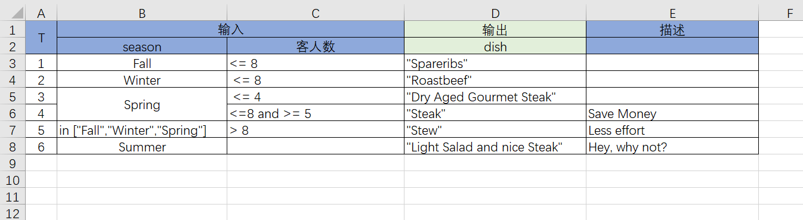

# The Essence of DDD: The Practice Guide from Philosophy to Mathematics to Engineering

## Introduction: From Theory to Practice

In the first half of this article, the [Theory Guide](https://mp.weixin.qq.com/s/xao9AKlOST0d97ztuU3z9Q), we explored the philosophical background and mathematical principles of DDD, introducing (Generalized) Reversible Computation as its technical core. We recognized that DDD's effectiveness lies in its ability to guide us in building computational models that are closer to the essence of the domain, while Reversible Computation provides the mathematical foundation for system construction and evolution.

The value of theory must be validated through practice. In this guide, we will focus on the concrete implementation of these ideas, highlighting how the **Nop Platform** applies Reversible Computation theory to real-world DDD practice. We will see how, through a systematic engineering approach, DDD's strategic and tactical designs can be effectively implemented in code and architecture, thereby lowering the barrier to entry and enhancing the maintainability and evolutionary capabilities of systems.

> The (Generalized) Reversible Computation theory mentioned in this text is not the same as the concept of Reversible Computing in physics. It does not refer to the reverse execution of computational instructions but rather to an extended understanding of the concept of "reversibility" at the level of software construction. See [Reversible Computation: The Next-Generation Software Construction Theory](https://mp.weixin.qq.com/s/CwCQgYqQZxYmlZcfXEWlgA) and [Generalized Reversible Computation: Naming and Explaining a Software Construction Paradigm](https://mp.weixin.qq.com/s/pNXPEvyVB7ljOhBQVh6c-A).

> The Nop Platform is an open-source reference implementation of (Generalized) Reversible Computation theory. Nop is a recursive acronym for "Nop is not Programming."

## **Chapter 9: Closing the Engineering Loop of DDD — The Reversible Computation Practice of the Nop Platform**

### Introduction: From Theory to an Executable Engineering System

In the preceding chapters, we constructed a cognitive framework for software design and evolution from the abstract heights of philosophy and mathematics. Its core is built upon the four pillars of "Space," "Time," "Coordinate System," and "Delta." However, no matter how grand a theory is, it will ultimately become a castle in the air if it cannot be translated into a rigorous, executable, and governable engineering system.

Now, we must answer the final and most crucial question: **How is this theory implemented?**

The Nop Platform was created to answer this very question. It does not simply provide a set of auxiliary tools for DDD; instead, it thoroughly integrates DDD's strategic and tactical patterns into the unified engineering paradigm of "**Reversible Computation + DSL Atlas + Delta**." Its ultimate goal is to transform DDD from an "art for masters," dependent on team experience and individual enlightenment, into an "engineering science" that is orchestratable, verifiable, and evolvable.

### 9.1 Institutionalizing Strategic Design: Boundary-First, Language as Coordinate System

Strategic design is the essence of DDD. The Nop Platform ensures that the strategic blueprint can be accurately and losslessly mapped into the code structure through a series of hard engineering mechanisms.

#### 9.1.1 Physicalizing the Bounded Context: From `Modular Directories` to a `DSL Atlas`

In the Nop Platform, a **Bounded Context** is no longer a vague logical concept; it is precisely physicalized in engineering terms as:

*   An independent **module root directory** (e.g., `/nop/iam` for the Identity and Access Management context).
*   Within this directory, a set of DSLs specific to this context form a "**DSL Atlas**." This atlas may include:
    *   **Data Models**: `app.orm.xlsx` or `*.orm.xml`
    *   **API and Metadata Models**: `*.xmeta`
    *   **View Models**: `*.view.xml`
    *   **Rule Models**: `*.rule.xml`
    *   **Workflow Models**: `*.wf.xml`
    *   ...and so on.

These DSLs, constrained by a unified `XDef` meta-model, ensure that the **Ubiquitous Language** is no longer a vocabulary floating in wikis or meeting minutes, but a living, parsable, verifiable, and code-generation-driving **domain coordinate system**.

> All these DSLs can be freely converted between Excel and XML/JSON formats through configuration (no coding required). This allows many models to be expressed directly in the familiar Excel format, enabling business analysts to participate directly in the modeling process. The resulting Excel file is both an intuitive requirements document and a precise model that can be automatically parsed to drive code generation, eliminating the disconnect between documentation and code from the source.

#### 9.1.2 Engineering Context Mapping: `Events`, `Services`, and `Transformation DSLs`

In the Nop Platform, the collaboration mechanisms between Bounded Contexts are concretized into the following executable engineering elements, with unified abstract interfaces:

*   **Asynchronous Event Communication**: Cross-context collaboration prioritizes **Domain Events** for loose coupling. The platform provides a unified abstract interface `IMessageService` for **one-way messaging** and includes a default implementation based on mechanisms like the `SysEvent` table, which integrates with database transactions to ensure reliable event publication.

```java
// Unified one-way message abstraction
interface IMessageService extends IMessageSender, IMessageReceiver {
    CompletionStage<Void> sendAsync(String topic, 
          Object message, MessageSendOptions options);
    IMessageSubscription subscribe(String topic, 
          IMessageConsumer listener, MessageSubscribeOptions options);
}
```

*   **Service Call Integration**: For request-response bidirectional communication, the platform provides a unified abstraction through the `IRpcService` interface. **NopRPC, its core implementation, offers a Feign-like strongly-typed client calling experience in about 3000 lines of code**. It supports creating proxy interfaces via runtime reflection or compile-time code generation, transparently mapping local method calls to remote `IRpcService` calls.

```java
// Unified two-way RPC abstraction
interface IRpcService {
    CompletionStage<ApiResponse<?>> callAsync(String serviceMethod, 
          ApiRequest<?> request, ICancelToken cancelToken);
}

// Standardized response wrapper for easy error handling and cross-protocol adaptation
class ApiResponse<T> {
    Map<String, Object> headers;
    int status; // For adapting command-line return codes
    String code;
    String msg;
    T data;
}
```

The platform also provides adapters like `MessageRpcClient`/`MessageRpcServer` to **achieve flexible conversion of communication patterns**: the core mechanism is request-response correlation based on message IDs. The client generates a unique ID for each request, sends it to a request topic, and waits for a response with the corresponding ID on a response topic. The server subscribes to the request topic, processes the request, and sends the result (or error) along with the ID to the response topic.

**Similarly, the capabilities of `IRpcService` can be used to simulate a one-way `IMessageService` interface over a two-way RPC channel**. This bidirectional adaptation capability demonstrates the flexibility and symmetry of the communication abstraction layer.

*   **Distributed Transaction Coordination**: For business scenarios requiring strong consistency, the platform supports **TCC (Try-Confirm-Cancel)** and **Saga** patterns for distributed transactions through the **`NopTcc`** component. Transaction boundaries and compensation logic are defined via annotations or tcc configurations in the XBiz model, coordinating business operations across multiple services to ensure eventual consistency.

*   **DSL-izing and Dynamic Evolution of the Anti-Corruption Layer (ACL)**: When model transformation is needed, the **Anti-Corruption Layer** is no longer scattered throughout the business code. The Nop Platform recommends using the **`Xpl` template language** or a dedicated **transformation DSL** to perform model translation during load-time or compile-time, ensuring the runtime domain core remains unpolluted by external models.
    *   **Powerful Record Mapping**: The platform includes a dedicated **`record-mapping`** DSL for mapping between two complex objects. It supports conditional mapping, many-to-one/one-to-many transformations, dictionary lookups, and other advanced features, greatly simplifying model transformation logic.
    *   **Multi-format Codec and Batch Processing**: The `record` model itself supports encoding and parsing of binary and text formats, which can be automatically used for parsing and generating TCP messages, data files, etc. Combined with the **`NopBatch`** model, it's easy to implement multi-machine, multi-threaded, chunked parallel data processing, providing powerful support for high-performance data integration and ETL scenarios.
    *   **Dynamically Evolving Anti-Corruption Logic**: The logic of the anti-corruption layer can also be dynamically evolved through the **Delta customization mechanism**, ensuring that integration logic can adapt to changes in external systems without modifying the core domain model.

The decay of architecture essentially stems from the system being continuously eroded by random, accidental requirements, leading to an increase in system entropy. **Various architectural methods are essentially trying to prevent this entropy increase, but the law of entropy in physics states that this is an unavoidable fate for any system. However, if we change our perspective, even if we cannot completely stop entropy from increasing, we can try to control where it occurs**. By isolating random and accidental requirements into independent Delta increments, the overall integrity of the core architecture is decoupled from ever-changing demands, thereby achieving long-term stability and systematically slowing down the process of decay.

#### 9.1.3 Guardrails for Hexagonal Architecture: Descriptive Contracts Derived from `BizModel` and `XMeta`

After clarifying the collaboration mechanisms between contexts, we turn to architectural governance within a context. The core design principle of the Nop Platform is **minimal information expression**: business descriptions should only contain core domain concepts (What), while delaying or omitting specific technical implementation details (How). This descriptive approach naturally possesses **framework-neutrality** (independent of any specific runtime), providing an ideal engineering foundation for implementing Hexagonal Architecture.

*   **Technology-Neutral Port Definitions**: The service **ports** provided by a context are represented in code as plain Java classes based on `@BizModel` (or equivalent XBiz DSL models). Annotations like `@BizMutation`/`@BizQuery` only declare business semantics, **without containing any HTTP paths, methods, or other protocol-specific information**. This ensures the purity of the domain model and its potential for multi-protocol adaptation (e.g., GraphQL, gRPC) from the source.

*   **Contracts Uniquely Derived from Models**: The complete contract for a port is uniquely derived from the **XMeta model** as the Single Source of Truth (SSOT). This model defines data structures, validation rules, and permissions in a purely descriptive manner, and automatically generates:
    *   GraphQL Schema and OpenAPI documentation
    *   Runtime input validation logic
    *   Front-end page skeletons and form rules
    This ensures **source-of-truth consistency** from the model to various contract forms.

*   **Supplementing Implementation Details via `Delta`**: Based on Reversible Computation theory, the platform allows for the **non-invasive addition** of protocol-specific details through the `Delta` mechanism. For example, a custom URL path can be specified in XMeta via the `rest:path` extension attribute. This supplementary information is **optional and localized**, achieving a unification of minimal expression and full customization.

*   **Configurable Replacement of Adapters**: All interactions with external infrastructure (databases, message queues, etc.) are handled through **Adapters/Drivers**. These adapters are where framework dependencies are concentrated and can be replaced via Nop's IoC container in the `_delta` directory through configuration, **without modifying the core code**. This ensures the isolation of the domain core from external technical implementations at the architectural level.

**Closing the Theoretical Loop: From Minimal Expression to Framework Neutrality**

The Nop Platform's DSL models are a minimal, descriptive representation of business information. They capture the most stable and essential business structures, becoming the **standard intermediate representation** for free transformation between different technical frameworks.

> **The Inner Logic of Minimal Information Expression**: It means describing only the goal (What) while omitting execution details (How). If multiple frameworks all achieve true minimal expression, their information content will inevitably converge toward uniqueness. This uniqueness guarantees that a **reversible, equivalent transformation** must exist between the different framework representations. By inserting a formal transformation layer into the architecture and combining it with the principle of minimal expression, framework neutrality is naturally achieved.

This purely POJO-based, minimal information expression brings a direct engineering advantage: Nop Platform's API service functions can always be unit-tested in a pure fashion. Because its input parameters and return objects are plain Java objects, testing does not require simulating complex web containers or framework contexts. One can simply construct POJO inputs and validate POJO outputs, which greatly reduces testing costs and, in turn, proves the purity and framework-neutrality of its architecture.

### 9.2 Platformizing Tactical Design: Built-in Patterns and Emergent Robustness

The Nop Platform internalizes the complex tactical patterns of DDD into standard platform capabilities, allowing developers to naturally follow best practices without conscious effort.

#### 9.2.1 Aggregates, Entities, and Value Objects: Unified by `NopORM` and `XMeta`

The Nop Platform provides a unified, efficient, and domain-aligned design foundation for DDD tactical modeling through its `NopORM` engine and `XMeta` metadata model. Its implementation retains the core value of these patterns while avoiding some of the rigid designs of traditional ORMs (like JPA), reflecting the "progressive" and "delta-based" philosophy guided by Reversible Computation theory.

*   **Entity Generation and Extension: The Generation Gap Pattern**
    Entities in the Nop Platform are directly generated from the ORM model and adopt the classic **Generation Gap Pattern**. Each entity is generated in two parts: a base class maintained by tools (e.g., `_NopAuthUser`) and a subclass that developers can freely extend (e.g., `NopAuthUser`). This pattern perfectly separates **mechanical code** from **business code**, ensuring that developer-added business methods are safely preserved when code is regenerated after model changes. Since `NopORM` entities naturally support one-to-one and one-to-many associations and can directly map rich object graphs, the entity itself often naturally assumes the role of an aggregate root in many scenarios, eliminating the need for extra abstraction layers. Domain logic can operate directly on the association graph centered on the entity, and developers only need to add auxiliary domain methods to the entity (e.g., `order.calculateTotalAmount()`).

*   **Pragmatic Handling of Associations: Re-examining "Many-to-Many"**
    `NopORM` was intentionally designed **without built-in support for many-to-many associations**. This decision stems from an insight into the nature of relational databases—they do not directly support many-to-many relationships but implement them through an intermediate table. NopORM encourages developers to explicitly define the intermediate entity (e.g., `OrderLine`), thereby preserving maximum flexibility and extensibility in the model. At the same time, to provide convenience at the domain layer, the platform supports the **automatic generation of helper methods on entities that simulate many-to-many associations** through a marker during code generation. For example, the `order.getProducts()` method can internally access the `order.getOrderLines()` collection and then retrieve the `Product` associated with each `OrderLine` to compose the return value. This allows developers to program in a natural object-oriented way at the domain layer while maintaining precise mapping and control of relationships at the persistence layer.

*   **Entities with Built-in Deltas: `OrmEntity` and State Tracking**
    Unlike JPA's transparent lazy loading and implicit dirty checking, `NopORM` provides an active `OrmEntity` base implementation. This base class accurately tracks all changed properties through a `dirtyProps` set and automatically records the values before and after modification. This means **every `OrmEntity` instance has a built-in "delta" representation of its own state changes**. This mechanism offers two core advantages:

    1.  **High-Performance Delta Updates**: When saving an entity, `NopORM` can generate and execute SQL only for the changed fields, rather than updating the entire object.
    2.  **Safe Domain Data Merging**: Using the `OrmEntityCopier` tool, complex JSON data from the front end (which can be seen as a data delta `Δ`) can be safely and efficiently merged into the current aggregate root object. This achieves an effect similar to `aggregateRoot.merge(Δ)`, which is crucial for handling concurrent updates and command merging.

*   **The Essence and Implementation of Value Objects: `OrmComponent`**
    The essence of a Value Object is not just its immutability, but more importantly, that it **encapsulates a cohesive set of business rules and invariants**. NopORM implements this encapsulation through the `IOrmComponent` interface, which is similar in role to JPA's `@Embeddable` components. However, Nop's design philosophy is **progressive and view-based**, in stark contrast to JPA's rigid "either-or" choice:

    *   **JPA's Rigidity**: A field is either a native field or encapsulated in a Component; you must choose one.
    *   **NopORM's Flexibility**: **It always generates native get/set methods for every database field**, ensuring the most basic access capability. At the same time, `OrmComponent` is designed as a **computable, non-invasive "view"** built on top of the entity's fields.

    This "view" model brings unprecedented flexibility:

    1.  **A single field can be reused by multiple Components**: For example, a `latitude/longitude` field can belong to both a `Geolocation` Component and a `RegionBoundary` Component.
    2.  **Robust handling of nulls**: When a Component is composed of multiple fields, a `null` value in one of them **does not cause the entire Component object to be `null`**. The Component always exists, and its internal methods can robustly handle partially missing data, avoiding the potential null pointer traps found in JPA.
    3.  **Explicit lifecycle control**: The `IOrmComponent` interface defines methods like `flushToEntity` and `reset`, making the timing of data synchronization between the Component and its owning entity controllable and explicit. This is particularly useful for handling complex derived logic and temporary computed states.

    Therefore, in NopORM, a Value Object is seen more as a **carrier of domain rules** and a **consistent view of data**, rather than a simple data container. Its immutability is not a mandatory requirement but is determined by the needs of the invariants it encapsulates.

*   **Dynamic Extension of Entity Models: Built-in Extension Fields Mechanism**
    To cope with frequent changes in business models and avoid the real-world challenge of frequent database table modifications, the Nop Platform has a built-in, comprehensive **Extension Fields** mechanism in `NopORM`. By simply adding a `use-ext-field` tag to an entity in the Excel data model, you can dynamically add any number of extension fields to the entity without modifying the DDL. These fields are stored uniformly in a dedicated extension table (e.g., `nop_sys_ext_field`) and, through the ORM engine, provide an **access experience at the entity object level that is indistinguishable from native fields**. Whether in Java code, EQL queries, or GraphQL interfaces, extension fields can be used, filtered, and sorted just like regular fields. This mechanism provides a standardized solution for resolving customization conflicts in productized software.

*   **Seamless Data Flow and Validation from Port to Entity**
    The Nop Platform builds an automated, metadata-driven data pipeline from external ports to internal domain entities. The core of this lies in a multi-layered, customizable meta-model system:

    1.  **ORM Model (`EntityModel`)**: An `OrmEntity` can directly access its `EntityModel`, which contains complete reflection information at the ORM layer. This is the metadata foundation that supports **persistence concerns** like multi-tenancy, logical deletion, and field encryption.
    2.  **XMeta Model**: The **data contract and validation rules** for external ports (like GraphQL, RPC) are defined by the `XMeta` metadata model. `XMeta` can be automatically generated from the ORM entity model (e.g., generating `_NopAuthUser.xmeta`) and also follows the **Generation Gap Pattern**—developers can customize, override, or extend the auto-generated rules in the non-underscored `NopAuthUser.xmeta` file.
    3.  **End-to-End Data Processing**: Data from the front end is first validated and transformed by the `ObjMetaBasedValidator`, which is based on `XMeta`. Configurations in `XMeta` like `mapToProp`, `getter`, and `setter` enable declarative implementation of needs like **front-end/back-end property name mapping**, **data format conversion**, and **complex logic computation**. The `validatedData` obtained after validation and transformation is finally merged into the domain entity object using the efficient `OrmEntityCopier` tool. This mechanism ensures the **security, correctness, and semantic consistency** of data as it crosses system boundaries, while liberating developers from tedious data glue code.

*   **Domain-Driven Invariant Abstraction: `domain` and Metaprogramming**
    The Nop Platform further deepens the "domain-driven" concept by introducing the concept of **data domains (`domain`)** at the field level. This is similar to a Domain in PowerDesigner and serves as an abstraction for field-level business semantics and invariants. For example, a field can be assigned a `domain` like `currency` or `createTime`.

    This simple configuration triggers a wide range of **cascading semantic effects** across the platform, perfectly embodying Nop's design philosophy of "few assumptions, general mechanisms":

    1.  **Persistence Behavior**: A field marked as `createTime` will **automatically** be set to the current time when the entity is saved, without any manual coding.
    2.  **Front-end Control Binding**: Front-end tag libraries like `control.xlib` will automatically recognize the `domain` configuration and look for a corresponding dedicated control (e.g., `<editor-currency>`), achieving **automatic mapping from domain semantics to UI implementation**.
    3.  **Interface Model Generation**: Even more powerfully, through metaprogramming rules defined in `meta-prop.xlib`, a `domain` can **dynamically generate or correct property definitions in XMeta**. For example, for a domain marked as a comma-separated list, the platform will automatically apply transformation rules to convert a `String` type to `List<String>` at the interface level and automatically inject serialization (`transformOut`) and deserialization (`transformIn`) logic.

```xml
<!-- Metaprogramming rule example: dynamically generate List<String> schema and transformation logic for the csv-list domain -->
<domain-csv-list outputMode="node">
  <attr name="propNode"/>
  <source>
      <prop name="${propNode.getAttr('name')}">
          <schema type="List<String>"/>
          <transformIn>return value?.$toCsvListString();</transformIn>
          <transformOut>return value?.$toCsvList();</transformOut>
      </prop>
  </source>
</domain-csv-list>
```

The introduction of these rules is not hard-coded into the platform. Instead, they are dynamically implemented through metaprogramming segments like `x:post-extends` in XMeta files, which call **general metaprogramming directives** like `<meta-gen:GenPropFromDomain/>`. **The Nop Platform has very few built-in assumptions; a large number of features and rules are introduced and composed on-demand through general, reversible metaprogramming mechanisms like `x:gen-extends` and `x:post-extends`.** This allows the platform's core to remain extremely concise while possessing nearly limitless semantic extension capabilities.

### 9.2.2 Transparent Services and Repositories: NopTaskFlow Orchestration and the Generic `EntityDao`

The Nop Platform internalizes DDD's complex tactical patterns into standard platform capabilities, with the transparent design of Repositories and Services being particularly prominent. Through the unified `IEntityDao` interface, powerful `QueryBean` capabilities, and the `NopTaskFlow` logic orchestration engine, developers can naturally follow best practices without conscious effort.

#### Unified Repository Abstraction: The Complete `IEntityDao` Interface

In NopORM, repositories are completely transparent. Through the unified `DaoProvider`, developers can obtain a strongly-typed `IEntityDao<T>` interface (e.g., `IEntityDao<NopAuthUser>`). Although each entity has a corresponding Dao interface, business logic typically **only uses the Dao interface of the aggregate root**, which naturally reinforces the DDD concept of aggregate boundaries.

`IEntityDao` provides a very complete set of CRUD operations, **eliminating the need to derive custom repositories**:

```java
// Query by equality
User example = new User();
example.setStatus(10);
IEntityDao<User> dao = daoProvider.daoFor(User.class);
List<User> userList = dao.findAllByExample(example);
List<User> pageList = dao.findPageByExample(example, List.of(orderBy(PROP_NAME_status,true)), 0,100);
User user = dao.findFirstByExample(example);
long count = dao.countByExample(example);
dao.saveEntity(newEntity);
```

#### Powerful `QueryBean`: Standardized Encapsulation for Complex Queries

`QueryBean` provides rich query condition encapsulation, supporting various query scenarios from simple to complex:

**1. Complex Condition Queries**

```java
// Similar to MyBatisPlus's LambdaQueryWrapper
QueryBean query = new QueryBean();
query.addFilter(eq(PROP_NAME_username, "Zhang San"))
    .addFilter(and(
        or(
            between(PROP_NAME_age, 18, 30),
            eq(PROP_NAME_gender, 1)
        )))
    .addOrderField(PROP_NAME_createTime, true)
    .offset(100)
    .limit(20);

List<User> userList = dao.findPageByQuery(query);
User user = dao.findFirstByQuery(query);
```

**2. Embedded Subqueries**

```java
query.addFilter(SQL.begin("o.id in (select y.xx from tbl y where y.id=?)", 3)
   .end().asFilter());
```

**3. Automatic Join Queries**

```java
// Composite properties are automatically expanded into join queries
query.addFilter(eq("product.productType.name", "abc"));
```

**4. Unified Filter Model**


Filter provides a standard way to express complex conditional logic, reusable across multiple scenarios:

-   In Java code, built via the `FilterBeans` utility class
-   In XML/Xpl templates, using syntax like `<eq name="status" value="1" />`
-   Automatically converted to SQL statements or Java Predicates
-   Visually editable in the front-end via a Condition control
-   Used uniformly in rule engines, data permissions, etc.

#### Unified SQL Management: The `sql-lib` Mechanism Surpassing MyBatis

Using the Nop Platform's built-in infrastructure, the `sql-lib` model can be implemented in less than 1000 lines of code. It centrally manages all complex SQL/EQL/DQL statements, offering capabilities more powerful than MyBatis:

> DQL is a multi-dimensional data query language for OLAP invented by the report vendor Ruqian, allowing business users to perform complex cross-table data analysis with simple syntax. See [Say Goodbye to Wide Tables, Achieve a New Generation of BI with DQL - Qian Academy](http://c.raqsoft.com.cn/article/1653901344139?p=1&m=0)

**1. Unified Management of Multiple Query Languages**

```xml
<sql-lib>
  <sqls>
    <sql name="nativeSql">...</sql>
    <eql name="entityQuery">...</eql>
    <query name="dqlQuery">...</query>
  </sqls>
</sql-lib>
```

**2. Delta Customization Support**
Customize SQL statements without modifying base product code, using delta files:

```xml
<sql-lib x:extends="super">
  <sqls>
    <eql name="yyy">...</eql> <!-- Overrides the base definition -->
  </sqls>
</sql-lib>
```

**3. Powerful XPL Template Language**
Compared to MyBatis's limited tags, XPL provides full programming capabilities and tag abstraction:

```xml
<sql name="complexQuery">
  <source>
    select <my:CustomFields/>
    from MyEntity o
    where <my:AuthFilter/>
    <c:if test="${!_.isEmpty(status)}">
      and o.status = ${status}
    </c:if>
  </source>
</sql>
```

**4. Macro Tag Metaprogramming**
Simplify SQL writing through compile-time macro transformations:

```xml
<sql:filter>and o.classId = :myVar</sql:filter>
<!-- Expands at compile-time to -->
<c:if test="${!_.isEmpty(myVar)}">
  and o.classId = ${myVar}
</c:if>
```

**5. Secure SQL Output Mode**
Automatic SQL injection prevention and intelligent parameter handling:

```sql
id in (${ids}) <!-- Automatically expands to id in (?,?,?) -->
name = ${name}  <!-- Automatically parameterized -->
```

**6. Strongly-Typed Mapper Interfaces**

```java
@SqlLibMapper("/app/mall/sql/LitemallGoods.sql-lib.xml")
public interface LitemallGoodsMapper {
    void syncCartProduct(@Name("product") LitemallGoodsProduct product);
}
```

#### Service Logic Orchestration: NopTaskFlow's Fine-Grained Flow Control

NopTaskFlow is the Nop Platform's built-in logic orchestration engine. It adopts the design principle of **minimal information expression** and can support both heavyweight distributed service orchestration and lightweight, fine-grained logic orchestration at the function level within a service.

**Advantages Over Microservice Orchestration Engines**:

*   **Direct Local Function Calls**: No REST call serialization overhead, supports passing complex domain object references.
*   **Local Environment Integration**: Supports executing multiple steps within the same database transaction or OrmSession.
*   **Lightweight Execution**: Can run in a lightweight mode with no third-party dependencies and no persistence.
*   **Asynchrony and State Recovery**: Built-in support for asynchronous processing, timeout retries, and breakpoint resumption.

**Seamless Integration of Service Functions and TaskFlow**:

In the xbiz model, a service function can be delegated to a TaskFlow with minimal configuration:

```xml
<biz x:extends="/nop/biz/lib/common.xbiz">
  <actions>
    <mutation name="callTask" task:name="test/DemoTask"/>
  </actions>
</biz>
```

Through compile-time metaprogramming, the platform automatically infers the input and output parameter types and implementation code for the service function from the TaskFlow model, achieving **responsive derivation**: when the TaskFlow model is modified, the dependent service function definition is automatically updated.

**TaskFlow Example: Order Discount Rules**

```yaml
version: 1
steps:
  - type: xpl
    name: book_discount_1
    when: "order.getOriginalPrice() < 100"
    source: |
      order.setRealPrice(order.getOriginalPrice());
      logInfo("No discount");
  - type: xpl
    name: book_discount_4
    when: "order.getOriginalPrice() >= 300"
    source: |
      order.setRealPrice(order.getOriginalPrice() - 100);
      logInfo("Discount of 100");
  - type: xpl
    name: book_discount_2
    when: "order.getOriginalPrice() >= 100 && order.getOriginalPrice() < 200"
    source: |
      order.setRealPrice(order.getOriginalPrice() - 20);
      logInfo("Discount of 20");
outputs:
  - name: realPrice
    source: order.realPrice
```

#### Rule Engine Integration: NopRule for Professional Decision Handling



For complex business rules, the Nop Platform also provides a dedicated rule engine, NopRule, which integrates seamlessly with TaskFlow:

```xml
<steps>
  <xpl name="calcDiscount">
    <source>
      <rule:Execute ruleModelPath="/nop/demo/rule/discount.rule.xlsx"
                    inputs="${{order}}" xpl:return="outputs"/>
      <c:script>
        order.setRealPrice(order.originalPrice - outputs.discount);
      </c:script>
    </source>
  </xpl>
</steps>
```

NopRule supports decision tables and decision trees, which can be configured visually via Excel (or edited online), making it especially suitable for managing complex business rules.

#### Clear Division of Labor in the Service Layer

Through the collaboration of the above components, the Nop Platform achieves a clear division of labor in the service layer:

*   **Repository Layer**: Unified abstraction by `IEntityDao`, providing powerful data access.
*   **Domain Logic**: Complex business rules handled by `NopRule`, process orchestration managed by `NopTaskFlow`.
*   **Application Service**: Hosted by the `XBiz` model, responsible for use case orchestration and transaction management.
*   **Query Abstraction**: All data queries managed uniformly through `QueryBean` and `sql-lib`.
*   **CRUD Automation**: The platform automatically handles templated CRUD operations, allowing developers to focus on business logic.

### 9.2.3 Natural Emergence of Event-Driven Architecture: Platform-wide Observability and Declarative Event Weaving

Event-driven architecture is the soul of DDD, but traditional implementations often rely on developers manually publishing events in their code. This "deliberate" approach can easily lead to omissions and clutter domain code with technical concerns. The Nop Platform takes a different path: through **system-wide model definitions** and a **unified delta syntax**, it transforms the system into a "**naturally observable**" organism. This allows event listening and triggering to become a side effect that can be **seamlessly woven in at any level in a declarative manner**, letting an event-driven architecture "emerge" naturally from the platform.

#### **Cross-Context Events: Reliable Event Bus and the `Outbox` Pattern**

For loosely coupled integration between Bounded Contexts, the platform provides a standardized asynchronous event communication abstraction, `IMessageService`, with a built-in default implementation, **`SysDaoMessageService`**, based on mechanisms like the **`SysEvent`** table. This implementation is tightly integrated with database transactions, ensuring that domain events are published atomically within the **same database transaction** as the business operation, providing a reliable engineering foundation for eventual consistency.

#### **System-wide Observability: A Standardized Coordinate System for Event Triggering**

As a thoroughly model-driven architecture, the Nop Platform defines DSL models with clear lifecycles at **every level** of the system. These models naturally standardize event trigger points, providing a unified "**observation coordinate system**" for declarative event listening:

*   **Service Layer Observation Points**: In the **`XBiz`** model, which hosts application services, developers can use the `observe` section to declaratively configure listeners that trigger before or after a service function executes. These listeners can respond to events on a global EventBus, implementing cross-cutting concerns decoupled from business logic.

    ```xml
    <!-- Declarative listening in an XBiz model: triggers when an action of the specified BizModel is executed -->
    <observe from="MyBizObj" event="createOrder">
    <source>
        <!-- Write Xpl template script here to respond to the event, e.g., send notifications, record audit logs -->
    </source>
    </observe>
    ```

*   **Persistence Layer Observation Points**: The `NopORM` engine, through the **`IOrmInterceptor`** interface, provides extremely fine-grained, entity-level lifecycle events (e.g., `pre-save`, `post-save`, `pre-update`, `post-delete`). More importantly, the platform's **`XplOrmInterceptorFactoryBean`** mechanism allows developers to define "**database trigger**"-style interception logic for specific entities using the Xpl template language, simply by configuring a `/_moduleId/orm/app.orm-interceptor.xml` file, without writing any Java code.

    ```xml
    <interceptor>
    <entity name="io.nop.auth.dao.entity.NopAuthUser">
        <post-save id="syncToEs">
            <!-- Declarative implementation: automatically sync to Elasticsearch after a user entity is saved -->
        </post-save>
    </entity>
    </interceptor>
    ```

*   **Process Layer Observation Points**: When business logic is finely orchestrated using the **`NopTaskFlow`** engine, the event mechanism becomes even more flexible. Developers can either directly insert **observation steps** to trigger events at any point in the process or use the Step's **`decorator`** mechanism (which acts similarly to Java annotations) to non-invasively attach event-triggering side-effect logic to a step.

#### **Declarative Event Weaving: Metaprogramming Injection Based on `Delta`**

The most advanced manifestation of the Nop Platform's event-driven capabilities lies in its **unified delta-based customization ability**. All DSL models follow the XLang delta syntax, supporting metaprogramming extensions through `x:gen-extends` and `x:post-extends`. This means that **event listening logic itself can exist outside the base model and be "injected" into existing models during a later customization phase via a `Delta` file**.

For example, a standard product module might not initially include audit logging functionality. However, when deploying for a specific client, we can use a `_delta` customization file to "apply a delta" to key service methods or entity persistence operations, declaratively adding the logic to trigger audit events. **This approach achieves complete decoupling and on-demand composition of event concerns, making system observability a dynamically evolving feature rather than a fixed, static design.**

**Closing the Theoretical Loop: From "Deliberate Design" to "Natural Emergence"**

In the Nop Platform, event-driven is no longer just a tactical pattern in DDD; it is elevated to a **system-level first principle** that permeates the entire architecture. Through:

1.  **Standardized observation points** (the lifecycles of models at every layer),
2.  **A unified listening mechanism** (Observe section, OrmInterceptor, TaskFlow Decorator),
3.  **Delta-based weaving capabilities** (metaprogramming injection),

event listening becomes a "pluggable" capability that can be **declared after the fact, precisely targeted, and non-invasively attached**. Developers can make the system "grow" event-driven nerve endings without modifying core business logic. This is a profound embodiment of Reversible Computation theory at the architectural level: using a delta (Δ) to superimpose new behavior (⊕) onto an already generated base system (F(X)), ultimately allowing complex event-response capabilities to naturally **emerge** from the platform.

### 9.2.4 Queries and Read Models: The Automation of `GraphQL` and `DataLoader`

A long-standing dilemma in traditional API design is whether to create complex interfaces that lead to "over-fetching" or multiple simple interfaces that cause "under-fetching" and numerous network requests.

#### GraphQL as a Composable Information Algebra System

NopGraphQL fundamentally **reinterprets** GraphQL, elevating it from a mere API protocol to a **universal engine for information decomposition, composition, and dispatch**.

> **GraphQL is essentially REST with a standardized, composable `@selection` parameter.**

For example:

```graphql
query {
  NopAuthDept__findAll {
    name, status, children { name, status }
  }
}
```

is equivalent to:

```
/r/NopAuthDept__findAll?@selection=name,status,children{name,status}
```

This means GraphQL is a **natural superset** of REST: when `@selection` is not provided, the system degrades to traditional REST behavior. This mathematically proves that **REST is a special case of GraphQL in select-all mode**.

#### Two-Phase Execution Model: Built-in Separation of Read/Write Concerns

NopGraphQL employs a **two-phase execution model**, naturally achieving an architectural separation of read and write operations, which aligns with the principles of CQRS:

1.  **Phase One: Core Business Execution (within a transaction)**
    *   Automatically starts and commits a database transaction for `@BizMutation`.
    *   Executes the main service function to complete the state change.
    *   **The transaction is committed immediately**, releasing the database connection in the shortest possible time.

2.  **Phase Two: Result Processing (read-only)**
    *   Invokes `@BizLoader` on-demand based on the client's `FieldSelection`.
    *   The ORM Session is forced into **read-only mode** to prevent state pollution.
    *   Performs field-level permission checks and data masking.

**CQRS Connection**: Through `@BizLoader` and the `XMeta` model, the system can define **data structures and loading logic specifically for query scenarios**. This forms a natural separation of responsibilities from the write model, which primarily focuses on state changes and business rules. The read side can freely compose data across aggregates, define computed fields, and apply performance optimization strategies without being constrained by the write model's transaction boundaries or function signatures.

#### DataLoader Automation: Solving the N+1 Query Problem

Achieve orthogonal decomposition of knowledge through the `@BizLoader` mechanism:

```java
// Core query
@BizQuery
public NopAuthUser getUser(@Name("id") String id) {
    return userDao.findById(id);
}

// Associated loader
@BizLoader
public List<String> roles(@ContextSource NopAuthUser user) {
    return roleDao.findRolesByUserId(user.getId());
}
```

When a client queries `{ user(id:"123") { id, name, roles } }`, the engine automatically:

1.  Calls `getUser` to fetch the core object.
2.  Discovers the need for the `roles` field and matches it to the `roles` loader.
3.  Merges and batches queries through the DataLoader mechanism, **solving the N+1 problem at its root**.

#### Performance Optimization: Early Information Use and Execution Pruning

Avoid unnecessary computations in phase one by checking the field selection:

```java
@BizQuery
public Order getOrder(@Name("id") String id, FieldSelection selection) {
    Order order = orderDao.getById(id);

    // Perform expensive calculation only when the client needs it
    if (selection.hasField("salesAnalysis")) {
        order.setSalesAnalysis(analysisService.calculateAnalysis(order));
    }

    return order;
}
```

#### The Dual Unity of Aggregate Roots and GraphQL

The Nop Platform reinterprets the meaning of an Aggregate Root:

*   **An Aggregate Root is an information construction operation**: It builds a unified, highly cohesive "conceptual map."
*   **GraphQL is an information deconstruction operation**: It dynamically trims the required data through `FieldSelection`.

This dual unity of "aggregation" and "selection" ensures both the expressive power of the model and the efficiency of the runtime, allowing the front-end and back-end to evolve independently with clear contracts.

#### Security Assurance: Field-Level Permission Control

*   **Field-level security** is built into the `XMeta` model.
*   Field-level ACLs and data masking policies pre-prune permissions during the query plan generation phase.
*   Unauthorized access and side-channel information leaks are prevented at the source.

#### Theoretical Value

The innovation of NopGraphQL lies in **elevating APIs from a "collection of endpoints" to a "composable information algebra system."** Business logic is written once and can be automatically adapted by the engine to multiple protocols like GraphQL, REST, and gRPC, creating a truly **living information space**.

### 9.2.5 Eradicating Stubborn Problems: Solving `N+1` and `Database Deadlocks` at the Source

In traditional DDD practice, the inherent conflict between object-oriented navigational queries and database transaction mechanisms often leads to the stubborn performance and concurrency problems of `N+1 queries` and `database deadlocks`. The Nop Platform addresses these issues with targeted mitigation and avoidance through the systematic design of its `NopORM` engine.

*   **Farewell to N+1: Declarative Batch Loading**
    The `batchLoadProps` function provided by `IEntityDao` allows developers to preload all necessary associated properties with a single batch query after fetching a list of entities. A simple declaration is all it takes to solve the N+1 problem without breaking the encapsulation of the aggregate.

```java
List<MyEntity> list = dao.findAll();
// Preload multi-level associations with a single batch query
dao.batchLoadProps(list, Arrays.asList("parent", "children", "parent.parent"));
```

    Its internal mechanism is similar to GraphQL's `DataLoader` but is deeply optimized for the association graph characteristics of ORM entities. Compared to the dilemma in JPA—where using entity navigation is most natural, but performance bottlenecks force invasive rewrites of business code—NopORM's **descriptive batch loading** provides a **performance optimization path decoupled from business logic**.

    This mechanism also broadens the applicability of aggregate roots. For scenarios like batch processing that require loading large amounts of data, developers do not need to abandon the object-oriented programming model. Simply executing `batchLoad` after loading each chunk is enough to efficiently assemble the complete object graph. More importantly, in higher-level frameworks like `NopGraphQL` and `SqlManager`, batch loading can be automatically analyzed and executed based on the client's Field Selection, achieving **performance optimization that is transparent and imperceptible** to the developer.

*   **Systematically Avoiding Deadlocks: Globally Ordered Write Operations**
    NopORM abandons JPA's `auto-flush` mode, which is prone to causing chaos. Write operations like `dao.save(entity)` only register the entity's state with the current `OrmSession` and do not immediately generate SQL. All actual database write operations are deferred until just before the transaction commits, to be executed in a single, unified `flush` operation.

    During this process, NopORM **globally sorts all pending INSERT, UPDATE, and DELETE operations based on table dependencies and entity primary keys**. This mechanism ensures that in any concurrent scenario, the order in which multiple transactions acquire database locks is **deterministic and consistent**, thus greatly reducing the probability of deadlocks at a system level. The tricky concurrency problem of deadlocks is no longer solely reliant on developers following fragile best practices to avoid; it is largely "**designed away**" through architectural design.

#### Addendum: OrmSession as a LoadingCache

In essence, an `OrmSession` can be viewed as a `LoadingCache` specifically designed for ORM. When associated data is accessed through object navigation, if the target entity is not yet loaded, the Session automatically calls the corresponding `Persister` to load it from the database. With NopORM, we can achieve **data source transparency**: developers can manually "inject" entity objects obtained through any means (e.g., remote API calls, message queues, file parsing) into the Session using the `attach` method. Once managed by the Session, these objects are indistinguishable from entities loaded from the database; all mechanisms for association access, state tracking, and persistence based on object navigation will work correctly. This ensures that **when the data source changes, the core domain model code requires no modification**, truly achieving data-source-agnostic domain programming.

```java
interface IOrmSession{
    // ...

    /**
     * Attaches an entity from outside the session to the session.
     *
     * @param entity
     */
    void attach(IOrmEntity entity, boolean cascade);

    /**
     * Assumes all data is in memory, directly finds collection elements in the session,
     * and assembles them into a collection object.
     *
     * @param collectionName
     */
    void assembleAllCollectionInMemory(String collectionName);

    void assembleCollectionInMemory(Collection<? extends IOrmEntity> coll);
}
```

### **Architectural Panorama: A Unified Technical Core and Platformized Capabilities**

Through the detailed analysis above, we have seen how the Nop Platform internalizes DDD's tactical patterns into standard platform capabilities. The following diagram provides a panoramic view of how these capabilities work together around a unified technical core to form a complete tactical design support system:


This architecture reflects the following core design principles:

*   **Domain Model at the Center**: `BizObject` and `ORM` form a unified domain object model, hosting the core business logic.
*   **Multi-Engine Platform Integration**:
    *   The `GraphQL` engine provides flexible query capabilities, automatically optimizing N+1 problems.
    *   The `Workflow` and `StateMachine` engines drive complex business processes.
    *   `BizModel` achieves organic composition of business logic through a "dispatch-extend" mechanism.
*   **Transparent Data Access Enhancement**: The `ORM` layer has built-in enterprise-grade features like lazy loading, batch loading, extension fields, and distributed transactions.
*   **Orthogonal Security Architecture**: Data permissions and operation permissions are treated as separate concerns, injected into business processes through standard interfaces.
*   **Diverse Integration Support**: Native support for integration patterns like `MessageQueue`, `RPC`, and `BatchFile`.

This design allows developers to naturally achieve a robust and evolvable system architecture without consciously following DDD patterns—this is the engineering embodiment of "emergent robustness."

## 9.3 Programmable Evolution: The "Trinity" Paradigm of Reversible Computation

Reversible Computation provides a solid mathematical and engineering foundation for the implementation and long-term evolution of DDD models through the unified paradigm `Y = F(X) ⊕ Δ`.

### 9.3.1 The Unified Evolution Formula: `Effective Model = Generator<Base Model> ⊕ Δ(Delta)`

In the Nop Platform, the construction of any model follows this formula. Whether it's a data model, a UI model, or a process model, its final effective form is composed of a base model (often **generated** from an upstream model) and one or more **Delta** packages.

**A Profound Mathematical Insight: Full Content is a Special Case of a Delta**

This design is rooted in a profound mathematical principle: **a full representation is just a special case of a delta** (`A = 0 + A`). In any system with a unit element, the full representation is equivalent to "the unit element + itself." For example, in software construction, the "do nothing" null operation is the unit element, and any operation can be seen as a delta on top of that null operation. This seemingly simple cognitive shift is actually a paradigm shift from "action-oriented thinking" to "noun-oriented thinking" and is the key breakthrough in treating **delta as a first-class concept**. It completely unifies "building from scratch" and "customizing modifications" mathematically, providing unprecedented flexibility for software evolution.

#### **The Engineering Value of Isomorphic Design**

The direct engineering manifestation of this principle is **isomorphic design**: the format for expressing a delta is identical to that of the full model, eliminating the need for a special format for deltas. Compare JSON Patch with the Nop Platform's implementation:

```json
// JSON Patch (Heterogeneous design, special format)
[
  {"op": "add", "path": "/columns/-", "value": {"name": "newColumn"}},
  {"op": "remove", "path": "/columns/2"}
]

// Nop Platform (Isomorphic design, unified format)
{
  "columns": [
    {"name": "newColumn", "type": "string"},
    {"name": "column2", "x:override": "remove"}
  ]
}
```

JSON Patch uses a completely different syntax and relies on unstable array indices. The Nop Platform's delta maintains the same structure as the full model, using only a few extension attributes like `x:override` to express the intent of the change and relying on stable semantic identifiers (like `name`) to locate elements. This isomorphic design is consistent throughout the platform: from modified data submitted by the front-end to change records in the back-end database, all use a unified delta representation.

**A Breakthrough Insight: The Scope of a Delta Can Cover Any Granularity**

Recognizing that "full content is a special case of a delta" also shatters a common misconception: that deltas must be small, local changes. In reality, **the scope of a delta can cover any granularity**—from modifying a single field to refactoring an entire module, and even building a brand new system, all can be expressed through deltas. In a mathematical context with inverse elements, a delta can even express the reverse operation of "from the current system to an empty state." This understanding liberates the mindset of software evolution, providing a unified theoretical framework for system refactoring and customization.

#### **Built-in Delta Support in DSLs: All DSLs Follow a Unified Decomposition and Merge Mechanism**

All DSLs in the Nop Platform natively support decomposition and merging, implementing complex model management through the standardized XLang Delta syntax:

```xml
<!-- Inherit a base model via x:extends -->
<meta x:extends="_NopAuthUser.xmeta" x:schema="/nop/schema/xmeta.xdef"
      xmlns:x="/nop/schema/xdsl.xdef">

    <!-- Dynamically generate model content via metaprogramming -->
    <x:post-extends>
        <biz-gen:GenDictLabelFields xpl:lib="/nop/core/xlib/biz-gen.xlib"/>
    </x:post-extends>
</meta>
```

Key mechanisms include:

*   **`x:extends`**: Inherits from an existing model file.
*   **`x:gen-extends`/`x:post-extends`**: Built-in metaprogramming mechanism, implementing the Generator part of Reversible Computation.
*   **`x:override`**: Specifies the node merge strategy (merge, replace, remove, etc.).
*   **Extension Attribute Support**: All DSL model objects support arbitrary extension attributes without modifying the platform's built-in meta-models.

### 9.3.2 The Deterministic Construction Phase: `S-N-V` (Structure Merge - Normalization - Validation) Loading

The construction process for all DSL models in the Nop Platform is decomposed into three deterministic phases: S (Structure Merge) **→** N (Normalization) **→** V (Validation). This layered principle, through clever "process decomposition" and "separation of concerns," solves the core challenges in designing a universal merge algorithm.

#### **The Fundamental Insight: Retreating to Structural Unification**

Similar to how relational databases solve data consistency issues by **retreating to a non-redundant, standardized table structure**, the Nop Platform achieves unified delta processing by **retreating to a standardized XDSL structural layer**. That is, delta merging is not performed at the level of parsed, strongly-typed object models, but at a lower-level, standardized tree structure (XNode).

| Relational Model Theory | Reversible Computation Theory |
| :--- | :--- |
| Schema Definition | XDefinition Meta-model Specification |
| Non-redundant Tabular Data | Non-redundant Tree-like Information Structure: XDSL |
| On-the-fly computation on standardized data structures: SQL | Compile-time computation on a generic XNode data structure: XLang |

This "one step back" design allows:

-   **Decoupling of merge algorithms from business semantics**: A single universal algorithm can handle the merging of all DSLs.
-   **Deterministic merge results**: The same input will always produce the same output structure.
-   **Support for unified cross-domain processing**: DSLs from different business domains use the same merge mechanism.

**"Virtual Time" and Deferred Validation**

The S-N-V principle introduces a philosophy of "Virtual Time," which boldly allows a model to exist in a **temporary, semantically inconsistent intermediate state** during its construction. Before the final validation occurs, the system tolerates the model's "imperfections," thereby completely decoupling the generic "structural arrangement" from the complex "meaning check."

**Three-Phase Decomposition**

*   **S - Structure Merge: Generic Tree Structure Operations**
    This phase operates only at the **structural layer**, executing domain-agnostic, universal algorithms. It mechanically merges the XNode tree based on meta-directives like `x:override`, ensuring the merge process satisfies the **associative law**. The output may be an intermediate model that does not yet satisfy semantic constraints.

*   **N - Normalization: Domain-Specific Semantic Processing**
    On the basis of the merged structure, domain-specific semantic corrections are performed. This is analogous to view computation in relational databases and includes:
    *   Parsing and applying default values
    *   Computing derived properties
    *   Expanding shorthand syntax
    *   Automatically resolving benign semantic conflicts

*   **V - Validation: Final Legality Check**
    After all structural semantics have stabilized, a final, global validation is performed to ensure the output is a completely legal model.

**Engineering Value: Determinism from Structural Unification**

```javascript
// Unified model loading process: Structure Layer => Object Layer
modelPath => XDSL => [S-N-V processing] => DslModel
```

This structure-layer-based unified processing ensures:

1.  **Algorithmic Generality**: The S phase uses one set of algorithms for all models, with O(1) complexity.
2.  **Semantic Extensibility**: The N/V phases are attached as pluggable rules to specific domains.
3.  **High Runtime Performance**: All complex transformations are completed at load-time.
4.  **Online Dynamic Updates**: Supports runtime model hot-swapping through a virtual file system.

#### Dynamic Delta-based Updates

How can we ensure runtime state consistency when a DSL model is updated with a delta? To answer this, we can look at the solution provided by microservices architecture.

Microservices can achieve dynamic rolling updates because of their so-called stateless design. The traditional object-oriented approach encapsulates functions and the data they process into objects, leading to a tangled mess of functions and data—a spaghetti-like structure that is difficult to break down and, consequently, difficult to update partially. Ideally, we want a layered structure, like a mille-feuille pastry, where layers can be added or removed at will.

The essence of stateless design is the decoupling of processing logic from the runtime state space. The "pure air" of static logic rises, and the "turbid air" of dynamic runtime state sinks. This dynamic state data is pushed out of the static logic structure, with some becoming parameters passed between functions and some becoming persistent data stored in shared storage. This way, the microservice's runtime structure itself no longer explicitly contains state data, so its dynamic updates are not entangled with state space data migration, becoming a problem that can be solved independently.

When accessing a microservice, we first go to a service registry, dynamically look up the service instance by name, and then send it input parameters. The service instance then automatically loads persistent state data based on these parameters. In the abstract language of functional programming, the process of a microservice corresponds to:

```
  serviceName => Service => input => state => Result
```

Similarly, in the Nop Platform, the processing of all models follows the same logical structure:

```
  modelPath => XDSL => DslModel => arguments => scope => Result
```

Like microservices, the dynamic updating of a DSL model can be independent of the structural migration of the state space.

### 9.3.3 The Fractal Software Production Line: `XORM` → `XMeta` → `XView` → `XPage`


The Nop Platform decomposes the process from data to page into a multi-stage **fractal software production line**. Each transformation step on this line strictly follows the evolution formula of Reversible Computation:

`XMeta = Generator<XORM> ⊕ Δ_meta`
`XView = Generator<XMeta> ⊕ Δ_view`
`XPage = Generator<XView> ⊕ Δ_page`

**The Essence of Fractal: Infinitely Recursive Decomposition**

The core of this fractal design is its **self-similarity**: each component can be further decomposed into a combination of finer-grained generators and deltas. Not only does the final product follow this pattern, but the generators and deltas themselves also follow the same structure:

`Generator<X> = Generator<Generator<X>> ⊕ Δ_generator`
`Δ_meta = Generator<Δ_base> ⊕ Δ_custom`

This means:

-   **Generators can be constructed in layers**: A base generator can be customized with a delta to create a more specialized generator.
-   **Deltas can be defined recursively**: A delta itself can be composed from more fundamental deltas via a generator.
-   **Unity at every granularity**: From the finest-grained field definition to a complete page layout, everything follows the same construction pattern.

**Complete Independence at Every Level**

Based on this fractal characteristic, each level possesses complete, independent capabilities:

-   **XMeta Level**: Can be entirely generated from XORM, written manually from scratch, or built from zero using `Generator<Empty> ⊕ Δ_meta`.
-   **XView Level**: The generator itself can be `Generator<XMeta>`, or it can be `Generator<Empty>` plus a complete `Δ_view`.
-   **Arbitrary Combination**: Any level can selectively use information from the level below or be developed completely independently.

This infinitely recursive fractal design completely solves the rigid constraints of traditional MDA (either fully automatic or fully manual), achieving a truly flexible software production line. Developers can intervene at any granularity and any level, using the delta mechanism to achieve all kinds of customization needs, from minor tweaks to fundamental refactoring, while the entire system maintains a unified mathematical structure and predictable behavior.

### 9.3.4 Full-Stack Delta Customization: The Path of Evolution Without Changing a Single Line of Base Code

In the Nop Platform, the Reversible Computation concept of delta customization is systematically realized through the core technology of a **Delta File System**. This mechanism turns the ideal of deep customization "without changing a single line of base code" into an engineering reality, fundamentally changing the software delivery and evolution model.

#### The Delta File System: The Cornerstone of System-Level Customization

The Nop Platform's virtual file system provides capabilities similar to UnionFS in Docker technology, implementing system-level resource customization through layered overlays:

*   `/_vfs/_delta/default/a.xml` will automatically override `/_vfs/a.xml`.
*   All code loaded via `ResourceComponentManager.loadComponentModel("/a.xml")` will actually read `/_vfs/_delta/default/a.xml` after the delta layer is enabled.
*   Multiple delta layers can be supported by configuring `nop.core.vfs.delta-layer-ids`, enabling more complex customization strategies.
*   Model records in the database (e.g., `wf:MyWf/1.0`) can also be mapped to virtual file paths, bringing dynamically created models under the management of the delta mechanism.

#### Full-Stack Customization Example: Seamless Overlays from Data Model to Front-end UI


In the `_delta` directory, by using delta files with the same names as the base models, any layer of the system can be non-invasively modified:

*   **Data Model Delta**: In `orm/app.orm.xml`, use `x:override="remove"` to delete fields from the base product, or directly add new business entities.
*   **Business Logic Delta**: Through an `xbiz/app.xbiz` file, declaratively add new business methods to the base entity's CRUD services or override existing logic.
*   **IoC Configuration Delta**: Override `beans/app.beans.xml`, using `x:extends="super"` to append new beans, modify the properties of existing beans, or even replace an entire bean's implementation class.
*   **Front-end UI Delta**: In `pages/MyEntity/MyEntity.view.xml`, add new action buttons to a base list page or modify the layout of a form through delta merging.
*   **Engine Capability Delta**: All engine models (rules, reports, workflows) are XDSLs, and extension nodes can be injected or existing definitions modified via the `Delta` mechanism.

#### Paradigm Shift: From "1 Core + N Forks" to "1 Base + N Deltas"

The delta mechanism of Reversible Computation brings about a fundamental paradigm shift, upgrading the software construction and delivery model from the traditional branching model to a delta-stacking model:

-   **Traditional Model (1 Core + N Forks)**: Based on a core version, multiple independent branches (Forks) are created to meet the needs of different customers or markets. This leads to an **exponential increase in maintenance costs**, makes it difficult to synchronize features between branches, and ultimately results in merge hell.

-   **Reversible Computation Model (1 Base + N Deltas)**: Based on a unified base product, the final system is generated by stacking multiple independent, composable delta packages (Δ). The unified formula is:
    `Effective System = Base ⊕ Δ_Industry ⊕ Δ_Region ⊕ Δ_Customer`

#### The Sustainability of Customization and Evolution

This full-stack, delta-based customization method ensures the sustainability of software evolution:

1.  **The base product can be upgraded independently**: Delta customizations are physically isolated from the base code. Bug fixes and feature enhancements to the base product can be released independently, and custom projects can safely merge these changes by updating their dependency versions.
2.  **Customization logic can be accumulated and reused**: Customization logic for specific industries or customers can be packaged as independent Delta modules and reused in different projects.
3.  **Customization conflicts can be visually traced**: Thanks to the metadata preserved by XNode during the merge process, the origin of every custom element can be precisely traced. When conflicts occur between multiple Delta modules, they can be quickly located and resolved.

Through this systematic delta customization mechanism, the Nop Platform achieves the ideal goal of "retaining the efficiency of automation without losing the flexibility of customization," providing a solid technical foundation for the long-term evolution of complex business systems.

#### **Platformized Multi-tenancy: The Tenant as a Coordinate Dimension**

This full-stack delta customization mechanism provides an exceptionally elegant, platform-level solution for the complex requirement of multi-tenancy. In the Nop Platform, multi-tenancy is not a "special case" that requires special coding but a natural consequence of its core architecture. Based on the idea that "extensibility is dimension extension," a **Tenant is treated as an independent dimension in the system's coordinate space**.

When the system needs to load any resource (like an ORM model, a business process, or a UI page), its core model loader (`Loader`) automatically adds a `tenantId` dimension, extending the loading function from `Model = Loader(resourcePath)` to `Model = Loader(resourcePath ⊗ tenantId)`. **This is analogous to extending a single-variable function in mathematics to a function acting on a tensor product space.**

This abstraction is seamlessly implemented in engineering terms through the platform's **Delta File System**: when the `Loader` loads `a.xml`, it automatically considers the "current tenant ID" as a dimension, prioritizing searching and merging from the tenant-specific delta layer (e.g., `/_delta/tenantA/a.xml`).

Therefore, whether implementing simple **data isolation** (by customizing the `NopORM` model under a tenant delta layer to automatically add a tenant ID filter to all queries) or implementing complex **tenant-specific business logic** (by customizing `NopTaskFlow` or `NopRule` models), everything is accomplished under the unified delta paradigm of `Y = F(X) ⊕ Δ`. Multi-tenancy is no longer a collection of scattered `if-else` statements but a universal, predictable system behavior that **emerges** from the platform's first principles.

### 9.4 Contract-First: From "Living Documents" to "Living Systems"

The Nop Platform elevates the DDD principles of "Ubiquitous Language" and "Model-Driven" to a truly automated, contract-first software production line.

#### 9.4.1 Contract is Model, Model is Contract: An Automated Production Pipeline Starting with `Excel`

In Nop, Contract-First is implemented in its most thorough form. All key designs, such as data models and API interfaces, are clearly defined in an **Excel model** during the requirements phase. This model is no longer a static document but an "**executable contract**," the single source of truth that drives all subsequent automated processes. Once the "contract" is established, the platform can automatically generate database DDL, back-end entities and services, API documentation, and even front-end page skeletons.

**AI-Enhanced Model Generation**

The Nop Platform's DSL-driven architecture is naturally suited for AI-assisted development. By interacting with large AI models, one can directly generate DSLs like `orm.xml` and `xmeta`, which can then be automatically converted to Excel format using the platform's built-in converters:

```
AI Generation => orm.xml => Automatic Conversion => Excel Model
```

#### 9.4.2 Reversible Transformation of Multiple Representations: Lossless Conversion and Delta Merging of Excel, XML, JSON

Reversible Computation theory states that information has multiple representations that are mutually convertible. The Nop Platform engineers this: **any model naturally has multiple forms, such as Excel, XML, JSON, and YAML, and can be automatically converted back and forth**. A technical person can enjoy the syntax checking of XML in an IDE, while a business person can review and even edit the same model in the familiar environment of Excel.

More importantly, these representations are also **delta-based**. A business person can define only the changes in an `app-delta.orm.xlsx` file, and then, using command-line tools, safely merge multiple `Delta` models with the base model.

```bash
# XML → XLSX
java -jar nop-cli.jar convert app.orm.xml  -o app.orm.xlsx

# XLSX + Delta XLSX → XML
java -jar nop-cli.jar convert app.orm.xlsx app-delta.orm.xlsx -o app.orm.xml
```

### 9.4.3 Unified Governance and Quality Assurance: Full-Link `Traceability` and `Snapshot Testing`

The Nop Platform provides powerful governance capabilities for this complex automated system:

*   **Full-Link Traceability**: Thanks to the rich metadata preserved by XNode during the merge process, any final result in the system (like a button on a page) can be `_dump`ed with a single command to precisely trace its complete "generation history": in which base file and on which line it was originally defined, and which delta files modified it.

*   **Contract is Test**: Through `JunitAutoTestCase` and the `@EnableSnapshot` annotation, the platform can automatically record service call requests, responses, and all observable side effects as a "snapshot." Subsequent test runs automatically compare against this snapshot, achieving "**contract as test**." This can dramatically reduce the cost of creating and maintaining automated tests.

*   **Complete Observability and Deterministic Side Effects**: Reversible Computation theory posits that a well-designed system should have complete observability. The key criterion for this is that **all side effects (such as database state changes, message queue sends, cache updates, file system operations, external API calls, etc.) should be observable**.

    The complete behavior of a software system can be abstracted as:

    ```shell
    Complete System Behavior = Input + Output + Side Effects
    ```

    Traditional unit tests often focus only on inputs and outputs, ignoring various side effects, which leads to:
    -   Non-deterministic test results
    -   Fragility due to environmental dependencies
    -   Difficult-to-reproduce intermittent issues

    The Nop Platform, through its systematic observation mechanisms, can capture and record all key side-effect data. When we supplement the input/output dataset with this observed side-effect data, we get the **complete information set** of the system's behavior:

    ```shell
    Deterministic Test Case = Input + Output + Observed Side Effects
    ```

    This complete observability **eliminates all unknown side-effect influences, restoring a test case that was once disturbed by its environment into a purely deterministic function**. This fundamentally overcomes the problem of test fragility caused by incomplete information.

    Based on this principle, the Nop Platform implements reliable **record-and-replay unit testing**:
    -   **Recording Phase**: The system completely records input parameters, return values, and all observable side effects (including database change logs, message sending records, cache operations, etc.).
    -   **Replay Phase**: By replaying the same input, the test verifies the complete consistency of the output and all side effects.
    -   **Environment Isolation**: The test does not depend on a real external environment; all side effects are replayed in a controlled, simulated environment.

    This testing method is particularly suitable for verifying complex systems after multiple `Delta` layers have been applied, ensuring that customizations do not break original business logic and providing a solid guarantee for the reliable evolution of the system.

**From an architectural perspective, complete observability provides a solid technical foundation for event-driven architecture.** As mentioned earlier, through system-wide standardized observation points, the system can automatically trigger events at the precise moment of a state change, making declarative event weaving possible and thus achieving a complete decoupling of business logic from cross-cutting concerns.

**This also inversely proposes an important criterion for judging architectural design: is the system's observability sufficient to enable automated record-and-replay testing, transforming complex business logic processing into a deterministic pure function?**

## **Chapter 10: The Final Paradigm Revolution — From "Applying DDD" to "Emergent DDD"**

### Introduction: The "No-Move Is the Best Move" State of Architecture

At this point, we have detailed from an engineering perspective how the Nop Platform solidifies DDD's strategic and tactical patterns into a rigorous, executable, and closed-loop system. However, to truly understand the change that the Nop Platform brings, we must answer a deeper question: what is the fundamental difference between it and other frameworks that attempt to standardize DDD?

The answer lies in a profound **paradigm revolution**: from **consciously "Applying DDD"** to **unconsciously "Emergent DDD."**

This transformation is akin to the paradigm shift in physics from Newtonian mechanics to relativity. **Newtonian mechanics relies on detailed force analysis**, requiring us to precisely calculate every action and reaction—just as traditional DDD practice demands that developers constantly maintain design vigilance, consciously partitioning boundaries, defining entities, and building aggregates. It is an "architectural design" based on external rules and active effort.

**But Einstein's relativity showed that spacetime itself is curved by mass and energy, and the motion of objects is simply them following the shortest path (a geodesic) in this curved spacetime.** It no longer focuses on isolated "forces" but describes the intrinsic geometric properties of spacetime itself. Similarly, the ultimate goal of the Nop Platform is not to provide a more refined set of "DDD design tools," but to shape a "curved space" through its meta-model system and delta-merge mechanism, a space where domain models can grow naturally. In this "space," defined by Reversible Computation theory, the organization of code, the partitioning of boundaries, and the evolution of models spontaneously tend toward the form that best fits the essence of the domain.

Just as the highest level of martial arts is "the best move is no move," the ideal endpoint of DDD practice may well be to "forget DDD" itself. When the construction space of the system inherently contains all the evolutionary possibilities of domain models, the deliberate "application" of specific design patterns is no longer necessary. Structures that are true to the domain's essence will emerge naturally within it.

### 10.1 From Application-Layer Abstractions to First-Principle Support

A fine example of traditional DDD architecture is the Explicit Architecture proposed by Herberto Graca. See [Explicit Architecture (01): Fusing DDD, Onion Architecture, Clean Architecture, CQRS...](https://www.jianshu.com/p/d3e8b9ac097b). The Nop Platform aims to achieve similar technical goals, but through a different path.


Most frameworks that attempt to engineer DDD are essentially providing **fixed abstractions at the application layer**. They offer a series of base classes or interfaces like `AggregateRootBase`, `AbstractRepository`, and `DomainEvent`. Developers must consciously inherit from and implement them, as if they were building an application with a set of "DDD building blocks." The intention is good, but it still requires the developer to first be a competent DDD thinker and then "translate" that thinking into calls to the framework's specific APIs.

The Nop Platform takes a radically different path. It **does not provide fixed DDD patterns at the application layer but instead provides the first principles at the underlying level of software construction that support the natural emergence of these patterns**.

#### 10.1.1 The Internalization of Patterns: A Comparison with the Evolution of the `Singleton` Pattern and `DI` Frameworks

This is like the history of modern high-level languages and frameworks:

> Once upon a time, developers had to manually implement the "Singleton Pattern" and constantly be wary of concurrency pitfalls like double-checked locking. But with the advent of modern Dependency Injection (DI) frameworks (like Spring or NopIoC), a developer simply declares a component's scope (`@Singleton`), and the "singleton" becomes a natural result; we no longer need to care about its complex underlying implementation. Similarly, we once had to manually implement the "Observer Pattern," but today's reactive programming frameworks allow us to simply declare data streams and transformation relationships, and the complex event propagation and subscription management are made transparent by the framework.

**The Nop Platform elevates this idea of "pattern internalization" to the level of the entire DDD system.**

### 10.1.2 The Protocol-Neutral BizModel: Dissolving the Redundant `Controller/Service/DTO` Layers

In traditional layered architectures (like Controller-Service-DAO), concepts like `Controller`, `Service`, and `DTO` form explicit, mandatory layers. This leads to a large amount of glue code and "translation loss": domain objects need to be converted and encapsulated at each layer, and the rich domain objects returned by a `Service` are "flattened" or converted into specialized `DTOs` in the `Controller` layer to adapt to front-end requirements or hide internal details.

The Nop Platform, through its unified `NopGraphQL` engine and **protocol-neutral BizModel**, completely dissolves these redundant boundaries.

**A `BizModel` is a pure expression of business logic, independent of any external interface protocol.** A developer simply uses `@BizModel` and `@BizMutation`/`@BizQuery` annotations on a plain Java class (POJO) to define the core business logic. This method directly returns domain entities, aggregate roots, or other complex domain objects.

**The key to achieving protocol neutrality lies in its minimalist interface signature.** Unlike many traditional MVC frameworks that allow or even encourage exposing runtime-specific objects like `HttpServletRequest` or `WebContext` in Controller methods, NopGraphQL service function input parameters are strictly limited to **pure POJOs** (or primitive types), and an optional `FieldSelection` (to sense client query needs). It does not need, and cannot access, any runtime objects specific to the HTTP protocol or any other transport protocol.

**This design brings fundamental benefits:**

*   **Automatic Decoupling**: Business logic is decoupled from any specific interface protocol (like HTTP, gRPC, or message queues) at its source. The same `BizModel` can be exposed as GraphQL, REST, RPC, and other endpoints without any modification.
*   **Purity and Testability**: Since it does not depend on any web container or framework context, the service function can be unit-tested in a pure fashion. Testing simply involves constructing POJO inputs and validating POJO outputs, drastically reducing the complexity and cost of testing.
*   **Clear Intent**: The function signature clearly expresses the business input and output, with no "noise" related to technical implementation, making the domain logic the absolute core.

**So, with such a pure interface, how are complex interface adaptation needs met? The fundamental reason is that the `NopGraphQL` engine provides a powerful, standardized "post-processing pipeline" that replaces the hand-written, scattered glue code of traditional architectures.**

When a `BizModel`'s service function returns a result, the engine's subsequent processing is far from simple JSON serialization. This substantial post-processing layer automatically executes a series of complex and critical logic:

1.  **On-Demand Loading and N+1 Optimization**: The engine parses the client's `FieldSelection`, automatically identifies associated properties that need to be lazy-loaded, and uses the `DataLoader` mechanism for batch loading, solving the N+1 query problem at its root.
2.  **Field-Level Post-Processing**: Based on configurations like `transformOut` and `getter` defined in the `XMeta` meta-model, it performs complex transformations, calculations, and formatting on field values. This allows the interface to return **computed fields** or **derived fields** that do not directly exist on the entity model.
3.  **Field-Level Security Control**: It automatically applies data permission checks and data masking policies at the field level. Based on the current user's permissions, it dynamically decides which fields can be returned (field pruning) and how sensitive fields (like phone numbers, ID cards) should be returned (field masking).
4.  **Multi-Protocol Adaptation**: The same `BizModel` can be simultaneously exposed as GraphQL, REST, gRPC, and other protocols. The post-processing pipeline will appropriately wrap the response according to the protocol's characteristics.

**Therefore, the return value of a `BizModel` does not need to be a DTO specially prepared and "pre-processed" for a specific interface. It only needs to return the most natural and richest domain object.** All the adaptation, trimming, security, and optimization work for the interface is handled uniformly and declaratively by the engine's post-processing pipeline. The `BizModel` becomes a **protocol-neutral domain core**, and the `NopGraphQL` engine acts as the single, powerful **universal adapter**, completely eliminating tedious DTOs and manual glue code.

### 10.1.3 Separating the CRUD Subspace: From the `Repository` Pattern to `IEntityDao` and "Complement Space" Programming

A widely held view in the DDD community is that "simple CRUD systems are not suitable for DDD." This reflects the powerlessness of the `Repository` pattern when faced with large amounts of templated CRUD code. The traditional approach requires defining a dedicated `Repository` interface for each aggregate root, which leads to an inherent contradiction: **CRUD operations themselves form a highly unified mathematical subspace with a complete set of operations, yet they are artificially segregated by different object types.**

The Nop Platform proposes a solution derived from mathematical thinking: **separate the CRUD subspace**. Since CRUD operations (Create, Read, Update, Delete) have a unified structure and a complete set of operations, they should be addressed with a unified, generic solution.

**1. A Unified Entity Space and Descriptive Persistence**

In NopORM, we no longer need to define a separate `Repository` for each entity. The platform provides a generic `IEntityDao<T>` interface, which serves as a complete tool applicable to all entity types. More importantly, NopORM reinterprets persistence operations:

*   **The traditional `Repository.save` carries an imperative execution semantic**; calling it means immediately or scheduled execution of a database operation.
*   **In NopORM, `session.save` is essentially descriptive**: It merely registers the entity object with the current `OrmSession`, a unified **entity space**, for management. The entity is brought under the Session's jurisdiction, its state changes are tracked (via the built-in `dirtyProps` delta), but the actual database operations are deferred until the transaction commits, to be handled uniformly.

The direct benefit of this descriptive management is that **the composition of operations has mathematical determinism**. For example, saving an entity and then immediately deleting it will result in these two operations canceling each other out during the final flush, producing no database calls. This reflects the "delta stacking" idea in Reversible Computation: `(+Δ) ⊕ (-Δ) = 0`.

**2. Subspace Decomposition: Long-Wave Background and Short-Wave Foreground**

We can understand this design using an analogy from wavelet analysis in signal processing:

*   **CRUD operations** are like the **long-wave background** of a signal. They change slowly, have a uniform structure, and can be perfectly predicted and automated.
*   **Unique domain logic** is like the **short-wave foreground** of a signal. It carries the main information content, changing rapidly and unpredictably.

The traditional `Repository` pattern attempts to decompose the entire signal using the same "basis" (i.e., one Repository per aggregate root), which causes the background noise (CRUD template code) to interfere with the foreground information (domain logic). Nop Platform's approach is to perform an **orthogonal subspace decomposition**:

*   **CRUD Subspace**: Handled automatically by the generic `IEntityDao` and the built-in `CrudBizModel`. This subspace chooses a set of "standard orthogonal bases" (create, delete, update, find, paginate, etc.), providing a unified and complete solution for all entity types.
*   **Domain Logic Complement Space**: This is where the truly valuable, non-standard, and unique business logic resides. Developers are refocused here, in the `XBiz` model or domain services, to concentrate on writing that unique business logic.

This can be expressed with an elegant Reversible Computation formula:

`Complete Domain Behavior = Generator<CRUD Subspace> ⊕ Δ(Domain Complement Space)`

**Conclusion**: Developers do not need to have all their business classes inherit from interfaces like `CrudRepository`. `IEntityDao` is used as a **complete tool** to solve the uniform CRUD background problem. The developer's core job is to work in the `XBiz` "delta (Δ)" model, within the **domain complement space**, focusing on implementing the unique logic that truly defines the core business value, thereby being completely liberated from boilerplate CRUD code.

### 10.2 From "Deployment Decision" to "Compositional Freedom"

DDD emphasizes that a microservice is a deployment decision, while a Bounded Context is a logical boundary. The Nop Platform brings this philosophy to its ultimate practice through its modularization mechanism.

#### 10.2.1 Module as Bounded Context: A Physical Carrier with an Independent `DSL Atlas`

In Nop, a **module** is the physical carrier of a Bounded Context. Each module has its own independent ORM model, permission model, business service model (BizModel), and a whole set of other models, forming its own "**DSL Atlas**." They are self-contained and have their own "intrinsic coordinate system."

#### 10.2.2 Composition as Architecture: Free Switching Between `Modular Monolith` and `Microservices`

Nop's IoC container has powerful capabilities for automatic module discovery and assembly, which brings unprecedented architectural flexibility:

*   When you package your application and **include multiple module dependencies**, they run in the same process, automatically forming a high-performance "**modular monolith**."
*   When you **package only one module**, it independently becomes a "**microservice**" application.

#### 10.2.3 Location-Transparent Communication: Automatic Adaptation Between `Local Calls` and `Remote RPC`

Interaction between modules always occurs through defined **API interfaces (ports)**. The underlying Nop framework automatically handles the communication details: if the called module is in the same process, it's an efficient **local method call**; if the called module is remote, it automatically switches to an **RPC call**.

This means that architectural evolution—from monolith to microservices—is no longer a painful, major refactoring effort, but merely a matter of changing the application's packaging composition.

### 10.3 From "Data-Centric" to "Information Flow Inversion"

The design philosophy of the Nop Platform also triggers a fundamental shift in how business logic is implemented.

### 10.3.1 Refocusing the Aggregate Root: From "Write Boundary" to "Information Access Center"

In traditional DDD, the primary responsibility of an Aggregate Root is established as the **write boundary** for "consistency" and "transactions." This design has its merits in a monolithic architecture, often manifesting as a black-box command method (e.g., `order.confirm()`) that is internally responsible for synchronously and atomically transitioning the aggregate from one consistent state to another.

However, this pattern reveals its limitations in microservices architectures and complex business scenarios:

1.  **Stateless, service-oriented architectures reduce the need for strong in-memory consistency**: Domain objects are temporarily reconstructed from persisted data that is already consistent. A brief inconsistency within a process is not observable externally. The key guarantee lies at the **commit threshold**—ensuring that the final persisted **delta change (Δ)** satisfies database constraints and business rules.
2.  **Black-box methods are not conducive to orchestrating and understanding complex logic**: Encapsulating a complex business operation involving multiple entities and invariants within a single method on the aggregate root turns that method into a large, difficult-to-test and maintain "God function." More importantly, **the very concept of using a single function to guarantee all invariants is inappropriate**. A business consistency constraint (invariant) typically involves only a few objects and properties within the aggregate, which could have been described and validated independently.

The Nop Platform, through its `NopTaskFlow` orchestration engine, provides a more expressive "gray-box" modeling approach. The function that modifies a business entity does not have to be a black-box method on the aggregate root. A service function (or a large business action) can be decomposed into multiple clearly defined **Steps**, each responsible for handling a local state transition or validating a specific invariant. This decomposition makes the process of guaranteeing complex consistency transparent, traceable, and easily composable.

To understand this shift, we need to re-examine the essence of a **domain model**. A domain model is expressed through a domain language, and the **aggregate root is the most direct and cheapest carrier for implementing that domain language**. The so-called ubiquitous language first provides a vocabulary (class names, method names, property names), and the aggregate root then defines the feasible organization of these words. **The aggregate root provides a stable "base space" (data structure and associations), while domain services represent the "dynamics" (business behavior) that occur in this base space.** This clear separation of roles can be seen as an improvement on traditional DDD after absorbing ideas from functional programming.

Based on this understanding, the Nop Platform fundamentally reinterprets and refocuses the responsibilities of the aggregate root:

**The core value of an aggregate root lies in defining a stable "domain structure space" (base space) and ensuring "optimal information accessibility."**

This structure space is composed of the following elements, which remain highly stable throughout the product's lifecycle, across deployments for different customers, and through various customizations:

*   **Core data structures**: The entity and its key properties.
*   **Rich intrinsic associations**: Stable relationships between entities (one-to-one, one-to-many, etc.).
*   **Fixed computed properties**: A small number of derived calculations that are independent of specific business logic and are purely determined by the entity's own properties (e.g., `totalPrice = unitPrice × quantity`).

The primary responsibility of the aggregate root shifts from maintaining a "write boundary" and providing "black-box consistency methods" back to building a logically unified, richly associated, and freely navigable object graph. This object graph becomes the **information access center** for the entire Bounded Context, providing the most natural and complete source of information for various **read-side** needs (like condition checks in the `NopRule` engine, data extraction for reporting engines, data sources for complex queries) and for the steps of **write-side** processes.

Under this model, the consistency guarantee for write operations is moved up, decomposed, and "**platformized**":

*   **Transaction Boundaries**: Defined by service methods (i.e., Actions in `@BizModel`).
*   **Consistency Constraints**: Guaranteed step-by-step by process steps and ultimately validated by database constraints, forming a multi-layered safety net.

This refocusing brings a fundamental advantage: **the aggregate root no longer sacrifices its structural clarity and evolutionary flexibility to accommodate an outdated consistency encapsulation model**. It returns to its essence as a rich "information source," while complex state transition logic is elegantly implemented through orchestratable process steps. This clear **separation of structure (base space) and behavior (dynamics)** is the architectural cornerstone that supports the deep customization and long-term evolution of productized software.

### 10.3.2 Decoupling Business Logic: From "Pushing Data (DTOs)" to "Pulling Information (Expression Language - EL)"

In the traditional approach, each business function (like a rule or a report) requires its own carefully prepared parameters (DTOs). When the logic is slightly adjusted, it often requires modifying multiple function signatures along the call chain. The essence of this pattern is: **we are always writing code for a specific requirement, so we need to prepare and push dedicated data for each requirement.**

The Nop Platform, by establishing the aggregate root as a stable "information center," achieves an **inversion of information flow**. The key lies in a philosophical shift:

**In Nop's design, the domain model expressed by the aggregate root is not tailored for specific business requirements but exists as an objective, directly usable, universal information source.** It provides a unified, semantically rich information space where various business logics can freely explore and retrieve the information they need.

Based on this design:

*   **From "Push" to "Pull"**: When the rule engine (`NopRule`) or report engine executes, what is passed in is the entire aggregate root object or object graph. The engine internally uses expressions (like `order.customer.address.city`) to **actively pull** the required information from this rich, universal information source.
*   **Localized Changes**: When the logic of a report or rule needs to be adjusted (e.g., changing from basing it on the customer's address to the shipping address), we **do not need to modify any caller's code**. Because what is passed in is always that complete, objective information source, we only need to modify the local data-fetching expression within the report/rule model itself. This "pull" model greatly enhances the system's decoupling and evolutionary capabilities.

**This inversion of information flow completely decouples business logic from the method of data supply.** Business components no longer depend on the outside world to prepare data in a specific structure; instead, they declaratively extract what they need from a unified information space. This significantly reduces the coupling between components, making the system much more flexible in responding to business changes.

## **Chapter 11: Case Study — The Reversible Computation Transformation of a Large Bank's Core System**

The value of theory lies in guiding practice. To prove that Reversible Computation is not an "ivory tower" theory tied exclusively to the Nop Platform but a universal, implementable technical philosophy, we examine the transformation of a large bank's core system. This project, **without fully adopting the Nop Platform**, systematically introduced the core ideas of Reversible Computation into a standard technology stack of **SpringBoot + MyBatis + SpringMVC + GraphQL Java**, and achieved remarkable results.

### 11.1 Lightweight Implementation of Core Principles: `Loader as Generator`

The Reversible Computation formula, `App = Generator<DSL> ⊕ Δ`, hinges on treating the superposition of "generation" and "delta" as a unified construction process. In the bank project, this idea was realized through the lightweight principle of **"Loader as Generator."**

-   **Load-Time Implementation of Delta Merging**: The project team developed a **`Delta Aware` model loader** to replace standard JSON/XML parsers. When this loader reads a base model file (e.g., `cms.beans.xml`, `User.mapper.xml`), it automatically finds and merges the corresponding file in the delta directory (e.g., `/_delta/default/beans/cms.beans.xml`). This means the merge logic of `Generator<DSL> ⊕ Δ` is encapsulated within the loader, making it **completely transparent to the runtime engines**. What Spring's IoC container and MyBatis see is the final, merged model.
-   **Separation of Compile-Time and Run-Time**: Drawing inspiration from Nop Platform's `nop-cli` tool, they moved some complex model transformations (like Excel to JSON conversion, `x:gen-extends` expansion, and `xdef` meta-model validation) to the **Maven packaging phase**. The runtime engine did not need to be aware of these concepts, keeping the technology stack pure and high-performing. This perfectly illustrates the profound value of **separating the "construction phase" from the "run-time phase"** in Reversible Computation theory.

### 11.2 Handling Major Model Changes: The Power of Delta Customization

During the project implementation, the system underwent major model change requirements, which fully validated the resilience of the Reversible Computation architecture:

-   **External System Integration and Table Structure Changes**: Key configuration tables and account tables were required to reuse content from external systems, involving destructive changes like table naming conventions and field reductions.
-   **Zero-Code-Change Data Layer Adaptation**: Through **Delta customization**, without modifying the core system's code, the database mapping relationships in MyBatis's `mapper.xml` were changed solely through delta data model definitions. After merging the Delta models, the system automatically generated a data access layer that conformed to the new specifications.
-   **Mixed Data Source Support**: When fetching business objects (BOs), the system could transparently combine multiple data sources:
    -   Some information was fetched from the local database.
    -   Other information was fetched from remote APIs.
    -   All data was managed uniformly in a `DataCache`, forming a complete domain object view.

### 11.3 Elastic Extension of Process Orchestration

Based on the Reversible Computation process orchestration mechanism, the system achieved flexible extension of business logic:

-   **Automatically Generated Calling Skeletons**: The system automatically generated the basic calling structure for process orchestration based on the API model.
-   **Delta Customization of Processes**: Non-invasive modifications were made to the process orchestration definitions through delta files.
-   **Pre and Post Adapters**: Pre-adapter steps were added for request data transformation (like dictionary mapping), and post-transformation steps handled response data.
-   **Distributed Transaction Support**: At the end of the process, changes in the `DataCache` were automatically synchronized to remote systems via API calls.

**Key Outcome**: Despite major changes to the business model, the **core business processing code remained almost entirely unchanged** (some processing steps were added, and parameters of existing steps were adjusted), fully demonstrating the stability of the delta-stacking architecture in the face of business changes.

### 11.4 Purifying the Domain Model: Modifying MyBatis to Enable "Aggregate Root Programming"

The core of DDD tactical design is object-oriented programming centered on the Aggregate Root. However, in traditional MyBatis practice, developers often get bogged down in "anemic models" and a proliferation of DAO calls. This project made a key modification to MyBatis to support a domain programming model similar to JPA.

-   **Introducing a `DataCache` Context**: They created a **`DataCache`** component, similar to the `OrmSession` in NopORM. Within the lifecycle of a business operation (typically corresponding to a GraphQL request or a Service method), it acts as a cache and change tracker for entity objects.

-   **State Management and Dirty Checking**: State properties (like `_state`) and a dirty properties set (`_dirtyProps`) were introduced to the entity objects. When an entity property is modified, it is automatically marked as "dirty."

-   **A Revolution in Programming Model**: After this transformation, the way back-end business logic was written changed fundamentally:

```java
// 1. Get the aggregate root from the Manager (Application Service) entry point
IAccountBo accountBo = accountManager.getAccountBo(accountId);
Account account = accountBo.getAccount();

// 2. Pure object programming: Navigate within the aggregate root to execute business logic
ICustomerBo customerBo = accountBo.getCustomerBo();
IAccountBo foreignCurrencyBo = accountBo.getForeignCurrencyBo(currencyCode);

// ... Complex business logic, all accomplished through object method calls ...

// 3. Declare the intent to save
dataCache.save(account);

// 4. At the transaction boundary (e.g., at the end of @Transactional), DataCache automatically flushes.
// At this point, based on dirty checking, it generates and executes SQL only for the changed fields and handles associated objects.
```

**The Core Value of This Transformation**: It established a strict programming discipline—**absolutely avoid direct use of DAOs in business logic code**. When writing business logic, developers only need to, and **can only**, program against the pure domain concept of the aggregate root. All data access is done through object navigation.

This "Aggregate Root Programming" model brought significant advantages:

*   **Clear Code Intent**: Business logic revolves entirely around domain concepts, no longer cluttered with database access details.
*   **Decoupling from Persistence Implementation**: Business code does not depend on specific DAO implementations, facilitating testing and architectural evolution.
*   **Transparent Performance Optimization**: The `DataCache`'s dirty checking mechanism automatically avoids unnecessary SQL execution while ensuring data consistency.
*   **Clear Architectural Constraints**: DAOs are used only at the application service entry point to fetch aggregate roots; within the business logic layer, work is done entirely on the object model.

### 11.5 Unification and Automation of the Service Layer: Enhancing GraphQL Java

At the service layer, the project chose GraphQL as the unified API gateway and enhanced the standard GraphQL Java library.

-   **RESTful Mapping**: To facilitate calls from traditional front-ends, a REST-style mapping layer was provided for GraphQL Java, allowing complex GraphQL queries to be invoked via simple HTTP POST requests.
-   **Automation of Standard CRUD**: Based on the Reversible Computation idea of "generation," they developed a set of **code generators** that could automatically generate GraphQL Schema and corresponding CRUD Resolver implementations from the data model (metadata). This drastically reduced repetitive coding for simple entities, allowing the team to focus on complex business rules.

### 11.6 Delta-based Configuration for the Front-end: Modular Governance of AMIS JSON

The front-end used the low-code platform AMIS, but its JSON configurations tended to become bloated as the business grew. The project team applied the delta-based thinking of Reversible Computation to manage front-end configurations.

-   **Delta JSON Loader**: A generic **Delta JSON loader** was developed, capable of recognizing extension markers like `x:extends` in the JSON configuration.
-   **Decomposition and Merging of Configurations**:
    -   **Vertical Decomposition**: A large page JSON was **split into multiple sub-files** by UI components (like tables, forms, dialogs).
    -   **Horizontal Generation and Customization**: First, basic view skeletons like `_form_view.json` were **automatically generated** from the back-end model (e.g., `XMeta`). Then, developers could create a hand-written `form_view.json` file to **correct, override, and extend** the auto-generated content using the `x:extends` mechanism.

### 11.7 Lessons from the Case Study: Thought Over Form

The successful transformation of this bank's core system provides us with crucial insights:

1.  **Reversible Computation is an architectural philosophy, not a specific product**: Its core principles—**delta stacking, generative programming, and the separation of construction and run-time**—can permeate different technology stacks. The Nop Platform is a complete and self-consistent implementation of this philosophy, but you can also extract its essence to empower your existing systems.
2.  **A Path of Gradual Evolution**: Enterprises do not need to undergo "shock therapy" by replacing their entire technology stack. They can start by focusing on individual dimensions, such as **delta-based management of configuration files** or **purification of the domain layer**, to gradually enjoy the improvements in maintainability and evolvability that the theory brings.
3.  **It Solves Fundamental Pain Points**: Whether it's the customization of back-end configurations, the anemia of domain models, or the bloating of front-end configurations, these are all fundamental challenges in software engineering. Reversible Computation provides a unified mental model and a tool paradigm to systematically address these challenges.

This case study eloquently demonstrates that the laws of software construction revealed by Reversible Computation theory are being, and will inevitably be, validated and adopted by a wider range of engineering practices, regardless of their specific form of implementation.

### Conclusion: The End of DDD Is to "Forget DDD"

What the Nop Platform has initiated is a quiet revolution. It doesn't give you a more complex DDD toolbox; instead, it provides a simpler, more powerful "physics" of software.

In this physics, **DDD is not a discipline to be learned, but a destination that is naturally reached**. When you use a set of construction tools derived from first principles, you no longer need to constantly constrain yourself with the rules and patterns of design. Your energy will shift completely from the technical problem of "**how to build correctly**" to the fundamental question of "**what the business being built actually is**."

Developers need only focus on using DSLs to sketch the blueprint of the business, and a robust, evolvable, and clearly bounded system will emerge as naturally as the stars move in their orbits. This, perhaps, is the most ideal future for DDD in the realm of engineering.