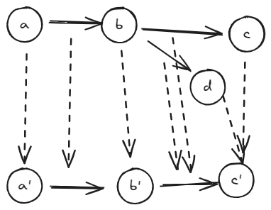

# About the Nop Platform's Lower Theory of Relativity

## 1. Proxy Object vs. Proxied Object: Is It a Bi-conditional Relationship?

Not necessarily. **A proxy object or any solution based on an interface or polymorphism can be considered a mathematical homomorphism (homomorphic mapping) in category theory, which is known as a functor.**

Due to the lack of familiarity with this mathematical concept among many students, we will explain it in a somewhat informal manner. Let's assume there are objects `a`, `b`, `c`, etc., within space `F`. These objects are related by certain operations or functions, such as `f(g(h(...)))`.

```plaintext
f(a, b), g(b, c), h(b, d), ...
```

A homomorphism `φ: F → G` maps the objects and their relationships from space `F` to space `G`, preserving the structure of `F`. This means that a homomorphism is a **preserving structure mapping**.

$$
\phi(f(a,b)) = \phi(f)(\phi(a), \phi(b)) = f'(\phi(a), \phi(b))
$$

Here, object `a` is mapped to a new object `a'`, and similarly for `b`. The relationship `f` (which can be viewed as a function taking `a` and `b` as parameters) is also mapped to a new relationship `f'` in space `G`. The key requirement is that for any `a` and `b`, the relationship `f` is mapped to an equivalent `f'` in space `G`, thus preserving the structural relationships of `F`.

If we represent `f(a, b)` as `$a \rightarrow b$, it makes the concept of a homomorphism more intuitive.



**A homomorphism allows multiple objects from space `F` to be mapped to a single object in space `G`. For example, both `c` and `d` are mapped to `c'`, naturally forming a simplification mechanism: the complex relationships in space `F` are reduced to space `G`, thus preserving the core structure of `F` while simplifying it.**

Returning to our initial question: **An interface or a polymorphic mechanism can be viewed as a homomorphism**.

```plaintext
f(objA, objB) ==映射到接口空间==> f'(interfaceA, interfaceB)
```

In the original object space `F`, there are numerous possible relationships between objects. However, if we project this space onto an interface space `G` by considering only a limited set of interface objects, the number of objects and functions in `G` is reduced. Interestingly, the code representation of `f'` and `f` looks identical:

```
f(objA, objB), f'(interfaceA, interfaceB)
```

However, this equivalence is not always self-evident. For example, in languages based on generics, the same source code may compile to different binary representations for objects and interfaces.

**Using the concept of a homomorphism, we can clearly understand the value of an interface or polymorphic mechanism in technology. By projecting the necessary logical expressions onto a subspace `G`, we preserve the primary structural relationships of `F` while hiding unnecessary details. This allows for a more efficient and maintainable implementation.**

In reversible computing, entropy is preserved, implying information conservation. Just as energy conservation is fundamental in physics, so is information conservation in mathematics. Understanding these principles requires some knowledge of physics, but it's essential for grasping the nuances of reversible computation.

In summary, while Fourier transforms are a cornerstone of signal processing, their application is often limited by locality constraints. This limits the extent to which information can be reconstructed from transformed data.


Appearance transformation refers to the process of altering the visual representation of an object or system. This is often achieved through minimized information representation, which aims to achieve a certain level of optimization. In mathematics, uniqueness is typically defined through equivalence relations. Therefore, when two objects are considered equal (A = B), it does not imply that they are identical in every aspect but rather that there exists a bidirectional and reversible transformation between them.


## 3. Using Excel for Model Definition in Nop Platform

In the Nop platform, Excel is not directly used; it is equivalent to `app.orm.xml`. While Excel can be used to generate `app.orm.xml`, it is not necessary if other methods are available. If Excel is avoided, there are two main options:

1. **Code-Driven Approach**: Use either Java or YAML files for definition. This approach is less suitable for non-technical stakeholders as it requires deep technical understanding.
2. **Independent Model Management Tools**: Use tools like `yapi` for API definition. However, this approach may require separate deployment and integration with DevOps pipelines.

The Nop platform allows direct use of Maven (`mvn`) to package and read Excel models into code without relying on Excel files.


## 4. Understanding Delta and Git Commit

A delta refers to the difference between two versions of a file. In Git, a commit records changes as deltas. While Docker containers are built from images stored in structured filesystems, virtual machines (VMs) often use unstructured byte streams for their differences. This is a key distinction between Docker and VMs.

If you suspect that Delta has no use, consider Docker's role in defining file differences. Docker uses `docker.io` to manage container images, while Nop provides a more generalized delta space through its platform.


## 5. Implementing Disabled Attribute via Nodes

Some may propose using nodes with a `disabled` attribute to trim logic during processing. For example, in DSL (Domain Specific Language), you might define:

```dsl
node {
    disabled = true;
}
```

This approach allows for selective pruning of logic based on specific conditions. Nop's framework handles this by uniformly processing all DSL variations without requiring manual adjustments for each special case.


## 6. Unique Features of Nop Platform

Nop platform offers unique capabilities not commonly found in traditional software engineering. One such feature is its ability to perform coarse-grained reuse without relying on external libraries like JAR files. This allows for extensive customization of business logic while maintaining code and documentation consistency.

Additionally, Nop's built-in Delta mechanism provides a flexible way to extend systems without predefining extension points. This unique approach ensures that changes can be systematically applied across the entire system, promoting stability and maintainability.

By leveraging these features, Nop platform enables robust solutions that are both adaptable and efficient, addressing complex challenges in modern software development.

