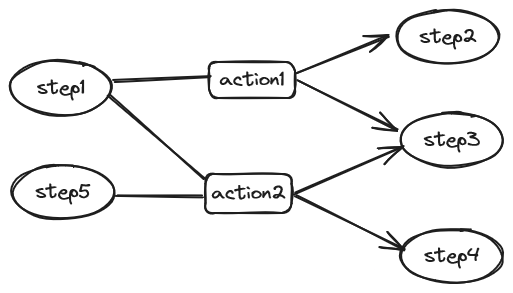

# The Next-Generation Logic Orchestration Engine NopTaskFlow Built from Scratch

With the popularity of low-code concepts and products, many are considering introducing the idea of logic orchestration into their projects—offloading logic traditionally produced via hand-crafted hard coding to a logic orchestration engine that can be flexibly configured. In this article, I will introduce the design philosophy of the logic orchestration engine NopTaskFlow in the Nop platform and analyze the mathematical inevitability of its design. At the end, I will explain why NopTaskFlow is a next-generation logic orchestration engine and what typical characteristics this so-called next generation possesses.

## I. What Exactly Does Logic Orchestration Orchestrate?

When we program using traditional programming languages and frameworks, we are essentially following certain constraint specifications defined by the language, which can be seen as a kind of best practice. However, when we start from scratch to write a very flexible, very low-level logic organization framework, it’s easy to break the previously built-in formal specifications of the language, thereby deviating from the implicit best practice pattern.

What is the minimal logical unit that can be flexibly organized? The answer in traditional programming languages is now standard: functions. So what essential characteristics do functions have?

1. Functions have clearly defined inputs and outputs

2. Functions can be nested calls

3. Variables used within functions have complex lexical scope

If we further study the structure of functions, we will find more complex features, such as:

1. Are function parameters passed by value or by reference? CallByValue? CallByRef? CallByName?

2. Is support for functional parameters available, i.e., so-called higher-order functions?

3. Is there an exception handling mechanism independent of the return value?

4. Is asynchronous return supported?

Of course, there is the most important aspect: functions are not only the minimal unit for recognizing and organizing logic, but also the minimal unit for abstraction. We can reuse existing functions to define new functions.

So why do functions become the most fundamental logical organizational unit in programming languages, and when we write a logic orchestration engine now, do we still need to base it on function abstractions? Is there a better abstraction? To clarify this question, we need to understand a bit of history.

First, we need to be clear that the concept of functions did not originally exist in computer programming languages; the establishment of the function concept was no trivial matter.

> ==== The following is created by Zhipu Qingyan AI=====

Early Programming Languages (1950s–1960s):

- Assembly Language: In assembly languages, the concept of functions is not apparent; programmers typically use jump instructions to execute code blocks.
- Fortran: Released in 1955, Fortran introduced the concept of subroutines, which can be regarded as an early form of functions. However, subroutines in Fortran do not support return values.

Rise of High-Level Programming Languages (1960s–1970s):

- ALGOL 60: Released in 1960, ALGOL 60 introduced modern function concepts with support for return values and proposed block structure (local variable scope), which is an important milestone in programming language development.
- Lisp: Developed in 1958, Lisp treats functions as first-class citizens, meaning functions can be passed, stored, and returned as data—core features of functional programming languages.

Structured Programming (1970s):

* The concept of structured programming was first proposed by Edsger W. Dijkstra in his 1968 paper “Go To Statement Considered Harmful,” in which he advocated restricting or eliminating goto statements to improve program structure. The core idea of structured programming is to decompose programs into modular parts and use structures such as sequence, selection (if-then-else), and loops (while, for) to control the flow of programs.
- C Language: Released in 1972, C was heavily influenced by Algol 68; its function definitions are concise and support recursive calls. It was among the first high-level languages that natively supported structured programming concepts. The popularity of C greatly promoted the structured programming paradigm.

> ==== End of Zhipu Qingyan's creation=====

The 1980s were dominated by object-oriented programming; the status of functions declined and became subordinate to objects. In Java, we cannot even define functions independently outside of classes. After 2000, functional programming gradually revived, promoting the popularity of immutability and so-called pure functions with no side effects. With the rise of multi-core parallel programming, distributed messaging systems, and big data processing systems, the concept of functions has continued to expand and deepen; modern programming languages now generally include async/await mechanisms as standard.

Let’s analyze the implicit assumptions brought by the concept of functions.

First, functions are an inevitable result of information hiding. Information hiding necessarily leads to the world being divided into inside and outside. If the internal small environment can exist independently of the outside (meaning the same function can be called in different external environments without the function needing to perceive the environmental changes), then the association between inside and outside must be restricted to occur only at the boundary. Information obtained by the inside from the outside is called Input, and information obtained by the outside from the inside is called Output. The dimensionality of the boundary is generally much smaller than the dimensionality of the overall system structure (analogous to the boundary of a three-dimensional sphere being a two-dimensional spherical surface), which allows functions to reduce external complexity.

> * If global variables are always read and written inside a function, then we are actually using the procedure abstraction rather than the function abstraction.
>
> * Service-ization is equivalent to agreeing that both Input and Output are serializable value objects.

Second, functions automatically introduce the following causal ordering:

1. Evaluate expressions to obtain the function’s Input parameters

2. Execute the function

3. Receive the function’s Output

Before calling the function, the values of Input will be determined, and Output will only be produced after the function executes successfully. If a function call fails, we won’t receive output variables at all. In particular, if a function has multiple outputs, we always either get all Outputs or none—there is no situation where only part of the Outputs are observed.

> Some logic orchestration frameworks now expose certain intermediate results during step execution as Output Endpoints—for example, exposing the loop index during iteration as an Endpoint and continuously outputting such temporary Output during the loop. This approach deviates from the function abstraction.

Third, functions have independent variable scopes (namespaces). No matter what a variable is named outside the function, once it is passed as a parameter into the function, we will always use the local input variable name inside the function to refer to it. Meanwhile, temporary variables used inside the function will not be observed externally. Named entities are the mother of all things. Any large-scale, systematic reuse demands avoidance of name conflicts; local names must be used.

Fourth, when functions are composed, information transfer is achieved indirectly through the current scope. For example:

```
 output = f(g(input))
 // Actual equivalent to
 output1 = g(input)
 output = f(output1)
```

A variable must exist within a scope. When function g returns, its internal scope is conceptually destroyed, and before executing function f, its internal scope does not yet exist. Therefore, g’s return value must first be stored in an outer scope and then forwarded to function f.

Fifth, functions imply paired bidirectional information flow. We all know that goto is harmful because goto is often one-way with no return; only heaven knows when it will goback and where it will goback to. However, a function is a highly disciplined and extremely predictable organization of information flow. Input passes information into the function, and Output will definitely return—and will return at the original call site (that is, in a mathematical sense, goto and goback are strictly paired). In traditional programming languages, function calls are synchronous and have blocking semantics; they automatically block the current execution instruction flow (equivalent to the timeline of the program world). For asynchronous calls, returning from the function does not mean Output is available, so callback functions have to be used to handle logical dependencies, resulting in the so-called nested callback hell. The async/await syntax in modern programming languages essentially adds blocking semantics to asynchronous functions, so that the order of function calls in source code can still be regarded as the order of timeline evolution.

> In distributed architectures, the most flexible organization method is undoubtedly event sending and listening. Essentially, it is one-way information transmission, similar in spirit to goto. It is flexible, but what is the cost?

### The Wisdom of Pioneers Lost in History

As the saying goes, the only lesson humans learn from history is that humans cannot learn any lessons from history. Twenty years is a generation, and the next generation facing new problems will forget the wisdom of their predecessors; everything still starts with gut feeling.

Goto is bad; structured programming is good. This is the idea we are instilled with from the beginning of learning programming—but why? If asked in an interview, I believe many programmers can talk at length, even citing Dijkstra’s classic paper “Go To Statement Considered Harmful” (this is also Dijkstra’s most famous paper). But how many people have actually seriously read this paper? Frankly, I knew of it early on but never read it carefully. Until recently, when I did read it, I discovered that Dijkstra’s reasons for opposing goto are fundamentally different from what we had filled in ourselves; we had long forgotten Dijkstra’s wisdom cleanly.

At the beginning of the paper, Dijkstra states that he had long observed that the goto statement would harm software quality, but only recently did he find a reason that could explain why in scientific terms.

> The unbridled use of the go to statement has an immediate consequence that it becomes terribly hard to find a
> meaningful set of coordinates in which to describe the process progress.

> a programmer independent coordinate system can be maintained to describe the process in a helpful and manageable way.

The core idea of Dijkstra’s paper is that if we write code according to the ideas of structured programming, our code text will form an objectively existing coordinate system (independent of the Programmer). With this coordinate system, we can intuitively establish a correspondence between static programs (expanded in the text space) and dynamic processes (unfolded in time) in our minds, whereas goto destroys such a naturally existing coordinate system.

> ==== The following is KimiChat AI’s summary===

The coordinates of this so-called coordinate system refer to a set of values used to uniquely determine the program’s execution state.

1. Textual Index. When a program consists only of a series of concatenated instructions, a “textual index” can be determined by pointing to a position between two consecutive action descriptions. This index can be regarded as a position in the program text, pointing to a specific statement in the program. Without control structures (such as conditional statements, loops, etc.), the textual index is sufficient to describe the program’s execution progress.

2. Dynamic Index. When loops (such as while or repeat statements) are introduced into the program, a single textual index is no longer sufficient. Loops may cause the program to repeatedly execute the same code block, so additional information is needed to track the current loop’s iteration count, which is the so-called “dynamic index.” The dynamic index is a counter recording the number of iterations currently in the loop.

3. Description of Program Execution. The program’s execution state depends not only on the position in the program text (textual index), but also on the program’s dynamic depth, i.e., the current level of nested calls. Therefore, the program’s execution state can be uniquely determined through a combination of a series of textual and dynamic indices.

> == End of KimiChat AI’s creation===

Reversible Computation theory can be regarded as a further deepening of Dijkstra’s coordinate system idea. Using Domain Specific Languages (DSL), we can establish domain-specific coordinate systems (not just a general, objectively existing coordinate system), and not only for understanding—we can go further and define reversible Delta operations on this coordinate system, truly leveraging this coordinate system to use it in the software construction process.

The design of NopTaskFlow follows the general design of the Nop platform’s XDSL. Each step/input/output has a name attribute as a unique identifier, forming a fully domain-coordinate-based logical description. We can use the x:extends operator to inherit such a description, and then use the Delta mechanism to customize modifications.

It should be noted that NopTaskFlow assumes that Input and Output are single deterministic values, rather than a Flow object that can continuously produce items. Flows are more complex and conflict with the analysis of the function concept in the previous section. In the Nop platform’s planning, modeling for flows will be accomplished via the NopStream framework.

From the perspective of coordinate systems, we can consider that the flow system introduces a special assumption: the spatial coordinates are frozen, while the time coordinates are flowing (spatial coordinates determine the topology of the flow system). This special assumption brings a special simplification; therefore, it also deserves a dedicated framework to fully exploit the value of this assumption.

## II. The Minimal Logical Organizational Unit: TaskStep

NopTaskFlow’s design goal is to provide a structured logic decomposition scheme that supports Delta operations. Sticking closely to the function concept in programming languages is undoubtedly the most worry-free choice, and if high-performance compiled execution is needed in the future, it’s also easier to translate orchestration logic into ordinary function implementation code.

The minimal logical organizational unit in NopTaskFlow is the so-called TaskStep, whose execution logic is shown below:


```javascript
for each inputModel
   inputs[inputModel.name] = inputModel.source.evaluate(parentScope)

outputs = await step.execute(inputs);

for each outputModel
   parentScope[outputModel.exportAs] = outputs[outputModel.name]
```

This is conceptually very similar to function calls in general programming languages:

```javascript
var { a: aName, b: bName} = await fn( {x: exprInput1, y: exprInput1} )
```

Let’s look at a concrete example of sequential calls:

```xml
<sequential name="parentStep">
  <input name="a"/>
  <steps>
    <xpl name="step1">
      <!-- Variables used in a step need to be passed in via input; sub-steps do not directly use variables from the parent step -->
      <input name="a"/>
      <!-- If the return type of the source block is not Map, it will be considered a RESULT variable -->
      <source>
        return a + 1
      </source>
      <!-- Output variables can be computed dynamically. If source is not specified, the variable with the corresponding name in the current scope is returned -->
      <output name="a2">
        <source>a*2</source>
      </output>
    </xpl>

    <call-step name="step2" libName="test.MyTaskLib" stepName="myStep">
      <!-- The input parameter can be dynamically computed via the source block. RESULT corresponds to the variable named RESULT in the parent scope -->
      <input name="a">
        <source>RESULT + 1</source>
      </input>
      <!-- The result returned to the parent scope is renamed to b2 -->
      <output name="b" exportAs="b2"/>
    </call-step>
  </steps>
  <output name="b2"/>
</sequential>
```

TaskFlow has built-in types for steps such as sequential/parallel/loop/choose/xpl/call-step, which amounts to a Turing-complete functional programming language.

> For specific step definitions, see the task.xdef metamodel definition: https://gitee.com/canonical-entropy/nop-entropy/blob/master/nop-xdefs/src/main/resources/_vfs/nop/schema/task/task.xdef

The above example is equivalent to the following code:

```javascript
var { RESULT, a2 } = function step1(a){
  return { RESULT : a + 1, a2: a*2}
}(a);

var { b: b2} = test.MyTaskLib.myStep({a: RESULT+1})
return { b2 }
```

* Steps have a name attribute, which is unique locally but not required to be globally unique. These local names are the prerequisite for reusing complex steps.
* xpl is equivalent to a function call; if the result of executing the source block is not a Map structure, it is set as the RESULT variable.
* If the output variable specifies a source block, it means dynamically executing an expression to construct the return value; otherwise, it gets the return value from the current scope according to the name.
* After successfully calling a step, the output results are set into the current scope.
* call-step can reuse existing step definitions.
* If the input variable specifies a source block, it is equivalent to dynamically computing the variable value; otherwise, it is obtained from the current scope according to the name attribute.
* If output specifies exportAs, it will be renamed when set to the parent scope.

The interface definition corresponding to TaskStep is as follows:

```java
interface ITaskStep {
  String getStepType();

  List<ITaskInputModel> getInputs();

  List<ITaskOutputModel> getOutputs();

  CompletionStage<Map<String, Object>> execute(
    Map<String, Object> inputs, Set<String> outputNames,
    ICancelToken cancelToken, ITaskRuntime taskRt);
}
```

* TaskStep has models for inputs and outputs, equivalent to reflective metadata; you can learn the function’s parameter names and parameter types, return variable names and return variable types, etc., through them.
* As a general orchestration component, TaskStep enforces a multi-input and multi-output structure, so inputs and outputs are both Map objects.
* outNames provide GraphQL-like result data selection capabilities. When calling a step, we specify whether we need certain return variables. In step implementations, this allows selective performance optimization—complex computations for unneeded returns can be skipped directly.
* TaskStep supports asynchronous execution by default, and provides runtime cancellation capabilities via cancelToken. When running, TaskFlow automatically adds await semantics, automatically waiting for the previous step to finish.
* ITaskRuntime is global information shared throughout the task execution process, including TaskScope, etc.

If you need to extend TaskFlow, the simplest way is to register a bean that implements the ITaskStep interface in the NopIoC container and then call it with the following syntax:

```xml
<simple bean="myStepBean">
  <input name="a1"/>
  <input name="a2"/>

  <output name="b1"/>
  <output name="b2"/>
</simple>
```

If you actually look at the definition of the ITaskStep interface, you will find its implementation is more complex:

```java
interface ITaskStep {
  // ...

  TaskStepReturn execute(ITaskStepRuntime stepRt);
}
```

* TaskStepReturn is used to optimize performance for synchronous calls and adds the ability to jump and suspend steps.
* ITaskStepRuntime unifies the management of function parameters, making them easier to pass downward.

```java
interface ITaskStepRuntime {

  IEvalScope getEvalScope();

  ITaskStepState getState();

  ITaskRuntime getTaskRuntime();

  ICancelToken getCancelToken();

  Set<String> getOutputNames();

  default boolean needOutput(String name) {
    Set<String> names = getOutputNames();
    return names == null || names.contains(name);
  }

  default Object getValue(String name) {
    return getEvalScope().getValue(name);
  }

  default void setValue(String name, Object value) {
    getEvalScope().setLocalValue(name, value);
  }

  default Object getResult() {
    return getLocalValue(TaskConstants.VAR_RESULT);
  }
}
```

ITaskStepRuntime, in addition to containing all parameters passed in from outside the step, also exposes internal state information, and additionally provides IEvalScope and ITaskStepState variables. ITaskStepState is the persistent state information of the step instance and can be used to implement mechanisms similar to Coroutine suspend/resume.

IEvalScope is the variable scope within the step, which forms a scope chain similar to lexical scoping via parent-child relationships. When reading variables from the scope, if they are not found in the current scope, the search will automatically go up to the parent scope. Generally speaking, the parent of the stepScope is the TaskScope, meaning that if the variable is not found in the current step’s scope, it will be searched for in the shared task-level scope rather than in the parent step’s scope—unless useParentScope=true is set on the step instance. useParentScope allows searching in the parent step’s scope, thereby achieving an effect similar to function closures.

```xml
<sequential name="parentStep">
  <input name="a"/>

  <steps>
    <!-- If useParentScope=true is set, you can directly read the variable 'a' from the parent scope
         without declaring input
    -->
    <xpl name="step1" useParentScope="true">
      <source>
        return a + 1
      </source>
    </xpl>
  </steps>
</sequential>
```

## III. Stronger than Functions Are Wrapped Functions

If the objects of logic orchestration are ordinary functions, what’s the difference from handwritten code? Besides visualizing the AST, can logic orchestration do anything more valuable? Yes—we can upgrade the objects being orchestrated.

Participants in orchestration need not be bare naked functions with nothing (Naked Functions), but richly adorned and heavily decorated functions (Rich Functions).

> In our universe, fundamental particles such as quarks and electrons themselves have no rest mass, but they are immersed in the ubiquitous Higgs field and dragged (decorated) by it, so that the renormalized electrons we observe have so-called effective mass.

In modern object-oriented programming languages, the Annotation mechanism has basically become standard, and has even reached a nearly pervasive level. The main work of many frameworks is tirelessly migrating execution logic into annotation processors.

```javascript
  // 示例函数由智谱清言AI生成
    @GetMapping("/example/{id}")
    @Cacheable(value = "examples", unless = "#result == null") // 缓存响应结果
    @Retryable(value = {Exception.class}, maxAttempts = 3, backoff = @Backoff(delay = 1000)) // 重试策略
    @Transactional(readOnly = true) // 声明事务为只读
    @Secured({"ROLE_ADMIN", "ROLE_USER"}) // 权限注解，限制访问权限
    @RateLimiter(key = "exampleService", rate = "5/minute") // 限流注解
    @Fallback(ExampleServiceFallback.class) // 服务降级注解
    @AuditTrail // 自定义注解，用于记录操作日志
    public Example getExampleById(@PathVariable("id") Long id) {
        // 业务逻辑处理
        return exampleRepository.findById(id);
    }
```

The function annotation’s role is essentially to use an AOP-like mechanism to enhance the original function. In frameworks, what we ultimately use is typically the enhanced function wrapped by Interceptors. In fact, at the service layer, we rarely use a function without any annotations.

In the functional programming realm, there is also a function enhancement mechanism similar to AOP, known as Algebraic Effects.

```python
// 示例代码由智谱清言AI生成
def log(message):
    perform print(message)

def handlePrint(effect):
    if effect == "print":
        return lambda message: println(message)

withHandler handlePrint:
    log("Hello, world!")
```

In the log function, perform print(message) indicates generating a print effect, but it does not immediately perform the printing operation. Instead, it delegates the effect request to the handler in the current scope. withHandler binds the handler handlePrint to the current code block. When we call log("Hello, world!"), it generates a print effect; this effect is intercepted by the handlePrint handler, which performs the printing operation. perform print is essentially defining a locating coordinate, and withHandler will locate this coordinate and replace it with an enhanced (often side-effect-bearing) function.

All step metamodels in NopTaskFlow inherit from the following basic structure, which allows adding some common decorations.

```xml
<xdef:define xdef:name="TaskStepModel" executor="bean-name" timeout="!long=0"
             name="var-name" runOnContext="!boolean=false" ignoreResult="!boolean=false"
             next="string" nextOnError="string">
  <input name="!var-name" xdef:name="TaskInputModel" type="generic-type" mandatory="!boolean=false"
         fromTaskScope="!boolean=false" xdef:unique-attr="name">
    <source xdef:value="xpl"/>
  </input>

  <output name="!var-name" xdef:name="TaskOutputModel" toTaskScope="!boolean=false" type="generic-type"
          xdef:unique-attr="name" exportAs="var-name">
    <source xdef:value="xpl"/>
  </output>

  <when/>
  <validator/>

  <retry/>
  <catch/>
  <finally/>

  <throttle/>

  <rate-limit/>
  <decorator name="!string"/>
</xdef:define>
```

* executor: Execute on the specified thread pool

* timeout: The timeout for the entire step; if it times out, automatically cancel and throw NopTimeoutException

* runOnContext: Dispatch execution to IContext’s task queue to ensure no parallel processing

* ignoreResult: Ignore the RESULT return value and do not update it in the parent step’s scope. Sometimes we need to add some logging steps; setting this property avoids affecting the original runtime context

* next: Automatically jump to the specified step after executing the current step

* nextOnError: Jump to the specified step if the current step fails

* when: Execute the step only if the condition is satisfied, otherwise skip directly

* validator: Validate Inputs variables

* retry: If a step fails, retry according to the specified retry strategy

* catch/finally: Catch step exceptions to perform additional handling

* throttle/rate-limit: Control execution rate

* decorator: Custom decorators can be registered in NopIoC

```java
interface ITaskStepDecorator {
  ITaskStep decorate(ITaskStep step, TaskDecoratorModel config);
}
```

If the decorator is the parent node of the step node, it will cause the node’s coordinates (unique path starting from the parent node) to become unstable. For example, suppose the current path is main/step1/sub-step1; if we only make some local adjustments and add a decorator decorator1, the path may become /main/step1/decorator1/sub-step1. If we separate decorators and treat them as attribute nodes of the step nodes, then the coordinates we recognize at the business level can be more stable.

## IV. You Can Implement Coroutines Even If You Don’t Get into a Third-Tier College

SpringBatch is a logic orchestration framework in the Spring ecosystem used for batch processing tasks. It provides a restart-from-failure-point feature to meet the recoverable requirements of batch tasks. Conceptually, SpringBatch supports the following calls:

```javascript
try {
    JobExecution execution = jobLauncher.run(job, jobParameters);
} catch (Exception e) {
    e.printStackTrace();
}
// After fixing the error, if the job has not yet completed, we can run the job again with the same parameters,
// and it will automatically resume from the last interruption point
jobLauncher.run(job, jobParameters);
```

When a Job execution reports an error, it throws an exception and interrupts execution. If we fix the problem, we can re-execute the Job, and it will automatically locate the previous interruption point and continue down. Conceptually, a Job in SpringBatch can be regarded as a “function that can be paused and resumed.” In the academic field, there is a specific term for functions with pause (interrupt) and resume (continue execution) capabilities—Coroutines. However, in SpringBatch, a Job is passively paused due to an exception, whereas the generalized coroutine concept supports actively pausing during program execution to relinquish control.

Modern programming languages such as JavaScript/Python/Kotlin/C#/Go/Swift/Lua/Ruby/Rust, etc., all have built-in coroutine or equivalent concepts. The async/await syntax is essentially a coroutine—it actively pauses when encountering asynchronous calls.

> Coroutines were officially added in JDK21

Some people understand coroutines as lightweight user-space threads, but in fact this is only one concrete application of the coroutine concept. According to Wikipedia:

> Coroutines are computer program components that generalize subroutines for non-preemptive multitasking, by allowing
> multiple entry points for suspending and resumingexecution at certain locations.

Clearly, coroutines are a concept that has wider application and finer granularity than threads.

### Coroutines in JavaScript

Let’s take a look at JavaScript’s Generator functions; they are essentially a coroutine mechanism.

> === The following is created by Zhipu Qingyan AI====

Below is the simplest example demonstrating loops using JavaScript Generator functions. This example has a Generator function that iterates through a numeric array and yields a number at each iteration. Using the yield keyword, we can pause the function’s execution after each iteration and continue when next() is called.

```javascript
// 定义一个 Generator 函数
function* generateNumbers() {
  // 使用 for 循环遍历数字数组
  for (let i = 0; i < 5; i++) {
    // 使用 yield 关键字暂停函数执行，并产生当前的数字 i
    yield i;
  }
}
// 调用 Generator 函数，得到一个遍历器对象
const iterator = generateNumbers();
// 使用 next() 方法手动遍历 Generator 函数的每个状态
console.log(iterator.next()); // { value: 0, done: false }
console.log(iterator.next()); // { value: 1, done: false }
console.log(iterator.next()); // { value: 2, done: false }
console.log(iterator.next()); // { value: 3, done: false }
console.log(iterator.next()); // { value: 4, done: false }
console.log(iterator.next()); // { value: undefined, done: true }
```

In the code above, generateNumbers is a Generator function containing a for loop from 0 to 4. In each iteration, yield i produces the current number i and pauses the function’s execution. When we call generateNumbers(), it does not execute immediately but returns an iterator object. We can call the object’s next() method to manually iterate through each state of the Generator function. Each call to next() continues execution from the last yield expression until the next yield or the function ends. The return value of next() is an object; value is the current yield’s value, and done is a boolean indicating whether the iteration is finished. When done is true, the Generator function has completed execution, and value will be undefined. Through this example, we can see the concepts of pausing and continuing execution with Generator functions. The yield keyword pauses function execution and passes a value to the caller of next(). When next() is called, the function continues from the last pause. This process can be repeated until the Generator function finishes.

> ==== End of Zhipu Qingyan's creation===

### TaskFlow’s Implementation of Coroutines

The concept of “functions that can be paused and resumed” looks very simple on the surface and is indeed not complex to implement. According to research by vczh (Mei Qiming), “You don’t need to get into a third-tier college to add Coroutines to your beloved language”: https://zhuanlan.zhihu.com/p/25964339.

Recall Dijkstra’s paper—he pointed out that structured programming automatically introduces a coordinate system, and in this coordinate system, you only need to know a few coordinate values to precisely locate an execution state point in the program runtime space. So, to implement function pause and resume, you only need to find a way to record these coordinates and then provide a mechanism to jump to the specified coordinate.

General programming language built-in coroutines need to maximize runtime performance; they must make full use of the language runtime’s execution stack information, etc., so the implementation logic looks somewhat clouded and lofty. In fact, the complexity arises simply because the implementation is at too low a level (closer to machine code).

NopTaskFlow has a mechanism similar to coroutines built-in, which can be used to implement failure restart for batch processing tasks. Since this is implemented using high-level language structures and does not require consideration of extreme performance, the specific implementation plan is very simple—so simple that you don’t even need to get into high school to understand it. First, let’s look at how a loop achieves suspend and resume.

```javascript
for (let i = 0; i < 5; i++) {
    executeBody();
}
```

The difficulty of interruption/restart is that there are some temporary state variables used in this loop, such as i above. When we interrupt execution, we lose this temporary state information, and naturally we cannot restore execution. Therefore, the first step in implementing Coroutines is to collect all temporary variables and convert them into member variables of some class. This exposes internal state information to an external manager.

```java
class LoopNTaskStep extends AbstractTaskStep{
     public TaskStepReturn execute(ITaskStepRuntime stepRt) {
        LoopStateBean stateBean = stepRt.getStateBean(LoopStateBean.class);
        if (stateBean == null) {
            stateBean = new LoopStateBean();
            // Initialize loop variables
            int begin = ConvertHelper.toPrimitiveInt(beginExpr.invoke(stepRt), NopException::new);
            int end = ConvertHelper.toPrimitiveInt(endExpr.invoke(stepRt), NopException::new);
            int step = stepExpr == null ? 1 : ConvertHelper.toPrimitiveInt(stepExpr.invoke(stepRt), NopException::new);

            if (step == 0)
                throw TaskStepHelper.newError(getLocation(), stepRt, ERR_TASK_LOOP_STEP_INVALID_LOOP_VAR)
                        .param(ARG_BEGIN, begin).param(ARG_END, end).param(ARG_STEP, step);

            stateBean.setCurrent(begin);
            stateBean.setEnd(end);
            stateBean.setStep(step);
            stepRt.setStateBean(stateBean);

        }

        do {
            if (!stateBean.shouldContinue()) {
                return TaskStepReturn.RETURN_RESULT(stepRt.getResult());
            }

            if (varName != null) {
                stepRt.setValue(varName, stateBean.getCurrent());
            }
            if (indexName != null) {
                stepRt.setValue(indexName, stateBean.getIndex());
            }

            TaskStepReturn stepResult = body.execute(stepRt);
            if (stepResult.isSuspend())
                return stepResult;

            // Handle synchronous returns
            if (stepResult.isDone()) {
                stateBean.incStep();
                stepRt.setBodyStepIndex(0);
                stepRt.saveState();

                stepResult = stepResult.resolve();
                if (stepResult.isEnd())
                    return stepResult;
                if (stepResult.isExit())
                    return RETURN_RESULT(stepRt.getResult());
            } else {
                // Handle asynchronous returns; some implementation code omitted here
            }
        } while (true);
}
```

The above is NopTaskFlow’s implementation for the loop-n step, roughly equivalent to making the following adaptation:

```javascript
  while(state.index < state.end)
      executeBody(state.bodyStepIndex, state)
      state.index += state.step
  }
```

In addition to temporary variables such as index and end (dynamic coordinates), the stateBean also needs to record static coordinate information such as which line in the body is currently being executed. In short, as long as enough coordinate information is recorded to uniquely determine the current execution state point, we can support resuming.

In NopTaskFlow’s implementation, the approach to “jumping to the specified coordinate point” is also very straightforward: start execution from the root node and simply skip everything that isn’t the target coordinate point until the target coordinate point is found.

> Single-point targeting can be implemented as scan + filter.

## V. Data-Driven Graph Mode

Steps such as sequential and loop in NopTaskFlow simulate the function execution process in procedural programming languages. Here, functions form implicit associations through positional relationships—that is, when one step finishes executing, we find the subsequent step at the next position to continue execution. The position here refers to a set of coordinates that can be determined at the source code level, so procedural execution can be seen as a coordinate-driven execution mode.

Although NopTaskFlow provides the parallel step to implement a form of structured parallel processing (here “structured” means that after parallel steps finish execution, a join operation is automatically performed to obtain the final aggregated return result), such structuring also brings organizational constraints that prevent us from extracting maximum value from the system to achieve the highest degree of parallelization. If we’re building a data processing system, we can shift our focus to the data objects—imagine following the data objects as they propagate through the system (focusing on data flow rather than control flow). We only need to establish a connection pipeline to propagate data when computation actually requires certain data.

NopTaskFlow provides a running mode called graphMode. In this mode, the executor does not select the next execution step in sequence as in procedural programming; instead, it analyzes dependencies between TaskStep’s Input and Output based on actual data usage, builds a dependency graph accordingly, and then determines the scheduling order of steps based on the dependency graph.

```xml
<graph name="test" enterSteps="enter1,enter2" exitSteps="exit">
  <input name="x">
      <source>1</source>
  </input>

  <steps>
    <xpl name="enter1" executor="myExecutor">
        <input name="x"/>
        <source>
            return x + 1
        </source>
    </xpl>

    <xpl name="enter2" executor="myExecutor">
        <input name="x"/>
        <source>
            return x + 2
        </source>
    </xpl>

    <xpl name="process">
        <input name="a">
            <source>
                STEP_RESULTS.enter1.outputs.RESULT
            </source>
        </input>

        <input name="b">
            <source>
                STEP_RESULTS.enter2.outputs.RESULT
            </source>
        </input>

        <source>
            return a + b
        </source>
    </xpl>
    ...
  </steps>
</graph>
```

* The graph step in graph mode starts execution from enterSteps and ends when it reaches any exitStep.

* GraphStepAnalyzer will automatically perform abstract syntax tree analysis on the source expressions configured in Input, extract variables of the form STEP_RESULTS.{stepName}.outputs.{ouputVar} to construct a DAG dependency graph, and throw an exception if a cyclic dependency is found. STEP_RESULTS is a Map variable defined in the scope of the graph step used to uniformly manage outputs from all steps. Input is executed in the parent step’s scope, so outputs from other steps can be accessed via STEP_RESULTS.

* During execution, GraphTaskStep automatically adds waiting semantics for sub-steps: a sub-step will only be executed when all its Input variables have been computed. Therefore, in the example above, the process sub-step will be triggered only after both enter1 and enter2 have completed execution.

  Data-driven execution can only be most effective in streaming processing scenarios. NopTaskFlow remains focused on organizing logical steps, so it only provides the simplest DAG (Directed Acyclic Graph) mode of execution.

### Degenerate Data Pipelines:

Complete streaming processing inevitably requires modeling data connection pipelines—e.g., certain buffering capabilities, windowing capabilities, and handling backpressure when pipeline capacity is full. However, in NopTaskFlow, since it assumes no streaming processing, and the graph is constrained to be acyclic (DAG), we can deduce a conclusion: each step will be triggered at most once.

1. A step will only be executed when all its Inputs are computed; one execution will yield one set of Outputs.

2. All Inputs either come from Outputs of previous steps or come from external inputs. So, if a previous step executes only once and produces one output, then this step will also execute only once.

3. enterStep is only affected by external input; it will execute once.

In NopTaskFlow’s design, each step has a unique coordinate (the step name). Considering that each step is triggered at most once, we can infer that each Input and each Output also has a unique runtime coordinate. The connection between Input and Output can be seen as reference matching between Input coordinates and Output coordinates.

> For example, STEP_RESULTS.step1.outputs.a represents the output variable a of the sub-step step1.

In this case, the data pipeline connecting inputs and outputs is in a degenerate state; its design capacity is 1, and it needs to buffer at most one element—meaning it can be represented by a Promise object. In NopTaskFlow’s GraphTaskStep implementation, our approach is very simple:

1. Register Promises for all steps and establish dependencies via Promise.waitAll.

2. Start all enterSteps.

There is no need to establish a complex task queue management and scheduling mechanism; it suffices to build dependency chains via Promises.

### Step-Level Dependencies

At first glance, dependencies between Input and Output are at the variable level, which is more fine-grained than step-level dependencies. However, since NopTaskFlow adopts the function abstraction and does not support streaming output, the Output of a step can only be used after the step completes, and multiple Outputs are produced either together or not at all (when a step fails, no output is produced). In this case, depending on a step’s Output is effectively depending on the step itself.

Another practical situation to consider is that many functions we implement in practice are not pure functions; they have side effects that are not explicitly expressed by output variables. If different steps collaborate by relying not only on explicit input-output relationships but also implicit side effects, then we also necessarily need to specify step-level dependencies. Therefore, in addition to input-output analysis, NopTaskFlow adds waitSteps and next/nextOnError step dependency configurations.

```xml
<xpl waitSteps="step1,step2" next="step4">
</xpl>
```

### Distinguishing Normal and Exceptional Outputs

Java’s asynchronous result objects CompletionStage/CompletableFuture provide various callback mechanisms such as thenApply/exceptionally/whenComplete, which trigger callbacks in success, exception, and completion scenarios, respectively, enabling selective recognition of success and failure paths according to your needs.

Similarly, in NopTaskFlow’s graph mode, each step’s output corresponds to a StepResultBean object containing both error and outputs:

```java
class StepResultBean {
    ErrorBean error;
    Map<String,Object> outputs;
}
```

If the error property is referenced in the Input expression, it means the step should be triggered when the predecessor step is exceptional. If both error and variables in outputs are referenced, it means the step should be triggered when the predecessor step finishes.

```xml
<xpl name="process">
   <input name="step1Error">
      <source> STEP_RESULTS.step1.error </source>
   </input>
   <input name="step2Result">
      <source> STEP_RESULTS.step2.outputs.RESULT </source>
   </input>
</xpl>
```

The above example indicates that the process step will only be triggered when step1 errors and step2 succeeds.

## VI. The Difference Between TaskFlow and Behavior Trees

Behavior trees are a commonly used logic orchestration scheme in the game AI field. The well-known game design engine Unity supports behavior tree plugins. It should be said that NopTaskFlow’s design is also directly influenced by behavior trees to the extent that it can directly express behavior tree logic.

For an introduction to behavior trees, refer to the following articles:

* https://zhuanlan.zhihu.com/p/463182588

* https://zhuanlan.zhihu.com/p/611393851

We can also use AI to learn quickly. If you ask Zhipu Qingyan AI: What is a behavior tree? Answer limited to 100 characters. It might reply:

Behavior trees are a graphical programming paradigm used to simulate and control AI behavior, which decomposes complex behaviors into a series of simple tasks and conditions and organizes these tasks through a tree structure. Each node represents an action or condition, and AI selects and executes behaviors by traversing from the root to the leaf nodes.

> AI responses are random; you need to select from them yourself. You can also ask it to return five different responses at once.

Then you can ask it for a more detailed introduction and examples.

> ===The following is created by Zhipu Qingyan AI===

Behavior Trees are an algorithm used in AI to describe and control the behaviors of robots or virtual characters. They are hierarchical graphical tools that can clearly represent complex decision logic and are easy to understand and modify.
Behavior Trees consist of nodes, mainly divided into:

1. Control Nodes: These control the execution logic of their child nodes. Common control nodes include:
- Selector: Evaluates its children in order until it finds one that can successfully execute.
- Sequence: Executes its children in sequence; if a child fails, the entire sequence node fails.
- Parallel: Executes its children simultaneously, deciding the success or failure of the entire parallel node based on the required conditions (e.g., all children succeed or only some need to succeed).
2. Action Nodes: Represent specific behaviors or actions, such as moving to a position or attacking an enemy.
3. Condition Nodes: Used to check whether a particular condition is met and usually return success or failure.
   Behavior Trees build decision logic by combining these nodes. They have the following advantages:
- Modularity: The structure allows developers to decompose complex behaviors into small, reusable modules.
- Flexibility and extensibility: Behaviors can be easily adjusted by adding or modifying nodes.
- Clarity: Behavior Trees provide an intuitive way to observe and understand the character’s behavior logic.
- Easy to debug: During execution, you can clearly see each node’s state, which is helpful for debugging and optimization.
  Behavior Trees are widely used in game AI, robot control, and automation systems.

Below is a simple behavior tree example used to control a virtual character that finds and collects resources in a game.

```
Selector
├── Sequence
│   ├── Condition: "检查资源列表是否为空"
│   ├── Action: "选择最近的资源"
│   └── Sequence
│       ├── Action: "移动到资源位置"
│       └── Action: "收集资源"
│
└── Action: "巡逻"
```

In this behavior tree, we have a Selector node as the root, containing two child nodes: a Sequence node and an Action node.

1. Selector: First evaluates the first child (the Sequence node). If the child fails, it evaluates the second child (the Patrol action).

2. Sequence: This node contains three child nodes which are executed in order:
- Condition node: Checks if the current resource list is empty. If the resource list is empty, the condition fails; the entire sequence node fails, causing the selector to evaluate the next child.

- Action node: Selects the nearest resource and sets it as the current target.

- Sequence: This inner sequence node contains two action nodes:

  - Move to resource location: The character moves to the selected resource location.
  - Collect resource: The character performs the collect resource action.
3. Action node (Patrol): If the sequence node fails (e.g., no resource found), the character performs the patrol action.
   The basic logic of this behavior tree is: If the character knows there are resources to collect, it will try to move to the resource location and collect it; if there are no resources to collect, the character will patrol. In this way, behavior trees ensure the character always has something to do and dynamically adjusts behavior based on the current game state.

> ===End of Zhipu Qingyan’s creation===

Using NopTaskFlow, we can implement the behavior tree logic above in a one-to-one way.

```xml
<task>
  <steps>
    <selector name="actions">
      <steps>
        <sequential name="step1">
          <steps>
            <exit name="检查资源列表是否为空">
              <when>
                <agent:检查资源列表是否为空/>
              </when>
            </exit>

            <xpl name="选择最近的资源">
              <source>
                <agent:选择最近的资源/>
              </source>
            </xpl>

            <sequential>
              <steps>
                <xpl name="移动到资源位置">
                  <source>
                    <agent:移动到资源位置/>
                  </source>
                </xpl>

                <xpl name="收集资源">
                  <source>
                    <agent:收集资源/>
                  </source>
                </xpl>
              </steps>
            </sequential>
          </steps>
        </sequential>
        <xpl name="巡逻">
          <source>
            <agent:巡逻/>
          </source>
        </xpl>
      </steps>
    </selector>
  </steps>
</task>
```

* Behavior trees require their nodes to always return the current execution state, which has three possible values: Success, Failure, and Running. NopTaskFlow’s step nodes return type is TaskStepReturn, which provides predicates to distinguish the three states required by behavior trees. Meanwhile, TaskStepReturn also supports returning CompletionStage asynchronous objects, enabling asynchronous callbacks.

* NopTaskFlow has a built-in selector step that can directly express the selection node functionality of behavior trees.

* NopTaskFlow’s exit step is used to exit the current sequential execution sequence. Combined with the when condition block, it can act as the Condition node in behavior trees.

* NopTaskFlow’s parallel step can express the functionality of the Parallel node in behavior trees. At the same time, the parallel step also provides an aggregator configuration to implement the simplest parallel task split and merge.

In principle, any logic expressible using behavior trees can be expressed using NopTaskFlow. Moreover, because NopTaskFlow’s steps have built-in timeout/retry and other decorations, the nesting levels required when expressing common logic are fewer than in behavior trees—resulting in more compact expressions.

> One advantage of behavior trees is that all logic is visually obvious. NopTaskFlow can consider using mind-map-like displays, employing common icons and tags in mind maps to express various step decoration features, without necessarily showing them as nodes.

Behavior trees are mainly used in decision and action processes for a single Agent, essentially weaving decision trees and action sequences together. Conceptually, Sequence is equivalent to AND logic, while Selector is equivalent to OR logic. Behavior tree steps are closer to the Predicate abstraction, only returning True/False (they generally also update a global context), and do not support more general return value types. NopTaskFlow is built on a more general function abstraction that includes the functionality of behavior trees; however, in terms of implementation, it is not optimized for game AI scenarios.

## VII. The Difference Between TaskFlow and Workflow

Workflows are a class of visual orchestration tools familiar to ordinary programmers. So what’s the difference between workflow and the logic orchestration introduced in this article? Can workflow engines implement logic orchestration?

In the Nop platform, NopTaskFlow and NopWorkflow are independently designed orchestration engines. Because both are Turing-complete, in practice either one can perform logic orchestration work. Internally, NopWorkflow and NopTaskFlow’s graph mode are somewhat similar. However, NopTaskFlow and NopWorkflow have different built-in design assumptions and target different problems with substantial differences; we choose different orchestration engines for different business scenarios.

First, let’s look at the core concepts of workflow engines.

> ====The following is Zhipu Qingyan AI’s introduction to workflows===

Workflow engines commonly used in software development usually involve the following core concepts:

1. Process Definition:
   - A model representation of business processes, often displayed via flowcharts. Process definitions include all steps, decision points, task assignments, and transition rules.

2. Nodes or Tasks:
   - Nodes or tasks are the basic units in workflows, representing a step or activity. Each node can be assigned to different roles or individuals to execute.

3. Transition:
   - Transitions define the path and conditions from one node to another. Conditions can be automatic (e.g., time reached, event occurred) or require manual judgment.

4. Events:
   - Events are triggered under certain conditions and can cause specific operations within processes, such as starting a new task, ending a task, or changing the process direction.

5. Gateway:
   - Gateways control process branching and merging. For example, Exclusive Gateways implement decisions in the process, and Parallel Gateways allow multiple branches in the process to run concurrently.

6. Variables:
   - Variables store data during process execution; they can be business data or process control data, such as user input or system data.

7. Task Assignment:
   - Task assignment defines how tasks are assigned to executors, which can be based on roles, individuals, skills, or other business rules.

8. Business Rules:
   - Business rules guide and constrain process transitions, usually used for complex decision logic.

9. Work Item:
   - When a process executes to a node, a work item is generated representing the specific task to be executed.

10. History:
    - Workflow engines usually record execution history of process instances, including which node was executed by whom and when, and what the outcome was.

11. User Interface:
    - The user interface allows end users to interact with workflow engines to perform tasks, view process statuses, etc.

12. Integration:
    - Workflow engines typically need to integrate with other enterprise systems (such as ERP, CRM) to exchange data and trigger processes.

These core concepts may differ in naming and implementation across workflow engines, but the basic principles are similar. Workflow engines provide automation, monitoring, and management capabilities for business processes via these core concepts.

> ====End of Zhipu Qingyan’s creation====

From the above, we can see that conceptually, workflow engines primarily orchestrate business processes—logic at a higher level (closer to people and real business) with longer time spans involving multiple participants. Logic orchestration is generally applied to more local, lower-level technical logic.

Participants and Assignment are core concepts in workflow engines. In domestic applications, this is further specialized into so-called approval flows, where all logic revolves around task assignments and allocation. Tasks in logic orchestration are usually executed automatically and do not directly involve human-computer interaction.

In the Nop platform’s design, the execution content of NopWorkflow’s Steps can be expressed using NopTaskFlow. Overall, NopTaskFlow is lighter weight—for example, NopTaskFlow can reuse a single step and can avoid persisting execution state, while NopWorkflow can only reuse entire sub-processes and requires all execution states to be persisted.

An interesting point is that the design principles of foreign workflow engines are also rooted in process automation—scenarios that do not require human intervention. When applied to scenarios with frequent human-computer interaction, a natural maladaptation appears. NopWorkflow has supplemented and adjusted its basic structure for this reason, and therefore deviates from the current mainstream BPMN (Business Process Model and Notation) modeling language; however, it is more easily mapped to UI operations. More interestingly, NopWorkflow’s design is formally more similar to Petri net structures—one of the theoretical ancestors of workflows. Let’s briefly introduce Petri nets.

* For detailed introductions, see “Hello, Workflow”: https://zhuanlan.zhihu.com/p/107253393

> ====The following is Zhipu Qingyan AI’s introduction to Petri nets====

Petri nets are a mathematical model used to describe and analyze concurrent systems, distributed systems, communication protocols, and other information processing systems. They were first proposed by Carl Adam Petri in 1962 and named after him. Petri nets provide a graphical representation via a set of nodes and directed arcs connecting these nodes to represent system states and state changes.

The main elements of Petri nets include:

1. Places: Represented by circles, they denote resources or conditions in the system. Places can contain tokens; the number of tokens represents the quantity of resources or the degree to which conditions are met.

2. Transitions: Represented by bars or rectangles, they denote events or operations in the system. Triggering a transition causes tokens to move between places.

3. Arcs: Directed line segments connecting places and transitions. Arcs can be marked with weights to indicate the number of tokens required to trigger a transition.

The working principle of Petri nets is based on the flow of tokens. When all input places of a transition contain sufficient tokens, the transition is said to be “enabled.” When a transition is triggered, tokens in input places are consumed, and new tokens are produced in output places according to the arcs. This process represents a change in the system state.

The characteristics of Petri nets make them suitable for modeling and analyzing various fields, including:

- Concurrency and parallelism
- Synchronization and communication
- Resource allocation and deadlock analysis
- Performance evaluation and optimization
- Software engineering and business process management

An important feature of Petri nets is their mathematical foundation, which allows formal analysis and verification of system properties such as reachability, liveness, and safety. Petri nets can also be extended into Colored Petri nets, Timed Petri nets, etc., to meet more complex modeling needs.

> ====End of Zhipu Qingyan’s creation====


A clear formal feature of Petri nets is that they are bipartite graphs. When migrating between state nodes, operations must pass through a clearly labeled operation node; both categories of nodes directly support many-to-one and one-to-many connections, making Petri nets very flexible when mapping to specific applications.

NopWorkflow’s basic structure is also a bipartite graph composed of steps and actions.



```xml
<workflow>
   <actions>
      <action name="action1" forActivated="true">
        <when> Dynamic display condition</when>
        <transition>
           <to-step stepName="step2" />
           <to-step stepName="step3" />
        </transition>
      </action>
      ...
   </actions>
   <steps>
     <step name="step1">
       <ref-actions>
          <ref-action name="action1" />
          <ref-action name="action2" />
       </ref-actions>
     </step>
     ...
   </steps>
</workflow>
```

Actions can be directly mapped to operation buttons displayed on the interface, and their execution can be controlled in different step states via switching properties such as forActivated/forHistory/forReject/forWithdraw; these can also control button visibility. If more dynamic business conditions are needed, an action’s when code block can be configured. Clearly defining action nodes makes the mapping between the UI for human interaction and the workflow model more natural and direct.

## VIII. Why It’s Called the Next Generation

Some may object to calling NopTaskFlow a next-generation logic orchestration engine: I see this design as plain and obvious—things that have been repeatedly implemented; where’s the innovation? Don’t worry—the next generation here does not refer to more features or higher performance; it is built upon the next-generation software construction theory: Reversible Computation, thereby presenting typical characteristics drastically different from existing software architecture designs. These features are unrelated to logic orchestration per se. The logic is as follows:

1. Reversible Computation is the next-generation software construction theory

2. The Nop platform is a next-generation low-code development platform built from scratch under the guidance of Reversible Computation

3. NopTaskFlow is a component of the Nop platform; it automatically inherits these so-called next-generation features

This is genuinely interesting. Generally, for various engine frameworks such as rules engines, workflow engines, reporting engines, logic orchestration engines, ORM engines, IoC engines, GraphQL engines—whose application scenarios differ essentially—we analyze and implement them separately in development; they rarely share underlying design and code (except for utilities and general scripting engines, etc.). The Nop platform raises a core question: how to simultaneously design and implement all conceivable engines? If there is an answer, it must not be a business-level solution nor a design technique born from accumulated experience; it can only be based on some universal mathematical principles.

If we carefully observe existing engine frameworks, we find that behind every valuable engine there exists a specific model structure, and constructing these model structures involves a large number of common requirements:

1. How to construct the model? How to validate the model’s correctness?

2. Are there IDE editing plugins? Can we perform breakpoint debugging?

3. Can the model be dynamically updated? How to update dynamically?

4. Can we perform visual design? How to implement a visual designer?

5. Can existing models be extended? How to extend?

6. How do different models embed seamlessly and collaborate?

7. As more assumptions for specific needs are introduced into the model, how do we ensure runtime performance?

8. How to provide secondary abstraction mechanisms on existing models?

Many recognize the existence of such common problems, but the summaries are merely abstract design principles and patterns without yielding a reusable foundational technical base. The Nop platform is different; under the guidance of Reversible Computation theory, it provides a standardized methodology for DSL (Domain Specific Language) design and implementation, and a set of reusable foundational technical infrastructure to support this methodology. Following this methodology, many capabilities can be implemented automatically without coding. Therefore, the code size of engine implementations in the Nop platform is often an order of magnitude smaller than similar open-source frameworks. For detailed introductions, see:

1. XDSL: General Design of Domain Specific Languages: https://zhuanlan.zhihu.com/p/612512300
2. A General Delta Mechanism: https://zhuanlan.zhihu.com/p/681801076
3. Metaprogramming in Low-Code Platforms: https://zhuanlan.zhihu.com/p/652413095

Specifically, for NopTaskFlow’s implementation, its basic logical structure is as follows:


```javascript
TaskFlowModel taskFlowModel = resourceComponentManager.loadComponentModel(taskFlowPath);

ITask task = taskFlowModel.getTask(new TaskFlowBuilder());

ITaskRuntime taskRt = new TaskRuntimeImpl(taskStateStore);
taskStepReturn = task.execute(taskRt);
```

1. The first and most important step in implementing NopTaskFlow is to define the meta-model [task.xdef](https://gitee.com/canonical-entropy/nop-entropy/blob/master/nop-xdefs/src/main/resources/_vfs/nop/schema/task/task.xdef). The platform will then automatically derive a wide range of capabilities from the meta-model, including generating parsers, validators, IDE plugins, visual designers, enabling dynamic model caching, Delta merging, metaprogramming, etc., thereby addressing many of the common issues mentioned earlier. All these capabilities are encapsulated under the Loader abstraction; the loadComponentModel function returns the model object processed via Reversible Computation.

2. Separation of declarative structure and runtime structure. The declarative model TaskFlowModel adopts minimal information expression, can be analyzed independently, and allows reverse extraction of information. The executable runtime model ITask is independent of the declarative structure; it is compiled from TaskFlowModel, and the compilation result can be cached. Some orchestration engines use the same model at design time and runtime, which prevents optimal performance and causes runtime implementation details to leak into the model definition, making minimal information expression unattainable. For discussion on minimal information expression, see [The Road to Freedom in Business Development: How to Break Free from Framework Constraints and Achieve True Framework Neutrality](https://zhuanlan.zhihu.com/p/682910525)

3. The runtime structure is designed to be stateless, with state passed through a context object like ITaskRuntime. Some orchestration engines adopt a more traditional object-oriented structure, for example:

   ```java
   class MyStep extends AbstractStep{
       public void process(){
          ...
       }
   }
   ```

   This approach relies on member fields to propagate context or forces the use of global objects such as ThreadLocal, resulting in unnecessary structural coupling, making dynamic model updates difficult and hindering optimal performance.

4. Extensibility via metaprogramming and the Xpl template language. On the Nop platform, there is no need for additional plugin design or extension point design. The platform’s built-in Delta customization mechanism automatically supports customized modifications for any model property and node, and every model node supports extension properties and extension child nodes. Combined with the x:gen-extends and x:post-extends metaprogramming mechanisms, secondary abstraction and encapsulation can be achieved on top of existing models. Using custom tags of the Xpl template language enables unlimited extensibility—for example, embedding calls to a rule engine within NopTaskFlow.

```xml
<xpl name="ruleStep" extType="rule-step">
  <source>
     <rule:ExecuteRule ruleName="test.MyRule" />
  </source>
</xpl>
```

At the visual designer level, we can recognize the extType attribute and treat the source section of the xpl node as a fixed XML configuration format, thereby enabling visual editing.

NopPlatform as a whole is already open source; relevant materials are available on the official site [https://nop-platform.gitee.io](https://nop-platform.gitee.io/).

Currently, the core code of NopTaskFlow is just over 3,000 lines, making it easy to integrate into other projects. In next Saturday’s online seminar on DDD and microservice system design, I will dive into some details of NopTaskFlow’s design—your participation is welcome.
<!-- SOURCE_MD5:38e35ca6336a30c9a036afafb1b69ce7-->
