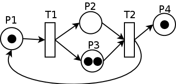

# Next-Generation Logic Arrangement Engine: NopTaskFlow

With the popularity of low-code concepts and products, many are considering introducing logic arrangement into their own projects, moving traditional hand-coded logic to a flexible logic arrangement engine. In this article, I will introduce the design philosophy of the Nop platform's logic arrangement engine, NopTaskFlow, analyze the inevitability of its design at the mathematical level, and explain why NopTaskFlow is considered the next-generation logic arrangement engine, along with its typical characteristics.

## What Exactly Is Logic Arrangement Arranging?

When using traditional programming languages and frameworks for programming, we are essentially adhering to the constraints defined by the language itself. This can be seen as following a **best practice**, albeit implicitly. However, when building a highly flexible and low-level logic framework from scratch, one inevitably breaks free from the form constraints inherent in most programming languages, thus deviating from their implied best practices.

**What is the most flexible logical unit that can be organized?** The traditional answer for this, as we know, is the function. What are the intrinsic characteristics of a function?

1. Functions have clearly defined input and output specifications.
2. Functions can be nested with one another in calls.
3. Variables within functions exhibit complex lexical scoping.

When delving deeper into the structure of functions, even more intricate features emerge, such as:

1. Whether parameters are passed by value or reference (e.g., callByValue, callByRef, callByName)?
2. Support for function-style parameters, i.e., higher-order functions?
3. Existence of independent exception handling mechanisms that do not rely on return values?
4. Support for asynchronous returns?

Additionally, the most crucial point is that **functions are not only the smallest units for organizing and understanding logic but also the smallest unit for abstraction**. **We can reuse existing functions to define new functions**.

Why has the function become the most fundamental logical organization unit in programming languages? When writing a logic arrangement engine, do we still need to base our abstractions on functions? Is there a better abstraction method? To clarify this, we must understand some history.

First, it is crucial to recognize that **functions as a concept were not originally part of early computer programming languages**. The introduction of the function concept was no small achievement.

> ==== AI-Written Prose Below =====

**Early Programming Languages (1950s-1960s):**

- **Assembly Language:** Functions are not explicitly defined in assembly language; programmers typically use jump instructions to execute code blocks.
- **FORTRAN:** Introduced in 1955, FORTRAN featured subroutine concepts that can be seen as an early form of functions. However, **Fortran's subroutines did not support return values**.

**The Rise of Higher-Level Programming Languages (1960s-1970s):**

- **ALGOL 60:** This language introduced in 1960 brought modern function concepts to the table, supporting return values and proposing block structures (local variable scopes), marking a significant milestone in programming language development.
- **Lisp:** Developed in 1958, Lisp treated functions as first-class citizens, allowing them to be passed as data, stored, and returned—core features of functional programming languages.

**Structured Programming (1970s):**

* The concept of structured programming was first proposed by Edsger W. Dijkstra in his 1968 paper [《Go To Statement Considered Harmful》](https://www.dcs.gla.ac.uk/~pat/cpM/choco4/nqueens/Goto-Harmful-Dijkstra.pdf), where he argued that restricting or eliminating the goto statement could improve program structure. Structured programming's core idea is to decompose programs into modular parts using sequential, selection (if-then-else), and loop structures (while, for) to control program flow.
- **C Language:** Released in 1972, C was heavily influenced by Algol 68. Its function definition is concise, supports recursive calls, and is one of the first high-level programming languages to natively support structured programming concepts. The popularity of C significantly propelled the Structured Programming paradigm.

> ==== AI-Written Prose Ends =====

In the 1980s, object-oriented programming took center stage, diminishing the role of functions, which became subservient to objects. In Java, for instance, functions cannot be defined outside of classes. However, since the year 2000, functional programming has seen a resurgence, driving the popularity of pure functions and immutability along with their so-called side-effect-free nature. With the rise of multi-core parallel programming, distributed message systems, and big data processing systems, the function concept has continued to evolve and expand. Modern programming languages now commonly include async/await mechanisms.

Next, we analyze the implicit assumptions inherent in the function concept.

**Firstly, functions inherently result from information hiding, which inevitably partitions the world into internal and external aspects**


  
  , if the internal environment can exist independently of the external environment (meaning that the same function can be called in different external environments without needing to be aware of changes in the environment), then **the relationship between internal and external is restricted to occur only at the boundary**. Information obtained by the internal environment from the outside is referred to as Input, while information provided by the internal environment to the outside is referred to as Output. The dimensionality of the boundary is generally much smaller than the overall structure of the system (similar to the boundary of a three-dimensional sphere being a two-dimensional surface), which allows functions to provide value in reducing external complexity.

> * If a function internally always reads and writes global variables, we are essentially using procedure abstraction rather than function abstraction.
>
> * Serviceization essentially enforces that both Input and Output must be serializable value objects.

**Second, functions automatically introduce the following causality relationships**:

1. Evaluate the expression to obtain the function's Input parameter

2. Execute the function

3. Receive the function's Output

The Input value is determined before the function is called, while **the Output is only produced after the function successfully executes**. If the function call fails, no output variable is received. Specifically, if a function has multiple outputs, we either receive all Outputs or none, and it is impossible to observe only a subset of the Outputs.

> Some logic programming frameworks expose intermediate results as Outputs during step execution, such as exposing loop indices as Endpoints and continuously outputting temporary Outputs during the loop. This approach deviates from function abstraction.

**Third, functions have an independent variable scope (namespace) within their body**. Regardless of what a variable's name is in the external environment, once it is passed to the function as a parameter, **we always use a local input variable name to reference it within the function**. Additionally, temporary variables used inside the function are not visible to the outside. Names are the source of all wisdom. Any large-scale, systematic reuse requires avoiding name conflicts and using local names.

**Fourth, when functions are composed for invocation, information transfer is achieved indirectly through the current scope**. For example:

```
 output = f(g(input))
 // Corresponds to
 output1 = g(input)
 output = f(output1)
```

A variable must exist within a scope. When function `g` returns, its internal scope is conceptually destroyed, and before executing function `f`, the scope of `g` did not yet exist, so the return value of `g` is stored in an external scope and then forwarded to function `f`.

**Fifth, functions imply a paired bidirectional information flow**. We all know that goto is harmful because goto often goes one way only, and it's unclear when or where it will go back. However, functions are a highly self-regulated, strongly predictable form of information organization. Information flows from Input to the function, and **Output must always return and do so at the original calling point** (i.e., goto and goback are strictly paired in a mathematical sense). Traditional programming languages treat function calls as synchronous calls with a blocking semantic, automatically blocking the current execution flow (similar to the timeline in the program world). For asynchronous calls, the function's return does not imply that the Output is available, so only callback functions can be used to handle dependency relationships, leading to the so-called nested callback hell. Modern programming languages' async/await syntax essentially adds a blocking semantic to asynchronous functions, allowing the order of function calls in source code to still reflect the timeline progression.

> In distributed architectures, the most flexible organization is event sending and listening, which fundamentally represents single-directional information transmission, similar to goto's nature. While it is flexible, what is the cost?

### The wise men of history speak

As they say, the only lesson humans have learned from history is that they have not learned anything from it. Twenty years make a generation, and the next generation will forget the wisdom of their predecessors and start anew, just like hitting their heads against a wall.

goto is bad, structured programming is good—this is the idea we've been drilled into since learning programming. But why? In an interview, many programmers can talk about it, even citing Dijkstra's classic paper [《Go To Statement Considered Harmful》](https://www.dcs.gla.ac.uk/~pat/cpM/choco4/nqueens/Goto-Harmful-Dijkstra.pdf) (this is Dijkstra's most famous paper). But how many have actually read the paper in depth? I myself knew about the paper for a long time but never read it seriously until recently, when I finally did. The reasons Dijkstra gave for opposing goto are fundamentally different from what we might imagine, and we've forgotten his wisdom entirely.

In this paper, Dijkstra starts by explicitly stating that he has long observed that the goto statement harms software quality but only recently found a scientifically valid reason for why it does so.

The unbridled use of the go to statement has an immediate consequence that it becomes terribly hard to find a meaningful set of coordinates in which to describe the process progress.

A programmer-independent coordinate system can be maintained to describe the process in a helpful and manageable way. Dijkstra's paper presents the core idea that if we follow structured programming principles, our code text will form **an objective existing coordinate system (independent of Programmer)**. Using this coordinate system, we can intuitively establish a correspondence between static programs (expanded in textual space) and dynamic processes (expanded over time), while the goto statement would disrupt this naturally existing coordinate system.

==== Below is KimiChat AI's summary ===

The so-called coordinates refer to a set of values used to uniquely determine the program execution state.

1. **Textual Index**. When a program consists solely of a sequence of instructions, a "textual index" can be determined by pointing to some midpoint between two consecutive actions. This index acts as a position in the program's textual representation, pointing to a specific statement within the program. Without control structures (such as conditional statements or loops), this index alone is sufficient to describe the progress of program execution.

2. **Dynamic Index**. When a program introduces loops (like `while` or `repeat` statements), a single textual index is no longer sufficient. Loops can cause the same code block to be executed multiple times, thus requiring additional information to track the current iteration count. This is known as a "dynamic index," which is a counter recording the current iteration count of the loop.

3. **Description of Program Execution**. The execution state of a program depends not only on its position in the textual representation (textual index) but also on the dynamic depth of its execution, i.e., the number of nested calls currently active. Therefore, the program's execution state can be uniquely determined by a combination of textual indices and dynamic indices.

== KimiChat AI's creation ends ===

Reversible computing theory can be seen as an extension of Dijkstra's coordinate system idea. **Using domain-specific languages (DSLs), we can establish domain-specific coordinate systems (not just a generic, objective existing coordinate system)** and not only for understanding but also to further define reversible delta operations on this coordinate system, truly leveraging this coordinate system for software construction.

NopTaskFlow is designed in line with the general design of Nop platform XDSL, where each step/input/output has a name attribute as its unique identifier, forming a fully domain-ized logical description. We can use the `x:extends` operator to inherit such a description and utilize the Delta difference mechanism for customized modifications.

It is important to note that in NopTaskFlow, Input and Output are assumed to be single deterministic values rather than streams (Flow objects) that can continuously produce items. The complexity of modeling flows is greater and conflicts with the function concept analysis from the previous chapter. Modeling is completed through the NopStream framework in the planning of the Nop platform.

From a coordinate system perspective, we can consider **a special assumption introduced by flow systems: spatial coordinates are frozen, while temporal coordinates are flowing (spatial coordinates determine the topology of the flow system)**. This special assumption leads to a special simplification, making it worthwhile to write a special framework to fully exploit the value of this assumption.

## Section II. Minimal Logical Organizational Unit TaskStep

The design goal of NopTaskFlow is to provide a **structured logical decomposition scheme that supports delta operations**, and choosing a function concept from programming languages is undoubtedly the most convenient option. Moreover, if future high-performance compilation and execution are required, it will be easier to translate the arrangement logic into ordinary function implementation code.

The minimal logical organizational unit in NopTaskFlow is called TaskStep, with its execution logic as follows:


```javascript
for each inputModel
   inputs[inputModel.name] = inputModel.source.evaluate(parentScope)

outputs = await step.execute(inputs);

for each outputModel
   parentScope[outputModel.exportAs] = outputs[outputModel.name]
```

From a conceptual level, this is very similar to the general program languages' function calls:


```javascript
var { a: aName, b: bName } = await fn( {x: exprInput1, y: exprInput2} );
```

Let's look at an example of a sequential call:

```xml
<sequential name="parentStep">
  <input name="a"/>
  <steps>
    <xpl name="step1">
      <!-- Variables used in the step need to be passed via input; child steps do not directly use variables from the parent step -->
      <input name="a"/>
      <!-- If the source segment returns a type that is not Map, it will be treated as RESULT variable -->
      <source>
        return a + 1
      </source>
      <!-- The output variable can be dynamically computed. If no source is specified, it will return the corresponding variable in the current scope -->
      <output name="a2">
        <source>a*2</source>
      </output>
    </xpl>

    <call-step name="step2" libName="test.MyTaskLib" stepName="myStep">
      <!-- The source segment can be used to dynamically compute input parameters. RESULT corresponds to the variable named RESULT in the parent scope -->
      <input name="a">
        <source>RESULT + 1</source>
      </input>
      <!-- The result from the parent scope is renamed to b2 -->
      <output name="b" exportAs="b2"/>
    </call-step>
  </steps>
  <output name="b2"/>
</sequential>
```

TaskFlow supports multiple step types such as sequential, parallel, loop, choose, xpl, and call-step, making it a Turing-complete functional programming language.

> For detailed definitions of specific steps, please refer to the [task.xdef meta-model definition](https://gitee.com/canonical-entropy/nop-entropy/blob/master/nop-xdefs/src/main/resources/_vfs/nop/schema/task/task.xdef)

The above example is equivalent to the following code:

```javascript
var { RESULT, a2 } = function step1(a) {
  return { RESULT: a + 1, a2: a * 2 };
}(a);

var { b: b2 } = test.MyTaskLib.myStep({ a: RESULT + 1 });
return { b2 };
```

* Steps have a name attribute that is unique within the scope but not necessarily globally unique. This local name is essential for reusability of complex steps.
* xpl is akin to a function call, where the source segment's result is set as RESULT if it is not a Map structure.
* The output variable is dynamically computed via the source segment if specified; otherwise, it retrieves the value from the current scope by name.
* After successfully calling a step, the output result is set in the current scope.
* `call-step` allows reusing existing step definitions.
* Input variables are dynamically computed if a source segment is provided; otherwise, they are retrieved by name from the current scope.
* If an output has an exportAs attribute, its name is changed when it is passed to the parent scope.

The TaskStep interface is defined as follows:

```java
interface ITaskStep {
  String getStepType();

  List<ITaskInputModel> getInputs();

  List<ITaskOutputModel> getOutputs();

  CompletionStage<Map<String, Object>> execute(
    Map<String, Object> inputs, Set<String> outputNames,
    ICancelToken cancelToken, ITaskRuntime taskRt);
}
```

* TaskStep provides models for inputs and outputs, serving as reflection metadata that reveals parameter names and types, return variable names and types, etc.

* As a general orchestration component, TaskStep enforces a multi-input and multi-output structure, so both `inputs` and `outputs` are Map objects.
* **`outNames` provides a result data selection capability similar to GraphQL.** When calling a Step, we specify which return variables are needed. This allows for selective performance optimization within the step, enabling complex calculations that can be skipped if they are not required as outputs.
* TaskStep supports asynchronous execution by default and provides runtime cancellation capabilities via **`cancelToken`.** TaskFlow automatically adds an `await` semantic during execution, waiting for the previous Step to complete.
* ITaskRuntime is the shared global information throughout the task execution process, including items like TaskScope.

If you need to extend TaskFlow, the simplest way is to register a bean implementing the `ITaskStep` interface in the NopIoC container and use the following XML syntax:

```xml
<simple bean="myStepBean">
  <input name="a1"/>
  <input name="a2"/>

  <output name="b1"/>
  <output name="b2"/>
</simple>
```

If you look at the `ITaskStep` interface definition, you'll find its implementation requires more complexity:

```java
interface ITaskStep {
  // ...

  TaskStepReturn execute(ITaskStepRuntime stepRt);
}
```

* The purpose of **`TaskStepReturn`** is to optimize performance during synchronous calls and provide abilities for stepping and suspending steps.
* **`ITaskStepRuntime`** centralizes the management of function parameters, facilitating their transmission to subsequent steps.

```java
interface ITaskStepRuntime {

  IEvalScope getEvalScope();
  
  ITaskStepState getState();
  
  ITaskRuntime getTaskRuntime();
  
  ICancelToken getCancelToken();
  
  Set<String> getOutputNames();

  default boolean needOutput(String name) {
    Set<String> names = getOutputNames();
    return names == null || names.contains(name);
  }

  default Object getValue(String name) {
    return getEvalScope().getValue(name);
  }

  default void setValue(String name, Object value) {
    getEvalScope().setLocalValue(name, value);
  }

  default Object getResult() {
    return getLocalValue(TaskConstants.VAR_RESULT);
  }
}
```

**`ITaskStepRuntime` not only manages all external parameters passed to steps but also exposes internal state information**, providing additional variables like `IEvalScope` and `ITaskStepState`. The `ITaskStepState` represents persistent state of the step instance, useful for implementing a mechanism similar to Coroutine's suspend/resume.

`IEvalScope` is the variable scope within a step, organized hierarchically to form a scoping chain akin to lexical scoping. When reading variables from the scope, if not found in the current scope, it automatically searches upwards to parent scopes. Typically, the parent of `scope` is `TaskScope`, meaning variables are searched first at the level of the current step and then in shared task-level scopes**, **unless the step instance has been configured with `useParentScope=true`.** This setting allows variables to be accessed from parent scopes, enabling functionality similar to function closures.


```xml
<sequential name="parentStep">
  <input name="a"/>

  <steps>
    <!-- If useParentScope is set to true, you do not need to declare an input 
          and can directly read the variable 'a' from the parent scope -->
    <xpl name="step1" useParentScope="true">
      <source>
        return a + 1
      </source>
    </xpl>
  </steps>
</sequential>
```

## Three. The Superiority of Wrapped Functions Over Bare Functions

If the subject of logic arrangement is just an ordinary function, what distinguishes it from handwritten code? Beyond abstract syntax tree (AST) visualization, can logic arrangement do anything more valuable? Absolutely. We can elevate our subject of arrangement.

**The one arranging does not have to be a bare, unadorned function (Naked Function), but rather a richly adorned wrapped function (Rich Function)**.

> In our universe, elementary particles like quarks and electrons possess no intrinsic rest mass. However, they are perpetually immersed in the omnipresent Higgs field, where the Higgs field pulls them (modifies them), thereby giving rise to the concept of effective mass for observed composite particles.

In modern object-oriented programming languages, the annotation mechanism has become a standard feature, evolving to some extent into nearly excessive proportions. Many frameworks are dedicated to moving execution logic into annotation processors.

```javascript
// Function generated by AI of智谱清言
@GetMapping("/example/{id}")
@Cacheable(value = "examples", unless = "#result == null") // Cache response results
@Retryable(value = {Exception.class}, maxAttempts = 3, backoff = @Backoff(delay = 1000)) // Retrying strategy
@Transactional(readOnly = true) // Declare transaction as read-only
@Secured({"ROLE_ADMIN", "ROLE_USER"}) // Annotation for limiting access permissions
@RateLimiter(key = "exampleService", rate = "5/minute") // Rate limiting annotation
@Fallback(ExampleServiceFallback.class) // Service degradation annotation
@AuditTrail // Custom annotation for logging operation trails
public Example getExampleById(@PathVariable("id") Long id) {
    // Business logic processing
    return exampleRepository.findById(id);
}
```

The fundamental role of function annotations is to enhance the original function using mechanisms akin to AOP. In frameworks, what we typically use are enhanced functions wrapped by interceptors. In reality, at the service layer,裸函数 almost never appears without any annotations.

In functional programming, there exists a similar mechanism to AOP-based function enhancement, referred to as algebraic effect (Algebraic Effect).

```python
// Code generated by AI of智谱清言
def log(message):
    perform print(message)

def handlePrint(effect):
    if effect == "print":
        return lambda message: println(message)

withHandler handlePrint:
    log("Hello, world!")
```

In the log function, `perform print(message)` indicates the generation of a print effect. However, this effect does not immediately execute the print operation. Instead, it delegates the effect to the handling program within the current scope.
The `withHandler` binds the handlePrint processor to the current code block. When calling `log("Hello, world!")`, it generates a print effect that is intercepted and executed by the handlePrint processing program. **`perform print` essentially defines a coordinate point, which is then replaced by an enhanced function (often with side effects) via `withHandler`**.

All Step meta-models in NopTaskFlow inherit from a base structure, allowing for the addition of common modifications.

```xml
<xdef:define xdef:name="TaskStepModel" executor="bean-name" timeout="!long=0"
             name="var-name" runOnContext="!boolean=false" ignoreResult="!boolean=false"
             next="string" nextOnError="string">
  <input name="!var-name" xdef:name="TaskInputModel" type="generic-type" mandatory="!boolean=false"
         fromTaskScope="!boolean=false" xdef:unique-attr="name">
    <source xdef:value="xpl"/>
  </input>

  <output name="!var-name" xdef:name="TaskOutputModel" toTaskScope="!boolean=false" type="generic-type"
          xdef:unique-attr="name" exportAs="var-name">
    <source xdef:value="xpl"/>
  </output>

  <when/>
  <validator/>

  <retry/>
  <catch/>
  <finally/>

  <throttle/>

  <rate-limit/>
  <decorator name="!string"/>
</xdef:define>
```

* executor: Execute on the specified thread pool  
* timeout: Timeout for the entire step. If a timeout occurs while executing, it will automatically cancel and throw a `NopTimeoutException`  
* runOnContext: Submits the task to the IContext queue for execution, ensuring no parallel processing  
* ignoreResult: Ignores the RESULT return value and does not update the parent scope with it. Sometimes, adding logging steps requires setting this property to avoid affecting the original execution context  
* next: Automatically jumps to a specified step after completing the current step  
* nextOnError: Jumps to a specified step if the current step fails  
* when: Executes the current step only when the condition is met; otherwise, skips it  
* validator: Validates the Inputs variable  
* retry: Retries the step according to the defined strategy if it fails  
* catch/finally: Catches exceptions and performs additional processing  
* throttle/rate-limit: Controls execution rate  
* decorator: Can be used in NopIoC to register custom decorators  

```java
interface ITaskStepDecorator {
  ITaskStep decorate(ITaskStep step, TaskDecoratorModel config);
}
```

When a decorator is applied to a parent node, it can cause instability in the node's coordinates (the unique path from the root). For example, suppose the current path is `main/step1/sub-step1`. Adding a local adjustment by applying a decorator would change the path to `/main/step1/decorator1/sub-step1`. However, if we extract the decorator and treat it as an attribute node of the step, the business-level coordinate becomes more stable.

## Four. Implementing Coroutine Even If You Can't Pass Three

SpringBatch is a logical orchestration framework within the Spring ecosystem for batch processing tasks. It provides functionality to resume from failure points in accordance with the requirements of recoverable batch tasks. From a conceptual perspective, SpringBatch supports the following type of calls:

```javascript
try {
    JobExecution execution = jobLauncher.run(job, jobParameters);
} catch (Exception e) {
    e.printStackTrace();
}
// After fixing the error, if the job hasn't completed yet, we can run it again with the same parameters
// It will automatically resume from where it left off in the previous attempt
jobLauncher.run(job, jobParameters);
```  

When a Job encounters an error, it will throw an exception and halt execution. If we fix the error issue, we can rerun the Job, which will automatically resume from where it left off and continue executing. From a conceptual level, in SpringBatch, a Job can be viewed as a "function that can be paused and resumed." In academic circles, there is a specific term for functions that possess the ability to pause (suspend) and resume (continue execution): this is called a **coroutine (Coroutine)**. However, in SpringBatch, a Job is passively paused when an exception occurs, whereas the generalized coroutine concept allows a program to actively pause execution and transfer control.

Modern programming languages such as JavaScript/Python/Kotlin/C#/Go/Swift/Lua/Ruby/Rust etc., all have built-in support for coroutines or equivalent concepts. The `async/await` syntax is essentially an implementation of the coroutine, which is used when making asynchronous calls to actively pause execution.

> JDK21 has officially added coroutine support.

Some people interpret coroutines as lightweight user-space threads, but this is only one specific application of the coroutine concept. According to Wikipedia's definition:

> Coroutines are computer program components that generalize subroutines for non-preemptive multitasking by allowing multiple entry points for suspending and resuming execution at certain locations.

Clearly, the concept of a coroutine is broader than that of threads and has a more fine-grained application.

### Coroutines in JavaScript

Let's look at the JavaScript `Generator` function next. This is essentially a coroutine mechanism.

> === Below is an article by IQ Language AI ===

Below is the simplest example demonstrating the use of a JavaScript Generator function to implement a loop. In this example, the Generator function will iterate over an array of numbers and yield each number in turn. By using the `yield` keyword, we can pause the execution of the function after each iteration and resume it when the `next()` method is called again.

```javascript
// Define a Generator function
function* generateNumbers() {
  // Use a for loop to iterate over an array of numbers
  for (let i = 0; i < 5; i++) {
    // Use the yield keyword to pause execution and produce the current number i
    yield i;
  }
}
// Call the Generator function to obtain an iterator object
const iterator = generateNumbers();
// Manually traverse the states of the Generator function using the next() method
console.log(iterator.next()); // { value: 0, done: false }
console.log(iterator.next()); // { value: 1, done: false }
console.log(iterator.next()); // { value: 2, done: false }
console.log(iterator.next()); // { value: 3, done: false }
console.log(iterator.next()); // { value: 4, done: false }
console.log(iterator.next()); // { value: undefined, done: true }
```

In the above code example, `generateNumbers` is a Generator function that contains a for loop iterating from 0 to 4. In each iteration, `yield i` produces the current number `i` and pauses the execution of the function.
When we call `generateNumbers()`, it does not immediately execute but returns an iterator object. We can manually traverse the states of this iterator using its `next()` method. Each call to `next()` will cause the Generator function to resume from where it last yielded, continuing until it encounters the next `yield` statement or completes.
The `next()` method returns an object with a `value` property (the value produced by the last `yield`) and a `done` boolean property indicating whether the traversal is complete. When `done` is true, the `value` will be undefined, indicating that the Generator function has finished executing.


  
  Through this example, we can see the concept of suspension and resumption in Generator functions. The `yield` keyword is used to pause the execution of the function and pass a value to the caller of the `next()` method. When the `next()` method is called, the function resumes its execution from where it was paused. This process can be repeated until the Generator function completes.

> The creation of "Zhiyuanchuan" has come to an end.

### TaskFlow的Coroutine实现

The concept of "a function that can be paused and resumed" may seem simple at first glance, but its actual implementation is just as straightforward. According to vczh's (Mei Qimeng) research, [Even if you don't pass the three subjects, you can give your beloved language a Coroutine](https://zhuanlan.zhihu.com/p/25964339).

Let me recall Dijkstra's paper. He pointed out that structured programming inherently introduces a coordinate system. In this coordinate system, only a few key coordinates need to be known in order to precisely locate the program's runtime space at any execution point. Therefore, if we want to implement functions' suspension and resumption, **you only need to find a way to record these coordinates and provide a mechanism to jump to the specified coordinate**.

The built-in Coroutine in most programming languages is designed with performance optimization in mind, which means it needs to fully utilize the run-time information of the language's execution stack. This makes the implementation logic somewhat abstract and high-level, but this is due to the fact that we are working at a low level (closer to machine code), not because of any inherent complexity.

NopTaskFlow has implemented a mechanism similar to Coroutine, which allows for restarting failed batch tasks. Since it is implemented using higher-level language constructs, there's no need to worry about extreme performance, making the implementation straightforward and easy to understand—even someone who didn't pass high school can grasp it. Let's look at how a loop can implement suspension and resumption.

```javascript
for (let i = 0; i < 5; i++) {
    executeBody();
}
```

The difficulty in suspending/resuming lies in the fact that this loop uses temporary state variables, such as the `i` variable. When you suspend execution, these temporary state variables are lost, making it impossible to resume. Therefore, **the first step in implementing Coroutine is to collect all temporary variables and convert them into member variables of some class**. This way, the internal state information is exposed to an external manager.


```java
class LoopNTaskStep extends AbstractTaskStep {
    public TaskStepReturn execute(ITaskStepRuntime stepRt) {
        LoopStateBean stateBean = stepRt.getStateBean(LoopStateBean.class);
        if (stateBean == null) {
            stateBean = new LoopStateBean();
            // Initialize loop variables
            int begin = ConvertHelper.toPrimitiveInt(beginExpr.invoke(stepRt), NopException::new);
            int end = ConvertHelper.toPrimitiveInt(endExpr.invoke(stepRt), NopException::new);
            int step = (stepExpr == null) ? 1 : ConvertHelper.toPrimitiveInt(stepExpr.invoke(stepRt), NopException::new);

            if (step == 0) {
                throw TaskStepHelper.newError(getLocation(), stepRt, ERR_TASK_LOOP_STEP_INVALID_LOOP_VAR)
                        .param(ARG_BEGIN, begin).param(ARG_END, end).param(ARG_STEP, step);
            }

            stateBean.setCurrent(begin);
            stateBean.setEnd(end);
            stateBean.setStep(step);
            stepRt.setStateBean(stateBean);
        }

        do {
            if (!stateBean.shouldContinue()) {
                return TaskStepReturn.RETURN_RESULT(stepRt.getResult());
            }

            if (varName != null) {
                stepRt.setValue(varName, stateBean.getCurrent());
            }
            if (indexName != null) {
                stepRt.setValue(indexName, stateBean.getIndex());
            }

            TaskStepReturn stepResult = body.execute(stepRt);
            if (stepResult.isSuspend())
                return stepResult;

            // Handle synchronous returns
            if (stepResult.isDone()) {
                stateBean.incStep();
                stepRt.setBodyStepIndex(0);
                stepRt.saveState();

                stepResult = stepResult.resolve();
                if (stepResult.isEnd())
                    return stepResult;
                if (stepResult.isExit())
                    return RETURN_RESULT(stepRt.getResult());
            } else {
                // Handle asynchronous returns; some implementation details omitted here
            }
        } while (true);
    }
}

The implementation of the `loop-n` step in NopTaskFlow is as follows, which essentially makes the following modifications:

```javascript
while (state.index < state.end) {
    executeBody(state.bodyStepIndex, state);
    state.index += state.step;
}
```

In addition to the temporary variables like `index` and `end` for dynamic coordinates, the `stateBean` also needs to record static coordinate information indicating which row of the body has been executed. Essentially, as long as sufficient coordinate information is recorded, we can uniquely determine the current execution state.

The implementation of "jumping to a specific coordinate point" in NopTaskFlow is straightforward: **start executing from the root node and skip until the target coordinate point is found**.

> Single-point location can be implemented as a combination of scanning and filtering.

## Five. Data-Driven Graph Pattern

In NopTaskFlow, the `sequential` and `loop` steps are equivalent to simulating the execution process of a procedural programming language. At this time, steps are implicitly linked by **positional relationships**, meaning that after one step is executed, the subsequent step automatically starts at its position. Here, "position" refers to coordinates that can be determined on the source code level, making the execution a form of **coordinate-driven** mode.

Although NopTaskFlow supports `parallel` steps for structured parallel processing (where "structured" refers to parallel steps that automatically perform a join operation after execution to produce a consolidated final result), this structure also imposes certain organizational limitations, preventing us from fully optimizing system value and achieving maximum parallelization. If our system is designed primarily for data processing, we can **shift our focus to the data objects** themselves, imagining the propagation of these objects within the system (focusing on data flow rather than control flow). We only need to establish connection pipes and propagate relevant data when a specific data item is required in computation.

NopTaskFlow provides a running mode called **graphMode**. In this mode, the executor does not sequentially select the next step like procedural programming but instead analyzes dependency relationships between `TaskStep` inputs and outputs, establishing these dependencies based on actual data usage, and then determining the execution order of steps based on the resulting dependency graph.

```xml
<graph name="test" enterSteps="enter1,enter2" exitSteps="exit">
    <input name="x">
        <source>1</source>
    </input>

    <steps>
        <xpl name="enter1" executor="myExecutor">
            <input name="x"/>
            <source>
                return x + 1
            </source>
        </xpl>

        <xpl name="enter2" executor="myExecutor">
            <input name="x"/>
            <source>
                return x + 2
            </source>
        </xpl>

        <xpl name="process">
            <input name="a">
                <source>
                    STEP_RESULTS.enter1.outputs.RESULT
                </source>
            </input>

            <input name="b">
                <source>
                    STEP_RESULTS.enter2.outputs.RESULT
                </source>
            </input>

            <source>
                return a + b
            </source>
        </xpl>
    </steps>
</graph>
```

* The `graph` step in graph mode starts execution with `enterSteps` and ends when any `exitStep` is reached.

* [GraphStepAnalyzer](https://gitee.com/canonical-entropy/nop-entropy/blob/master/nop-task/nop-task-core/src/main/java/io/nop/task/builder/GraphStepAnalyzer.java) automatically analyzes the source expression in the Input configuration using AST and extracts variable information of the form `STEP_RESULTS.{stepName}.outputs.{outputVar}` to build a DAG dependency graph. If cyclic dependencies are detected, an exception will be thrown. `STEP_RESULTS` is a Map variable defined within the scope of a graph step, used to uniformly manage all step outputs. Since Input is executed in the parent step's scope, other steps' outputs can be accessed via `STEP_RESULTS`.

* [GraphTaskStep](https://gitee.com/canonical-entropy/nop-entropy/blob/master/nop-task/nop-task-core/src/main/java/io/nop/task/step/GraphTaskStep.java) automatically adds a waiting semantics for child steps: a child step will only be executed after all of its Input variables have been computed. In the example above, the `process` child step will be triggered only after both `enter1` and `enter2` steps have completed.

Data-driven approaches are most effective in streaming scenarios. NopTaskFlow continues to focus on organizing logical steps rather than complex data flow patterns, providing only a simple DAG execution mode.

### **Degenerated Data Pipeline**:

A complete streaming solution requires modeling of the data pipeline, such as temporary storage capabilities, windowing, and backpressure handling when the pipeline is full. However, in NopTaskFlow, since it assumes no support for streaming and enforces that the graph is a DAG (no cycles), we can deduce the following conclusion: **each step can be triggered at most once**.

1. A step will only execute if all of its Inputs are ready, and each execution produces exactly one Output.
2. All Inputs either come from previous steps' Outputs or external sources. If a preceding step is executed only once and produces one Output, the current step will also be executed only once.
3. `enterStep` is influenced only by external inputs and will execute only once.

In NopTaskFlow's design, each step has a unique coordinate (step name). Considering that each step can be triggered at most once, it follows that **each Input and Output in execution also possesses a unique coordinate**. Input and Output connections can be viewed as references matching the coordinates of Inputs and Outputs.

> For example, `STEP_RESULTS.step1.outputs.a` represents the output variable `a` from the step `step1`.

In this context, the data pipeline is degenerated to a state where it can hold at most one element, requiring **a single Promise object** for representation. In NopTaskFlow's implementation of [GraphTaskStep](https://gitee.com/canonical-entropy/nop-entropy/blob/master/nop-task/nop-task-core/src/main/java/io/nop/task/step/GraphTaskStep.java), the approach is straightforward:

1. Register all steps' Promises and establish dependencies using `Promise.waitAll`.
2. Launch all `enterStep` actions.

No complex task queues or scheduling mechanisms are needed; a dependency chain established via Promises suffices.

### Step-level Dependencies

At first glance, Input and Output dependencies appear to exist at the variable level, more fine-grained than step-level dependencies. However, due to NopTaskFlow's function-based abstraction and lack of support for streaming Outputs, a step's Output can only be used after the step has completed, and multiple Outputs are produced simultaneously or not at all (in case of step failure). Under these conditions, **a dependency on a step's Output effectively means a dependency on the step itself**.

Another practical consideration is that many implemented functions are not pure functions, containing implicit side effects not explicitly expressed through variables. When steps interact without relying solely on explicit Input-Output relationships but also on implicit side effects, step-level dependencies must be explicitly defined. Therefore, NopTaskFlow includes `waitSteps` and `next`, `nextOnError` step dependency configurations in addition to input-output analysis.

```xml
<xpl waitSteps="step1,step2" next="step4">
</xpl>
```

### Differentiating Normal and Exceptional Outputs

In Java, the `CompletionStage`/`CompletableFuture` asynchronous result objects provide multiple callback mechanisms such as `thenApply()`, `exceptionally()` and `whenComplete()`. These allow triggers of callback functions upon execution success, failure, or completion (regardless of outcome), enabling selective identification of success and failure paths based on specific needs.

Similarly, in the NopTaskFlow graph pattern, each step's output result corresponds to a `StepResultBean` object that contains two parts: `error` and `outputs`.

```java
class StepResultBean {
    ErrorBean error;
    Map<String,Object> outputs;
}
```

In Input expressions, if an `error` property is referenced, it indicates triggering upon failure of the preceding step. If both `error` and `outputs` variables are referenced, it indicates triggering upon completion of the preceding step.

```xml
<xpl name="process">
   <input name="step1Error">
      <source> STEP_RESULTS.step1.error </source>
   </input>
   <input name="step2Result">
      <source> STEP_RESULTS.step2.outputs.RESULT </source>
   </input>
</xpl>
```

The example demonstrates that the `process` step is triggered only when `step1` fails or `step2` succeeds.

## Six. Differences Between TaskFlow and Behavior Tree (Behavior Tree)

A behavior tree is a commonly used logic arrangement scheme in the game AI field. Notable game design engines like Unity support behavior trees via plugins. In fact, NopTaskFlow's design is directly influenced by behavior trees, enabling it to directly express behavior tree logic.

References for behavior trees:

* [Behavior Tree Primer](https://zhuanlan.zhihu.com/p/463182588)
* [Introduction to Behavior Trees: Theory and Practice](https://zhuanlan.zhihu.com/p/611393851)

We can also leverage AI tools for quick learning. If you ask an AI like "What is a behavior tree?", it will respond with concise explanations.

> *AI responses are random, requiring manual selection. Can also request multiple variations in one go.*

You can then ask for more detailed explanations and examples:

> === Sample AI Responses for Behavior Tree ===

A behavior tree is an algorithmic paradigm used to describe and control the behavior of virtual agents or robots. It is a hierarchical, visual tool that clearly represents complex decision logic and is easy to understand and modify.

Behavior trees are composed of nodes, primarily of the following types:

1. **Control Nodes (Control Nodes)**: These determine the execution logic of their child nodes.
   - **Selector Nodes (Selector)**: Evaluate child nodes sequentially until one successfully executes.
   - **Sequence Nodes (Sequence)**: Execute child nodes in order; failure of any node causes the sequence to fail.
   - **Parallel Nodes (Parallel)**: Execute child nodes simultaneously, succeeding based on conditions such as all or some success.
2. **Action Nodes (Action Nodes)**: Represent specific actions like moving to a location or attacking an enemy.
3. **Condition Nodes (Condition Nodes)**: Check for specific conditions, typically returning success or failure.

Behavior trees offer several advantages:
- **Modularity**: Complex behaviors can be decomposed into reusable modules.
- **Flexibility and Expandability**: Easy to add or modify nodes to adjust behavior.
- **Clarity**: Provides a clear view of the AI's behavior logic.
- **Ease of Debugging**: Clear node status visibility aids in troubleshooting and optimization.

Behavior trees are widely applied in game AI, robot control, automation systems, etc.

Below is a simple behavior tree example for controlling a virtual agent in a game to collect resources:


```
Selector
├── Sequence
│   ├── Condition: "Check if the resource list is empty"
│   ├── Action: "Select the nearest resource"
│   └── Sequence
│       ├── Action: "Move to resource location"
│       └── Action: "Collect resources"
│
└── Action: "Patrol"

In this behavior tree, we have a selector node (Selector) as the root node, which has two child nodes: one sequence node (Sequence) and one action node (Action).

1. **Selector Node (Selector)**: First evaluates the first child node (sequence node). If that child node fails, it then evaluates the second child node (patrol action).

2. **Sequence Node (Sequence)**: This node contains three child nodes that will be executed in order:
- **Condition Node**: Checks if the current resource list is empty. If the resource list is empty, the condition fails, causing the sequence node to fail and triggering the selector node to evaluate its next child node.

- **Action Node**: Selects the nearest resource and sets it as the current target.

- **Sequence Node (Internal)**: This internal sequence node contains two action nodes:

  - **Move to Resource Location**: The role moves to the selected resource location.
  - **Collect Resources**: The role executes the collect resources action.

3. **Action Node (Patrol)**: If the sequence node fails (e.g., no resources are available), the patrol action will be executed by the role.
   This behavior tree's basic logic is: if the role knows there are resources to collect, it will attempt to move to the resource location and collect them; if no resources are available for collection, the role will execute the patrol action. Through this approach, the behavior tree ensures that the role always has something to do and dynamically adjusts its behavior based on the current game state.

> ===AI Copy Creation Completion===

Using NopTaskFlow, we can implement the above behavior tree logic in a one-to-one manner.

```xml
<task>
  <steps>
    <selector name="actions">
      <steps>
        <sequential name="step1">
          <steps>
            <exit name="Check if the resource list is empty">
              <when>
                <agent:Check if the resource list is empty/>
              </when>
            </exit>

            <xpl name="Select nearest resource">
              <source>
                <agent:Select nearest resource/>
              </source>
            </xpl>

            <sequential>
              <steps>
                <xpl name="Move to resource location">
                  <source>
                    <agent:Move to resource location/>
                  </source>
                </xpl>

                <xpl name="Collect resources">
                  <source>
                    <agent:Collect resources/>
                  </source>
                </xpl>
              </steps>
            </sequential>
          </steps>
        </sequential>
        <xpl name="Patrol">
          <source>
            <agent:Patrol/>
          </source>
        </xpl>
      </steps>
    </selector>
  </steps>
</task>
```

* Behavior trees require their nodes to always return the execution status. It has three possible values: Success, Failure, and Running. NopTaskFlow's step node returns a TaskStepReturn type, which provides judgment functions to distinguish the three states required by the behavior tree. Additionally, TaskStepReturn supports returning CompletionStage asynchronous objects, enabling async callbacks.

* NopTaskFlow has an built-in selector step that directly expresses the functionality of the selector node.

* The `exit` step in NopTaskFlow is used to exit the current sequence execution sequence, combined with the `when` judgment condition, can act as a `Condition` node in behavior trees.

* The parallel step in NopTaskFlow can express the functionality of the Parallel node in behavior trees. Additionally, the parallel step provides an aggregator configuration that can implement the simplest task decomposition and merging.

In principle, any logic that can be expressed with a behavior tree can also be expressed using NopTaskFlow. Moreover, because NopTaskFlow's steps are built-in with timeout/retry modifiers, the nesting level required to express common logic is fewer than that of behavior trees, making the expressions more compact and concise.

> One advantage of behavior trees is that all logic is visually intuitive. NopTaskFlow can be considered for use in a manner similar to brain maps, using commonly used icons and labels to express various step modifiers without necessarily exposing this information as a node.

Behavior trees are primarily applied to the decision-making and action processes of individual agents, essentially combining decision trees with action sequences. From a conceptual perspective, **Sequence is equivalent to an AND (AND) logic, while Selector is equivalent to OR (OR) logic**. Behavior tree steps are closer to Predicate abstraction, which only returns True/False (usually also updating global context), and does not support more general return value types. NopTaskFlow is built on a more generalized function abstraction, incorporating the capabilities of behavior trees but optimized for game AI application scenarios in its implementation.

## 7. TaskFlow与工作流(Workflow)的区别

What is the difference between TaskFlow and Workflow (Workflow)?

Can we use a workflow engine to implement logic arrangement?

In the Nop platform, NopTaskFlow and NopWorkflow are two independently designed arrangement engines. Since both are Turing-complete, in practice, either can be used for logic arrangement work. From an internal structure perspective, the graph pattern of NopWorkflow is somewhat similar to that of NopTaskFlow. However, on the other hand, NopTaskFlow and NopWorkflow have different design assumptions and address specific problems differently, leading to significant differences in how they handle various business scenarios. Depending on the specific business scenario, we will choose which arrangement engine to use.

Let's first look at the core concepts of workflow engines.

> ====智谱清言AI的介绍结束====


From the above description, it can be seen at the conceptual level that workflow engines primarily orchestrate business workflows, which involve multiple participants and span a longer time horizon, while the term "logic arrangement" generally refers to technical logic applied at a more localized and lower-level scope.

**In workflow engines, the concepts of Participant (参与者) and Assignment (分配任务) are central**. In domestic applications, these have been further specialized into so-called approval flows, where all logic revolves around task assignment and distribution. Logic arrangement tasks are typically automated and do not directly involve human-machine interaction.

In the design of the Nop platform, the content of a NopWorkflow Step can be expressed using NopTaskFlow. Overall, NopTaskFlow is intended to be more lightweight, such as allowing a single step to be reused while not requiring persistent execution states, unlike NopWorkflow, which allows reuse of entire subflows and requires all execution states to be persistent.

An interesting point is that the design principles of foreign workflow engines also originate from process automation, meaning they are naturally suited for scenarios without human intervention. However, when applied to scenarios involving frequent human-machine interaction, they exhibit a certain lack of fit. To address this, NopWorkflow has made adjustments to its basic structure, deviating from the mainstream BPMN (Business Process Model and Notation) modeling language used in the industry today but making it easier to map onto user interface operations.

An even more intriguing aspect is that NopWorkflow's design, in form, is closer to the structural characteristics of Petri nets, one of the foundational theories behind workflow. Below is a brief introduction to Petri nets.

* For detailed information, please refer to [Hello, Workflow](https://zhuanlan.zhihu.com/p/107253393)

> ====Introduction to Petri Nets by智谱清言AI====

Petri nets are a mathematical model used to describe and analyze concurrent systems, distributed systems, communication protocols, and various types of information processing systems. Proposed by Carl Adam Petri in 1962, Petri nets provide a graphical representation method that uses a set of nodes (Places) and directed arcs (Arcs) connecting these nodes to represent system states and state transitions.

The primary elements of a Petri net are:

1. **Place (位置)**: Represented by circles, these denote resources or conditions within the system. Places can contain tokens (令牌), where the number of tokens indicates the quantity or degree of condition satisfaction.

2. **Transition (转换)**: Represented by bars or rectangles, transitions denote events or operations within the system. When a transition is triggered, tokens move between places.

3. **Arc (弧)**: Represented by directed line segments, arcs connect places and transitions. Arcs can have weights indicating the number of tokens required to trigger a transition.

The working principle of Petri nets revolves around token movement. A transition becomes "triggerable" if all input places to it contain sufficient tokens. Once triggered, tokens are consumed from input places, while new tokens may be generated in output places based on the arcs' connections. This process represents changes in system states.

Petri nets possess several characteristics that make them suitable for modeling and analyzing a wide range of domains, including:

- Concurrency and parallelism
- Synchronization and communication
- Resource allocation and deadlock analysis
- Performance evaluation and optimization
- Software engineering and business process management

An important characteristic of Petri nets is their mathematical foundation, which enables formal methods to be used for analyzing and verifying system properties such as reachability, liveness, and safety. Additionally, Petri nets can be extended into variants like colored Petri nets and timed Petri nets to address more complex modeling requirements.

>智谱清言的创作结束



**One obvious formal characteristic of Petri networks is that they form a bipartite graph (二部图)**. During state transitions between nodes, the process must pass through explicitly marked operation nodes, and both types of nodes support many-to-one and one-to-many connections, allowing for great flexibility when mapping to specific applications.

The basic structure of NopWorkflow also forms a bipartite graph composed of steps and actions.

```xml
<workflow>
   <actions>
      <action name="action1" forActivated="true">
        <when>Dynamic Condition Display</when>
        <transition>
           <to-step stepName="step2" />
           <to-step stepName="step3" />
        </transition>
      </action>
      ...
   </actions>
   <steps>
     <step name="step1">
       <ref-actions>
          <ref-action name="action1" />
          <ref-action name="action2" />
       </ref-actions>
     </step>
     ...
   </steps>
</workflow>
```

Each action can be directly mapped to the operation buttons displayed on the interface, and its execution can be controlled through attributes like `forActivated`, `forHistory`, `forReject`, or `forWithdraw` to determine whether it is allowed to be executed in different step states. These attributes can also control the visibility of the buttons. Additionally, conditional logic for actions can be defined by configuring the `<when>` code segment to enable more dynamic business judgment conditions. **Defining action nodes clearly allows for a natural and direct mapping between the human interface operations and workflow models**.

## Why Next Generation

When someone claims that "NopTaskFlow is the next-generation logic orchestration engine," it might be met with skepticism: "I don't see what's innovative here. It's just rehashing old implementations." But don't be hasty. The "next generation" refers not to an abundance of features or superior performance, but to its foundation in next-generation software construction theory: reversible computing theory. This results in characteristics distinct from existing software architectural designs. **These characteristics are unrelated to logic orchestration itself**.

The reasoning is as follows:

1. Reversible computing is the next-generation software construction theory.
2. The Nop platform is built from scratch under the guidance of reversible computing, serving as a next-generation low-code development platform.
3. NopTaskFlow is a component of the Nop platform and inherits these so-called next-generation characteristics.

This is an interesting proposition. Generally, for application scenarios like rule engines, workflow engines, report engines, logic orchestration engines, ORM engines, IoC engines, and GraphQL engines—which inherently have fundamental differences—we develop and implement them separately with little overlap in their underlying designs and code (except for some helper classes and generic script engines). The core question raised by the Nop platform is: **How can we simultaneously design and implement all possible types of engines?** If there is an answer to this question, it cannot be a business-level solution nor a design technique based on experience; it must be grounded in a universal mathematical principle.

If we closely examine existing engine frameworks, we will observe that **each valuable engine is backed by a specific model structure**, and the construction of these models has common requirements:

1. How to implement model construction? How to validate model effectiveness?
2. Is there an IDE plug-in for editing? Can it perform breakpoint debugging?
3. Can models be dynamically updated? How to achieve dynamic updates?
4. Can they be visualized? How is a visualization designer implemented?
5. Can existing models be extended? How to extend them?
6. How are different models seamlessly embedded and made to work together?
7. With increasingly specific assumptions being introduced for models, how is runtime performance ensured?
8. How is a secondary abstraction mechanism provided based on existing models?

Many people have recognized these commonalities but have only summarized abstract design principles and patterns without deriving a reusable technical foundation. The Nop platform differs by providing a standardized approach for DSL (Domain Specific Language) design and implementation under the guidance of reversible computing theory, along with a reusable infrastructure to support this approach. Using this route, many functionalities can be implemented without programming. Therefore, the amount of code in Nop platform engines is typically one order of magnitude smaller than similar open-source frameworks. For detailed information, please refer to:

1. [XDSL: General Domain-Specific Language Design](https://zhuanlan.zhihu.com/p/612512300)
2. [General Delta Difference Quantization Mechanism](https://zhuanlan.zhihu.com/p/681801076)
3. [Meta Programming in Low-Code Platforms](https://zhuanlan.zhihu.com/p/652413095)

Specifically, the implementation logic of NopTaskFlow is as follows:

```javascript
TaskFlowModel taskFlowModel = resourceComponentManager.loadComponentModel(taskFlowPath);

ITask task = taskFlowModel.getTask(new TaskFlowBuilder());

ITaskRuntime taskRt = new TaskRuntimeImpl(taskStateStore);
taskStepReturn = task.execute(taskRt);
```

1. **Implementing the first and most crucial step of NopTaskFlow is defining the meta-model[task.xdef](https://gitee.com/canonical-entropy/nop-entropy/blob/master/nop-xdefs/src/main/resources/_vfs/nop/schema/task/task.xdef)**. Once the meta-model is defined, the platform automatically derives numerous functionalities, including parser generators, validators, IDE plugins, visualization designers, dynamic model caching, delta merging, and meta-programming, thereby resolving the many commonality issues mentioned earlier. All these functionalities are encapsulated within the Loader abstract class, and the `loadComponentModel` function returns a model object that has undergone reversible computation.

2. **Decouple descriptive structure from runtime structure**. The descriptive model TaskFlowModel employs minimal information representation, allowing for independent analysis and reverse extraction of information. The executable runtime model ITask is independent of the descriptive structure and is derived by compiling TaskFlowModel. The compiled result can be cached. Some logic arrangement engines use the same model results during design and execution, which prevents optimization in performance and causes implementation details to intrude into the model definition layer, hindering minimal information representation. Regarding minimal information representation, see [Breaking Framework Bonds: How to Achieve True Framework Neutrality in Business Development](https://zhuanlan.zhihu.com/p/682910525).

3. **The runtime structure adopts a stateless design**, using an ITaskRuntime context object to propagate state. Some logic arrangement engines use a more traditional object-oriented approach, such as

   ```java
   class MyStep extends AbstractStep{
       public void process(){
          ...
       }
   }
   ```

   This approach relies on member variables to disseminate context information or requires the use of ThreadLocal for global objects, leading to unnecessary structural dependencies and hindering dynamic model updates and performance optimization.

4. **Extend through meta-programming and Xpl template language**. The Nop platform inherently supports arbitrary model attribute and node modifications via its built-in Delta customization mechanism without requiring additional plugin design or extension point design. Each model node also supports extended attributes and extended sub-nodes, complementing the `x:gen-extends` and `x:post-extends` meta-programming mechanisms to enable secondary abstract encapsulation on existing models. Customizable Xpl template tags allow for infinite expansion, such as embedded rule engine calls in NopTaskFlow.

   ```xml
   <xpl name="ruleStep" extType="rule-step">
     <source>
        <rule:ExecuteRule ruleName="test.MyRule" />
     </source>
   </xpl>
   ```

   From the visualization designer perspective, we can recognize the `extType` attribute and treat the Xpl node's source segment as a fixed XML configuration format, enabling visual editing.

**The NopPlatform is already open-source and can be downloaded from its official website [https://nop-platform.gitee.io](https://nop-platform.gitee.io/)**. The current core code of NopTaskFlow is over 3,000 lines, making it easy to integrate into other projects. I will provide a detailed explanation of the design details of NopTaskFlow in the upcoming Saturday DDD and Microservices System Design Online Workshop. Welcome to join us.
