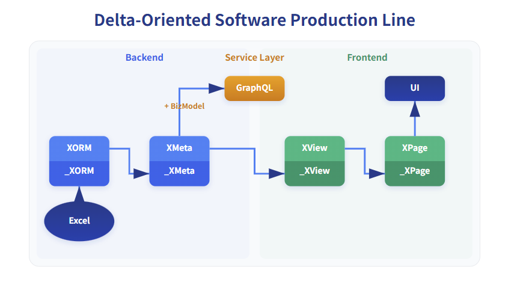

Computer science has two fundamental worldviews: the Turing machine and the lambda calculus, which point to two technical routes to achieve Turing completeness. In quantum mechanics, however, there are three pictures: the Schrödinger, Heisenberg, and Dirac pictures. Why does computer science have two basic worldviews while quantum mechanics has three pictures? Do they correspond to each other in any way?

To state the conclusion first, the basic technical routes to Turing completeness in computer science can also be viewed as three, and they correspond to the pictures of quantum mechanics as follows:

* Turing machine            <=> Schrödinger picture
* Lambda calculus          <=> Heisenberg picture
* Reversible Computation   <=> Dirac picture

Here is the detailed analysis. First, the most basic pictures in quantum mechanics are likewise two; the Dirac picture arises naturally from the first two.

1. In the Schrödinger picture, operators are fixed, and the state evolves.
2. In the Heisenberg picture, the state is fixed, and operators evolve.
3. In the Dirac (interaction) picture, neither the state nor operators are fixed; both evolve over time.

In the Dirac picture, we split the system’s Hamiltonian into a known part and a small perturbation to be studied:

$$
H = H_0 + H_1
$$

We then study how the system deviates from the known model as it evolves, i.e., we focus on the evolution described by a Delta. In the interaction picture, both the state and operators evolve with time.

$$
i\hbar \frac d {dt} |\psi_I(t)\rangle = H_1|\psi_I(t)\rangle \\
  i\hbar \frac d {dt} |A_I(t)\rangle = [A_I(t), H_0]
$$

All three pictures yield exactly the same physical measurement results:

$$
\langle \psi_S(t)|A_S|\psi_S(t)\rangle = \langle \psi_H|A_H(t)|\psi_H\rangle
 = \langle \psi_I(t)|A_I(t)|\psi_I(t)\rangle
$$

Interestingly, the interaction picture is the one physicists use most in practice. In fact, there is a dedicated branch in mathematical physics: perturbation theory, which systematically studies how a new model evolves when small perturbations are added to a known model. The overwhelming majority of valuable computations in theoretical physics are carried out within the framework of perturbation theory.

If we compare quantum mechanics with computer theory, we find an intriguing correspondence between the pictures of quantum mechanics and the worldviews of computer theory.

1. A Turing machine is a structurally fixed machine. It has a finite, enumerable set of states, can perform only a finite number of operations, yet can read and store data on an infinitely long tape. For example, the computers we use daily have their hardware capabilities fixed at manufacture, but by installing different software and feeding in different data files, they can ultimately produce arbitrarily complex target outputs automatically. Formally, the computation of a Turing machine can be written as:

$$
\text{Target output} = \text{Fixed machine} \; (\text{infinitely complex input})
$$

2. In contrast, the core concept of lambda calculus is the function. A function is a small computational machine, and the composition of functions is still a function, meaning more complex machines can be produced by recursively composing machines. The computational power of lambda calculus is equivalent to that of a Turing machine, which implies that if we are allowed to continually create more complex machines, we can obtain arbitrarily complex target outputs even from a fixed input such as the constant 0.

$$
\text{Target output} = \text{Infinitely complex machine} \; (\text{fixed input})
$$

The two basic theories in computer science can both be expressed abstractly in the form Y = F(X). Following the derivation of the Dirac picture, we recognize that in the real physical world, human cognition is always limited; all quantities must be partitioned into known and unknown parts. Therefore, we need the following decomposition:

$$
\begin{aligned}
 Y &= F(X) \\
   &= (F_0 + F_1) (X_0+X_1)\\
   &= F_0(X_0) + \Delta
\end{aligned}
$$

Reorganizing the notation, we obtain a computational pattern with a much broader scope:

$$
Y = F(X) \oplus \Delta
$$

Beyond the function evaluation F(X), there appears here a new structural operator ⊕, which denotes a composition operation between two elements and is not ordinary numeric addition. This also introduces a new concept: Delta Δ. The distinctive feature of Δ is that it necessarily contains some negative element; when F(X) is merged with Δ, the result is not necessarily an “increase” in the output and may well be a “decrease.”
In physics, the necessity of Δ and the fact that Δ contains inverse elements are self-evident, because physical modeling must account for two basic facts:

1. The world is “uncertain,” and noise is ever-present.
2. The complexity of the model must match the intrinsic complexity of the problem; it captures stable, invariant trends and regularities at the problem’s core.

For example, given the following data:


The model we can build is only a simple curve like in figure (a). The model in figure (b) attempts to exactly fit every data point, which is called overfitting in mathematics; it struggles to describe new data. In figure (c), restricting the Delta to positive values would severely constrain the model’s descriptive accuracy.

# Reversible Computation Theory

**Reversible Computation Theory proposes a new software construction formula, implementing the above computational pattern as a concrete technical route to achieve Turing completeness.**

```
   App = Delta x-extends Generator<DSL>
```

* App: The target application to be built
* DSL: Domain-Specific Language, a business logic description language tailored to a specific business domain; the textual representation of the so-called domain model
* Generator: Based on the information provided by the domain model, repeatedly applying generation rules can derive large amounts of code. Implementations include standalone code generation tools and compile-time template expansion via metaprogramming (Metaprogramming)
* Delta: The differences between the logic derived from the known model and the target application logic are identified and collected together to form an independent Delta description
* x-extends: The Delta description is combined with the model-generation part using techniques akin to Aspect-Oriented Programming (AOP), involving a series of operations such as adding, modifying, replacing, and deleting parts of the generated model

A DSL is a high-density expression of critical domain information; it directly guides the Generator to produce code, akin to Turing computation where input data drives a machine to execute built-in instructions. If we regard the Generator as symbolic substitution and generation, then its execution and composition rules are essentially a counterpart of lambda calculus. Delta merging is, in a sense, a novel operation because it requires a meticulous, pervasive capability to collect changes—being able to isolate and aggregate small quantities of the same order scattered throughout the system—so that the Delta has independent meaning and value. At the same time, the system must explicitly establish the concepts of inverse elements and inverse operations; within such a conceptual framework, a Delta as a mixture of “existence” and “non-existence” can be expressed.

**The fundamental reason a Turing machine achieves Turing completeness is that it can be regarded as a virtual machine**, capable of simulating all other automatic computing machines. If we continually raise the level of abstraction of the virtual machine, we will obtain a virtual machine that can directly “run” so-called domain-specific languages (DSLs). However, because a DSL focuses on domain-specific concepts, it cannot express all general-purpose computational logic in the most convenient way (otherwise it would be a general-purpose language). This inevitably leads to some information spillover, becoming the so-called Delta term.

The Turing machine and lambda calculus establish the conceptual foundation of the universal computer, solving in theory the feasibility of computation—why a universal machine can exist that performs mechanized actions, using finite resources to complete all computations we can conceive of. In an age where universal computers are already pervasive, the largest practical problem we face is how to compute efficiently. **Improving computational efficiency depends on discovering “shortcuts” in computation, which in turn depends on insight into the essence of the problem, and such insight is closely tied to the problem’s form of representation.** Representation transformation itself can even be a way to solve the problem, because the transformed representation may make a solution immediately apparent. Leveraging domain models and Delta descriptions, Reversible Computation provides a new, systematic mode of representation transformation, allowing us to focus our attention on the new problem to be solved.

> For more on the role of representation transformation, see [Decoupling Methods Go Far Beyond Dependency Injection](https://zhuanlan.zhihu.com/p/550923860)

Based on the fundamental formula of Reversible Computation, we can naturally obtain the following generalized software construction method:

$$
\begin{aligned}
 App &= Biz \oplus G1(DSL1) \oplus G2(DSL2) + ...\\
   & \equiv (Biz, DSL1, DSL2, ...)
\end{aligned}
$$

If we regard Generators (or Translators or Transformers) as known background knowledge and symbolically hide their existence (similar to introducing the Poisson bracket in physics), we can view App as a feature vector composed of a set of DSLs. That is, in the evolution of first-, second-, and third-generation programming languages, abstraction levels are continuously raised, yet they remain general-purpose programming languages. **By the time we reach fourth-generation programming languages, what we are likely to get is not another general-purpose programming language, but a forest of domain-specific languages (a DSL forest)**, through which we can form a new representation and understanding of original program structures.

## Nop Platform

If the construction of DSLs and the Delta-merging algorithm are standardized, programs can automatically perform the x-extends operation, thereby forming a new software framework technology. The Nop platform is a new-generation low-code platform implemented based on Reversible Computation Theory; it can be regarded as a reference implementation of the theory. As a demonstration, it has a built-in delta-ized software production pipeline:



Based on an Excel data model, the Nop platform automatically generates a full set of frontend and backend code, including backend storage entities, GraphQL services, and frontend pages. Specifically, the logical inference chain from backend to frontend can be decomposed into four main models:

1. XORM: The domain model for the storage layer

2. XMeta: The domain model for the GraphQL interface layer, which can directly generate GraphQL type definitions

3. XView: Frontend logic understood at the business level, using a small set of UI elements such as forms, tables, and buttons, independent of any frontend framework

4. XPage: A page model that uses a specific frontend framework

The entire generation process can be expressed as follows:

$$
\begin{aligned}
XORM   &= Generator\langle XExcel \rangle + \Delta XORM  \\
XMeta &= Generator\langle XORM \rangle + \Delta XMeta \\
GraphQL &= Builder\langle XMeta\rangle + BizModel\\

XView &= Generator\langle XMeta\rangle  + \Delta XView \\
XPage &=  Generator\langle XView\rangle  + \Delta XPage\\

\end{aligned}
$$

Each step in the inference relationship is optional: **we can start directly from any step, and can also completely discard all information deduced in prior steps**. For example, we can manually add an xview model without requiring specific xmeta support, or directly create a page.yaml file and write JSON code according to the AMIS component specification—the capabilities of the AMIS framework are not constrained by the inference pipeline.

In daily development, we often find that certain logical structures exhibit similarities and some form of **imprecise derivation relationship**—for example, the tight association between backend data models and frontend pages. In the simplest case, we can directly derive the corresponding CRUD page from the data model, or conversely derive the database storage structure from form field information. However, such imprecise derivation relationships are difficult to capture and leverage with existing technical means. If we forcibly stipulate certain association rules, they will apply only in highly constrained specific scenarios and may lead to incompatibility with other techniques, making it hard to reuse existing tools and hard to adapt to the dynamic evolution of requirements from simple to complex.

Based on Reversible Computation Theory, the Nop platform provides a standard technical route to achieve reuse oriented toward dynamic similarity:

1. By leveraging embedded metaprogramming and code generation, **an inference pipeline can be established between any structures A and C**

2. **Decompose the inference pipeline into multiple steps:  A => B => C**

3. **Further delta-ize the inference pipeline**: A => `_B`  => B => `_C` => C

4. **Each stage allows for caching and passthrough of extended information not needed in the current step**

The low-code platform NopPlatform designed based on Reversible Computation Theory has been open-sourced:

- gitee: [canonical-entropy/nop-entropy](https://gitee.com/canonical-entropy/nop-entropy)
- github: [entropy-cloud/nop-entropy](https://github.com/entropy-cloud/nop-entropy)
- Development example: [docs/tutorial/tutorial.md](https://gitee.com/canonical-entropy/nop-entropy/blob/master/docs/tutorial/tutorial.md)
- [Principles of Reversible Computation and Introduction & Q&A on the Nop Platform - Bilibili](https://www.bilibili.com/video/BV1u84y1w7kX/)
<!-- SOURCE_MD5:75df15654edfcb8546ab39c28d153cdc-->
