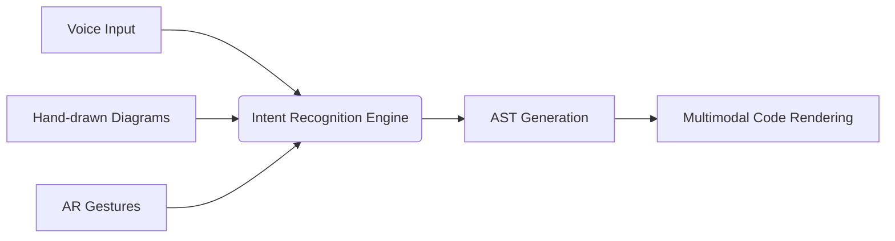

# What innovations can future programming languages bring for the AI era?

Existing programming languages have not considered the human-AI collaboration aspect in their design. The default assumption is that humans write and read/understand code. Over several decades of development, excellent designs have been borrowed among different programming languages, and it seems that all possible syntax designs have been attempted by various languages. Useful features are now widely accepted by many languages. What innovative designs can we make for the next generation of programming languages tailored for the AI era to solve previously unaddressed problems?

**Thought Process:**

The user is asking about potential innovations in next-generation programming languages suited for the AI era, particularly focusing on the aspect that existing languages have not considered human-AI collaboration during their design. This question is quite broad and requires breaking it down into more manageable parts.

First, understand the user's background. They might be a developer, researcher, or someone with a keen interest in programming language design. The user likely wants insights into future trends or potential research directions for AI-oriented programming languages.

The user specifically mentions that existing languages have borrowed many excellent designs from each other, implying that there are still unexplored domains to innovate upon, especially in the context of human-AI collaboration. This suggests a focus on areas where current language designs fall short when working with AI.

The phrase "人与AI协同" (human-AI collaboration) indicates that the user is interested in how programming languages can better support AI as an assistant or even a co-developer. Current languages may lack features that facilitate this kind of collaboration, such as syntax that is easy for AI to interpret, generate, or optimize.

---

### **Innovations in Next-Generation Programming Languages for the AI Era**

To design programming languages tailored for the AI era, we can explore the following innovative directions and their potential benefits:

---

#### **1. Bidirectional Programming (Bidirectionalism)**

- **Innovation**: Dynamic mapping between code and Abstract Syntax Trees (AST)
  - Allow direct manipulation of syntax trees at the AST level (e.g., by AI for generation or modification), while maintaining human-readable code
  - Embed versioned AST structures to enable cause tracing during code modifications
- **Problem Solved**: Addresses the challenge of debugging and iterating on AI-generated code, bridging the semantic gap between humans and AI in collaboration

---

#### **2. Intent-Oriented Programming (Intent-Oriented Design)**

- **Innovation**:
  - Explicit separation of **program intent** (What) from **implementation details** (How)
  - Embed natural language comments and machine-readable intent markers, such as `@optimize_for_latency`
  
- **Example**:
  ```plaintext
  #intent: Implement a sorting algorithm with a focus on memory efficiency
  #constraint: Input size may reach up to 10^6 levels
  [AI-generated or recommended implementation code]
  ```
  
- **Problem Solved**: Enables AI to better understand the user's intent, reducing errors where code is syntactically correct but not aligned with the intended functionality

---

#### **3. Adaptive Syntax (Adaptive Syntax)**

- **Innovation**:
  - Allow dynamic adjustment of syntax rules based on context
  - Support multi-modal syntax expressions (e.g., embedding mathematical formulas directly)
  
- **Example**:
  ```plaintext
  #context: Financial report generation
  $收入 = $客户数 * $转化率 + $广告支出;
  $利润 = $收入 - $成本;
  ```
  
- **Problem Solved**: Facilitates more natural interaction with AI by allowing context-aware syntax that is easier for AI to interpret and manipulate

---

#### **4. Reverse Engineering of Source Code (Reverse Programming)**

- **Innovation**:
  - Enable direct translation from high-level specifications to executable code, without writing source code manually
  - Automate the generation of complete systems based on user requirements
  
- **Example**:
  ```plaintext
  #reverse: Create a dashboard application that visualizes company performance metrics in real-time
  [AI-generates and compiles all necessary code]
  ```
  
- **Problem Solved**: Eliminates the need for manual coding and reduces the learning curve for complex systems

---

#### **5. Probabilistic Testing (Probabilistic Validation)**

- **Innovation**:
  - Integrate probabilistic testing into the language to automatically validate generated or modified code
  - Use machine learning models to predict potential error points in real-time
  
- **Example**:
  ```plaintext
  #prob-test: Validate that all edge cases are covered in the newly added feature
  ```
  
- **Problem Solved**: Automates testing processes, reducing manual effort and improving reliability

---

#### **6. Ethical Constraints Built-In (Ethical AI Programming)**

- **Innovation**:
  - Embed ethical guidelines and compliance rules directly into the language
  - Use AI to automatically enforce these constraints during code generation
  
- **Example**:
  ```plaintext
  #ethics: Ensure that no data is collected without explicit user consent
  ```
  
- **Problem Solved**: Ensures that generated code adheres to ethical standards, minimizing risks associated with AI-driven development

---

#### **7. Interactive Code Generation with Real-Time Feedback (Interactive AI Coding)**

- **Innovation**:
  - Provide an interactive environment where users can directly influence AI's coding process
  - Offer real-time feedback on the code's performance and correctness
  
- **Example**:
  ```plaintext
  #ai-assist: Optimize this loop by suggesting more efficient data structures
  ```
  
- **Problem Solved**: Enhances collaboration between humans and AI, making the coding process more efficient and enjoyable

---

#### **8. Multimodal Code Representation (Multimodal Programming)**

- **Innovation**:
  - Combine text, audio, and visual elements into a unified code representation
  - Enable mixed-mode programming where natural language and code can be interleaved
  
- **Example**：
  ```plaintext
  #multimodal: Create an AI chatbot that responds to user queries in both natural language and code format
  ```
  
- **Problem Solved**: Facilitates more intuitive coding experiences, especially for non-experts

---

### Summary of Innovation Directions

The innovations outlined above aim to address the limitations of current programming languages when working with AI. By focusing on human-AI collaboration, intent-driven design, adaptive syntax, and ethical constraints, next-generation languages can significantly improve code generation, debugging, and overall efficiency.

For instance, GitHub Copilot already demonstrates some of these capabilities but may not fully integrate all the proposed features. Future research could explore how to combine probabilistic testing with reverse programming or integrate multimodal representations into intent-oriented designs.

Ultimately, these innovations have the potential to bridge the gap between human developers and AI systems, fostering more efficient and ethical code development in the AI era.

```python
  # Traditional approach
  matrix_multiply(A, B)
  
  # Dynamic syntax
  C = A ⨯ B  # Symbol directly mapped to underlying implementation
```

- **Problem**: Break free from fixed syntax constraints and enhance AI-generated code's readability and efficiency

---

### Four., **Probabilistic Primitives**

- **Innovation**:
  
  - Native support for probability distribution types (e.g., `Gaussian(μ=0, σ=1)`)
  - Built-in Bayesian inference engine

- **Application Scene**:
  
  ```python
  sensor_data ~ Normal(mean=ground_truth, sd=0.1)  # Automatically generate probability models
```

- **Problem**: Simplify the implementation of machine learning models, enabling AI to directly operate on probabilistic semantics

---

### Five., **Enhanced Self-awareness and Explainability**

- **Innovation**:
  
  1. Generate explanation trajectories during code execution (`Explanation Trace`)
  2. Mark decision chains with causal labels using the `becauseof` keyword

- **Example**:
  
  ```python
  if x > threshold:  # @becauseof(input_statistics.summary())
      trigger_alert()
```

- **Problem**: Address the "black box" issue in AI-generated code, enhancing debugging and auditing capabilities

---

### Six., **Collaboration Protocol**

- **Innovation**:
  - Responsibility tags at the code block level (`@human_responsibility`/`@AI_suggestion`)
  - Delta-structured Code for change suggestions
- **Value**: Clarify human-AI collaboration boundaries, reducing the risk of code ownership disputes

---

### Seven., **Embedded Ethical Constraints**

- **Innovation**:
  
  - Extended type system supporting ethical attributes (e.g., `PersonalData @encrypted`)
  - Compliance verification as a precondition for resource access

- **Example**:
  
  ```python
  def process(data: UserProfile @GDPR_Compliant) ->
    @Fairness(metric=demographic_parity):
    # Code logic
```

- **Problem**: Ensure AI-generated code complies with ethical standards at the language level

---

### Eight., **Real-time Feedback Programming**

- **Innovation**:
  - Deep integration between execution and development environments
  - Runtime-based instant optimization suggestions (e.g., "Suggest replacing O(n^2) algorithm with O(n log n)")
- **Technical Support**: Bi-directional communication channel via JIT compilers

---

### Breakthrough Value:

1. **Reduce cognitive load**: Developers focus more on domain issues than implementation details
2. **Enhance collaboration efficiency**: Human-AI complementary code generation, review, and optimization loop
3. **Improve system reliability**: Minimize errors through formalized intent and constraints
4. **Accelerate knowledge transfer**: AI-understandable design intentions promote code reuse

---

### Implementation Challenges:

- **Formalized semantics extension**: Requires new mathematical tools to describe dynamic syntax and intent
- **Reconstruction of development toolchains**: Compilers need to integrate AI inference engines
- **Shift in human-AI interaction paradigm**: From "exact instructions" to "intent negotiation"

The future programming language may no longer be limited to text editing. Instead, it could evolve toward **intentional visual editing**, **multi-modal interaction**, and **evolving living documents**. True innovation will come from redefining the fundamental essence of "programs as human-AI collaboration intermediaries."

Under the AI-human deep collaboration programming paradigm, future language innovations may further break free from traditional boundaries. Below are more cutting-edge exploration directions along with their technical implementation possibilities:

---

### Nine., **Neuro-Symbolic Programming**

- **Innovation**:
  
  - **Hybrid execution engine**: Supports symbolic logical reasoning (like Prolog-style rules) and neural network computation graphs simultaneously
  - **Gradient flow control**: Allows definition of differentiable constraints at the symbolic logic layer

- **Example**:


```python
# Symbolic layer defines business rules
@constraint ∀x (age(x) > 18 → can_apply_loan(x))

# Neural layer processes unstructured data
risk_score = NeuralModel(application_data).forward()

# Hybrid decision-making
final_decision = symbolic_constraints.resolve() * risk_score
```

- **Breakthrough Value**: Resolves the fundamental contradiction between neural methods lacking interpretability and symbolic methods struggling with uncertainty

---

### Ten. **Causal Primitives (Causal Reasoning Units)**

- **Innovation Points**:
  
  - Built-in Causal Graph data structure
  - `intervene` keyword supports virtual intervention experiments
  - Automatic counterfactual reasoning

- **Application Scenarios**:
  
  ```python
  graph = CausalGraph.from_data(df, edges=[
    ("Ad spend", "Sales"), 
    ("Season", "Inventory")
  ])

  # Simulating the effect of increasing ad budget by 20%
  with graph.intervene("Ad spend", value=current_value * 1.2):
    predicted_sales = simulate()  # Automatically performs do-calculus
  ```

- **Technical Support**: Integrates Structural Causal Models (SCM) and Potential Outcomes frameworks

---

### Eleven. **Semantic Versioning 2.0**

- **Innovative Design**:
  
  - **Three-dimensional version identifiers**: `Semantic Version@Timestamp#Knowledge Version`
    - Example: `2.3.1@2025-Q3#GPT-5-v3` indicates an implementation generated by GPT-5 (third generation)
  - **Knowledge graph anchoring**: Automatically links code changes to domain knowledge nodes

- **Problem Solving**: Tracks the "knowledge lineage" of AI-generated code, addressing issues caused by model iterations and code degradation

---

### Twelve. **Context-Aware Programming**

- **Core Innovations**:
  
  - Runtime environment metadata automatically injected (e.g., hardware configuration, data features, user permissions)
  - Adaptive code generation: The same logic is compiled into different implementations based on the environment

- **Case Study**:
  
  ```python
  # General-purpose code
  def process(data):
    clean_data = data.clean()
  
  # Automatically inserted when compiling for edge devices:
  clean_data = lightweight_clean(data)  # Generates ARM-optimized version
  
  # Automatically inserted when compiling for cloud environments:
  clean_data = spark_clean(data)        # Generates distributed version
  ```

- **Technical Implementation**: Based on LLMs' context-aware compiler

---

### Thirteen. **Multi-Agent Negotiation Syntax**

- **Innovative Mechanisms**:
  
  - Code-block level `@proposal` and `@consensus` annotations
  - Distributed consensus algorithms natively integrated into language runtime

- **Collaborative Examples**:
  
  ```python
  @proposal(agent="AI_Optimizer")
  def algorithm_v1():  # Initial AI proposal
    return bubble_sort(arr)
  
  @proposal(agent="Human")
  def algorithm_v2():  # Developer modification
    return quick_sort(arr)
  
  @consensus(strategy="latency_priority")  # Runtime automatically selects the optimal implementation
  def final_algorithm():
    ...
  ```

- **Breakthrough Significance**: Enables collaborative decision-making between humans, AI, and groups of AI, rather than one-sided code generation

---

### Fourteen. **Cognitive Load Optimization System**

- **Innovative Design**:
  
  - **Attention Heatmap**: The compiler automatically marks regions of complex code
  - **Gradual Disclosure**: Dynamically displays code details based on developer's cognitive level

- **Interactive Example**:

```python
# Novice Developer View
def main():
    [Data Preprocessing] -> [Model Training] -> [Result Output]

# Expert Mode (Ctrl+Expand)
def main():
    df = load_data("input.csv")
    cleaned = remove_outliers(df, method='IQR')
    model = XGBoost(params).fit(cleaned)
    save_model(model, "v1.pkl")
```

- **Technical Support**: Real-time eye tracking and cognitive state modeling

---

### Fifteen, **Quantum-Classical Hybrid Programming Model**

- **Frontier Integration**:
  
  - **Unified Resource Management System**: Automatically allocate computation tasks to classical/quantum compute units
  - **Noise-Adaptive Compilation**: Dynamically optimize circuits based on quantum hardware characteristics

- **Syntax Examples**:
  
  ```python
  @quantum_section(backend="IBMQ_16")  # Declare a quantum computing block
  def quantum_routine():
      q = QuantumRegister(3)
      c = ClassicalRegister(3)
      circuit = QuantumCircuit(q, c)
      circuit.h(q[0])
      ...
      return circuit
  
  # Seamless invocation in classical code
  result = hybrid_execute(quantum_routine(), shots=1000)
  ```

- **Core Value**: Provide a smooth transition scheme for the post-quantum computing era

---

### Sixteen, **Self-Evolving API (Self-Evolving API)**

- **Breakthrough Features**:
  - **Dynamic Interface Adaptation**: Automatically generate or deprecated API methods based on usage patterns
  - **Semantic Version Drift Protection**: API changes are automatically maintained for backward compatibility
- **Case Workflow**:
  1. Developer calls `api.fetch_data()`
  2. The system monitors that 90% of users actually need pagination functionality
  3. Automatically upgrade the API to `fetch_data(page_size=50, page=1)`
  4. Legacy calling ways remain compatible via a virtual interface

---

### Seventeen, **Multimodal Programming Interface (Multimodal Interface)**

- **Fusion Innovation**:
  - **Voice-to-Code Dual Conversion**: Describe "Create a table containing name and age" to generate code automatically
  - **UI Design Recognition**: Draw UI designs to immediately generate front-end framework code
  - **AR Programming Assistance**: Use devices like Hololens for three-dimensional visualization of data flows
- **Technology Stack Integration**:



---

### Deep Technical Challenges:

1. **Uncertainty Management**: How to handle the randomness output of AI-generated code
2. **Responsibility Tracing**: Mechanism for assigning blame when collaborative human-machine code fails
3. **Cognitive Alignment**: Ensure developers' and AI's understanding of code semantics is consistent
4. **Continuous Learning System**: How language itself adapts to rapidly evolving AI models

---

### Future Morphology:

- **Living Documentation (Living Documentation)**: Code comments automatically stay synchronized with implementation
- **Ecosystem Perception System**: Automatically suggests library migrations based on technology trends (e.g., "TensorFlow usage detected decreasing, suggest switching to PyTorch")
- **Cognitive Mirror (Cognitive Mirror)**: Reverse-engineer developers' thought patterns through code style and provide personalized assistance

This language will no longer be a simple tool but evolve into an **human-machine cognitive collective** operating system. Its ultimate goal is not to replace human programming but to achieve "language as interface" innovation, reaching the level described in Clark's Third Law: "Any sufficiently advanced programming technology becomes indistinguishable from magic."

The next-generation programming language for the AI era may break through in the following directions and redefine the programming paradigm of human-machine collaboration:

#### One, Multimodal Syntax Architecture

1. **Natural Language-Code Hybrid Syntax** (NL-Code Hybrid)
   Develop syntax structures that support seamless embedding of natural language segments with precise code.


```python
# Abstract Syntax Example
def process_data:
    "Read and parse user-uploaded CSV files, clean phone number formats, remove duplicates"
    with AI.auto_implementation(context=locals()) as code:
        return code
```

Key Innovation Points:
- Allow generation of executable code while preserving natural language intent
- Enable AI to automatically fill in implementation details

2. **Dynamic Syntax Tree**
Introduce runtime variability in syntax rules, allowing AI to dynamically adjust the structure based on context. For example:

```julia
@dynamic_syntax begin
    "Create a neural network: input layer 28x28, two hidden layers (128,64), output for 10 classification"
    model = Sequential(
        Flatten(28,28),
        Dense(128, activation=:relu),
        Dropout(0.2),
        Dense(64, activation=:relu),
        Dense(10, activation=:softmax)
    )
end
```

AI can automatically complete layer types, activation functions, etc., while maintaining code readability.

#### Two, Intent-Driven Programming System

1. **Target Decomposition Algebra**
Develop a formalized target decomposition system based on categorical mathematics:

```haskell
project :: Goal -> [Subgoal]
project "Build a commercial recommendation system" = 
    [DataIngestion, FeatureEngineering, ModelTraining, ServingAPI]
    ⊗ ScalabilityConstraints
    ⊗ PrivacyRequirements
```

AI validates the completeness of target decomposition through type systems.

2. **Runtime Intent Verification**
Integrate intent verification mechanisms at the language level:

```rust
#[intent("Ensure user age is above 18")]
fn validate_age(age: i32) -> bool {
    age >= 18
}
```

The compiler generates automatic test cases for negative examples, and AI continuously verifies whether the implementation violates the original intent.

#### Three, Primitive Computational Primitives

1. **Bidirectional Code Transformation**
Incorporate a causal tracking system for code modifications:

```clojure
(defn calculate-tax [income]
    (← history "2023-07: Tax rate increased from 5% to 7%")
    (* income 0.07))
```

AI can trace back through modification history to understand the decision-making background of each change.

2. **Probabilistic Code Structure**

```python
with uncertainty(0.8):
    def recommend(user):
        if user.history.length > 10:
            return collaborative_filter()
        else:
            return popular_items()
```

AI dynamically adjusts the code execution path at runtime based on context.

#### Four, Cognitive-Enhanced Type System

1. **Semantic Type Inference**

```typescript
type Temperature = Number<"℃", {min: -273.15, max: 10000}>
                | Number<"℉", {min: -459.67, max: 1832}>
                | String<"cold" | "hot">;
```

AI automatically handles unit conversions and semantic boundary checks.

2. **Type Flow Analysis**

```scala
def process(data: DataFrame[Schema]) =>
    data.filter(_.age > 18)
        .map(_.name) : Stream[List[String@Length(1..50)]]
```

AI tracks type changes in data flows in real-time to prevent runtime errors.

#### Five, Self-Evolving Code Ecosystem

1. **Code DNA System**

```ruby
class User
  include Versioning::Gene(
    mutations: [:encryption, :validation],
    constraints: :GDPR
  )

  attr :email, DNA: { format: /.+@.+/ }
end

AI automatically applies compliance "gene mutations" based on environmental changes.

2. **Knowledge Graph Integration**

```sparql
INSERT {
  :UserProfile a owl:Class;
    rdfs:subClassOf :PrivacySensitiveData;
    dc:compliance :GDPR-Article30.
}
WHERE {
  SERVICE <AI_advisor> {
    ?newClass should_implement data_protection_standard()
  }
}
```

Code changes automatically update associated knowledge graphs.

#### Six, Collaborative Infrastructure Foundation

1. **Cognitive Attention Markers**

```csharp
[Attention(priority: Critical,
             stakeholders: [SecurityTeam, Legal],
             explanation: "Cross-border data transmission compliance check")]
void TransferData(DataSet data, Country destination) {
    // AI prioritizes checking this region's code
}
```

2. **Decision Traceback Syntax**

```elixir
defmodule Pricing do
  @decision_tree """
  IF market == :europe THEN
      apply VAT
  ELSE 
      check_tax_treaty()
  END
  """
  |> AI.audit_trail("2023-Q3 Tax Strategy")
end
```

These innovations address the following core challenges:

1. **Intentional Distortion**: Reducing the semantic gap between requirements and code implementation
2. **Knowledge Decay**: Maintaining consistency between business rules and technical implementations
3. **Collaborative Friction**: Optimizing knowledge transfer efficiency within human-AI teams
4. **System Evolution**: Supporting continuous safe architectural adaptation
5. **Cognitive Load**: Elevating programmers from mechanical coding to supervisory programming

Future programming languages may evolve into "executable domain knowledge graphs," where code, documentation, tests, and architectural decisions are connected via formalized semantics, forming a digital twin system that supports continuous evolution. AI not only acts as a programming assistant but also becomes a co-maintainer of the code lifecycle, while human developers focus on value judgment and creative decision-making.
