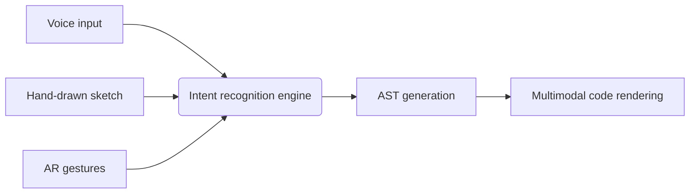

# What language innovations could the next-generation programming languages in the AI era still achieve?

Existing programming languages have not taken human–AI collaboration into account; their design assumes humans write and read/understand the code. After decades of evolution, excellent designs have been borrowed across languages, and it seems all possible syntax designs have been tried by various languages, with useful features widely adopted. To develop next-generation programming languages for the AI era, what innovations can we still design that have not been attempted before? What problems can these designs better solve?

**Thought process**:

Hmm, the user is asking what innovations next-generation programming languages in the AI era might bring, especially considering that current languages were not designed for human–AI collaboration. This is a big question that requires breaking down the user's needs. First, the user may already understand the evolution of programming languages and know they are primarily for humans to write and read; now, with AI as a collaborator or even part of development, we need new design thinking. So the user wants to know what innovations future languages might have and what problems these innovations can solve.

Next, I need to consider the user's background. They might be developers, researchers, or people interested in programming language design. They may want to understand future trends or be seeking research directions. The user mentions that current languages have borrowed many good designs, so we need to identify areas not yet explored, especially in AI collaboration.

The question mentions "human–AI collaboration," which means new languages might need to make it easier for AI to understand, generate, or optimize code. Current languages may be lacking here, such as complex syntax, insufficient structure, or lack of metadata for AI to understand intent. Therefore, innovations might include more natural syntax, bidirectional reversibility, separation of intent and implementation, dynamic syntax trees, etc.

I also need to consider shortcomings in current languages. For example, code is primarily textual, and AI may need to parse it into ASTs; if the language natively supports dynamic syntax trees, this could improve AI efficiency. Also, code intent and implementation are often mixed, making it hard for AI to understand the program's purpose; separating them could make it easier for AI to generate or optimize code.

The user notes that current languages assume humans will write and read, so the new language might need structures that are more suitable for AI generation and manipulation, such as combining declarative styles with automatic optimization, or supporting real-time collaborative programming. Additionally, explainability and ethical constraints may be innovation points—for example, embedding ethical rules at the language level so AI-generated code automatically conforms to certain norms.

We should also consider innovations in interaction, such as natural language and code mixed programming, or multimodal environments combining text, voice, charts, etc. This could make development more efficient, especially for non-professional developers.

Furthermore, in testing and debugging, AI may need more automated tools, such as probabilistic testing or real-time error prediction. These can be integrated into the language design rather than as external tools.

Finally, we must ensure these innovations solve practical problems, such as improving efficiency, reducing maintenance costs, enhancing maintainability and security, and fostering human–machine collaboration. It may be helpful to provide concrete examples, such as the limitations of GitHub Copilot in current languages and how a new language could address them.

In summary, we need to explore potential innovations from syntax, structure, metadata, interaction, debugging/testing, ethical constraints, etc., and explain how these designs address new challenges in the AI era. At the same time, we should cover areas the user may care about, such as aspects not covered by current languages and the practical benefits of these innovations.

**Specific answer**:

Designing next-generation programming languages for the AI era requires breaking the traditional human-centered, one-way programming paradigm. Below are potential innovation directions and their corresponding value:

---

### I. Bidirectional Programming

- Innovation:
  - Dynamic bidirectional mapping between code and Abstract Syntax Tree (AST)
    - Allow developers (or AI) to directly operate at the AST level while retaining human-readable code form
    - Built-in versioned AST structures to support causal traceability of code modifications
- Problem solved: Address the pain points of AI-generated code being hard to understand, debug, and iterate; bridge the semantic gap in human–AI collaboration

---

### II. Intent-Oriented Programming

- Innovations:
  1. Explicit separation of program intent (What) and implementation details (How)
  2. Built-in natural-language annotation layer and machine-parsable intent tags (e.g., `@optimize_for_latency`)

- Example:

  ```plaintext
  #intent: Implement a quicksort algorithm, prioritize memory efficiency
  #constraint: Input size may reach the 10^6 scale
  [AI-generated or recommended implementation code]
  ```

- Problem solved: Enables AI to more precisely understand requirements, reducing "code is correct but not aligned with intent" errors

---

### III. Adaptive Syntax

- Innovations:
  - Allow dynamic adjustment of syntax rules based on context
  - Support multimodal syntactic expressions (e.g., embedded mathematical formulas)

- Example:

  ```python
  # Traditional
  matrix_multiply(A, B)
  
  # Adaptive syntax
  C = A ⨯ B  # symbol directly maps to underlying implementation
  ```

- Problem solved: Breaks the limitations of fixed syntax, improving readability and expressive efficiency of AI-generated code

---

### IV. Probabilistic Primitives

- Innovations:
  - Native support for probability distribution types (e.g., `Gaussian(μ=0, σ=1)`)
  - Built-in Bayesian inference engine

- Use case:

  ```python
  sensor_data ~ Normal(mean=ground_truth, sd=0.1)  # automatically constructs the probabilistic model
  ```

- Problem solved: Simplifies the implementation of machine learning models, enabling AI to operate directly on probabilistic semantics

---

### V. Enhanced Self-Introspection and Explainability

- Innovations:
  1. Automatic generation of explanation traces during code execution
  2. Causal markers in decision chains (the `becauseof` keyword)

- Example:

  ```python
  if x > threshold:  # @becauseof(input_statistics.summary())
      trigger_alert()
  ```

- Problem solved: Addresses the "black box" problem of AI-generated code, enhancing debugging and auditing capabilities

---

### VI. Collaboration Protocol

- Innovations:
  - Human–machine responsibility annotations at the code-block granularity (`@human_responsibility`/`@AI_suggestion`)
  - Delta-structured Code for expressing change proposals
- Value: Clarifies the boundaries of human–AI collaboration, reducing risk of ownership disputes over code

---

### VII. Ethical Constraints as First-Class Citizens

- Innovations:
  - Extend the type system to support ethical attributes (e.g., `PersonalData @encrypted`)
  - Front-load compliance validation for resource access

- Example:

  ```python
  def process(data: UserProfile @GDPR_Compliant) -> 
    @Fairness(metric=demographic_parity):
    # code logic
  ```

- Problem solved: Ensures AI-generated code complies with ethical standards at the language level

---

### VIII. Realtime Feedback Loop Programming

- Innovations:
  - Deep integration between the execution environment and development environment
  - Runtime-based instant optimization suggestions (e.g., auto-prompt "Consider replacing O(n^2) with O(n log n)")

- Technical support: Bidirectional communication channel with the JIT compiler

---

### Breakthrough value:

1. Reduce cognitive load: Developers focus more on problem domains rather than implementation details
2. Improve collaboration efficiency: Human–machine complementary generation/review/optimization loop
3. Enhance system reliability: Reduce errors via formal intent and constraints
4. Accelerate knowledge transfer: Design intents understandable by AI promote code reuse

---

### Implementation challenges:

- Extension of formal semantics: New mathematical tools are needed to describe adaptive syntax and intent
- Toolchain refactoring: Compilers must integrate AI inference engines
- Paradigm shift in human–machine interaction: Moving from "precise instruction" to "intent negotiation"

Future programming may move beyond text editing toward intent visualization editors, multimodal interactions, and continuously evolving living documents. True innovation will come from redefining "programs as media for human–machine collaboration."

Under a programming paradigm of deep collaboration between AI and humans, future language innovations may further break traditional boundaries. Below are more cutting-edge exploration directions and their technical feasibility:

---

### IX. Neuro-Symbolic Programming

- Innovations:
  - Hybrid execution engine: Support both symbolic logical reasoning (e.g., Prolog-style rules) and neural network computation graphs
  - Gradient flow control: Allow differentiable constraints at the symbolic logic layer

- Example:

  ```python
  # Symbolic layer business rules
  @constraint ∀x (age(x)>18 → can_apply_loan(x))
  
  # Neural layer for unstructured data
  risk_score = NeuralModel(application_data).forward()
  
  # Hybrid decision
  final_decision = symbolic_constraints.resolve() * risk_score
  ```

- Breakthrough value: Resolve the fundamental tension between the lack of explainability in purely neural methods and the difficulty of handling uncertainty in purely symbolic methods

---

### X. Causal Primitives

- Innovations:
  - Built-in Causal Graph data structures
  - `intervene` keyword supporting virtual intervention experiments
  - Automatic counterfactual reasoning

- Use case:

  ```python
  graph = CausalGraph.from_data(df, edges=[
    ("Ad Spend", "Sales"), 
    ("Season", "Inventory")
  ])
  
  # Simulate the effect of increasing ad budget by 20%
  with graph.intervene("Ad Spend", value=current_value*1.2):
    predicted_sales = simulate()  # do-calculus performed automatically
  ```

- Technical support: Integrate Structural Causal Models (SCM) and the potential outcomes framework

---

### XI. Semantic Versioning 2.0

- Innovative design:
  - Three-dimensional version identifier: semantic_version@timestamp#knowledge_version
    - `2.3.1@2025-Q3#GPT-5-v3` indicates version 2.3.1 generated by GPT-5 generation 3
  - Knowledge graph anchoring: Code changes automatically link to domain knowledge base nodes

- Problem solved: Track the "knowledge lineage" of AI-generated code and address code degradation due to model iterations

---

### XII. Context-Aware Programming

- Core innovations:
  - Automatic injection of runtime environment metadata (e.g., hardware config, data characteristics, user permissions)
  - Adaptive code generation: The same logic compiles to different implementations in different environments

- Example:

  ```python
  # General code
  def process(data):
    clean_data = data.clean()
  
  # Automatically inserted at edge-device compile time:
  clean_data = lightweight_clean(data)  # generate an ARM-optimized version
  
  # Automatically inserted at cloud compile time:
  clean_data = spark_clean(data)        # generate a distributed version
  ```

- Technical implementation: Context-Aware Compiler based on LLMs

---

### XIII. Multi-Agent Negotiation Syntax

- Innovative mechanisms:
  - Code-block-level `@proposal` and `@consensus` annotations
  - Distributed consensus algorithms built into the language runtime

- Collaboration example:

  ```python
  @proposal(agent="AI_Optimizer")
  def algorithm_v1():  # initial AI suggestion
    return bubble_sort(arr)
  
  @proposal(agent="Human")
  def algorithm_v2():  # developer modification
    return quick_sort(arr)
  
  @consensus(strategy="latency_priority")  # runtime automatically chooses the optimal implementation
  def final_algorithm():
    ...
  ```

- Breakthrough significance: Enables collaborative decision-making among human–AI–AI groups rather than one-way code generation

---

### XIV. Cognitive Load Optimization System

- Innovative design:
  - Attention heatmap: Compiler automatically marks regions of high code complexity
  - Progressive disclosure: Dynamically reveal code details according to the developer's cognitive level

- Interaction example:

  ```python
  # Novice developer view
  def main():
    [Data preprocessing] -> [Model training] -> [Output results]
  
  # Expert mode (Ctrl+expand)
  def main():
    df = load_data("input.csv")
    cleaned = remove_outliers(df, method='IQR')
    model = XGBoost(params).fit(cleaned)
    save_model(model, "v1.pkl")
  ```

- Technical support: Real-time eye-tracking and cognitive state modeling

---

### XV. Quantum–Classical Hybrid Programming Model

- Frontier integration:
  - Unified resource management system: Automatically dispatch computation to classical/quantum units
  - Noise-adaptive compilation: Dynamically optimize circuits according to quantum hardware characteristics

- Syntax example:

  ```python
  @quantum_section(backend="IBMQ_16")  # declare a quantum computation block
  def quantum_routine():
    q = QuantumRegister(3)
    c = ClassicalRegister(3)
    circuit = QuantumCircuit(q, c)
    circuit.h(q[0])
    ...
    return circuit
  
  # Seamless invocation from classical code
  result = hybrid_execute(quantum_routine(), shots=1000)
  ```

- Core value: Provide a smooth transition strategy for the post-quantum computing era

---

### XVI. Self-Evolving API

- Breakthrough features:
  - Dynamic interface adaptation: Automatically generate/deprecate API methods based on usage patterns
  - Semantic version drift protection: API changes automatically maintain backward compatibility

- Example workflow:
  1. Developer calls `api.fetch_data()`
  2. System detects that 90% of users actually need pagination
  3. Automatically upgrades the API to `fetch_data(page_size=50, page=1)`
  4. The old call style remains compatible via a virtual interface

---

### XVII. Multimodal Interface

- Integrated innovations:
  - Voice–code bidirectional conversion: Saying "Create a table with name and age" auto-generates code
  - Sketch recognition: Drawing a UI sketch instantly generates frontend framework code
  - AR programming assistance: Visualize data flows in 3D via devices like HoloLens

- Tech stack integration:



---

### Deep technical challenges:

1. Uncertainty management: How to handle stochastic outputs of AI-generated code
2. Responsibility traceability: Attribution mechanisms when human–AI code collaboration fails
3. Mental-model alignment: Ensure developers and AI share consistent understanding of code semantics
4. Continual learning systems: How the language itself adapts to rapidly evolving AI models

---

### Future outlook:

- Living Documentation: Annotations in code automatically stay synchronized with implementations
- Ecosystem-aware systems: Automatically suggest dependency migration based on trends (e.g., "Detected decline in TensorFlow usage; consider moving to PyTorch")
- Cognitive Mirror: Infer developer thinking patterns from code style to provide personalized assistance

Such a language will no longer be merely a tool, but will evolve into the operating system of a human–AI cognitive community. The ultimate goal is not to replace human programming, but to achieve the realm described by Clarke’s Third Law through innovation in "language as interface": "Any sufficiently advanced programming technology is indistinguishable from magic."

Next-generation programming languages for the AI era are likely to deliver breakthrough innovations in the following directions, reshaping the human–machine collaborative programming paradigm:

#### I. Multimodal Syntax Architecture

1. NL–Code Hybrid
   Support syntax structures where natural language fragments and precise code are seamlessly interwoven, for example:
   
   ```python
   # Fuzzy syntax example
   def process_data:
       "Read user-uploaded CSV file, normalize phone number format, remove duplicates"
       with AI.auto_implement(context=locals()) as code:
           return code
   ```
   
   The key innovation is allowing natural-language intent to be preserved while generating executable code, with AI auto-filling implementation details.

2. Dynamically Tunable Syntax Tree
   Introduce runtime variability of syntax rules, allowing AI to adjust syntax structure based on context. For example:
   
   ```julia
   @dynamic_syntax begin
       "Create a neural network: input layer 28x28, two hidden layers (128, 64), output 10 classes"
       model = Sequential(
           Flatten(28,28),
           Dense(128, activation=:relu),
           Dropout(0.2),
           Dense(64, activation=:relu),
           Dense(10, activation=:softmax)
       )
   end
   ```
   
   AI can automatically complete layer types, activation functions, and other details while preserving code readability.

#### II. Intent-Oriented Programming System

1. Goal Decomposition Algebra
   Develop a formal goal decomposition system based on category theory:
   
   ```haskell
   project :: Goal -> [Subgoal]
   project "Build an e-commerce recommendation system" = 
       [DataIngestion, FeatureEngineering, ModelTraining, ServingAPI]
       ⊗ ScalabilityConstraints
       ⊗ PrivacyRequirements
   ```
   
   AI uses the type system to automatically verify the completeness of goal decomposition.

2. Runtime Intent Verification
   Integrate intent verification at the language level:
   
   ```rust
   #[intent("Ensure user age is at least 18")]
   fn validate_age(age: i32) -> bool {
       age >= 18
   }
   ```
   
   The compiler automatically generates counterexample tests, and AI continuously verifies whether the implementation violates the original intent.

#### III. Reversible Computation Primitives

1. Bidirectional Code Transformation
   Built-in causal tracking system for code modifications:
   
   ```clojure
   (defn calculate-tax [income]
     (←history "2023-07: Tax rate adjusted from 5% to 7%")
     (* income 0.07))
   ```
   
   AI can trace modifications along history to understand the decision context of each change.

2. Probabilistic Code Structure
   
   ```python
   with uncertainty(0.8):
       def recommend(user):
           if user.history.length > 10:
               return collaborative_filter()
           else:
               return popular_items()
   ```
   
   At runtime, AI dynamically adjusts the execution path based on context.

#### IV. Cognition-Augmented Type System

1. Semantic Type Inference
   
   ```typescript
   type Temperature = Number<"℃", {min: -273.15, max: 10000}>
                | Number<"℉", {min: -459.67, max: 1832}>
                | String<"cold" | "hot">;
   ```
   
   AI automatically handles unit conversion and semantic boundary checks.

2. Type Flow Analysis
   
   ```scala
   def process(data: DataFrame[Schema]) =>
     data.filter(_.age > 18)
        .map(_.name) : Stream[List[String@Length(1..50)]]
   ```
   
   AI tracks type changes across data flows in real time, preventing runtime errors.

#### V. Self-Evolving Code Ecosystem

1. Code DNA System
   
   ```ruby
   class User
     include Versioning::Gene(
       mutations: [:encryption, :validation],
       constraints: :GDPR
     )
   
     attr :email, DNA: { format: /.+@.+/ }
   end
   ```
   
   AI automatically applies compliance "genetic mutations" based on environmental changes.

2. Knowledge Graph Integration
   
   ```sparql
   INSERT { 
     :UserProfile a owl:Class;
       rdfs:subClassOf :PrivacySensitiveData;
       dc:compliance :GDPR-Article30.
   }
   WHERE { 
     SERVICE <AI_advisor> {
       ?newClass should_implement data_protection_standard()
     }
   }
   ```
   
   Code changes automatically update the associated knowledge graph.

#### VI. Human–AI Collaboration Infrastructure

1. Cognitive Attention Annotations
   
   ```csharp
   [Attention(priority: Critical, 
             stakeholders: [SecurityTeam, Legal],
             explanation: "Cross-border data transfer compliance check")]
   void TransferData(DataSet data, Country destination) {
       // AI prioritizes checking code in this region
   }
   ```

2. Decision Provenance Syntax
   
   ```elixir
   defmodule Pricing do
     @decision_tree """
     IF market == :europe THEN
       apply VAT
     ELSE 
       check_tax_treaty()
     END
     """
     |> AI.audit_trail("2023-Q3 Tax Strategy")
   end
   ```

These innovations will solve the following core problems:

1. Intent distortion: Reduce the semantic gap from requirements to code implementation
2. Knowledge decay: Maintain consistency between business rules and technical implementation
3. Collaboration friction: Optimize knowledge transfer efficiency in human–AI teams
4. System evolution: Support continuous and safe architectural adaptation
5. Cognitive load: Elevate programmers from mechanical coding to supervisory programming

Future programming languages may evolve into "executable domain knowledge graphs," where code, documentation, tests, architectural decisions, and other elements are connected through formal semantics to form a digital twin system that supports continuous evolution. AI will not just be a programming assistant, but a co-maintainer of the code lifecycle, while human developers focus on value judgments and creative decision-making.

<!-- SOURCE_MD5:13908546605c84b90454def8dc525c44-->
