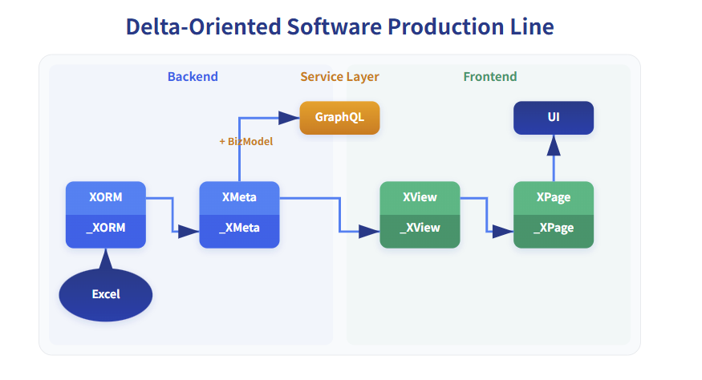

# How does Nop overcome the limitation that DSLs can only be applied to specific domains?

Nop can be viewed as a Language Workbench. It provides a complete theoretical foundation and low-level toolset for designing and developing DSLs (Domain Specific Languages). When developing with Nop, you mainly use DSLs to express business logic rather than general-purpose programming languages. Some may wonder: since DSLs are “domain-specific,” doesn’t that mean they can only be applied to a specific domain, implying intrinsic limitations when describing business? Back when the ROR (Ruby On Rails) framework was popular, the concept of DSLs was hyped for a while, but it then faded into silence—so what’s special about Nop? The answer is simple: Nop is a next-generation low-code platform built from scratch based on the theory of Reversible Computation, which is a systematic theory for the design and construction of DSLs. At a theoretical level, it addresses the longstanding issues in traditional DSL design and application.

## I. Horizontal DSL decomposition: DSL feature vector space

The fundamental reason a Turing machine achieves Turing-completeness is that it can be viewed as a virtual machine capable of simulating all other automatic computational machines. If we keep elevating the abstraction level of the virtual machine, we eventually arrive at a VM that can directly “run” so-called domain-specific languages (DSLs). However, because DSLs focus on domain-specific concepts, they inevitably cannot conveniently express all general-purpose computational logic (otherwise they would be general-purpose languages). This inevitably leads to certain information overflow, becoming the so-called Delta term.

Bold claim: throughout the evolution from first- to second- to third-generation programming languages, abstraction levels improved continuously, yet they remained general-purpose languages. However, by the fourth generation, we are likely not getting another general-purpose language, but a DSL forest composed of many domain-specific languages, through which we can form new representations and understandings of original program structures.

According to the core construction formula of Reversible Computation `App = Delta x-extends Generator<DSL>`, we can apply successive Delta decomposition to obtain:

```
App = G1<DSL1> + G2<DSL2> + ... + Delta
App ~ [DSL1, DSL2, ..., Delta]
```

We can leverage a series of DSLs and glue them together via Generators and Delta terms. If we regard the Generator as background knowledge that can be ignored (not explicitly expressed when describing business), then each DSL can be seen as a feature dimension (Feature), and the application can be projected into a multi-dimensional feature space. Each DSL indeed has expressive limitations, but by combining multiple feature dimensions and adding extra Delta information, we can construct a complete description.

## II. Vertical DSL decomposition: multi-stage, multi-layer software production line

This section introduced the horizontal DSL decomposition in Reversible Computation. Similarly, we can introduce multi-level vertical DSL decomposition to overcome the inherent flaws of traditional Model-Driven Architecture (MDA).



In daily development, we often observe similarities and certain imprecise derivation relationships among logical structures. For example, the strong association between a backend data model and a frontend page: in simple cases, we can derive CRUD pages directly from the data model, or conversely, derive database storage structures from form fields. However, such imprecise derivation is hard to capture and utilize with existing techniques. If we forcibly impose association rules, they will only apply to highly constrained scenarios, leading to incompatibility with other technical approaches, making it difficult to reuse existing tools and technologies, and hard to accommodate the dynamic evolution of requirements from simple to complex. This is precisely the dilemma faced by traditional MDA: for a model to exert maximal power, it must embed a large amount of knowledge for automatic reasoning, but the more knowledge is embedded, the more it gets bound to a specific application scenario, making it hard to handle unforeseen new requirements.

Nop, based on Reversible Computation, provides a standard technical path for reuse oriented around dynamic similarity:

1. With embedded metaprogramming and code generation, an inference pipeline can be established between any structures A and C
2. Decompose the inference pipeline into multiple steps: A => B => C
3. Further Delta-ize the inference pipeline: A => `_B` => B => `_C` => C
4. Each stage allows buffering and pass-through of extension information that is not needed at that step

Concretely, Nop’s built-in model-driven production line can be decomposed into four major models:

1. XORM: Domain model for the storage layer
2. XMeta: Domain model for the GraphQL interface layer, can directly generate GraphQL type definitions
3. XView: Frontend logic at the business level, using a small set of UI elements such as forms, tables, and buttons, independent of frontend frameworks
4. XPage: Page model for a specific frontend framework

During model derivation, we only obtain a candidate result (typically stored in model files with an underscore prefix). We can then choose to inherit this candidate model and add manual corrections and Delta reasoning that rely on extra information (stored in models without an underscore prefix). All steps in the inference relationship are optional: we can start from any step directly, or completely discard all information derived in previous steps. For example, we can manually add an `xview` model without requiring it to have specific `xmeta` support, or we can directly create a `page.yaml` file and write JSON according to the AMIS component specification—the capabilities of the AMIS framework will not be constrained by the inference pipeline. With this deep decomposition pattern akin to deep learning, we can fully unleash the power of model-driven approaches, while introducing extra information via Delta where necessary. The final product’s capabilities will not be limited by the expressiveness of the models. This also means we no longer need to chase coverage of every detail in modeling—just focus on the core, most general needs.

> `XORM = Generator<ExcelModel> + Delta`
>
> `XMeta = Generator<XORM> + Delta`
>
> `XView = Generator<XMeta> + Delta`
>
> `XPage = Generator<XView> + Delta`

## III. Non-programming means non-imperative programming

Nop is a recursive acronym for “Nop is nOt Programming.” Nop non-programming means it is not traditional imperative programming, but instead expands the reach of declarative programming as much as possible. A “DSL” can be seen as a declarative way to express business logic. It focuses on using concepts internal to the business domain to describe the business itself, rather than using the terms of a general-purpose language to express how to implement the functionality step by step. Conversely, if we can find a declarative expression for the current business and store it in the most minimal textual structure, it naturally becomes a DSL.

In traditional programming, when we aim to raise abstraction levels and improve software flexibility and adaptability, we repeatedly emphasize the importance of domain concepts—for example, the Ubiquitous Language in DDD (Domain-Driven Design). However, in traditional programming, domain concepts are ultimately carried by the universal program structures of a general-purpose language. Therefore, their freedom and richness of expression are constrained by the syntax of the underlying general-purpose language. Moreover, many well-designed frameworks have an underlying mental model that corresponds to an implicitly existing DSL, but we don’t explicitly express it. For instance, SpringBoot’s conditional bean assembly mechanism could have been implemented by adding a few conditional tags to the Spring 1.0 syntax. Yet, SpringBoot did not define such a DSL; as a result, it lost its proud declarative assembly capability and transparent insight into the global assembly outcome. For a detailed analysis, see [If we rewrote SpringBoot, what different choices would we make?](https://mp.weixin.qq.com/s/_ZVXESRqjSbObmr7DZoGMQ)

Nop does not use third-party frameworks like Spring or Quarkus. Instead, it builds from scratch a series of low-level engines such as IoC/ORM/Workflow/BatchJob. The most important reason is to redesign these engines according to the theory of Reversible Computation. Every engine that has independent value necessarily corresponds to an intrinsic model, and this model necessarily corresponds to a DSL. The key to Nop is to explicitly define a DSL for each engine and, leveraging Nop’s infrastructure, automatically implement parsing, validation, caching, decomposition/merging, metaprogramming, etc., for the DSL. In this setup, all engines only need to handle their unique runtime logic. Moreover, because extensive extensibility can be handled at compile time via Nop, the runtime structures of the engines can be greatly simplified. In Nop, the code size for each engine is typically an order of magnitude smaller than the corresponding open-source implementations, while offering richer features, better extensibility, and superior performance. See [Feature comparison between the Nop platform and SpringCloud](https://mp.weixin.qq.com/s/Dra8yf2O5VMJyEPox4dGBw).

> The Nop platform’s scope is not limited to low-code focused on visual editing. It provides numerous foundational engines that are comparable to the corresponding parts of the SpringCloud ecosystem and has the potential to become a SpringCloud-like foundational technology base for the AI era.

## IV. Unified metamodel, unified rules for constructing DSL structures

The most common objections to DSLs are:

1. Building and maintaining DSLs is costly
2. DSLs differ greatly in syntax forms, leading to high learning costs
3. Interaction between DSLs and general-purpose languages is difficult

Therefore, many people recommend internal DSLs embedded in general-purpose languages. Internal DSLs use the host general-purpose programming language’s syntax and structure to construct domain-specific languages without requiring independent parsers or compilers. They can leverage existing language tools and ecosystems (code editing, debugging, packaging, deployment, etc.), and have relatively lower learning costs since users need not learn an entirely new language.

However, common internal DSLs typically over-emphasize superficial similarity between DSL syntax and natural language (in fact, not natural language—just English), effectively introducing unnecessary formal complexity. Furthermore, internal DSLs usually rely on the host language’s built-in type system for formal constraints and often cannot guarantee syntactic stability—multiple equivalent forms may exist to express the same domain logic—so the so-called DSL syntax is merely an unwritten convention. Internal DSL parsing generally depends on the host language’s parser, making it difficult to parse and transform outside the host language. This tangles the internal DSL’s syntax and semantics with the host language, and few people focus on the internal DSL’s conceptual integrity, extensibility, and structural reversibility.

Nop’s approach is to introduce a unified XDef metamodel to normalize the syntax and semantic structures of all DSLs, and to provide unified development and debugging tools to assist DSL development. Once you master the metamodel, you can immediately grasp the syntax of all DSLs as well as standard solutions for decomposition/merging and Delta-based customization, without having to learn each DSL separately. When developing a new engine on Nop, we can use `xdef:ref` to reference existing DSLs to achieve natural fusion among multiple DSLs, and use the XPL template language to automatically convert declarative specifications into imperative implementations. For details, see [Meta Programming in a low-code platform](https://mp.weixin.qq.com/s/LkTIVGSrK9zomPW4bNiqqA).
<!-- SOURCE_MD5:5565d431c48bb9f2db02a8b2da0bc187-->
