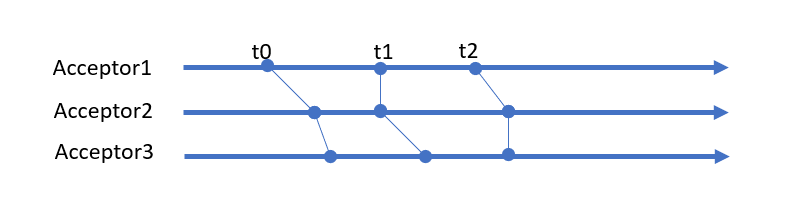

# A Magical Studies Research Report on Paxos

The Paxos algorithm is not long—just four succinct sentences on paper. It looks like an arcane scripture of terse profundities mainly because we don’t clearly understand the design intent behind these simple rules: why they work, and whether deviating from them is unacceptable. The backdrop of distributed systems is a chaos where liveness is freedom and failures are random; conflicts abound everywhere. Yet Paxos builds a unified, consistent world of consensus atop this chaos, which feels miraculous. But mortals find miracles hard to grasp; unable to view all beings from a god’s vantage point, they can only infer divine intent through limited experience, inevitably falling into mortal confusion. This article attempts an interpretation of Paxos from the perspective of extradimensional magical studies, constructing a concise magical image behind Paxos to achieve an intuitive understanding of the algorithm.

## I. The God’s Troubles

First, let’s look at the problem facing the god and where his troubles might lie.

Suppose the god needs to have a team collectively perform the same task. His first problem is that nobody is reliable. You assign a task to A; he might be so absent-minded he never even heard it, or he might be slow and dilatory, or worst of all, just lie down halfway and refuse to work. This problem is relatively easy: if one person is unreliable, no big deal—so long as a few in the crowd are reliable, the advanced can bring along the lagging. The god only needs to seize a few key members each time, guide them to do things right, and the rest can learn the divine will from those backbone members.

The truly thorny problem is that many things happen in parallel. The god just finished assigning work to A and, while explaining things to B, A’s situation changes (say A receives another divine command). The god has to hustle back to A and assign a new oracle. Just as A is sorted, B sprouts new issues, so the god gallops over there again. After repeating this a few times, even the supreme, omniscient, omnipotent god, no matter how good-tempered, would lose patience.

## II. Level-9 Magic: Time Stop

A god transcends all finite beings and remains a most complete existence, so he doesn’t truly face the above troubles. Because he can softly utter: “Stop,” cast a Level-9 magic “Time Stop,” and bring this noisy world into complete silence, then calmly do whatever he wishes.

According to modern physics in our plane, time is merely a measure of change. We construct the concept of time by comparing a pendulum’s periodic motion with other motions. If no change is observed, it essentially means perceived time remains unchanged. In particular, if all atoms in the universe oscillate one beat slower in unison, humans within it cannot detect it.

Review the steps of Paxos: the Proposer first, via the promise phase, determines a unique ProposalID from all Acceptors; then whenever any event needing recognition occurs—for example, receiving new messages—the ProposalID automatically increases, so ProposalID is effectively a time marker. When an Acceptor receives an accept message, if it finds the ProposalID hasn’t changed compared to the promise, it can judge that time remained static during this process and that no relevant events occurred.



Each Acceptor records a monotonically increasing ProposalID, which is tantamount to establishing a local arrow of time. The whole system, by aligning ProposalIDs to the same time point, aligns multiple local time arrows into a bundled, coarse-grained, global arrow of time (the prerequisite for alignment is that events occurring at the same time point are identical, e.g., setting the same value). The passage of time is akin to a wavefront sweeping through the system.

Thus, from the god’s perspective, Paxos is merely a parlor trick: using the Time Stop magic to forcibly align multiple timelines into a unique primary timeline.

This “stop-align” technique is a fundamental strategy for achieving consensus in distributed systems. For instance, in Kafka, multiple consumers within the same consumer group act independently, yet must reach consensus on work allocation. Therefore, when membership changes in a consumer group or the topic structure changes, a rebalance process is triggered. During rebalance, the Coordinator first requires all workers to stop current work, collectively switch to the next epoch, and then distribute a new assignment. An assignment is valid only within an epoch.

Optimistic locking in databases follows the same strategy. Upon entering the handler, you read the version of the MainRecord, modify the MainRecord and related SubRecords, and finally commit modifications in one transaction while attempting to change the main record’s version:

```
  update MainRecord
  set version = version + 1
  where version = :record_version
```

If the update succeeds, it means time remained static throughout the process and no conflicting actions occurred.

## III. Level-8 Magic: Grand Puppetry

Casting Level-9 magic is power-intensive. A god committed to thrift and socialist core values would never waste mana. So once time is stopped, to maintain consistent behavior across geographically dispersed nodes, the god’s optimal choice is to cast Level-8 magic “Grand Puppetry,” replicating behavior from one node to all others.

This replication is powered by the god; once the leader initiates a new action, it traverses mountains and seas, ignoring physical barriers, and descends upon remote followers. Followers have no right to refute—only the freedom to execute. But as the saying goes, those above move their lips, those below run themselves ragged. In our low-magic world, implementing Grand Puppetry is far from trivial and is typically achieved by adding a log at both sender and receiver.

The sender writes decisions to a log, making them immutable oracles. The sending component scans the log and ensures each entry is transmitted to the remote end. If it can’t connect to the receiver, or sending fails, or the expected response isn’t received, the sender can neither complain nor give up—it must keep working and keep retrying until a success response arrives, achieving at-least-once delivery (At Least Once). The receiver must unconditionally accept all messages, neither reject nor tamper. Because it might receive the same message multiple times, it must perform idempotence checks via a local log, filtering duplicates to achieve at-most-once processing (At Most Once). If messages flow through a stream processing system, to avoid replaying from the source each time, intermediate nodes must record completed processing via snapshots.

Unquestionably, MultiPaxos and Raft are concrete implementations of this replication strategy. Once leader election succeeds, the term number can be reused multiple times; within the same term number, multiple execution commands can be issued so long as log index distinguishes them.

Analyze carefully and you’ll find messages received from the network fall into two categories: requests, where the receiver can freely choose a handling method and outcomes are uncertain (success or exception), and one-way notices, whose handling is fixed and the receiver cannot disagree.

A fun example is two-phase commit. In Prepare, a Participant receives a request and can, by its own will, choose to commit or roll back. Once the Participant returns its potential choice to the Coordinator, it cedes autonomy, promising to accept only notices henceforth and align its behavior to the Coordinator. When the Coordinator decides to commit, the Participant will never choose rollback. Similarly, if the Participant rolls back, we know the Coordinator’s choice can only be rollback. Their choices are no longer independent but entangled.

Viewed individually, each Participant and the Coordinator may randomly be in either commit or rollback states. But as a whole, not all states are possible; only |commit, commit> and |rollback, rollback> are allowed within the system’s state space. That is, during 2PC, the system effectively resides in a quantum entangled state composed of |commit, commit> and |rollback, rollback>!

Based on this, in our plane, quantum entanglement is a viable mechanism for implementing puppetry.

## IV. The Secret of Magical Theory: What’s Unseen Does Not Exist

As mere mortals, we lack mana to drive magic. But we’ve all seen magic shows and experienced “the moment of witnessing a miracle.” Miracles are born from magicians guiding us to observe only revealed facts, while the under-the-hood secrets are not for outsiders. Magic, as a strengthened form of magic tricks, is similar in essence: simply ensure all facts that violate magical principles are deleted from our cognition!

After Paxos starts, we try to make time stand still, but pesky interference keeps appearing. Acceptors might receive messages from the past (ProposalID less than the current value). The Paxos solution is to pretend we didn’t see them—just drop them! On the other hand, Acceptors may receive messages from the future; the simplest solution is still to drop them. But that would cause something like distributed locks and weaken fault tolerance: in the current Time Stop cycle, the Proposer may have crashed and cannot finish setting values on Acceptors. So faced with a choice between “current” and “future,” to be safe, the Acceptor must abandon the current cycle’s progress and choose the future possibility (it’s not shameful if magic fails—feign ignorance and proceed to the next round). Of course, if the Acceptor already knows via the Learner mechanism that the current value has been chosen, there’s no need to run another Paxos round; future requests can be rejected directly. Similarly, in Raft, to avoid oscillations from repeated re-elections, as long as heartbeats confirm the Leader remains within a time window, RequestVote messages from the future are ruthlessly discarded.

In algorithms requiring leader election, a classic problem is avoiding split-brain. What if a new Leader has won the people’s support, but the old Leader refuses to step down and keeps making trouble? A general solution is to directly define the old Leader as a zombie and completely ignore all information from the previous epoch (e.g., reject requests with smaller epochs). In fact, we don’t restrict the old Leader’s behavior; in its own small world, it can do whatever it thinks is right, but its behavior cannot ascend to collective will and cannot affect the primary world. Once the new Leader takes office, it must write-before-read—first stamp its epoch on the primary world (akin to changing a globally shared variable). Then the old Leader, upon committing results, discovers via optimistic locking that it has lost power and is forced to abandon its results.

In our plane’s physics, with quantum mechanics, observation or measurement has a unique theoretical significance. In quantum field theory’s view, within imaginary time, countless wild phenomena compete and annihilate; only some combined results are reflected in reality. Through the strange quantum tunneling effect, we can glimpse the raging waves behind the scenes.

Covering one’s ears while stealing a bell is not an absurd joke but a rule that can operate genuinely in our world. If one can effectively create an information cocoon that shrouds everything, it can manipulate what we accept as truth. Hence, the “Understanding King,” a man claiming to be infinitely close to godhood, kept insinuating: without testing, COVID-19 doesn’t exist! As a fire-stealer leaking heavenly secrets, he truly understands.

## V. Mortal Consensus: Symmetry Breaking

The god says all beings are equal. In mathematical terms, no one is special—they are symmetric! A society cannot have only one voice; everyone can have an opinion, each deserving equal respect. Then why is one voice chosen to overshadow all others and become consensus? Essentially, this is a process of breaking equality—symmetry breaking.

The most basic symmetry breaking technique is majority voting. Since a set cannot simultaneously contain two majorities, at any moment (determined by ProposalID), if we know a majority of Acceptors accepted some value, we say that value is chosen—consensus is reached.

### When is consensus achieved?

When consensus arises, does anyone among participants know it has been achieved? An interesting fact: at the instant consensus is achieved, no participant in the system—neither Acceptors nor Proposers—knows that consensus has been reached! Only gradually, as time goes by and the algorithm runs, is the fact of consensus being achieved revealed.


Consider 5 Acceptors and multiple Proposers. At ProposalID = t1, proposal P1 is accepted by A1 and A2, but not a majority; no value is determined in that round. ProposalID = t2, P2 likewise fails to reach a majority. ProposalID = t3, P3 is accepted by majority A2, A3, A4, and consensus is reached.

First, note that before consensus is reached, an Acceptor may change the value it accepts; for example, A3 first accepted P2 and later accepted P3. Because Proposers may disconnect at any time, Acceptors can only choose to accept new values. This implies that when A3 accepts P3, it cannot know that consensus has been reached and that P3 is the chosen value. Similarly, A2 and A4 know only their local situations; they cannot judge whether the system has achieved consensus overall. On the Proposer side, before receiving successful responses from a majority of Acceptors, it doesn’t know whether P3 it submitted will be accepted by the majority and become final consensus. Thus, consensus belongs to the whole; individual participants need a process to come to understand whether consensus has been achieved.

### Can established consensus be overturned?

In the previous example, after consensus at ProposalID = t3, could we reach a new consensus P4 at t4? Then t3’s consensus is P3, t4’s is P4, while t1 and t2 have no consensus. For a god, different values chosen at different times are perfectly fine—no problem—because a god is omniscient and omnipotent. But for dull mortals, allowing different consensus at different times causes cognitive impairment.

If consensus can be overturned, how does a mortal with limited cognition know which value to use? Many times have no consensus (e.g., t1 and t2). Must he traverse all times from t1 to tn to discover all consensuses?


Now, consider the case above. Suppose A3 crashes while processing P3. From the outside, there are two possibilities:

1. A3 already accepted P3, so consensus was reached.
2. A3 hadn’t accepted P3 yet, so consensus wasn’t reached.

No one but A3 knows the outcome—and A3 has crashed and cannot answer! So if different times may have different consensus, we might be trapped in an awkward situation where historical results are quantum indeterminate, making yes/no answers impossible.

For mortals, the ideal is a system with some monotonicity: it advances only in one direction, and once it reaches the target state, it remains locked in that state forever. Then, any time we want to extract information, we can push the system forward one step. If consensus is reached, pushing one more step still yields the consensus value; if not, we will actually choose a value, escaping uncertainty. In the above example, if we run one more Paxos round, regardless of A3’s choice at t3, we will obtain P3 at t4, thus eliminating uncertainty beyond t4. In Yubai’s article, this is called the maximum commit principle.

Note that by running one more Paxos round, we may move the system from its original indeterminate state to a determinate one. This is akin to a quantum system: observe it, and its state collapses to an eigenstate. If it was already in an eigenstate, observation doesn’t change the system’s state.

### How to ensure consensus remains unchanged?

Consensus is knowledge on the primary timeline of the primary world. According to modern magical studies, knowledge at two different points on the timeline is completely independent! If we want to relate the knowledge at those two points, we must introduce some **"connection"** mechanism so information can transfer from one time point to another.

First, we know all facts on the primary timeline can be ordered by their “time points,” and consensus is a write occurring at some point on the primary timeline. The simplest way to keep consensus consistent is read-before-write—peek at the prior state before writing.


When writing at t4, if we can peek at t3’s result, wouldn’t directly using t3’s result as the value for t4 ensure consistency?

Under Level-9 magic, with a single divine thought, we can complete a composite atomic event—read-process-write—at any point on the primary timeline. Events on the primary timeline can be decomposed into events in lower worlds. Journey to the West records: one day in heaven equals one year on earth. Thus a point in the primary world maps to an interval in the lower world (a local clock in the lower world would see a longer process—start-process-end—rather than a time-stopped point). This mapping preserves atomicity and relative ordering. For instance, in the figure above, A5’s t3 and t4 are indivisible and won’t interleave. If t3 and t4 interleave, that implies unexpected events occurred during Time Stop, contradicting the assumption. t4 must be after t3 and not overlap it; thus it can see t3’s result.

In Paxos Phase 1, we collect the values already accepted by a majority of Acceptors.

1. If consensus has already been reached, Phase 1 will necessarily return this consensus value, and it must be the one with the largest ProposalID. Proof: if consensus is reached at t3, then the immediately following t4 will have seen t3’s result, and by rule, its value must be the consensus value. So if the largest ProposalID’s value isn’t the consensus, it indicates consensus cannot have been reached before it.

2. If consensus hasn’t been reached, the Proposer is free to choose a preferred value; choosing the one with the largest ProposalID to help others is also perfectly fine.

Some may wonder: if the Proposer submits others’ values, what about its own? Note: Paxos aims to achieve consensus, not satisfy personal desire by turning one’s own value into consensus. In fact, a Proposer who finds its value cannot be submitted can simply abandon subsequent work without affecting correctness. Helping others proactively accelerates system convergence. If some Proposer receives responses from all Acceptors and, upon analysis, finds consensus hasn’t been reached, it may choose not to support others and persist in submitting its own value. Mutual assistance is a human virtue—help others this time, and perhaps they’ll help you next time.

## VI. Certainty atop Uncertainty

In mortal eyes, the world teems with aggravating uncertainty; every action yields three possible outcomes: 1) success, 2) failure, 3) unknown. Once, isolated single-machine systems offered a utopian illusion: the world is binary—good vs. bad, success vs. failure, light vs. darkness. But reality sobers us: in a world ruled by chance, inherent uncertainty gives distributed systems their essential difficulty.

To strive in a random, uncertain world, we must cooperate sincerely to form a collective consciousness that transcends the individual. The individual can perish; the collective achieves immortality through renewal. An interesting question: is majority the only way to form collective consciousness? Clearly not. For spiritual inheritance, seeds suffice.

Consider a Grid Quorum example,


For the 3*6 Acceptors forming a grid above, we can stipulate that writing any column quorum suffices to deem consensus reached. Evidently, any two columns are disjoint. To avoid contradictory choices, we need to build a bridge horizontally: require that Paxos Phase 1 reads at least one row. Suppose consensus has arisen at some time; then the next consensus must perform a row read followed by a column write. Since any row and any column intersect, the row read will necessarily read the consensus value, ensuring the newly written value remains consistent with the prior consensus. Note that the row quorum and its intersecting column quorum both need not be majorities, and their total elements are 3+6-1=8, which is not a majority. Thus, read and write quorums need not be the same, nor majorities; intersection suffices to transmit information.

To transcend the individual, elevate the individual to a member of a quorum. An individual can belong to multiple quorums. As long as past and future quorums coordinate and avoid conflicting choices, we can ultimately form a unified collective will.

## VII. The Secret of Time

For mortals, time is a mysterious a priori existence. It seems all coordination essentially leverages the direction provided by the arrow of time. In our plane, Sir Newton first discovered that time partitions causality—cause on the left, effect on the right. For this he wrote the immortal Newton’s second law:

> F = m\* a, cause = linear coefficient * effect

Later, by imagining emitting a photon to probe the world, Einstein inadvertently revealed a shocking secret: timelines are not unique!

If timelines aren’t unique, how do we avoid losing our way? One choice is to remember all timelines—Vector Clock technology. And if we choose to align all timelines into a unique one, we get the Paxos algorithm.

Do we have other choices? Imagine if we could break free of causality, roam the timeline freely, indifferent to past or future—how cool would that be. Cause on the left, effect on the right—why not invert them? Essentially this is because the system lacks commutativity; swapping left and right yields different results. Only in a high-magic world, indifferent to left/right and before/after, can true Level-10 magic be cast: Reverse Causality. CRDT data structures, anyone?

## VIII. Conclusion

The divide between man and god lies in the divine realm. Within the divine realm, words command law. Making rules is the god’s genesis, while humbly accepting rules—and cunningly exploiting them—is human essence.

A small subset of mortals, called programmers, fancy themselves pseudo-gods of the program world, always trying to overstep this chasm. But only by truly simulating divine behavior can humans recognize their limits and the greatness of gods. Why does sending a message yield a response? Because all servers reside on Earth; their distances are finite. Why can a Lease term be decided by local clocks? Because servers are on Earth, in similar gravitational fields, making local clocks comparable. From human scale, we cannot imagine achieving consensus across half the galaxy.

Finally, let us once again heed the god’s will:

* The god said: let there be time
* The god said: time shall stop
* The god said: myriad worlds
* The god said: countless avatars
* The god said: pass the flame

Lamport: Paxos!
<!-- SOURCE_MD5:5fd6e72488f8b59119ecb9d031b90e5c-->
