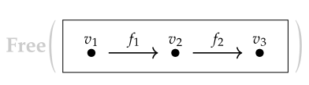
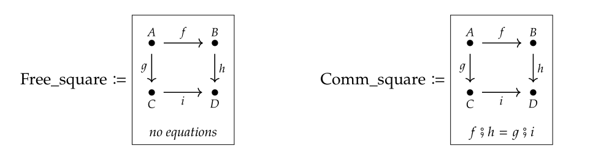
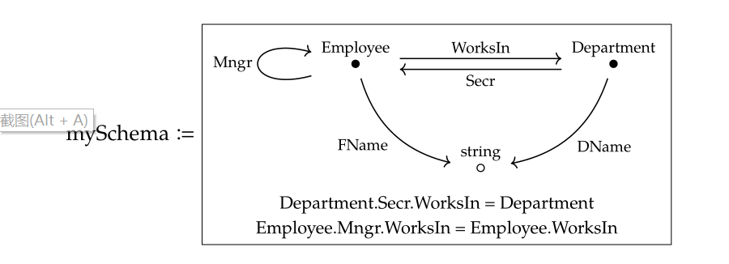

# A Complementary Explanation of the Reversible Computing Theory for Programmers

Reversible computing theory is a software construction theory that the author discovered when attempting to explain software development practices from the fundamental principles of physics. Its methodology originates not from computer science itself but from theoretical physics, describing an abstract software construction rule that programmers are unfamiliar with. In [The Methodological Origin of Reversible Computing Theory](https://zhuanlan.zhihu.com/p/64007521), I briefly introduced the inspiring ideas brought about by theoretical physics and mathematics. Recently, I wrote another article, [Reversible Computing Theory Explanation for Programmers](https://zhuanlan.zhihu.com/p/632876361), where I detailed the specific forms and practices of differences and difference merging in programming practice from a programmer's perspective. Based on reader feedback, this article will continue to supplement some conceptual explanations of reversible computing theory, clarifying common misunderstandings about it.

## 1. How Functions (Business Logic) Implement Difference Quantization

A difference is defined within a model space that supports certain difference merge operations. Different model spaces have different forms of differences. **This means that for the same entity, observing it in different model spaces yields different results.**

Firstly, all structures can be represented in a common binary bit space, such as when function A is stored in a file, corresponding to the binary data 10111... In abstract mathematical terms, we aim to find the difference X that transforms function A into function B, which corresponds to the binary representation 010010.... Mathematically, this is equivalent to solving the equation `A ⊕ X = B`. If ⊕ is defined as the binary XOR operation, we can automatically derive `X = A ⊕ B`.

```
A ⊕ B = A ⊕ (A ⊕ X) = (A ⊕ A) ⊕ X = 0 ⊕ X = X
```

> In the proof, we used the [associativity, commutativity, and identity properties](https://baike.baidu.com/item/%E5%BC%82%E6%88%96/10993677) of the XOR operation.

Although we can always solve for the difference in the binary bit space, this difference often lacks practical business value (except in cases like binary compression software). We cannot intuitively understand it and lack effective means to manipulate it.

The second common representation is the row-based text space: All source code files can be described at the row level. We can relatively easily define differences and manipulate them in this space. For example, typical IDE tools provide shortcuts for copying, deleting, and duplicating rows. Furthermore, debugging tools and version control tools have significant business value based on the row text space. For instance, when comparing different versions, diff tools automatically generate a row-based Diff representation that trained programmers can easily understand during code reviews. However, the row text space is a generic representation that does not consider specific domain knowledge. This leads to instability in its use for describing business logic code. Certain transformations at the business level may result in significant differences in the row text space. For example, code formatting can cause major differences at the row level. Additionally, changing the order of function definitions usually does not affect program semantics, but from a row text space perspective, it results in a massive change.

> In Go, when compiling source code, it follows fixed formatting rules to format the source code. At first glance, this seems to deprive programmers of control over source code formatting, yet it does not mean any functionality is lost; rather, it ensures a more stable row text representation.

**To achieve a stable and business-specific semantic difference representation, we must define functions within a domain-specific model space.** Specifically, we can decompose the function into multiple steps and assign unique IDs to each step. For example, in the Nop platform, we defined two types of differences for implementing distributed asynchronous function calls.

1. **Stack-based TaskFlow**: Each step is executed automatically when a step is complete, moving to the next step. When all child nodes are executed, execution returns to the parent node. During runtime, we can determine the current state data of each node based on its parent-child relationship, forming a stack space. By introducing external persistent storage, TaskFlow can implement a mechanism similar to programming languages' [Continuation](https://www.zhihu.com/question/61222322/answer/564847803) mechanisms: when a step is executed, it can suspend the flow or a branch and allow external code to call TaskFlow's `continueWith` method to resume execution from the suspended step. The XDef model in TaskFlow is defined as [task.xdef](https://gitee.com/canonical-entropy/nop-entropy/blob/master/nop-xdefs/src/main/resources/_vfs/nop/schema/task/task.xdef).

2. **Graph-Based Workflow**。The workflow model can describe the common DAG (Directed Acyclic Graph) in the big data processing field, as well as the approval workflows with loops and fallbacks in office automation. A workflow is fully dependent on transition rules to specify the next step to be executed. Additionally, because the steps of a workflow are flat without nested relationships (except for sub-workflows), after the workflow is suspended, it can be restarted from any step, making the implementation of the Continuation mechanism more straightforward in a Workflow. The XDef meta-model refers to [wf.xdef](https://gitee.com/canonical-entropy/nop-entropy/blob/master/nop-xdefs/src/main/resources/_vfs/nop/schema/wf/wf.xdef).

```xml
<task x:extends="send-order.task.xml">
  <steps>
    <step id="save-order" />
    <step id="send-email">
      ...
    </step>
  </steps>
</task>
```

The above definition indicates a differential adjustment to the send-order.task.xml task definition, adding a send-email step after save-order. We can also use differential forms to adjust configuration parameters or remove a step.

## 2. Can Reversible Computing Be Applied to Runtime Evolution?

In previous articles, I have repeatedly emphasized that reversible computing can be implemented through compile-time meta-programming mechanisms. Some readers may wonder if this implies that reversible computing as described only covers static evolution (compile-time differences), and whether dynamic evolution (runtime differences) also falls within the scope of reversible computing theory.

This is an intriguing question. Let's start with the answer: Yes, **reversible computing can be applied to runtime evolution**.

First, **during runtime, we can employ delayed compilation and just-in-time (JIT) compilation techniques**. In the Nop platform, if the DSL model file is modified after deployment, all dependent models will automatically become invalid, and upon accessing these models again, they will be recompiled automatically. For example, modifying NopAuthUser.xmeta will cause NopAuthUser.view.xml and all related page models to update automatically. The auto-update process for DSL models does not require system restarts; it only updates cached compilation results.

From an abstract perspective, the multi-tenant SaaS system can also be understood as a Delta customization problem. Each tenant corresponds to a unique Delta, and these Deltas are isolated in runtime state space. In fact, due to Nop's design patterns, which handle Delta construction and decomposition more elegantly than other approaches, runtime evolution can be managed with greater grace. Based on the Nop platform's design, continuous software evolution is possible without any downtime.

> The difference between the interpretation model at runtime and the code generation model during compilation can be understood through function programming's [Curry mechanism](https://zhuanlan.zhihu.com/p/38917159). For example, the execution model of the low-code frontend framework AMIS corresponds to `renderAmis(pageJson, pageData)`. If Curry is applied, it becomes `(renderAmis(pageJson))(pageData)`. By optimizing the logic within `renderAmis(pageJson)`, we can transform it into a Component = CodeGenerator(pageJson), allowing compilation to occur during the compile phase, performing extensive judgment and loop operations then. At runtime, only the necessary Component(pageData) logic needs to be retained.

A more complex question is whether the runtime state space also falls within Delta's management scope. After all, the complete description of an application system is Structure + State. The answer is yes; **reversible computing can indeed encompass dynamic evolution (runtime differences)**. This is because reversible computing is a fully abstract theory that can integrate both static and dynamic aspects into its framework.

In physics, this high-dimensional space is known as [phase space](https://baike.baidu.com/item/%E7%9B%B8%E7%A9%BA%E9%97%B4/8172498?fr=aladdin). However, from a practical standpoint, considering the state would lead to increased complexity in handling, resulting in a linear increase in processing time. Therefore, generally, we only consider Delta in terms of structure, while ignoring the state space.

# Delta Improvement Example

## Time Freezing Technology Application
Let's take an example with a robot undergoing Delta improvement. The complete description of the robot includes its structure and the states it is in, such as its relative speed, acceleration, angular velocity, and even pressure and temperature in high-speed motion. Normally, we don't perform maintenance on the robot while it's operating; instead, we shut it down to a non-activated state. The operational mode does not provide relevant information for maintenance, which is usually only needed in extreme cases, such as when a train is moving and requires wheel replacement.

The basic approach would be:
1. Use time freezing technology to stop the system at a specific point.
2. Serialize the necessary states into storage.
3. Modify the structure.
4. Re-load the states once everything is ready.
5. Evolve over time after everything is set.

During the Delta correction process, time is static, all states are frozen, and the state itself can be corrected as data.

For example, using a locking mechanism directly prevents external operations, making the system appear static from the outside.

## Multi-universe Copying
The process involves creating multiple universes through snapshots. After splitting into multiple universes, Delta copying must be performed in each parallel universe until all time points are aligned, after which time freezing is applied within a short period to complete the timeline switch.

[Reference: Paxos' Magic Research Report](https://zhuanlan.zhihu.com/p/193117183)

The complexity of correcting states lies in the object-related state information not being solely determined by the object itself. For example, if a robot is engaged in intense battles with other robots, its state is fundamentally influenced by interactions with the enemy. To recreate this state, one must consider energy conservation, momentum conservation, angular momentum conservation, and other physical constraints. We cannot simply recreate the state from the robot's individual perspective but must account for all interacting objects and their environments, making state correction or modification an extremely complex task.

If we perform Delta customization by modifying the object's structure, how do we adjust the runtime states so that they align with the new structure and the external runtime environment? This becomes a very challenging task.

Based on the above discussion, there are two basic approaches for implementing evolution in runtime:

1. **Separate Structure and State**: For example, microservices emphasize no-state design, keeping business state in shared storage for instant access.
2. **Define Activation and Deactivation Modes**: Switch to a deactivated mode to perform structural revisions.

## Multi-Modal Evolution Analysis

Let's take DNA as an information carrier DSL (Domain Specific Language). The growth of biological organisms corresponds to the Generator pattern, which uses DSL information combined with environmental information to shape the organism's body. Additionally, organisms can utilize external Deltas, such as diving suits, to gain abilities in specific environments. For instance, a diving suit Delta allows underwater activity by adding varying thickness layers. While specialized physical organs can be equipped with specific Deltas, general organisms have limited Delta applications.

For example, polar bears' thick fur is excellent for cold regions but poorly suited for hot climates, limiting their adaptability to tropical environments.

## Nop Platform Complexity

### Why Rewrite Lower-Level Frameworks
The Nop platform's codebase appears extensive (over 200,000 lines of Java code, including auto-generated code). Some developers may question the necessity of using the Nop platform and whether it implies rewriting business logic. The Nop framework was not built on Spring but instead reimplemented many Java ecosystem foundational frameworks with innovative designs, enhancing usability and performance.

### Why Rewrite Lower Frameworks
Popular lower-level frameworks have been around for a long time, leading to bloated codebases and legacy issues. New challenges like asynchronous operations, GraalVM native compilation, and GraphQL require modern solutions that existing frameworks may not support. For example, Hibernate alone has over 30万行代码 but lacks From clause subqueries and efficient attribute loading, causing inefficiencies.

Nop Engine combines Hibernate+MyBatis capabilities into a lightweight engine:
- Supports most SQL syntax.
- Includes logical delete, multi-tenant, sharding, field encryption, and audit trails.
- Supports asynchronous operations.
- Implements batch loading similar to GraphQL.

# What ORM Engine Does a Low-Code Platform Need?

* [Low-Code Platform Needs What Kind of ORM Engine](https://zhuanlan.zhihu.com/p/543252423)

# If We Rewrite SpringBoot, What Choices Do We Have?

* [If We Rewrite SpringBoot, What Are the Choices We Make](https://zhuanlan.zhihu.com/p/579847124)

# Using Excel as the Designer for an Open-Source Chinese Report Engine: NopReport

* [Using Excel as the Designer for an Open-Source Chinese Report Engine: NopReport](https://zhuanlan.zhihu.com/p/620250740)

The reason we rewrite these frameworks is that they require very little code. One important reason is that they share many common mechanisms from the Nop platform. **Any lower-level framework with some complexity essentially provides a Domain-Specific Language (DSL) in a way, similar to how Hibernate provides hbm files, Spring provides beans.xml, Report provides report models, and so on for interface definition files like RPC.** The Nop platform provides various technical support for developing custom DSLs, avoiding the need for each framework to independently implement parsing, loading, and transforming functionalities.

Additionally, the Nop platform offers highly customizable expression languages and template engines, avoiding the need for each framework to reimplement similar script engines on its own. Furthermore, each framework uses an IoC container for dynamic assembly, avoiding the need to implement plugin extension mechanisms independently.

The Nop platform unifies the DSL description methods used by all lower-level frameworks, allowing us to use a unified XDef meta-model language to define different DSLs. This enables us to provide a single IDE plugin that supports programming for various DSLs and allows seamless integration between multiple DSLs. In the future, we will also provide a unified designer generator that can automatically generate visualization tools based on the XDef meta-model.

Thanks to the built-in Delta customization mechanism in XDSL, we can achieve deep customization without modifying the source code of the base product. For detailed information, see the article:

* [XDSL: Common Domain-Specific Language Design](https://zhuanlan.zhihu.com/p/612512300)

# How to Implement Customization Without Modifying Base Product Source Code

If we do not rewrite the lower-level frameworks, how can we introduce delta mechanisms?

The Nop platform rewriting of lower-level frameworks is aimed at simplifying programming and improving performance. Even if we stick with traditional open-source frameworks, we can still introduce delta mechanisms; it just might be less convenient.

In fact, implementing delta mechanisms based on JSON format for a virtual file system and the Delta merge algorithm requires only a few thousand lines of code.

# Introducing Reverse Calculation with Minimal Cost

If you want to minimize the cost of introducing reversible computation, you have two options:

#### 1. Use Nop as an Incremental Code Generator

The Nop platform's code generator can be integrated into Maven for use. When executing `mvn package`, it automatically runs all precompile and postcompile scripts. **The generated code can run independently without altering the original runtime mode or adding new runtime dependencies.**

The Nop platform supports defining your own domain models, as well as extending built-in data models, API models, etc., through Delta customization. This extension is achieved without modifying Nop's source code. Currently, some users are using Nop's code generator to generate other low-code platforms' model files.

Nop's code generator incorporates a series of innovative designs that differentiate it fundamentally from common code generation frameworks. For detailed information, see the article:

* [Data-Driven Delta Code Generator](https://zhuanlan.zhihu.com/p/540022264)

In addition to integration with Maven, you can also use the command-line interface for continuous code generation.

```
java -jar nop-cli.jar run tasks/gen-web.xrun -t=1000
```

```xml
<!-- gen-web.xrun -->
<c:script><![CDATA[
    import io.nop.core.resource.component.ResourceComponentManager;
    import io.nop.core.resource.VirtualFileSystem;
    import io.nop.codegen.XCodeGenerator;
    import io.nop.xlang.xmeta.SchemaLoader;
    import io.nop.commons.util.FileHelper;

    assign("metaDir","/meta/test");

    let path = FileHelper.getRelativeFileUrl("./target/gen");
    let codegen = new XCodeGenerator('/nop/test/meta-web', path);
    codegen = codegen.withDependsCache();
    codegen.execute("/");
]]></c:script>
```

The above example demonstrates that the `gen-web.xrun` task is executed every 1 second. The task processes all metadata files under the `/meta/test` directory and the `/nop/test/meta-web` directory, generating the code template in the `target/gen` directory. The `XCodeGenerator` is configured with `withDependsCache()`, which checks if any of the model files it depends on have changed before regenerating the code. For instance, if `my.page.json` is generated from `NopAuthUser.xmeta` and `web.xlib`, then only when `NopAuthUser.xmeta` or `web.xlib` changes will `my.page.json` be regenerated.

This dependency tracking mechanism resembles the built-in modification detection in front-end tools like Vite: when source files change, they are automatically reloaded and updated in the browser.

#### 2. Using Nop's Unified Model Loader

Nop's Delta customization mechanism is designed for dynamically generating and assembling various model files without involving runtime frameworks. This allows it to seamlessly integrate with any well-designed runtime framework. The strategy involves replacing the traditional model loading function with calls to Nop's unified model loader.

```javascript
 Model = readModelFromJson("my.model.json");
 // Replaced with:
 Model = (Model)ResourceComponentManager.instance()
                  .loadComponentModel("my.model.json");
```

The `ResourceComponentManager` caches the parsed model files and tracks all dependencies during parsing. If any dependent model changes, it automatically invalidates the cached results.

**Reversible computation theory proposes a calculation pattern of the form Y = F(X) + Delta. This can be encapsulated in an abstract loader (Loader) interface, significantly reducing the cost of introducing reversible computation in third-party systems.** For detailed information, refer to [Low-Code Platform Design](https://zhuanlan.zhihu.com/p/531474176).

In Nop, we implemented integration with the Google AMIS framework using this approach.

```yaml
type: page
x:gen-extends: |
   <web:GenPage view="MyEntity.view.xml" page="crud" />
body:
  - type: form
    "x:extends": "add.form.yaml"
    api:
      url: "/test/my-action"
```

By using `ResourceComponentManager` to load AMIS page files, we introduced `x:extends` and `x:gen-extends` delta decomposition and combination mechanisms. This allows dynamic generation of JSON content using XPL templates, enabling fine-tuned customization by reusing predefined sub-pages in the Delta directory.

All JSON, YAML, or XML formatted model files can be directly processed using Nop's unified model loader for delta decomposition and merging.
## Four. Delta Difference vs. Scala Traits: Key Innovation

In my previous article, I clearly pointed out that the **Trait concept in Scala can be viewed as a form of **Delta difference** within the class space**. Some readers may have questioned whether the **Delta difference** in reversible computing is fundamentally just another type definition problem without any significant innovation.

This is understandable because many programmers are accustomed to object-oriented programming paradigms and naturally associate code creation with class, attribute, and method definitions. For example, when researching how ChatGPT generates business code, many users' initial thought is to teach GPT to break down problems into multiple classes and then generate corresponding code for each class.

## Key Clarifications

The **Trait concept is tied to the class concept, but classes are not always the most suitable for describing logical structures. In this document's first section, I explained that the same structure can be expressed in different model spaces, with corresponding Delta definitions existing within each model space. For instance, a function can be expressed in both binary bit space and source code line space, which are two common model spaces.

Moreover, **the class space itself is fundamentally another general-purpose model space**: All logical structures implemented using object-oriented programming techniques have their expression forms within the class space. Therefore, they can also be adjusted via Delta definitions specific to the class space.

Reversible computing does not depend on a single model space; instead, it provides a unified theoretical explanation for various scattered practices and outlines a comprehensive technical approach that integrates generative programming, delta programming, and multi-stage programming. From the perspective of reversible computing:

- **Docker technology** in virtualization
- **React technology** in front-end development
- **Kustomize technology** in cloud computing

These recent innovations can all be viewed as specific implementations of reversible computing theory. In this context, we can identify commonalities among these technologies and abstract a unified technical architecture to propagate these techniques across more application domains.

Reversible computing also introduces a more flexible domain model space within a more stable coordinate system. This allows logical structure differences (similar to intrinsic coordinates in physics) to be expressed more effectively. However, introducing the concept of intrinsic coordinates inherently brings redundancy and ambiguity into type systems because many structural differences cannot be precisely defined within existing type systems.

The core idea of reversible computing is that classes are not always the optimal way to describe logical structures. In this document's first section, I demonstrated that the same structure can be expressed in different model spaces with corresponding Delta definitions tailored to each space. For example, a function can be expressed in both binary bit space and source code line space.

Furthermore, **the class space itself is inherently another general-purpose model space**: All logical structures implemented using object-oriented programming techniques have their expression forms within the class space. Therefore, they can also be adjusted via Delta definitions specific to the class space.

Reversible computing does not depend on a single model space; instead, it provides a unified theoretical explanation for various scattered practices and outlines a comprehensive technical approach that integrates generative programming, delta programming, and multi-stage programming. From the perspective of reversible computing:

- **Tree structures** can be viewed as nested Map structures: Tree = Map + Nested.

> This principle applies to operations on Tree structures, which in turn can be applied to Map structures. Thus, Tree can be considered an extension of Map.

> The introduction of intrinsic coordinates brings a layer of abstraction that allows for the expression of structural differences (deltas) across different model spaces. For example:
  
  - **Classes**: Can be viewed as Map structures on the class space.
  - **Methods**: Can be seen as functions within their respective model spaces.

## Key Takeaways

1. **The Class Space is a General-Purpose Model Space**: Just like Map, classes are not always the optimal choice for describing logical structures.
2. **Delta Differences Are Not Limited to Specific Models**: Reversible computing provides a unified framework that allows structural differences (deltas) to be expressed across various model spaces.
3. **Intrinsic Coordinates Bring Abstraction and Flexibility**: This allows for more effective expression of structural differences while addressing limitations in existing type systems.

## Why Emphasize Tree Structures Over Graphs

From the perspective of reversible computing:
- **Tree structures** represent a hierarchical nesting of Map structures: `Tree = Map + Nested`.
- **Graphs** are more general and cannot be directly mapped to the class space without additional abstraction.

However, many programmers are accustomed to object-oriented programming and naturally associate code creation with classes. This leads them to ask how GPT can be trained to decompose problems into multiple classes and generate corresponding code for each class:

> **"How do you teach GPT to break down a problem into multiple components and then generate code for each component?"**

This is similar to delta programming, where the problem is decomposed, and each component is adjusted (or "delta-ed") individually.


The tree structure has many advantages. First, it**unifies relative coordinates and absolute coordinates**: From the root node to any node, there is only one unique path, which can be used as the absolute coordinate of the node. On the other hand, within a specific subtree range, each node has a unique path within the subtree, which can be used as its relative coordinate. By combining the relative coordinates of the node and the absolute coordinates of the root node of the subtree, we can easily compute the absolute coordinates (just concatenate them).

Another advantage of the tree structure is**ease of control**: Each parent node can act as a control node and propagate shared attributes and operations to each child node.

On the other hand, for graphs, if we select a main observation direction and choose a fixed node as the root, we can naturally convert the graph into a tree structure. For example, in the Linux operating system, everything is treated as a file, and many logical relationships are incorporated into the file tree's expression structure. With the help of the file system's file link mechanism, the graph structure can be effectively represented.**The so-called tree is simply because we have chosen an observation direction on the graph.**


## Five. After differentialization of the system, does the version mechanism still make sense?

In version control systems like Git, a differential represents a set of changes that can be applied to obtain the desired state. A good differential should be**highly structured and semantically rich**, especially if we want it to work across languages like Java.

However, in many cases, we might prefer to directly modify the implementation of Delta itself without preserving semantic boundaries. In such scenarios, using a non-structured approach like Git for managing Delta's code is more appropriate.


## Six. Is XML too complex? Should we consider JSON or even YAML?

Many programmers have not personally designed XML-based DSLs and only know about XML's history from industry rumors. This leads to the misconception that XML is overly verbose and unsuitable for human-machine interaction. However, this is a biased view stemming from XML's originalism and the influence of international standards on its usage.

In previous articles, I have explained these points in detail, see [GPT用于复杂代码生产所需的必要条件](https://zhuanlan.zhihu.com/p/632876916).

On the Nop platform, we provide automatic bidirectional conversion between XML and JSON/YAML. The same DSL supports both XML and JSON representations.


## Seven. How to implement reversible transformations between non-equivalent formats?

Some programmers have practical experience with converting descriptions between DSLs, such as from a high-level DSL to a low-level one. In such cases, implementing reversible transformations is often very difficult or even impossible because it requires capturing detailed information across complexity levels or system boundaries. This can lead to transformations where the pre- and post-states are roughly equal but not strictly equivalent.

Some people hope that AI's strong guessing abilities can be used to automatically complete based on residual information, but this usually results in imprecise approximations that are prone to errors.

$$
A \approx F(B), G(A) \approx B
$$

To make the above two equations equal through reversible transformations, we need to supplement Delta differentials:

```
A + dA = F(B + dB)
G(A + dA) = B + dB
```

This means that for reversible transformations, each abstract layer should provide an internal extension mechanism to store and manage unused extensions.

> The so-called tree is because we have chosen an observation direction on the graph.


## Eight. Understanding reversible computation from the perspective of category theory

Category theory is also considered one of the most abstract branches of mathematics in abstract mathematics. However, most programmers lack strong training in abstract mathematics and usually confine their understanding to type systems or functional programming features in programming languages.

The essence of category theory, however, is much simpler: it's about mapping points to arrows, where:

1. Some points have connecting arrows between them.
2. Arrows can be composed to form new arrows, and composition follows the associative law.
3. Each point has a unit arrow.

Thus, as long as we can map concepts to points and arrows, we can form a category.

For example:
- The process of making lemonade can form a category.
- Database schema definitions can also form a category.


It's important to note that not all directed graphs (Graph) are categories. A category requires:
1. Each point must have a unit arrow.
2. Arrows between points must be able to be composed, and composition must follow the associative law.

Mathematically, this is more precisely expressed as:

From any directed graph (Graph), we can construct a category (Category) through Free Construction. Therefore, a category constructed from a graph with only two arrows will contain six arrows.

# Reversible Free Category



On `v1, v2, v3`, we need to add 3 unit arrows. The composition of `f1` and `f2` needs to be defined as a new arrow, resulting in a total of 6 arrows.

Here, the term "Free" refers to the fact that no additional constraints are imposed; it only satisfies the category definition. On the contrary, a non-Free construction introduces constraints by requiring specific paths between corresponding points to be equivalent.



A simple example is adding business constraints in a database's schema relationship graph:


* Each department's secretary must work within the department
* Each employee's manager must and employee must be in the same department

In the `easySchema` category, adding `equation` constraints allows us to derive the `mySchema`.

> The diagram illustrating category theory is entirely taken from [Seven Sketches in Compositionality: An Invitation to Applied Category Theory](https://arxiv.org/pdf/1803.05316.pdf).

From a category theory perspective, our current system can be viewed as a structure within the domain of categories. The `Delta` customization operates on each domain coordinate, mapping each point in the domain structure to a new point, thereby transforming the entire domain structure into a new one. Therefore, **Delta customization can be seen as a mapping functor between domain structures**.

A functor is defined as a mapping from every point in category C to a corresponding point in category D, along with a mapping of each arrow in C to an arrow in D, while preserving the composition of arrows (which satisfies the associativity property).

The uniqueness of a functor lies in its application to every point in category C. The mapping process preserves certain structural relationships within category C.

In the Nop platform, we emphasize solving problems with a universal approach. This universality can be explained from a category theory perspective. For example, analyzing an Excel model typically involves writing a custom Excel function for a specific agreed-upon Excel format. In contrast, the Nop platform provides a generic Excel parser that doesn't assume any particular Excel structure (allowing arbitrary field order and complex nesting relationships) without requiring programming. From a category theory angle, the Nop platform offers a functor mapping from the Excel category to the domain of objects. It's not just about parsing a specific object structure but providing a universal way to map any Excel input to its corresponding domain object.

Another aspect is that for any domain object, no programming is needed; the generic reporting mechanism can export it as an Excel file. This report function and the Excel parser can be seen as forming an adjoint pair (Adjoint Functor).

## What's the Use of These Abstract Theories? Can GPT Code Generation Be Applied?

### First, Category Theory Itself Is Very Useful
It solves rough-grained software development issues at the system level. For example:
- If a system's bottom layer follows the reversibility principle, we don't need to invent tools like Kustomize or simplify Spring container implementations as much.
- A core banking product following the reversibility principle won't require modifying its source code when customized for different clients, significantly reducing maintenance burden across multiple versions.

Revolutionary technologies like Docker can be seen as standard applications of category theory at the abstract level.

### Second, From Reversible Theory, Recommendations for GPT Code Generation
1. **Code generation doesn't necessarily mean breaking down into classes and methods.** The class space is a general model space; we can use other domain models to express logic.
2. If GPT can accurately generate code, it should also be able to handle meta-models (including incremental models).
3. During training, we can intentionally use meta-models like myModel and diffModel for deliberate training on minimal data.

### Third, Open Source of Nop Platform
Based on reversible theory, the low-code NopPlatform has been open-sourced:

- **Gitee:** [canonical-entropy/nop-entropy](https://gitee.com/canonical-entropy/nop-entropy)
- **GitHub:** [entropy-cloud/nop-entropy](https://github.com/entropy-cloud/nop-entropy)

- Development Example: [docs/tutorial/tutorial.md](https://gitee.com/canonical-entropy/nop-entropy/blob/master/docs/tutorial/tutorial.md)
- [Reversible Computation Principle and Nop Platform Introduction with Q&A\_Bilibili](https://www.bilibili.com/video/BV14u411T715/)
