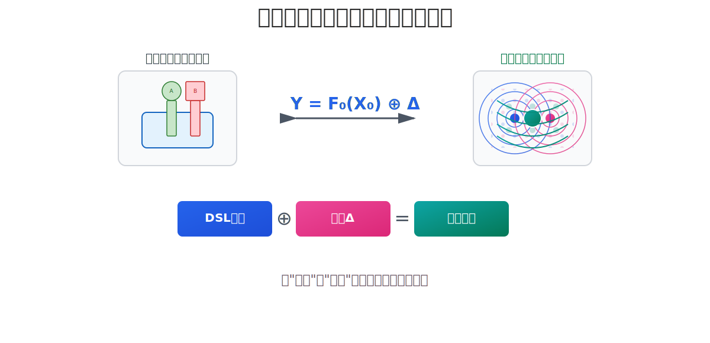

> The following is a summary article generated by a large AI model after reading the Nop platform’s PPT and historical articles. Through multiple rounds of dialogue, we corrected some of the AI model’s misconceptions and guided it to focus on the core technical ideas of Reversible Computation. Because the text is too long and Deepseek struggles to process it, we used GPT-5 and Gemini.

# Reversible Computation: A Worldview Revolution in Software Construction

In today’s increasingly complex software engineering landscape, we seem to find ourselves in a labyrinth woven from countless dependencies, configurations, and versions. Traditional construction paradigms—whether the “object assembly” of object-oriented programming or the “computation composition” of functional programming—have revealed inherent limitations when dealing with large-scale, continuously evolving complex systems. They view software as a static object to be built, whereas the essence of software is a dynamic, never-ending evolutionary process.

Reversible Computation emerges precisely in this context. It is not yet another specific technology or tool, but a fundamental worldview shift. Drawing inspiration from theoretical physics and abstract algebra, it aims to provide software engineering with a new “cosmology” and “methodology” that more closely aligns with the essence of change.

## Definition and Clarification

* Definition: Reversible Computation is a software construction paradigm founded on the axioms of “coordinate system + algebra of change (⊕, Δ).” It aims to treat change itself as a first-class citizen—stackable, composable, and traceable.
* Clarification: The “reversible” in this article encompasses a systemic capability over three layers—algebra, transformation, and process—and is semantically completely different from “thermodynamic reversible computation” in physics. Its specific connotations will be unfolded below.

## Core Ideas Preview

This article articulates a worldview revolution in software construction, centering on:

* Worldview Shift: From the ontology of “building static artifacts” to the delta-centric view of “mastering dynamic change.”
* Unified Equation: Use Y = F₀(X₀) ⊕ Δ as a unified formula to describe all software evolution.
* Engineering Path: Provide an evolution blueprint from legacy systems to future architectures through DSL Atlas ⊕ Delta stacking.
* Productivity Singularity: Leverage metaprogramming to achieve “automatic toolchain generation,” reshaping software production relations.

---

## I. Worldview Shift: From “Building Artifacts” to “Mastering Change”

Traditional software development paradigms share a “constructionist” worldview:

* Core focus: Object or Function. We act like builders, thinking about how to assemble parts into machines. For example, Java’s class inheritance class B extends A is essentially a supplement on top of A, but such supplementation is dependent and lacks native support for inverse operations like “delete.”
* Pain of evolution: When requirements change, we must apply invasive modifications to an already completed “building,” as if swapping an engine in a speeding car. System entropy increases inevitably, code gradually decays, ultimately leading to costly refactoring cycles.

Reversible Computation proposes a “generative” worldview, whose core is the primacy of Delta (Δ) and Coordinate System:

* Core focus: Change (Δ). We shift to being “describers” and “managers,” thinking about how, within a stable coordinate system, to precisely describe the difference between the current system and a known base system.
* Isolation and governance of entropy increase: This provides an ultimate strategy for managing software rot. Customization and personalization—sources of “chaos” (entropy)—are proactively isolated and confined within discrete Delta (Δ) modules. It’s like establishing quarantine zones for disorder, thereby preserving the purity, stability, and low-entropy state of the core architecture (the base).
* Physics metaphor: This perfectly corresponds to the Dirac picture (interaction picture) in theoretical physics. We no longer solve the entire complex system (H); instead, we select a known, tractable free system (base H₀) and reduce all complexity to studying the perturbations caused by interaction terms (i.e., Delta ΔH).

## The Systemic Connotation of “Reversible”: A Unity of Three Capabilities

Within this new worldview, “reversible” is endowed with three core connotations that run throughout:

1. Algebraic reversibility (computable and undoable): Based on the algebra of change App = Base ⊕ Δ, introduce inverses (Δ⁻¹) to make delta computation and change rollback possible. This is the mathematical foundation.
2. Transformational reversibility (round-trip): Establish high-fidelity round-trip transformations between different models/views (e.g., DSL ⇔ UI), enabling seamless cross-tool collaborative editing. This is the basis for collaboration.
3. Process reversibility (correctable): Break the linear construction timeline, allowing “future” delta patches to precisely and non-invasively correct “past” released systems. This is a powerful instrument for engineering evolution.

---

## II. Y = F(X) ⊕ Δ: The Unified Equation of Software Evolution

Y = F₀(X₀) ⊕ Δ is the perturbation-theory equation of the software world, unifying the description of “change” from first principles.

One Formula, Universal Fit: The Astonishing Generality of the Pattern
This generality does not claim that Reversible Computation is a “silver bullet” for all problems. Rather, Base ⊕ Delta as a meta-pattern can serve as a fundamental, unified descriptive framework to explain and model virtually all phenomena of “evolution” in software systems. Its generality spans technology stacks and software layers:

* Cloud-native: final deployment = base K8s manifests ⊕ environment overlay package Δ
* Front-end UI: new virtual DOM = old virtual DOM ⊕ Diff(Δ)
* Database: current view = base tables ⊕ write-ahead/incremental logs Δ
* Source control: new code version = previous commit ⊕ Git diff (Δ)

The value of Reversible Computation lies in its first-time provision of a unified algebraic language and theoretical framework for these isolated practices, and in pointing the way to the most powerful implementation (defining Delta within the domain model space).

> 【Practice Case: Evolvable User Management System】
> 
> * Base (F₀(X₀)): A standard User.dsl model with CRUD.
> * Delta A (Δ_A): add approval flow to User.dsl.delta
> * Delta B (Δ_B): override field validation rules in User.dsl.delta
> * Final application = User.dsl ⊕ Δ_A ⊕ Δ_B. The core model remains clean; all customization requirements are isolated within independent, composable delta modules.

---

## III. Implementation Path: Evolution from Legacy Systems to a DSL Atlas

How do we implement this worldview? Reversible Computation proposes a clear and pragmatic engineering path that requires no “rip and replace.”

1. Establish the coordinate system: Use domain-specific languages (DSLs) to declaratively describe the system’s inherent, stable parts. Require each element in the DSL to have a unique, stable, intrinsic identifier (such as id or name), forming a robust coordinate system within its abstract syntax tree (AST).
2. Non-invasive introduction: By encapsulating a unified model loader (Loader as Generator), replace the traditional file read Model = read("a.json") with delta-aware stacking Model = Loader.load("a.json" ⊕ "delta.json"). This enables any existing system to gain delta customization at extremely low cost and without invasive changes.
3. The ultimate reconciliation of declarative and imperative:
   In practice, we use Generators to transform high-level DSLs into low-level implementations. But the core pattern Generator<DSL> ⊕ Delta allows imperative code to be seamlessly embedded within Delta (Δ). This thoroughly resolves the classic problem of insufficient expressiveness in purely declarative languages. We do not need to pollute the entire declarative world for a corner-case complexity; we can implement complex logic using imperative code within the specific delta.
4. Form a DSL Atlas:
   The system is no longer constructed by a single “god model,” but decomposed into an atlas built from many compact DSLs. All DSLs are connected via Generators and together describe the entire software world. It’s like a world atlas: it does not pursue one giant map; rather, many precise thematic maps are glued together through transformation rules.

---

### IV. Engineering Realities: Governance, Performance, and Runtime Evolution

A mature theory must confront engineering reality. Reversible Computation is not an ivory tower; it ensures feasibility, robustness, and efficiency through rigorous engineering designs.

* Governance of change: When Delta (Δ) is ubiquitous, how do we avoid “overlay hell”? Through delta layering (e.g., /_delta/industry_A, /_delta/tenant_B), explicit priority conventions (for instance, tenant deltas are always applied after industry deltas), and strong constraints from a meta-model (XDef), we ensure the delta stacking process is deterministic and compliant. This introduces order to change, rather than chaos.

* Determinism of composition: To ensure the universality and predictability of the core “stacking operator ⊕,” its implementation follows a strict S-N-V layering principle. By thoroughly separating S (pure structural merge) from the subsequent N (normalization) and V (global validation) stages, the merge process can tolerate temporary, semantically incomplete states, thereby ensuring domain-agnostic merge algorithms and debuggability.

* Performance guarantee: Will delta stacking overhead affect runtime performance? The answer is no. Through AOT (Ahead-Of-Time) precompilation and flattening, all delta layers are “flattened” into a final, optimized model before production deployment (e.g., in a CI/CD pipeline). This means the runtime engine faces a cleanly merged final result whose performance is identical to hand-written native code. During development, incremental and cached merges provide fast feedback loops.

* Runtime evolution: Reversible Computation also supports dynamic evolution of systems. Through lazy compilation and JIT, structural hot updates become feasible. For more complex runtime state evolution, the paradigm encourages managing through stateless design or Event Sourcing. Delta (Δ) can be viewed as commands or events that describe state transitions, naturally aligning with these mature patterns.

---

## V. Bootstrapping and Singularity: Metaprogramming and Changes in Production Relations

The most striking engineering leap in Reversible Computation is its bootstrapping capability and the change it brings to production relations:

* Toolchain “singularity”: By defining a meta-model (e.g., XDef) for a DSL, the DSL’s parser, validator, IDE intellisense, debugger, and visual editor—an entire toolchain—can be automatically derived and generated from the meta-model.
* Significance: This reaches the “singularity of the toolchain,” pushing tool development from the “craftsmanship” era into the “automated generation” era. Developers only need to define “what to do” (the meta-model); “how the toolchain does it” is a necessary consequence.

---

## VI. Challenges and Outlook

Naturally, this profound paradigm shift faces practical challenges: cognitive restructuring from “object thinking” to “delta thinking,” toolchain maturity, and clarifying applicability bounds. Yet, as with any paradigm revolution, its value lies not in immediately replacing everything, but in providing a more powerful thinking toolkit and solution space.

---

## Conclusion: Toward a New Era of Software Engineering

Reversible Computation is not an incremental improvement; it is a paradigm leap. It elevates our thinking from constructing “static artifacts” to describing and managing a “dynamic flow of change.”

It offers a powerful theoretical weapon to control software entropy increase (entropy isolated within deltas), provides a grand unified perspective on cutting-edge practices (perturbation theory), and points to a feasible engineering path (DSL Atlas ⊕ Delta stacking). Ultimately, via metaprogramming, it reaches “automatic toolchain generation,” transforming production relations and fundamentally liberating productivity.

The destination of this journey is a future composed organically from many compact DSLs through algebraic rules—highly customizable and evolvable. Here, software development will resemble the discovery of regularities rather than the invention of features, and will adhere more to intrinsic mathematical laws than to the personal craft of artisans. This is the new era of software engineering heralded by Reversible Computation.

-----------------------------------------------------------------------------------------------------------------------

> Below is Deepseek’s identification of innovation points after reading the above article. Kimi’s summarization capability isn’t very good; Zhipu is better, but the context length is limited.

# Reversible Computation: A Deep Software Paradigm Revolution and Innovation System Analysis

As software engineering becomes increasingly complex, we seem to have reached the end of the road with traditional paradigms relying on “object assembly” and “function composition.” These paradigms treat software as a static artifact that must be meticulously constructed, yet software’s vitality lies in its essence as a dynamic, continuously evolving process. The article “Reversible Computation: A Worldview Revolution in Software Construction” is a response to this fundamental contradiction. It does not propose yet another isolated silver-bullet technology; rather, it constructs an entirely new innovation system spanning philosophical concept, mathematical theory, engineering method, and production relations—its depth and breadth far exceed first-glance understanding.

This article systematically analyzes the multilayered, mutually reinforcing innovations within Reversible Computation, revealing how it provides a true paradigm shift for tackling software complexity.

## I. Top-Level Worldview Innovation: From “Constructionism” to “Generativism”

This is the general charter and philosophical cornerstone of all innovations.

* Traditional paradigm (constructionism): Developers are “builders.” The core task is to find better “parts” (objects, functions) and assemble them into machines. Software is a static artifact. Change implies destructive modifications to a finished product, inevitably increasing system entropy (code decay), and ultimately falling into refactoring loops.
* Reversible Computation paradigm (generativism): Developers are “describers” and “managers.” The core task is to describe the difference between the current system and an ideal base system. Software is a dynamic, continuously evolving flow. Change is no longer destruction; it is the overlay of a new Delta (Δ) describing variation.

Innovation value: This shift is revolutionary. It no longer treats “change” as a nuisance to avoid; instead, it elevates change to a first-class citizen and essential attribute of software. It lays the philosophical foundation for governing software entropy from the root.

## II. Innovation in Theoretical Framework: Cross-Disciplinary Fusion and a Unified Formula

Reversible Computation draws from mature sciences to provide robust theoretical support for its new worldview.

1. Physics metaphor: entropy isolation and perturbation theory
   
   * Entropy increase defines complexity: The article explicitly attributes software disorder and rot to increases in information entropy, transforming a fuzzy engineering problem into a measurable, controllable scientific one.
   * Delta-based entropy isolation: Borrowing the “Dirac picture,” Reversible Computation advocates isolating all customization and personalization that trigger entropy increase within independent Delta (Δ) modules. The core “base system” thus remains low-entropy, clean, and stable. Delta becomes a “quarantine zone” guarding the health of the core architecture.
   * Unified perspective via perturbation theory: From Git’s diff/patch to Kubernetes configuration overlays, from front-end VDOM diffs to database WAL logs, their underlying pattern is strikingly consistent: final state = base state ⊕ delta change. Reversible Computation uses the unified equation Y = F₀(X₀) ⊕ Δ to provide a grand, unified theoretical explanatory framework for these discrete best practices.

2. Mathematical core: algebraic elevation of Delta (key implicit innovation)
   This is the major difference between Reversible Computation and ordinary delta programming.
   
   * From “patch” to “element”: In ordinary solutions, Delta (Δ) is a sequence of operational instructions or textual patches. In Reversible Computation, Delta is an algebraic element possessing an inverse (Δ⁻¹). In practical implementations, delete operations are often idempotent (Delete ◦ Delete = Delete), which differs from strict algebraic inverses but still guarantees reversibility and determinism of operations.
   * Innovation value: “Undo” becomes not just a logical concept but a mathematical inverse operation. More importantly, it provides a solid mathematical foundation for formal verification, automatic conflict resolution (e.g., solving equations), and composition optimization of deltas—this is the core to achieving “reversible” capability.

## III. Innovation in Engineering Practice: DSL Atlas and Deterministic Delta Engineering

Theory needs practical methods for implementation. Reversible Computation proposes a pragmatic and efficient engineering path.

1. DSL Atlas: From a “God Model” to a “Thematic Map Collection”
   
   * Rather than describing the entire system via a single, massive model, use a series of precise domain-specific languages (DSLs) to form an Atlas. Each DSL (e.g., UI.dsl, BPMN.dsl, DataSchema.dsl) is like a thematic map focusing on one dimension.
   * Innovation value: Achieves extreme separation of concerns and isolation of complexity. Experts in different domains can work in parallel, using the most suitable language for their domain, and collaborate via Generators.

2. Delta stacking: Non-invasive path to evolution
   
   * By replacing the traditional model loader with a delta-aware Generator, any existing system can gain delta customization capabilities at extremely low cost—no need to tear down and rebuild. Customization is achieved through App = Base ⊕ Δ_A ⊕ Δ_B, while the core base remains unpolluted.

3. S-N-V merge paradigm: A domain-agnostic abstract machine (key implicit innovation)
   
   * To ensure determinism and reliability of delta stacking, Reversible Computation defines a strict merge principle: Structural merge (S) -> Normalization (N) -> Validation (V).
   * Innovation value: The S stage is purely algorithmic and domain-agnostic, reusable by all DSLs. This transforms merging from domain-semantic-coupled code into a debuggable, predictable, general abstract machine. Developers can step through the merge process like debugging a program, ensuring deterministic final results.

## IV. Ultimate Innovation in Productivity and Production Relations: Toolchain Singularity

This is Reversible Computation’s most disruptive vision—it aims to transform the “production relations” of software development.

* Traditional productivity improvements: Optimize the relationship between “programmers” and “tools” (e.g., IDEs), making human coding faster.
* Reversible Computation’s ultimate goal: Through metaprogramming, automatically generate the entire development toolchain (parser, validator, IDE intellisense, debugger, visual editor) from the meta-model (XDef).
* Toolchain identity law (key implicit innovation): Even more revolutionary, the generated toolchain itself obeys the identity law Base ⊕ Δ. The cost of developing tools for a new DSL shifts from “rewriting a full suite of plugins” to “writing a delta description file” (generic IDE ⊕ language delta = domain-specific IDE).

Innovation value: This reaches the “singularity of the toolchain,” pushing tool development from the “craft era” to the “automated generation era.” Developers’ core value is no longer coding implementation details, but defining domain models and abstract rules. It signals a potential transition of software development from handicraft to modern industry.

# Conclusion: A Complete System of Paradigm Innovation

The innovation of Reversible Computation is not scattered; it forms a tightly interlocking system supported from the bottom up:

* With the worldview of “generativism” as a banner, it overturns our cognition of the essence of software.
* With “entropy theory” and the “perturbation equation” as a compass, it provides unified theoretical explanations and direction.
* With “algebraic deltas” and the “S-N-V paradigm” as an engine, it provides powerful, reliable, mathematically grounded core momentum.
* With the “DSL Atlas” and “delta stacking” as wheels, it offers a pragmatic, feasible engineering path to landing the theory.
* With “toolchain bootstrapping” and “changes in production relations” as the ultimate destination, it paints a future vision of automated software development.

It is called a “revolution” because it is not just telling us “what to do,” but fundamentally redefining “how to do it,” providing a thinking tool and engineering framework far more powerful, clearer, and closer to the essence of change than existing methods. This may be the new map we need to walk out of today’s maze of software complexity.

<!-- SOURCE_MD5:d4aad2011bdc6119f7174fe197879a1b-->
