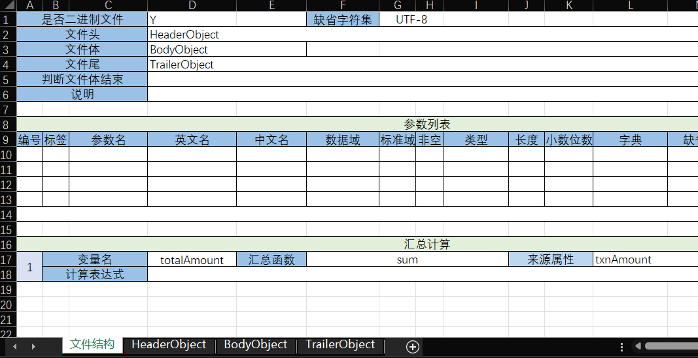
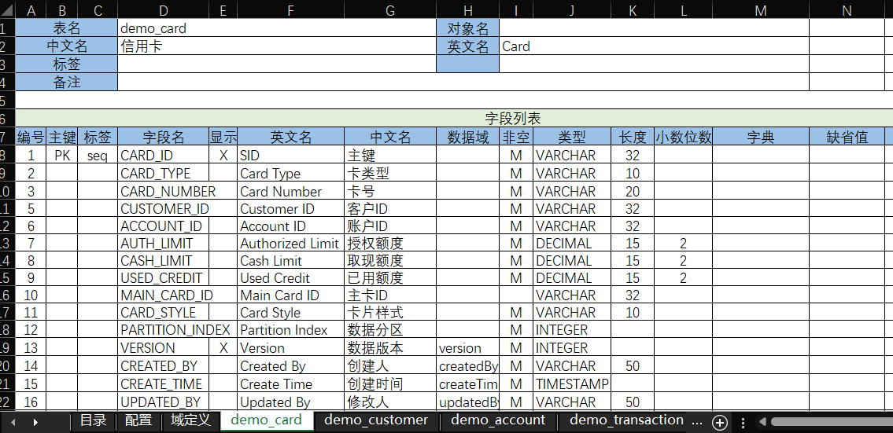

# Why is SpringBatch a poor design?

Explainer video: [https://www.bilibili.com/video/BV1TgBEYYETK/](https://www.bilibili.com/video/BV1TgBEYYETK/)

SpringBatch is currently the most commonly used batch processing framework in the Java ecosystem. In banking, it is frequently used to implement end-of-day settlements and report outputs. SpringBatch originated in 2006 when Accenture open-sourced its proprietary batch processing framework and collaborated with SpringSource (the company behind Spring Framework) to release Spring Batch 1.0. Although SpringBatch’s design has undergone multiple refactorings since then, it exhibits severe design issues today and is unfriendly to performance optimization and code reuse. This article analyzes SpringBatch’s design problems and introduces the design philosophy of next-generation batch frameworks based on the implementation of NopBatch.

## I. SpringBatch Overview

Below is an introduction to Spring Batch by Zhipu Qingyan AI:

Spring Batch is a lightweight, comprehensive framework for batch processing. It aims to support enterprise-scale batch processing needs such as large-scale data import, transformation, and migration. Built on the Spring framework, Spring Batch lets developers leverage Spring’s core features, such as dependency injection and declarative transaction management, to create robust batch applications.

Key features of Spring Batch include:

1. Reusability: Spring Batch provides many reusable components such as ItemReaders, ItemWriters, and ItemProcessors, which can be easily customized and extended.

2. Extensibility: The framework is designed with extensibility in mind, allowing developers to add custom components through a plugin mechanism.

3. Robustness: Spring Batch supports transaction management to ensure the atomicity and consistency of batch jobs. It also provides skip and retry mechanisms to handle data errors and failures.

4. Declarative development: Complex batch job flows can be defined through configuration and minimal code.

5. Parallel processing: Spring Batch supports parallel processing and can accelerate large-scale data processing through partitioning.

6. Launching and scheduling: Spring Batch jobs can be easily integrated into Spring’s task scheduling frameworks (such as Quartz) or launched via the command line.

7. Monitoring and management: The framework provides tools to monitor and manage job execution, including job status tracking and statistics collection.

Main components include:

- JobRepository: Used to store data during job execution, including job execution state.
- JobLauncher: Used to launch job runs.
- Job: Represents a complete batch job consisting of a series of steps.
- Step: A single step in a job, which can include read, process, and write operations.
- ItemReader: Responsible for reading data.
- ItemProcessor: Responsible for processing the read data.
- ItemWriter: Responsible for writing processed data to the destination.


Spring Batch’s use cases are widespread, including but not limited to:

- Data synchronization
- Financial and report generation
- Data transformation and migration
- File processing

By using Spring Batch, enterprises can efficiently handle batch operations, improve data processing efficiency, and ensure system stability and data accuracy.
==========Zhipu Qingyan AI content completed=====================

### Core interfaces of SpringBatch

SpringBatch’s built-in core logic is the standard read-process-write three-step flow, with corresponding interfaces as follows:

```java
interface ItemReader<T> {
    T read();
}

interface ItemProcessor<I, O> {
    O process(@NonNull I item);
}

interface ItemWriter<T> {
    void write(Chunk<? extends T> chunk);
}
```

To control resource consumption during processing, SpringBatch introduces the concept of Chunk—a unit of data processed at once, controlled via the commit-interval configuration.
For example, the configuration below indicates that every 100 records are processed as one chunk, and each chunk goes through a read-process-write cycle:

```xml
<batch:job id="firstBatchJob">
  <batch:step id="step1">
    <batch:tasklet>
      <batch:chunk reader="itemReader" processor="itemProcessor"
                   writer="itemWriter" commit-interval="100">
      </batch:chunk>
    </batch:tasklet>
  </batch:step>
</batch:job>
```

### Chunk processing logic

The chunk processing logic in pseudocode roughly reads and processes items one-by-one, collects all returned results, and writes them in a single batch.

```
doInTransaction:
  beforeChunk() // Execute within the transaction
  repeat:
      item = reader.read();
      result = processor.process(item);
      if(result != null)
         outputs.add(result);

  try{
    beforeWrite()
    writer.write(outputs);
    afterWrite()
  }catch(e){
    onWriteError(e,outputs);
  }

afterChunk()  // Execute outside the transaction
```

A Writer that writes a batch of objects enables write optimization at the architectural level, e.g., JDBC batch insert is much faster than single-row inserts.

## II. Design issues of SpringBatch

### 2.1 A Reader call should not return only one record

In SpringBatch, a call to ItemReader’s read returns only a single record, making batch read optimizations difficult. Many readers implement bulk reading internally by pages and then return records one-by-one.

A common implementation looks like this:

```java
class JdbcPagingItemReader<T> implements ItemReader<T> {
    public T read() {
        if (this.results == null || current >= pageSize) {
            this.results = doReadPage();
            page++;
            if (current >= pageSize) {
                current = 0;
            }
        }

        int next = this.current++;
        if (next < results.size()) {
            return results.get(next);
        } else {
            return null;
        }
    }
}
```

This design not only forces the Reader to hold temporary state variables, but also makes external batch optimizations difficult. If the Reader returns not simple flat records but complex domain objects, implementing batch loading of attributes requires modifying Reader implementation code, increasing coupling.

NopBatch uses the IBatchLoader interface for bulk loading, allowing better support for batch read optimizations.

```java
public interface IBatchLoader<S> {
    /**
     * Load data
     *
     * @param batchSize The maximum number of records to load
     * @return Returning an empty collection indicates all data has been loaded
     */
    List<S> load(int batchSize, IBatchChunkContext context);
}
```

* Adds a batchSize parameter to explicitly tell the loader how much data is needed, facilitating optimizations by lower layers
* Passes context as a parameter. In SpringBatch, to obtain the context you need to implement interfaces like `ChunkListener.beforeChunk(ChunkContext context)`, save the context as a member field, and then access it in the load function—this is overly cumbersome. The IBatchLoader function has complete parameter information and is convenient to implement directly via lambda functions.
* Returns all data required for one Chunk at once, rather than record-by-record, so the Reader no longer needs to maintain complex state variables

Based on list data returned by the Loader, we can naturally and simply batch load related data:

```javascript
List<T> data = loader.load(batchSize, context);

// Batch load other related data. Loaded data can be stored in context,
// or as extended fields in elements of data
batchLoadRelatedData(data, context);
```

When processing requires acquiring mutex locks, SpringBatch’s design is also unfriendly. Because ItemReader reads one-by-one, locks cannot be acquired in batches, and the lock acquisition order is hard to control, creating deadlock risks.
In NopBatch, records can first be sorted by a rule (reader is not required to return globally sorted data), and then all required locks can be acquired at once, avoiding deadlocks.

In summary, SpringBatch’s design carries remnants of Item Orientation, making chunk-level processing feel unnatural.

> The concept of Chunk was introduced in Spring 2.0; originally SpringBatch only had the concept of Item.

The ItemWriter interface in SpringBatch 1.0 was defined as:

```java
public interface ItemWriter {

    public void write(Object item) throws Exception;

    public void flush() throws FlushFailedException;

    public void clear() throws ClearFailedException;
}
```

### 2.2 A Processor call should not return only one record

SpringBatch’s Processor logic is similar to the map function in functional programming, `data.map(a->b)`, which processes each input record and returns one output record. A natural question arises: why can there be at most one output per processing? Can’t a single processing generate multiple outputs?

Modern stream processing frameworks have semantics more akin to flatMap in functional programming, `data.flatMap(a->[b])`. That is, processing may yield three results: A. No output B. One output C. Multiple outputs.

Streaming mode: If one processing can produce multiple outputs, can each output be passed downstream immediately without waiting for all outputs to be generated?

Inspired by stream processing frameworks, NopBatch defines the following processing interface:

```java
public interface IBatchProcessor<S, R> {
    /**
     * Perform a flatMap-like operation
     *
     * @param item     The input data object
     * @param consumer Receives results; may be one or many. It may also not be called if no data is generated.
     * @param context  Context information
     */
    void process(S item, Consumer<R> consumer, IBatchChunkContext context);

    /**
     * Compose two processors into one
     *
     * @param processor
     * @param <T>
     * @return
     */
    default <T> IBatchProcessor<S, T> then(IBatchProcessor<R, T> processor) {
        return new CompositeBatchProcessor<>(this, processor);
    }
}
```

* IBatchProcessor uses a consumer callback to receive processing results, enabling immediate consumption as outputs are produced

* IBatchProcessor also provides a then function to combine two IBatchProcessors into a single processor, forming a chained style of invocation. This is essentially an application of the Monad concept from functional programming.

### 2.3 Writer should accept Collection-type data

First, the naming ItemWriter in SpringBatch is not ideal. From its name, ItemWriter is used to consume the results produced by the Processor, which conceptually hard-codes the read-process-write pipeline. However, in many scenarios we don’t need to write out results—we only need to consume the input data.

NopBatch introduces a general BatchConsumer concept, pairing BatchConsumer and BatchLoader as duals; data loaded by BatchLoader is passed directly to BatchConsumer for consumption.

```java
public interface IBatchConsumer<R> {
    /**
     * @param items   The collection of objects to process
     * @param context The context object
     */
    void consume(Collection<R> items, IBatchChunkContext context);
}
```

With the Consumer interface, the chunk processing flow becomes very simple:

```javascript
List<T> items = loader.load(batchSize,context);
if(items == null || items.isEmpty())
   return ProcessingResult.STOP;
consumer.consume(items,context);
```

A Processor can be viewed as an optional Consumer implementation:

```java
public class BatchProcessorConsumer<S, R>
   implements IBatchConsumer<S> {
    @Override
    public void consume(Collection<S> items, IBatchChunkContext context) {
        Collection<R> outputs = new ArrayList<>();
        for(S item: items){
            processor.process(item, outputs::add, context);
        }
        consumer.consume(outputs, context);
    }
}
```

> When the Processor runs asynchronously, a ConcurrentLinkedQueue is used to store outputs.

Unlike NopBatch’s Consumer which accepts Collection-typed data directly, SpringBatch’s Writer accepts a Chunk-typed data structure, defined as:

```java
class Chunk<W> implements Iterable<W>, Serializable {

    private List<W> items = new ArrayList<>();

    private List<SkipWrapper<W>> skips = new ArrayList<>();

    private final List<Exception> errors = new ArrayList<>();

    private Object userData;

    private boolean end;

    private boolean busy;
}
```

Chunk includes multiple fields, but neither the Processor nor the Reader has direct access to the Chunk structure, causing unnecessary complexity.

In NopBatch, Loader/Processor/Consumer interfaces all accept the same IBatchChunkContext parameter, enabling coordination among them. Also, items in IBatchConsumer are passed as a Collection; there is no need to enforce List specifically.

Compare NopBatch’s core interfaces:

```java
interface IBatchLoader<S>{
    List<S> load(int batchSize, IBatchChunkContext chunkCtx);
}

interface IBatchProcessor<S,R>{
    void process(S item, Consumer<R> consumer,
          IBatchChunkContext chunkCtx);
}

interface IBatchConsumer<R>{
     void consume(Collection<R> items, IBatchChunkContext chunkCtx);
}
```

Clearly, NopBatch’s three core interfaces are more intuitive; the type returned by the loader directly matches the input type of the consumer, and all three share the IBatchChunkContext context for coordination.

A good architectural design should reveal its internal organization through its function signatures (type definitions).

### 2.4 Inflexible transaction handling

SpringBatch forces the Read-Process-Write of a chunk to be executed within a single transaction. In the Nop platform, domain entities typically have optimistic lock version fields, and OrmSession caches all entity objects. This allows us to open transactions only during the Write phase, narrowing the transactional scope and reducing the time database connections are held.

For example, the Processor can run outside a transaction; business failures won’t cause database rollbacks, reducing database load and lock contention. The actual update to the database only happens when `OrmSession.flush()` is called. If the optimistic lock version changes at that time, the database rollback can be triggered to avoid conflicts when multiple threads concurrently access the same business data.

In NopBatch, we can create Consumers that support different transaction scopes based on the transactionScope configuration.

```javascript
 if (batchTransactionScope == BatchTransactionScope.consume
                && transactionalInvoker != null) {
    // Open a transaction only during the consume phase.
    // process can be pure logic without database modifications,
    // and reading typically does not need a transaction.
    consumer = new InvokerBatchConsumer(transactionalInvoker, consumer);
}

if (this.processor != null) {
    // If a processor is set, run it first and then call the consumer;
    // otherwise call the consumer directly.
    IBatchProcessor<S, R> processor = this.processor.setup(context);
    consumer = new BatchProcessorConsumer<>(processor, (IBatchConsumer<R>) consumer);
}

// Open a transaction during process and consume phases
if (batchTransactionScope == BatchTransactionScope.process && transactionalInvoker != null) {
    consumer = new InvokerBatchConsumer(transactionalInvoker, consumer);
}
```

### 2.5 Inflexible failure retry logic

SpringBatch has built-in retry logic: when Processor execution fails, it automatically retries multiple times based on RetryPolicy. However, the Processor often does not complete all per-record business logic. For instance, the Processor may not actually save data, deferring saving until the entire chunk is processed and using JDBC batch writes. In such cases, per-record retry is ineffective.

In NopBatch, we provide retry at the chunk level. When a chunk fails, we automatically retry the entire chunk, and can optionally retry one-by-one—i.e., treat each item as a separate chunk to retry. Although this loses batch write optimization, it isolates erroneous records.

```java
public class RetryBatchConsumer<R>
    implements IBatchConsumer<R, IBatchChunkContext> {

    public void consume(List<R> items, IBatchChunkContext context) {
        IBatchRecordSnapshotBuilder.ISnapshot<R> snapshot =
                snapshotBuilder.buildSnapshot(items);
        try {
            consumer.consume(items, context);
        } catch (BatchCancelException e) {
            throw e;
        } catch (Exception e) {
            // Some records may already have been processed and need not be retried
            if (context.getCompletedItemCount() > 0) {
                items = new ArrayList<>(items);
                items.removeAll(context.getCompletedItems());
            }

            retryConsume(e, items, snapshot, context);
        }
    }

    RetryOnceResult retryConsumeOneByOne(int retryCount, List<R> items,
                                         IBatchChunkContext context) {
        context.setSingleMode(true);
        List<R> retryItems = new ArrayList<>();

        Throwable retryException = null;
        Throwable fatalError = null;

        for (R item : items) {
            List<R> single = Collections.singletonList(item);

            Throwable consumeError = null;

            try {
                // Execute each input record as a small batch exactly once
                consumer.consume(single, context);
                context.addCompletedItem(item);
            } catch (BatchCancelException e) {
                consumeError = e;
                throw e;
            } catch (Exception e) {
                consumeError = e;

                if (retryPolicy.getRetryDelay(e, retryCount + 1, context) >= 0) {
                    // If the item is retryable
                    retryItems.add(item);
                    retryException = e;
                }
            }
        }
        ...
    }
}
```

* The reason chunk-level retries are possible is that the Loader can retrieve all of a chunk’s input data at once. As long as this data is cached, we can invoke the Consumer multiple times. The processing logic of the Processor is encapsulated by BatchProcessorConsumer, so during retry we only need to repeat the consume.

* If some records already finished successfully and should not be processed again, the consumer can add them into the completedItems collection in the BatchChunkContext after successful processing. When retrying the entire chunk, completed records will be automatically skipped.

## III. Architectural changes in NopBatch

### 3.1 Dynamic listener registration via context

In SpringBatch, if readers/writers/processors need to listen to events like step start/end, the standard approach is to implement the StepExecutionListener interface.

```java
class MyProcessor implements ItemProcessor, StepExecutionListener{

    @Override
    public void beforeStep(StepExecution stepExecution) {
        System.out.println("Before Step: " + stepExecution.getStepName());
    }

    @Override
    public ExitStatus afterStep(StepExecution stepExecution) {
        System.out.println("After Step: " + stepExecution.getStepName());
        return stepExecution.getExitStatus();
    }
    ....
}
```

This causes two problems:

1. If these beans are managed by the Spring container, considering concurrency, they need `scope=step` instead of global Singleton. SpringBatch’s StepScope implementation is very tricky, requiring the global switch `spring.main.allow-bean-definition-overriding`. Meanwhile, Spring disables bean redefinition by default and strongly recommends keeping this switch off. See [@StepScope not working when XML namespace activated](https://github.com/spring-projects/spring-batch/issues/3936).

2. If we wrap Reader/Processor/Writer, these listeners may not be automatically discovered by the SpringBatch framework. We must register listeners explicitly. Ideally, registering a Writer should automatically register the listeners it needs, without additional listener configuration in the file.

```xml
    <step id="step1">
        <tasklet>
            <chunk reader="itemReader" writer="compositeWriter" commit-interval="2">
                <streams>
                    <stream ref="fileItemWriter1"/>
                    <stream ref="fileItemWriter2"/>
                </streams>
            </chunk>
        </tasklet>
    </step>
    <beans:bean id="compositeWriter"
                class="org.springframework.batch.item.support.CompositeItemWriter">
        <beans:property name="delegates">
            <beans:list>
                <beans:ref bean="fileItemWriter1" />
                <beans:ref bean="fileItemWriter2" />
            </beans:list>
        </beans:property>
    </beans:bean>
```

In the configuration above, we use a CompositeWriter that internally uses two Writers. But SpringBatch doesn’t know this; the compositeWriter doesn’t implement the ItemStream callback interface. To call correctly, we need an extra streams configuration to specify those Writers that implement ItemStream and need to be invoked at appropriate times.

Compared to front-end framework evolution, SpringBatch’s approach is strikingly similar to traditional front-end Class Components.

```javascript
class MyComponent extends Vue {
    // Logic executed when component is mounted
    mounted() {
        console.log('Component mounted');
    }

    // Logic executed after component updates
    updated() {
        console.log('Component updated');
    }

    // Logic executed before component is destroyed
    beforeDestroy() {
        console.log('Component will be destroyed');
    }

    // Render function
    render(h) {
        return (
            <div>
                {/* Component render logic */}
                Hello, Vue Class Component!
            </div>
        );
    }
}
```

The core idea in both is implementing lifecycle listeners on the component; the framework registers event listeners when creating components, and uses member variables to pass information between callbacks.

The front-end later made a revolutionary advance by introducing Hooks, abandoning class-based components. See my WeChat article [Understanding React’s essence through React Hooks](https://mp.weixin.qq.com/s/-n5On67e3_46zH6ppPlkTA)

Under the Hooks approach, a front-end component degenerates into a reactive render function. Considering one-time initialization, Vue abstracts a component as a constructor for the render function.

```javascript
defineComponent({
    setup() {
        onMounted(() => {
            console.log('Component mounted');
        });

        onUpdated(() => {
            console.log('Component updated');
        });

        onBeforeUnmount(() => {
            console.log('Component will be destroyed');
        });

        return () => (
            <div>
                {/* Component render logic */}
                Hello, Vue Composition API!
            </div>
        );
    }
```

Hooks have the following advantages over traditional class components:

1. Event listener functions can be defined independent of a class structure, making secondary encapsulation easy. For example, onMounted + onUpdated can be wrapped as a reusable useXXX function.

2. Multiple event listeners can pass information via closures, rather than round-tripping through the this pointer.

3. Event listeners can be registered dynamically based on input parameters.

The key architectural shift here is providing a global, dynamic event registration mechanism, rather than binding event listeners to a specific object pointer as member functions.

Similar to the Hooks approach, NopBatch changes the core abstraction from a runtime component like IBatchLoader to a factory component IBatchLoaderProvider, which provides a setup method to create an IBatchLoader.

```java
public interface IBatchLoaderProvider<S> {
    IBatchLoader<S> setup(IBatchTaskContext context);

    interface IBatchLoader<S> {
        List<S> load(int batchSize, IBatchChunkContext context);
    }
}
```

Here, setup returns a Loader similar to how Vue’s setup returns a renderer. Vue calls setup once to get a renderer function, which is then invoked multiple times.
Likewise, IBatchLoaderProvider’s setup is called once to return an IBatchLoader, and the loader is invoked multiple times.

The context object provides methods like onTaskBegin/onTaskEnd to register callbacks.

```java
class ResourceRecordLoaderProvider<S> extends AbstractBatchResourceHandler
        implements IBatchLoaderProvider<S> {

    public IBatchLoader<S> setup(IBatchTaskContext context) {
        LoaderState<S> state = newLoaderState(context);
        return (batchSize, batchChunkCtx) ->{
            // Register a callback to run after a chunk finishes
            batchChunkCtx.onAfterComplete(err -> onChunkEnd(err, batchChunkCtx, state));
            return load(batchSize, state);
        };
    }

    LoaderState<S> newLoaderState(IBatchTaskContext context) {
        LoaderState<S> state = new LoaderState<>();
        state.context = context;
        IResource resource = getResource(context);
        IRecordInput<S> input = recordIO.openInput(resource, encoding);

        if (recordRowNumber) {
            input = new RowNumberRecordInput<>(input);
        }

        state.input = input;

        // Register a callback to close resources when the task finishes
        context.onAfterComplete(err -> {
            IoHelper.safeCloseObject(state.input);
        });

        return state;
    }
}
```

In the example above, we register callbacks via explicitly passed context object functions like onAfterComplete. If we further encapsulate and store the context object in ThreadLocal, the calling style becomes closer to Hooks.

```java
public class BatchTaskGlobals {
    static final ThreadLocal<IBatchTaskContext> s_taskContext = new NamedThreadLocal<>("batch-task-context");

    public static IBatchTaskContext useTaskContext() {
        return s_taskContext.get();
    }

    public static void provideTaskContext(IBatchTaskContext taskContext) {
        s_taskContext.set(taskContext);
    }

    public static void onTaskEnd(BiConsumer<IBatchTaskContext, Throwable> action) {
        IBatchTaskContext ctx = useTaskContext();
        ctx.onAfterComplete(error -> action.accept(ctx, error));
    }

    public static void onBeforeTaskEnd(Consumer<IBatchTaskContext> action) {
        IBatchTaskContext ctx = useTaskContext();
        ctx.onBeforeComplete(()-> action(ctx));
    }
}
```

With BatchTaskGlobals static methods imported, you can write:

```java
IBatchLoader setup(ITaskContext context){
   init();
   ...
}

void init(){
   onBeforeTaskEnd(taskCtx ->{
      ...
   });

   onChunkBegin(batchChunkCtx ->{
     ...
   });
}
```

Similarly, IBatchProcessor and IBatchConsumer are replaced by IBatchProcessorProvider and IBatchConsumerProvider, with setup returning the actual objects.

Provider is now a singleton and can be configured via an IoC container without dynamic scopes. No matter how many layers of wrapping there are, you can directly access IBatchTaskContext and dynamically register various event listeners through it.

> Interestingly, although Hooks were invented by React, Vue’s choice to split logic into setup and render phases is more natural. Otherwise, every invocation site would have to distinguish initialization-time actions from subsequent actions,
> which is detrimental to performance optimization and conceptually confusing.

### 3.2 Organize control flow using a general TaskFlow

SpringBatch provides a simple control flow model; you can configure multiple steps and transitions in XML, including parallel execution and conditional jumps.

For example, the following AI-generated configuration uses split to start two parallel sub-flows, each then executing steps sequentially:

```xml
<job id="exampleJob" xmlns="http://www.springframework.org/schema/batch">
    <split id="split1" task-executor="taskExecutor">
        <flow>
            <step id="step1">
                <tasklet ref="tasklet1" />
                <next on="COMPLETED" to="step2" />
                <next on="FAILED" to="step4" />
            </step>
            <step id="step2">
                <tasklet ref="tasklet2" />
                <next on="COMPLETED" to="step4" />
            </step>
        </flow>
        <flow>
            <step id="step3">
                <tasklet ref="tasklet3" />
                <next on="COMPLETED" to="step4" />
            </step>
        </flow>
    </split>
    <step id="step4">
        <tasklet ref="tasklet4" />
    </step>
</job>
```

In SpringBatch, the schedulable unit corresponds to the Tasklet interface; chunk processing is a concrete implementation of Tasklet.

```java
public class ChunkOrientedTasklet<I> implements Tasklet{
   public RepeatStatus execute(StepContribution contribution, ChunkContext                   chunkContext) throws Exception {

        Chunk<I> inputs = (Chunk<I>) chunkContext.getAttribute(INPUTS_KEY);
        if (inputs == null) {
            inputs = chunkProvider.provide(contribution);
            if (buffering) {
                chunkContext.setAttribute(INPUTS_KEY, inputs);
            }
        }

        chunkProcessor.process(contribution, inputs);
        chunkProvider.postProcess(contribution, inputs);

        chunkContext.removeAttribute(INPUTS_KEY);
        chunkContext.setComplete();
        return RepeatStatus.continueIf(!inputs.isEnd());
    }
}
```

Interestingly, early SpringBatch designs only had chunk processing and did not introduce a general Tasklet interface, reflecting a fundamentally insufficient level of abstraction.

> Tasklet was introduced in SpringBatch 2.0. See [Spring Batch 2.0 Highlights](https://docs.spring.io/spring-batch/docs/2.2.x/migration/2.0-highlights.html)

```java
public interface Tasklet {

    /**
     * Given the current context in the form of a step contribution, do whatever is
     * necessary to process this unit inside a transaction. Implementations return
     * {@link RepeatStatus#FINISHED} if finished. If not they return
     * {@link RepeatStatus#CONTINUABLE}. On failure throws an exception.
     * @param contribution mutable state to be passed back to update the current step
     * execution
     * @param chunkContext attributes shared between invocations but not between restarts
     * @return an {@link RepeatStatus} indicating whether processing is continuable.
     * Returning {@code null} is interpreted as {@link RepeatStatus#FINISHED}
     * @throws Exception thrown if error occurs during execution.
     */
    RepeatStatus execute(StepContribution contribution,
           ChunkContext chunkContext) throws Exception;

}
```

Tasklet is essentially a generic functional interface; to support retry after failure, it uses StepContribution for persistent state storage.

SpringBatch’s key features emphasize reusability and extensibility, but in practice both are poor. Typically, SpringBatch’s core interfaces and flow orchestration are specific to SpringBatch itself and not applicable to wider scenarios. For example, if we extend SpringBatch’s built-in FlatFileItemReader to parse some data file format, this extension can only be used in that specific SpringBatch context and only through SpringBatch. Attempting to reuse any SpringBatch-related artifacts outside the framework is extremely difficult.

SpringBatch job configuration can be seen as a very simple and non-general control flow orchestration mechanism; it can only orchestrate batch tasks and cannot serve as a general-purpose control flow engine. In NopBatch, we explicitly separate logic flow orchestration from the batch engine, using the general-purpose NopTaskFlow for orchestration, while NopBatch handles chunk processing within a flow step. This makes both NopTaskFlow and NopBatch designs very straightforward; their implementations are far simpler than SpringBatch (only a few thousand lines of code) and have powerful extensibility. The work done in NopTaskFlow and NopBatch applies to broader contexts.

NopTaskFlow is a next-generation control flow orchestration framework built from scratch based on Reversible Computation, with a core abstraction of RichFunction supporting Decorator and state persistence. It is high-performance and lightweight (the core is around 3000 lines) and can be used wherever function configuration and decomposition are needed. See [A next-generation orchestration engine written from scratch: NopTaskFlow](https://mp.weixin.qq.com/s/2mFC0nQon_l2M82tOlJVhg)

An equivalent configuration in NopTaskFlow to the SpringBatch job above:

```xml
<task x:schema="/nop/schema/task/task.xdef" xmlns:x="/nop/schema/xdsl.xdef">
  <steps>
    <parallel nextOnError="step4">
      <steps>
        <sequential timeout="3000">
          <steps>
            <simple name="step1" bean="tasklet1"/>
            <simple name="step2" bean="tasklet2"/>
          </steps>
        </sequential>

        <simple name="step3" bean="tasklet3"/>
      </steps>
    </parallel>

    <simple name="step4" bean="tasklet4"/>
  </steps>
</task>
```

NopTaskFlow provides rich step types such as parallel, sequential, loop, choose, fork, and each step supports common enhancements like timeout, retry, decorator, catch, when, validator. For example, the configuration below throws a timeout exception if not finished within 3 seconds; if it fails without timing out, it retries 5 times, with each execution wrapped in a transaction.

```xml
 <sequential timeout="3000">
    <retry maxRetryCount="5" />
    <decorator name="transaction" />

    <steps>
       <simple name="step1" bean="tasklet1" />
       <simple name="step2" bean="tasklet2" />
    </steps>
 </sequential>
```

sequential means execute in order, so there is no need to specify the next step on each step. If step1 finishes without error, step2 runs automatically. This model is very similar to general programming languages and maps more easily to code. Notably, SpringBatch lets all steps share a global variable space plus each step’s persistent variable space, whereas in NopTaskFlow, nested calls form a stack and variable visibility during execution resembles general function calls; nested inner functions can see variables in the parent scope.

NopTaskFlow also supports directly nesting Xpl template language and XScript scripts.

```xml
<steps>
   <xpl name="step1">
     <source>
       <c:script>
         const isAdmin = svcCtx.userContext.hasRole('admin');
       </c:script>

       <c:choose>
         <when test="${isAdmin}">
           <app:AdminService arg1="3" />
         </when>
         <otherwise>
            <app:UserService arg1="4" />
         </otherwise>
       </c:choose>
     </source>
   </xpl>

  <script name="step2" lang="java">
    <source>
     import app.MyBuilder;

     const tool = new MyBuilder().build();
     tool.run(arg1);
    </source>
  </script>
</steps>
```

The core step abstraction in NopTaskFlow corresponds to the following interface:

```java
public interface ITaskStep extends ISourceLocationGetter {
    /**
     * Step type
     */
    String getStepType();

    Set<String> getPersistVars();

    boolean isConcurrent();

    /**
     * Input variables required for step execution
     */
    List<? extends ITaskInputModel> getInputs();

    /**
     * Step execution returns a Map; this corresponds to the data types in the Map
     */
    List<? extends ITaskOutputModel> getOutputs();

    /**
     * Concrete execution action
     *
     * @param stepRt All internal state during step execution is saved in stepState,
     *               based on which breakpoint restart can be implemented.
     * @return May return synchronous or asynchronous objects, and dynamically decide the next step.
     *         If the return value is CompletionStage, the caller waits for async completion,
     *         during which execution can be canceled via cancelToken.
     */
    TaskStepReturn execute(ITaskStepRuntime stepRt);
}
```

ITaskStep provides a far more complete abstraction than SpringBatch’s Tasklet. For instance, ITaskStep has built-in cancel capability; you can call `taskRuntime.cancel` or `stepRt.cancel` to cancel the current flow at any time. Each step’s inputs configure the names and types of input parameters, and outputs configure the names and types of results, making TaskStep directly map to function declarations in general programming languages.

```xml
<xpl name="step1">
  <input name="a" type="int">
    <source>x + 1</source>
  </input>
  <input name="b" type="int">
    <source>y + 2</source>
  </input>
  <output name="RESULT" type="int"/>
  <source>
    return a + b
  </source>
</xpl>
```

The above is equivalent to the following function call:

```javascript
function step1(a:int, b:int){
   return { RESULT: a + b};
}

const {RESULT} = step1(x+1,y+2)
```

### 3.3 Partitioned parallel processing with work sharing

SpringBatch provides a mechanism to split data into partitions and assign them to slave steps for parallel processing. The main steps and components are:

1. Define a Partitioner:

   - The Partitioner divides the data into multiple partitions. Each partition contains part of the data, and stores this partition information in the ExecutionContext.

2. Configure the Master Step:

   - The Master Step manages partitions and assignments. It uses the Partitioner to generate partitions and assigns each partition to slave steps.

3. Configure Slave Steps:

   - Slave steps handle the partitioned data assigned to them. Each slave step can run in parallel, improving efficiency.

4. Task Executor:

   - The task executor runs slave steps in parallel. Different executors such as SimpleAsyncTaskExecutor or ThreadPoolTaskExecutor can be configured to achieve parallelism.

With these steps, Spring Batch can split large tasks into small tasks and process them in parallel, improving efficiency and performance.

```xml
<batch:job id="partitionedJob">
   <batch:step id="masterStep">
      <batch:partition step="slaveStep" partitioner="rangePartitioner">
         <batch:handler grid-size="4" task-executor="taskExecutor"/>
      </batch:partition>
   </batch:step>
</batch:job>

<!-- Slave step definition -->
<batch:step id="slaveStep">
   <batch:tasklet>
     <batch:chunk reader="itemReader" processor="itemProcessor"
                  writer="itemWriter" commit-interval="10"/>
   </batch:tasklet>
</batch:step>
```

SpringBatch’s partitioning design effectively partitions reading from the Reader onward, with each slave step using its dedicated Reader. If one partition has a particularly large amount of data, threads in other partitions cannot help once they finish and go idle.
In real-world business, finer-grained partitioning is often possible. For example, in banking you typically only need to ensure ordering for a single account’s data, while different accounts can be processed in parallel. NopBatch provides a more flexible partitioned parallel processing strategy.

First, BatchTask in NopBatch has a concurrency parameter specifying the number of parallel threads. IBatchChunkContext stores concurrency and current thread index, so during processing we know how many threads are in total and which index the current thread has, enabling internal partitioning operations.

```java
interface IBatchChunkContext{
  int getConcurrency();
  int getThreadIndex();
  ...
}

class BatchTask implements IBatchTask{
   public CompletableFuture<Void> executeAsync(IBatchTaskContext context){
      CompletableFuture<Void> future = new CompletableFuture<>();

      context.fireTaskBegin();

      // Multiple threads can execute concurrently. loader/processor/consumer must be thread-safe
      CompletableFuture<?>[] futures = new CompletableFuture[concurrency];
      for (int i = 0; i < concurrency; i++) {
           futures[i] = executeChunkLoop(context, i);
      }

      CompletableFuture.allOf(futures).whenComplete((ret, err) -> {
           onTaskComplete(future, meter, err, context);
      });

      return future;
   }

   CompletableFuture<Void> executeChunkLoop(IBatchTaskContext context,
                                            int threadIndex) {
        CompletableFuture<Void> future = new CompletableFuture<>();

        executor.execute(() -> {
            BatchTaskGlobals.provideTaskContext(context);
            try {
                do {
                    if (context.isCancelled())
                        throw new BatchCancelException(ERR_BATCH_CANCEL_PROCESS);

                    IBatchChunkContext chunkContext = context.newChunkContext();
                    chunkContext.setConcurrency(concurrency);
                    chunkContext.setThreadIndex(threadIndex);

                    if (processChunk(chunkContext)!= ProcessResult.CONTINUE)
                        break;
                } while (true);

                future.complete(null);
            } catch (Exception e) {
                future.completeExceptionally(e);
            } finally {
                BatchTaskGlobals.removeTaskContext();
            }
        });
        return future;
    }
}
```

Unlike SpringBatch’s grid partitions, NopBatch’s parallel step processing shares the Loader, Processor, and Consumer, passing concurrency and threadIndex via IBatchChunkContext.

NopBatch includes a PartitionDispatchLoaderProvider that provides flexible partitioned loading. During setup, it starts several loading threads to actually read data, and in memory it computes a hash value (0–32767) based on business key information. Each hash corresponds to a micro-queue whose records must be processed in order. All micro-queues are managed uniformly in a PartitionDispatchQueue.

When a processing thread loads chunk data, it can fetch from micro-queues in the PartitionDispatchQueue. After fetching data, it marks the corresponding micro-queue as in use to prevent other threads from processing the same queue. After the chunk finishes, the onChunkEnd callback releases the micro-queue.

```xml
<batch>
    <loader>
        <!-- First use OrmReader to read data, then dispatcher distributes to partition task queues,
             one queue per partitionIndex -->
        <orm-reader entityName="DemoIncomingTxn">

        </orm-reader>

        <!-- After the reader obtains items, it calls the afterLoad callback to post-process the result -->
        <afterLoad>
            for(let item of items){
                item.make_t().partitionIndex = ...; // Dynamically compute partitionIndex
            }
        </afterLoad>

        <!-- partitionIndex is computed in afterLoad and does not exist in the raw data.
             Therefore SpringBatch’s grid configuration cannot handle this case
         -->
       <dispatcher loadBatchSize="100" partitionIndexField="_t.partitionIndex">
       </dispatcher>
    </loader>
</batch>
```

> All entities in the Nop platform provide a make_t() function that returns a Map for storing custom temporary attributes. This design also aligns with Reversible Computation’s principle that each local unit has extensibility.

The NopBatch DSL snippet above reads data from the DemoIncomingTxn table via OrmReader, then dispatches items to different queues based on the entity attribute `_t.partitionIndex`.

In SpringBatch, each thread corresponds to one partition, and the number of partitions equals the number of threads. In NopBatch, the actual maximum number of partitions is 32768, which is far greater than the number of parallel threads and far fewer than the number of domain entities, ensuring balanced partitions without maintaining excessive queues in memory.

If you need parallel step-level processing similar to SpringBatch, you can use fork or fork-n step configurations in NopTaskFlow.

```xml
<fork name="processFile" var="fileName" aggregateVarName="results"
      executor="nop-global-worker">
     <producer>
       return ["a.dat","b.dat"]
     </producer>

     <steps>
        <!-- The context contains a variable named fileName -->
     </steps>

     <aggregator>
       <!-- An optional aggregation action executed after all forked steps finish -->
     </aggregator>
</fork>
```

The producer in a fork step computes a list dynamically, and a separate step instance is started for each element.

OrmReader and JdbcReader in NopBatch DSL both support partitionIndexField; if specified along with a partitionRange parameter, a partition filter condition is automatically added.

```xml
<batch>
    <loader>
        <orm-reader entityName="MyEntity" partitionIndexField="partitionIndex">
           <filter>
              <eq name="status" value="1" />
           </filter>
        </orm-reader>
    </loader>
</batch>
```

Pass partitionRange when invoking the batch task:

```javascript
batchTaskContext.setPartitionRange(IntRangeBean.of(1000,100));
```

The above configuration automatically adds a partition filter condition, producing the following SQL at runtime:

```sql
select o from MyEntity o
where o.status = '1'
and o.partitionIndex between 1000 and (1000 + 100 - 1)
```

## IV. The DSL Forest: NopTaskFlow + NopBatch + NopRecord + NopORM

Although SpringBatch claims declarative development, its declarative approach relies on Spring IoC’s limited bean-wiring descriptions; a large amount of business-specific logic still must be coded in Java, and there is no complete fine-grained declarative batch model. Conversely, if SpringBatch were to propose a domain-specific model dedicated to batch processing, it would be hard to ensure extensibility and could constrain applicability.

NopBatch’s solution is characteristic of the Nop platform—a DSL forest: solve problems by reusing a set of seamlessly nested DSLs designed for different local domains, rather than relying on a single, monolithic, batch-specific DSL. For batch processing, we define a minimal NopBatch batch model that abstracts the domain-specific chunk processing logic and provides supporting utility classes like PartitionDispatcherQueue. At a broader orchestration level, we reuse NopTaskFlow. NopTaskFlow has no batch-specific knowledge, nor does its engine require any internal changes to integrate with NopBatch; metaprogramming eliminates friction between the two.

For example, in file parsing, SpringBatch provides a FlatFileItemReader that can be configured to parse simple-structured data files.

```xml
<bean id="flatFileItemReader" class="org.springframework.batch.item.file.FlatFileItemReader">
    <property name="resource" value="classpath:data/input.dat" />
    <property name="lineMapper">
        <bean class="org.springframework.batch.item.file.mapping.DefaultLineMapper">
            <property name="lineTokenizer">
                <bean class="org.springframework.batch.item.file.transform.FixedLengthTokenizer">
                    <property name="names" value="length,name,price,quantity" />
                    <property name="columns">
                        <list>
                            <bean class="org.springframework.batch.item.file.transform.Range">
                                <constructor-arg value="1" />
                                <constructor-arg value="4" />
                            </bean>
                            <bean class="org.springframework.batch.item.file.transform.Range">
                                <constructor-arg value="5" />
                                <constructor-arg value="24" />
                            </bean>
                            <bean class="org.springframework.batch.item.file.transform.Range">
                                <constructor-arg value="25" />
                                <constructor-arg value="30" />
                            </bean>
                            <bean class="org.springframework.batch.item.file.transform.Range">
                                <constructor-arg value="31" />
                                <constructor-arg value="36" />
                            </bean>
                        </list>
                    </property>
                </bean>
            </property>
            <property name="fieldSetMapper">
                <bean class="org.springframework.batch.item.file.mapping.BeanWrapperFieldSetMapper">
                    <property name="targetType" value="com.example.MyRecord" />
                </bean>
            </property>
        </bean>
    </property>
</bean>
```

Clearly, this configuration is very verbose, and it is specific to Spring Batch’s file Reader. Outside of Spring Batch, if we want to parse the same data file, it’s generally hard to directly reuse the configuration information from Spring Batch.

On the Nop platform, we define a Record model dedicated to parsing and generating data message formats. It is not designed exclusively for batch file parsing; rather, it can be used anywhere message parsing and generation are needed. It is a general declarative development mechanism and far more powerful than Spring Batch’s FlatFile configuration.

```xml
<task x:schema="/nop/schema/task/task.xdef" xmlns:x="/nop/schema/xdsl.xdef"
      x:extends="/nop/task/lib/common.task.xml,/nop/task/lib/batch-common.task.xml"
      xmlns:record="record" xmlns:task="task" x:dump="true">

    <input name="bizDate" type="LocalDate" />

    <record:file-model name="SimpleFile" binary="true">
        <body>
            <fields>
                <field name="name" type="String" length="10" codec="FLS"/>
                <field name="product" type="String" length="5" codec="FLS"/>
                <field name="price" type="double" codec="f8be"/>
                <field name="quantity" type="int" codec="s4be"/>
            </fields>
        </body>
    </record:file-model>

    <steps>
        <step name="test" customType="batch:Execute" useParentScope="true"
                xmlns:batch="/nop/batch/xlib/batch.xlib">
            <batch:task taskName="test.loadData" batchSize="100" saveState="true">

                <taskKeyExpr>bizDate</taskKeyExpr>

                <loader>
                    <file-reader filePath="dev:/target/input/${bizDate}.dat"
                        fileModelPath="simple.record-file.xlsx" />
                </loader>

                <!-- Multiple processors can be defined; they run in sequence -->
                <processor name="processor1">
                    <source>
                        consume(item);
                    </source>
                </processor>

                <processor name="processor2" task:taskModelPath="process-item.task.xml">
                </processor>

                <consumer name="all">
                    <file-writer filePath="dev:/target/output/${bizDate}-all.dat"
                      record:file-model="SimpleFile"/>
                </consumer>

                <!-- Multiple consumers can be defined; use the filter section to consume only a subset of output data -->
                <consumer name="selected">
                    <filter>
                        return item.quantity > 500;
                    </filter>

                    <file-writer filePath="dev:/target/output/${bizDate}-selected.dat"
                       fileModelPath="simple.record-file.xml"/>
                </consumer>

            </batch:task>
        </step>
    </steps>
</task>
```

The example above demonstrates how to seamlessly embed the Batch processing model and the Record message format definition within NopTaskFlow.

1. The NopTaskFlow logic orchestration engine was designed without any built-in knowledge of batch tasks and does not include the Record model.
2. Extending NopTaskFlow does not require implementing any extension interfaces inside the NopTaskFlow engine, nor using an internal registration mechanism to register extension steps. This stands in sharp contrast to typical framework designs.
3. You only need to inspect the task.xdef metamodel to understand the node structure of the NopTaskFlow logic orchestration model, then use the metaprogramming mechanisms built into the XLang language to implement the extension.
4. x:extends="/nop/task/lib/common.task.xml,/nop/task/lib/batch-common.task.xml" introduces base model support. These base models use metaprogramming mechanisms such as x:post-extends to transform the current model structurally at the XNode level. We can introduce compile-time structural transformation rules as needed.
5. <step name="test" customType="batch:Execute" xmlns:batch="xxx.xlib"> The customType of an extension node is automatically recognized as an Xpl tag function, and the custom node is transformed into a call to the <batch:Execute> tag function.

```xml
<step customType="ns:TagName" xmlns:ns="libPath" ns:argName="argValue">
  <ns:slotName>...</ns:slotName>
</step>
will be automatically transformed into

<xpl>
    <source>
        <ns:TagName xpl:lib="libPath" argName="argValue">
            <slotName>...</ns:slotName>
        </ns:TagName>
    </source>
</xpl>
```

In other words, customType is a namespaced tag function name. All attributes and child nodes sharing the same namespace become attributes and child nodes of that tag. Although directly using an xpl step is not complex, metaprogramming transformation based on customType can further compress the amount of information expressed, ensuring only the minimal necessary information is specified, and anything derivable is derived automatically.

7. The <batch:Execute> tag parses its task node at compile time and constructs an IBatchTask object. At runtime, compile-time variables can be accessed directly without re-parsing.
8. All XDSLs automatically support extension attributes and extension nodes. By default, namespaced attributes and nodes do not participate in XDef metamodel validation. Therefore, under the task node you can introduce a custom <record:file-model> definition. It will be automatically parsed into a RecordFileMeta model object by the metaprogramming processor brought in via batch-common.task.xml and stored as a compile-time variable.
9. The record:file-model attribute on file-reader and file-writer nodes will be recognized and automatically transformed.

```xml
<file-writer record:file-model="SimpleFile">
</file-writer>
is transformed into

<file-writer>
    <newRecordOutputProvider>
      <!-- In the Xpl template language, #{xx} accesses a compile-time variable -->
       <batch-record:BuildRecordOutputProviderFromFileModel
              fileModel="#{SimpleFile}"
                xpl:lib="/nop/batch/xlib/batch-record.xlib"/>
    </newRecordOutputProvider>
</file-writer>
```

* #{} is the compile-time expression syntax defined by the XLang language, which lets you access variables set at compile time.
10. NopTaskFlow can invoke a BatchTask within a step, and inside the BatchTask’s Processor, we can use the same approach to invoke NopTaskFlow for per-record processing logic.

```xml
<processor name="processor2" task:taskModelPath="process-item.task.xml">
</processor>

is transformed into
<processor name="processor2">
    <source>
        <task:Execute taskModelPath="process-item.task.xml"
                 inputs="${{item,consume,batchChunkCtx}}"
                 xpl:lib="/nop/task/xlib/task.xlib"/>
    </source>
</processor>
```

* A task model can embed the batch model via customType="batch:Execute", and within the batch model’s processor configuration you can embed another task model via task:taskModelPath.
11. For database access, NopORM provides a complete ORM model with built-in support for multi-tenancy, soft deletion, field encryption/decryption, flexible transaction handling, relational queries, batch loading, and batch save optimizations. Database read/write can be performed via orm-reader and orm-writer.

```xml
<batch>
    <loader>
        <orm-reader entityName="DemoIncomingTxn">
          <query>...query conditions...</query>
        </orm-reader>
    </loader>

    <consumer name="saveToDb">
        <orm-writer entityName="DemoTransaction" allowUpdate="false">
          <keyFields>unique key fields</keyFields>
        </orm-writer>
    </consumer>
</batch>
```

Combining multiple domain models such as NopTaskFlow, NopBatch, NopRecord, and NopORM, the Nop platform enables batch jobs to be implemented entirely declaratively during typical business development, without writing Java code.

Pause here to think: within a single DSL, definitions for tasks, batch tasks, and records all coexist and are seamlessly fused, appearing as one coherent, unified DSL.

1. How would you achieve this without the Nop platform?
2. Can the capability to define DSLs and glue multiple DSLs together be abstracted into a general-purpose capability?
3. Does this abstraction impact runtime performance?
4. How do you perform breakpoint debugging when multiple DSLs are mixed? Can errors be precisely located in the DSL source?
5. How can we rapidly develop a visual designer for such a mixed DSL? Can Excel be used for DSL configuration?

### Command-line Execution

The nop-cli tool provided by the Nop platform can execute logic orchestration tasks directly.

1. Place DSL files such as app.orm.xml and batch-demo.task.xml under the _vfs directory, and the nop-cli tool will automatically load all model files in the working directory’s virtual file system.
2. Execute the logic orchestration task via: java -Dnop.config.location=application.yaml -jar nop-cli.jar run-task v:/batch/batch-demo.task.xml -i="{bizDate:'2024-12-08'}"
* The first argument of run-task is the path to the logic orchestration model file. v: indicates a path under the _vfs virtual file system. You can also pass an OS file path directly.
* The -i argument specifies the input parameters for the orchestration task in JSON format. You can also specify an input data file via -if=filePath, where the file contains a JSON payload.
* Use -Dnop.config.location to specify the configuration file, where database connection passwords and other settings can be configured.

The TestNopCli unit test suite provides test cases such as testBatchGenDemo. You can debug these cases to familiarize yourself with the NopBatch engine.

## IV. Multiple Representations of DSLs

A fundamental difference between the Nop platform and others is that Nop does not merely embed a few common DSLs. It provides a full set of Language Oriented Programming infrastructure for rapidly building or extending DSLs. Each DSL is not limited to a single form; it can be expressed as Excel, visual editing, JSON, or XML, with free conversion among these forms.

For example, record-file.register-model.xml defines multiple loaders for the message model:

```xml
<model x:schema="/nop/schema/register-model.xdef" xmlns:x="/nop/schema/xdsl.xdef"
       name="record-file">

    <loaders>
        <xdsl-loader fileType="record-file.xml" schemaPath="/nop/schema/record/record-file.xdef"/>
        <xlsx-loader fileType="record-file.xlsx" impPath="/nop/record/imp/record-file.imp.xml" />
    </loaders>

</model>
```

The configuration above indicates that files of type xxx.record-file.xml can be parsed into a RecordFileMeta object using the record-file.xdef metamodel. Files of type xxx.record-file.xlsx must be parsed using XlsxObjectLoader according to the structure rules defined in record-file.imp.xml.

In txn.record-file.xlsx, a fixed-length data file format is defined, including file header, body, and trailer.



It is equivalent to the following configuration:

```xml
<file x:schema="/nop/schema/record/record-file.xdef" xmlns:x="/nop/schema/xdsl.xdef" binary="true">
    <header typeRef="HeaderOObject"/>
    <body typeRef="BodyObject" />
    <trailer typeRef="TrailerObject" />
    <aggregates>
        <!-- Aggregate the txnAmount property of each record to obtain the totoalAmount variable, used in the trailer -->
        <aggregate name="totalAmount" aggFunc="sum" prop="txnAmount" />
    </aggregates>

    <types>
        <type name="HeaderObject">
           <fields>...</fields>
        </type>
        <type name="BodyObject">
           <fields>...</fields>
        </type>
        <type name="TrailerObject">
            <fields>...</fields>
        </type>
    </types>
</file>
```

### ORM Model

In the /nop-cli/demo/_vfs/app/demo/orm directory, there is a demo app.orm.xml model file showcasing a very interesting NopORM configuration.

```xml
<orm x:schema="/nop/schema/orm/orm.xdef" xmlns:x="/nop/schema/xdsl.xdef"
     orm:forceDynamicEntity="true" x:dump="true"
     xmlns:orm-gen="orm-gen" xmlns:xpl="xpl" xmlns:orm="orm">
    <x:gen-extends>
        <!-- Automatically generate orm.xml from orm.xlsx; you can edit visually and see changes take effect immediately -->
        <orm-gen:GenModelFromExcel path="demo.orm.xlsx" xpl:lib="/nop/orm/xlib/orm-gen.xlib"/>
        <orm-gen:GenModelFromExcel path="demo-delta.orm.xlsx" xpl:lib="/nop/orm/xlib/orm-gen.xlib" />
    </x:gen-extends>
</orm>
```




1. First, orm:forceDynamicEntity=true indicates that no entity class code needs to be generated—use dynamic entities directly for ORM mapping. This enables immediate use of ORM entity association queries in batch models without pre-generating code. In the XLang language, dynamic entities can be accessed via property syntax just like regular Java classes, and are used exactly like ordinary entities.
2. The second interesting point is that the x:gen-extends section demonstrates metaprogramming-based model generation and a way to implement Delta model merging. This approach is completely generic and requires no extra effort—it is part of the Nop platform’s core capabilities.
   * orm-gen:GenModelFromExcel reads the Excel-format orm.xlsx model file, automatically parses it into an OrmModel object according to the orm.imp.xml import configuration, and then converts the OrmModel object into XNode nodes using the orm.xdef metamodel definition.
   * demo-delta.orm.xlsx defines a Delta model. When customizing the demo.orm.xlsx model file, you don’t need to modify the original; simply add a new Delta model file with exactly the same structure (a full model is a special case of the Delta, so no special design is needed for Delta expression).
   * The two orm-gen:GenModelFromExcel tag invocations generate two XNode nodes. Per the XLang language specification, multiple nodes generated in the x:gen-extends section are automatically merged using a Delta merge into a single, complete XNode node. x:dump=true causes the runtime to print a detailed merge process and the final merged result to the log.

With the configuration above, you can define both the data model and its Delta in Excel. Modifications to the Excel model are applied to the system immediately. If the system is running online, refreshing the page after modifying the Excel model will reload the ORM model. This is because the Nop platform implements dependency tracking of model resource files at the core: the parsing result of a model depends on all resource files accessed at compile time, and any change in those resources invalidates the model cache.

Again, think carefully: without the Nop platform, how would you implement similar visual model design and Delta-based model definition?

* You don’t have to use Excel for the visual designer. For example, you could use the PDManer visual design tool (https://my.oschina.net/skymozn/blog/10858773) or PowerDesigner to design ORM models; you only need to implement a tag function to convert those models. The Nop platform includes pdman.xlib and PdmModelParser to adapt these two model formats.
<!-- SOURCE_MD5:2e2b9a3bcd57d344e978a3fb72d24719-->
