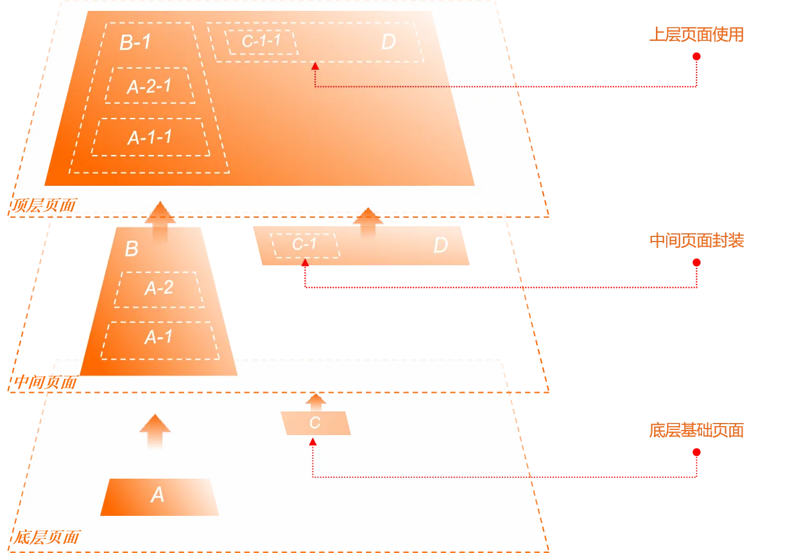

# Why is XLang an innovative programming language?

> Our physical world is a four-dimensional spacetime, with quantum field theory and relativity as its underlying construction rules. String theory attempts to break through the limitations of the underlying structural space and establish unified construction rules in an 11-dimensional spacetime.

## I. Why do we need to design the XLang language


The XLang language is a key foundational technology of the Nop platform. Formally, it comprises multiple sub-languages such as XDef, Xpl, and XScript. Because XLang differs significantly from other languages that have a single syntactic form, many people encountering it for the first time may wonder whether it is truly a programming language, or merely a set of scattered extensions on top of several existing languages.

Here I propose an understanding of the essence of programming languages: a programming language defines a program-structural space, and a programming language is the construction rule of that program-structural space. In other words, all structures a programming language can create and all feasible evolutionary paths among those structures constitute a specific program-structural space, and all feasible computations occur within that structural space.

Based on this understanding, XLang is an innovative programming language because it creates a new program-structural space in which the computation paradigm proposed by Reversible Computation theory, Y = F(X) + Delta, can be implemented conveniently. Although XLang may be viewed as comprising several sub-languages like XDef, XPL, and XScript, it is their union that is essential to implementing Reversible Computation. XLang is the world’s first programming language to explicitly define domain structural coordinates within the language and to embed a general-purpose Delta computation rule.

Most people’s basic understanding of software structural construction is reductionist—constantly decomposing downward, seeking atomic components, then assembling with those atoms. Virtualized “component” concepts are subconsciously treated as discrete entities that truly exist, analogous to particles in the material world, used to construct the world through nested composition. But another construction mode exists in the physical world: waves. Waves are continuously existing patterns that construct the world through interference and superposition. The distinctiveness of XLang lies in its support for continuous superpositional construction through Delta operations.

### 1.1 Viewing programming languages from a structural perspective

General-purpose high-level programming languages began with FORTRAN and have evolved for decades. Today they have reached something of a bottleneck. Fundamentally novel features introduced by new languages are increasingly rare, and most high-level languages have reached the so-called “multi-paradigm” stage. Their syntactic features are converging—for example, most languages now support object-oriented structural declarations, functional Lambda expressions, user-defined annotations for metaprogramming, and Async-related syntax and libraries for asynchronous programming.

An interesting question is whether universal, abstractable syntactic features still exist that have enough technical value to warrant a new programming language to carry them. XLang’s innovation is to point out that, although mainstream programming languages appear to differ widely in surface syntax, they are extremely similar at the level beneath syntax—the fundamental structural level—where innovation is still highly promising.

A program’s structural space is essentially composed of data plus functions; organizing relevant data and functions together constitutes a custom type, which corresponds to a Class or Interface in general programming languages. Structurally, a class is simply a Map from names to properties or methods.

```javascript
type MyClass = {
  name: string,
  myMethod: (arg1:string) => number
}

or

interface MyClass{
  name: string,
  myMethod: (arg1:string) => number
}
```

When we want to derive a new type from an existing custom type, we can use inheritance or Traits.

```javascript
type MySubClass = MyClass & {
  subName: string
}

or

interface MySubClass extends MyClass {
   subName: string
}
```

Conceptually, this roughly corresponds to the following construction:

```javascript
Map = Map extends Map
```

At the structural level, class inheritance amounts to overlaying two Maps by name, with upper-layer elements overriding lower-layer elements.

In traditional object-oriented languages, base classes can be reused via inheritance. For example, when constructing MapX and MapY, we reuse the base class Map1, i.e., we reuse the lower layer of the inheritance tree.

```javascript
MapX = Map2 extends Map1
MapY = Map3 extends Map1
```

Expressing inheritance in this structural construction form makes many questions very natural and intuitive. For example, can we swap the relative positions of Map1 and Map2? That is, when constructing MapX and MapY, we still reuse Map1 but not as the base class; we choose different base classes and overlay the same Map1.

```javascript
MapX = Map1 extends Map2
MapY = Map1 extends Map3
```

Interestingly, many object-oriented languages do not support the above operation—object orientation does not directly support reusing the upper layers of an inheritance tree!

Further reflection reveals many structural-level questions that traditional OOP struggles to answer. For example, what happens if the same object appears multiple times in the inheritance chain?

```javascript
MapX = Map1 extends Map2 extends Map1
```

Multiple inheritance in C++ presents serious conceptual difficulties, fundamentally because reusing the same Map1 from different inheritance paths creates structural merging obstacles.

Modern languages solve these problems with Traits. For example, in Scala:

```scala
trait Map1 {
  val name: String = "Map1" // same-name property
  def method1(): Unit = {
    println(s"Method 1 from $name")
  }
}

trait Map2 {
  val name: String = "Map2" // same-name property
  def method2(): Unit = {
    println(s"Method 2 from $name")
  }
}

class MapX extends Map1 with Map2 {
}

class MapY extends Map1 with Map3 {
}
```

> In Scala, multiple Traits can define properties with the same name; the compiler automatically merges these property definitions so that only a single variable exists at runtime. However, in Java or C++, multiple same-name properties defined in different classes are not automatically merged.

In traditional object-oriented languages, A extends B means the derived class A can be “more than” the base class B, but what exactly is “more” is not isolated in a clear technical form, so we cannot directly reuse that “extra” part (Delta). Traits directly and explicitly express this Delta. Compared with inheritance, Traits constitute a more complete Delta semantics. type MapX = Map1 with Map2 with Map1 is a valid Scala type definition!

To address issues caused by multiple inheritance, Scala introduces a linearization rule: arrange all classes and Traits in the inheritance chain into a linear sequence in a specific order, then stipulate that upper-layer elements override lower-layer elements.

```
MapX -> Map2 -> Map1
```

### 1.2 Generics as Generators

In Java, generics (Generic Type) are used only for type checking; the compiler does not perform special actions based on type parameters. In C++, the situation is very different. C++ generic programming is implemented with templates; the compiler instantiates the same template class into different code targeting specific types based on the template parameters.

At the 1994 C++ Standards Committee meeting, Erwin Unruh gave a dazzling demonstration. He wrote a template metaprogram that computes at compile time whether a number is prime, and if so, the compiler prints the prime number in the error message. This code, known as “Unruh prime computation,” became a classic example of C++ template metaprogramming.
Unruh’s demonstration proved that C++ templates are Turing-complete at compile time, meaning any computation can theoretically be performed at compile time. This discovery heralded the era of Generative Programming—leveraging compile-time computation to generate code or optimize programs.
C++ Template Metaprogramming became an important tool for generative programming. Through templates, developers can perform complex computations, type inference, and code generation at compile time, yielding greater performance and flexibility at runtime.

See [C++ Compile-Time Programming](https://accu.org/journals/overload/32/183/wu/)

```c++
template <int p, int i> struct is_prime {
  enum {
    prim = (p==2) ||
           (p%i) && is_prime<(i>2?p:0),
                             i-1> :: prim };
};

template<>
struct is_prime<0,0> { enum {prim=1}; };

template<>
struct is_prime<0,1> { enum {prim=1}; };

template <int i> struct D { D(void*); };

template <int i> struct Prime_print {
  Prime_print<i-1> a;
  enum { prim = is_prime<i, i-1>::prim };
  void f() { D<i> d = prim ? 1 : 0; a.f();}
};

template<> struct Prime_print<1> {
  enum {prim=0};
  void f() { D<1> d = prim ? 1 : 0; };
};

int main() {
  Prime_print<18> a;
  a.f();
}
```

Output

```
unruh.cpp:20:19: error: no viable conversion from ‘int’ to ‘D<17>’
…
unruh.cpp:20:19: error: no viable conversion from ‘int’ to ‘D<13>’
…
unruh.cpp:20:19: error: no viable conversion from ‘int’ to ‘D<11>’
…
unruh.cpp:20:19: error: no viable conversion from ‘int’ to ‘D<7>’
…
unruh.cpp:20:19: error: no viable conversion from ‘int’ to ‘D<5>’
…
unruh.cpp:20:19: error: no viable conversion from ‘int’ to ‘D<3>’
…
unruh.cpp:20:19: error: no viable conversion from ‘int’ to ‘D<2>’
```

If understood structurally, template metaprogramming can be expressed by the following construction:

```
Map = Generator<Map> = Map<Map>
```

> A<X,Y> can be understood as `A<B>, struct B{ using T1=X; using T2=Y;}`
> Note that here “Map” refers to the structure as seen by the compiler at compile time. Every member, whether a property, method, or type declaration, is a Map entry from the compiler’s perspective.
> Even if the compiler manages parameter lists as Lists, they can be regarded as Maps keyed by index. Interestingly, if managed as arrays, mechanisms like inheritance are generally hard to introduce. Conceptually, we usually choose to merge by name rather than by index.

As a generator, a template class is also a Map at the structural level (i.e., the structure the compiler sees). Combined with the Delta semantics of Traits in the previous section, the strongest form of object-oriented languages at the structural level can be expressed as:

```
Map = Map extends Map<Map>
```

### 1.3 From Map structures to Tree structures

From the compiler’s perspective, classes, template classes, and template parameters can all be viewed as Maps, and in practice they are typically managed as Maps. As for standalone function and variable definitions, they also belong to some Map, e.g., a module object can be considered a Map that contains variables, functions, and types defined within the module. Even if not part of any module, standalone functions belong to an implicitly existing global namespace.

> The intrinsic structure of Lisp is a List, essentially managing elements by index (primitive Lisp lacked indices, using car/cdr traversal). But modern Lisp variants long ago introduced Map-like “Associated Lists,” using names to locate child elements rather than indices. Conceptually (leaving aside the performance advantage of index-based access on von Neumann machines), a List can be viewed as a special Map where the keys are indices.
> 
> Lisp’s core invention—the S-expression—can be viewed as a general Tree structure, and Lisp provides built-in mechanisms such as macros to manipulate these Trees. However, Lisp does not establish the concept of Tree-level Delta. XLang can be seen as a further development of the general S-expression handling mechanism.

The various language features provided by mainstream languages can be regarded as rules for constructing new Maps in a Map-based structural space. XLang’s innovation is choosing to extend Map structures into Tree structures, then rethinking software structural construction on Tree foundations. That is, it generalizes the structural construction formula to:

```
Tree = Tree x-extends Tree<Tree>
```

> Extending Map to Tree implies that the extends operation between Maps must also be extended to the x-extends operation on Trees.

Clearly, a Map is a special case of a Tree; every node in a Tree can be viewed as a Map: `Tree = Map + Nested`. Thus, the formula above is indeed a generalization of the `Map extends Map<Map>` construction model. From another perspective, a Tree can be constructed by nesting multiple Maps; Map is therefore more basic and fine-grained. Is it necessary to emphasize Tree structures? Won’t all operations on Trees ultimately decompose into operations on the Map at each level?

XLang’s answer is: software structural space (and its construction rules) built on more complex Tree structures cannot be trivially reduced to a Map-based structural space. In other words, we encounter a “whole > sum of parts” situation: the holistic regularities of Tree construction lose some critical information when decomposed into Map construction regularities.

To truly understand XLang’s innovation, one must understand the next-generation software construction theory behind its design: Reversible Computation. Reversible Computation explicitly introduces the concepts of inverse elements and Delta, pointing out that a full state is a special case of Delta (A = 0 + A). We must rebuild all our understanding of the software world on the concept of Delta (including inverse elements). Reversible Computation proposes a general Turing-complete software construction formula:

```
 App = Delta x-extends Generator<DSL>
```

The XLang language implements this technical strategy at the programming language level.

For an introduction to Reversible Computation, see my WeChat articles:

1. [Reversible Computation: Next-Generation Software Construction Theory](https://mp.weixin.qq.com/s/CwCQgYqQZxYmlZcfXEWlgA)
2. [A Discourse on Reversible Computation for Programmers](https://mp.weixin.qq.com/s/aT99VX6ecmZXdemBPnBcoQ)
3. [Addendum to A Discourse on Reversible Computation for Programmers](https://mp.weixin.qq.com/s/zGfo7pvKjOCa11PYLJHzzA)
4. [Dissecting the Concept of Delta for Programmers, with Git and Docker as examples](https://mp.weixin.qq.com/s/D5bDNkMJ9gYrFb0uDj2EzQ)

According to Reversible Computation, the special nature of Tree structures lies in their correspondence to a global coordinate system: every node and attribute on the tree has a unique xpath.

```
/tasks/task[name='test']/@name
```

The xpath above indicates the “name” attribute of the child node named “test” under the “tasks” node.

First, let’s clarify the role of the coordinate system: every value of business interest has a unique coordinate in the coordinate system, enabling reading and modification by that coordinate.

```
value = get(path);
set(path,value);
```

The issue with Map structures is that they provide only two levels of coordinates: the first level locates the Map itself, and the second level locates the property or method within the Map. This simple coordinate system fails to achieve precise distinctions at the business level. For example:

```java
class Dialog{
    String title;
    List<Button> actions;
    List<Component> body;
}
```

A Dialog object has a set of action buttons. If we want to locate the “Submit” button and change its label property to “Confirm,” there is no convenient, intuitive way to locate it in most languages. If we want to customize a Dialog used only in a specific scenario (e.g., adding a property), AOP (Aspect Oriented Programming) in general-purpose languages cannot achieve it, because AOP’s locator system is type-based. In XLang, we can directly write:

```xml
<dialog>
   <actions>
      <button name="submit" label="Confirm" />
   </actionss>
</dialog>
```

Current programming language research generally focuses on type systems. The reason is that different objects can share the same type, making types simpler to study than original object structures and avoiding lifecycle issues. This leads to type systems being inadequate as coordinate systems: objects with the same type cannot be distinguished in the type-system coordinate space, preventing fine-grained Delta construction.

Some may question why we choose Tree structures instead of graphs. On a graph, if we select a primary observation direction and fix a node as the root, a graph can naturally be converted into a tree. For example, in Linux, everything is a file; many logical relationships are captured in a file tree representation, and with filesystem links, one can effectively represent a graph. “Tree” arises only because we choose a direction of observation on the graph.

For example, when expressing flowchart-like structures in XML, introducing node id references suffices: `<step nextTo="nextStepId" />`

Tree structures unify relative and absolute coordinates: there is only one path from the root to any node, serving as the node’s absolute coordinate. Conversely, within any subtree, each node has a unique path within the subtree, serving as its relative coordinate. Given a node’s relative coordinate and the subtree root’s absolute coordinate, one can easily compute the node’s absolute coordinate (simply concatenate them).

### 1.4 Extensible design necessarily requires a software structural coordinate system

In software development, “extensibility” means meeting new requirements or implementing new features without modifying the original code, by adding extra code or differential information. Abstracting this extension mechanism at a purely mathematical level yields:

```
  Y = X + Delta
```

- X corresponds to the base code we have already written; it does not change with shifting requirements.
- Delta corresponds to additional configuration or differential code.

From this perspective, research on extensibility reduces to research on the definition of Delta and its algebra.

```
X = A + B + C
Y = (A + dA) + (B + dB) + (C + dC)  // Delta is everywhere
   = (A + B + C) + (dA + dB + dC)  // Delta can be aggregated, stored independently of the base code
   = X + Delta // Delta is associative and can be merged independently of the Base
```

Suppose X comprises multiple parts A, B, C, … Requirement changes cause modifications scattered throughout the system. If we demand that all these fine-grained changes be managed and stored independently of the original source code (Delta independence), and smaller Deltas can be composed into larger-grained Deltas (Delta composability), then a coordinate system is necessary for precise location. Concretely, when dA is separated from A and stored in an independently existing Delta, it must retain some locator coordinate. Only then, when Delta is combined with X, can it find the original structure A and be properly combined with it.

### 1.5 Differences between Delta and Patch/plugins

First, Git’s Patch and branch management do not satisfy Delta independence and composability. A Patch is always tied to a specific base code version. Without knowing the base, multiple patches cannot be merged into a larger patch. See [Dissecting the Concept of Delta for Programmers, with Git and Docker as examples](https://mp.weixin.qq.com/s/D5bDNkMJ9gYrFb0uDj2EzQ) for detailed analysis.

Second, Delta fundamentally differs from traditional extension points and plugin mechanisms in programming.

```
X = A + B + C
Y = A + B + D
  = X + (-C) + D
  = X + Delta
```

Delta is not just adding content to the system. If we want coarse-grained, system-level reuse, the corresponding Delta must include subtractive semantics (e.g., removing a Bean defined in a base product). In fact, a coarse-grained Delta is inevitably a mix of additions and removals.

Also note that plugin mechanisms support only a small number of pre-determined extension points. We cannot customize functionality beyond the original design via plugins. Delta is different: as long as there is a global structural coordinate system, a Delta can be introduced at any point in that coordinate system. Kustomize (in k8s) leverages Delta to achieve comprehensive customization, a concrete application of Reversible Computation; see [Kustomize through the lens of Reversible Computation](https://mp.weixin.qq.com/s/48LWMYjEoRr3dT_HSHP0jQ)

> The black-box model of components is akin to the worldview of Newtonian mechanics taught in high school—fully mechanistic: a rigid body’s motion is described by a few parameters such as center-of-mass coordinates, size, shape, and orientation; its internal structure is unobservable and irrelevant; interactions occur by direct contact; and shapes must match precisely to form a seamless whole. Even in classical mechanics, more advanced viewpoints transform to Lagrangian or Hamiltonian formulations, essentially moving toward a field-theoretic worldview. A “field” is a ubiquitous coordinate system with a physical quantity specified at every point. A field’s degrees of freedom are infinite yet describable through coordinates—locally measurable at every point. In the field worldview, the core picture is that objects are always immersed in a field (an omnipresent coordinate system), rather than isolated objects interacting pairwise.

### 1.6 Stable domain structural coordinate systems

Mainstream languages are general-purpose and do not embed domain-specific knowledge. Therefore, their structural coordinate systems are limited to the language’s built-in two-level class-method structure, at most refined with annotations. Below the method level, suitable technical means for coordinate definition are generally lacking.

When business requirements change, they typically affect code in multiple places. Fundamentally, this is because the structural mapping from problem space to solution space is non-trivial in general business contexts, so the two descriptions cannot align effectively. Borrowing language from AI, we can say: useful features are distributed.

> In physics, the same physical phenomenon can be described using countless coordinate systems, but there may exist a particular coordinate system tailored to the problem—a “intrinsic coordinate system.” Descriptions in that system can highlight core physical meaning and simplify representation. For example, phenomena on a spherical surface can certainly be described in a general 3D Cartesian system, but spherical coordinates often offer simplification.

Reversible Computation suggests building a DSL (Domain Specific Language) tailored to a particular business domain, using it to naturally establish a domain coordinate system, and then expressing Delta in the Delta structural space defined by that coordinate system. Because this domain coordinate system is tailored to the domain problem, it often minimizes Delta expression. For example, if a business-level change requires adding a field, using a general-purpose language might require adjustments in many places (front end, back end, database). With a domain model description, this change may appear as a local field-level modification, with the underlying engine framework automatically translating the domain description into executable logic.

XLang’s core function is how to quickly define multiple DSLs, then use them as domain structural coordinate systems to implement Delta definition and Delta-based structural generation and transformation.

XLang fundamentally differs from other languages in that it is a programming language based on Reversible Computation and oriented toward DSL development. General-purpose languages target application development directly—we use them to model businesses and implement logic. Using XLang, we first build one or more DSLs, then use those DSLs to describe the business. XLang makes developing a DSL very inexpensive: at the most basic level, you only need to define an XDef meta-model file with the XDef language, and you automatically get a parser, validator, IDE plugin, visual editor, etc., with rich tooling such as syntax hints, breakpoints, and visual editing.

> JetBrains’ MPS (Meta Programming System) also supports first developing a DSL, then using the DSL to describe business. MPS is built on its own foundational language mechanism. Nop platform is a similar low-code development platform and uses XLang at its foundation. However, Nop is guided by Reversible Computation, fundamentally differing in technical route and guiding philosophy from MPS.
> The technical development goals are similar, though.

## II. XLang’s concrete syntax design

XLang is designed for Tree structures. Its syntax can be compared to SQL (which targets tabular structures):

| SQL                        | XLang                                       |
| --------------------------- | ----------------------------------------- |
| DDL (Data Definition Language) | XDef meta-model definition syntax            |
| Non-redundant tabular data     | Non-redundant tree information structure: XNode |
| On standardized data structures: SQL Select | Runtime and compile-time computation on XNode: Xpl/XTransform |
| Merge and diff for tables: Union/Minus | Delta computation on Tree structures: x-extends/x-diff |
| Extend SQL via functions and stored procedures | Extend XLang via Xpl tag libraries and XScript |

First, since XLang is designed for Tree structures, XML is a very natural syntactic carrier, so an XLang file is typically a valid XML file. But this is not the only choice. Traditional languages emphasize syntactic form, but XLang—based on Reversible Computation—emphasizes that the syntactic form is not important: different syntactic forms are just different presentations of the same information, and reversibly transformable if information-equivalent. XLang can use any syntax that directly expresses tree structures, e.g., JSON, YAML, etc. Lisp’s S-expressions, with some extended attributes, can also serve as an XLang syntactic carrier.

> The Nop platform also implements a bidirectional mapping between Tree structures and Excel files, enabling DSL models to be expressed in Excel without writing parsing/generation code. For example, app.orm.xlsx expresses the ORM DSL and is equivalent to the XML format app.orm.xml.

### 2.1 Basic syntax structure of XDSL

XLang is Turing-complete, but its design goal is not to be a general-purpose language. Rather, it is a meta-language for rapidly developing new DSLs. While XLang can be used as a glue language, it is primarily used to develop DSLs for use within the Java ecosystem.

All DSLs developed on XLang share some common syntactic structures; these DSLs are collectively called XDSL.

```xml
<state-machine x:schema="/nop/schema/state-machine.xdef"
     x:extends="base.state-machine.xml">
    <x:gen-extends>
       <app:GenStateMachineDelta1/>
       <app:GenStateMachineDelta2/>
    </x:gen-extends>

    <x:post-extends>
       <app:PostProcessGeneratedModel />
    </x:post-extends>

    <!-- x:override=remove means this node is deleted in the final merge result -->
    <state id="commit" x:override="remove" />

    <on-exit>
       <c:if test="${abc}">
           <c:log info="${xyz}" />
        </c:if>
    </on-exit>
</state-machine>
```

Based on the example above, all XDSLs support the following syntax:

1. x:schema imports an XDef meta-model, similar to JSON Schema, to constrain the DSL’s syntactic structure.

2. x:extends inherits an existing DSL file, merging two DSL models layer by layer as Trees.

3. x:override specifies how to merge corresponding nodes during x:extends; x:override=remove signals deletion.

4. x:gen-extends uses the Xpl template language to dynamically generate multiple Tree nodes, which are then merged one by one via Delta algorithms.

5. x:post-extends also uses Xpl to dynamically generate multiple Tree nodes but executes at a different stage from x:gen-extends.

6. If a DSL wants to embed scripting code, it can directly use the Xpl template language, e.g., for on-exit callbacks.

```xml
<model x:extends="A,B">
   <x:gen-extends>
      <C/>
      <D/>
   </x:gen-extends>
   <x:post-extends>
      <E/>
      <F/>
   </x:post-extends>
</model>
```

The complete merge order is:

```
F -> E -> Model -> D -> C -> B -> A
```

Any XML or JSON file format can incorporate the XLang Delta operation syntax above. For example, we introduced the following decomposition scheme to AMIS (Baidu’s open-source JSON front-end UI definition language):

```yaml
x:gen-extends: |
   <web:GenPage view="NopSysCheckerRecord.view.xml" page="main"
        xpl:lib="/nop/web/xlib/web.xlib" />

body:
   x:extends: add-form.page.yaml
   title: Override the existing title defined in add-form.page.yaml
```

AMIS’s JSON format does not provide decomposition/merge mechanisms, so a complete application’s JSON file can become large and hard to maintain manually. By introducing XLang’s x:gen-extends, we can automatically generate base page structures from View models; within pages, we can also use x:extends to import existing files.

XLang embeds support for Reversible Computation—i.e., the computation pattern App = Delta x-exends Generator<DSL>. x:gen-extends and x:post-extends correspond to Generator; they are metaprogramming mechanisms that generate model nodes at compile time as built-in code generators. The x:extends syntax is used to merge model nodes.

For further reading, see [XDSL: General Design of Domain-Specific Languages](https://zhuanlan.zhihu.com/p/612512300)

The next-generation low-code platform Nop has already defined multiple DSLs, e.g., Workflow (process model), Rule (rule model), ORM (data model), BeanDefinition (component orchestrations), Batch (batch processing model), Record (binary message model), etc. Typically, you do not need to implement runtime engines for your custom DSL; XLang’s metaprogramming can translate custom DSLs into existing DSLs at compile time or seamlessly integrate multiple DSLs into a new DSL. See the “DSL forest” solution introduced in [Why SpringBatch is a Poor Design](https://mp.weixin.qq.com/s/1F2Mkz99ihiw3_juYXrTFw).

### 2.2 XDef meta-model definition language

XML has a series of standards like XSD (XML Schema Definition) and XSLT (EXtensible Stylesheet Language), but these standards share DOM-like assumptions—they target text structures where all attributes are strings—making them unsuitable for general Tree structure processing.

XLang introduces the XDef meta-model definition language to replace XSD. XDef is much simpler and more intuitive than XSD, yet it can provide far stronger structural constraints.

```xml
<state-machine x:schema="/nop/schema/xdef.xdef">
   <state id="!var-name" displayName="string" xdef:unique-attr="id" />
   <on-exit xdef:value="xpl" />
</state-machine>
```

Unlike XSD and JSON Schema, XDef adopts homomorphic design: the meta-model’s structure is nearly identical to the XML format it constrains—simply replace XML node attribute values with type declarations. For example:

- `id="!var-name"` means the id attribute must satisfy var-name formatting (no special characters and not starting with a digit). `!` indicates non-null.

- `<on-exit xdef:value="xpl"/>` means the content of the on-exit node follows the Xpl template language; when reading the model, it is automatically parsed into an IEvalAction executable function.

- `xdef:unqiue-attr="id"` declares the current node can appear multiple times as a list, and list elements are uniquely identified by the id attribute.

Note that the XDef meta-model definition language is itself defined by xdef.xdef. That is, state-machine.xml is a DSL whose syntax is constrained by the state-machine.xdef meta-model; state-machine.xdef’s root node has `x:schema='/nop/schema/xdef.xdef'`, meaning this meta-model file is constrained by xdef.xdef; ultimately, xdef.xdef is constrained by itself, forming a closed loop.

The shared XDSL syntax of all domain-specific languages is defined by the xdsl.xdef meta-model. The IDEA plugin automatically recognizes syntax like x:extends and x:gen-extends per xdsl.xdef, offering features like syntax hints and file navigation.

### 2.3 Xpl template language

XLang needs a template language for compile-time code generation, but instead of using popular templating systems like Velocity or FreeMarker, it designs a new Xpl template language.

Xpl is Turing-complete and provides nodes such as c:for, c:if, c:choose, c:break, and c:continue.

```xml
<c:for var="num" items="${numbers}">
    <!-- Check if the number is 7 -->
    <c:if test="${num == 7}">
        <p>Encountered number 7; stop iteration.</p>
        <c:break /> <!-- Break out of the loop -->
    </c:if>

    <!-- Use c:choose to determine odd/even -->
    <c:choose>
        <when test="${num % 2 == 0}">
            <p>${num} is even.</p>
        </when>
        <otherwise>
            <p>${num} is odd.</p>
        </otherwise>
    </c:choose>
</c:for>
```

Xpl templates embed XScript expressions via \${expr}. Xpl also provides a dedicated c:script node to execute XScript statements.

```xml
<c:script>
  import my.MyDSLParser;
  let model = new MyDSLParser().parseFromNode(path);
</c:script>
```

XScript’s syntax is similar to JavaScript but adds extensions, e.g., import statements can reference Java classes.

#### Mutual embedding of XML template language and expression syntax

XLang does not use JSX to implement XML-like syntax; instead, it retains XML syntax while extending JavaScript’s Template expression syntax.

```javascript
let resut = xpl `<my:MyTag a='${data}' />`
const y = result + 3;
```

Equivalent to:

```xml
<my:MyTag a='${data}' xpl:return="result" />
<c:script>
  const y = result + 3;
</c:script>
```

XLang changes JavaScript’s Template expression parsing, treating the content between backticks as a string to be parsed at compile time, rather than an Expression list. This enables XLang to extend support to more DSL formats, e.g., introducing C#-like LINQ syntax:

```javascript
const result = linq `select sum(amount) from myList where status > ${status}`
```

#### Multiple output modes

Unlike typical template languages, Xpl is specially optimized for compile-time code generation. Typical templates output text directly; when used for code generation, original code locations are lost, prompting use of SourceMap mechanisms to record mappings between generated and original code. Xpl takes a different approach by introducing multiple output modes. For compile-time generation, use outputMode=node to output XNode nodes rather than text.

```java
class XNode{
    SourceLocation loc;
    String tagName;
    Map<String, ValueWithLocation> attributes;
    List<XNode> children;
    ValueWithLocation content;

    XNode parent;
}

class ValueWithLocation{
    SourceLocation location;
    Object value;
}
```

XNode records source locations of attributes and nodes and changes attribute and content value types to Object, overcoming XML’s text-doc-only design limitation to better express complex business object structures.

### 2.4 Extensible syntax

Like Lisp, XLang’s syntax can be extended via macro functions and tag functions. Use `<c:lib>` to import new syntactic nodes and implement structural transformation via macros inside the imported library.

```xml
<c:lib from="/nop/core/xlib/biz.xlib" />
<biz:Validator fatalSeverity="100"
               obj="${entity}">

    <check id="checkTransferCode" errorCode="test.not-transfer-code"
           errorDescription="The scanned code is not a transfer code.">
        <eq name="entity.flowMode" value="1"/>
    </check>
</biz:Validator>
```

<biz:Validator> introduces a validation DSL. During compilation, the Validator tag parses node content via macros, translating it into XLang Expressions for execution.

## III. XLang application example: Delta-based component model

Any software practice involving Delta can follow the technical route of Reversible Computation. In many cases, XLang can directly implement Delta merging and decomposition, completely avoiding the need to introduce Delta concepts in the runtime engine and thereby simplifying runtime.

Here is an example in the component model of a front-end low/no-code platform.

Low/no-code platforms essentially construct nested compositions of components via visual interfaces. But component encapsulation often struggles in practice: encapsulated components may not meet needs directly, while writing entirely new components from scratch is too costly. The UIOTOS no-code platform proposes “page inheritance.”



Specifically, UIOTOS can import an existing page as a base page, then overlay properties at the upper level to override properties of the lower-level page. See the [UIOTOS documentation](https://www.yuque.com/liuhuo-nc809/uiotos/fa6vnvggwl9ubpwg#rsHSa) for details.

To implement this feature, UIOTOS made numerous special designs and introduced substantial inheritance-related code into the runtime engine. With XLang, Delta computation can be fully compressed into compile time; the runtime engine only needs to understand ordinary component structures without any Delta decomposition/merging knowledge.

```xml
<component x:schema="component.xdef">
  <import from="comp:MyComponent/1.0.0"/>

  <component name="MyComponent" x:extends="comp:MyComponent/1.0.0">
    <state>
      <a>1</a>
    </state>
    <props>
      <prop name="a" x:override="remove"/>
      <prop name="b"/>
    </props>

    <component name="SubComponent" x:extends="ss">
      <prop name="ss"/>
    </component>

    <template x:override="merge">
      Here you can show only the Delta adjustments

      <form x:extends="a.form.xml">
        <actions>
          <action name="ss" x:id="ss"/>
        </actions>
      </form>
    </template>
  </component>

  <template>
    <MyComponent/>
    <MyComponentEx/>
  </template>
</component>
```

- The template section of a Component expresses how to compose subcomponents.
- You can import existing components via the import syntax or define local components via the component syntax.
- If the Component model is implemented as an XLang XDSL, x:extends can be used to customize based on existing components with Delta—no special design like UIOTOS’s is needed. x:extends suffices to define Delta-based components.
- A local component can itself contain local subcomponents, which can likewise be customized. Delta customization can modify the entire component tree, not just a component class’s properties or methods.
- Delta merging requires each node to have a unique coordinate. If a DSL node lacks usable id or name attributes, use XLang’s built-in x:id attribute. These attributes are automatically removed after Delta merging, so they do not affect the DSL runtime.
- x:extends is executed during model loading; by the time the runtime engine receives the model, all attributes in the x namespace have already been processed and removed. Therefore, the runtime engine needs no knowledge of x:extends at all—strikingly different from UIOTOS’s approach. Delta can be implemented once and for all in a general engine, without introducing special mechanisms for each specific need.
- Reference components via extended virtual file paths like comp:MyComponent/1.0.0; the virtual filesystem can automatically implement tenant isolation and version upgrade isolation.

For a detailed walkthrough, see the Bilibili video [Discussion with the UIOTOS Author and the Design of a Delta-Enabled Front-End Low-Code Platform](https://www.bilibili.com/video/BV1ask2YhEfp/).

With XLang, implementing Delta components requires virtually no extra work, and this approach generalizes to all DSL models needing Delta editing. Some developers also introduce similar component models in back-end service application development.

The low-code platform NopPlatform, designed with Reversible Computation, is open-source:

- gitee: [canonical-entropy/nop-entropy](https://gitee.com/canonical-entropy/nop-entropy)
- github: [entropy-cloud/nop-entropy](https://github.com/entropy-cloud/nop-entropy)
- Development example: [docs/tutorial/tutorial.md](https://gitee.com/canonical-entropy/nop-entropy/blob/master/docs/tutorial/tutorial.md)
- [Principles of Reversible Computation and Introduction to the Nop Platform (Q&A) on bilibili](https://www.bilibili.com/video/BV14u411T715/)

<!-- SOURCE_MD5:f5b5e45b1b2e5a0ec8daebf78c66bf85-->
