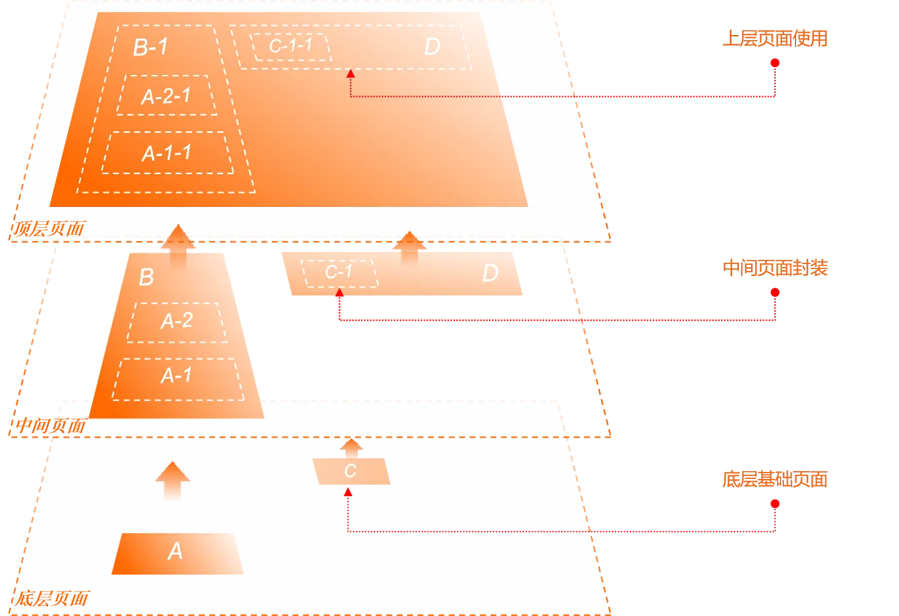

# Q&A on "Why XLang Is an Innovative Programming Language"

In my previous article [Why XLang Is an Innovative Programming Language](https://mp.weixin.qq.com/s/O4VeA7Dw8cRF7HTHxi6pNw), I introduced the design philosophy of XLang and explained that XLang is innovative because it creates a new program structure space where it is convenient to implement the computation paradigm proposed by Reversible Computation theory: `Y = F(X) + Delta`. This article provides further explanations addressing feedback and questions.

## 1. How can Delta computation be compressed to compile-time execution based on XLang?

> To implement property inheritance, UIOTOS made a lot of special designs and introduced a significant amount of code related to property inheritance in its runtime engine. However, based on the XLang language, Delta computation can be completely compressed to compile-time; the runtime engine only needs to understand ordinary component structures and does not need any knowledge of Delta decomposition or merging.



UIOTOS is a no-code platform for the IoT domain. It introduces a container component that can embed an existing page and then use a property mechanism to override properties of objects within the page. This achieves flexible customization of the page content without reimplementing the page.

```json
{
  type: "container",
  baseUrl: "a.page.json",
  overrideProps: {
    "form/title": "sss",
    "actions/0/label": "vvv"
  }
}
```

The general approach is as shown above: essentially, the page object is brought in via baseUrl, and then multiple inherited properties are used to override content within the page object. With a syntax similar to JsonPath, you can modify any nested content within the page object, so it differs from conventional component frameworks where you call a component and pass parameters to it.

UIOTOS writes considerable code in the frontend runtime framework specifically for property inheritance and needs to introduce a special container control. A limitation of the UIOTOS approach is that it can only override property values in existing pages and cannot change the structure of the inherited page. Another low-code platform uses a similar approach without introducing a special container component; it allows Delta customization for any component. Concretely, it introduces a special overwrite property within the component.

```json
{
  "component": "MyComponent",
  "version" : "1.0",
  "properties": {
     "a": 1, // Set component property directly
   },
   "overwrite": [
    "Here we record the visual editor’s edit actions on the component"
 ]
}
```

The basic operation pattern is: after dragging a component in the editor, if some details need adjustment, you can enter a component customization mode to fine-tune the component in the visual designer. The adjustment steps are automatically recorded as overwrite and saved in the page file. This approach can arbitrarily adjust component structure and is more adaptable than UIOTOS’s approach. However, recording operation actions is verbose, and multiple actions are hard to compress into a concise final result (i.e., it does not leverage the associative law for simplification).

> According to Reversible Computation theory, A = 0 + A; full content is a special case of Delta. We can define full content and Delta in a unified form, so the Delta of a Delta is also just another normal Delta, enabling more complex logical reasoning. Using action-based overwrite to represent a Delta is not suitable.

Regardless of which approach is used above, the editor and frontend runtime framework both need to incorporate handling code related to the Delta concept. However, if XLang is used as the underlying model expression language, Delta computation can be completely compressed to compile-time; the runtime engine only needs to understand ordinary component structures with no knowledge of Delta decomposition or merging. The specific method uses `x:extends` for component inheritance.

```xml
<component x:schema="component.xdef">
  <import from="comp:MyComponent/1.0.0"/>

  <component name="MyComponentEx" x:extends="comp:MyComponent/1.0.0">
    <props>
      <prop name="a" x:override="remove"/>
      <prop name="b"/>
    </props>

    <template x:override="merge">
      Only show the Delta-corrected portion here

      <form x:extends="a.form.xml">
        <actions>
          <action name="ss" x:id="ss"/>
        </actions>
      </form>
    </template>
  </component>

  <template>
    <MyComponent/>
    <MyComponentEx/>
  </template>
</component>
```

If no customization is needed, you can import the component directly. If customization is needed, enable local component definitions and use `x:extends` to inherit existing components. XLang defines a Delta merge algorithm between Tree structures. Through the unified DslNodeLoader, the algorithm is automatically executed when loading model files. Pseudocode is as follows:

```javascript
 function loadDeltaModel(path){
    rootNode = VirtualFileSystem.loadXml(path);
    for each node with x:extends attribute  // Recursively traverse rootNode and its children
        baseNode = loadDeltaNode(node.removeAttr('x:extends'));
        genNodes = processGenExtends(node);

        for each genNode in genNodes
            baseNode = new DeltaMerger().merge(baseNode, genNode);
        node = new DeltaMerger().merge(baseNode,node);

    processPostExtends(node);
    return node;
 }
```

`DslNodeLoader.loadDeltaModel("comp:MyComponent/1.0.0")` returns an XNode representing the final merged node, which no longer contains any attributes or child nodes in the x namespace.

Loader can be regarded as a kind of just-in-time compiler; the structural transformation performed while loading model files can be considered part of the compilation process.

### Delta operations defined at the structural layer rather than the object layer

> Wittgenstein said that the limits of my language mean the limits of my world. Reversible Computation theory further interprets this as: a programming language defines a software structural space, and various reuse mechanisms that produce new structures from existing ones are transformation rules within this structural space.

A truly practical DSL must consider extensibility and needs to embed decomposition, merging, and reuse mechanisms. However, most DSL designers habitually introduce these structural operations at the semantic object layer, which results in ad hoc designs lacking generality and internal consistency.

XLang offers a standardized approach that once and for all solves extensibility for all DSLs. A DSL engine only needs to consider minimal runtime concerns. XLang operates entirely at compile time (model parsing and loading); there is no XLang-specific content at runtime. The key is that XLang performs Delta merging at the structural layer beneath objects—the XNode layer—akin to S-expressions in Lisp, which themselves have no semantics. Detaching from semantics is precisely what gives Delta merging its generality.

For example, Spring’s `beans.xml` can be regarded as a DSL in the component assembly domain. Spring 1.0 introduced the parent attribute to implement a kind of inheritance, and the import syntax for complex file decomposition and reuse. Spring 2.0 introduced custom elements to simplify configuration of complex structured beans. Spring Boot introduced the @ConditionalOnProperty annotation, allowing bean activation to be controlled via configuration switches. To implement these features, Spring’s core had to include specific handling code.

```xml
<beans xmlns="http://www.springframework.org/schema/beans"
       xmlns:xsi="http://www.w3.org/2001/XMLSchema-instance"
       xmlns:myns="http://www.example.com/schema/myns"
       xsi:schemaLocation="http://www.springframework.org/schema/beans
           http://www.springframework.org/schema/beans/spring-beans.xsd
           http://www.example.com/schema/myns
           http://www.example.com/schema/myns/myns.xsd">

    <import resource="classpath:config/services.beans.xml"/>

    <!-- Parent Bean -->
    <bean id="parentBean" class="com.example.ParentClass">
        <property name="commonProperty" value="commonValue"/>
    </bean>

    <!-- Child Bean inheriting from the parent -->
    <bean id="childBean" parent="parentBean">
        <property name="extProp" value="extValue"/>
    </bean>

     <!-- Configure a Bean using a custom namespace -->
    <myns:customBean id="customBean" customProperty="customValue"/>
</beans>
```

```java
@Component
@ConditionalOnProperty(name = "mycomponent.enabled", havingValue = "true", matchIfMissing = false)
public class MyComponent {

    public MyComponent() {
        System.out.println("MyComponent is initialized!");
    }

    public void doSomething() {
        System.out.println("MyComponent is doing something!");
    }
}
```

With XLang, none of these features need to be implemented within the framework itself.

```xml
<beans x:extends="config/base.beans.ml">
   <x:gen-extends>
     <c:include src="config/services.beans.xml" />

     <beans>
        <myns:customBean id="customBean" customProperty="customValue"
                      xpl:lib="/example/myns.xlib" />
     </beans>
   </x:gen-extends>

   <bean id="parentBean" class="com.example.ParentClass">
        <property name="commonProperty" value="commonValue"/>
   </bean>

   <bean id="childBean" x:prototype="parentBean">
        <property name="extProp" value="extValue"/>
   </bean>

   <bean id="myComponent" class="com.example.MyComponent"
         feature:on="mycomponent.enabled">
       <property name="propA" ref="xxx" feature:on="mycomponent.xxx.enabled" />
   </bean>
</beans>
```

* First, notice that without any additional extensibility mechanisms, bean definitions in Spring 1.0 already constitute a complete component assembly model. That is, any bean that can be assembled via `get/set` methods and constructors can be declaratively defined using the `beans.xml` DSL. Mathematically, we can say Spring 1.0 defines a complete set of assembly operations.

* XLang’s approach is to introduce a set of Delta operations atop the existing DSL, but the result of these Delta operations is to reduce `DSL + Delta` back to the original DSL structure. Interestingly, the custom namespace approach introduced in Spring 2.0 cannot be reduced back to the 1.0 syntax. In other words, beans configured with Spring 2.0 syntax are not guaranteed to be configurable using Spring 1.0 syntax, even though Spring 1.0 provides a complete operation set. Spring 2.0’s custom namespaces, such as `<myns:customBean>`, trigger a NamespaceHandler in Java whose execution logic can be arbitrarily complex and may implicitly introduce order dependencies (declaration order could affect assembly results), thereby undermining Spring 1.0’s POJO declarative assembly design.

* `x:extends` can inherit existing DSL files, similar in function to Spring 1.0’s import syntax.

* `x:gen-extends` executes the Xpl template language to dynamically generate bean definitions. The Xpl built-in `c:include` can include external XNode nodes, again replacing Spring 1.0’s import syntax.

* The Xpl custom tag capability used within `x:gen-extends` can emulate Spring 2.0’s custom namespace mechanism. However, Xpl tags perform code generation: no matter how complex the tag function’s logic is, as long as it produces the desired bean configuration definitions, that is sufficient. For example, the `<myns:customBean>` above might actually generate multiple bean definitions. What matters at runtime is the generated result of the tag function. `x:gen-extends` itself executes at compile time.

```xml
 <myns:customBean id="customBean" customProperty="customValue"
                      xpl:lib="/example/myns.xlib" />

Actually expands into the following two bean definitions:

<bean id="customBean" class="com.example.CustomBean">
    <property name="customProperty" value="customValue" />
    <property name="otherProperty" ref="otherBean" />
</bean>

<bean id="otherBean" class="com.example.OtherBean" />
```

* In XLang, sibling nodes at the same level can specify inheritance via the `x:prototype` attribute. This replaces the parent attribute’s role in Spring 1.0 syntax. Meanwhile, when nodes are merged in XLang, `x:override` can precisely control the merging logic: whether to overwrite, merge, or delete, etc. Importantly, XLang’s mechanism applies to any node—e.g., you can also specify `x:prototype` on a property to inherit another property’s configuration. In contrast, Spring’s parent attribute can only be used for bean definition inheritance.

* In XLang, every node can use feature switches like `feature:on` and `feature:off` to control conditional loading. When a feature switch does not match, the corresponding node is automatically removed and never enters runtime. This replaces Spring Boot’s conditional beans. Likewise, feature switches can be used on any node; for example, you can control whether to configure a particular `<property>`. In Spring Boot, conditional switches only control bean creation; there is no declarative mechanism for conditionally configuring a property.

In summary, the Spring framework embeds many mechanisms to enhance extensibility, each specifically written for the component assembly domain and for the Spring framework itself. If you migrate to another runtime engine, these mechanisms all need to be re-implemented. For example, the Quarkus framework also supports bean assembly definitions and has to implement all these extensions on its own. Even after Spring implements them, frameworks like Hibernate cannot leverage these mechanisms for their own extensions.

The key for XLang is that, after parsing XML or JSON into XNodes, it performs Delta operations at the XNode layer, rather than converting XNodes into strongly-typed BeanDefinitions and then doing Delta operations. Therefore, these capabilities can automatically apply to other DSLs, such as MyBatis mapper files, Hibernate hbm files, and more.

Similar extensibility issues exist in many domains. For instance, Facebook’s GraphQL protocol introduced type extension syntax:

```graphql
type User {
  id: ID!
  name: String!
  email: String!
}

extend type User {
  age: Int
  email: String @deprecated(reason: "Use 'contactEmail' instead")
  contactEmail: String!
}
```

In the `graphql-java` implementation, GraphQL definitions are first parsed into TypeDefinition and TypeExtensionDefinition, and type merging is implemented at the object layer.

Within XLang’s technology stack, the NopGraphQL framework defines types using the XMeta metadata model, so it can directly use XLang’s built-in Delta mechanisms at the XNode layer to implement extensions, without designing a separate TypeExtension syntax. At runtime in NopGraphQL, there is no need to understand any type extension concept. For the runtime framework, a type is just a type—there is no “type + type extension”.

### Loader as Generator

Within XLang’s technology stack, the Loader abstraction has a special status. Since all content related to Reversible Computation is, in principle, implemented within the Loader abstraction, integrating XLang into third-party frameworks is very simple: directly replace the DSL’s Loader with XLang’s Delta Loader.

A generic model loader can be seen as having the following type definition:

```
Loader :: Path -> Model
```

For a general design, we must recognize that coding is not only for current needs; it must also consider future changes and the system’s evolution across space and time. In other words, programming does not target a single, current world but all possible worlds. Formally, we can introduce a Possible operator to describe this:

```
Loader :: Possible Path -> Possible Model
Possible Path = deltaPath + stdPath
```

stdPath refers to the standard path corresponding to the model file, while deltaPath refers to the path used for Delta customization of an existing model file. For example, in a base product we have a built-in business workflow main.wf.xml. When customizing for Customer A, we need a different workflow but do not want to modify the base product’s code. In this case, we can add a Delta model file `/_delta/a/main.wf.xml`, which represents Customer A’s customized main.wf.xml. The Loader will automatically recognize the existence of this file and use it, without any changes to existing business code.

If we only want to fine-tune the original model rather than completely replace it, we can use `x:extends` inheritance. The execution logic of XLang’s DeltaLoader is described mathematically by:

```
Loader<Possible Path> = Loader<deltaPath + stdPath>
                      = Loader<deltaPath> x-extends Loader<stdPath>
                      = DeltaModel x-extends Model
                      = Possible Model
```

It is important to emphasize that the Loader abstraction has very broad application scenarios. Many functionalities related to extensibility can be pushed down to the Loader layer for unified implementation. For example, multi-tenant customization can be handled by a Loader that recognizes tenant parameters. For further details, see [Designing Low-Code Platforms Through Tensor Product](https://mp.weixin.qq.com/s/BFCTN73pH8ZZID3Dukhx3Q).

## 2. How to understand the analogy between Delta superposition and waves in XLang?

> In the physical world, there is another way of construction: waves. Waves are continuously existing patterns that construct the world through interference and superposition. XLang’s distinctiveness lies in its support for continuous constructive superposition via Delta operations.

Traditionally, after constructing X, any modification must change X itself. In contrast, with a superpositional approach, you can obtain a new Y without directly changing X by adding an extra Delta.

```
X = A + B + C
Y = A + B + D
  = X + (-C + D)
  = X + Delta
```

In traditional software engineering, even if incremental development is achievable, many specialized extension points are often needed, and not all modifications can be done via Delta-style customization. In particular, traditional incremental approaches generally imply adding new features and rarely include a design for reducing existing features. Delta customization allows us to achieve reduction by addition.

Systems developed with XLang require no extra work to automatically support Delta customization. This drastically reduces the development cost of productized software products. For example, after packaging a banking core system into a JAR, there is no need to modify the base product’s code. All user-specific customizations and secondary development can be stored separately as Deltas. By switching Deltas, multiple different customized versions can be realized. The same mechanism can be used for multi-tenant customization.

Delta customization enables precise customization down to individual properties. Traditional software engineering offers only a few pre-defined extension points and finds it difficult to support fine-grained customization everywhere. For example, if you only want to define a single property of a button, you often have to add a new component or page. All business-level concepts of interest can be customized individually—this is a manifestation of continuity.

## 3. Can XLang be introduced into already developed standard systems?

> XLang is an innovative technology. Can it be applied to existing systems? This way, when customization needs arise, one can express the Delta using XLang and then generate a customized version based on the standard system plus the Delta.

First, it must be clear that Deltas need to be expressed within a Delta-ized structural space. Traditional software uses general-purpose languages, and its structural space is defined by such languages. General-purpose languages like Java and C# are very limited in expressing Deltas and cannot achieve fine-grained Delta definitions.

In object-oriented languages, the only Delta mechanism that can be directly leveraged is inheritance. The Nop platform uses a “sandwich” architecture, with code generation following the pattern:

```java
class NopAuthUser extends _NopAuthUser{

    // You can add extra methods here, inheriting code generated from the base class.
}

class _NopAuthUser extends OrmEntity{
}
```

That is, code-generated classes inherit from system-built base classes to automatically obtain built-in properties and methods, while an outermost class inherits from the generated class to isolate hand-written code from auto-generated code. During code generation, we follow this rule: files with an underscore prefix and all files under the `_gen` directory are automatically overwritten; other files are only created if they do not exist. Thus, when the model changes, you can regenerate without losing manual changes, enabling model-driven incremental development.

Although more Delta support cannot be obtained directly from object-oriented languages, more Delta mechanisms can be constructed at the architectural level. The most basic approach is to introduce XLang wherever XML/JSON/YAML configuration or model files are used.


In the example above, Chain is a model object that can be defined via a JSON file, and it can be parsed and loaded using the `Chain.parseByUrl` function. If refactoring with XLang, you can replace `Chain.parseByUrl` with `ResourceComponentManager.loadComponentModel(path)` and then move the JSON file to the `resources/_vfs` directory. In this JSON, you can use XLang’s Delta syntax such as `x:extends`, `x:post-extends`, and `x:override`.

The Nop platform provides a `nop-spring-delta` module that adds Delta customization support for Spring’s `beans.xml` and MyBatis’s `mapper.xml` files. You can place these XML files under `resources/_vfs`. The specific approach is as follows:

```java
@Service
@ConditionalOnProperty(name = "nop.spring.delta.mybatis.enabled", matchIfMissing = true)
public class NopMybatisSessionFactoryCustomizer implements SqlSessionFactoryBeanCustomizer {
    @Override
    public void customize(SqlSessionFactoryBean factoryBean) {

        List<IResource> resources = ModuleManager.instance().findModuleResources(false, "/mapper", ".mapper.xml");

        if (!resources.isEmpty()) {
            List<Resource> locations = new ArrayList<>(resources.size());
            for (IResource resource : resources) {
                // Ignore auto-generated mapper files; they can only serve as base classes
                if (resource.getName().startsWith("_"))
                    continue;

                XDslExtendResult result = DslNodeLoader.INSTANCE.loadFromResource(resource);
                XNode node = result.getNode();
                node.removeAttr("xmlns:x");

                String xml = "<?xml version=\"1.0\" encoding=\"UTF-8\" ?>\n" +
                        "<!DOCTYPE mapper\n" +
                        "        PUBLIC \"-//mybatis.org//DTD Mapper 3.0//EN\"\n" +
                        "        \"http://mybatis.org/dtd/mybatis-3-mapper.dtd\">\n" + node.xml();
                locations.add(new ByteArrayResource(xml.getBytes(StandardCharsets.UTF_8), resource.getPath()));
            }
            factoryBean.addMapperLocations(locations.toArray(new Resource[0]));
        }
    }
}
```

* `ModuleManager.instance().findModuleResources(false, "/mapper", ".mapper.xml")` searches for `mapper.xml` files under each module’s mapper directory. This process automatically considers files under Delta directories. If a file with the same name exists under `_vfs/_delta/{deltaId}/`, the Delta version will be selected automatically. The Nop platform’s built-in VirtualFileSystem is similar to Docker’s layered filesystem: a file in an upper layer overrides the same-named file in a lower layer. Each Delta directory forms an independent layer, and multiple Delta layers can be specified via `nop.core.vfs.delta-layer-ids`.

* When loading XML files through XLang’s DslNodeLoader, the `x:schema` attribute on the root node is used to read the corresponding XDef meta-model, and Delta merging is performed according to the meta-model specification.

* After merging, you obtain an XNode, which can be converted to an XML DOM node; here we serialize it to XML and feed it into MyBatis’s factory bean. MyBatis itself requires no modifications; we simply add a new way for it to obtain mapper files.

## 4. Does XLang’s Delta computation and mechanism introduce extra performance overhead while improving extensibility and customization?

Primarily, XLang performs DSL Delta merging and Delta customization at model load time via the unified `ResourceComponentManager.loadComponentModel` function, implementing model caching and model compilation dependency tracking (automatically invalidating model caches when dependent files change).

During development, technologies like lazy loading, just-in-time compilation, and parallel loading can reduce system initialization time.

For releases, you can use Maven packaging to execute merges at compile time, generating the merged model files under the `_delta` directory and marking the model root node with `x:validated="true"`. At runtime, the system will prioritize loading the model files under `_delta` (which are already the final merged results). Since they are marked as validated, the merge process is automatically skipped, so even complex Delta merges will not impact runtime performance.

## 5. Is XLang essentially a set of annotations that the underlying engine understands and, after parsing, performs Delta merging?

You can think of it as introducing new Delta operation syntax rules on top of general XNode nodes (akin to a general AST), i.e., the `x:extends`, `x:override` annotations you mentioned.

* If we package these annotations and the parsing engine into a general XML input/output system, can we achieve Delta-ization of everything? Regardless of whether it’s program logic, workflows, forms, or any other content, as long as it can be defined in XML, it can be Delta-merged; after merging, pass it to the execution engine, and how to parse that DSL is up to the engine and unrelated to XLang.
Yes, but this understanding is partial and contains misunderstandings. For example, it ties the concept to XML specifically, whereas XLang is fundamentally agnostic to concrete forms; it is about operations on general Tree structures.

* So is XLang a standard set of attributes to describe additions, deletions, or modifications of node definitions, where Delta merging combines a main file and a delta according to XLang’s defined rules, producing a new DSL description (XML, JSON, or any tree structure), and then the execution engine takes over to parse it independently of XLang?
Broadly yes. But you also need to understand the roles of `x:gen-extends` and `x:post-extends`, and ultimately recognize the complete computation pattern: `App = Delta x-extends Generator<DSL>`.

## 6. Does XLang’s model pose challenges for secondary development and an ISV ecosystem? If debugging bugs without access to others’ Deltas, how can we diagnose where a logic changed the data?

First, all model files are managed under the unified `_vfs` virtual file directory and all have XDef meta-model definitions. Generally, you only need to inspect the meta-model definition to understand the DSL’s specific syntax structure, and the IntelliJ IDEA plugin provides syntax hints and supports breakpoints, etc.

At system startup, all Delta merge results are output to the dump directory, where you can see the final merged result of each model file and the origin of each property and node. To further trace the merge process, mark the root node with `x:dump="true"`.
For detailed debugging methods, see [debug.md](../dev-guide/debug.md)

<!-- SOURCE_MD5:43a64ae5416616da16c828121e1b5851-->
