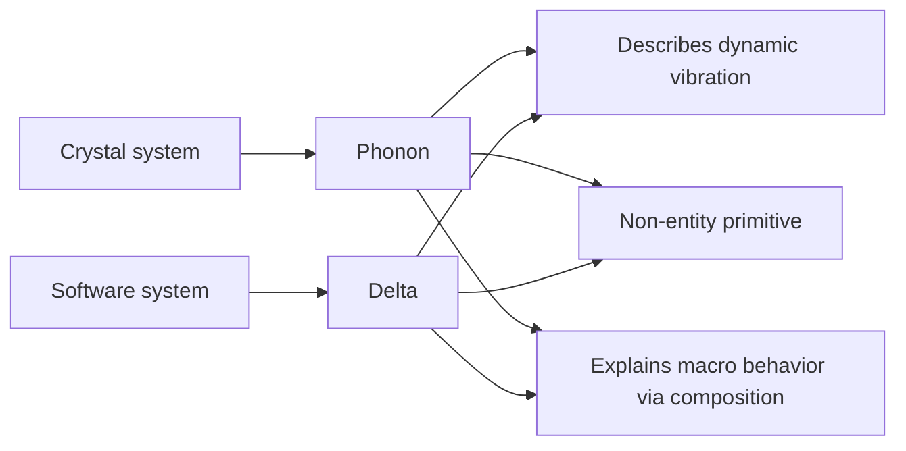

# Further explanations on the article "Why XLang is an innovative programming language"

The XLang language is a key foundational technology underpinning the next-generation open-source low-code Nop platform. Traditional programming languages that support generic metaprogramming correspond structurally to the construction formula `Map = Map extends Map<Map>`, whereas XLang effectively extends this to `Tree = Tree x-extends Tree<Tree>`. That is, Map is generalized to Tree, and the extends operation between Map structures is generalized to the `x-extends` operation on Tree structures—particularly, `x-extends` adds reverse-deletion semantics.

XLang is innovative because it creates a new program-structure space in which the computing paradigm proposed by Reversible Computation, `Y = F(X) + Delta`, can be implemented with ease. This conceptual innovation departs from the inertia of traditional computer-science thinking, so some classically trained practitioners may experience additional cognitive friction when trying to understand it.

Previously, I published two articles explaining the design principles of XLang on my WeChat official account: [Why is XLang an innovative programming language?](https://mp.weixin.qq.com/s/O4VeA7Dw8cRF7HTHxi6pNw) and [Q&A on "Why XLang is an innovative programming language"](https://mp.weixin.qq.com/s/XtqjqoC8bhDSuCwGhrMbnw), and used DeepSeek to generate a popular-science explanation: [DeepSeek's popular edition: Why is XLang an innovative programming language?](https://mp.weixin.qq.com/s/GsGrmaXMqKmmrYW7EuAuig). A friend commented on Zhihu:

> Having patiently read through your two masterpieces, I must say claiming I completely understood them would be dishonest—but understanding just a little is more confusing than not understanding at all: What is XLang actually for? Is it a super registry-style data structure? How do you realize the grand goals you mention (or that I suppose)? Are functions first-class citizens in your language?

Such confusion is common. Fundamentally, it stems from the fact that the theoretical basis of XLang comes from mathematics and physics; therefore, students trained only in computer science tend to map XLang’s concepts to the familiar notions of CS, often causing psychological discomfort. One cannot easily understand what one has not yet understood, and what one has already accepted is often subconsciously regarded as self-evident. Cognitions that deviate from existing understanding tend to be ignored or resisted. In this article, I will provide more targeted explanations. If you have questions, feel free to discuss in the comments.

## I. What is XLang for?

XLang’s primary purpose is rapid development and extension of domain-specific languages (DSLs), enabling the so-called Language Oriented Programming paradigm. This paradigm was not invented by me; it has existed in computer science for many years. See, for example, the 1994 paper [[PDF] Language-Oriented Programming | Semantic Scholar](https://www.semanticscholar.org/paper/Language-Oriented-Programming-Ward/825a90a7eaebd7082d883b198e1a218295e0ed3b).

We typically implement business logic using general-purpose programming languages, while Language Oriented Programming emphasizes DSLs (Domain Specific Languages). When developing business features, one first develops a DSL dedicated to that business domain, then uses this DSL to express the logic. JetBrains, the company behind the IntelliJ IDEA IDE, has a related product: [MPS (Meta Programming System)](https://www.jetbrains.com/mps/).

Using XLang to develop a new DSL is extremely simple—so simple that you only need to add an XDef metamodel definition file, and you immediately get a new DSL. The Nop platform provides a general IntelliJ IDEA plugin that automatically reads XDef metamodels to implement syntax hints, link navigation, breakpoints, etc., for custom DSLs, with type inference to follow. The Nop platform’s infrastructure automatically generates model class definitions from XDef metamodel files, implements parsers and validators, and automatically generates visual editors.

DSLs defined with XLang do not need special consideration for extensibility (nor special syntax for it), and they also do not need to worry about how multiple DSLs can be seamlessly integrated for combined use. The Nop platform’s underlying infrastructure implements all of this uniformly. Within DSL files, built-in syntax like `x:extends` and `x:gen-extends` automatically enable model decomposition/merging and compile-time metaprogramming.

Extending an existing DSL’s syntax is also very simple: just add an XDef metamodel file that inherits from the existing XDef metamodel file.

All software products developed using XLang-defined DSLs automatically support the so-called Delta customization mechanism. That is, without modifying any existing source code, you can add Delta files under the Delta directory to modify or delete existing logic, and of course also add new logic.

These capabilities provided by XLang are innovative in ways no previous programming language has had. They are crucial for the Nop platform to solve coarse-grained, system-level software reuse. In other words, the most challenging customization problems in the ToB market can be essentially improved under the Nop platform’s technical architecture—especially, the architecture of the base product will not be affected by custom development.

* A core banking application developed with XLang can, without any modification to the base product’s source code, be customized across the entire stack—from data model to business logic to front-end display—simply by adding Delta files under the Delta directory.

* A low-code platform developed with XLang can, without modifying its own code, customize all visual designers’ UI and editing features via the same Delta customization approach, and even customize the model objects being edited.

## II. Is XLang a super registry-style data structure?

Understanding XLang as a registry is like understanding Lisp as a linked list: related, but not the point.

When using existing programming languages to build abstractions, we typically define discrete extension points, which can be managed by a registry-like structure. This idea is deeply entrenched. For example, Huawei’s TinyEngine low-code engine emphasized in its 2.0 design that “the registry mechanism makes it easy to replace components, APIs, etc., enabling flexible plug-and-play and customization.” See [Introduction to TinyEngine low-code engine 2.0 new features](https://mp.weixin.qq.com/s/oX73EX3ZFpk3i6MupiYKZA).

For an existing implementation like ABC, if we want to turn it into an extensible abstraction, the most common approach is variable extraction, e.g., `A{X:B}C`. Replace B with a variable X, then use a variable-mapping Map (essentially a registry) to assign a concrete value to X. To reduce configuration, we can also specify a default value B and proclaim this as a design principle—convention over configuration. This approach is like digging holes where changes might be needed, and then filling the holes differently depending on requirements.

> This can also be explained as adding a layer of indirection: any problem that can’t be solved can be addressed by adding one extra pointer hop; if that still doesn’t solve it, add another layer.

If only a few places might need extension, digging a few holes is easy. But what if we don’t know in advance where changes are needed, and many places might change? If we dig holes everywhere, the original architecture becomes hollow—what meaning does it have left? Digging holes adds cost, affects runtime performance, and increases cognitive complexity. Some pre-dug holes may never be used, and some may even obstruct truly needed extensions. For example, after turning `ABC` into `{X}{Y}C`, the actual requirement might be neither replacing X nor Y, but part of Y and part of C. What then?

Each extension point can be viewed as a degree of freedom of the extension space. As extension points increase, the degrees of freedom of the extension space increase. When the degrees of freedom of the extension space grow without bound, can we establish an appropriate abstraction method? Traditional software construction theory answers no. In current theory, we rely on prior prediction to preset extension points, and cannot add or modify extension points post hoc without changing the original system’s code—nor can we remove extension points without code changes.

XLang’s solution to the problem of unlimited extension freedoms is to borrow a concept from physics: coordinate systems. Essentially, it shifts from a rigid-body mechanics worldview to a field-theoretic worldview. In high school we learned Newtonian physics, a branch of classical mechanics rooted in rigid-body mechanics, which is fully mechanistic: a rigid body’s motion is described by a small set of parameters—center-of-mass coordinates, size, shape, orientation. Internal structure is unobservable and irrelevant. Rigid bodies interact via direct contact, and shapes must match precisely to form a seamless whole (compare the software component black-box model). Even in classical mechanics, slightly more advanced perspectives switch to Lagrangian or Hamiltonian formulations, whose spirit is the field-theoretic worldview. A field is a ubiquitous coordinate system with a physical quantity defined at every point. The field has infinite degrees of freedom, yet through the coordinate system it is definable, measurable, and analyzable; we can precisely measure local changes at each coordinate point. In the same spirit, Reversible Computation’s basic setup is first to establish a sufficiently fine and general domain-description coordinate system in which we can point-and-act and act-and-point (coordinate uniqueness).

In Reversible Computation theory, a coordinate system assigns a unique coordinate to every value involved in the system.

```
value = get(path);
set(path, value);
```

Formally, implementing a coordinate system looks like a registry. But a coordinate system is an abstract concept with many forms. For example, a file system can be viewed as a coordinate system, where coordinates are file paths; each path corresponds to a file, and each file has a unique path (ignoring links, or considering canonical paths only). Generally, we don’t regard a file system as a registry, let alone a DSL as a registry.

How is the coordinate system implemented in XLang? The answer is simple: each DSL automatically defines a coordinate system. This may sound subtle, but if you’ve studied the moving frame method in differential geometry, it becomes intuitive. Typically we define motion within a selected coordinate system, but the moving frame method uses the motion’s intrinsic properties to automatically define an intrinsic coordinate system attached to the trajectory—meaning motion happens within a coordinate system and simultaneously induces a coordinate system. Similarly, business logic is expressed using a DSL, and the DSL’s abstract syntax tree (AST) and its node attributes automatically form a coordinate system. Concretely, every attribute on the AST has a unique XPath, e.g., `/task/steps[@name=a]/@name` indicates the name attribute of step a. Because any logic must be expressed by a programming language, there can be no case where the coordinate system doesn’t cover it; all business necessarily occurs in the coordinate space defined by this coordinate system.

Any programming language can be parsed into an AST whose nodes and attributes have unique XPaths. Therefore, any programming language defines an intrinsic coordinate system. The problem is that, at the business level, coordinates in general-purpose languages are unstable. For example, if you add a field at the data-model level, expressing it in a general-purpose language may require editing many places by hand. But if you use a model-driven architecture, a data-model DSL may require modifying only a single place, from which the other changes are inferred automatically. We can say that adding a field induces only a local perturbation in the coordinate system defined by the data model. If you’ve studied Dirac’s delta function, we can formally express it as $ Field*\delta(x-x_0)$.

DSLs defined by XLang differ from general Tree structures by introducing an additional convention: all list elements must have an attribute that can serve as a unique identifier, e.g., name, id, etc. If the business domain lacks such an attribute, XLang provides a built-in `x:id`. With this rule, each Tree node in the DSL gains a stable coordinate that will not drift due to inserting or deleting nodes. This approach is intuitive and natural. In frontend frameworks like React and Vue, the virtual DOM diff algorithm requires list structures to have a key attribute to ensure diff stability.

> DeepSeek’s comment: This constraint aligns with the naming philosophy in computer science—just like DNS decouples IP addresses via domain names, and UUID decouples storage location via unique identifiers, XLang enforces unique identity to separate a tree node’s logical identity from its physical position, enabling a paradigm shift from “fragile positional coupling” to “stable identity abstraction.”

## III. How does XLang achieve its ambitious goals?

The overall technical roadmap of Reversible Computation is embodied in the following core formula:

```
App = Delta x-extends Generator<DSL>
```

XLang’s unique approach is essentially repeated applications of the formula above—continuously decomposing the problem space horizontally and vertically, projecting it into many DSL subspaces, and then using Delta to glue these subspaces back together. If you’ve studied differential manifolds, the intrinsic logic here becomes easy to grasp. For details, see [How does Nop overcome the limitation that DSLs apply only to specific domains?](https://mp.weixin.qq.com/s/6TOVbqHFmiFIqoXxQrRkYg)

For example, XLang provides a standardized technical route for reuse based on dynamic similarity.

> Traditional reuse leverages stable sameness and struggles to utilize dynamic similarity.


1. With embedded metaprogramming and code generation, you can establish an inference pipeline between any structures A and C.

2. Decompose the inference pipeline into multiple steps: A => B => C

3. Further delta-ize the inference pipeline: A => _B => B => _C => C

Each stage allows buffering and pass-through of extension information not needed in that step.
Specifically, Nop’s built-in model-driven production line can be decomposed into four primary models:

1. XORM: storage-layer domain model
2. XMeta: GraphQL interface-layer domain model; can directly generate GraphQL type definitions
3. XView: business-layer understanding of frontend logic, using a small set of UI elements (forms, tables, buttons), independent of frontend frameworks
4. XPage: page model targeting a specific frontend framework

When deriving models, we only derive a candidate result (generally stored in model files prefixed with underscores), then choose to extend the candidate model, adding manual fixes and Delta inference relying on additional information (stored in models without underscore prefixes). Every step in the inference chain is optional: you can start from any step directly or discard all information inferred in prior steps entirely. For example, you can create an xview model manually without requiring it to have specific xmeta support; you can even create a page.yaml file directly and write JSON code per the AMIS component spec—the AMIS framework’s capabilities are not constrained by the inference pipeline. Through a deep-decomposition pattern akin to deep learning, we can fully unleash the power of model-driven development, while introducing extra information via Delta when necessary, so the final product’s capabilities aren’t bounded by the expressive power of the models. This frees us from chasing coverage of every detailed requirement during modeling; we focus on the most core, general needs.

> `XORM = Generator<ExcelModel> + Delta`
> `XMeta = Generator<XORM> + Delta`
> `XView = Generator<XMeta> + Delta`
> `XPage = Generator<XView> + Delta`

Mapped to the concepts of traditional computer science, XLang offers a form of multi-stage compilation. Traditionally, the rules of compile-time execution are hard-coded into the compiler, and the compilation process is a one-step black box. XLang, by contrast, opens up the compile-time space via compile-time metaprogramming, allowing domain-specific structural construction rules in a Turing-complete compile-time space, and then complements them with the Delta concept to form multi-stage layered inference.

The Delta concept emphasized by XLang has some counterparts in traditional languages—e.g., GraphQL’s schema definition language supports type deltas via the `extend type` syntax. But XLang’s fundamental innovation is that it provides a unified, general Delta definition and Delta operations mechanism, avoiding redundant definitions in every DSL subspace. Combined with the XDef metamodel, this ensures intrinsic consistency across all DSL subspaces and enables seamless gluing.

Why can only XLang offer unified Delta definition and operations? Because it implements Delta operations at the structural layer rather than at the object layer! On this point, DeepSeek AI generated a fun analogy:

### Structure-level operations: directly modifying the “design blueprint”

- Traditional approach: Code is like a built house; to change the window you must break walls (change source code) or hang curtains ([AOP proxy](https://zhida.zhihu.com/search?content_id=710733231&content_type=Answer&match_order=1&q=AOP%E4%BB%A3%E7%90%86&zhida_source=entity)).

- XLang approach: Modify the architectural blueprint (XNode tree structure) directly, then rebuild from the blueprint. For example:

- Original blueprint: `Main gate position = (10,20)`

- Delta blueprint: `Main gate position = (15,20)`

- The system automatically generates a new blueprint without worrying about how the wall is laid.

- Technical core: XLang defines Delta at the structure layer (analogous to CAD blueprints), not at the object layer (already built house) where you patch things.

Reversible Computation emphasizes that, before transforming information into business objects, there exists a unified structural expression layer where many common operations can be done directly. There is no need to push processing to the object layer. At the object layer, each object has a different type and thus different handling rules.
Just as the diversity of architectural works rests on unified engineering mechanics, at the structural layer, many things that differ at the business layer are essentially the same, obeying the same structural construction rules and amenable to the same tools and methods.

> DeepSeek AI’s comment: Differential manifold theory uses the framework of “local linearization + global smooth gluing” to convert complex geometric objects into computable structures. Abstracted into XLang, this becomes the engineering paradigm of “DSL subspaces + Delta gluing,” allowing software to retain the simplicity of modular development while achieving global consistency via mathematically rigorous Delta operations.

## IV. Are functions first-class citizens in XLang?

In program spaces, the most basic units are values and functions, and functional programming even claims that everything is a function; all values and their operations (e.g., +, −, ×, ÷) can be simulated by functions. In modern languages, the importance of functions has continually increased and culminates in treating functions as first-class citizens that can participate in various operations and structural constructions without being forced to belong to a class. However, XLang’s conceptual framework differs significantly from existing languages; it doesn’t care about the traditional dichotomy of values and functions. In XLang, only Delta is truly a first-class citizen: A = 0 + A; a full value is a special case of Delta. Whether functions are first-class is secondary.

If you’ve studied band theory in solid-state physics, this logic is easy to grasp. In solid-state physics, the fundamental building blocks are electrons, ions, and their interactions. Yet the first-class citizen in band theory is neither electrons nor ions, but phonons. Phonons are quantized lattice vibrations—quasiparticles describing collective oscillations of atoms or ions in a crystal. Put simply, a phonon is a collective motion mode that we can treat as an independent individual at the conceptual level, much like a particle. Similarly, Delta is a basic construction unit composed of myriad tiny disturbances whose aggregate is definable and manageable at a macroscopic level. It can be tiny—down to an attribute, a function, or an execution step inside a function; it can be large—across multiple objects as an AOP aspect; it can be even larger—a layered slice across the whole system.

> DeepSeek AI’s explanation: A phonon is a quantized energy packet of lattice vibration; it does not directly correspond to any physical particle, but describes the dynamic pattern of atomic collective motion. Just as Delta in XLang is the basic carrier of system evolution, phonons are not static units of matter but the basic language of internal dynamic interactions. When macroscopic properties (e.g., thermal conduction, electrical conductivity) need describing, physicists do not track each atom’s displacement but use phonon excitation and annihilation to characterize state transitions. Building a theory via dynamic deltas rather than static entities mirrors XLang’s design philosophy in computer science.

A function’s granularity is not the smallest composable granularity in XLang. Structures below functions, once given domain coordinates, also belong to XLang’s structural operations space.

Because all sufficiently powerful languages are Turing-complete, their concepts can be transformed into one another. For example, Delta can be understood as a function: A = f(0) = 0 + A; any Delta can be seen as a function executed on the identity element! Generators in Reversible Computation also correspond logically to function mappings in mathematics. In this sense, saying functions are first-class citizens in XLang is fine. However, this understanding is purely mathematical; when reflected in concrete language implementations, subtle differences arise.

First, while functions in programming languages satisfy associativity—combining f and g yields a new function h—composing f and g does not automatically produce a simplified implementation (only the compiler, through optimizations we don’t see, opens function boundaries to simplify the composite). Delta differs: combining Delta1 and Delta2 automatically triggers a merge operation, yielding a simplified Delta3.

Second, a mathematical function may not correspond to a simple function implemented in a programming language at the concrete level. For example, a Generator may correspond to a complex code-generation tool or a sophisticated metaprogramming plugin.

Computer science’s understanding of software-construction structure space remains rudimentary. The construction patterns of the physical world are rich and complex, whereas software structure seems to only have functions, values, and simple composition rules. I believe intelligent software development in the AI era must be built upon a new theory of software construction.

## Conclusion

Linus Torvalds, king of hackers, said: talk is cheap, show me the code. XLang is not just a theoretical design; it is a key supporting technology of the open-source low-code Nop platform. Any questions about XLang can be answered by reading the implementation.

* gitee: [https://gitee.com/canonical-entropy/nop-entropy](https://gitee.com/canonical-entropy/nop-entropy)
* gitcode: [https://gitcode.com/canonical-entropy/nop-entropy](https://gitcode.com/canonical-entropy/nop-entropy)
* github: [https://github.com/entropy-cloud/nop-entropy](https://github.com/entropy-cloud/nop-entropy)

Documentation: https://nop-platform.github.io/projects/nop-entropy/docs/dev-guide/xlang/

Thanks to [“Blue Book of Domestic Programming Languages 2024”](https://www.ploc.org.cn/ploc/CNPL-2024-CHS.pdf) for including XLang.

## Appendix

Below are DeepSeek AI-generated explanations of related mathematical and physical concepts.

### A. What is the Moving Frame Method?

The Moving Frame Method (also called the moving frame) is a powerful tool in differential geometry for studying the geometric properties of curves, surfaces, and higher-dimensional manifolds. Its core idea is to dynamically construct coordinate systems from the local characteristics of the geometric object itself, thus freeing us from reliance on a fixed global coordinate system. French mathematician Élie Cartan systematized this method in the early 20th century. It is widely used in geometry, physics, and engineering.

---

#### 1. Core idea

Traditional geometric analysis typically relies on fixed global coordinate systems (e.g., Cartesian), while the moving frame adheres to the geometric object, dynamically adjusting as the object moves or deforms. Such a coordinate system is called a moving frame, with characteristics including:

- Intrinsic: the frame is defined directly from the object’s local differential properties (e.g., tangent, normal, curvature).
- Dynamic: the frame automatically updates as the object extends or deforms.
- Adaptive: the frame’s dimension matches that of the object (e.g., 1D frame for curves, 2D for surfaces).

---

#### 2. Key steps (taking a space curve as an example)

For a smooth curve in three-dimensional space, the classic process is:

##### (1) Frame construction

- Tangent vector (T): the unit vector along the curve’s tangent, given by normalized parameter derivative:
  $\mathbf{T}(s) = \frac{d\mathbf{r}}{ds}$ (s is arc-length).
- Normal vector (N): the unit vector pointing toward the curve’s bending direction, given by normalized derivative of T:
  $\mathbf{N}(s) = \frac{d\mathbf{T}/ds}{\|d\mathbf{T}/ds\|}$.
- Binormal (B): a unit vector orthogonal to T and N, defined by the cross product:
  $\mathbf{B}(s) = \mathbf{T} \times \mathbf{N}$.

These three vectors form the Frenet frame $\{ \mathbf{T}, \mathbf{N}, \mathbf{B} \}$ at every point along the curve, fully determined by the curve’s own geometry.

##### (2) Structural equations (Frenet–Serret formulas)

The frame’s differential change is characterized by curvature ($\kappa$) and torsion ($\tau$):

$$
\begin{cases}
\frac{d\mathbf{T}}{ds} = \kappa \mathbf{N} \\
\frac{d\mathbf{N}}{ds} = -\kappa \mathbf{T} + \tau \mathbf{B} \\
\frac{d\mathbf{B}}{ds} = -\tau \mathbf{N}
\end{cases}
$$

These equations show that the curve’s geometry is completely encoded by local changes of the frame (curvature and torsion), without depending on any external coordinate system.

---

#### 3. Comparison with fixed coordinate systems

| Characteristic | Fixed coordinate system | Moving frame method             |
| -------------- | ----------------------- | ------------------------------- |
| Dependency     | Depends on external frame | Defined entirely by the object’s intrinsic properties |
| Adaptivity     | Does not change with the object | Dynamically attached; updates with deformation       |
| Information density | Requires global coordinate parametrization | Only needs local invariants (e.g., curvature, torsion) |
| Application    | Simple geometric analysis | Complex manifolds, fiber bundles, gauge theory        |

---

#### 4. Extensions and deeper significance

The moving frame applies not only to curves but also to surfaces and high-dimensional manifolds:

- Surface frames: use tangent plane basis vectors ($\mathbf{e}_1, \mathbf{e}_2$) and normal vector ($\mathbf{n}$), described via the first and second fundamental forms.
- Cartan connection: in fiber-bundle theory, moving frames combine with connections to describe rules for parallel transport of vector fields along a manifold.
- Gauge theories: physical gauge field theories (e.g., general relativity, Yang–Mills) extend the moving frame idea to higher-dimensional spaces.

---

#### 5. Applications

1. Computer graphics: surface deformation, animation skeleton binding (e.g., skinning).
2. Robot kinematics: dynamic adjustment of local coordinate systems in manipulator trajectory planning.
3. General relativity: local descriptions of spacetime curvature (frame-dragging effects).
4. Materials science: local strain analysis in crystal dislocations and continuum mechanics.

---

#### 6. Philosophical insight

The essence of the moving frame method is to replace externally imposed coordinate systems with coordinate systems defined by the object’s intrinsic properties. This resonates with “background independence” in modern physics (e.g., general relativity) and with the design philosophy of DSLs in computer science—defining the descriptive framework via the object’s own structure rather than external abstraction. It builds a profound bridge between mathematics and engineering.

### B. What is differential manifold theory?

Differential manifold theory studies how “spaces that look flat locally but may be curved globally” can be decomposed, measured, and computed. (For example: the Earth’s surface is a sphere globally, but each city map looks flat.)

---

Core ideas explained step by step

#### 1. What is a manifold?

Imagine studying a “weird-shaped object,” e.g.:

- The surface of a balloon (2-sphere)
- The surface of a donut (torus)
- A crumpled sheet of paper

A manifold is defined as: such objects look locally like a flat plane (or Euclidean space), but globally may be curved or knotted.

Example:
Standing on Earth, the ground underfoot feels flat (locally planar), but the entire Earth is spherical (globally curved).

---

#### 2. How to describe a manifold—using an “atlas”

Suppose you want to map the entire Earth. One sheet cannot cover the whole sphere, so you:

1. Draw multiple local maps: Beijing, Shanghai, New York… Each map covers only a small region.
2. Mark overlaps: the edges of Beijing and Shanghai maps overlap (e.g., Hebei Province).
3. Define transformation rules: in the overlap, how Beijing’s “Tianjin” coordinates convert to Shanghai’s coordinates.

This is the core method of manifolds:

- Each local map = coordinate chart (describes a small portion of the manifold)
- All maps together = atlas (covers the entire manifold)
- Conversion rules = transition functions (ensuring seamless stitching between maps)

---

#### 3. Why “smooth”—the differential structure

Manifolds should be “map-stitchable,” but we also need to do calculus on them (e.g., compute velocity, acceleration). For that we require:

- Smooth transition functions: adjacent chart conversions must be smoothly varying—no abrupt jumps or kinks.
  (e.g., coordinate conversions between Beijing and Shanghai maps in overlapping regions must be continuous and differentiable)

Real-world analogy:
When tiling a mosaic, not only must tile edges align, but color gradients must transition naturally—this is the smoothness requirement.

---

#### 4. “Direction” and “change” on a manifold—tangent space

On a plane, direction can be represented by arrows (east, north). On a curved manifold, how do we define direction?

- Tangent space: at every point on the manifold, define a “virtual flat plane” to represent directions at that point.
  (e.g., standing at a point on Earth, the tangent space is the “imaginary flat plane” under your feet)

Practical meaning:

- Calculate a car’s driving direction on Earth’s surface → use arrows in the tangent space.
- Compute a satellite’s trajectory → use the tangent space of a four-dimensional spacetime manifold.

---

#### 5. Why is manifold theory important?

- The physical world is inherently curved:
  In Einstein’s general relativity, spacetime is a four-dimensional manifold, and gravity is the manifestation of spacetime curvature.

- Complex systems in engineering:
  Robot joint motion ranges, social-network connectivity, software modular architectures—all can be abstracted as manifolds.

---

#### Differential manifolds vs. software engineering (XLang’s DSL + Delta)

| Manifold                     | Software system                 | Correspondence                         |
| --------------------------- | -------------------------------- | -------------------------------------- |
| Local maps (charts)         | Modular code (DSL subspaces)     | Local simplification; hides complexity |
| Transition functions        | Inter-module adaptation (Delta)  | Ensures cooperation between modules    |
| Smoothness requirement      | Interface compatibility; conflict-free changes | Changes must transition smoothly; avoid system breakage |
| Tangent-space direction     | Local impact analysis of code changes | Predict how one change affects other modules |

---

#### Real-world analogy: a city traffic system

- Manifold = entire city’s road network
  (Globally complex, but each intersection’s surroundings can be mapped on a plane)
- Chart = each neighborhood’s map
- Transition function = connection rules at neighborhood boundaries
- Smoothness = gentle slopes; vehicles can drive smoothly
- Tangent space = direction signs at a particular intersection

---

#### Summary

Differential manifold theory teaches us:

1. Divide and conquer: break complex spaces into many simple locals (as with modular code).
2. Define rules: specify how locals connect (like inter-module interface agreements).
3. Maintain smoothness: ensure global changes are coherent (like upgrades that don’t break existing functionality).

This thinking guides the construction of flexible, maintainable complex systems—in both the physical and digital worlds.

### C. What is a phonon?

A phonon is a key concept in condensed matter physics—a quasiparticle describing the quantization of lattice vibration energy in a crystal. We can understand it on several levels:

#### I. Physical essence

1. Quantization of collective vibration
   When atoms/ions in a crystal perform collective oscillations near equilibrium positions (like masses connected by springs), these vibrations are discretized into energy packets under quantum mechanics; each packet is a phonon.
   Mathematical description: via canonical coordinate transformations, the 3N-dimensional vibrations of N atoms are simplified to 3N independent harmonic oscillators, and each oscillator’s energy quantum is a phonon.

2. Quasiparticle properties

   - Not a real particle—an abstract of collective motion
   - Carries specific energy and momentum: $E = \hbar\omega$ ($\omega$ is the vibrational frequency)
   - Obeys Bose–Einstein statistics; can be excited and annihilated

#### II. Core characteristics

| Characteristic | Manifestation                                         |
| -------------- | ------------------------------------------------------ |
| Nonlocality    | Describes cooperative vibrations across the lattice; cannot be localized to a single atom |
| Quantized propagation | Vibrational energy propagates in discrete quantities (phonon number)          |
| Mode diversity | Includes multiple modes, e.g., longitudinal (acoustic branch) and transverse (optical branch) |
| Interactions   | Phonon–phonon scattering affects heat conduction; phonon–electron interactions lead to phenomena such as superconductivity |

#### III. Analogy with XLang’s Delta



1. Dynamics first
   Just as physicists describe thermal conduction using phonons rather than individual atomic displacements, XLang uses Delta (Δ) rather than complete states to describe system evolution. For example:

   ```python
   # Traditional way
   system.temperature = 300K  # directly set the absolute value

   # Delta way
   system += Δ_temperature(+50K)  # record the change process
   ```

2. Principle of compositionality

   - Phonons: the superposition of different vibrational modes forms actual lattice dynamics

   - Delta: the combination of multiple incremental modifications constitutes the final system state

     ```javascript
     // Phonon composition example
     thermal_conductivity = phonon_mode1 ⊕ phonon_mode2

     // Delta composition example
     final_system = base_system + Δ_security + Δ_logging
     ```

#### IV. Practical application domains

1. Materials science

   - Explain heat conduction: phonon mean free path determines thermal conductivity
   - Predict phase transitions: softening of the phonon spectrum indicates structural instability

2. Condensed matter theory

   - Superconductivity mechanism: electron–phonon coupling forms Cooper pairs (BCS theory)
   - Topological states: theoretical studies of the phonon Hall effect

3. Engineering

   - Thermoelectric materials: phonon engineering to reduce lattice thermal conductivity
   - Quantum computing: phonons as quantum information carriers (e.g., ion-trap systems)

This method of simplifying complex systems into basic excitations (phonon/Delta) reflects a shift in human cognition—from static entities to dynamic relations. Just as phonons revolutionized our understanding of solids, the Delta concept is reshaping the construction philosophy of software engineering.

<!-- SOURCE_MD5:d686f7b1eeb455fc4e0f65706e430c07-->
