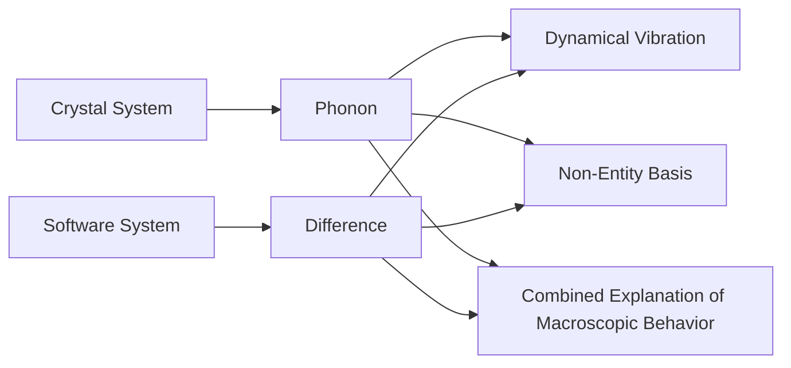

# About "Why XLang is an Innovative Programming Language" - Further Explanation

XLang is a key technology underlying the next-generation open-source low-code platform, NoP. Traditional programming languages that support generic programming correspond structurally to the construction formula `Map = Map extends Map[Map]`, while XLang extends this formula to `Tree = Tree x-extends Tree[T]`. This extension expands the `x-extends` operation between Map structures into a corresponding `x-extends` operation within Tree structures, particularly adding reverse deletion semantics to `x-extends`.

What makes XLang an innovative programming language is that it creates a new structural space in which the computational paradigm `Y = F(X) + Delta` can be conveniently implemented as per reversible computation theory. This concept represents a strong innovation compared to traditional computer science thinking and often causes those with a background in computational science to encounter additional cognitive barriers.

Previously, I published two articles on the design principles of XLang language on my public account: "[Why XLang is an Innovative Programming Language?](https://mp.weixin.qq.com/s/O4VeA7Dw8cRF7HTHxi6pNw)" and its follow-up explanation "[Further Explanation of 'Why XLang is an Innovative Programming Language']((https://mp.weixin.qq.com/s/XtqjqoC8bhDSuCwGhrMbnw)". Additionally, with the help of DeepSeek, I published a simplified explanation: "[DeepSeek's Simplified Explanation: Why is XLang an Innovative Programming Language?](https://mp.weixin.qq.com/s/GsGrmaXMqKmmrYW7EuAuig)".

A friend on Zhihu commented after reading my two articles:

> After reading your works, I feel I still don't fully understand. It's with a sense of duty that I speak up, but the more I try to grasp it, the more confused I become: What is XLang actually used for? Is it just another type of registry or data structure? How do you achieve the goals you mentioned?

This confusion is quite common. At its core, it stems from the fact that XLang's underlying theoretical principles originate from mathematics and physics. For those with only computational education, mapping these concepts to their familiar domain can lead to cognitive discomfort. **One struggles to understand that which they have not yet understood**, while familiar concepts are often taken for granted. Deviations from existing understanding may be met with automatic dismissal or even resistance.

In this text, I will provide further clarification: [Further Explanation of "Why XLang is an Innovative Programming Language"]((https://mp.weixin.qq.com/s/XtqjqoC8bhDSuCwGhrMbnw).

## 一. What is XLang Used For?

**The primary purpose of XLang is to enable rapid development and extension of domain-specific languages (DSLs), implementing the paradigm of **Language-Oriented Programming**.**

Language-oriented programming is not a concept I invented; it has existed in the field of computer science for many years, as evidenced by this 1994 paper: "[Language-Oriented Programming](https://www.semanticscholar.org/paper/Language-Oriented-Programming-Ward/825a90a7eaebd7082d883b198e1a218295e0ed3b)".

When developing applications, we typically use general-purpose programming languages. Language-oriented programming, however, emphasizes the role of domain-specific languages (DSLs), which are specialized for particular domains. Developers first create a DSL tailored to their specific business domain and then implement the application logic using that DSL.

The JetBrains company offers a product called **MPS (Meta Programming System)** that supports the development of such IDEs. Using XLang, you can define your own DSL with just an XDef metadata file. The Nop platform provides a universal plugin for IDEA that automatically reads XDef metadata files, offering features like syntax highlighting, navigation, debugging, and type inference. Its infrastructure is built on XDef meta-modeling, which generates classes, parsers, and validators automatically.

With XLang, defining a new DSL becomes so simple that you only need to add an XDef file. Nop's underlying infrastructure handles the rest, including extension capabilities like `x:extends`, `x:gen-extends`, and others. These built-in mechanisms allow for seamless data model decomposition and integration, as well as code generation at both compile-time and runtime.

If you already have a DSL and want to extend its syntax, it's equally straightforward—simply add an XDef file that inherits from your existing XDef metadata. This approach avoids the need to worry about extension mechanisms or multiple DSLs coexisting in the same project.

# Using XLang DSL Developed Software Products Automatically Support Delta Customization Mechanism

XLang provides innovative capabilities that no other programming language possesses. These capabilities are crucial for software reuse at the grain level and system-level, especially in the ToB market where customization is often challenging. The Nop platform exemplifies this improvement through its architecture, which remains unaffected by customized development.

## 2. Is XLang Essentially a Registry-Based Data Structure?

Understanding XLang through the lens of registries is analogous to understanding Lisp through the lens of lists—there's a connection but it doesn't fundamentally alter the concept. While existing programming languages rely on discrete extension points defined during abstraction, XLang employs a registry-like structure to manage these extensions. This approach is deeply rooted in systems like Huawei's TinyEngine, which emphasizes that customization can be easily implemented at the component and API level through its registry mechanism. Refer to [TinyEngine Low-Code Engine 2.0 New Features](https://mp.weixin.qq.com/s/oX73EX3ZFpk3i6MupiYKZA) for more details.

For existing implementations, such as ABC, variable extraction (e.g., `A{X:B}C`) allows B to be replaced with X, mapping values through a registry (essentially a map). This approach minimizes configuration by setting default values, adhering to the "Convention over Configuration" principle. **This mechanism essentially creates holes where needed and fills them based on requirements**.

## Extending Complexity

If only a few areas require expansion, pre-digging a few holes is straightforward. However, if uncertainty persists about which areas might need changes and multiple regions are subject to modification, the risk of over-engineering arises. **Extensive digging leads to an empty architecture, leaving the core structure without purpose**. The cost of drilling includes not only time but also runtime performance impacts and increased complexity. Pre-digged holes may become unused, potentially obstructing necessary expansions.

Each extension point can be viewed as a degree of freedom. As extensions multiply, managing this flexibility becomes challenging. **Unrestricted expansion results in an architecture that prioritizes adaptability over stability**. Traditional software construction theories generally oppose such approaches, advocating instead for预先设计好扩展点 and relying on预先配置好的系统进行修改.

## Addressing Infinite Degrees of Freedom

XLang addresses the challenge of infinite degrees of freedom through innovative concepts borrowed from physics: the coordinate system. At its core, this mechanism ensures that each point in space is assigned a unique coordinate, enabling precise manipulation of physical laws. Even in classical mechanics, higher-level theories like Lagrangian or Hamiltonian formulations eventually rely on coordinates to describe systems. **XLang's approach mirrors this, allowing for precise control over complex systems**.

In the realm of invertible computation, XLang introduces a unique system where each value is assigned a unique coordinate. This ensures that every change in the system can be precisely tracked and managed without losing the essence of the original design.

## Mathematical Representation

```
value = get(path);
set(path, value);
```

# Coordinate System Implementation in XLang

## 1. Understanding the Coordinate System
From a structural perspective, the implementation of a coordinate system resembles a registry mechanism. However, a coordinate system is an abstract concept that can take many forms. For example, a file system can be viewed as a coordinate system where the coordinates are file paths. Each file path corresponds to a specific file, and each file has a unique file path (considering only the canonical path). In general, we do not treat a file system as a registry mechanism, nor do we consider a DSL language as a registry mechanism.

## 2. Implementation in XLang
How is a coordinate system implemented in XLang? The answer is straightforward: **every DSL automatically defines a coordinate system**. This concept may seem abstract, but if you have studied active coordinate transformation methods, such as those used in differential geometry, you can quickly grasp it. Generally, we define motion within a predefined coordinate system. However, the active coordinate transformation method uses the inherent characteristics of motion to automatically define an intrinsic coordinate system that adheres to the trajectory of motion. In other words, **motion occurs within a coordinate system and generates its own coordinate system**. Similarly, business logic is expressed using DSLs, and the abstract syntax tree (AST) along with its nodes and attributes automatically form a coordinate system. Specifically, each attribute in the AST has a unique XPath, such as `/task/steps[@name=a]/@name`, which represents the `name` attribute of step `a`.

## 3. Any Programming Language Can Be Represented as an AST
Any programming language can be parsed into an abstract syntax tree (AST). Each node and attribute in the AST has a unique XPath, meaning that any logic can be expressed using a programming language. Consequently, there is no scenario where a coordinate system does not cover certain aspects of a business; all business operations necessarily occur within the coordinate system defined by the DSL.

## 4. Challenges with General Programming Languages
The issue lies in the stability of the coordinate system at the business level when using general programming languages. For example, adding a new field to the data model may require manual modifications across multiple places if you are not using a model-driven architecture. In such cases, only one modification is needed in the DSL-defined data model, and the rest follows automatically through inference. We can say that introducing a new field results in only localized disturbances within the data model's defined coordinate system. If you have studied the Delta function, you can mathematically express this as $Field*\delta(x-x_0)$.

## 5. Comparing DSLs to General Tree Structures
In comparison, all DSLs defined by XLang differ from general tree structures in one key aspect: **every list element must have a unique identifying attribute** (e.g., `name`, `id`). If the business layer does not have such attributes, XLang provides built-in support for `x:id` to serve as the identifier. This ensures that adding or removing elements does not cause coordinate shifts for other nodes in the tree. This approach is both intuitive and easy to understand, resembling the way React and Vue frameworks handle virtual DOM diffs by requiring a unique key for each list element.

## 6. DeepSeek Evaluation
> **DeepSeek's Evaluation**: This constraint aligns with computer science's naming philosophy, similar to how DNS decouples domain names from IP addresses, UUIDs from storage locations, and XLang enforces the separation of logical identity from physical location through unique identifiers. This transition from "fragile coupling" to "stable abstraction" represents a paradigm shift.

## 7. Achieving XLang's Ambitious Goals
### Core Formula
The overall approach for implementing XLang's ambitious goals is encapsulated in this core formula:

```
App = Delta x-extends Generator<DSL>
```

XLang's unique approach involves repeatedly applying the above formula, **constantly projecting and merging multiple DSL subspaces into a single cohesive space using Delta differences**. If you are familiar with differential topology, you can understand the intrinsic logic behind this approach.

### Example: Overcoming Limitations of Traditional Usage
For instance, traditional usage of a general programming language like Java would require manual modifications across multiple layers when adding a new field to the data model. However, within XLang's DSL-defined coordinate system, such a change would only affect the data model's intrinsic structure through inference. This localized impact can be mathematically expressed using the Delta function as $Field*\delta(x-x_0)$.

### Standardization Through Convention
XLang introduces an additional convention: **every list element must have a unique identifying attribute** (e.g., `name`, `id`). If the business layer lacks such attributes, XLang provides built-in support for `x:id`. This ensures that adding or removing elements does not disrupt the coordinates of other nodes in the tree. This approach is both intuitive and aligns with how React and Vue handle virtual DOM diffs by requiring unique keys for list elements.

### Embedded Meta-Programming
The implementation leverages embedded meta-programming capabilities to generate the necessary structures. For example, the Nop framework (not shown here) can be divided into four core models:

1. **XORM**: A model-oriented persistence layer designed for storage layers.
2. **XMeta**: A metadata layer tailored for GraphQL interfaces, enabling direct type definitions.
3. **XView**: A business logic layer that abstracts the frontend using forms, tables, and buttons, independent of the specific UI framework.
4. **XPage**: A page model layer that uses a specific frontend framework.

### Pipeline Example
1. Utilize embedded meta-programming to generate the necessary structures.
2. Define a pipeline: `A => B => C`.
3. Further refine the pipeline using differential logic: `A => _B => _B => _C => C`.

Each step allows temporary storage and data propagation without affecting other nodes' coordinates.

## 8. Conclusion
In summary, XLang's approach to defining coordinate systems is both powerful and unique. It enables automatic generation of intrinsic coordinate systems that adapt to the inherent structure of data and logic, ensuring stability and scalability across various domains. The use of Delta functions and embedded meta-programming further enhances this capability, making it a versatile tool for diverse applications.

# Model Derivation in XLang

When performing model derivation, we only derive an alternative result (generally stored in files with underscores as prefixes). We can then choose to inherit this alternative model, manually correct it, and add additional information via Delta reasoning (stored in files without underscores as prefixes). The entire reasoning process consists of optional steps: we can start from any step or completely skip all previous steps. For example, we can manually add an xview model without requiring xmeta support, or directly create a new page.yaml file according to the AMIS component specifications and write JSON code in accordance with the AMIS framework. The AMIS framework's capabilities are not constrained by the reasoning pipeline. This also allows us to focus on the core and universal requirements during modeling, rather than trying to cover every possible detail.

> `XORM = Generator<ExcelModel> + Delta`
> `XMeta = Generator<XORM> + Delta`
> `XView = Generator<XMeta> + Delta`
> `XPage = Generator<XView> + Delta`

If mapped to traditional computer science concepts, XLang's capabilities can be described as a multi-stage compilation model. Traditionally, the compilation process is akin to a black box with a single step, while XLang employs a more open-ended approach through meta-compilation. This allows for the introduction of domain-specific rules at both the structural and operational levels, enabling a graph-like representation of the entire reasoning process.

XLang's emphasis on Delta concepts has parallels in traditional programming languages, such as GraphQL's `extend type` syntax for introducing incremental changes. However, XLang's true innovation lies in its unified, generic Delta definition and operation mechanism, which avoids redundant definitions across multiple DSLs by leveraging a single XDef meta-model.

What sets XLang apart is its ability to provide a unified Delta definition and operation? Because it operates at the structural level rather than the object level when implementing Delta operations! Regarding this point, DeepSeek AI has autogenerated an interesting analogy:

## Structural Operations: Directly Modify "Design Drawing"

- **Traditional Approach**: Codes like well-built houses. If a window is broken (modify source code) or a wall collapses ([AOP Proxy](https://zhida.zhihu.com/search?content_id=710733231&content_type=Answer&match_order=1&q=AOP%E4%BB%A3%E7%90%86)), you can fix it. For example:
  - Original drawing: `大门位置=(10,20)`
  - Delta change: `大门位置=(15,20)`
  - System auto-generates new drawings without worrying about walls.

- **XLang Approach**: XLang operates like a CAD tool at the structure level, allowing direct modification of the design graph (XNode) rather than individual components. For example:
  - Original design: `大门位置=(10,20)`
  - Delta change: `大门位置=(15,20)`
  - System auto-generates new drawings without manual intervention.

## Technical Core: XLang's Structural Layer

XLang operates at the structural level (similar to CAD software) rather than the object level. This allows for true reversible computation. Before information is converted into business objects, there exists a unified structure layer where all operations are traceable and modifiable. This structure layer enables:
- Reversible operations at the data level.
- Uniform rule application across different data formats.
- Consistent handling of relationships between different entities.

> DeepSeek AI's Evaluation: Differential topology is implemented through "local linearization + global smooth aggregation" in a flow-based framework. This transforms complex geometric objects into computable structures.

## Is Function a First-Class Citizen in XLang?

The basic unit in the program space is both value and function. In theoretical terms, everything can be viewed as a function, including operations like addition. Modern programming languages increasingly emphasize functions as first-class citizens, allowing them to be passed as arguments and manipulated without regard to their origin (e.g., whether they are built-in or user-defined). XLang takes this a step further by not distinguishing between traditional values and functions in its program space. Everything is treated uniformly as information that can be processed, with function-level operations applied at the structural level rather than the object level.

This raises an interesting question: Is the concept of function truly first-class in XLang? In practical terms:
- Function definitions are not tied to specific classes (e.g., you don't need to #define a function as part of a class).
- Functions can be passed and used at any level of the program space.
- The reasoning process itself is implemented as a graph of functions, allowing for modular and extensible reasoning.

However, XLang's unique approach may blur traditional distinctions between values and functions. For example:
- In mathematical terms, addition is a function that takes two values. But in XLang, it could be represented as a function that directly operates on the structural representation.
- This raises questions about whether all operations should be considered functions in XLang's model or if some can remain as atomic operations.

Ultimately, this depends on how XLang is designed and used in specific applications. For now, it appears that functions are first-class citizens in XLang's program space, with the reasoning process implemented as a graph of functions rather than objects.

## Four. Is Function a First-Class Citizen in XLang?

In the program space, the most basic unit is both value and function. From a theoretical perspective, everything can be considered a function, including operations like addition. Modern programming languages increasingly emphasize functions as first-class citizens, allowing them to be passed as arguments and manipulated without regard to their origin (e.g., whether they are built-in or user-defined). XLang takes this a step further by not distinguishing between traditional values and functions in its program space. Everything is treated uniformly as information that can be processed, with function-level operations applied at the structural level rather than the object level.

This raises an interesting question: Is the concept of function truly first-class in XLang? In practical terms:
- Function definitions are not tied to specific classes (e.g., you don't need to #define a function as part of a class).
- Functions can be passed and used at any level of the program space.
- The reasoning process itself is implemented as a graph of functions, allowing for modular and extensible reasoning.

However, XLang's unique approach may blur traditional distinctions between values and functions. For example:
- In mathematical terms, addition is a function that takes two values. But in XLang, it could be represented as a function that directly operates on the structural representation.
- This raises questions about whether all operations should be considered functions in XLang's model or if some can remain as atomic operations.

Ultimately, this depends on how XLang is designed and used in specific applications. For now, it appears that functions are first-class citizens in XLang's program space, with the reasoning process implemented as a graph of functions rather than objects.

# Understanding Phonon Theory and Delta in Solid State Physics

In solid state physics, the **phonon theory** provides a foundational framework for understanding the vibrational behavior of solids. The basic building blocks of solid-state systems are electrons, ions, and their interactions. However, phonons emerge as the primary quantum entities describing lattice vibrations.

Phonons are quantized vibrations of the crystal lattice, representing the dynamic interactions between atoms or ions within a solid. They are not directly associated with individual particles like electrons or ions but rather reflect collective vibrational modes of the lattice. This concept is central to the **phonon theory**, which underpins our understanding of thermal transport properties such as heat conductivity.

The **delta (Δ)** symbol in physics often represents energy differences, particularly in the context of electron transitions and band structure. In solid-state systems, delta can denote the minimum energy required for an electron to transition between energy levels. This concept is closely tied to the electronic structure of materials and plays a crucial role in determining material properties like conductivity.

# Structure and Hierarchy in Phonon Theory

The hierarchical nature of phonon theory reflects the complex interactions within solids. At the atomic level, electrons and ions interact through lattice vibrations, which are described by phonons. These phonons themselves can further interact to form higher-order collective modes, such as polar phonons in polar crystals.

From a computational perspective, phonons are often treated using **AOP (Atomistic Object Representation)** or other advanced modeling techniques. These methods allow researchers to simulate lattice vibrations and their impact on material properties at various scales.

# Mathematical Representation of Phonons

Phonon frequencies can be derived from the vibrational modes of the crystal lattice. Mathematically, phonon dispersion relations are represented by linear combinations of wavevectors, often expressed in terms of reduced units like inverse length or energy.

For instance, the relationship between phonon frequency (ω) and wavevector (q) may take the form:

\[ \omega = v_{\text{sound}} q \]

where \( v_{\text{sound}} \) is the speed of sound in the material. This linear relation underscores the connection between phonon dynamics and lattice structure.

# Programming Concepts: Phonon Theory and Delta

In programming, especially within frameworks like **XLang**, phonon theory and delta concepts are often implemented through specialized libraries or modules. These tools enable researchers to perform detailed numerical simulations of lattice vibrations and related phenomena.

The **XLang** scripting language provides a flexible environment for defining and executing such simulations. By leveraging its syntax and built-in functions, users can specify phonon models, compute vibrational properties, and analyze results with ease.

# Challenges in Phonon Theory

Despite its successes, phonon theory presents challenges in accurately modeling complex materials. For instance, the interaction between phonons and other quasiparticles (like electrons or magnetic impurities) requires advanced theories like **electron-phonon coupling**.

Additionally, computational approaches must account for anisotropy in crystal structures and temperature-dependent effects. These factors necessitate ongoing research to refine our understanding of phonon behavior and its implications for material science.

# Conclusion

Phonon theory remains a cornerstone of solid-state physics, offering insights into the vibrational mechanisms that govern material properties. The concept of delta, while often associated with electronic transitions, also has direct relevance to phonon dynamics. By integrating these ideas into computational frameworks like XLang, researchers can bridge the gap between theoretical models and practical applications.

#### **1. Core Idea**

Traditional geometric analysis typically relies on a **fixed global coordinate system** (e.g., Cartesian coordinates), but the active frame method allows the coordinate system to "attach" itself to the geometric object, dynamically adjusting as the object moves or deforms. This coordinate system is referred to as an **active frame** (or moving frame), and its key characteristics include:

- **Innate quality**: The frame is defined directly by the local differential properties of the geometric object (e.g., tangent, normal, curvature).
- **Dynamic quality**: The frame updates automatically with the extension or deformation of the object.
- **Adaptive quality**: The dimensions of the frame match the dimensions of the geometric object (e.g., a curve uses a 1D frame, and a surface uses a 2D frame).

---


#### **2. Key Steps (Example: Space Curve)**

Consider a smooth curve in three-dimensional space as an example of the active frame method:


##### **(1) Frame Construction**

- **Tangent vector (T)**: A unit vector along the direction of the curve, defined by the normalization of the derivative of the position vector with respect to arc length \( s \):
  \[
  \mathbf{T}(s) = \frac{d\mathbf{r}}{ds} \quad (\text{where } s \text{ is the arc length parameter})
  \]
- **Normal vector (N)**: A unit vector perpendicular to the curve's direction, pointing in the direction of curvature, defined by normalizing the derivative of the tangent vector:
  \[
  \mathbf{N}(s) = \frac{\frac{d\mathbf{T}}{ds}}{\left\|\frac{d\mathbf{T}}{ds}\right\|}
  \]
- **Binormal vector (B)**: A unit vector perpendicular to both \( \mathbf{T} \) and \( \mathbf{N} \), defined by their cross product:
  \[
  \mathbf{B}(s) = \mathbf{T} \times \mathbf{N}
  \]

These three vectors form the **Frenet frame** \(\{\mathbf{T}, \mathbf{N}, \mathbf{B}\}\) at each point along the curve, determined entirely by the curve's intrinsic geometric properties.


##### **(2) Structural Equations (Frenet–Serret formulas)**

The rate of change of these vectors is described by the curvature \( \kappa \) and torsion \( \tau \):

\[
\begin{cases}
\frac{d\mathbf{T}}{ds} = \kappa \mathbf{N} \\
\frac{d\mathbf{N}}{ds} = -\kappa \mathbf{T} + \tau \mathbf{B} \\
\frac{d\mathbf{B}}{ds} = -\tau \mathbf{N}
\end{cases}
\]

These equations demonstrate that the geometric properties of the curve (such as curvature and torsion) determine the local changes in the Frenet frame, without requiring a fixed external coordinate system.

---


#### **3. Comparison with Fixed Coordinate System**

| **Property**       | **Fixed Coordinate System** | **Active Frame Method** |
|-------------------|-------------------------|-----------------------|
| **Dependency**      | Depends on external reference frame | Defined entirely by the geometric object's intrinsic properties |
| **Adaptability**    | Does not adjust with object deformation | Dynamically updates with object motion or deformation |
| **Information density** | Requires global coordinate parameterization | Sufficient with local invariants (e.g., curvature, torsion) |
| **Application scenarios** | Simple geometric analysis | Complex surfaces, fiber bundles, and gauge theories |

---


#### **4. Generalization and Deeper Significance**

The active frame method is not limited to curves; it can be generalized to surfaces and higher-dimensional manifolds:

- **Surface frames**: For a 2D surface, use the tangent plane's basis vectors (\( \mathbf{e}_1, \mathbf{e}_2 \)) and the normal vector (\( \mathbf{n} \)), described by the first and second fundamental forms.
- **Cartan connection**: In fiber bundle theory, the active frame corresponds to the connection when describing parallel transport on a manifold.
- **Gauge theories**: The concept of an active frame aligns with the idea of a gauge field in physics, where the coordinate system "moves" with the object's deformation.

---


#### **5. Applications**

1. **Computer Graphics**: Shape deformation and skinning (e.g., Skinning technique).
2. **Robotics**: Trajectory planning for robotic arms, involving local coordinate adjustments.
3. **General Relativity**: Describing spacetime curvature through local invariants like curvature and torsion.
4. **Materials Science**: Analyzing crystal defects and dislocations via local deformation properties.

---


#### **6. Philosophical Implications**

The essence of the active frame method lies in replacing an externally imposed coordinate system with the intrinsic properties of the geometric object itself. This aligns conceptually with modern physics' "background independence" (e.g., in general relativity) and computer science's domain-specific languages (DSLs), where a "domain-specific" framework naturally adheres to the structure of the problem rather than imposing an external structure.

---


### **B. What is Differential Geometry?**

Differential geometry studies how "locally flat but potentially curved" spaces can be decomposed into tangent and normal directions, much like how smooth surfaces can be analyzed by considering their local properties (e.g., curvature). For example, the Earth's surface is locally Euclidean but globally spherical.

---


#### **Core Idea Explained**

1. **What is a Manifold?**
   - A manifold is a space that locally resembles Euclidean space but may have global curvature (e.g., a sphere).
   - Example: The surface of a planet is a 2D manifold; a curved spacetime in physics is a higher-dimensional manifold.

2. **Key Concepts**:
   - **Tangent Space**: The local geometry's "flat" component.
   - **Normal Vector**: Points perpendicular to the tangent space, capturing curvature.
   - **Curvature and Torsion**: Quantitative measures of how much the manifold deviates from flatness.

3. **Applications**:
   - Physics: Describing spacetime curvature in general relativity.
   - Computer Graphics: Simulating deformable objects with finite element methods.
   - Engineering: Analyzing the behavior of materials under stress.

---

# Manifold Basics

## What is a Manifold?
A **manifold** is defined as:  
A geometric object where every point has the property of being locally Euclidean (or Minkowski, depending on the manifold). This means that in any small neighborhood around a point, the manifold looks like a flat plane (or space). However, globally, it may be curved or more complex.

## Examples
- **Spherical Surface** (Two-dimensional sphere)  
- **Donut Shape** (Ring manifold)  
- **Crumpled Paper**

---

## How to Describe a Manifold? — Using "Atlas"

Assume you want to map the entire Earth, but one piece of paper can't cover the whole globe. So, you did three things:

1. **Create Multiple Maps**: Beijing Map, Shanghai Map, New York Map... Each map covers only a small region of the Earth.
2. **Mark Overlapping Regions**: Indicate where these maps overlap (e.g., in provinces like Beijing and Shanghai).
3. **Define Transformation Rules**: Determine how coordinates from one map correspond to another map in overlapping regions.

This is the essence of an **atlas** for manifolds:

- **Each Small Map** = **Local Coordinate Chart** (Describes a small part of the manifold)
- **All Maps Together** = **Atlas** (Covers the entire manifold)
- **Transformation Rules** = **Transition Functions** (Ensure seamless connection between maps)

---

## Why "Smooth"? — Differential Structure

A manifold isn't just something you can "fold" into pieces. For it to be useful in mathematics and science, it also needs a **smooth structure**:

- **Smooth Transition**: neighboring maps must have smooth connections (no abrupt jumps or tears)
- **Differentiable Structure**: the manifold should allow for calculus operations like derivatives and integrals

---

## Directions and Changes on a Manifold — Differential

On flat surfaces:
- Direction can be shown with arrows (e.g., North, East)

But on a curved manifold:
- How do we define direction?

### Solution:
1. **Differential** (or Tangent Space): At every point on the manifold, define a "virtual flat plane" that represents the local geometry.
2. **Direction in Differential**: Use vectors in this tangent space to show directions.

---

## The Importance of Manifold Theory

- **Physical World**:
  - According to Einstein's general relativity, spacetime is a four-dimensional manifold. Gravity bends this spacetime.
  
- **Engineering Systems**:
  - Complex systems like robots, social networks, and software can often be modeled as manifolds.

---

## Software Engineering vs. Manifold Theory

| **Differentiable Manifold**      | **Software System**             | **Correspondence**               |
|-------------------------------|----------------------------------|------------------------------------|
| Local Maps (Coordinate Charts)| Modular Code (DSL Subspaces)  | Each Small Map = Local Coordinate Chart|
| Transition Rules (TFs)       | Adaptation Logic (Delta Differences)| Transition Functions = Transition Logic|
| Smoothness Requirements        | Compatibility and Gradual Changes | Smoothness Ensures No Breaks or Cracks|

---

## Real-world Analogy: Traffic System

- **Manifold** = Entire Road Network
  - Locally, roads look like flat lines.
  - Globally, the network can be curved.

### Components:
1. **Road Map** (Local Chart)
2. **Intersections and Connections** (Overlaps)
3. **Signs and Markers** (Transition Rules)

### Benefits:
- Smooth transitions ensure traffic flows smoothly.
- Differential structure allows for calculations like speed and acceleration.

---

## Summary

Differential Manifold Theory teaches us:

1. **Simplify Complexity**: Break complex systems into manageable pieces (like maps).
2. **Define Rules for Connections**: Ensure connections between pieces are smooth and logical.
3. **Maintain Smoothness**: Keep everything running smoothly, whether in the physical world or digital systems.

From mapping the universe to building software, manifolds help us understand and engineer the complex systems that make our world work.

---

## What is a Manifold? — Summary

A manifold is like a shape that can be stretched, bent, or twisted, but still looks flat (or space-like) up close. The key idea is that you can "fold" it into pieces (like maps), but each piece must fit together perfectly and smoothly when unfolded.

---

When atoms or ions in a crystal perform collective vibrations near the equilibrium position (similar to a network of interconnected mass points), these vibrations are quantized into energy packets in quantum mechanics. Each energy packet corresponds to a **phonon**.
*Mathematical Description*: Through regular coordinate transformations, N atomic vibrations in 3N-dimensional space are reduced to 3N independent harmonic oscillators. The energy of each oscillator is given by \( E = \hbar\omega \) (where \( \omega \) represents the vibrational frequency).

2. **Quasiparticle Properties**

   - Non-real particles, but rather **collective motion patterns' mathematical abstraction**.
   - Carrying specific energy and momentum: \( E = \hbar\omega \) (where \( \omega \) is the vibrational frequency).
   - Follows Bose-Einstein statistics, which can be excited or annihilated.

3. **Core Characteristics**

| Property               | Detailed Description                        |
|-----------------------|-----------------------------------------|
| **Non-locality**      | Describes collective vibrations throughout the crystal lattice, not localized to individual atoms. |
| **Quantized Propagation** | Vibrational energy propagates as discrete packets (phonons) through the crystal. |
| **Pattern Diversity**  | Involves longitudinal (acoustic) and transverse ( optic ) waves among various vibration modes. |
| **Interaction**        | Phonon-phonon scattering impacts thermal conductivity, while phonon-electron interactions lead to phenomena like superconductivity. |

4. **Comparison with XLang's Difference**



5. **Dynamic Priority**

   Just as physicists describe heat conduction through phonons rather than individual atomic displacements, XLang uses differences (Δ) instead of comprehensive system states to describe system evolution.
   
   Example:

   ```python
   # Traditional Method
   system.temperature = 300K  # Directly setting the value

   # Differential Method
   system += Δ_temperature(+50K)  # Recording temperature change process
   ```

6. **Phonon Combination Principle**

   - Phonons: The addition of different vibration modes creates actual crystal dynamics.
   - Differences: Multiple increments modify the final system state, as exemplified below.

   ```javascript
   // Phonon Combination Example
   thermal_conductivity = phonon_mode1 ⊕ phonon_mode2

   // Differential Combination Example
   final_system = base_system + Δ_security + Δ_logging
   ```

7. **Actual Applications**

8. **Material Science**

   - Explain heat conduction: Phonons' average free path determines material's thermal conductivity.
   - Predict phase transitions: Phonons' softening indicates structural instability.

9. **Condensed Matter Theory**

   - Mechanism of superconductivity: Coupling between phonons and electrons forms Cooper pairs (BCS theory).
   - Study topological phases: Phonon-Hall effect researches novel quantum states.

10. **Engineering Technology**

    - Heat-resistant materials: Reducing lattice thermal conductivity through phonon engineering.
    - Quantum computing: Phonons as quantum information carriers (e.g., ion trap systems).

This translation approach simplifies complex systems into fundamental activation quantities (phonons/differences), reflecting the shift from static entities to dynamic relationships. Innovations in phonon understanding revolutionize our solid-state material comprehension, while differences reshape software engineering's foundational philosophy.

