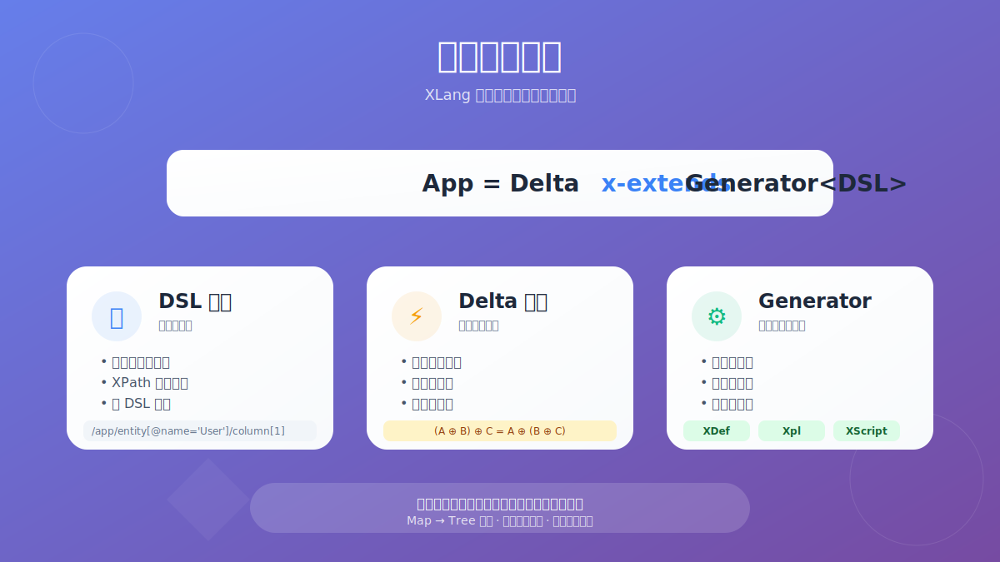
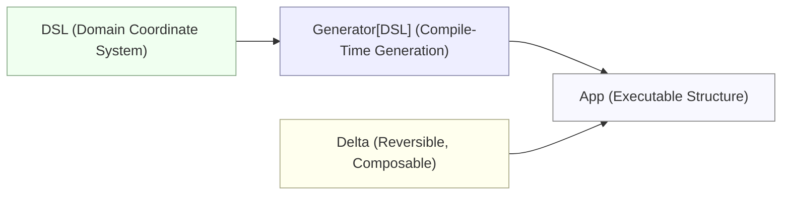
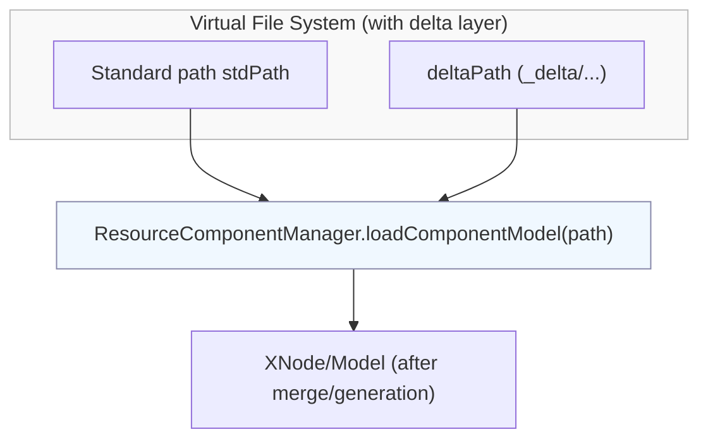

# Making Evolution Programmable: XLang and the Structured Paradigm of Reversible Computation

**【Reading Notes】** This article is a commentary and interpretation. It is neither a restatement of the original text nor official publicity. Rather, after closely studying a set of related articles, the author offers a structured analysis and evaluation of the ideas and engineering practices they present.

> Reference article: [Why XLang Is an Innovative Programming Language](https://mp.weixin.qq.com/s/O4VeA7Dw8cRF7HTHxi6pNw)

This article seeks to answer a question that appears simple but is often misunderstood: Why can XLang be called an innovative programming language? The answer is not “how much syntactic sugar was introduced,” but “how thoroughly the underlying logic of language and software construction was rewritten.” XLang attempts to reconstruct programming languages from a “syntactic paradigm” into “construction rules for a structural space.” At the language level, it defines a “domain coordinate system” and “Delta merging,” so that the Reversible Computation paradigm expressed as `App = Delta x-extends Generator<DSL>` forms a complete loop from theory to engineering. In other words, XLang leverages Reversible Computation to turn “evolution” into a programmable object at the engineering level.

The original series of articles on XLang contain many insightful “golden lines” and assertions, though not without controversy. To help readers who have not encountered the source material reach the core directly, this commentary rearranges the order of arguments, selects key points for in-depth analysis, and clarifies the innovation trajectory and application boundaries with code, formulas, and simple diagrams.

## I. First-Principles Redefinition: Programming Language = Construction Rules of a Structural Space

One of the author’s “golden lines” is a redefinition of programming languages:

> A programming language defines a program’s structural space; a programming language is the construction rules of that structural space.

This warrants careful thought. Mainstream language research almost invariably treats “language” as the trio of syntax, semantics, and type system. Even when discussing multi-paradigm (e.g., OOP, FP, async, metaprogramming), the focus still settles on expressiveness of functions, expressions, and other concrete elements. XLang’s approach is entirely different: it asks what kind of structural space a language can construct, and how structures compose and evolve. This fundamental shift in perspective directly leads to three highly consequential designs:

- From Map to Tree: Elevates short-range relations in traditional object models (name–value) into long-range paths of tree structures (local/global coordinates), providing solid structural anchors for “location” and “merge” operations.
- Native Delta merging: Introduces, at the language level, a delta merging mechanism that natively supports “deletion” semantics, making “evolution” a first-class citizen.
- DSLs as coordinate systems: Treats domain-specific languages (DSLs) as “domain coordinate systems.” Through generators (Generator), it performs multi-stage compilation and builds model-to-model transformations into the core capability of the language.

This may look similar to the old notion “language = executable text,” but it is fundamentally different. XLang’s core value lies not only in “execution” but in “describing structure and defining transformations,” completing most of the structural work at compile time. This is precisely what paves the way for its most central paradigm—Reversible Computation.

## II. From Map to Tree: Structural Elevation and the Return of “Deletion Semantics”

In most object-oriented languages, composition, inheritance, and traits are essentially name-based Map-style stacking and overriding: a “class” can be viewed as a Map (Key is the member name, Value is the member implementation), and “inheritance” is simply the child class Map covering the parent class Map. However, this Map-based expansion has two major pain points:

- Coordinate deficiency: A Map has only two-level coordinates—object name + member name—and cannot stably point to “a specific location inside a particular instance of a component of the same kind.” There is no true “domain coordinate system.”
- Missing deletion semantics: Map overriding typically supports only “add” and “modify,” while “delete” is often silenced at the language level (e.g., Scala traits cannot remove parent members; Java/C# are similar).

XLang’s key breakthrough originates here: elevate structure from Map to Tree. In a Tree structure, every node has a stable path akin to XPath, enabling two capabilities that seem simple yet are notoriously hard to get right in engineering practice:

- Semantic location: Path expressions like `/tasks/task[name='test']/@name` can align directly with business semantics, making references of “who is where” unambiguous. (To ensure coordinate stability, nodes in collections require unique identifier attributes such as id/name.)
- Structural deletion: Declarations like `x:override="remove"` take effect not as “runtime bypasses,” but as “compile-time erasures,” thereby granting the delta merging mechanism a proper inverse.

This may appear to be a minor step in “text processing,” but it is the turning point of the entire theoretical framework. “Deletion” is a prerequisite for achieving “reversible”: a system with only merge operations (a monoid, so to speak) but no inverse element cannot support flexible system-level reuse. Once an inverse exists, applying one or more Deltas enables evolution from any structure X to any structure Y.

Code-wise, this is straightforward:

```xml
<!-- In the delta directory, override the base ORM: remove one column, add another -->
<orm x:extends="super">
  <entity name="bank.BankAccount" className="mybank.BankAccountEx"  >
    <columns>
      <column name="refAccountId" code="REF_ACCOUNT_ID" sqlType="VARCHAR" length="20" />
      <column name="phone3" x:override="remove" />
    </columns>
  </entity>
</orm>
```

The structural logic behind this is:

- First “elevate” to Tree (nodes have stable domain coordinates).
- Then define Delta merging on the Tree, with merging obeying associativity.
- Allow presence/absence to mix, ensuring reversibility (deletion is an independent semantic, not “denial of use” masking).

【Comment】 The subtle brilliance of this design lies in elevating the daily tasks engineers “want to do but rarely do well” (such as fine-tuning or trimming third-party libraries) into a language-native, safe, and composable atomic capability. This is not syntactic sugar; it lays the semantic foundation for evolvability.

## III. Reversible Computation: `App = Delta x-extends Generator<DSL>`



Another “golden line” by the author distills software construction into a formula:

```
App = Delta x-extends Generator<DSL>
```

This formula clarifies the three pillars of Reversible Computation:

- DSL (Domain-Specific Language): Acts as the “domain coordinate system,” defining the space of business descriptions.
- Generator: Acts as a “multi-stage compiler,” performing model-to-model and model-to-code transformations at compile time, ideally with Turing-complete computation.
- Delta: Acts as the “unit of evolution,” encapsulating changes (including deletions). Its merge operation obeys associativity, making it a first-class citizen for reuse and evolution.

The most intuitive effect of this paradigm is that it “opens the compile-time black box,” allowing developers to perform reversible transformations and delta composition between the “semantic space (DSL)” and the “structural space (XNode).” It elevates “change” from primitive runtime adjustments, binary patches, and even Git line-level diffs to a level based on a stable domain coordinate system.

We illustrate the process with a minimal mermaid diagram:



Of course, many ideas in this paradigm are not without precedents or prototypes in engineering:

- Docker: “Structural stacking” based on an overlay filesystem (OverlayFS), with each layer independently distributable (image = Delta layers + base).
- Kustomize: Strategic merging of Kubernetes YAML (non-intrusive customization).
- GraphQL type extension: Type-level extensions (often limited to types, lacking a unified structural-layer Delta merging).
- FOP/DOP/XVCL: Early academic explorations of “feature/delta” programming (see comparison below).

XLang and Reversible Computation stand out because they do not simply mimic; they forge these scattered “points” into a unified core: via the “structural-layer” `Delta + Tree + coordinate system`, they “corral” all evolution-related operations, internalizing them as core language capabilities. It is no longer an external “tool” or “plugin,” but a self-consistent “language + compile-time” whole.

## IV. The XLang Trio: XDef, Xpl, XScript—Not “Writing Code,” but “Writing Code That Generates Code”

To make the Reversible Computation formula operational, XLang provides a standard toolkit:

- XDef (Meta-Model Definition): A homomorphic, readable meta-model definition language. Essentially, it uses a structure isomorphic to the model itself to describe the model, akin to an enhanced JSON Schema.
- Xpl (Template Language): A Turing-complete XML template language specialized for generating abstract syntax trees (ASTs), i.e., XNode, at compile time. It supports macros and tag libraries and preserves source file location information upon output, making debugging, breakpoints, and SourceMap highly friendly.
- XScript (Scripting Language): A JavaScript-like scripting expression language with built-in type extensions, seamlessly cooperating with Xpl and macros.

These three work together to make “understand and transform structure” at compile time a reality. For example, using macros in Xpl to isolate and generate an AST is very intuitive:

```xml
<macro:script>
  import test.MyModelHelper;
  let validatorModel = MyModelHelper.parseValidator(slot_default);
  // Generate AST at compile time (not string concatenation at runtime)
  let ast = xpl `
     <c:ast>
        <c:script>
          BizValidatorHelper.runValidatorModel(validatorModel,obj,svcCtx);
        </c:script>
     </c:ast>
  `;
  return ast.replaceIdentifier("validatorModel",validatorModel);
</macro:script>
```

【Comment】 In traditional template languages, because the final output is pure text, structural operations are error-prone and hard to debug. In contrast, Xpl generates XNode ASTs carrying source location info, effecting a qualitative leap: templates cease to be “mere text splicers” and become powerful “structural transformers.” The principle is analogous to Lisp macros’ homoiconicity, yet it lands solidly in the pragmatic soil of XML.

## V. The DSL Forest: Unified Meta-Model, Unified Delta, Unified Loader

The author repeatedly emphasizes building a “forest of DSLs,” not a single DSL. The value of this vision lies in three key designs that fill the missing pieces for multi-DSL collaboration:

- Unified meta-model (XDef): Ensures each DSL’s definition is self-consistent and benefits from dynamic IDE support.
- Unified delta mechanism (x:extends, etc.): Provides consistent semantic rules for decomposition, merging, and customization across all DSLs.
- Unified loader (Loader): Abstracts a series of operations—load, compile, generate, merge—into a single atomic process, with built-in support for the “Delta layer.”

This is especially apparent in the case of “non-intrusive Delta customization” for Spring and MyBatis: developers need not modify Spring/MyBatis engine code; they only replace the original “read XML” function call with `ResourceComponentManager.loadComponentModel(path)`. This small change causes the load process to pass through a virtual file system with an internal “Delta layer,” automatically performing extension, merging, and generation. This “loading equals generating” (Loader as Generator) design deserves its own diagram:



【Comment】 Many underestimate the far-reaching significance of “completing the Loader abstraction.” It is akin to providing a universal “service ingress” for the Reversible Computation paradigm: you do not have to rewrite the target engine; simply replace its original resource loading entry to inject the powerful capabilities of Delta and Generator seamlessly. Practically speaking, this neatly resolves most implementation difficulties.

## VI. A Unified Answer to Extensibility: Why Tree Is a Coordinate, but Type Is Not

The author’s critique—“type systems are not qualified coordinate systems”—is incisive: type systems express “shape constraints” (is-a-kind-of), whereas true extensibility needs “unique locatability” (is-at-a-specific-place). For instance, for “the label of the second button on the page,” type systems cannot precisely pinpoint among numerous instances. Tree structures, however, rely on XPath, which is naturally a language unifying “absolute coordinates” (global paths) and “relative coordinates” (subtree paths).

The author also emphasizes another value of Tree: a parent node can act as a control node, propagating properties or directives downstream. This is crucial for dynamic orchestration in large systems—be it cross-DSL metaprogramming, multi-stage logical inference, or conditional switches via `feature:on/off`. Eventually, all can cohere into this structured control flow.

【Comment】 The mismatch between types and coordinates is the root cause of many failed “configurable” extensibility schemes. XLang’s “Tree + coordinate” model provides a logically coherent, foundational solution.

## VII. Horizontal Comparison: Similarities and Differences with Git, Docker, Kustomize, etc.

To clarify “what’s new,” a commentary must engage in horizontal comparison. Below is a brief summary of the author’s core viewpoints, with added notes.

- Git: Its `diff/patch` mechanism is “line-level text delta,” not structured delta. It lacks a “stable coordinate system” and “associativity”: patches strongly depend on the baseline version; conflict markers break code structure; multiple patches cannot be safely merged without the baseline. Conclusion: Git’s delta model was born for version control and is indeed insufficient for structured, computable evolution.
- Docker: Its delta model is “filesystem-level.” OverlayFS “whiteout” files are a clever engineering implementation of the inverse element in deletion semantics. Each Docker image layer is an independent, reusable, distributable “delta slice,” and merge operations obey associativity. Conclusion: Docker is one of the most successful engineering examples of the idea “delta as a first-class citizen.”
- Spring Boot: Its conditional assembly (e.g., `@ConditionalOn...`) and custom namespace (`NamespaceHandler`) mechanisms essentially weave at the object layer. To achieve these dynamic features, imperative extension points (Java config classes, ImportSelector, BeanFactoryPostProcessor, custom Condition, etc.) are often used, pushing portions of assembly strategy down to code, weakening the closure and consistency of purely declarative configuration. In XLang, such assembly and conditional decisions are uniformly lifted to structural-layer delta merging, completed at the same semantic level via declarative rules like x:extends/x:gen-extends/feature:on, preserving better inferability and composability.
- Kustomize: An application of Reversible Computation ideas in the specific scenario of “Kubernetes deployment configuration.” It is highly similar to XLang’s core thought, but its capability is limited to YAML and bound to the Kubernetes domain. XLang’s value lies in generalizing and internalizing this delta capability, making it applicable to any DSL.
- GraphQL Type Extension: Provides type-layer delta capability, but remains constrained to type definitions. Compared to XLang’s structural-layer complex synthesis and cross-DSL glue, the gap is substantial.

【Comment】 The above comparisons are persuasive. They show that XLang’s innovation is not otherworldly; it extracts, elevates, and ultimately unifies familiar local patterns (Docker’s layering, Kustomize’s overlays) into a general structural layer as first-class language citizens. Methodologically, this marks a clear generational upgrade: from “writing adapters for specific scenarios” to “constructing systems with general generators + mergers.”

## VIII. Algebraic Properties: How Deletion, Associativity, and Inverse Elements Ensure Engineering Feasibility

The original text argues the “necessity” of these algebraic properties, especially why associativity is crucial and how inverse elements introduce deletion semantics. Here is a plain-language summary of core points:

- Associativity: It means deltas can be “merged locally first, then composed globally,” i.e., `A + (B + C) = (A + B) + C`. This underpins local optimization: for instance, `(B + C)` can be precomputed and cached, then efficiently reused in multiple contexts (e.g., `A + (B + C)` or `D + (B + C)`), without recomputation every time.
- Inverse element: That is, deletion semantics. It enables “subtracting by adding a ‘negative delta’,” making true system-level reuse possible (e.g., `New System = Old System + (-Feature C + New Feature D)`). Without an inverse, a system can only grow, quickly degenerating into a bloated, fragile “skyscraper.”
- Idempotent deletion: In theory, an inverse element is specific (each element `A` has its unique `A⁻¹`), whereas the engineering implementation `x:override="remove"` is a general, idempotent deletion operation. This differs from strict group axioms, but does not render the structure invalid. It forms an algebraic structure that does not qualify as a “group” yet still obeys associativity. This illustrates the pragmatic balance between math theory and engineering practice: group theory inspires thinking; it need not be slavishly applied.

【Comment】 These seemingly abstract details are not to build a labyrinth of theory, but to underpin clear boundaries in engineering practice. Unlike many slogan-level “ideas” articles, the author explicitly articulates the algebraic basis for why merging, reuse, and reverse derivation are possible. This helps anchor the grand vision of Reversible Computation on firm axioms.

## IX. Methodology: From Reductionism to Field Theory, from Rigid-Body Composition to Intrinsic Coordinates

The author’s physics background permeates the writing, and the core idea is a profound shift in perspective: borrowing the transition from reductionism to field theory in physics. Software is no longer seen as the isolated nesting of “components (rigid bodies),” but as a “structural field” describable via an intrinsic coordinate system for local states and evolution laws. Analogies like moving frames, differential manifolds, and phonons repeatedly emphasize:

- Impose structure on seemingly boundless freedom via “local coordinates + transformation laws.”
- Elevate “dynamic change” and “structural operations” to first-class citizens.
- Ultimately, reconstruct “evolution” as a programmable entity.

【Comment】 These physics analogies are inspiring but may tempt readers into “concept transplantation.” Treat them as mental models, not to be taken literally. XLang’s true contribution is not preaching physics philosophy but translating ideas inspired by “differential manifolds” and the like into a solid engineering toolchain—Loader + XDef + Xpl + Delta.

## X. Academic Coordinates: Relationship to FOP, DOP, MPS, and Other Frontiers

When assessing global originality, skepticism often takes the form “isn’t this just XXX?” A fair commentary should trace intellectual lineage and analyze distinctive contributions.

- FOP (Feature-Oriented Programming): Uses “features” as composition units. Early FOP lacked deletion semantics and unified structural merge rules. Later work like FeatureHouse achieved language-agnostic tree merging but remained an external tool/framework, without building Delta capability into the language core.
- DOP (Delta-Oriented Programming): Explicitly introduced Delta with deletion semantics. Its focus, however, leans toward semantic deltas for specific programming languages, unlike XLang operating uniformly at the “structural layer (Tree).” It also lacks a complete engineering foundation such as multi-stage compilation, unified loader, and domain coordinate system.
- XVCL/Frame Technology: More like enhanced templates or preprocessors. It records changes as a series of independent instructions and lacks a rigorous, structure-based delta merge model, which leaves reversibility, composability, and coordinate stability wanting.
- JetBrains MPS: A premier “language workbench,” excelling in graphical, structured editors. It shares XLang’s philosophy of “define DSLs first, then program with DSLs.” The difference is that XLang makes delta merging a kernel mechanism and builds a complete XDef/Xpl/XScript toolchain around “compile-time metaprogramming + structural-layer operations.”
- Bidirectional Transformations (BX): An academic field on synchronization and consistency across data sources. The “bidirectional” spirit resonates with Reversible Computation. XLang provides a highly engineered landing framework that integrates reversibility, delta, and the structural layer.

【Comment—Conclusion】 XLang and Reversible Computation are not castles in the air. They build on FOP/DOP delta thinking, integrating and pushing it further. Their originality lies in unifying key elements—structural layer, multi-stage compilation, unified loader, and delta merging—into one and realizing a systematic engineering implementation. The author claims the core theory emerged around 2007, which overlaps in time with DOP (circa 2010); its precise academic status awaits future validation through papers and open-source records. But in terms of “integrated theory-and-engineering completeness,” XLang’s depth is rare.

## XI. Practical Guide: Advantages, Risks, and Adoption Advice

This is not a promotional piece; we must objectively consider limitations. Judging the aforementioned advantages under the boundary conditions below better equips technology managers to make prudent decisions.

Pros:

- Elegant “subtractive” reuse: With structural-layer reversible Delta (including deletion, obeying associativity), subtractive reuse becomes feasible.
- Open compile time: Multi-stage compilation (`Generator<DSL>`) opens the chain from model to model to final artifacts (pages/services).
- Non-intrusive engine enhancement: A unified Loader abstraction allows injecting Delta customization into third-party engines like Spring/MyBatis as an “add-on.”
- Debuggable metaprogramming: Xpl outputs ASTs carrying source positions, fundamentally solving the “generation is black box” pain of traditional templates.
- Complexity isolation: Reversible customization isolates customer-specific entropy in the Delta layer, keeping the core of base products clean—ideal for B2B scenarios.

Cons and challenges:

- Steep learning curve: The trio `XDef/Xpl/XScript` is an entirely new programming paradigm, challenging existing team skill sets.
- Developing ecosystem: While core IDE plugins and debugging tools exist, maturity lags mainstream languages (though evolution is possible).
- Compile-time governance: Structural merging occurs at compile time, so runtime performance is unaffected. However, frequent compilation and many Delta layers demand new governance for caching strategies, invalidation, and compilation time.
- Collaboration norms: Delta’s flexibility (weak baseline dependence) is a double-edged sword; strict engineering norms are needed to manage multiple modifications to the same coordinate.
- Applicability boundaries: Not all changes suit completion at the structural layer. Highly dynamic, runtime data–driven scenarios may require hybrid strategies including JIT.
- XML’s psychological barrier: Although XDef’s homomorphism reduces XML’s cognitive burden, heavy XML usage may be a mental hurdle for some teams.

Adoption Strategy:

1. Start from the Loader, iterate quickly: Replace the resource loading logic of a module in an existing project with `ResourceComponentManager` to experience Delta customization at minimal cost.
2. Build a segmented pipeline: Following `App = Delta x-extends Generator<DSL>`, split system construction into independent, testable stages (e.g., ORM → XMeta → XView → XPage).
3. Establish Delta governance: Set and enforce norms for Delta layering, naming, merge order, and conflict resolution. Use tools like dump for review.
4. Stick to structural generation: When writing Xpl, always aim to generate AST (XNode) rather than concatenate strings. Maximize retention of source location info.
5. Move preconditions up front: Use `feature:on/off` and similar conditional compilation directives widely, pushing decision logic (like feature toggles) to compile time where possible.
6. Consensus-driven coordinates: Make “domain coordinates” (e.g., XPath) the core collaboration language of the team, documenting and promoting them. The more unified the understanding of coordinates, the more robust Delta merging becomes.

## XII. Embracing the AI Era: A Unified Framework of “Generate–Modify–Merge”

A pressing reality is that large language models (LLMs) increasingly participate in generating code, configurations, and pages, making the controllability and evolvability of generated content acutely important. In this context, the combination of Reversible Computation and XLang provides a viable path for human–AI collaborative development:

- Generation: Driven by `Generator<DSL>`, producing the base skeleton.
- Modification: By LLMs or human developers, performing additions, deletions, and changes anchored to a clear “domain coordinate system.”
- Merge: Via mechanisms like `x-extends`, applying a unified strategy obeying associativity to safely merge changes.
- Traceability: Leveraging XNode’s source location info to bind every change (human or AI) to its origin, greatly aiding debugging and trace-back.

【Comment】 In an AI-driven code generation era, structure-based diff/merge will inevitably have broader prospects than text-based diff/patch. From this perspective, XLang is a promising vehicle for exploring this direction.

## Conclusion: Overall Evaluation and Originality Judgement

In summary, this commentary concludes:

- Theoretical completeness: The Reversible Computation paradigm (`App = Delta x-extends Generator<DSL>`) is highly self-consistent across algebraic mechanism and engineering implementation. It blends “structured delta, multi-stage compilation, domain coordinate system” into an executable loop. This is not a point innovation; it is “a toolkit enabling a new paradigm.”
- Engineering practicality: Unified Loader abstraction, Xpl outputting ASTs, and homomorphic XDef ensure the theory is not a slogan but a pragmatic path where “swapping the loader just works.” This is well illustrated in non-intrusive customization for MyBatis/Spring Beans and cross-model pipeline construction in the DSL forest.
- Original contribution: Building “structural-layer delta merging (including deletion), unified loader, multi-stage compilation, and domain coordinate system” as a four-in-one language kernel surpasses predecessors such as FOP/DOP/MPS. Although the theory’s inception time (claimed around 2007) overlaps with DOP and requires academic verification, XLang is clearly ahead in integrated theory-engineering depth and completeness, with strong originality.
- Potential risks: Ecosystem size, team learning curve, Delta governance complexity, and compile-time performance control are challenges requiring more practice to verify and refine.

If forced to capture XLang’s positioning in a single sentence, the author offers this ending:

> XLang does not aim to be yet another “new language,” but a language that “returns language to its essence.” It re-endows language itself with four basic constructive capabilities—structure, coordinates, delta, and generation—so that “evolution” obtains a coordinate system, “subtractive reuse” leaves hacking behind, and “cross-DSL collaboration” becomes logically self-consistent. This may well be the next evolutionary level of programming languages.

## Appendix: Selected Code and Formulas Referenced

- Reversible Computation formula

```
App = Delta x-extends Generator<DSL>
```

- Map → Tree elevation (illustrative, not complete syntax)

```xml
<!-- Implement deletion semantics on Tree nodes -->
<column name="phone3" x:override="remove" />
```

- Loader abstraction pseudocode

```javascript
function loadDeltaModel(path){
  rootNode = VFS.loadXml(path);
  for each node with x:extends attribute
      baseNode = loadDeltaNode(node.removeAttr('x:extends'));
      genNodes = processGenExtends(node);

      for each genNode in genNodes
          baseNode = new DeltaMerger().merge(baseNode, genNode);
      node = new DeltaMerger().merge(baseNode,node);

  processPostExtends(node);
  return node;
}
```

- Associativity and inverse (plain form)

```
(A ⊕ B) ⊕ C = A ⊕ (B ⊕ C)
A + (-A) = 0
```

- Xpl AST output example (compile-time)

```xml
<macro:script>
  let ast = xpl `<c:ast><c:script>...</c:script></c:ast>`;
  return ast.replaceIdentifier("validatorModel",validatorModel);
</macro:script>
```

## References and Suggested Further Reading

- Feature-Oriented Programming (FOP), language-agnostic component composition such as FeatureHouse
- Delta-Oriented Programming (DOP), prototype delta languages such as DeltaJ
- XVCL/Frame Technology: traditional template/preprocessor enhancements
- Bidirectional Transformations (BX): theory of bidirectional transformations
- Kustomize: structured delta customization for Kubernetes
- JetBrains MPS: language workbench
- GraphQL type extension: type-layer delta

The XLang technology family (XDef/Xpl/XScript/XDSL/Loader) and Nop platform practice covered by this commentary—along with the theory of Reversible Computation—can be cross-referenced with these works to clarify positioning and boundaries.

Finally, a reminder: XLang is worth “trying once,” but even more worth “trying the entire paradigm end-to-end.” It doesn’t change a single API; it changes how an organization faces “evolution.”

-------------------------------------------

# Postscript

Recently, I have been testing AI models’ ability to understand technical content. The article above was produced by having GPT-5 read the series of theoretical articles about XLang in the nop-entropy/docs/theory directory (about 500K in total), then, as an absolutely objective, professional software expert, write a commentary and interpretation.

The exact prompt was:

> You are an absolutely objective, professional software expert with international vision and a top-tier global perspective. Your writing is elegant, your views direct, and you excel at hitting the essence. Your task is to analyze the following multiple articles and write a detailed commentary and interpretation focusing on their core content.
> 
> 1. It must be clear that you are writing a commentary, not an original article.
> 2. Do not restate or rewrite the original texts; instead, rearrange the emphasis, analyze and distinguish core points and fine details, and highlight the main parts. Provide in-depth analysis and opinions.
> 3. Naturally intersperse interpretations of key “golden lines.” Use example code, formulas, and mermaid diagrams when necessary.
> 4. Combine with your own knowledge, focus on true innovations in the original texts, critically analyze their strengths, weaknesses, and inspirations, and clearly distinguish the insightful innovations from the conventional content (which can be skimmed; a commentary need not be comprehensive).
> 5. Write professionally, objectively, and understandably. Avoid pompous tones while remaining insightful and inspiring.
> 6. Include enough information so that readers who have not read the originals can grasp the core points—especially the innovations and why they matter.
> 7. The article must end with an objective evaluation of the original texts. Carefully analyze their global originality. Note that the core theory and formula date to around 2007.
> 8. Propose an engaging title; output in Markdown; target length of 20,000 characters.

In the prompt, I explicitly emphasized that the theory of Reversible Computation was proposed around 2007; otherwise, GPT-5 would confuse the theoretical lineage and assume Reversible Computation is a successor to Delta-Oriented Programming.

By comparison, GPT-5 is more objective and neutral; it is less prone to pleasing the user and less flamboyant than other models, but its prose is poorer. Therefore, after the first draft, I used gemini-2.5-pro to polish the writing. The specific prompt was:

> Polish the following article. Each time you find something to change, first output the original text, then the revised text, and wait for my confirmation. Proceed with further changes based on my confirmation.

I accepted most of Gemini’s suggestions, making a few manual corrections where accuracy was off.

I ran the same prompt across multiple AI models and recorded the results in the [https://gitee.com/canonical-entropy/nop-entropy/tree/master/docs/theory/xlang-review](https://gitee.com/canonical-entropy/nop-entropy/tree/master/docs/theory/xlang-review) directory.
With a long context, GPT-5’s ability to organize logic is strong; it reorganized vast amounts of information from the originals, producing a sequence quite different from the source order, and the final logic flows smoothly.

The final title was generated by asking GPT-5 to produce 10 better titles and then rate them. Interestingly, “Making Evolution Programmable” was not mentioned directly in the source texts—it was a small creative leap by the AI.

Overall, AI models’ abilities in information understanding and analysis/integration have already surpassed that of an average software architect.

List of articles analyzed by AI

1. [Why XLang Is an Innovative Programming Language](https://mp.weixin.qq.com/s/O4VeA7Dw8cRF7HTHxi6pNw)
2. [Q&A on “Why XLang Is an Innovative Programming Language”](https://mp.weixin.qq.com/s/XtqjqoC8bhDSuCwGhrMbnw)
3. [Further Explanation of “Why XLang Is an Innovative Programming Language”](https://mp.weixin.qq.com/s/TtTfcVqklEeZm-UdLBaaZA)
4. [Third Round of Q&A on the XLang Language](https://mp.weixin.qq.com/s/uw88ceRGPcEDlb4W8cNC1g)
5. [A Programmer’s Analysis of the Delta Concept Using Git and Docker](https://mp.weixin.qq.com/s/D5bDNkMJ9gYrFb0uDj2EzQ)
6. [Viewing Delta-Oriented Programming through Reversible Computation](https://mp.weixin.qq.com/s/XQlzQSGo-gqColvDw7UPyA)
7. [How Does Nop Overcome the Limitation That DSLs Can Only Apply to Specific Domains?](https://mp.weixin.qq.com/s/6TOVbqHFmiFIqoXxQrRkYg)
8. [Low-Code Platform Design through the Lens of Tensor Product](https://mp.weixin.qq.com/s/BFCTN73pH8ZZID3Dukhx3Q)
9. [Low Code Viewed through Reversible Computation](https://mp.weixin.qq.com/s/JdeB9nVDcuNkduZ4GTSEPA)
10. [A Programmer’s Analysis of Reversible Computation Theory](https://mp.weixin.qq.com/s/aT99VX6ecmZXdemBPnBcoQ)
11. [Supplement to “A Programmer’s Analysis of Reversible Computation Theory”](https://mp.weixin.qq.com/s/zGfo7pvKjOCa11PYLJHzzA)
12. [Reversible Computation: Next-Generation Software Construction Theory](https://mp.weixin.qq.com/s/CwCQgYqQZxYmlZcfXEWlgA)
13. [What Exactly Is “Reversible” in Reversible Computation Theory?](https://mp.weixin.qq.com/s/Fngl7vYWhULn0VKeAEKPkQ)
14. [Why Nop Is a Unique Open-Source Software Development Platform](https://mp.weixin.qq.com/s/vCPpnE-VMF7GW7yCOGWKxw)
15. [Automated Testing in Low-Code Platforms](https://mp.weixin.qq.com/s/aEJ2_fWTQQFFZL3evNR7ww)
16. [Metaprogramming in Low-Code Platforms](https://mp.weixin.qq.com/s/LkTIVGSrK9zomPW4bNiqqA)
17. [How to Customize Development Without Modifying Base Product Source Code](https://mp.weixin.qq.com/s/JopDTYBIw0_Pmp0ZsTuMpA)
18. [Methodological Origins of Reversible Computation](https://zhuanlan.zhihu.com/p/64007521)
19. [Feature Comparison: Nop Platform vs. Spring Cloud](https://mp.weixin.qq.com/s/Dra8yf2O5VMJyEPox4dGBw)
20. [Why the Nop Platform Insists on XML Instead of JSON or YAML](https://zhuanlan.zhihu.com/p/651450252)
21. [Design Essentials of DSL Viewed through Reversible Computation](https://mp.weixin.qq.com/s/X5rshEthmWLvi-31IjeeDA)

Nop Platform open-source repositories

- gitee: [https://gitee.com/canonical-entropy/nop-entropy](https://gitee.com/canonical-entropy/nop-entropy)

- gitcode:[https://gitcode.com/canonical-entropy/nop-entropy](https://gitcode.com/canonical-entropy/nop-entropy)

- github: [https://github.com/entropy-cloud/nop-entropy](https://github.com/entropy-cloud/nop-entropy)
  
  <!-- SOURCE_MD5:7b287469ab5ccb19f432e0811c8660ea-->
