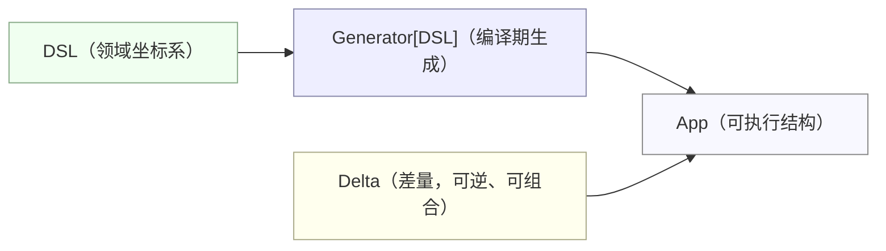
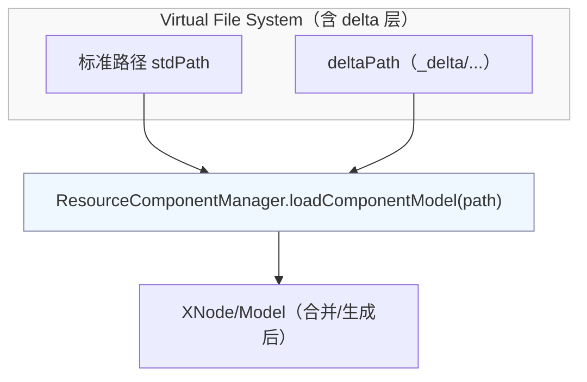
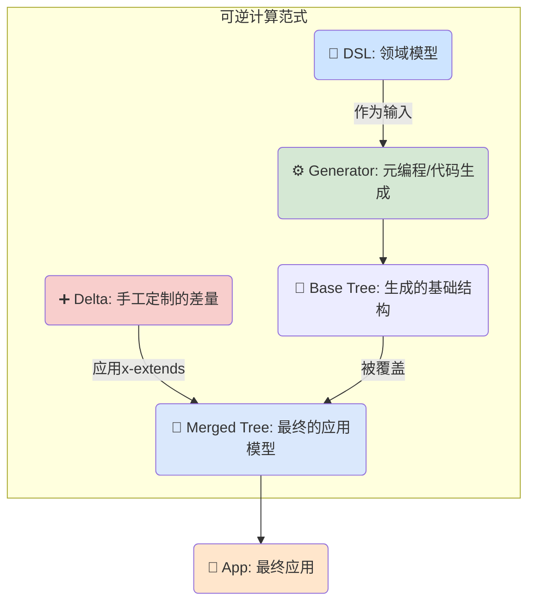

Rate the following column articles on the same topic: which one is better, and why


【Article 1】
> generated by gpt5

# When “Language” Becomes Coordinates and Waves: A Systematic Review of XLang and Reversible Computation

> This is a review and interpretation. It is not a paraphrase of the originals nor official promotional material; instead, it structurally analyzes and evaluates the ideas and engineering practices presented across a set of articles.

This piece tries to answer a seemingly simple but often misunderstood question: Why can XLang be called an innovative programming language? The answer does not lie in “how much syntactic sugar it introduces,” but in “rewriting the underlying logic of language and software construction”: it elevates a programming language from a “syntactic paradigm” to “construction rules of a structural space”; it defines “domain coordinate systems” and “Delta merging” at the language level, thus giving the App = Delta x-extends Generator<DSL> paradigm in Reversible Computation a complete end-to-end chain. In other words, by harnessing Reversible Computation, XLang turns “evolution” into a programmable object in engineering practice.

Within the original set there are many key assertions and quotable lines—insightful and sometimes controversial. This article rearranges the argument order, selects the most valuable points for deeper dives with code/formulas/simple diagrams, helping readers unfamiliar with the originals grasp its core innovations and boundary conditions quickly, and offers an assessment of its global originality (notably, the author claims the core theory and formulas were proposed around 2007).

---

## I. First-Principles Redefinition: Programming Language = Construction Rules for a Structural Space

One “golden line” from the author is a redefinition of programming language:

> A programming language defines a program’s structural space; a programming language is the construction rules of that structural space.

This line deserves careful thought. Mainstream language research almost invariably treats “language” as the trio “syntax + semantics + type inference.” Even when discussing multi-paradigm (OOP + FP + Async + Meta), the focus remains on functions, expressions, and types. XLang’s entry point is: a language defines “what kind of structural space can be constructed” and “how structures compose/evolve.” This directly supports three substantial moves that follow:

- From Map to Tree: elevating from short-range (name–value) to long-range (tree path–local/global coordinates), giving “location” and “merge” stable coordinates;
- Introducing Delta merging at the language level (with deletion semantics), making “evolution” a first-class citizen;
- Treating DSL as “domain coordinate systems,” using Generators for multi-stage compilation, making the “model → model” chain a built-in capability of the language.

This differs subtly—but crucially—from the prior view of “language = executable text”: XLang not only “executes,” but also “describes structures + defines transformations,” and can complete most work at compile time. This paves the way for its core paradigm—Reversible Computation.

---

## II. From Map to Tree: Structural Dimension Lift and the Return of “Deletion Semantics”

In most object-oriented languages, “composition/inheritance/Traits” are essentially name layering/overwriting on a Map: you can think of a “class” as a Map (key = member name, value = member), and “inheritance” as Map overwrite. However, extending maps in this way has two pain points:

- A Map has only two-level coordinates (object name + member name); it cannot stably locate “a specific position of a specific instance among similar entities,” lacking “domain coordinates”;
- Map overlays generally support only “overwriting,” while “deletion” is silent at the language level (Scala Traits don’t support removing a parent member; Java/C# don’t even go there).

XLang’s key turn comes from elevating the structural dimension: Map → Tree. Each Tree node has a stable path (xpath/selector), letting two seemingly simple yet engineering-wise difficult abilities become possible:

- Stable semantic location: paths like /tasks/task[name='test']/@name align with business semantics; “who is where” is no longer vague;
- Implementing “deletion semantics” at the structural level: x:override="remove" isn’t “runtime bypassing,” it’s “compile-time elimination,” giving the Delta merge an inverse element.

This may look like a small step in “text engineering,” but it’s a turning point for the whole theory. “Deletion semantics” are necessary for being reversible: without inverses, you only have a monoid (Monad), making system-level reuse hard; with inverses, “constructing from X to Y is equivalent to directly applying a Delta” becomes possible.

The code is very straightforward:

```xml
<!-- In the delta directory, override the base ORM: delete one column, add one column -->
<orm x:extends="super">
  <entity name="bank.BankAccount" className="mybank.BankAccountEx"  >
    <columns>
      <column name="refAccountId" code="REF_ACCOUNT_ID" sqlType="VARCHAR" length="20" />
      <column name="phone3" x:override="remove" />
    </columns>
  </entity>
</orm>
```

The structural logic behind this is:

- First “lift” to a Tree (nodes have stable domain coordinates);
- Then define Delta merging on the Tree, with merges satisfying associativity;
- Allow mixing “present/absent,” ensuring reversibility (deletion is an independent semantics, not a “do-not-use” masking).

Comment: The beauty here is “turning the things you always wanted to do but couldn’t do reliably (tweak/trim) into language-native, composable operations.” This isn’t “syntactic sugar,” it’s “semantic groundwork.”

---

## III. Reversible Computation: App = Delta x-extends Generator<DSL>

Another “golden line” from the author distills software construction into a concise formula:

```
App = Delta x-extends Generator<DSL>
```

It defines three things:

- DSL: the domain coordinate system (the space in which you describe the business);
- Generator: multi-stage compilation (compile-time model→model/code generation, ideally a Turing-complete compile-time space);
- Delta: the delta (with deletion semantics, merges satisfying associativity), as a first-class citizen of reuse and evolution.

This paradigm opens up the “compile-time space,” letting you perform reversible transformations/delta compositions between the “semantic space (DSL)” and the “structural space (XNode),” elevating “change” from runtime, binaries, and even Git line diffs to a “stable coordinate system of domain structures.”

A minimal mermaid diagram illustrates the process:



Many parts of this paradigm have echoes in the engineering world:

- Docker: “structural overlay” via delta file systems (OverlayFS), with each layer independently distributable (image = Delta layers + base layer).
- Kustomize: strategic merges of Kubernetes YAML (non-invasive customization).
- GraphQL type extension: type-level extension (often stays at the type level, lacking unified structural-level Delta merging).
- FOP/DOP/XVCL: early academic explorations of “feature/delta” programming (see comparisons later).

XLang/Reversible Computation stitches these scattered points into a core: using “structural-layer” Delta + Tree + coordinates to cover these needs in one go, and making them language capabilities. It’s not “a tool” or “a plugin,” but an integrated “language + compile-time” whole.

---

## IV. The Language Trio: XDef, Xpl, XScript—Not “Writing Code,” But “Writing Code That Generates Code”

To operationalize the above formula, XLang provides three standard tools:

- XDef: a meta-model definition language (homomorphic, readable), essentially “describing the model with a structure isomorphic to the model,” akin to an advanced JSON Schema;
- Xpl: an XML template language (Turing-complete), adept at generating AST (XNode) at compile time, supports macros and taglib extensions, and preserves source locations in output mode (debugging/breakpoints/SourceMap friendly);
- XScript: a scripting expression language (near-JS syntax, with type extensions), collaborating with Xpl and macros.

Together they enable “understanding and transforming structures” at compile time. For example, an Xpl macro that isolates AST is very intuitive:

```xml
<macro:script>
  import test.MyModelHelper;
  let validatorModel = MyModelHelper.parseValidator(slot_default);
  // Generate an AST at compile time (not concatenating text at runtime)
  let ast = xpl `
     <c:ast>
        <c:script>
          BizValidatorHelper.runValidatorModel(validatorModel,obj,svcCtx);
        </c:script>
     </c:ast>
  `;
  return ast.replaceIdentifier("validatorModel",validatorModel);
</macro:script>
```

Comment: In typical “template languages,” generating structure is error-prone and hard to debug; in Xpl, output mode using nodes can carry source positions, producing an XNode AST—turning “template = structure transformer,” not “template = text.” It’s very close to Lisp macros’ “homoiconicity,” yet grounded in the practical XML world.

---

## V. The DSL Forest: Unified Meta-Model, Unified Delta, Unified Loader

The author repeatedly emphasizes “not a single DSL, but a DSL forest.” The value here is that it makes “coexistence of multiple DSLs” operational by filling in three critical pieces:

- Unified meta-model (XDef): makes DSLs self-consistent and IDE dynamically supportive;
- Unified delta (XDSL’s x:extends/x:gen-extends/x:post-extends): gives decomposition/merge/customization unified semantics;
- Unified Loader: turns “load = compile = generate = merge” into one abstraction, with “delta layers” built-in.

A hands-on example in Spring and Mybatis with “non-invasive Delta customization” is very typical: you don’t modify Spring/Mybatis engines; you simply replace the original “read XML” function with ResourceComponentManager.loadComponentModel(path), letting it extend/merge/generate within the delta layer of the “virtual file system.” This “Loader as Generator” deserves a dedicated diagram:



Comment: The significance of “completing the Loader abstraction” is underestimated by many. It effectively provides a “service port” for Reversible Computation—you don’t rewrite the engine, you just swap a “load” entry to connect Delta and Generator. The engineering difficulty of landing this approach is greatly mitigated.

---

## VI. Extensibility and a Unified Solution for “Coordinate Paths”: Types Are Not Coordinates—Trees Are

The author’s critique that “type systems are not qualified coordinate systems” is on point: types express “shape constraints,” whereas extensibility needs “unique localization.” For requirements like “the label of the second button on the page,” a type system cannot point into multiple object instances; Tree’s xpath/selector is naturally a unified “absolute coordinate” (global path) and “relative coordinate” (subtree path).

Meanwhile, the author emphasizes another value of Trees: parent nodes can act as control nodes propagating attributes/operations downward—this is essential for large-scale orchestration (meta-programming across DSLs, multi-stage inference, conditional switches like feature:on/off also converge here).

Comment: Misalignment of types and coordinates is the root cause of many “configuration-based extensibility” issues. XLang’s “Tree + coordinates” provides a unified patch—logically and coherently defensible.

---

## VII. Engineering Comparisons: Git/Docker/SpringBoot/Kustomize/GraphQL Type Extension

A review must perform horizontal comparisons to reveal the boundaries of “newness.” We briefly summarize the author’s typical comparative viewpoints and add comments.

- Git’s delta operates in the “line-text space.” It lacks “stable coordinates + associativity”: patches are bound to baselines; conflicts inserting markers break structure; multiple patches cannot be merged offline. Conclusion: Git diff is suitable for “humans reading code,” not for “structurally computable evolution.”

- Docker’s delta operates in the “file system space.” OverlayFS’s whiteout is the engineering realization of inverse semantics. Deltas are reusable, composable, distributable, satisfying associativity. An image is an independent “delta slice”—this is the most classic successful engineering case of “delta as a first-class citizen.”

- SpringBoot’s conditional configuration (@ConditionalOnProperty etc.) and custom namespaces (NamespaceHandler) weave at the “object layer,” often undermining the coherence of declarative configuration; XLang moves this to the “structure layer,” unifying it as x:gen-extends/x:extends/feature:on with clear, composable semantics.

- Kustomize is “delta customization of YAML.” It is very close to XLang and can be seen as an instance of Reversible Computation in the deployment DSL domain. XLang’s value is to make this capability unified and language-level across all DSLs.

- GraphQL type extension provides “type-level delta,” but remains at the type layer, still far from “complex structural composition” and “cross-DSL adhesion.”

Comment: These comparisons are persuasive—not “shapes you’ve never seen,” but “uniting the scattered points and local patterns you know, elevating them to the structure layer and unifying them into a language abstraction.” Methodologically, this is an upgrade from “writing adapters” to “writing generators + mergers.”

---

## VIII. Deletion Semantics, Associativity, and Inverses: Mathematical Correctness and Engineering Usability

The author offers several “necessity proofs” in mathematics—especially for “why associativity matters” and “how the inverse introduces deletion semantics.” Here’s a lay summary:

- Associativity means you can “merge locally first, then compose globally,” which is necessary for “local optimization/reuse.” Without associativity, you can’t merge patches offline or assemble multiple targets using pre-merged deltas;
- The inverse (deletion semantics) means “achieving reduction through addition,” making “system-level reuse” possible (X + (-C + D) is “remove C, add D”). Without inverses, you can only “keep adding,” and blocks quickly pile up into a chaotic structure;
- Idempotent deletion (Delete*Delete=Delete) conflicts with group structures; practically, we must accept “running in an approximate group missing the inverse axiom,” which doesn’t prevent “delta merging” as a structural operation from still satisfying associativity and closure.

Comment: These details are not “mathematical showmanship,” but foundational to clarifying engineering boundaries. Unlike many “conceptual” articles that stop at slogans, the author explains the mathematical basis for “why you can merge/reuse/reverse,” turning “Reversible Computation” from a rallying cry into a term of art.

---

## IX. Methodological Dimension: From Reductionism to Field Theory, Moving Frames and Intrinsic Coordinates in DSLs

The author’s physics background is evident throughout, centering on a shift: from reductionism of “nested components (rigid bodies)” to a field perspective of “coordinates + local change.” Moving frames, differential manifolds, and phonon analogies emphasize the same points:

- Structure a “system with infinite degrees of freedom” using “local coordinates + transformation rules”;
- Make “dynamic change” and “structural operations” first-class citizens;
- Reconstruct “evolution” as a programmable form.

Comment: These analogies can inspire engineers but may also mislead. This review reminds readers: treat analogies as analogies—avoid “cargo-cult academic jargon.” XLang’s contribution isn’t “preaching physical philosophy,” but “turning the moving frame into usable Loader + XDef + Xpl + Delta in engineering.”

---

## X. In the International Research Context: FOP, DOP, XVCL, MPS, BX

Evaluating global originality invites the easy question “Isn’t this just XXX?” Fair review means noting both lineage and surpassing.

- FOP (Feature-Oriented Programming): treats “Features” as compositional units; early versions lacked deletion semantics and unified structure-level merge rules. Work like FeatureHouse began language-agnostic tree merges but remained “tools/frameworks,” not “language-level built-in Delta.”
- DOP (Delta-Oriented Programming): introduced Delta with deletion semantics; prototypes like DeltaJ proved feasibility. But DOP is more about “deltas oriented toward programming language semantics,” lacking unification to “the structure-level Tree,” and missing “built-in multi-stage compilation/Loader/coordinate systems” as full-stack basics.
- XVCL/Frame Technology: resembles enhanced templates/preprocessors; “recorded changes” as single-step sequences; lacks rigorous structural-level Delta merging; not adept at reversible + merging + stable coordinates.
- JetBrains MPS: emphasizes “language workbench,” with excellent graphical/structured editors. Similar to XLang in “invent DSLs then use DSLs to build business,” but XLang makes Delta merging the language core and emphasizes “compile-time meta-programming + structural-level operations,” with a unified XDef/Xpl/XScript trio.
- Bidirectional Transformations (BX): extensive academic work on “consistent forward/backward transforms,” spiritually aligned with reversibility. XLang turns “reversible/delta/structure-level” into an engineering toolchain, offering BX a new practical framework.

Comment conclusion: XLang/Reversible Computation did not appear out of thin air; it integrates and advances delta thinking from FOP/DOP, and lands “structure-level + multi-stage compilation + unified Loader + Delta merging” as a whole at the engineering level. The author claims core theory around 2007, which overlaps in time with DOP (around 2010); specifics can be cross-verified through subsequent papers and open-source records. In terms of “integrated language core” completeness, XLang is rare in engineering practice.

---

## XI. Adoption and Boundaries: Advantages, Risks, and Engineering Considerations

This is not a promotional piece; limitations must be discussed. Framing prior praise within the following conditions helps organizations make better judgments.

Strengths (brief):

- Structural-layer Delta with reversible deletion semantics and associative merges makes notoriously hard “trim-and-reuse” practicable;
- Multi-stage compilation (Generator<DSL>) opens the compile-time space; the model→model→page/service pipeline in the DSL forest is clear;
- Unified Loader abstraction “plugs in” to empower third-party engines (non-invasive Delta customization for Spring/Mybatis);
- Xpl outputs AST with source locations preserved, debugging-friendly (addressing the “black-box generation” pain of template languages);
- Reversible customization isolates the “entropy of customization development” in the delta layer, leaving base products clean (a boon for B2B scenarios).

Risks and boundaries (must face honestly):

- Learning curve: combining XML/XDef/Xpl/XScript is a new paradigm—not just slapping on a couple decorators;
- Tooling ecosystem: the author provides IDEA plugins, dump, watch, etc., but compared to mainstream language ecosystems it’s niche (positive feedback loops can help it evolve);
- Performance misconceptions: structural-layer merges occur at compile time with zero runtime cost; however, if models compile frequently and delta layers abound, governance is essential (caching, invalidation, compile-time control);
- Team collaboration: deltas are not bound by baselines (a strength) but invite “governing multi-delta merges at the same coordinate”; engineering standards are needed;
- Edge cases: not all changes suit structural-layer deltas; for highly runtime-dynamic systems (like data-driven CFG), mixed methods are needed (the author provides runtime deferred/JIT compilation paired with the Loader);
- File size and readability: copious XML can be a psychological burden for some teams; while XDef’s homomorphism reduces complexity, deltas/macros/generators should be used to cut repetition.

Adoption suggestions (for organizations):

- Start with the “Loader hook”: first replace “loading,” switching model loading to ResourceComponentManager to experience Delta customization at minimal cost;
- Split the pipeline: decompose the chain by App = Delta x-extends Generator<DSL>, with each step independently testable (especially across ORM→XMeta→XView→XPage);
- Govern delta layers: define layer naming, merge ordering, conflict strategies, dump audits, IDE prompts;
- Output AST with Xpl rather than string concatenation, preserving source position info as much as possible;
- Tag feature:on/off conditions; digest conditional logic at compile time whenever feasible;
- Document the “domain coordinate system”: make clear that “coordinates (XSelector/xpath)” are collaboration primitives; the more unified the team’s understanding of coordinates, the more reliable Delta merges become.

---

## XII. Significance in the AI Era: A Unified Framework for Generate–Refine–Merge

A real-world issue: LLMs now widely contribute to “generating code/configuration/pages.” Controllability and evolvability are key. Reversible Computation + XLang offers a possible closed loop:

- Generate (Generator<DSL>): model-driven skeleton generation;
- Refine (Delta): LLM/humans add/delete/tweak based on the domain coordinate system;
- Merge (x-extends): associativity enables reuse; merging policies are unified;
- Trace (XNode source locations): bind LLM changes to source locations—debugging/backtracking-friendly.

Comment: In the AI era, structure-level “diff/merge” is more worth betting on than text-level “diff/patch.” XLang is a reasonable carrier.

---

## Epilogue: Overall Assessment and Global Originality

Bringing it all together, here are my concluding remarks.

- Theoretical completeness: The Reversible Computation paradigm (App = Delta x-extends Generator<DSL>) is self-consistent across mathematical and engineering levels, forming a practicable closed loop of “structural-layer delta + multi-stage compilation + domain coordinate system.” This is not a point innovation; it’s “a set of tools” supporting “a paradigm.”

- Engineering usability: The unified Loader abstraction, Xpl’s AST output, and XDef’s homomorphic meta-model all ensure the “theory isn’t a slogan”—it becomes a hands-on path where “swapping one load entry gets you started.” This stands out in Mybatis/SpringBeans delta customization and cross-model pipelines in the DSL forest.

- Global originality: As a language-level implementation integrating “structural-layer Delta merging (with deletion semantics) + unified Loader + multi-stage compilation + domain coordinate system,” and in horizontal comparison to FOP/DOP/XVCL/MPS/Kustomize, it has clear integration and advancement. The author asserts the theory was proposed around 2007, near DOP (circa 2010). In “theory–engineering fusion,” XLang is among the forerunners. As an “integrated language core” with real-world landing, it shows strong originality.

- Risk checklist: ecosystem size, team learning curves, delta governance norms, and compile-time costs still need more organizational validation and tempering in the short term.

If allowed to define XLang in a single sentence, I’d close with this:

> XLang isn’t “a language,” but “the language that returns structure, coordinates, delta, and generation to the language.” It gives evolution coordinates, makes trim-and-reuse no longer a hack, and makes multi-DSL work composable and inferable—this is the next layer of programming languages.

---

## Appendix: Some Code and Formulas Cited

- Reversible Computation formula

```
App = Delta x-extends Generator<DSL>
```

- Map → Tree dimension lift (illustrative; not full syntax)

```xml
<!-- Implement deletion semantics on a Tree node -->
<column name="phone3" x:override="remove" />
```

- Loader abstraction pseudocode

```javascript
function loadDeltaModel(path){
  rootNode = VFS.loadXml(path);
  for each node with x:extends attribute
      baseNode = loadDeltaNode(node.removeAttr('x:extends'));
      genNodes = processGenExtends(node);

      for each genNode in genNodes
          baseNode = new DeltaMerger().merge(baseNode, genNode);
      node = new DeltaMerger().merge(baseNode,node);

  processPostExtends(node);
  return node;
}
```

- Associativity and inverse (layman’s version)

```
(A ⊕ B) ⊕ C = A ⊕ (B ⊕ C)
A + (-A) = 0
```

- Xpl AST output example (compile-time)

```xml
<macro:script>
  let ast = xpl `<c:ast><c:script>...</c:script></c:ast>`;
  return ast.replaceIdentifier("validatorModel",validatorModel);
</macro:script>
```

---

## References and Further Reading

- Feature-Oriented Programming (FOP), language-agnostic component composition such as FeatureHouse
- Delta-Oriented Programming (DOP), delta language prototypes like DeltaJ
- XVCL/Frame Technology: enhanced traditional templates/preprocessors
- Bidirectional Transformations (BX): theory of two-way transformations
- Kustomize: structured delta customization for Kubernetes
- JetBrains MPS: language workbench
- GraphQL type extension: type-level delta

The XLang technical family (XDef/Xpl/XScript/XDSL/Loader) and its practice on the Nop platform, along with the Reversible Computation theory, can be cross-referenced with these works to help readers clarify positioning and boundaries more quickly.

Finally, a reminder: XLang is worth “trying once,” but even more worth “trying end-to-end by the paradigm.” It doesn’t change a single API; it changes your organization’s way of facing “evolution.”


【Article 2】
> generated gemini-2.5-pro

# Reconstructing Software’s Cosmology: A Critical Reading of XLang and Its Reversible Computation Theory

In the vast firmament of software engineering, new stars (languages and theories) often streak across the sky, most being faint variants of existing constellations. Occasionally, a peculiar star appears—bright in itself and intent on redrawing our navigational charts. This article conducts a deep examination and dissection of a series of writings on the “XLang” language and the “Reversible Computation” theory behind it. These writings are ambitious, claiming XLang is not yet another “better Java,” but a whole new paradigm for software construction. As a long-time observer and practitioner, my job is to peel off the philosophical cloak, probe its technical core, and—through an international lens—prudently assess its originality and true value in the evolution of global software engineering theory.

This is not a paraphrase of the originals; it is a reorganization, analysis, and critique of their core claims from an external expert’s perspective. I will excavate the “punchlines,” deconstruct the innovation claims, use code, diagrams, and rigorous logic to reveal the theory’s full picture—for readers even if they haven’t read the originals—and ultimately provide an objective and fair evaluation.

## I. The Metaphysics of Software Construction: A Paradigm Shift from “Particles” to “Fields”

Before delving into XLang’s specific syntax, we must first understand its breathtaking philosophical starting point. The original author proposes a subtle assertion: “A programming language defines a program’s structural space; a programming language is the construction rules of that structural space.”

This “golden line” is the cornerstone of understanding XLang’s entire thought. It elevates programming languages from concrete syntax and semantic rules to a more abstract dimension—the shaper of space. Traditional languages—whether Java, C++, or Python—despite syntax differences, shape remarkably similar “structural spaces” at the bottom. As the original criticizes, this space is built on reductionism.

### 1.1 The “Particle” Metaphor of the Traditional World

We habitually view software components, classes, and functions as discrete, atomic “particles.” Through encapsulation (hiding internal details) and composition (assembling like building blocks), we construct vast software systems. This mindset is deep-rooted; it depicts the software world as a mechanical universe of countless tiny, sturdy rigid bodies. Inheritance, composition, dependency injection—these mechanisms are all interaction modes defined within this “particle” model.

The original reveals the structural essence of object-oriented (OOP) inheritance with an insightful formula:

```
Map = Map extends Map
```

Here “Map” is not the data structure java.util.Map, but an abstract concept: a class or interface—a mapping from names to members (properties, methods). Structurally, “MySubClass extends MyBaseClass” is nothing more than overlaying two Maps, with the subclass member overriding the parent’s same-named member.

Under scrutiny, this seemingly self-evident pattern exposes intrinsic limitations:

1.  Asymmetry of reuse: We easily reuse the lower part of the inheritance tree (base classes), but “OOP does not directly support reusing the upper levels of the inheritance tree!” For instance, we have two classes MapX = Map2 extends Map1 and MapY = Map3 extends Map1, both reusing Map1. If we want to apply Map1—the “increment”—to different bases, such as MapX' = Map1 extends Map2 and MapY' = Map1 extends Map3, in many languages this is clumsy or impossible. This reveals that identities of “increment” and “base” are fixed and asymmetric in traditional inheritance. Scala’s Trait mechanism partially addresses this by making “increments” explicit and independently reusable: type MapX = Map1 with Map2.

2.  The diamond problem: When a class inherits from the same base via two paths—for example, MapX = MapA extends MapB, MapC, with MapB and MapC both inheriting from MapD—how should members from MapD be merged in MapX? C++ paid a heavy complexity price; Java simply forbids multiple class inheritance. This is essentially the particle model stumbling over complex structural fusion.

### 1.2 XLang’s “Field” Worldview

Contrasting the particle model is the field model in physics. The original cleverly borrows the analogy: “In the physical world there exists another construction mode: waves. Waves are continuous patterns that construct the world via interference and superposition.”

This is precisely the new cosmology XLang seeks to introduce. In this world, software structures are no longer isolated particles but immersed in an omnipresent “field.” What is this field? A global, stable coordinate system. Once we have a coordinate system, we can apply a “perturbation” at any point—namely, a Delta.

This shift from “particles” to “fields” is the core to understanding XLang’s innovativeness. It implies:

*   From discrete to continuous extension: Traditional plugins or extension points are like pre-drilled holes in rigid components; we can only extend at these “discrete” locations. In XLang’s “field” model, any structure element with coordinates is a potential extension point. This extension capability is “continuous” and ubiquitous.
*   From encapsulation to transparency: The particle model emphasizes encapsulation (black boxes), not caring about internal construction. The field model requires that structures be “transparent” under the coordinate system—we must “see” and “locate” every internal detail to apply deltas precisely.
*   From composition to superposition: Particles combine via contact and rigid bonds, whereas deltas alter systems via wave-like interference and superposition. A delta can amplify (constructive interference) or diminish even remove (destructive interference) original structures.

This philosophical leap underpins all of XLang’s technical innovations. It replaces the myriad piecemeal, ad hoc extension mechanisms in traditional engineering with a unified coordinate-based delta superposition model.

## II. Elevating Core Abstractions: A Structural Revolution from Map to Tree

If “particles to fields” is XLang’s philosophical manifesto, then elevating from Map to Tree is the technical core that realizes it.

Most advanced languages—even those introducing generic meta-programming (like C++ templates)—can have their structural construction extremes summarized as:

```
Map = Map extends Map<Map>
```

What does this formula represent? A class (Map) can inherit from another class (extends Map), and that base class itself can be a template class (Map<Map>), whose behavior is customized by template parameters (another Map). This essentially encompasses the essence from OOP inheritance to generics and template meta-programming. Unruh’s 1994 work stunned the world by computing primes at compile time via C++ templates, proving Generator<Map> is Turing-complete. This seems like the limit of structural construction.

XLang argues that the “universe” isn’t high-dimensional enough. It lifts the basic structural unit from Map to Tree, generalizing the construction formula to:

```
Tree = Tree x-extends Tree<Tree>
```

At first glance, this looks like a simple substitution. Isn’t Tree just a nested Map (Tree = Map + Nested)? A word game? Can’t any Tree operation be decomposed into Map operations for each layer?

The original offers a key answer: the whole is greater than the sum of parts. Software structured atop a more complex Tree cannot simply be reduced to a Map-based space. The crucial difference is the coordinate system.

### 2.1 Tree: An Intrinsic Coordinate System

A Map provides only a two-level, local coordinate system: the identifier of the Map itself and keys of its members. For example, in Java, we can locate com.example.MyClass and its member myField. But we cannot, in a standard, stable way, locate the second element within that myField list of type List<String>.

A Tree structure—especially one endowed with unique identifiers—naturally offers a global, stable coordinate system. In XML, this is XPath.

```xml
<!-- A simplified UI definition -->
<Dialog id="user-dialog">
    <title>User Information</title>
    <body>
        <Form id="user-form">
            <field name="username" type="text" />
            <field name="password" type="password" />
        </Form>
    </body>
    <actions>
        <Button id="submit" label="Submit" />
        <Button id="cancel" label="Close" />
    </actions>
</Dialog>
```

Every element and attribute has a unique path, for example:

*   The submit button label: /Dialog[@id='user-dialog']/actions/Button[@id='submit']/@label
*   The username field: /Dialog[@id='user-dialog']/body/Form[@id='user-form']/field[@name='username']

This coordinate system is stable. If we require siblings in lists to have unique keys (id or name), inserting or deleting nodes in the middle does not affect other nodes’ coordinates. This echoes React/Vue requiring unique keys for v-for loops.

The deep significance of elevating from Map to Tree is:

> By lifting software’s core structural model from an uncoordinated Map to a Tree with an intrinsic coordinate system, XLang lays the foundation for universal, precise delta operations.

No coordinates, nowhere to apply deltas. With coordinates, any corner of the system can be precisely “pinpointed.”

### 2.2 x-extends: Delta Calculus on Tree Structures

On top of the Tree coordinate system, XLang defines x-extends—the core delta merge operator. It differs fundamentally from traditional extends:

1.  Scope: extends acts on Map (classes), while x-extends acts on Tree (entire model files).
2.  Precision: extends is coarse-grained overlay; x-extends leverages coordinates for fine-grained, recursive merging.
3.  Reversibility: extends is additive only; x-extends introduces “subtraction” (inverse elements).

Consider an example. We have a base UI definition base.page.xml:

```xml
<!-- base.page.xml -->
<Page title="Base Page">
    <Form id="main-form">
        <field name="A" label="Field A"/>
        <field name="B" label="Field B"/>
    </Form>
</Page>
```

Now we want a customized page custom.page.xml:

1.  Change the page title.
2.  Delete field A from the form.
3.  Add field C.
4.  Update the label of field B.

In XLang, custom.page.xml is written:

```xml
<!-- custom.page.xml -->
<Page x:extends="base.page.xml" title="Customized Page">
    <Form id="main-form">
        <field name="A" x:override="remove" />
        <field name="B" label="Field B New Label" />
        <field name="C" label="Field C" />
    </Form>
</Page>
```

When XLang’s loader processes custom.page.xml, the x-extends merge proceeds:

1.  Load base.page.xml as the base Tree.
2.  Recursively superimpose custom.page.xml’s Tree onto the base Tree.
3.  Merge rules:
    *   Attribute merge: default is overwrite. The title in custom.page.xml overwrites that in base.page.xml.
    *   Node merge:
        *   Match nodes via unique keys (id or name). Form[@id='main-form'] and field[@name='B'] match.
        *   Merge recursively for matched nodes—field[@name='B']’s label is updated.
        *   x:override="remove": the key “inverse” instruction—field[@name='A'] is removed from the final result.
        *   Added nodes: nodes present in custom.page.xml but absent in base.page.xml (field[@name='C']) are added directly.

The final in-memory Tree equals:

```xml
<Page title="Customized Page">
    <Form id="main-form">
        <field name="B" label="Field B New Label" />
        <field name="C" label="Field C" />
    </Form>
</Page>
```

This perfectly embodies “achieving reduction (deletion of existing functionality) through addition (a Delta file).” The x-extends operator and x:override instruction together form “delta calculus” on Tree structural spaces.

## III. The Engine of Evolution: The Core Formula of Reversible Computation—App = Delta x-extends Generator<DSL>

We can now fully deconstruct the core theory behind XLang—Reversible Computation’s general construction formula:

```
App = Delta x-extends Generator<DSL>
```

This formula is not only theoretical; it’s an operational engineering blueprint guiding software development on the Nop platform.



Let’s analyze each component:

### 3.1 DSL: Builder of the Domain Coordinate System

As noted, precise delta operations require a stable coordinate system. Building such coordinates atop the AST of a general-purpose language (like Java) is difficult because its structure is too generic and weakly tied to business semantics. Tiny business changes can trigger widespread code modifications at multiple unrelated locations.

Reversible Computation’s solution: don’t model the business directly in a general-purpose language—first design a Domain-Specific Language (DSL) for the domain.

> “Useful features are distributed.”

This line from the original captures why DSLs are needed. A business feature (e.g., “support multicurrency settlement”) ripples across all layers (database, backend logic, frontend UI). In a general-purpose language, this feature is scattered across numerous files. In a well-designed “financial trading” DSL, it may be just a configuration or a simple structural declaration.

DSLs create “intrinsic coordinate systems” that localize and minimally express business-level changes.

On the Nop platform, the cost of developing a DSL is minimized. The core job is authoring an XDef meta-model file.

### 3.2 XDef: A Homomorphic Meta-Model Language

XDef is the meta-language in the XLang family for defining DSL syntax, replacing cumbersome XSD. Its philosophy is homomorphism: the meta-model’s structure closely mirrors the structure of the model it constrains.

For example, to define a state machine DSL state-machine.xml, the XDef file state-machine.xdef looks like:

```xml
<!-- state-machine.xdef -->
<state-machine x:schema="/nop/schema/xdef.xdef">
    <!--
        !var-name: id attribute is required (!) and follows variable-name format
        xdef:unique-attr="id": <state> list elements use id as unique identifier
    -->
    <state id="!var-name" displayName="string" xdef:unique-attr="id" />

    <!--
        xdef:value="xpl": the content of <on-exit> is Xpl template language
    -->
    <on-exit xdef:value="xpl" />
</state-machine>
```

This “what-you-see-is-what-you-get” meta-model definition dramatically lowers the bar for DSL design. An interesting detail: state-machine.xdef itself is constrained by XDef—x:schema="/nop/schema/xdef.xdef”—and xdef.xdef is ultimately constrained by itself, forming a logical loop—elegant and self-consistent.

Once XDef is defined, the Nop platform infrastructure can automatically provide:
*   DSL parsers and validators.
*   IDE syntax highlighting, auto-completion, error checking, and link navigation.
*   (Future) meta-model-based visual editors.

### 3.3 Generator: The Compile-Time Evolution Engine

Generator in the formula represents the process of generating the base structure from the DSL. This leverages XLang’s meta-programming capabilities. Similar to Lisp macros, but more systematic and closer to engineering practice.

1. Xpl/XScript: templates and scripts born for code generation

XLang does not reuse Freemarker/Velocity; it designs Xpl (template language) and XScript (scripting language). Key innovations:

*   Homoiconicity: Xpl is XML; it processes and generates XML (or more precisely, XNode trees). Writing “code that generates code” becomes akin to manipulating data.
*   Structured output (outputMode=node): a fundamental difference from text templates. Xpl can directly generate XNode objects that fully preserve source location info. This means after layered code generation, we can still trace final outputs back to the originating template line. It’s a revolution for debugging/error localization, eliminating the traditional code generator black box issue (e.g., JPA entity generation).

2. x:gen-extends and x:post-extends: built-in generator hooks

Any XDSL file can include <x:gen-extends> and <x:post-extends> nodes. Their contents are Xpl templates executed during model loading to dynamically generate XNode trees.

```xml
<model x:extends="A,B">
   <x:gen-extends>
      <C/>
      <D/>
   </x:gen-extends>
   <x:post-extends>
      <E/>
      <F/>
   </x:post-extends>
   <!-- Own node content -->
</model>
```

Loading this model triggers a strictly defined merge sequence:

F -> E -> model’s own content -> D -> C -> B -> A

(“->” denotes x-extends, i.e., the left-side Delta superimposed on the right-side Base)

This mechanism is powerful. For instance, starting from a highly abstract business model (like an Excel-described ORM model), a Generator tag in x:gen-extends can auto-generate a detailed base structure conforming to ORM engine requirements in app.orm.xml.

### 3.4 Delta: Ubiquitous Fine-Grained Customization

Delta in the formula represents delta-based refinements of the Generator<DSL> output. In the example above, the model’s own content and x:post-extends-generated content play the Delta role. They finely add/modify/delete atop the Generator-produced base.

This DSL → Generator → Delta pipeline forms a multi-stage, evolvable software production line. Unlike traditional one-off scaffolding, this line is alive:

*   When the upstream DSL (e.g., the Excel model) changes, the Generator reruns to produce a new base structure.
*   Downstream Deltas (manual refinements) automatically reapply atop the new base.

As long as Delta targets on the new base still exist, the evolution is automatic and lossless. This solves the core problem in traditional model-driven development—coexistence of hand-edits and auto-generated code.

## IV. Case Studies: Critical Comparisons with Existing Technologies

To understand XLang’s originality more deeply, we must compare it with mainstream technologies.

### 4.1 Docker vs. Git: Quality Differences in Delta Spaces

A brilliant analysis in the original distinguishes Docker and Git: both use deltas, but their delta spaces differ drastically in “quality.”

*   Git’s delta space is line-text. Coordinates are line numbers—an unstable coordinate system. Inserting a line at the top shifts all subsequent coordinates. Git patches rely heavily on context and bind tightly to a base version. Two independent patches cannot be reliably merged offline. Delta operations do not satisfy associativity.
*   Docker’s delta space is the file system. Coordinates are file paths—a stable coordinate system. Adding/removing a file does not affect others’ paths. Each image layer (Delta) can be independently distributed and managed (e.g., Docker Hub). OverlayFS merging is simple overwriting and satisfies associativity, making image builds robust and automatic.

> Conclusion: The value of a delta hinges strongly on the “structural space” it defines. A delta space with stable coordinates and good algebraic properties (e.g., associativity) is far more valuable than an unstable one. XLang constructs a high-quality delta space via uniquely keyed trees.

### 4.2 Spring Framework: A Declarative Veneer over an Imperative Core

Spring is famed for declarative IoC and AOP. But as SpringBoot evolved, its declarativity eroded. @Conditional annotations, BeanPostProcessors, various Aware interfaces make final bean configurations depend on a complex, opaque runtime sequence. Change classpath scanning order, and the result may change.

If we refactor Spring bean configuration under XLang’s philosophy:

```xml
<!-- my-app.beans.xml -->
<beans x:schema="/nop/schema/beans.xdef" x:extends="base.beans.xml">
    <!-- Bean exists only when feature 'my-feature.enabled' is on -->
    <bean id="myFeatureBean" class="com.example.MyFeatureBean" feature:on="my-feature.enabled" />

    <!-- Inherit dataSource from base.beans.xml and overwrite its poolSize -->
    <bean id="dataSource">
        <property name="poolSize" value="50" />
    </bean>

    <!-- Remove an unwanted bean from base.beans.xml -->
    <bean id="unwantedBean" x:override="remove" />
</beans>
```

Here, all conditional logic (feature:on), inheritance (x:extends), overwrites and removals (x:override) are handled during model loading via unified, language-agnostic delta operations. The final runtime input to NopIoC is a pure, unconditional, flattened bean list. The runtime engine logic can be greatly simplified, and the assembly result is fully deterministic and independent of load order.

This deeply reflects XLang’s design philosophy: push complexity (especially that related to evolution and customization) into compile/load time as much as possible, keeping runtime pure and efficient.

### 4.3 FOP/DOP: Academic Precursors and Reversible Computation’s Surpassing

Academically, Feature-Oriented Programming (FOP) and Delta-Oriented Programming (DOP) are closest to Reversible Computation.

*   FOP maps software features to code structures and composes features. It acknowledges the importance of tree merges (superimposition).
*   DOP builds on FOP by explicitly introducing “delta” and “deletion,” bringing it nearer to Reversible Computation.

Yet Reversible Computation surpasses them in key ways:

1.  Generator integration: FOP/DOP focus on App = Delta + Base. Reversible Computation’s App = Delta x-extends Generator<DSL> formula elevates generative programming (Generator) to a core component alongside Delta, forming an end-to-end theory from high-level abstraction to concrete implementation.
2.  Coordinate explicitness: Although FOP/DOP deal with trees, Reversible Computation more explicitly and systematically emphasizes domain coordinate systems, tightly coupling them with DSL design.
3.  Theoretical generality: FOP/DOP are often viewed as techniques for Software Product Lines. Reversible Computation positions itself as a more fundamental, universal computation theory applicable wherever structures can be described—software construction, data processing, AI models—grounded in physics (entropy, interaction paradigms) and abstract math (group theory, category theory), offering broader depth and scope.

## V. Critical Assessment and Future Outlook

After thorough analysis, we can fairly assess XLang and its Reversible Computation theory.

Originality and innovation (globally):

Given these core ideas were proposed around 2007, their originality is beyond doubt.

*   At the time, DOP was nascent; Docker and React did not yet deliver industrial-scale delta practices. Reversible Computation was notably forward-looking.
*   It is not a simple refinement of FOP/DOP, but an independently developed, self-consistent theory from a different philosophical origin (physics). Integrating delta operations, generative programming (meta-programming), and DSLs into the App = Delta x-extends Generator<DSL> formula demonstrates high originality and theoretical depth.
*   Building delta operations atop Tree structures with stable coordinates, and designing an entire language toolkit (XDef, Xpl, XScript) into a practical engineering framework surpasses most contemporary works limited to theory or language-specific extensions.

Strengths and potential:

1.  Fundamentally resolves coarse-grained reuse: via “reuse where related” delta mechanisms, it provides an elegant, powerful solution for system-level customization and evolution—of immense value to B2B software, PaaS/SaaS platforms, and long-term maintenance of complex systems.
2.  Greatly reduces framework/engine development complexity: by unifying common problems like extensibility and composition at the XLang level, domain-specific runtime engines can be extraordinarily light and pure.
3.  Improves full-cycle consistency: from data models to backend services to frontend UIs, everything can be linked via reversible, delta-based model transformations, minimizing information loss across stages and redundant efforts.

Challenges and limitations:

1.  Steep learning curve: the mindset differs drastically from mainstream OOP/FP. Developers must grasp structural spaces, coordinate systems, delta calculus, meta-programming—high cognitive overhead. This may be the biggest obstacle to adoption.
2.  Strong tooling dependence: XLang’s power relies heavily on the Nop platform’s IDE plugins, debuggers, and loaders. Without this ecosystem, raw XML manipulation is a nightmare. This is both a strength and a barrier.
3.  XML’s “original sin”: despite strong defenses for XML and pointing out structural equivalence with JSON/YAML, XML’s verbosity remains a cultural barrier for today’s developers.
4.  Performance concerns: While complexity is shifted to compile/load time, the performance of a giant system with hundreds/thousands of delta files and multiple layers of x:gen-extends remains to be validated at scale.

Conclusion

XLang and its Reversible Computation theory are a profound and insightful thought experiment in software engineering. It is not a patch on existing tech; it is a bold reexamination and reconstruction of software construction’s basic axioms. Drawing on physics and abstract mathematics, it provides a highly unified and self-consistent theory addressing long-standing problems of evolution, reuse, and customization with a new, promising path.

It unifies Lisp’s meta-programming, FOP/DOP’s delta composition, MDA’s model-driven approach, and modern declarative UI ideas in a higher-dimensional theoretical framework, and builds a practical engineering solution.

Though its steep learning curve and non-mainstream choices (XML) may hinder widespread adoption, the theory’s depth, elegance, and fundamental problem-solving power secure it a place in the theoretical hall of software engineering. It’s like a Polaris pointing to the future; even if most ships cannot sail straight toward it today, the direction it reveals is valuable for envisioning next-generation software platforms. For architects and thinkers building ultra-large, long-lived, highly customizable systems, studying XLang and Reversible Computation is an intellectually rewarding journey.
<!-- SOURCE_MD5:463273e106b0a99a032d50f3a2d15c69-->
