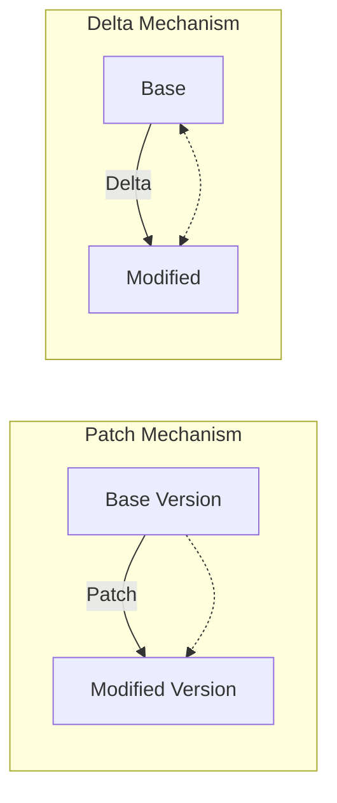
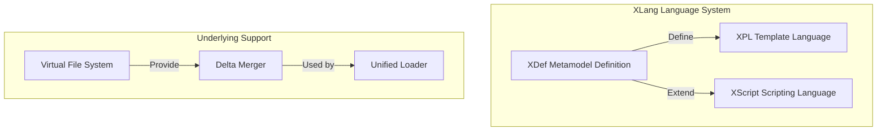
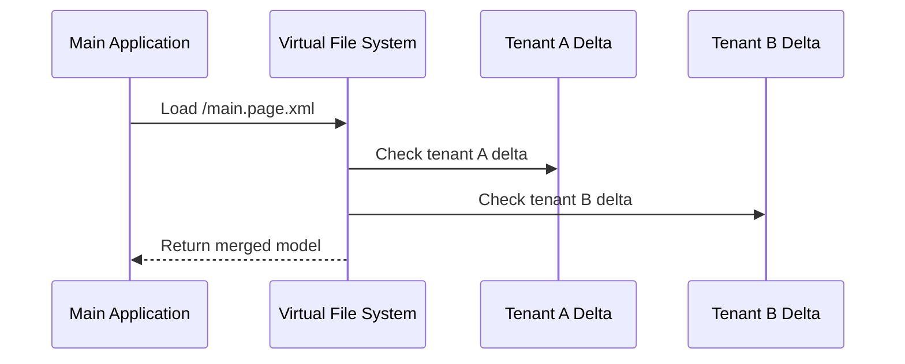

# Analyzing XLang from the Perspective of Reversible Computation: A Revolutionary Delta Programming Paradigm

## Introduction: A New Paradigm in Software Construction Theory

In software engineering, the evolution of programming languages seems to have plateaued. Multi-paradigm fusion has become the mainstream design trend, and innovations at the syntactic level in new languages are increasingly limited. However, the essence of programming languages goes far beyond piling up syntactic sugar; they define a program structure space and its construction rules. It is precisely at this fundamental level that the XLang language brings a paradigm-level breakthrough.

As the core supporting technology of the Nop platform, XLang formally includes multiple sub-languages such as XDef, Xpl, and XScript, but its true innovation lies in its first explicit definition of domain structure coordinates at the language level and the built-in general Delta computation rules. This signifies a shift in software construction theory from the reductionist mindset of component assembly to the continuous Delta superposition mindset of field theory. Its theoretical basis, Reversible Computation theory, provides a mathematical framework for coarse-grained software reuse.

This article will delve into XLang’s design philosophy, technical implementation, and application value, revealing how it achieves the computation paradigm of Y = F(X) + Δ through Delta operations, and the profound impact of this paradigm shift on the future of software engineering.

## I. Evolution of Program Structure Space: A Qualitative Leap from Map to Tree

### 1.1 Structural Limitations of Mainstream Programming Languages

Contemporary mainstream programming languages are strikingly similar at the structural level. Whether it is class inheritance in object-oriented languages or type composition in functional languages, the essence is operations performed within a Map structure space:

```java
// Structural composition in traditional object-oriented programming
interface Base {
    String name();
    void execute();
}

interface Extended extends Base {
    String description(); // Extend structure via inheritance
}
```

This structure corresponds to the mathematical expression: Map_extended = Map_base ∪ Map_addition, i.e., structural extension is achieved through the union operation on Maps. However, the issues are:

1. Reuse direction is limited: Traditional inheritance supports “downward” reuse of base classes, but cannot “upward” reuse derived classes.
2. Limited composition capability: Multiple inheritance faces the diamond problem; Traits improve the situation but are still constrained by the Map structure.
3. Weak coordinate system: Only supports two-level coordinates of type.member, unable to precisely locate elements in complex structures.

### 1.2 The Structure Generation Perspective in Generic Programming

Generic programming, especially C++ template metaprogramming, reveals another dimension of program structure: structure generation. Templates can be viewed as functions that generate structures at compile time:

```cpp
// C++ templates as structure generators
template<typename T>
struct Container {
    T value;
    // Generate specific structure based on T at compile time
};
```

This corresponds to the construction formula: Map = Generator<Parameters>. When combined with inheritance, the strongest form of object-oriented programming can be expressed as: Map = Map extends Map<Map>.

Although powerful, this formula is still confined to the Map structure space. XLang’s revolutionary aspect is expanding the structure space from Map to Tree, and generalizing the formula to: Tree = Tree x-extends Tree<Tree>.

### 1.3 The Coordinate Advantages of Tree Structures

Tree structures provide a far superior coordinate system compared to Maps:

```xpath
// XPath-style precise coordinate example
/workflow/steps/step[@name='approval']/actions/action[@type='submit']
```

Core advantages of Tree structure coordinates:
1. Unified absolute and relative coordinates: Every node has a unique path, while subtrees preserve relative coordinates.
2. Stability: Elements are located by unique identifiers (such as id, name) rather than positional indices, so structural changes do not affect coordinates.
3. Infinite nesting: Supports expression of arbitrarily deep structures, accommodating complex domain models.

This coordinate system lays the foundation for Delta computation—only with stable coordinates can specific parts within a structure be precisely located and modified.

## II. Reversible Computation Theory and Delta Concept Clarification

### 2.1 Core Formula of Reversible Computation

Reversible Computation theory proposes a universal software construction formula: App = Δ x-extends Generator<DSL>

Where:
- DSL: Domain-specific language providing a domain structure coordinate system
- Generator: Structure generator that transforms DSL into implementation structures
- Δ: Delta, representing a set of modifications within the structure coordinate system
- x-extends: Delta merge operation that applies Δ to the base structure

The profundity of this formula lies in the fact that the full is a special case of Delta (when Δ=0), therefore Delta is a more fundamental concept than full content.

### 2.2 Clarification of Delta and Related Concepts

Delta (Δ) vs Patch:


Key differences:
- Independence: Patches depend on a specific base version, whereas Deltas can exist and be managed independently.
- Associativity: Multiple Deltas can be combined into a composite Delta (Δ_total = Δ1 + Δ2); patches lack this property.
- Reversibility: Deltas include inverse operations (delete, modify), while patches are mainly additive.

Delta (Δ) vs Plugin:
- Granularity: Plugins operate at predefined extension points; Deltas can operate at any coordinate point.
- Direction: Plugins primarily add; Deltas support add, delete, and modify.
- Flexibility: Plugin mechanisms must be designed in advance; Deltas can be customized arbitrarily afterwards.

### 2.3 Mathematical Foundations of Delta Operations

Delta operations need to satisfy the basic properties of a group structure:

1. Closure: The result of applying a Delta remains within the structure space.
2. Associativity: (Δ1 + Δ2) + Δ3 = Δ1 + (Δ2 + Δ3)
3. Identity element: There exists an empty Delta 0 such that X + 0 = X
4. Inverse element: For any Delta Δ, there exists an inverse Delta −Δ

Traditional delta mechanisms, such as Git patches, mostly do not satisfy these properties, making automation difficult. XLang, through Tree structure coordinates and well-defined merge algorithms, achieves Delta operations with sound mathematical properties.

## III. XLang Language Design: Technical Architecture for Reversible Computation

### 3.1 Overall Architecture of XLang

XLang is not a single syntax system, but a multi-layer language workbench:



### 3.2 XDef: Metamodel Definition Language

XDef adopts a homomorphic design, with the metamodel highly aligned with instance structures:

```xml
<!-- Metamodel definition: state-machine.xdef -->
<state-machine x:schema="/nop/schema/xdef.xdef" xmlns:x="/nop/schema/xdsl.xdef">
    <states xdef:body-type="list" xdef:key-attr="id">
        <state id="!string" displayName="string">
            <on-entry xdef:value="xpl" />
            <on-exit xdef:value="xpl" />
        </state>
    </states>
    <transitions xdef:body-type="list">
        <transition from="!string" to="!string" />
    </transitions>
</state-machine>
```

Compared to the instance file:
```xml
<!-- Instance file: example.machine.xml -->
<state-machine x:schema="/nop/schema/state-machine.xdef">
    <states>
        <state id="start" displayName="Start State">
            <on-entry><script>initialize()</script></on-entry>
        </state>
    </states>
</state-machine>
```

XDef design advantages:
1. Intuitiveness: Metamodels and instance structures are consistent, reducing cognitive load.
2. Strong constraints: Supports rich constraint types (uniqueness, referential integrity, etc.).
3. Self-descriptive: XDef is defined by xdef.xdef itself, forming a closed loop.

### 3.3 Xpl: A Turing-Complete Template Language

Xpl integrates the strengths of declarative and imperative programming:

```xml
<workflow x:extends="base.workflow.xml">
    <x:gen-extends>
        <!-- Compile-time metaprogramming: dynamically generate nodes -->
        <gen:CreateSteps model="${model}" xpl:lib="/nop/core/xlib/gen.xlib" />
    </x:gen-extends>
    
    <steps>
        <step id="custom-step" x:override="replace">
            <on-execute>
                <c:script>
                    // Embedded script
                    const result = businessLogic(context);
                    if (result.needApproval) {
                        return { nextStep: 'approval' };
                    }
                </c:script>
            </on-execute>
        </step>
    </steps>
</workflow>
```

Xpl’s innovative features:
1. Multiple output modes: Supports output of text, AST nodes, or runtime objects.
2. Metaprogramming integration: Executes code generation at compile time, with no runtime burden.
3. Heterogeneous syntax embedding: Allows embedding multiple scripting syntaxes in XML.

### 3.4 Delta Merge Algorithm

XLang’s Delta merge is based on structure coordinates rather than text line numbers. Core algorithm pseudocode:

```python
def merge(base_node, delta_node):
    if delta_node.override == 'remove':
        return None  # Delete base node
        
    if base_node is None:
        return delta_node  # Add new node
        
    # Choose merge strategy based on node type
    if is_list_node(base_node) and is_list_node(delta_node):
        return merge_list(base_node, delta_node)
    elif is_map_node(base_node) and is_map_node(delta_node):
        return merge_map(base_node, delta_node)
    else:
        return delta_node  # Different types, overwrite completely

def merge_list(base_list, delta_list):
    result = []
    # Build mapping based on key-attr
    base_dict = {node.get(key_attr): node for node in base_list}
    
    for delta_item in delta_list:
        key = delta_item.get(key_attr)
        if key in base_dict:
            # Merge existing item
            merged = merge(base_dict[key], delta_item)
            if merged is not None:
                result.append(merged)
            del base_dict[key]
        else:
            # Add new item
            result.append(delta_item)
    
    # Append base items not modified
    result.extend(base_dict.values())
    return result
```

This coordinate-based merge is more stable and reliable than Git’s line-based merge.

## IV. XLang Application Examples: Delta-Based Component Model

### 4.1 Delta Customization in Front-End Low-Code Platforms

Traditional component customization requires special framework support. XLang implements a general solution via Delta merges:

```xml
<ui-component x:schema="/nop/schema/component.xdef">
    <import from="base:Button/1.0.0" />
    
    <component name="PrimaryButton" x:extends="base:Button/1.0.0">
        <props>
            <prop name="type" default="primary" />
            <prop name="size" default="large" />
            <!-- Remove base component property -->
            <prop name="disabled" x:override="remove" />
        </props>
        
        <template x:override="merge">
            <!-- Only override parts that require customization -->
            <button class="primary-btn" :size="${size}">
                <icon name="check" x:override="replace" />
                <span>${slots.default}</span>
            </button>
        </template>
    </component>
</ui-component>
```

Comparison of advantages:
| Approach | Runtime support | Customization granularity | Framework coupling |
|------|------------|----------|------------|
| UIOTOS solution | Requires special runtime | Property-level | High |
| XLang solution | General-purpose runtime | Arbitrary node-level | Low |

### 4.2 Delta Customization for Backend Services

Delta-based transformation of Spring configuration:

```xml
<beans x:extends="base-app.beans.xml">
    <x:gen-extends>
        <!-- Generate bean definitions conditionally at compile time -->
        <gen:ConditionalBeans profile="${env.profile}" 
                              xpl:lib="/nop/spring/xlib/spring-gen.xlib" />
    </x:gen-extends>
    
    <bean id="dataSource" x:override="replace">
        <!-- Replace with environment-specific data source -->
        <property name="url" value="${env.db.url}" />
    </bean>
    
    <!-- Remove unnecessary bean -->
    <bean id="obsoleteService" x:override="remove" />
</beans>
```

This Delta customization is completed entirely at compile time; at runtime it remains in standard Spring format, requiring no special container support.

### 4.3 Unified Handling of Multi-Tenant Customization

Implement tenant isolation via a virtual file system:

```java
// Tenant customization file path pattern
"/_delta/tenant_{tenantId}/{module}/{resource}"

// Automatically merge tenant customizations during load
IResourceComponentManager manager = NopComponentManager();
IComponentModel model = manager.loadComponent("/app/main.page.xml"); 
// Automatically locate and merge /_delta/tenant_001/app/main.page.xml
```

Multi-tenant customization flow:


## V. XLang Compared with Related Technologies

### 5.1 Compared with Feature-Oriented Programming (FOP)

FOP decomposes systems into feature compositions:

| Dimension | FOP | XLang |
|------|-----|-------|
| Structure space | Feature structure tree | General Tree structure |
| Composition operation | Feature superposition | Delta merge |
| Flexibility | Limited feature composition | Arbitrary structural modification |
| Mathematical foundation | Feature algebra | Reversible Computation theory |

### 5.2 Compared with Delta-Oriented Programming (DOP)

DOP is closest to XLang’s Delta concepts, but key differences include:

1. Delta definition: DOP expresses Deltas as sequences of operations; XLang Deltas are isomorphic to full structures.
2. Coordinate system: DOP relies on the type system; XLang uses an independent structure coordinate system.
3. Generator integration: DOP lacks the Generator concept; XLang deeply integrates it.

### 5.3 Compared with Internal DSLs

Internal DSLs benefit from host language ecosystems, but XLang excels in:

1. Syntax freedom: Not constrained by host language syntax.
2. Toolchain support: Unified parsing, validation, and debugging tools.
3. Visual editing: Structural consistency enables automatic generation of designers.
4. Performance optimization: Delta merges are completed at compile time with zero runtime overhead.

## VI. XLang’s Innovations and Limitations

### 6.1 Theoretical Innovations

1. Expansion of program structure space: A fundamental expansion from Map to Tree structures.
2. Built-in Delta computation: The first implementation of general Delta operations at the language level.
3. Coordinate system revolution: Establishing stable domain structure coordinate systems.
4. Reversibility: Unifying full and Delta representations, supporting inverse transformations.

### 6.2 Technical Originality

Globally, XLang’s core theory and formula were proposed around 2007, earlier than the academic proposal of Delta-Oriented Programming (DOP) in 2010. Key innovations:

1. Delta merge algorithm: Based on structure coordinates rather than text or type systems.
2. Metamodel-driven: XDef’s homomorphic design realizes a metaprogramming closed loop.
3. Virtual file system: Supports unified management of multi-source, multi-version models.
4. Compile-time metaprogramming: The x:gen-extends mechanism achieves zero-overhead code generation.

### 6.3 Application Value

1. Software product line engineering: Perfect support for variability management, especially unforeseen changes.
2. Low-code platforms: Provide the theoretical foundation and technical implementation for model-driven development.
3. System customization: Supports non-intrusive, fine-grained system customization.
4. Architecture governance: Enforce architectural constraints and validation through structure coordinates.

### 6.4 Limitations and Future Directions

1. Learning curve: Requires understanding new concepts such as Reversible Computation.
2. Ecosystem building: Needs a toolchain and component libraries around XLang.
3. Performance optimization: Further optimization is needed for large-scale model merges.
4. Visualization tools: Requires more support for visual designers.

Possible future directions:
- Integrating AI-assisted Delta code generation
- Supporting distributed Delta management and synchronization
- Enhancing runtime Delta hot-update capabilities
- Expanding support for more domain-specific languages

## VII. Conclusion: The Significance of the Paradigm Shift in Software Construction

XLang represents not just a new language, but a fundamental shift in the paradigm of software construction:

1. From composition to Delta: A shift from component assembly to Delta superposition.
2. From discrete to continuous: A transition from isolated objects to field-like structures.
3. From types to coordinates: An evolution from type constraints to structural coordinates.
4. From generation to transformation: An upgrade from code generation to structural transformation.

This paradigm shift has far-reaching implications for software engineering:

- Software reuse granularity: Elevates reuse from component-level to system-level Delas.
- Development model: Shifts from full development to base product plus Delta customization.
- System evolution: Supports more flexible and controllable evolution paths.
- Architecture governance: Enables precise architectural control through structure coordinates.

As an engineering implementation of Reversible Computation theory, XLang provides a new theoretical foundation and technical toolchain for software engineering. It is poised to become a core technology for next-generation low-code platforms and software product line engineering. Its innovation lies not only at the technical level, but also in the profound understanding and re-articulation of the essence of programs.

## References and Further Reading

1. Canonical Entropy. (2023). Reversible Computation: Next-Generation Software Construction Theory. WeChat Official Account
2. Schaefer, I. et al. (2010). Delta-Oriented Programming of Software Product Lines. SPLC
3. Apel, S. et al. (2008). Feature-Oriented Software Development. JOT
4. Batory, D. (2005). Feature Models, Grammars, and Propositional Formulas. SPLC
5. Canonical Entropy. (2023). Nop Platform Open-Source Project. Gitee

*Note: This article is based on multiple provided technical articles for in-depth analysis and synthesis, aiming to objectively and professionally evaluate the innovation and technical value of the XLang language. The code examples, diagrams, and theoretical analyses are reorganized and elaborated based on the original materials.*

<!-- SOURCE_MD5:d068be88b87d8c77dff76d2c4d3e1b2d-->
