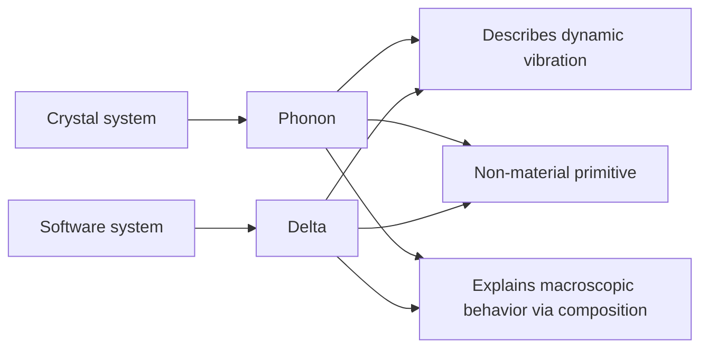

# Why is XLang an innovative programming language?


## I. Why do we need to design the XLang language


XLang is a foundational enabling technology at the bottom of the Nop platform. Formally, it comprises multiple sub-languages including XDef, Xpl, and XScript. Because XLang differs significantly from other single-syntax programming languages, many people encountering it for the first time wonder: Is it truly a programming language? Or is it just a set of scattered extensions layered on top of several existing languages?

Here I want to propose an understanding of the essence of programming languages: A programming language defines a program-structure space; the programming language is the set of construction rules for that space. In other words, the totality of all structures that a programming language can create, together with all feasible evolution paths among those structures, constitute a specific program-structure space in which all feasible computation takes place.

Based on this understanding, XLang qualifies as an innovative programming language because it creates a new program-structure space in which the computational paradigm proposed by Reversible Computation theory—Y = F(X) + Delta—can be implemented with ease. Although XLang can be viewed as encompassing several sub-languages like XDef, XPL, and XScript, it is the whole system that makes Reversible Computation possible. XLang is the first programming language in the world to explicitly define domain structural coordinates in the language and to internally build in generic Delta computation rules.

Currently, most people’s basic understanding of software structural construction is rooted in reductionism: they continuously decompose downward, search for atomic components, and then assemble using these atoms. Although components are virtualized in concept, subconsciously they are regarded as discrete entities truly existing like particles in the material world, with nested compositions constructing the world. But there is another construction mode in the physical world: waves. Waves are continuously existing patterns; they construct the world via interference superposition. XLang’s distinctiveness lies in supporting continuous superposition construction through Delta operations.

### 1.1 Viewing programming languages from the perspective of structure

General-purpose high-level programming languages began with FORTRAN and have undergone long-term development over decades, but they have now reached a certain bottleneck. The fundamentally novel features brought by new languages are fewer and fewer. Most high-level languages have evolved into “multi-paradigm programming,” with syntax features gradually converging and becoming similar: most now support object-oriented structural declarations, functional-style Lambdas, custom annotations for metaprogramming, and async-related syntax and libraries for asynchronous programming.

An interesting question is whether general, abstractable syntax features still exist that possess enough technical value to warrant a new programming language to carry them? XLang’s innovation lies in pointing out that although mainstream programming languages differ widely in surface syntax, they are very similar at the basic structural layer beneath the syntax. Innovation at this structural layer remains promising.

The structure space of programs essentially consists of data + functions; organizing relevant data and functions together forms a custom type, corresponding to classes (Class) or interfaces (Interface) in general programming languages. At the structural level, a class is effectively a Map, where attributes or methods are retrieved by name.

```javascript
type MyClass = {
  name: string,
  myMethod: (arg1:string) => number
}

or

interface MyClass{
  name: string,
  myMethod: (arg1:string) => number
}
```

When we want to derive a new type from an existing custom type, we can use inheritance or Traits.

```javascript
type MySubClass = MyClass & {
  subName: string
}

or

interface MySubClass extends MyClass {
   subName: string
}
```

Conceptually, this is roughly equivalent to the following construction:

```javascript
Map = Map extends Map
```

At the structural level, class inheritance is equivalent to overlaying two Maps by name, where upper-layer elements override lower-layer elements.

In traditional object-oriented languages, inheritance allows reusing a base class. For example, when constructing MapX and MapY, we reuse the base class Map1, i.e., we reuse the lower levels of the inheritance tree.

```javascript
MapX = Map2 extends Map1
MapY = Map3 extends Map1
```

Expressing inheritance via the above structural construction formulas makes many issues very natural and intuitive. For instance, can we swap the relative positions of Map1 and Map2? That is, when constructing MapX and MapY, can we still reuse Map1 but not as the base class, choosing different base classes but using the same Map1 to override them?

```javascript
MapX = Map1 extends Map2
MapY = Map1 extends Map3
```

Interestingly, many object-oriented languages do not support the above operation; object-orientation does not directly support reusing the upper layers of the inheritance tree!

Further thought reveals that traditional object-orientation faces many structural-level issues that are hard to answer. For example, what happens if the inheritance chain contains multiple instances of the same object?

```javascript
MapX = Map1 extends Map2 extends Map1
```

Multiple inheritance in C++ faces severe conceptual difficulties; the essential reason is the structural fusion obstacle that emerges when Map1 is reused via different inheritance paths.

Modern programming languages solve these problems via Traits. For example, in Scala:

```scala
trait Map1 {
  val name: String = "Map1" // same-named property
  def method1(): Unit = {
    println(s"Method 1 from $name")
  }
}

trait Map2 {
  val name: String = "Map2" // same-named property
  def method2(): Unit = {
    println(s"Method 2 from $name")
  }
}

class MapX extends Map1 with Map2 {
}

class MapY extends Map1 with Map3 {
}
```

> In Scala, multiple Traits can define the same-named property; the compiler automatically merges these property definitions, and only one variable exists at runtime. In Java or C++, multiple same-named properties defined in different classes are not automatically merged.

In traditional object-oriented languages, A extends B indicates that derived class A can be more than base class B, but exactly what “more” consists of is not separated in any explicit technical form, making it impossible to directly reuse this extra part (the Delta). Traits explicitly express this Delta. Compared to inheritance, the Traits concept yields a more complete Delta semantics. type MapX = Map1 with Map2 with Map1 is a valid Scala type definition!

To address issues arising from multiple inheritance, Scala introduces a so-called linearization rule, ordering all classes and Traits in the inheritance chain into a linear sequence and stipulating that upper-layer elements override lower-layer elements.

```
MapX -> Map2 -> Map1
```

### 1.2 Generics as Generator

Generics (Generic Type) in Java are only used for type checking; the compiler does not perform special actions based on generic parameters. In C++, however, the situation is entirely different. C++ supports generic programming via templates; the compiler instantiates a template with specific types based on template parameters, generating corresponding specialized code.

At the 1994 C++ standard committee meeting, Erwin Unruh delivered a stunning demonstration. He wrote a template metaprogram capable of determining whether a number is prime at compile time and outputting the prime number in the compiler error message if it is prime. This code became known as the “Unruh prime computation,” a classic in C++ template metaprogramming. Unruh’s demo proved that C++ templates are Turing-complete at compile time, meaning any computation can theoretically be carried out at compile time. This discovery heralded the era of Generative Programming—leveraging compile-time computation to generate code or optimize programs. Template Metaprogramming in C++ became a critical tool for generative programming, enabling complex computations, type deduction, and code generation at compile time to yield better performance and flexibility at runtime.

See [C++ Compile-Time Programming](https://accu.org/journals/overload/32/183/wu/)

From a structural perspective, template metaprogramming can be understood as the following construction formula:

```
Map = Generator<Map> = Map<Map>
```

> A<X,Y> can be understood as A<B>, struct B{ using T1=X; using T2=Y;}
> Note that here Map refers to the structure seen by the compiler at compile time. Every member, whether a property, method, or type declaration, is a Map entry from the compiler’s perspective.
> Even if the compiler manages a parameter list as a List, it can still be regarded as a Map using indices as keys. Interestingly, if managed as an array, it’s typically impossible to introduce more advanced composition mechanisms like inheritance. Conceptually we choose to merge by name rather than index.

At the structural level (the structure visible to the compiler), a template class used as a generator can also be regarded as a Map. Combining this with the delta-ized Traits concept, the strongest form of object-oriented languages at the structural level can be expressed as:

```
Map = Map extends Map<Map>
```

### 1.3 From Map structure to Tree structure

From the compiler’s perspective, classes, template classes, and template parameters can all be treated as Maps, and practically they are typically managed as Maps. As for standalone function definitions and variable definitions, they too belong to some Map: for instance, a module object can be viewed as a Map containing a set of variables, functions, and types defined within the module. Even if they do not belong to any module, standalone functions belong to some implicitly existing global namespace.

> Lisp’s internal structure is List, essentially managing elements by index (the original Lisp had no indices, only car/cdr for stepwise traversal), but modern Lisp variants have long introduced Map-like associative lists, locating sub-elements by name rather than index. Conceptually (ignoring the index-based performance advantages of von Neumann machines), a List can be seen as a special Map using indices as keys.
> 
> Lisp’s core invention, S-expressions, can be seen as a general Tree structure, and Lisp provides macros and other built-in mechanisms for operating on these Tree structures. However, Lisp does not establish a delta concept for Trees. XLang can be viewed as a further deepening of Lisp’s general S-expression processing.

The myriad syntactic facilities provided by mainstream programming languages can be viewed as rules for continuously constructing new Maps within a Map-based structural space. XLang innovates by extending Maps into Trees and rethinking software structural construction on Tree structures, generalizing the construction formula:

```
Tree = Tree x-extends Tree<Tree>
```

> If Map extends to Tree, then the extends operation between Maps also needs to be extended to the x-extends operation on Tree structures.

Clearly, Map is a special case of Tree. Each node in a Tree can be seen as a Map: Tree = Map + Nested. Therefore, the above formula indeed generalizes Map extends Map<Map>. But from another angle, Tree structures can be constructed by nested composition of multiple Maps; Map is more basic and fine-grained. Is it necessary to emphasize Tree? Can’t all operations on a Tree be decomposed into per-level Map operations?

XLang’s answer is: The software-structure space built upon more complex Tree structures (and the construction rules in that space) cannot simply be subsumed by the Map-based software-structure space. That is, we have a situation where the whole is greater than the sum of its parts; the holistic construction rules for Trees lose key information when decomposed into construction rules for Maps.

To truly understand XLang’s innovation, we must understand the next-generation software construction theory behind XLang’s design: Reversible Computation. Reversible Computation explicitly introduces the concepts of inverse elements and Delta, points out that the total (A) is a special case of Delta (A = 0 + A), and calls for rebuilding all understandings of the software world on the concept of Delta (including inverse elements). Reversible Computation proposes a general, Turing-complete software construction formula:

```
 App = Delta x-extends Generator<DSL>
```

XLang is the concrete implementation of this technical strategy at the programming language level.

For an introduction to Reversible Computation theory, see my WeChat articles:

1. [Reversible Computation: The next-generation software construction theory](https://mp.weixin.qq.com/s/CwCQgYqQZxYmlZcfXEWlgA)
2. [A programmer’s analysis of Reversible Computation](https://mp.weixin.qq.com/s/aT99VX6ecmZXdemBPnBcoQ)
3. [Addendum: A programmer’s analysis of Reversible Computation](https://mp.weixin.qq.com/s/zGfo7pvKjOCa11PYLJHzzA)
4. [A programmer’s analysis of the Delta concept, with Git and Docker as examples](https://mp.weixin.qq.com/s/D5bDNkMJ9gYrFb0uDj2EzQ)

According to Reversible Computation theory, the special nature of Tree structures is that they correspond to a global coordinate system: every node and property in the tree has a unique xpath.

```
/tasks/task[name='test']/@name
```

The above xpath indicates the name attribute of the child node under tasks whose name is test.

First, let’s clarify the function of a coordinate system: each value of interest at the business level has a unique coordinate in the coordinate system, enabling precise read and modification by coordinate.

```
value = get(path);
set(path,value);
```

The problem with Map structures is that they only provide two levels of coordinates: the first level locates the Map, and the second level locates an attribute or method within the Map. But this simple coordinate system fails to accomplish precise distinctions at the business level. For example:

```java
class Dialog{
    String title;
    List<Button> actions;
    List<Component> body;
}
```

A Dialog object has a set of action buttons. If we want to locate the [submit] button and change its label property to [OK], there is no convenient, intuitive positioning tool in existing programming languages. If we only want to customize a Dialog used in a certain scenario (e.g., adding a property), AOP (Aspect Oriented Programming) mechanisms provided by typical programming languages cannot do it either, because AOP’s positioning system is type-based. In XLang, we can directly use the following description:

```xml
<dialog>
   <actions>
      <button name="submit" label="OK" />
   </actionss>
</dialog>
```

Current programming language research generally focuses on type systems. The reason to study types is that different objects can share the same type, making type-level study simpler without touching object lifecycle issues. This leads to type systems not being qualified coordinate systems: objects of the same type cannot be distinguished in the type-system coordinate space, and thus fine-grained Delta construction cannot be built on it.

Some may wonder: why Tree, not graph? On a graph, if we choose a primary orientation of observation and fix a node as the root, we can naturally convert a graph structure into a tree structure. For example, in Linux, “everything is a file,” and many logical relationships are expressed via the file tree; but using filesystem links, graphs can be represented. In essence, trees arise because we select a direction of observation on a graph.

For example, flowcharts expressed in XML can define node id references: <step nextTo="nextStepId" />

Tree structures unify relative and absolute coordinates: there is a unique path from the root to any node, serving as the node’s absolute coordinate. Meanwhile, within a subtree, each node has a unique path relative to the subtree, serving as its relative coordinate. Given the node’s relative coordinate and the subtree root’s absolute coordinate, it’s easy to compute the node’s absolute coordinate—just concatenate them.

### 1.4 An extensible design necessarily requires a software structural coordinate system

In software development, extensibility refers to meeting new requirements or implementing new functions without modifying the original code, by adding extra code or differential information. In purely abstract mathematical terms, software extensionality corresponds to:

```
  Y = X + Delta
```

- X corresponds to the foundation code we have already written; it does not change with requirement changes.
- Delta corresponds to additional configuration information or differential code.

From this perspective, research on extensibility is equivalent to research on the definition and algebraic relationships of the Delta.

```
X = A + B + C
Y = (A + dA) + (B + dB) + (C + dC)  // Delta is everywhere
   = (A + B + C) + (dA + dB + dC)  // Deltas can be aggregated independently of the base code
   = X + Delta // Delta satisfies associativity; it can be merged independently of the base
```

Assume X consists of A, B, C and other parts. Requirement changes produce variations scattered across the system. If we demand that all these fragmented modifications can be managed and stored independently of the original system’s source code (independence of Delta), and that smaller Deltas can be composed into larger Deltas (composability of Delta), then a coordinate system for precise positioning is inevitably needed. Specifically, once dA is separated from A and stored in an independent Delta, it must retain some position coordinate so that when Delta is combined with X, it can find the original structure A and combine with it.

### 1.5 Differences between Delta, Patch, and plugin mechanisms

First, note that Git’s Patch and branch management do not satisfy Delta’s independence and composability. A Patch is always bound to a particular base code version; without knowing the base, one cannot merge multiple patches into a larger patch. See [A programmer’s analysis of the Delta concept, with Git and Docker as examples](https://mp.weixin.qq.com/s/D5bDNkMJ9gYrFb0uDj2EzQ) for detailed analysis.

Second, Delta differs fundamentally from traditional extension points and plugin mechanisms in programming.

```
X = A + B + C
Y = A + B + D
  = X + (-C) + D
  = X + Delta
```

Delta is not just adding content to a system. If we aim for coarse-grained, system-level reuse, the corresponding Delta must contain the semantics of reduction (e.g., we need to remove a Bean defined in the base product). In fact, a coarse-grained Delta is always a mixture of addition and subtraction.

Also note: the plugin mechanism supports only a small number of predetermined extension points. We cannot customize the original system’s functionality via plugins beyond the original design. Delta is different: as long as there is a global structural coordinate system, Delta can be introduced at any point in that coordinate system. Kustomize in k8s uses Delta to support comprehensive customization and can be seen as a concrete application of Reversible Computation theory. See [Kustomize from the perspective of Reversible Computation](https://mp.weixin.qq.com/s/48LWMYjEoRr3dT_HSHP0jQ)

> The black-box model of components is akin to the worldview of Newtonian mechanics taught in high school: it is entirely mechanical. The motion of a rigid body is fully described by a handful of parameters like mass center coordinates, size, shape, and orientation; its internal construction is unobservable and irrelevant. Rigid bodies interact through direct contact; shapes must match precisely to form a seamless whole. Even in classical mechanics, more advanced viewpoints switch to Lagrangian or Hamiltonian formulations, whose essence is a turn toward the field-theoretic worldview. A field (Field) is essentially an omnipresent coordinate system in which a physical quantity can be specified at every point. A field’s degrees of freedom are infinite, but thanks to the coordinate system it is describable, definable, and researchable; at every coordinate point we can precisely measure local change. In the field worldview, our core picture is objects immersed in the field (an omnipresent coordinate system), rather than isolated pairwise interactions of objects.

### 1.6 Stable domain structural coordinate systems

Mainstream programming languages are general-purpose and do not embed domain knowledge of any particular business field. Therefore, the built-in structural coordinate system is limited to the language’s classes and methods—a two-level structure—at most with an annotation mechanism providing some domain-oriented refinements. Below the method level, suitable techniques for defining coordinates are generally lacking.

When business requirements change, multiple places in the code often change accordingly. Essentially this is because the structural mapping from problem space to solution space is nontrivial under general business circumstances, such that the two modes of description cannot align effectively. Borrowing parlance from AI, we might say: useful features are distributed.

> In physics, the same physical fact can be described in countless coordinate systems, but there may be a special coordinate system tailored for the specific problem—a so-called intrinsic coordinate system. Descriptions in this coordinate system can highlight core physical meanings and simplify relevant descriptions. For example, phenomena occurring on a sphere can certainly be described in a general 3D Cartesian coordinate system, but spherical coordinates often yield simplification.

Reversible Computation theory suggests establishing a domain-specific DSL language for a specific business domain. Using the DSL, we naturally build a domain coordinate system, and then express Deltas in the delta structural space defined by this coordinate system. Because this domain coordinate system is tailored for the domain problems, it can often minimize the Delta description. For example, when a business-level change adds a field, using a general-purpose language may require changes in many places—frontend, backend, and database. But using a domain model description, that change may only be a local, field-level change, and the underlying engine framework automatically translates the domain description into executable logic.

XLang’s core function is quickly defining multiple DSL languages and using them as domain structural coordinate systems to implement Delta definition and generation/transformation of delta structures.

XLang’s essential difference from other languages is that it is based on Reversible Computation theory and is oriented toward DSL development. General languages target application development directly—modeling business and implementing business logic with the language itself. With XLang, we first build one or more DSLs, then use DSLs to describe the business. XLang makes the cost of developing a DSL extremely low: in the simplest case, it only requires defining an XDef meta-model file with the XDef language to automatically obtain the new DSL’s parser, validator, IDE plugin, visual editor, etc.—with full tooling support such as syntax hints, breakpoint debugging, and visual editing.

> JetBrains has a product called MPS (Meta Programming System), which also supports DSL-first, then use DSLs to describe business. MPS is built upon its own base language mechanism. The Nop platform is a low-code development platform similar to MPS, and its foundation is precisely XLang. However, Nop’s guiding theory is Reversible Computation, making its technical route and guiding philosophy fundamentally different from MPS.
> Despite that, the technical development goals are similar.

## II. XLang’s concrete syntax design

XLang is a language oriented toward Tree structures. Its syntax components can be compared to SQL, which is oriented toward tabular structures.

| SQL language                       | XLang language                                   |
| ---------------------------------- | ------------------------------------------------ |
| DDL (data definition language)     | XDef meta-model definition syntax                |
| Non-redundant tabular data         | Non-redundant tree-structured information: XNode |
| On-the-fly computation on normalized data: SQL Select | Runtime and compile-time computation on general XNode data: Xpl/XTransform |
| Tabular merge and diff: Union/Minus | Delta computation on Trees: x-extends/x-diff     |
| Extend SQL via functions and stored procedures | Extend XLang via Xpl tag libraries and XScript   |

First, note that XLang targets Tree structures, so a very natural syntax carrier is XML; XLang files are typically valid XML files. But this is not the only option. Traditional programming languages put strong emphasis on syntax form, whereas XLang—grounded in Reversible Computation theory—emphasizes that syntax form is not important. Different syntax forms are merely different presentations of the same information, and information-equivalent representations can be reversibly transformed. XLang can use any syntax capable of directly expressing tree structures, such as JSON or YAML. Lisp’s S-expressions, augmented with some extended attributes, can also serve as an XLang syntax carrier.

> The Nop platform also implements a bidirectional mapping between Tree structures and Excel files, allowing DSL model objects to be expressed in Excel without any Excel parsing or generation code. For example, app.orm.xlsx can express the ORM DSL, equivalent to app.orm.xml.

### 2.1 XDSL’s basic syntax structure

XLang itself is Turing-complete, but it is designed primarily as a meta-language for quickly developing new DSLs rather than as a general-purpose programming language. That is, while XLang can be used as a glue language, it is used more to develop DSLs embedded in the Java environment.

All XLang-based DSLs share some common syntax structures; collectively, they are called XDSL.

```xml
<state-machine x:schema="/nop/schema/state-machine.xdef"
     x:extends="base.state-machine.xml">
    <x:gen-extends>
       <app:GenStateMachineDelta1/>
       <app:GenStateMachineDelta2/>
    </x:gen-extends>

    <x:post-extends>
       <app:PostProcessGeneratedModel />
    </x:post-extends>

    <!-- x:override=remove indicates that this node is removed from the final merge result -->
    <state id="commit" x:override="remove" />

    <on-exit>
       <c:if test="${abc}">
           <c:log info="${xyz}" />
        </c:if>
    </on-exit>
</state-machine>
```

Referring to the example above, all XDSLs support the following syntax:

1. x:schema imports the XDef meta-model—similar to JSON Schema—to constrain the DSL’s syntax structure.

2. x:extends indicates inheritance from an existing DSL file, merging the two DSL models layer-by-layer following Tree structure.

3. x:override specifies how two corresponding nodes are merged when executing x:extends; x:override=remove indicates deletion semantics.

4. x:gen-extends uses the Xpl template language to dynamically generate multiple Tree nodes and merges them sequentially according to the Delta algorithm.

5. x:post-extends also uses the Xpl template language to dynamically generate multiple Tree nodes, but its execution timing differs from x:gen-extends.

6. If a DSL needs to embed script code, it can directly use the Xpl template language, such as the on-exit callback.

```xml
<model x:extends="A,B">
   <x:gen-extends>
      <C/>
      <D/>
   </x:gen-extends>
   <x:post-extends>
      <E/>
      <F/>
   </x:post-extends>
</model>
```

The complete merge order is:

```
F -> E -> Model -> D -> C -> B -> A
```

Any XML or JSON file format can incorporate the XLang Delta operations syntax above. For example, we introduced the following decomposition scheme for AMIS (Baidu’s open-source JSON format frontend UI definition language):

```yaml
x:gen-extends: |
   <web:GenPage view="NopSysCheckerRecord.view.xml" page="main"
        xpl:lib="/nop/web/xlib/web.xlib" />

body:
   x:extends: add-form.page.yaml
   title: Override the existing title defined in add-form.page.yaml
```

AMIS’s JSON format itself does not provide decomposition or merging mechanisms, resulting in large, hard-to-maintain JSON files for a complete application. By introducing x:gen-extends, base page structures can be automatically generated based on View models; inside a page, x:extends can bring in existing files.

XLang has built-in support for Reversible Computation, i.e., the computation pattern App = Delta x-exends Generator<DSL>. x:gen-extends and x:post-extends correspond to Generator; they are metaprogramming mechanisms that generate model nodes at compile time as built-in code generators. The x:extends syntax merges two model nodes.

For further information, see [XDSL: A general design for domain-specific languages](https://zhuanlan.zhihu.com/p/612512300)

Nop—the next-generation low-code platform—has already defined multiple DSLs, such as Workflow, Rule, ORM, BeanDefinition, Batch, and Record for binary messages. Generally, a custom DSL does not need a dedicated runtime engine; using XLang’s metaprogramming, a custom DSL can be compiled to an existing DSL or multiple DSLs can be seamlessly integrated to form a new DSL. See [Why SpringBatch is a poor design](https://mp.weixin.qq.com/s/1F2Mkz99ihiw3_juYXrTFw) for the DSL forest solution.

### 2.2 XDef meta-model definition language

XML has a range of international standards like XSD (XML Schema Definition) and XSLT (Extensible Stylesheet Language), but these standards assume, like DOM, that they handle text structures with all attributes as strings, making them inapplicable to general Tree structure processing.

XLang introduces the XDef meta-model definition language to replace XSD. XDef is much simpler and more intuitive than XSD while providing stronger structural constraints.

```xml
<state-machine x:schema="/nop/schema/xdef.xdef">
   <state id="!var-name" displayName="string" xdef:unique-attr="id" />
   <on-exit xdef:value="xpl" />
</state-machine>
```

Unlike XSD or JSON Schema, XDef follows a homomorphic design: the meta-model definition structure nearly mirrors the XML format it constrains, replacing attribute values with type declarations. For example:

- id="!var-name" indicates that the id attribute follows the var-name format—no special characters and cannot start with a digit; ! indicates that the attribute value cannot be empty.

- <on-exit xdef:value="xpl"/> indicates the content of on-exit is Xpl template language; reading the model file will automatically parse it into an IEvalAction executable function.

- xdef:unique-attr="id" indicates that the current node can occur multiple times, forming a list whose elements are uniquely identified by the id attribute.

Notably, XDef itself is defined by xdef.xdef. In other words, state-machine.xml is a DSL whose syntax structure is defined by the meta-model state-machine.xdef; then state-machine.xdef declares x:schema='/nop/schema/xdef.xdef', indicating that this meta-model file is constrained by xdef.xdef; ultimately xdef.xdef is constrained by xdef.xdef itself, completing the loop.

All XDSLs share the XDSL syntax defined by the meta-model xdsl.xdef. The IDEA plugin automatically recognizes x:extends and x:gen-extends according to xdsl.xdef’s definitions, enabling features such as syntax hints and file navigation.

### 2.3 Xpl template language

XLang needs a template language for compile-time code generation, but instead of common template languages like Velocity or FreeMarker, it designs a new one—Xpl.

Xpl is Turing-complete and provides syntax nodes such as c:for, c:if, c:choose, c:break, and c:continue.

```xml
<c:for var="num" items="${numbers}">
    <!-- Check whether the number is 7 -->
    <c:if test="${num == 7}">
        <p>Encountered 7, stop iteration.</p>
        <c:break /> <!-- Break the loop -->
    </c:if>

    <!-- Use c:choose to test parity -->
    <c:choose>
        <when test="${num % 2 == 0}">
            <p>${num} is even.</p>
        </when>
        <otherwise>
            <p>${num} is odd.</p>
        </otherwise>
    </c:choose>
</c:for>
```

Xpl templates use ${expr} to embed XScript expressions; additionally, Xpl provides a dedicated c:script node to execute XScript statements.

```xml
<c:script>
  import my.MyDSLParser;
  let model = new MyDSLParser().parseFromNode(path);
</c:script>
```

XScript’s syntax resembles JavaScript but adds some extensions. For example, import statements can bring in Java classes.

#### Mutual embedding of XML template language and expression syntax

XLang does not use JSX-style syntax. It retains XML syntax and extends JavaScript’s template expression syntax.

```javascript
let resut = xpl `<my:MyTag a='${data}' />`
const y = result + 3;
```

Equivalent to:

```xml
<my:MyTag a='${data}' xpl:return="result" />
<c:script>
  const y = result + 3;
</c:script>
```

XLang modifies JavaScript’s parsing for template expressions so that the content between backticks is recognized as a string to be parsed at compile time rather than a list of Expressions. This enables XLang to extend support to more DSL formats by leveraging this syntax, for example, introducing C#-like LINQ syntax:

```javascript
const result = linq `select sum(amount) from myList where status > ${status}`
```

#### Multiple output modes

Unlike typical template languages, Xpl specifically optimizes for compile-time code generation. Conventional templates directly output text; in code generation, this loses the original code positions, requiring a SourceMap mechanism to record mapping between generated code and original code. Xpl’s approach is different: it introduces multiple output modes. For compile-time code generation, outputMode=node is used, meaning the output is XNode nodes rather than raw text.

```java
class XNode{
    SourceLocation loc;
    String tagName;
    Map<String, ValueWithLocation> attributes;
    List<XNode> children;
    ValueWithLocation content;

    XNode parent;
}

class ValueWithLocation{
    SourceLocation location;
    Object value;
}
```

XNode captures source locations for attributes and nodes and changes attribute and content value types to Object. This overcomes XML’s original limitation of targeting text documents only, enabling more efficient expression of complex business object structures.

### 2.4 Extensible syntax

Similar to Lisp, XLang can extend syntax via macro functions and tag functions. New syntax nodes can be introduced via <c:lib>, and then structural transformations implemented within them through macro functions and other mechanisms.

```xml
<c:lib from="/nop/core/xlib/biz.xlib" />
<biz:Validator fatalSeverity="100"
               obj="${entity}">

    <check id="checkTransferCode" errorCode="test.not-transfer-code"
           errorDescription="Scanned code is not a transfer code">
        <eq name="entity.flowMode" value="1"/>
    </check>
</biz:Validator>
```

<biz:Validator> introduces a validation DSL; at compile time, the Validator tag is parsed using macro mechanisms and translated into XLang expressions for execution.

## III. XLang application example: A delta-based component model

All software practices involving the Delta concept can follow the technical route of Reversible Computation. In many cases, XLang can be directly used to implement Delta merge and decomposition, completely avoiding introducing Delta concepts into the runtime engine and simplifying runtime implementations. Here is an example in the component model of a front-end low-code/no-code platform.

In front-end no-code/low-code platforms, functionality essentially consists of nesting components via visual interfaces. But component encapsulation often proves difficult in practice: the encapsulated component fails to precisely meet needs, yet writing a new component from scratch is too costly. The UIOTOS no-code platform proposes a page inheritance approach.


Specifically, UIOTOS can import an existing page as a base page and then override lower-level page attributes from the upper layer. See [UIOTOS documentation](https://www.yuque.com/liuhuo-nc809/uiotos/fa6vnvggwl9ubpwg#rsHSa) for details.

To implement this feature, UIOTOS performs extensive special-purpose design and introduces a lot of code in the runtime engine for attribute inheritance. If we base it on XLang, Delta computation can be completely compressed to compile time: the runtime engine only needs to know ordinary component structures, without any knowledge of Delta decomposition or merging.

```xml
<component x:schema="component.xdef">
  <import from="comp:MyComponent/1.0.0"/>

  <component name="MyComponent" x:extends="comp:MyComponent/1.0.0">
    <state>
      <a>1</a>
    </state>
    <props>
      <prop name="a" x:override="remove"/>
      <prop name="b"/>
    </props>

    <component name="SubComponent" x:extends="ss">
      <prop name="ss"/>
    </component>

    <template x:override="merge">
      Here, you can show only the Delta modifications

      <form x:extends="a.form.xml">
        <actions>
          <action name="ss" x:id="ss"/>
        </actions>
      </form>
    </template>
  </component>

  <template>
    <MyComponent/>
    <MyComponentEx/>
  </template>
</component>
```

- A component’s template section expresses how to compose child components.
- When using child components, they can be imported via import or defined locally via component.
- If the Component model is implemented as an XLang XDSL, x:extends can be used to perform Delta customization based on existing components. No special design like UIOTOS is needed; x:extends alone achieves deltaized component definitions.
- A local component can itself contain local subcomponents, and they too can be customized. Delta customization can modify the entire component tree, not merely a component class’s attributes or methods.
- Delta merging requires every node to have a unique coordinate. If a DSL node lacks an available id or name attribute, you can use XLang’s built-in x:id extended attribute; these are automatically removed after Delta merging and therefore do not affect the DSL runtime engine.
- x:extends is executed when the model is loaded. When passed into the runtime engine, all attributes in the x namespace have been processed and automatically removed. Thus the runtime engine does not need any knowledge of x:extends, a strong contrast with UIOTOS’s approach: Delta can be implemented once and for all by a generic engine rather than introducing delta handling mechanisms for each specific requirement.
- The extended virtual file path comp:MyComponent/1.0.0 references a component; when loaded via the virtual filesystem, tenant isolation and version-upgrade isolation are automatically realized.

For a complete explanation, see the Bilibili video [A discussion with the UIOTOS author and the design of a front-end low-code platform that supports the Delta concept](https://www.bilibili.com/video/BV1ask2YhEfp/).

With XLang, implementing Delta components requires essentially no extra work, and the approach can be extended to all DSL models needing Delta editing. For example, some introduce a similar component model into backend service application development.

The low-code platform NopPlatform, designed based on Reversible Computation theory, is open-source:

- gitee: [canonical-entropy/nop-entropy](https://gitee.com/canonical-entropy/nop-entropy)
- github: [entropy-cloud/nop-entropy](https://github.com/entropy-cloud/nop-entropy)
- development example: [docs/tutorial/tutorial.md](https://gitee.com/canonical-entropy/nop-entropy/blob/master/docs/tutorial/tutorial.md)
- [Principles of Reversible Computation and an introduction to the Nop platform with Q&A on Bilibili](https://www.bilibili.com/video/BV14u411T715/)


# Q&A on “Why XLang is an innovative programming language”

In my previous article [Why XLang is an innovative programming language](https://mp.weixin.qq.com/s/O4VeA7Dw8cRF7HTHxi6pNw), I introduced the design philosophy of XLang and noted that XLang is innovative because it creates a new program-structure space in which the computational paradigm Y = F(X) + Delta proposed by Reversible Computation theory can be implemented easily. This article provides further explanations addressing feedback questions.

## 1. How can Delta computation be compressed into compile-time with XLang?

> To implement attribute inheritance, UIOTOS performs extensive special-purpose design and introduces a lot of runtime code for attribute inheritance. If based on XLang, Delta computation can be entirely compressed into compile time, while the runtime engine only needs to know ordinary component structures without any knowledge of Delta decomposition or merging.


UIOTOS is a no-code platform for the IoT domain. It introduces a container component in which existing pages can be applied and then overridden using an attribute mechanism to achieve flexible customization without re-implementing the page.

```json
{
  type: "container",
  baseUrl: "a.page.json",
  overrideProps: {
    "form/title": "sss",
    "actions/0/label": "vvv"
  }
}
```

The basic scheme is roughly as above. Essentially a page object is introduced via baseUrl, and multiple inheritance attributes override the page object’s contents. With a JsonPath-like syntax, any nested content within the page object can be modified—unlike typical component frameworks where you call a component and pass parameters.

UIOTOS writes considerable code for attribute inheritance in the front-end runtime framework and requires a special container control. A limitation of UIOTOS’s scheme is that it can only override existing attribute values in pages and cannot change the inherited page’s structure. Another low-code platform employs a similar approach without introducing a special container component; any component can be delta-customized. Concretely, this scheme introduces a special overwrite attribute within the component:

```json
{
  "component": "MyComponent",
  "version" : "1.0",
  "properties": {
     "a": 1, // directly set component properties
   },
   "overwrite": [
    "Here, record design-time edit operations performed in the visual editor"
 ]
}
```

The basic operation mode is that after dragging a component into the editor, if certain details need to be adjusted, the component customization mode can be entered and fine-tuning performed in the visual designer. The edit operations during the adjustments are automatically recorded as overwrite in the page file. This approach allows arbitrary adjustments to component structures and is more adaptable than UIOTOS’s, but recorded operation sequences are relatively verbose, and merging multiple operations into a final simplified result is difficult (i.e., no simplification via associativity).

> According to Reversible Computation theory, A=0+A; the total is a special case of Delta. We can use a unified form to define both full values and Delta, such that the Delta of a Delta is still an ordinary Delta, enabling more complex logical reasoning. Expressing Delta as overwrite actions is not appropriate.

Whether using the scheme above or others, both the editor and front-end runtime framework need to incorporate Delta-related code. If we use XLang to express the underlying model, Delta computation can be entirely compressed into compile time; the runtime engine only needs to know ordinary component structures. Specifically, use x:extends to implement component inheritance:

```xml
<component x:schema="component.xdef">
  <import from="comp:MyComponent/1.0.0"/>

  <component name="MyComponentEx" x:extends="comp:MyComponent/1.0.0">
    <props>
      <prop name="a" x:override="remove"/>
      <prop name="b"/>
    </props>

    <template x:override="merge">
      Here, you can show only the Delta modifications

      <form x:extends="a.form.xml">
        <actions>
          <action name="ss" x:id="ss"/>
        </actions>
      </form>
    </template>
  </component>

  <template>
    <MyComponent/>
    <MyComponentEx/>
  </template>
</component>
```

If no customization is needed, import the component and use it directly. If customization is needed, enable local component definitions and use x:extends to inherit existing components. XLang defines delta merging algorithms between Tree structures; during loading with a unified DslNodeLoader, this algorithm automatically executes. Pseudocode:

```javascript
 function loadDeltaModel(path){
    rootNode = VirtualFileSystem.loadXml(path);
    for each node with x:extends attribute  // recursively traverse rootNode and its children
        baseNode = loadDeltaNode(node.removeAttr('x:extends'));
        genNodes = processGenExtends(node);

        for each genNode in genNodes
            baseNode = new DeltaMerger().merge(baseNode, genNode);
        node = new DeltaMerger().merge(baseNode,node);

    processPostExtends(node);
    return node;
 }
```

DslNodeLoader.loadDeltaModel("comp:MyComponent/1.0.0") returns the final merged XNode, which no longer contains any attributes or child nodes in the x namespace.

The Loader can be regarded as a just-in-time compiler; the structural transformations performed when loading a model file are part of the compilation process.

### Delta operations defined at the structure layer rather than the object layer

> Wittgenstein said that the limits of my language mean the limits of my world. Reversible Computation deepens this: a programming language defines a software-structure space, and all reuse mechanisms that construct new structures from existing ones constitute the transformation rules within that space.

A truly practical DSL must address extensibility and embed decomposition, merging, and reuse mechanisms. Most DSL designers today habitually introduce these structural operations at the semantic object layer, resulting in ad hoc designs lacking generality and internal consistency.

XLang provides a standardized approach that solves the extensibility problem once and for all for all DSLs. DSL engines then focus solely on minimal runtime concerns. XLang operates only at compile time (model parsing and loading); nothing XLang-related exists at runtime. The key is that XLang implements Delta merging at the structural XNode layer rather than at the semantic object layer. The structure layer is akin to Lisp’s S-expressions and has no intrinsic semantics. Detaching from semantics is a sign of the generality of Delta merging.

For example, Spring’s beans.xml can be viewed as a DSL in the component assembly domain. Spring 1.0 introduced a parent attribute to realize a form of inheritance and an import syntax to achieve complex file decomposition and reuse. Spring 2.0 introduced custom namespaces to simplify configuration of complex Bean structures. Spring Boot introduced @ConditionalOnProperty so that bean creation can be toggled via configuration flags. Implementing these all requires special-purpose code in the Spring core.

```xml
<beans xmlns="http://www.springframework.org/schema/beans"
       xmlns:xsi="http://www.w3.org/2001/XMLSchema-instance"
       xmlns:myns="http://www.example.com/schema/myns"
       xsi:schemaLocation="http://www.springframework.org/schema/beans
           http://www.springframework.org/schema/beans/spring-beans.xsd
           http://www.example.com/schema/myns
           http://www.example.com/schema/myns/myns.xsd">

    <import resource="classpath:config/services.beans.xml"/>

    <!-- Parent Bean -->
    <bean id="parentBean" class="com.example.ParentClass">
        <property name="commonProperty" value="commonValue"/>
    </bean>

    <!-- Child Bean, inherits parentBean configuration -->
    <bean id="childBean" parent="parentBean">
        <property name="extProp" value="extValue"/>
    </bean>

     <!-- Configure Bean using a custom namespace -->
    <myns:customBean id="customBean" customProperty="customValue"/>
</beans>
```

```java
@Component
@ConditionalOnProperty(name = "mycomponent.enabled", havingValue = "true", matchIfMissing = false)
public class MyComponent {

    public MyComponent() {
        System.out.println("MyComponent is initialized!");
    }

    public void doSomething() {
        System.out.println("MyComponent is doing something!");
    }
}
```

With XLang, these functions require no development:

```xml
<beans x:extends="config/base.beans.ml">
   <x:gen-extends>
     <c:include src="config/services.beans.xml" />

     <beans>
        <myns:customBean id="customBean" customProperty="customValue"
                      xpl:lib="/example/myns.xlib" />
     </beans>
   </x:gen-extends>

   <bean id="parentBean" class="com.example.ParentClass">
        <property name="commonProperty" value="commonValue"/>
   </bean>

   <bean id="childBean" x:prototype="parentBean">
        <property name="extProp" value="extValue"/>
   </bean>

   <bean id="myComponent" class="com.example.MyComponent"
         feature:on="mycomponent.enabled">
       <property name="propA" ref="xxx" feature:on="mycomponent.xxx.enabled" />
   </bean>
</beans>
```

- First, note that without any extensibility mechanisms, Spring 1.0’s bean definition is a complete component assembly model: any bean that can be assembled via get/set functions and a constructor can be declaratively configured using beans.xml. Mathematically, Spring 1.0 defines a complete set of assembly operations.

- XLang’s approach introduces a set of Delta operations on top of the existing DSL; the result of these operations is to fold DSL + Delta structures back into the original DSL structure. Interestingly, Spring 2.0’s custom namespace cannot be reduced back to the 1.0 syntax, i.e., beans configured with Spring 2.0 syntax cannot be guaranteed to be configurable using Spring 1.0 syntax—even though Spring 1.0 syntax constitutes a complete set of operations. Spring 2.0’s custom namespace (e.g., <myns:customBean>) triggers a NamespaceHandler in Java, whose runtime logic can be arbitrarily complex, and may even implicitly introduce order dependencies (bean declaration order affecting assembly results), in effect undermining Spring 1.0’s declarative POJO assembly design.

- x:extends can inherit existing DSL files, similar in function to Spring 1.0’s import syntax.

- x:gen-extends uses the Xpl template language to dynamically generate bean definitions. With Xpl’s built-in c:include, external XNode nodes can be pulled in, again substituting Spring 1.0’s import.

- x:gen-extends can simulate Spring 2.0’s custom namespace mechanism via Xpl custom tags. Unlike Spring’s handler-based runtime logic, Xpl tag functions are code generation: no matter how complex a tag function’s execution logic is, its job is to produce the desired bean configuration. For example, <myns:customBean> may generate multiple bean definitions. What actually matters at runtime is the generation result. x:gen-extends itself runs at compile time.

```xml
 <myns:customBean id="customBean" customProperty="customValue"
                      xpl:lib="/example/myns.xlib" />

Expands to the following two Beans:

<bean id="customBean" class="com.example.CustomBean">
    <property name="customProperty" value="customValue" />
    <property name="otherProperty" ref="otherBean" />
</bean>

<bean id="otherBean" class="com.example.OtherBean" />
```

- In XLang, sibling nodes can specify inheritance via x:prototype. This substitutes for Spring 1.0’s parent attribute. At the same time, x:override allows fine-grained control of merging when nodes merge—whether to override, merge, or delete, etc. Crucially, XLang’s mechanism can be used at any node. For instance, a property can specify x:prototype to inherit another property’s configuration. In contrast, Spring’s parent attribute only applies to bean inheritance.

- In XLang, every node can be conditionally loaded via feature:on and feature:off switches. When a feature switch is not satisfied, the corresponding node is removed and does not enter runtime at all. This replaces Spring Boot’s conditional beans. Likewise, feature switches can be used at any node, such as controlling whether to configure a particular property. In Spring Boot, conditional switches only affect bean creation—no declarative mechanism controls the configuration of a property.

In summary, the Spring framework builds many mechanisms to improve extensibility, each requiring special-purpose design for the component assembly domain and for the Spring framework in particular. Migrating to another runtime, these mechanisms must be reimplemented. For example, Quarkus also supports bean assembly definitions; it must implement all these extension schemes itself. And even after Spring is done, frameworks like Hibernate cannot leverage these to implement their own extensions.

XLang’s key is to parse XML/JSON into XNodes and finish Delta operations at the XNode level, not after converting XNodes into strongly typed BeanDefinitions. Therefore, these capabilities are automatically applicable to other DSLs—e.g., MyBatis mapper files and Hibernate hbm files.

Similar extensibility issues exist in many domains. For example, Facebook’s GraphQL introduces type extension syntax:

```graphql
type User {
  id: ID!
  name: String!
  email: String!
}

extend type User {
  age: Int
  email: String @deprecated(reason: "Use 'contactEmail' instead")
  contactEmail: String!
}
```

In graphql-java, GraphQL definitions are first parsed into TypeDefinition and TypeExtensionDefinition and then merged at the object layer.

Under XLang’s technical system, the NopGraphQL framework uses the XMeta metadata model to define types, so it can use XLang’s built-in XNode-level Delta mechanisms for extension—no special TypeExtension syntax is needed. At runtime in NopGraphQL, no knowledge of type extension is necessary: a type is just a type; there is no type + type extension situation.

### Loader as Generator

In XLang’s technical system, the Loader abstraction has a special status. In principle, all Reversible Computation-related content is implemented within the Loader abstraction. Therefore, integrating XLang with third-party frameworks is extremely simple: replace the DSL’s existing Loader with XLang’s Delta Loader.

A general-purpose model loader can be viewed as having the following type definition:

```
Loader :: Path -> Model
```

In general designs, we must realize that writing code is not only about meeting current demands but also about future changes—about the system’s evolution in space and time. In other words, programming is not facing the current, unique world but all possible worlds. Formally, we can introduce a Possible operator to describe this.

```
Loader :: Possible Path -> Possible Model
Possible Path = deltaPath + stdPath
```

stdPath is the standard path corresponding to the model file; deltaPath is the Delta customization path used to customize an existing model file. For example, the base product includes a business workflow main.wf.xml; when customizing for Customer A, we need a different workflow but do not want to modify base product code. In this case, we can add a Delta model file /_delta/a/main.wf.xml, indicating the main.wf.xml customized for customer A. The Loader automatically detects and uses this file so that all existing business code requires no modification.

If we only want to tweak the original model rather than replace it entirely, we can use x:extends to inherit the original model. Mathematically, XLang’s DeltaLoader execution logic can be expressed by:

```
Loader<Possible Path> = Loader<deltaPath + stdPath>
                      = Loader<deltaPath> x-extends Loader<stdPath>
                      = DeltaModel x-extends Model
                      = Possible Model
```

It’s important to emphasize that the Loader abstraction has extensive application scenarios; many extensibility-related features can be uniformly pushed down to the Loader layer—for example, multi-tenant customization can be solved by a Loader that recognizes tenant parameters. For further information, see [Low-code platform design from the viewpoint of tensor product](https://mp.weixin.qq.com/s/BFCTN73pH8ZZID3Dukhx3Q)

## 2. How to understand XLang’s analogy between delta superposition and waves?

> The physical world has another construction mode: waves. Waves are continuously existing patterns and construct the world via interference superposition. XLang’s distinctiveness lies in supporting continuous superposition construction via Delta operations.

Traditionally, after constructing X, any modification must change X itself. In a superposition approach, we can obtain a new Y without directly modifying X by adding an extra Delta.

```
X = A + B + C
Y = A + B + D
  = X + (-C + D)
  = X + Delta
```

Even when incremental development is possible in traditional software engineering, many extension points must be specially designed. Arbitrary modifications cannot be delta-customized everywhere. Particularly, traditional engineering usually treats increment as addition of new functions; reductions of existing functional features are rare. Delta customization allows us to achieve reductions via additions.

Systems developed with XLang require no extra work to support Delta customization automatically, dramatically reducing the cost of product development. For example, a banking core system packaged as a jar can be customized for specific users and undergo secondary development entirely as Delta, without modifying base product code. Switching Deltas produces multiple customized versions. The same mechanism works for multi-tenant customization.

Delta customization can be as precise as at the attribute level. Traditional software engineering provides only a few predetermined extension points and struggles to support fine-grained customization in all places. For instance, if we only want to define a single property of a button, we often have to add a new component or page. All business-level concepts of interest can be individually customized—a manifestation of continuity.

## 3. Can XLang be introduced into existing systems already developed?

> XLang is an innovative technology. Can it be applied to existing systems so that when customization arises, XLang expresses the Delta, and a customized system is generated based on the standard system plus the Delta?

First, note that Delta requires expression within a deltaized structural space. Traditional software uses general-purpose languages to express models, and the structural space they inhabit is defined by those languages. General-purpose languages such as Java and C# are highly limited when expressing Delta and are unable to support fine-grained Delta definitions.

In object-oriented languages, the only directly usable Delta mechanism is inheritance. The Nop platform adopts a so-called sandwich architecture for code generation:

```java
class NopAuthUser extends _NopAuthUser{

    // Here you can add extra methods, inheriting model-driven generated code from the base class.
}

class _NopAuthUser extends OrmEntity{
}
```

Model-driven generated classes inherit from system-built base classes, thus automatically gaining built-in properties and methods. The outermost layer generates a class that inherits from the generated class, and thus hand-written code is isolated from auto-generated code. During code generation, we adopt the rule: files prefixed with an underscore and all files under the _gen directory are automatically overwritten; other files are created only if they do not already exist. Thus, when the model changes, it can be regenerated without losing hand-written content, achieving incremental development driven by the model.

While object-oriented languages do not provide more direct Delta support, architectural-level mechanisms can be built. The most basic approach is to introduce XLang wherever XML/JSON/YAML configuration or model files are used.


In the example above, Chain is a model object defined via a JSON file and parsed/loaded using Chain.parseByUrl. If refactoring with XLang, directly replace Chain.parseByUrl with ResourceComponentManager.loadComponentModel(path) and move the JSON file to resources/_vfs. The JSON file can now use x:extends, x:post-extends, x:override, and other XLang Delta syntax.

The Nop platform provides a nop-spring-delta module, adding Delta customization to Spring’s beans.xml and MyBatis’s mapper.xml files. These XML files can be placed under resources/_vfs. The specific approach is as follows:


```java
@Service
@ConditionalOnProperty(name = "nop.spring.delta.mybatis.enabled", matchIfMissing = true)
public class NopMybatisSessionFactoryCustomizer implements SqlSessionFactoryBeanCustomizer {
    @Override
    public void customize(SqlSessionFactoryBean factoryBean) {

        List<IResource> resources = ModuleManager.instance().findModuleResources(false, "/mapper", ".mapper.xml");

        if (!resources.isEmpty()) {
            List<Resource> locations = new ArrayList<>(resources.size());
            for (IResource resource : resources) {
                // Ignore auto-generated mapper files; they are intended to exist only as base classes
                if (resource.getName().startsWith("_"))
                    continue;

                XDslExtendResult result = DslNodeLoader.INSTANCE.loadFromResource(resource);
                XNode node = result.getNode();
                node.removeAttr("xmlns:x");

                String xml = "<?xml version=\"1.0\" encoding=\"UTF-8\" ?>\n" +
                        "<!DOCTYPE mapper\n" +
                        "        PUBLIC \"-//mybatis.org//DTD Mapper 3.0//EN\"\n" +
                        "        \"http://mybatis.org/dtd/mybatis-3-mapper.dtd\">\n" + node.xml();
                locations.add(new ByteArrayResource(xml.getBytes(StandardCharsets.UTF_8), resource.getPath()));
            }
            factoryBean.addMapperLocations(locations.toArray(new Resource[0]));
        }
    }
}
```

- `ModuleManager.instance().findModuleResources(false, "/mapper", ".mapper.xml")` will search for `mapper.xml` files under the mapper directory of each module. This process automatically takes into account files under Delta directories. If a file with the same name exists under `_vfs/_delta/{deltaId}/`, the version in the Delta directory is automatically selected. The Nop platform’s built-in VirtualFileSystem is a layered file system similar to Docker, where files in upper layers override files with the same name in lower layers. Each Delta directory forms an independent layer, and multiple Delta layers can be specified via `nop.core.vfs.delta-layer-ids`.

- When loading XML files via XLang’s DslNodeLoader, it reads the corresponding XDef meta-model based on the `x:schema` attribute on the root node, and then performs Delta merge on nodes according to the meta-model specification.

- After merging, an XNode is obtained. It can be converted into an XML DOM node; here we directly serialize it to XML and feed it into the MyBatis factory bean. MyBatis itself requires no modification—this simply adds a new way for it to obtain mapper files.

## 4. Do XLang’s Delta computation and Delta mechanism introduce additional performance overhead while improving extensibility and customization?

First, XLang performs DSL Delta merging and Delta customization uniformly during the model loading phase via `ResourceComponentManager.loadComponentModel`. In this process, model caching and model compilation dependency tracking (automatically invalidating caches when dependent files change) are implemented.

During development, techniques such as lazy loading, just-in-time compilation, and parallel loading can reduce system initialization time.

For production releases, you can use Maven packaging tools to perform merging at compile time, generating the merged model files into the `_delta` directory and marking the model root with `x:validated="true"`. At runtime, the system will prioritize loading model files under `_delta` (which are final merged results), and because they are marked as validated, the merge process is automatically skipped. Therefore, even complex Delta merging logic will not impact runtime performance.

## 5. Is Lang essentially a set of annotations that the underlying engine understands and, after parsing, performs delta-style merging?

You can think of it as introducing new Delta operation syntax rules on top of generic XNode nodes (which are essentially a generic AST), i.e., the annotations you mentioned like `x:extends` and `x:override`.

- If we turn this set of annotations and the parsing engine into a generic XML input-output pipeline, does that mean we can achieve “delta-ization of everything”? Whether it’s program logic, workflows, forms, or any other content that can be defined in XML—if it can be defined, it can certainly be delta-merged, and after merging, it’s handed off to the execution engine.
Yes, but this understanding is partial and contains various misconceptions. For example, it ties the concept entirely to an XML representation, whereas XLang is not tied to any specific form—it is about operations on a generic Tree structure.

- So is XLang just a set of attribute standard definitions for adding, deleting, or modifying node definitions? Delta merging is merging the main file with a delta; the merging rules are defined by XLang’s language specification. After merging, it becomes a new DSL description (it can be XML, JSON, or any tree structure). Once this new DSL is obtained, parsing it is the execution engine’s job and unrelated to XLang.
Broadly, yes. But you also need to understand the roles of `x:gen-extends` and `x:post-extends`, and ultimately recognize the complete computational pattern of `App = Delta x-extends Generator<DSL>`.

## 6. Will XLang’s approach pose challenges for secondary development and ISV ecosystem development? For example, when debugging bugs, since different teams don’t have each other’s deltas, how do you diagnose where a piece of logic changed?

First, all model files are uniformly managed under the `_vfs` virtual file directory, and all of them have XDef meta-model definitions. Generally, you only need to inspect the meta-model definition to know the specific syntax structure of the DSL. The IntelliJ IDEA plugin can also provide syntax hints, support breakpoints, etc.  
When the system starts, all Delta merge results are output to the dump directory, where you can see the final merge result of each model file and the source locations of each attribute and node. If you need to further trace the merging process, you can mark the root node with `x:dump="true"`.  
For detailed debugging methods, see [debug.md](../dev-guide/debug.md)

# Further explanation of “Why XLang is an innovative programming language”

The XLang language is a key underpinning technology of the next-generation open-source low-code Nop platform. Traditional programming languages that support generic metaprogramming correspond structurally to the construction formula `Map = Map extends Map<Map>`, while XLang effectively extends this to `Tree = Tree x-extends Tree<Tree>`. That is, Map is generalized to Tree, and the extends operation between Map structures is generalized to the `x-extends` operation over Tree structures—particularly, `x-extends` introduces reverse deletion semantics.

XLang is innovative because it creates a new program structure space where the Reversible Computation paradigm `Y = F(X) + Delta` can be conveniently realized. This concept is highly innovative, transcending the habitual thinking of traditional computer science. As a result, some formally trained folks actually find it harder to understand due to mental inertia.

I previously published two articles explaining XLang’s design principles on WeChat: [Why XLang is an innovative programming language?](https://mp.weixin.qq.com/s/O4VeA7Dw8cRF7HTHxi6pNw) and [Q&A on “Why XLang is an innovative programming language”](https://mp.weixin.qq.com/s/XtqjqoC8bhDSuCwGhrMbnw), and used DeepSeek to generate a popularized explanation: [DeepSeek’s popular version: Why XLang is an innovative programming language?](https://mp.weixin.qq.com/s/GsGrmaXMqKmmrYW7EuAuig). A reader commented on Zhihu:

> I patiently finished your two masterworks; to say I completely understood them would be disingenuous—but what’s more perplexing than understanding nothing is understanding a bit: What is your XLang for? Is it a kind of super registry-form data structure? How do you realize your (or my imagined) grand goal? Are functions first-class citizens in your language?

Such confusion is common. Essentially, XLang’s theoretical foundations come from mathematics and physics, so those only trained in CS map XLang’s concepts to familiar CS notions, leading to discomfort. One has difficulty understanding what one has yet to understand, while what one has accepted tends to be seen as axiomatic and natural; cognition that deviates from existing understanding is automatically ignored or resisted. I will provide some targeted explanations here; feel free to leave comments for discussion.

## I. What is XLang used for?

XLang’s primary purpose is rapid development and extension of Domain-Specific Languages (DSLs), implementing the Language Oriented Programming (LOP) paradigm. LOP is not my invention; it has been present in CS for many years—for instance, the 1994 paper [[PDF] Language-Oriented Programming | Semantic Scholar](https://www.semanticscholar.org/paper/Language-Oriented-Programming-Ward/825a90a7eaebd7082d883b198e1a218295e0ed3b).

We usually implement business using general-purpose programming languages, while LOP emphasizes DSLs. The idea is: develop a DSL tailored to the business domain first, then use that DSL to express business logic. JetBrains, the company behind IDEA, has a related technology product: [MPS (Meta Programming System)](https://www.jetbrains.com/mps/).

Using XLang to develop a new DSL is very simple—just add an XDef meta-model definition file, and you immediately get a new DSL. The Nop platform provides a general IntelliJ IDEA plugin that can automatically read XDef meta-models to provide syntax hints, navigation, breakpoints, etc., and type inference is planned. The platform’s infrastructure automatically generates model class definitions based on XDef meta-model files, and implements parsers and validators, as well as auto-generates visual editors.

DSLs defined by XLang do not need to worry about extensibility (or design specific syntax for it), nor how multiple DSLs can be seamlessly integrated. These are unified by the platform’s underlying infrastructure. In DSL files, `x:extends`, `x:gen-extends`, and other built-ins implement model decomposition and merging, and compile-time metaprogramming.

Extending an existing DSL’s syntax is also easy—add an XDef meta-model file that inherits from an existing XDef meta-model.

All software products developed with XLang-based DSLs automatically support the Delta customization mechanism. Without modifying existing source code, adding Delta files under the Delta directory can modify or delete existing logic, and of course add new logic.

These capabilities are innovation not found in any prior programming languages. They are crucial for the Nop platform to solve coarse-grained, system-level software reuse. In other words, the most challenging customization issues in the ToB market can be fundamentally improved under Nop’s architecture, especially ensuring the base product’s architecture is unaffected by custom development.

- A core banking application developed using XLang can, without changing the base product’s source code, be customized by adding Delta files under the Delta directory—from data models to business logic and all the way to frontend UI logic.

- A low-code platform developed using XLang can, without modifying the platform’s own code, customize every visual designer’s UI and editing capabilities, and even the models being edited, via the same Delta customization approach.

## II. Is XLang a super registry-like data structure?

Understanding XLang via the notion of a registry is akin to understanding Lisp via linked lists: related, but not central.

When abstracting with existing languages, we often define discrete extension points managed by some registry-like structure. This notion is deeply ingrained—for instance, Huawei’s TinyEngine low-code engine highlights in its 2.0 design that “via a registry mechanism, components and APIs can be easily replaced to achieve flexible pluggability and customization.” See [TinyEngine low-code engine 2.0 feature introduction](https://mp.weixin.qq.com/s/oX73EX3ZFpk3i6MupiYKZA).

For an existing implementation ABC, if we wish to refactor it into an extensible abstraction, the common approach is variable extraction—for example, `A{X:B}C`: replace B with variable X, then use a mapping (essentially a registry) to assign X a value. To reduce configuration, we may assign B as default value and proclaim a principle: convention over configuration. This approach essentially digs holes where change may be needed, then fills them differently per requirement.

> This approach can be explained as adding a layer of indirection: any problem can be solved by adding one pointer jump; if not solved, add another layer.

If only a few places might need extension, pre-digging several holes is simple. But if we do not know where changes will occur and many areas might change? If we dig holes everywhere, the original architecture becomes hollowed out—what is its value then? Digging holes has costs, affects runtime performance, and increases complexity. Pre-dug holes may go unused or even hinder actual needs. For instance, `ABC` becomes `{X}{Y}C`, but the actual need is to replace part of Y and part of C—what then?

Each extension point can be seen as a degree of freedom. Continuously adding extension points increases the degrees of freedom of the extension space. Can we build an appropriate abstraction when the extension space has infinite degrees of freedom? Traditional software construction theory answers no. In existing theoretical systems, we rely on pre-emptive prediction to preset extension points; we cannot add or modify extension points post hoc without changing the original system’s code, and we certainly cannot remove extension points without changing source code.

XLang’s solution to infinite degrees of freedom is to emulate physics by introducing a new concept: a coordinate system—shifting from a rigid-body mechanics worldview to a field theory worldview. In high school, Newtonian mechanics is “classical mechanics” focusing on rigid bodies: motion is described by a few parameters; internal structure is unobservable and irrelevant; interaction occurs via direct contact; shapes must match precisely to form a seamless whole (cf. software components’ black-box model). Even in classical mechanics, more advanced formulations (Lagrangian or Hamiltonian) embody field theory’s worldview. A field is a ubiquitous coordinate system with a physical quantity assigned at every point. Fields have infinite degrees of freedom but are describable: we can measure local changes at any point. In Reversible Computation, the basic setup is to first establish a sufficiently fine and generalized domain coordinate system wherein we can point-and-shoot and shoot-and-point (coordinate uniqueness).

In Reversible Computation, a coordinate system assigns a unique coordinate to every value involved in the system.

```
value = get(path);
set(path, value);
```

Formally, this looks like a registry. But a coordinate system is an abstract concept with varied forms. The file system, for instance, is a coordinate system: coordinates are file paths; each path corresponds to a file, and each file has a unique canonical path (ignoring links or considering only canonical paths). We generally would not call a file system a registry, nor a DSL a registry.

How is the coordinate system implemented in XLang? Simple: each DSL automatically defines a coordinate system. This concept may seem subtle, but if you’ve studied the moving frame method in differential geometry, it’s intuitive. Typically, we define motion in a chosen coordinate system. The moving frame method uses the motion’s intrinsic properties to automatically define an intrinsic coordinate system attached to the trajectory—in other words, motion occurs within a coordinate system, and motion itself generates a coordinate system. Similarly, business logic is expressed via DSLs; as you express business, the DSL’s AST and node attributes automatically constitute a coordinate system. Concretely, each AST attribute has a unique XPath, e.g., `/task/steps[@name=a]/@name` denotes the name attribute of step a. Because any logic must be expressed using a programming language, there is no case where the coordinate system does not cover it—business necessarily happens within the coordinate space defined by this coordinate system.

Any programming language can be parsed into an AST, with each node and attribute having a unique XPath, so any language defines an intrinsic coordinate system. The problem is that coordinates in general-purpose languages are unstable at the business level. For example, adding a field in the data model may require manual code changes in many places in a GP language, but in a model-driven architecture, modifying a single place in the data model DSL may automatically infer other changes. We can say adding a field causes only a local perturbation in the coordinate system defined by the data model. If you’ve studied Dirac’s delta function, formally we can express it as $ Field*\delta(x-x_0)$.

Compared to generic Tree structures, DSLs defined by XLang impose an additional rule: all list elements must have an attribute that can serve as a unique identifier, e.g., name or id. If the domain lacks such an attribute, XLang provides built-in `x:id` for use. With this rule, each Tree node in a DSL gains a stable coordinate that does not drift en masse due to node insertions or deletions. This is quite natural—frontend frameworks React and Vue require a key attribute for list structures to ensure stability of virtual DOM diff algorithms.

> DeepSeek’s evaluation: This constraint aligns with the naming philosophy in CS—just as DNS decouples domain names from IPs and UUIDs decouple identity from storage location, XLang’s enforced unique identifiers decouple a tree node’s logical identity from its physical position, achieving a paradigm shift from “fragile positional coupling” to “stable identity abstraction.”

## III. How does XLang achieve its grand goals?

The tech roadmap of Reversible Computation is captured in the following core formula:

```
App = Delta x-extends Generator<DSL>
```

XLang’s distinct method of solving problems essentially applies this formula repeatedly: continuously decomposing the problem space horizontally and vertically into numerous DSL subspaces, then binding these subspaces together via Delta. If you’ve studied differential manifold theory, you’ll readily understand the internal logic here. See [How does Nop overcome the limitation that DSLs only apply to specific domains?](https://mp.weixin.qq.com/s/6TOVbqHFmiFIqoXxQrRkYg)

For example, XLang provides a standardized technical path for reuse based on dynamic similarity:

> Traditional reuse leverages stable sameness; dynamic similarity is hard to reuse.


1. Via embedded metaprogramming and code generation, you can build an inference pipeline between arbitrary structures A and C.

2. Decompose the pipeline into several steps: A => B => C

3. Further delta-ize the pipeline: A => _B => B => _C => C

Each step allows stashing and passthrough of extension info not used in that step. Concretely, Nop’s built-in model-driven production line can be decomposed into four core models:

1. XORM: a storage-layer domain model
2. XMeta: a domain model for the GraphQL API layer; can directly generate GraphQL type definitions
3. XView: frontend logic understood at the business layer, using a small set of UI elements (form, table, button), independent of frontend frameworks
4. XPage: a page model that employs a specific frontend framework

During model derivation, we only derive a candidate result (normally stored in a file whose name starts with an underscore), then choose to inherit this candidate model, adding manual corrections and Delta inference dependent on extra information (stored in files not starting with an underscore). Each step in the entire inference chain is optional: we can start at any step directly, or discard all info derived by previous steps. For example, we can manually add an xview model without needing a specific xmeta support, or directly create a page.yaml and write JSON according to AMIS, with AMIS unaffected by the pipeline. Using this deep decomposition—akin to deep learning—we can fully unleash the power of model-driven development while introducing additional info via Delta where necessary, so the final product’s capabilities are not limited by model expressiveness. This frees us from chasing coverage of all detail requirements; we can instead focus on core, universal needs.

> `XORM = Generator<ExcelModel> + Delta`  
> `XMeta = Generator<XORM> + Delta`  
> `XView = Generator<XMeta> + Delta`  
> `XPage = Generator<XView> + Delta`

Mapped to traditional CS concepts, XLang provides a kind of multi-stage compilation. Traditionally, compilation rules are hardwired in the compiler; the compilation process is a black box and a single step. XLang uses compile-time metaprogramming to open the compile-time space, allowing domain-specific construction rules in a Turing-complete compile-time space, and then augments with Delta to form multi-stage layered inference.

The Delta concept emphasized by XLang also appears in traditional languages—for instance, GraphQL SDL supports type deltas via `extend type`. But XLang achieves a fundamental innovation: it provides a unified, general delta definition and delta operation mechanism, avoiding per-DSL redefinition. Combined with XDef meta-models, all DSL subspaces maintain intrinsic consistency and can be seamlessly bound together.

Why can only XLang provide unified delta definition and operation? Because it performs delta operations at the structural layer, not the object layer! DeepSeek AI generated an interesting analogy:

### Structural-layer operations: modifying the “blueprint” directly

- Traditional: Code is like a built house—changing a window means breaking a wall (modify source) or hanging a curtain ([AOP proxy](https://zhida.zhihu.com/search?content_id=710733231&content_type=Answer&match_order=1&q=AOP%E4%BB%A3%E7%90%86&zhida_source=entity)).

- XLang: Modify the architectural blueprint (XNode tree) directly, then rebuild per the blueprint. For example:

- Original blueprint: `Door position = (10,20)`

- Delta blueprint: `Door position = (15,20)`

- The system automatically generates a new blueprint—no need to care how bricks are laid.

- Technical core: XLang defines deltas at the structural layer (akin to CAD drawings), not patches at the object layer (the built house).

Reversible Computation emphasizes a unified structural expression layer before information is transformed into business objects. Many common operations can be done at this layer, without pushing processing down to objects. At the object layer, each object has a different type with different rules.
Just as diverse architecture is governed by unified engineering mechanics, at the structural layer many business-level differences are essentially the same, following the same construction rules and amenable to the same tools and methods.

> DeepSeek AI’s evaluation: Differential manifold theory uses “local linearization + global smooth gluing” to turn complex geometric objects into computable structures. In XLang, this is abstracted as “DSL subspaces + Delta gluing,” giving software systems modular simplicity while achieving global consistency through mathematically rigorous delta operations.

## IV. Are functions first-class citizens in XLang?

The basic units in the program space are values and functions. Functional programming even claims all is function: values and operations (like + - * /) can be simulated by functions. In modern languages, the importance of functions is increasingly emphasized, eventually making them first-class citizens. However, XLang’s conceptual system differs greatly from existing languages; it does not care about the traditional value-function dichotomy. In XLang, only delta is truly first-class: A = 0 + A; a full quantity is a special case of delta. Whether functions are first-class is secondary.

If you’ve studied band theory in solid-state physics, you can easily grasp the internal logic. In solid-state physics, the basic building blocks are electrons, ions, and their interactions. But the first-class citizen in band theory is neither electron nor ion—it is the phonon. A phonon is the quantized excitation of crystal lattice vibrations; it describes collective atomic/ionic vibrations. Simply put, a phonon is a collective motion mode, but conceptually we can treat it as a quasi-particle. Similarly, a delta is a basic building block composed of myriad small perturbations, definable and manageable at the macro level. It can be small—down to an attribute, a function, or a step inside a function; large—an AOP aspect spanning multiple objects; or even larger—a layered slice across the entire system.

> DeepSeek AI’s explanation: Phonons are quantized energy packets of lattice vibrations, not corresponding to any physical particle, but abstract representations of collective motion. Just as deltas are the basic carriers of system evolution in XLang, phonons are not static constituents but the basic language of dynamic internal interactions. When macroscopic properties (e.g., thermal conductivity, electrical conductivity) need to be described, physicists do not track each atom’s displacement; instead, they use phonon excitation and annihilation to represent state changes. This methodology—constructing the theoretical system via dynamic deltas rather than static entities—is a perfect reflection of XLang’s design philosophy in CS.

Function granularity is not the smallest composable granularity for XLang. Structures below functions, as long as they have domain coordinates, are also part of XLang’s structural operation space.

All sufficiently powerful languages are Turing-complete, so concepts are inter-convertible. For example, a delta can be understood as a function. A = f(0) = 0 + A—any delta can be seen as a function executed on the identity element! The Generator in Reversible Computation also corresponds to a mathematical mapping in logic. In this sense, saying functions are first-class in XLang is also fine. But such understanding is purely mathematical; there are subtle differences in practical language implementation.

First, functions in programming languages, while associative, do not automatically yield a simplified implementation when composing f and g into h (compilers open function boundaries in “black magic” to simplify compositions). But deltas do: Delta1 and Delta2 combine and automatically merge to produce a simplified Delta3.

Second, a mathematical function mapped to a concrete implementation may not correspond to a simple function in a specific language—e.g., a Generator may correspond to a complex code generator or metaprogramming plugin.

CS’s understanding of software construction spaces is still primitive. The real physical world’s construction modes are rich and complex, whereas software structures seem limited to functions, values, and simple composition rules. I believe AI-era intelligent software development needs new software construction theory.

## Conclusion

As Linux Torvalds said, talk is cheap, show me the code. XLang is not just a theoretical design; it is a key supporting technology of the open-source low-code Nop platform. For various questions about XLang, you can read the implementation code directly.

- gitee: [https://gitee.com/canonical-entropy/nop-entropy](https://gitee.com/canonical-entropy/nop-entropy)
- gitcode:[https://gitcode.com/canonical-entropy/nop-entropy](https://gitcode.com/canonical-entropy/nop-entropy)
- github: [https://github.com/entropy-cloud/nop-entropy](https://github.com/entropy-cloud/nop-entropy)

Documentation: https://nop-platform.github.io/projects/nop-entropy/docs/dev-guide/xlang/

Thanks to [“Blue Book of Domestic Programming Languages 2024”](https://www.ploc.org.cn/ploc/CNPL-2024-CHS.pdf) for including XLang

## Appendix

Below are explanations of related math and physics concepts generated by DeepSeek AI.

### A. What is the Moving Frame Method?

The Moving Frame Method (also known as the moving frame) is a powerful tool in differential geometry for studying the geometric properties of curves, surfaces, and higher-dimensional manifolds. Its core idea is to construct a coordinate system dynamically from the object’s own local properties, thus avoiding reliance on a fixed global coordinate system. This method was systematized by Élie Cartan in the early 20th century and is widely used in geometry, physics, and engineering.

---

#### 1. Core idea

Traditional geometric analysis uses a fixed global coordinate system (e.g., Cartesian coordinates). The moving frame, however, attaches the coordinate system to the geometric object itself, dynamically adjusting as the object moves or deforms. This is the moving frame, characterized by:

- Intrinsic: the frame is defined directly by the object’s local differential properties (tangent, normal, curvature, etc.).
- Dynamic: the frame updates automatically as the object extends or deforms.
- Adaptive: the frame’s dimension matches the object’s dimension (curve → 1D frame, surface → 2D frame).

---

#### 2. Key steps (space curve example)

For a smooth curve in 3D space, the classical process is:

##### (1) Construct the frame

- Tangent vector (T): along the curve’s tangent; normalized derivative:
  $\mathbf{T}(s) = \frac{d\mathbf{r}}{ds}$ (s is arc length).
- Normal vector (N): unit vector toward the curve’s bending direction; normalized derivative of T:
  $\mathbf{N}(s) = \frac{d\mathbf{T}/ds}{\|d\mathbf{T}/ds\|}$.
- Binormal vector (B): unit vector orthogonal to T and N via cross product:
  $\mathbf{B}(s) = \mathbf{T} \times \mathbf{N}$.

These three form the Frenet frame $\{ \mathbf{T}, \mathbf{N}, \mathbf{B} \}$ at each point, determined entirely by the curve’s own geometry.

##### (2) Structural equations (Frenet–Serret formulas)

Frame’s differential changes are described by curvature ($\kappa$) and torsion ($\tau$):

$$
\begin{cases}
\frac{d\mathbf{T}}{ds} = \kappa \mathbf{N} \\
\frac{d\mathbf{N}}{ds} = -\kappa \mathbf{T} + \tau \mathbf{B} \\
\frac{d\mathbf{B}}{ds} = -\tau \mathbf{N}
\end{cases}
$$

These show the curve’s geometric properties are fully encoded by local frame changes (curvature and torsion), without external coordinates.

---

#### 3. Comparison with fixed coordinates

| Property | Fixed coordinate system | Moving frame method |
| --- | --- | --- |
| Dependency | Depends on external reference | Defined entirely by intrinsic properties |
| Adaptability | Doesn’t change with motion | Attaches to object; updates with deformation |
| Information density | Requires global parameterization | Only local invariants (curvature, torsion) |
| Use cases | Simple geometry | Complex manifolds, fiber bundles, gauge theory |

---

#### 4. Extensions and significance

The moving frame extends to surfaces and higher-dimensional manifolds:

- Surface frames: use tangent plane basis ($\mathbf{e}_1, \mathbf{e}_2$) and normal $\mathbf{n}$; curvature via first/second fundamental forms.
- Cartan connection: in fiber bundle theory, moving frames with connections describe parallel transport of vector fields along manifolds.
- Gauge theories: modern physics (GR, Yang–Mills) generalizes moving frames to high-dimensional spaces.

---

#### 5. Application domains

1. Computer graphics: surface deformation, skeletal animation (skinning).
2. Robotics: trajectory planning with local frames on manipulators.
3. General relativity: local description of spacetime curvature (frame dragging).
4. Materials science: crystal dislocations; local strain analysis in continuum mechanics.

---

#### 6. Philosophical insight

The essence is to use intrinsic properties to replace externally imposed coordinate systems—akin to “background independence” in GR and DSL design in CS: define a descriptive framework via the object’s own structure rather than external abstractions. This bridges math and engineering deeply.

### B. What is differential manifold theory?

Differential manifold theory studies “spaces that locally look flat but are globally curved or complex” and how to decompose, measure, and compute on them. (Like: the Earth’s surface is globally spherical but each city map looks flat.)

---

Step-by-step core ideas

#### 1. What is a manifold?

Imagine a “weirdly-shaped” object:

- balloon surface (2-sphere),
- donut surface (torus),
- crumpled paper.

A manifold is: every small neighborhood looks like a flat plane (or 3D space), but the global shape can be curved or knotted.

Example: Standing on Earth, the ground feels flat (local plane), but the Earth is spherical (globally curved).

---

#### 2. How to describe manifolds? Use an “atlas”

You want to map the entire Earth but one sheet can’t cover the sphere, so:

1. draw many small maps: Beijing, Shanghai, New York—each covers a small region.
2. annotate overlaps: e.g., Hebei overlaps map edges.
3. define transition rules: how coordinates of “Tianjin” on Beijing map correspond to Shanghai map.

This is the core method:

- each small map = coordinate chart.
- all maps together = atlas.
- transitions = transition functions (ensure seamless stitching).

---

#### 3. Why “smooth”? Differential structure

Manifolds should support calculus (e.g., velocity, acceleration), so:

- transition rules must be smooth: no jumps or creases.
  (Beijing ↔ Shanghai overlapping lat-long conversions must be continuous and differentiable.)

Analogy: Tiling a mural—besides aligning edges, color gradients must transition smoothly—this is “smoothness.”

---

#### 4. “Direction” and “change” on manifolds: tangent space

On a flat plane, directions are arrows (east, north). How to define direction on a curved manifold?

- tangent space: at each point, a “virtual flat plane” represents directions.
  (Standing somewhere on Earth, the tangent space is the “imaginary flat ground” at your feet.)

Practical meaning:

- compute driving direction on Earth’s surface → arrows in tangent space.
- compute satellite trajectories → use tangent spaces in 4D spacetime manifolds.

---

#### 5. Why manifold theory matters?

- The physical world is fundamentally curved:
  GR says spacetime is a 4D manifold; gravity is curvature.

- Complex systems in engineering:
  robot joint configuration spaces; social network connectivity; software modular architecture can be abstracted as manifolds.

---

#### Differential manifolds vs. software engineering (XLang’s DSL + Delta)

| Manifolds | Software systems | Correspondence |
| --- | --- | --- |
| Local charts | Modular code (DSL subspaces) | local simplification, hides complexity |
| Transition functions | Module adaptation logic (Delta) | ensures modules work together |
| Smoothness | Interface compatibility, conflict-free changes | changes must transition smoothly |
| Tangent space | Local impact analysis of code changes | predict how a change affects other modules |

---

#### Real-world analogy: city traffic system

- manifold = the city road network (globally complex; locally planar per intersection).
- charts = maps for each block.
- transition functions = rules for connecting roads between blocks.
- smoothness = gentle slopes; cars drive smoothly.
- tangent space = direction signs at an intersection.

---

#### Summary

Manifold theory teaches:

1. divide-and-conquer: break complex spaces into simple locals (like modular code).
2. define rules: clarify how locals connect (module interface protocols).
3. keep smoothness: ensure global changes are coherent (software upgrades don’t break functions).

This thinking applies to both the universe and digital systems.

### C. What is a phonon?

A phonon is a key concept in condensed matter physics, describing the quantization of lattice vibration energy in crystals. Understand it across layers:

#### I. Physical essence

1. Quantization of collective vibrations  
When atoms/ions in a crystal vibrate collectively near equilibrium (like a mass-spring network), quantum mechanics discretizes the vibration energy into packets; each packet is a phonon.  
Mathematically: via normal mode transformation, N atoms’ 3N vibrations reduce to 3N independent harmonic oscillators; each oscillator’s energy quantum corresponds to a phonon.

2. Quasi-particle characteristics
- not a real particle, but a mathematical abstraction of collective motion;
- carries specific energy and momentum: $E = \hbar\omega$ (with $\omega$ the vibration frequency);
- obeys Bose–Einstein statistics; can be excited and annihilated.

#### II. Core features

| Feature | Manifestation |
| --- | --- |
| Non-locality | describes cooperative vibrations of the entire lattice; cannot be localized to a single atom |
| Quantized propagation | vibration energy propagates discretely (phonon count) |
| Mode diversity | includes longitudinal (acoustic branch) and transverse (optical branch) vibration modes |
| Interactions | phonon–phonon scattering affects heat conduction; phonon–electron interactions lead to superconductivity, etc. |

#### III. Analogy with XLang Delta



1. Dynamic priority  
Just as physicists use phonons rather than tracking every atom’s displacement to describe heat conduction, XLang uses Delta rather than full states to describe system evolution. For example:

```python
# Traditional
system.temperature = 300K  # set an absolute value

# Delta approach
system += Δ_temperature(+50K)  # record the change process
```

2. Principle of compositionality
- phonons: superposition of different vibration modes forms actual lattice dynamics;
- deltas: composition of multiple incremental changes forms the final system state.

```javascript
// Phonon composition example
thermal_conductivity = phonon_mode1 ⊕ phonon_mode2

// Delta composition example
final_system = base_system + Δ_security + Δ_logging
```

#### IV. Application domains

1. Materials science
- explain heat conduction: phonon mean free path determines thermal conductivity;
- predict phase transitions: softening of phonon spectra signals structural instability.

2. Condensed matter theory
- superconductivity: electron–phonon coupling forms Cooper pairs (BCS theory);
- topological phases: theoretical research on phonon Hall effects.

3. Engineering
- thermoelectric materials: reduce lattice thermal conductivity via phonon engineering;
- quantum computing: phonons as quantum information carriers (e.g., ion-trap systems).

This method—simplifying complex systems into basic excitations (phonon/delta)—embodies a paradigm shift from static entities to dynamic relations. Just as phonons revolutionized understanding of solids, the Delta concept is reshaping software construction philosophy.

# The third round of Q&A on XLang

## 1. Is XLang a framework or a programming language?

XLang is not a traditional programming language, but if you ask DeepSeek, it will answer:

> XLang combines the high abstraction of fourth-generation languages with theoretical innovation of fifth-generation languages. It is positioned as a “meta-language supporting Reversible Computation,” boosting development efficiency via low-code and domain-specific syntax, while redefining the underlying rules of program construction through structure-space theory and delta operations. Thus XLang can be viewed as an evolved form of a fourth-generation language, or a “4GL+ language,” achieving a unique balance between low-code and theoretical innovation.

Mainstream languages today are third-generation (3GL), typically using a main function as the entry point. The design aims to write the executable main, and the compiler translates language-level logic into hardware-executable instructions. Fourth-generation languages (4GL), however, emphasize descriptiveness via abstract declarative syntax and graphical tools—i.e., non-procedural at the core, focusing on higher-level abstraction rather than hardware-level adaptation.

With LLVM’s development, hardware-level optimization is an independent concern; different languages can share common backends. This is not essential to what a language is. I expect new languages like Moonbit to offer very compact toolchains. Translating XScript’s AST into Moonbit’s AST should just work thereafter.
XLang contains the sublanguage XScript, whose syntax is deliberately a subset of JavaScript plus small extensions, with a simplified Java-like type system—so its AST can be losslessly translated into all mainstream languages.

Although Nop is a complete low-code platform built on XLang, XLang itself is not a framework. While currently running on the JVM and using Java libraries and classes, XLang does not depend on Java—it can be ported to Lisp or Rust. You can write business code using only XLang without touching underlying Java.

## 2. The root reason Turing machines achieve Turing-completeness is that a Turing machine can be viewed as a virtual machine that simulates all other automatic computing machines.

Formally trained folks may object: Turing-completeness is defined via the Turing machine, so “the Turing machine is Turing-complete” is tautological. My view: arguing strictly about mathematical definitions is fine but historically contingent.
Conceptually, Turing-completeness and NP-completeness are similar classifications. Each NP-complete problem has equivalent complexity; solving any one solves all—but we don’t define NP-completeness as “knapsack-problem complete.”
Likewise, Turing-completeness is an abstract computational capability; all machines at this capability boundary are equivalent—no one machine is special. The name is historical. Turing-completeness can be defined as the capability to execute any computable function; it could have been called lambda-calculus complete.
In physics, concepts do not depend on particular problems or frames of reference. Insisting that Turing-completeness is defined via the Turing machine means we are focusing on one idealized model, not the universally applicable capability itself.

## 3. Is XLang aiming to replace general-purpose languages like Java?

No. XLang’s goal is not to replace C++/Java; they are complementary.

```xml
<c:script lang="groovy">
  Groovy syntax can be used here
</c:script>
```

XLang uses XML syntax. When expressing executable logic, it uses the Xpl template sublanguage, which is Turing-complete. Within it, you can embed XScript scripts via the `<c:script>` tag. If `lang="groovy"` is specified, you can use Groovy. Similarly, you can integrate any other languages.

Existing languages cover a large problem space; there’s no need to invent a new syntax for procedural logic—reuse existing language syntax or runtimes. XLang focuses on what current languages cannot effectively handle. By introducing Delta and Reversibility, XLang solves problems that require the `F(X) + Delta` computational pattern. That is, XLang addresses a mostly non-overlapping problem space with existing languages. But XLang is not a DSL—its syntax and semantics are general-purpose, not tied to one business domain. Practically, XLang can cooperate with any 3GL: the XScript part can be replaced by any other 3GL.

If TypeScript is an extension of JavaScript, `TypeScript = JavaScript + JSX + TypeSystem`, then XLang can be seen as an extension too: `XLang = XScript + Xpl + XDef + MetaProgramming + DeltaProgramming`. Xpl is an XML-format template language, functionally similar to JSX.
Distinctive parts are DeltaProgramming and MetaProgramming. XLang does not depend strongly on JavaScript syntax; XScript can be replaced.

Some misunderstand XLang’s capabilities because it uses XML and cannot be associated with a usual programming language. But TypeScript embeds XML-like JSX inside JavaScript, and JS inside JSX; it’s a bona fide programming language. Conversely, embedding JavaScript in XML is equivalent in spirit.

XLang’s outermost entry is not a simple main function; it is diverse DSLs and even visual models.

## 4. Can XLang build its own ecosystem?

Yes. But XLang’s ecosystem does not aim to re-implement shared generic tooling (JSON parsers, HTTP clients). XLang typically has a host language (e.g., Java) and can reuse the host’s ecosystem—at most standardize an interface wrapper—akin to TypeScript reusing JavaScript’s ecosystem.
Future direction: cross-language code reuse via WASM or polyglot interop (e.g., GraalVM).

What XLang’s ecosystem should share are XDef meta-model definitions for DSLs and Xpl template-based code generators and metaprogramming structure transformations.

Again, XLang’s primary use is rapid development and extension of DSLs to implement LOP. Business development is independent of specific programming languages—like physical facts are independent of coordinate systems. General-purpose languages are like Euclidean coordinates; locally we can use more effective domain-specific coordinates (DSLs). As tech advances, declarative and imperative programming fuse better, and the declarative subspace occupied by DSLs can grow larger. Multiple DSLs can be seamlessly glued via `G<DSL1> + G<DSL2> + Delta`; the Delta concept is necessary to break the limitation that a DSL can only apply to a single domain.

## 5. Is there an intuitive example showing how XLang is used?

See:
- [Reversible Computation meets Kustomize](https://mp.weixin.qq.com/s/48LWMYjEoRr3dT_HSHP0jQ)
- [Design comparison between NopTaskFlow and SolonFlow](https://mp.weixin.qq.com/s/rus4sPKvO-C78cOjSd0ivA)
- [XDSL: A universal domain-specific language design](https://mp.weixin.qq.com/s/usInt7_odzvFzuiIUPw4iQ)
- [A critique of Reversible Computation for programmers](https://mp.weixin.qq.com/s/aT99VX6ecmZXdemBPnBcoQ)
- [Addendum to “A critique of Reversible Computation for programmers”](https://mp.weixin.qq.com/s/zGfo7pvKjOCa11PYLJHzzA)

See the Nop documentation for syntax details: [XLang language](https://nop-platform.github.io/projects/nop-entropy/docs/dev-guide/xlang/)

Typically, we do not develop business apps directly in XLang; we first define a DSL using XLang, then write the business using that DSL. XLang defines DSL structures via XDef meta-model language. Nop’s `nop-xdefs` module collects all defined DSL meta-model files.
Usually, you do not start from scratch: you can compose existing XDef meta-models—e.g., reuse `var-define.xdef` via `xdef:ref` in a rule model.

```xml
<rule>
  <input name="!var-name" xdef:ref="schema/var-define.xdef" xdef:name="RuleInputDefineModel"
         computed="!boolean=false" mandatory="!boolean=false" xdef:unique-attr="name"/>
  ...
</rule>
```

XLang’s merge algorithm is actually simple—akin to React/Vue’s virtual DOM diff but simpler. XLang mandates that list elements have unique identifiers (name, id), yielding stable XPaths as domain coordinates; therefore, diff and merge operate directly against coordinates.

Syntactically, XLang extends ordinary XML with a few special annotations like `x:schema`, `x:extends`, `x:override`. The language engine understands these, parses them, and performs delta merges. `x:schema` brings in the XDef meta-model, where we can define types for nodes and attributes in XML. If a property is typed as xpl, that property is parsed using the Xpl template language.

```xml
<task x:schema="/nop/schema/xdef.xdef">
  <steps xdef:body-type="list" xdef:key-attr="name">
    <xpl name="!string">
      <source xdef:value="xpl" />
    </xpl>
  </steps>
</task>
```

The above meta-model defines the structure of `task.xml`. It says steps are a set of step definitions, each step is of type xpl and has a source attribute parsed as Xpl.

Example `task.xml`:

```xml
<task x:schema="/nop/schema/task.xdef">
  <steps>
    <xpl name="test">
      <source>
        logInfo("hello world");
      </source>
    </xpl>
  </steps>
</task>
```

Note the near-identical structure of `task.xdef` and the model `task.xml`. `task.xdef` is like an XML template with annotations specifying attribute types, and `task.xml` fills concrete values into the template’s attributes and child nodes.

The `x:schema="/nop/schema/xdef.xdef"` on the root of `task.xdef` indicates it is a meta-model file whose structure is constrained by `xdef.xdef`. Meanwhile, `task.xml`’s `x:schema="/nop/schema/task.xdef"` indicates it is a model file constrained by `task.xdef`. If you examine `xdef.xdef`, you’ll find its `x:schema` points to itself. That is, models are defined by XDef meta-models, and XDef meta-models are also defined using XDef itself.

Here is a reader’s understanding:

> I finally understand your delta merge principle thoroughly: XLang is a set of attribute standard definitions to describe adding, deleting, or modifying node definitions. Delta merging merges the main file and the delta according to XLang’s defined merging rules. The result is a new DSL description (XML, JSON, or any tree structure). Once this new DSL is obtained, the rest is up to the execution engine; parsing and processing this DSL is the execution engine’s job.

XLang defines DSLs, automatically implements DSL decomposition/merging and Delta customization. After obtaining the merged DSL, it is in principle independent of XLang; the execution engine can parse XML/YAML with any technology. If you use Nop deeply, the execution engine can leverage XDef meta-models to parse the DSL, and executable code segments reuse Xpl.

## 6. How does XLang define delta at the language level (not just a formula)?

XLang uses XDef meta-models to define XDSL. Every syntactic unit in XDSL has a unique, stable domain coordinate. Using XDSL to express business amounts to projecting business into the coordinate system defined by XDSL. A Delta can be defined at any point in this coordinate system. Furthermore, massive Deltas at many coordinates can be collected and managed as a single macro Delta—a holistic change pattern recognized as an independent cognitive entity.

XLang can be seen as a meta-language. It doesn’t directly express delta; it first defines a DSL, then defines delta at the language level within that DSL. Abstractly, all sublanguages in XLang are defined via XDef, and XDef is defined by itself—hence all sublanguages inherit the concept of language-level delta by default.

Many find this hard because they do not recognize the meta-level here. It’s not “A solves X,” but rather solving at a higher meta-level, then projecting downward; the concrete manifestation appears one level lower.

# A programmer’s analysis of the Delta concept, using Git and Docker as examples

Reversible Computation proposes a general software construction formula:

```
App = Delta x-extends Generator<DSL>
```

The entire Nop implementation can be viewed as a concrete realization of this formula. The most critical—and most easily misunderstood—part of Reversible Computation is the Delta concept.

> See [Reversible Computation: Next-generation software construction theory](https://mp.weixin.qq.com/s/CwCQgYqQZxYmlZcfXEWlgA) for details.

Reversible Computation can be viewed as a complete systematic theory of delta, so common delta-based practices can be understood within this framework. I often mention git and docker:

> Q: What is Delta? Is each git commit a delta?  
> A: git is defined on a generic line space, so it is unstable for domain problems; domain-equivalent adjustments lead to conflicts in line-space merging. Docker is similar in this respect. Many years ago, Python tools could manage dependencies and dynamically generate VMs. The essential difference is that the VM’s delta is defined in an unstructured byte space, whereas Docker is defined in a structured file space.

Some readers felt confused: “is Docker similar or different in essence?” This requires more detailed explanation. Although both involve delta, their essence differs; subtle distinctions require mathematical clarity. People’s understanding of delta is often fuzzy, being merely intuitive. Many debates arise because definitions are unclear rather than due to intrinsic contradictions.

> In math, Reversible Computation’s understanding and use of delta is actually simple, but its application domain differs from everyday numbers/data; without training in abstraction, it is hard to make the conceptual shift.

As some readers found the math terms confusing, I’ll add more detailed concept definitions and analyses here. If anything remains unclear, join the Nop discussion group for questions; the QR code is in the WeChat menu.

## I. Universality and existence of delta

In math and physics, when introducing a new concept, the first step is to argue for its universality and existence. The first key understanding of delta in Reversible Computation is: delta is ubiquitous.

```
A = 0 + A
```

Any system with an identity element can naturally define delta: any full quantity equals identity plus itself, i.e., any full quantity is a special case of delta. The identity element generally exists naturally—for example, the do-nothing case corresponds to a null operation, and null combined with any operation equals that operation, so null is the identity.

Many are puzzled by “a full quantity is a special case of delta”—this seems obvious, but why does it matter? Because once we recognize this, in principle a full quantity can be expressed in the same form as a delta. There’s no need to design a different format for expressing delta. For example, JSON delta can be expressed via JSON Patch syntax, but JSON Patch’s format differs greatly from the original JSON—it’s a specialized delta format rather than matching the full format.

```
[
  {
    "op": "add",
    "path": "/columns/-",
    "value": {
      "name": "newColumn",
      "type": "string", // or other data types
      "primary": false // whether it is a primary key
    }
  },
  {
     "op": "remove",
     "path": "/columns/2"
   }
]
```

Nop’s approach:

```xml
<table name="my_table">
   <columns>
     <column name="newColumn" type="string" primary="false" />
     <column name="column2" x:override="remove" />
   </columns>
</table>
```

Or using JSON:

```
{
    "type": "table",
    "name": "my_table",
    "columns": [
       {
          "type": "column",
          "name": "newColumn",
          "type": "string",
          "primary": false
       },
       {
         "name": "column2",
         "x:override": "remove"
       }
    ]
}
```

JSON Patch’s format is entirely different from original JSON and can only mark list rows by index, while Nop’s Delta merge uses unique attributes like name to identify rows—semantically more stable (inserting a row does not affect subsequent row locations). The delta format is identical to the original, with an extra `x:override` attribute.

In Nop, we systematically implement the math idea “full is a special case of delta.” Everywhere a delta must be expressed—frontend modified data to backend, backend changes to DB—we adopt an isomorphic design: the submitted delta data structure essentially matches the normal domain object structure, with a few extra fields for add/remove, etc.

Recognizing “full is a special case of delta” also breaks a common misconception: delta is small, local changes. Actually, a delta can be as large as the entire system. In the presence of inverses, a delta can even be larger than the whole!

## II. Different spaces have different delta definitions

A key insight of modern abstract math is: an operation rule is bound to a given space. Because middle school math is in familiar spaces (natural numbers, rational, real), most people don’t realize an operation is defined together with the space on which it acts. In math, the minimal structure with identity and inverse is the group. Let’s analyze the group definition. Zhipu Qingyan AI’s standard definition:

A group $ (G, *) $ consists of a set $ G $ and a binary operation $ *: G \times G \rightarrow G $ such that:

1. Closure: for all $ a, b \in G $, $ a * b \in G $.
2. Associativity: for all $ a, b, c \in G $, $ (a * b) * c = a * (b * c) $.
3. Identity: there exists $ e \in G $ such that for all $ a \in G $, $ e * a = a * e = a $.
4. Inverse elements: for each $ a \in G $, there exists $ a^{-1} \in G $ with $ a * a^{-1} = a^{-1} * a = e $.

Note: in a group’s definition, the set G and its operation `*` form a whole. G or `*` alone does not define a group—though we often abbreviate $(G, *)$ as G, which can mislead.

`*` is symbolic; it need not be multiplication. Different spaces define different operations, and identities/inverses differ accordingly. For example, the real numbers $\mathbb{R}$ form a group under addition, and nonzero reals form a group under multiplication. Zhipu Qingyan AI’s details:

1. Additive group $(\mathbb{R}, +)$:
   - Closure: $\forall a, b \in \mathbb{R}$, $a + b \in \mathbb{R}$.
   - Associativity: $\forall a, b, c \in \mathbb{R}$, $(a + b) + c = a + (b + c)$.
   - Identity: $0 \in \mathbb{R}$, with $0 + a = a + 0 = a$.
   - Inverse: for each $a \in \mathbb{R}$, $-a \in \mathbb{R}$ with $a + (-a) = 0$.

2. Multiplicative group $(\mathbb{R}^*, \cdot)$:
   - Note: excludes zero (no multiplicative inverse).
   - Closure: $\forall a, b \in \mathbb{R}^*$, $a \cdot b \in \mathbb{R}^*$.
   - Associativity: $\forall a, b, c \in \mathbb{R}^*$, $(a \cdot b) \cdot c = a \cdot (b \cdot c)$.
   - Identity: $1$, with $1 \cdot a = a \cdot 1 = a$.
   - Inverse: for each $a \in \mathbb{R}^*$, $a^{-1}$ with $a \cdot a^{-1} = 1$.

The delta concept in Reversible Computation is inspired by group theory. For any delta, we can analyze:

1. In which space is the delta operation defined?
2. Is the result of the delta operation still in this space?
3. Does the delta operation satisfy associativity? Can we compute locally first, then combine globally?
4. What is the identity for the delta operation?
5. Does the delta operation support inverses? What’s the inverse form?

## III. Delta operations in Git

### 1. In which space is Git’s delta operation defined?

Git’s diff splits text files into lines, then compares lists of lines. Thus the delta structure space is the line-text space—a generic delta space. Any text file can be mapped to a list of lines; i.e., every text file has a representation in line space.

### 2. Is the result of Git’s delta operation still in the line-text space?

Git’s apply can apply a patch delta file onto a text file to produce a “legal” text file. But if we scrutinize:

First, a patch is highly specific and bound to its target. A patch from project A cannot be directly applied to unrelated project B. A patch targets a specific base version (state). Conceptually, a patch is not an independent entity with intrinsic value.

Second, applying multiple patches to one base may cause conflicts, inserting markers into files:

- `<<<<<<< HEAD`: start of current branch content,
- `=======`: separator,
- `>>>>>>> [branch name]`: start of merged branch content.

The essence of conflict: the delta operation exceeds the intended structural space, producing an anomalous structure not within the definition of legal structures.

Third, even if multiple patches don’t conflict, the merge may break source file syntax—so the result, while a “legal” line-text file, is not a legal source file. To guarantee syntax legality, merging must occur in the AST space.

In group axioms, closure is first—underscoring its importance. Those without abstract math training often ignore it. Is closure important? If the result may jump into unknown states, math’s chain of automated reasoning collapses; we then depend on luck and “divine intervention” (manual conflict resolution as deus ex machina).

### 3. Does Git’s delta operation satisfy associativity?

Suppose we have multiple patches, patch1, patch2, patch3... Can they be merged into a single patch? If so, does order matter? Is (patch1 + patch2) + patch3 equivalent to patch1 + (patch2 + patch3)?

If Git’s delta is associative, we could merge patches independently of the base—e.g.:

```
git merge-diff patch1.patch,patch2.patch > combined.patch
```

But this command does not exist. Git must apply patches one by one to the base, then reverse-diff:

```
git apply --3way patch1.patch
git apply --3way patch2.patch
git diff > combined.patch
```

Associativity is fundamental and ubiquitous in math; major theories presume it (including category theory). Without associativity, you can scarcely proceed in math.

Why is associativity important? First, it enables localized cognition. With associativity, we don’t need to consider the “whole”—we focus on objects directly interacting with us. Mastering which elements combine with an object and their results is, in categorical terms, mastering all knowledge about it (cf. Marxist philosophy: a person is the sum of all production relations they participate in).

Second, associativity enables reuse. Adjacent objects can be pre-combined to form a new element with independent semantics.

```
x = a + b + c = a + (b+c) = a + bc
y = m + b + c = m + bc
```

In constructing x and y, we can reuse bc. However, reuse only works if the same object can combine with many objects—e.g., `a+bc` and `m+bc`. But in Git, patches lack such free combinability—they apply only to fixed base versions, thus lacking reusability.

【Return format】
 <TRANSLATE_RESULT>translated-text


```
... + a + b + c + ...
    == ... + (a + (b + c)) + ...
    == ... + ((a + b) + c) + ...
```

Satisfying associativity means you can freely choose whether to combine with adjacent objects, decide to associate left first or right first, or not combine and wait for others to combine proactively. Formally, this means we can insert or remove parentheses in the computation sequence at any time; the order of computation does not affect the final result. Therefore, the third effect of associativity is that it creates possibilities for performance optimization.

```
function f(x){
    return g(h(x))
}
```

Function composition is associative, so at compile time, the compiler can directly analyze the code of functions `g` and `h`, extract their implementation instructions, and then, without any knowledge of the calling context of function `f`, perform merged optimizations on the instructions of `g` and `h`. In addition, associativity also creates possibilities for parallel optimization.

```
a + b + c + d = (a + b) + (c + d) = ab + cd
```

In the example above, we can compute `a+b` and `c+d` simultaneously. Many fast algorithms rely on this optimization potential provided by associativity.

### 4. What are the identity and inverse elements of Git’s Delta operations?

The identity element of Git’s Delta operations is clearly an empty patch file, which means “do nothing.” Some readers may wonder: since the identity does nothing, why is it even necessary? First, we need to understand a special property of the identity element: once the identity exists, it is everywhere.

$$
a*b = e*e*e*a*e*e*b*e*e*e
$$

You can insert any number of identities before and after any object. This means that although it appears that a and b directly interact, in reality they are soaked in an ocean of identities and indirectly interact. So what—can this ocean of identities cause any commotion? To truly understand the importance of the identity, we also need to consider the existence of the inverse.

$$
e = a*a^{-1} = a^{-1}*a
$$

Now the ocean of identities is no longer empty; it provides infinitely many intermediate computational processes—only the final result returns to nothingness.

$$
a*b = a *e * b = a * c*d * d^{-1} * c^{-1} * b
$$

Suppose we have already constructed $a*c*d$, then we can reuse this constructed result to build $a*b$

$$
acd * d^{-1} * c^{-1} * b = ab
$$

> In our physical world, in the quantum vacuum beyond human reach, although it appears empty, in fact positive and negative particles compete and achieve a dynamic balance. If there happens to be a nearby black hole, due to the strong gravitational field, random fluctuations may create positive-negative pairs that get separated, ultimately with one falling into the event horizon and the other escaping. This is the famed Hawking radiation and black hole evaporation.

In Reversible Computation theory, introducing inverses is precisely the key to realizing coarse-grained reuse.

```
X = A + B + C
Y = A + B + D
  = A + B + C + (-C) + D
  = X + (-C+D) = X + Delta
```

Assume X is composed of `A+B+C`. Now we want to produce Y composed of `A + B + D`. If inverse and identity elements exist, we can start from X and, without dismantling X at all, convert X into Y through a series of Delta operations. Using associativity, we can group `-C` and D together to form a complete, independent Delta. From the perspective of Reversible Computation, the principle of software reuse undergoes an essential change: from the “same reusable” of component reuse to the “related reusable” of Reversible Computation. Any Y and any X can establish a transformation through a Delta, thereby forming reuse, without requiring them to have a traditional part-whole composition relationship (Composition).

Inverse and identity elements are also indispensable for solving equations—this more complex reasoning pattern.

```
A = B + C
-B + A = -B + B + C = 0 + C
C = -B + A
```

The reason we can move terms across the equality sign when solving equations is essentially that we add inverse elements to both sides, then omit the identities generated.

Git can apply patches in reverse, and it can also use patch commands to generate reverse patches.

```
git apply -R original.diff

patch -R -o reversed.diff < original.diff
```

However, because associativity is absent, the applications of reverse patches in Git are rather limited.

Based on the analysis in this section, although Git provides a kind of Delta operation, its mathematical properties are unsatisfactory, which means Git-based Deltas are hard to automate at scale and may fail at any time, requiring manual intervention. Compared to Git, Docker fares much better—its Delta operations are nearly perfect.

## IV. Delta operations in Docker

### 1. In what space are Docker’s Delta operations defined?

One of the core technologies Docker relies on is the so-called stacked file system OverlayFS. It depends on and is built on top of other file systems (such as ext4fs and xfs), and it does not directly participate in the partitioning of disk space. It merely “merges” different directories from the underlying file systems and then presents them to users—this is union mount technology. When OverlayFS looks up a file, it first searches the upper layer, and only if not found does it search the lower layer. If it needs to list all files in a directory, it merges all files from the upper and lower directories and returns them together.

Docker image Deltas are defined in the file system space; the minimal unit of a Delta is not a byte but a file. For example, if we have a 10M file and add one byte to it, the image will increase by 10M, because OverlayFS must go through a [copy up](https://blog.csdn.net/qq_15770331/article/details/96702613) process—copy the entire file from the lower layer to the upper layer—then modify it in the upper layer.

Some might think the difference between Git and Docker Deltas lies in one being a linear list and the other a tree structure. But this is not the essential difference. The truly important distinction is that in Docker’s Delta structural space, there exist stable coordinates that can be used for unique positioning: the full file path of each file can be viewed as a unique coordinate in the file structure space. This coordinate—or the coordinate system formed by all coordinates—is called stable because when we locally change the file system (e.g., add or delete a file), it does not affect the coordinates of other files. Git is different: it uses line numbers as coordinates, so adding or deleting lines causes coordinate shifts for many subsequent lines. Therefore, Git’s coordinate system is unstable.

> From a philosophical point of view, Docker’s structural design includes both name and entity. Each file has its own exclusive name—its file path—which can be used for unique positioning in the Delta structure. The entity corresponding to this name is not important for Delta merging—no one cares; it can be directly overwritten. In Git’s design, a line number can only be regarded as a temporary name—it is affected by other lines. To accurately locate a line, a patch file also contains content from adjacent lines, equivalent to using the entity as an auxiliary means of positioning. Using the entity as the name directly restricts a patch’s independence.

Docker’s coordinate system only goes down to the file level. If we want unique positioning within files and to perform Delta calculations inside files, what should we do? The Nop platform establishes a domain coordinate system inside DSL domain model files via the XDef meta-model, enabling precise positioning to any node in XML or JSON files. In addition, the Nop platform also has a built-in virtual file system similar to OverlayFS, which stacks multiple Delta layers into a unified DeltaFileSystem.

You might ask: do we necessarily have to use a tree structural space? Not necessarily. For example, the structural space used by AOP can be seen as a fixed three-layer structure space of package-class-method, rather than a tree that supports arbitrarily deep nesting. Similarly, in the relational database domain, we use the three-layer structure of table-row-column. As long as the positioning coordinates are stable, we can develop systematic Delta operations based on them.

> Tree structures have many advantages. First, they unify relative and absolute coordinates: from the root to any node there is only a single unique path, which can serve as the node’s absolute coordinate. Conversely, within a subtree, each node has a unique path within that subtree, which serves as the node’s relative coordinate in the subtree. Given a node’s relative coordinate and the subtree root’s absolute coordinate, we can easily compute the node’s absolute coordinate (just concatenate them).
> 
> Another advantage of tree structures is ease of governance: every parent node can serve as a governance node, automatically propagating some shared properties and operations down to each child node.

There is another detail to note about Delta structural space: when inverse elements exist, the Delta structural space must be an extended space composed of a mixture of positive and negative elements, rather than the positive-only space we’re used to. When we say “Docker’s Delta operations are defined in file system space,” this file system must support the concept of negative files. Docker achieves this by using a specially agreed-upon Whiteout file to represent the deletion of a file or directory. That is, we transform the fleeting action of deletion into a static, persistent, operable object (a file or directory). Mathematically, this is equivalent to transforming `A - B` into `A + (-B)`, a subtle but crucial conceptual conversion.

“Delta structural space must be an extended space formed by mixing positive and negative elements”—this may sound odd. Let me add an example. Suppose we’re dealing with a multidimensional space of certain complexity,

```
X = [A, 0],
Y = [0, -B],
X + Y = [A, -B]
```

If X represents increasing A in the first dimension, and Y represents decreasing B in the second dimension, then if we allow combining X and Y, the result is a mixture containing both `+A` and `-B`. If we only allow positive objects on each dimension, this mixture is illegal. To ensure Delta merges can always succeed, our only choice is to extend the original positive-object space to an extended space that allows positive and negative objects simultaneously. For example, in the Nop platform’s ORM model definition, we stipulate that the Delta structural space is a DSL syntax space, where we can express the following Deltas:

```
X = Add table A(+field C1, +field C2)
Y = Modify table A(+field C3)
Z = Modify table A(-field C3, +field C4)
X + Y = Add table A(+field C1, +field C2, +field C3)
X + Y + Z = Add table A(+field C1, +field C2, +field C4)
X + Z = ?
```

In the example above, X represents adding table A with two fields C1 and C2. Y represents modifying table A by adding field C3, so after combining X and Y, the result is: add table A with fields C1, C2, and C3. Continuing to combine with Z yields: add table A with fields C1, C2, and C4. Here, field C3 is added in Y and removed in Z, so the final result effectively deletes C3. Now the problem: what is the result of combining X and Z? According to the definition of X, at this moment table A does not have field C3, so Z requires deleting a non-existent field on table A—how is this executed? If we run such a statement in a database, it will error out. To ensure Delta operations can always execute, we choose to accept the following as a legal Delta definition:

```
U = Add table A(+field 1, +field 2, -field 3, +field 4)
```

With that, we can express the result of combining X and Z:

```
X + Z = U
```

You may ask: when we ultimately generate the create-table DDL, negative fields are not allowed—what should we do? Simple: the extended space is a feasible space for calculations (an abstract mathematical space); it contains all possible operations, but these possible operations occur only in the abstract space and do not affect the physical world. When we actually need to generate DDL according to the computational result and create real database tables, we can add a projection operation to project objects from the feasible space to a physical space that contains only positive objects.

```
P(U) = Add table A(+field 1, +field 2, +field 4)
```

This projection operation deletes all negative objects and retains all positive objects.

> In mathematics this is a very standard pattern: add illegal results to the original space, forming an extended space in which operations become legal. For example, we must add complex numbers to the solution space so that quadratic equations have general solutions; otherwise, some quadratics have no solutions in the real number space.

$$
x^2 + 1= 0 \Longrightarrow x = ?
$$

### 2. Does the result of Docker’s Delta operations remain in the file system space?

Unlike Git, Docker’s Delta operations always produce legal merged results. First, any two Delta layers can be freely merged, and there are no strong admissibility constraints like in Git.

```
FROM registry.access.redhat.com/ubi8/ubi-minimal:8.8
WORKDIR /work/
RUN chown 1001 /work \
    && chmod "g+rwX" /work \
    && chown 1001:root /work
COPY --chown=1001:root target/*-runner /work/application

EXPOSE 8080
USER 1001

ENTRYPOINT ["./application", "-Dquarkus.http.host=0.0.0.0"]
```

We can arbitrarily modify the FROM configuration in a Dockerfile. When upgrading the OS image layer, we don’t need to modify the application-layer Dockerfile nor any files in the application layer—we can simply repackage. In Git, if the original Base file is directly changed, all patches based on the original Base will become invalid.

> After being packaged as an image, Docker’s upper-layer image binds to the lower-layer image via a unique hash, which can be regarded as a practical security guarantee. Conceptually, the upper and lower images are independent. When the lower image changes, the content of the upper image, including the Dockerfile, does not need to change; we just need to rebuild.

Second, Docker’s Delta merges never produce conflicts. This greatly improves the automation level of image building. Combined with the previous section, this actually means that in Docker’s Delta structural space, any two Deltas can interact.

> The core rule for merging Docker images is name-based overwriting, and the overwrite direction is deterministically from top to bottom. Clearly, conflicts do not arise.

If some Deltas already exist, more new Deltas can be produced through Delta operations. Naturally, we ask: where do these original Deltas come from? We want as many usable Deltas as possible. In mathematics, a common pattern is to first demonstrate that a class of mathematical objects has many good properties, then find ways to construct many such objects. In software, this corresponds to using generators to generate Deltas.

Docker’s masterstroke is introducing the Dockerfile and Docker Build tooling. It reuses the decades of legacy from the Linux world: every command-line tool for file manipulation immediately becomes an effective generator in Docker’s Delta structural space. Each generator has clear business meaning, can be understood and used independently, and can be chained together to form more complex generators. From a mathematical perspective, Docker’s Delta structural space defines basic addition and subtraction, but can we further define functions in this space, thereby mapping one structure to another? Generators can be viewed as mapping functions in the Delta structural space, and they can indeed be expressed as functions in a programming language.

In contrast, Git’s Delta structural space lacks a meaningful generator mapping mechanism. Because the underlying Delta lacks independent significance, building a meaningful function mapping mechanism on top is even harder. Although patches are also textual, and we can write text-processing functions in any language to generate patches, due to lack of generality, we only write custom generators or transformers for very specific scenarios, unlike Docker where we can reuse a large number of existing generators and combine them barrier-free.

> A good mathematical space needs well-behaved basic units and foundational operation properties, and it should also support rich dynamics on top. The introduction of generators ensures we can continuously produce new Delta structures and also adapt Deltas at different abstraction levels.

Reversible Computation theory summarizes the construction rules for generators and Deltas into a general software construction formula and provides a standard technical route for implementing it:

```
App = Delta x-extends Generator<DSL>
```

Here DSL refers to Domain Specific Language, and at the same time it implicitly defines a Delta structural space. All structures that a programming language can describe collectively form a Delta structural space (the AST space). Unlike the file system space, there is no unified AST space; we must study the AST space of each language separately. However, in the Nop platform, we do not directly use general-purpose languages to write business logic; we use DSLs extensively. For example, the IoC container uses beans.xml, the ORM engine uses app.orm.xml, and the logic orchestration engine uses task.xml; all are DSLs dedicated to specific domains. In the Nop platform, all XDSLs use the XDef meta-model language in XLang to define language grammar structures, and these structures share the general Delta merge grammar rules defined by XLang, ensuring that all DSLs defined by XDef support Delta merge operations and automatically define a Delta structural space. That is, although a unified AST space does not exist, at the level of Delta operations we can define unified Delta merge operations and implement them uniformly.

In Reversible Computation theory, generator is a general term for all structure generation and transformation functions executed in a Delta structural space. It can be a standalone code generation tool or a language’s built-in compile-time metaprogramming mechanism, such as macros. The Nop platform adds standardized compile-time metaprogramming syntax for all DSLs. This means that within each DSL, you do not need to define metaprogramming-related syntax; you can reuse the standard syntax and standard libraries defined in XLang.

```xml
<workflow>
   <x:gen-extends>
      <oa:GenWorkflowFromDingFlow xpl:lib="/nop/wf/xlib/oa.xlib">
        {
          // JSON generated by a DingTalk-like workflow designer
        }
      </oa:GenWorkflowFromDingFlow>
   </x:gen-extends>
   <!-- The content here will be Delta-merged with what x:gen-extends generates -->
</workflow>
```

* You can use XLang’s built-in x:gen-extends syntax to convert the DingTalk-like workflow JSON format into the NopWorkflow DSL format.
* On top of what `x:gen-extends` generates, you can further make local modifications.

After a generator acts on a DSL, the result may be a new DSL; then you can continue using XLang’s mechanisms for Delta processing. But it may also leave the Nop platform and generate code in a general-purpose language such as Java or Vue. In this case, we can only rely on the language’s built-in extends and similar mechanisms to implement partial Delta merge capabilities. The AST spaces of general-purpose languages can also define Delta merges, but their mathematical properties are not as good as in XDSLs. For further introduction to XDSL, see [XDSL: Universal Domain Specific Language Design](https://mp.weixin.qq.com/s/usInt7_odzvFzuiIUPw4iQ).

```java
// _NopAuthUser is the part automatically generated by a code generator,
// handwritten code is isolated from generated code via extends
class NopAuthUser extends _NopAuthUser{
   // In handwritten code, you can add new functions and properties,
   // which are Delta changes on top of the base class
   public boolean isAdminUser(){
      return getRoles().contains("admin");
   }
}
```

* Java’s extends syntax does not support deletion semantics, nor does it support deep, tree-structured merges.

Both Git and Docker can be seen as using well-known, existing Delta structural spaces (line text space and file system space). Reversible Computation theory summarizes the relevant rules and supports systematic construction of dedicated Delta structural spaces. The Nop platform provides a series of reusable foundational architecture tools for this. Docker can be seen as an application instance of Reversible Computation theory.

```
App = DockerBuild<DockerFile> overlay-fs BaseImage
```

### 3. Do Docker’s Delta operations satisfy associativity?

Docker uses OverlayFS to split the file system into multiple layers, with upper-layer files automatically overriding lower-layer files. When a file is deleted in Docker, a special Whiteout file is added in the upper layer to mask the lower-layer file. This allows containers to appear as if the file has been deleted even if the file still exists in lower layers.
From a mathematical point of view, Docker’s Delta operations are simple overwrite operations that automatically satisfy associativity.

```
  A ⊕ B = B
  (A ⊕ B) ⊕ C = A ⊕ (B ⊕ C) = C
```

The existence of associativity allows Docker image creation to be somewhat decoupled from the base image. In fact, a Docker image is just a regular tarball, which becomes directories and files in the file system after unpacking. With only a few rules, you can bypass the docker application entirely and use tar to build Docker images directly.

Docker images gain conceptual independence, so these Delta slices can be centrally managed and distributed through DockerHub. All Delta operations that satisfy associativity can establish such an independent management and distribution mechanism similar to Docker images.

### 4. What are the identity and inverse elements of Docker’s Delta operations?

Clearly, “do nothing” is the identity in Docker’s Delta space. The Whiteout file can be regarded as an inverse. However, there is a subtlety here. In the definition of a group, the notion of inverse is defined per element: for each a there is a corresponding $a^{-1}$, and these inverses are not the same (equal inverses imply equal elements). That is, in a group structure the inverse has a kind of specificity: $a^{-1}$ is used specifically to cancel the effect of $a$. However, Docker’s Whiteout file is merely a placeholder—its content is actually empty. Once a Whiteout file exists, it automatically indicates deletion of the file with the corresponding path name in the lower layer, regardless of its content. Therefore, when the Whiteout file is used as an inverse, it lacks specificity: it can cancel any lower-layer file with the same path, regardless of content.

Mathematically, this lack of specificity manifests as idempotency of the delete operation:

$$
Delete * Delete = Delete
$$

Deleting a file twice is equivalent to deleting it once.

Mathematically, idempotency conflicts with group structures. If idempotent elements exist, you cannot form a group.

Assume idempotency: $ a*a = a $, then

$$
\begin{aligned}
a     &= a*e = a * (a*a^{-1}) \\
      &= a* a * a^{-1} = (a* a) * a^{-1} \\
      &= a* a^{-1} \\
      &= e
\end{aligned}
$$

The derivation above shows that if an idempotent element exists in a group, then it must be the identity. By contradiction, if a non-identity idempotent element exists, a group structure is impossible. Because, generally, in implementing inverse operations we tend to adopt idempotent delete designs to simplify the information we need to record, mathematically what we define is not a true group structure but some structure that supports reversible operations.

#### Monad and adjoint functors

One might ask: what if there is no inverse? That would be the Monad that functional programming fans love. The definition of a group comprises four axioms: closure, associativity, identity, and inverses. Satisfying only the first two is a semigroup; satisfying the first three is a monoid (the identity is also called the unit), i.e., a Monad. So a Monad at the mathematical level is quite a meager structure—nothing particularly impressive. Even in category theory, the truly core concept is adjoint functors (Adjoint Functor), which can be viewed as a generalization of reversible operations.

> For an introduction to Monads, see my article [A Beginner’s Guide to Monads](https://zhuanlan.zhihu.com/p/65449477)

Below is the definition of adjoint functors given by Zhipu Qingyan AI:

The definition of adjoint functors involves a pair of functors and a special relationship between them. Specifically, given two categories $\mathcal{C}$ and $\mathcal{D}$, if there is a pair of functors:

$$
L: \mathcal{C} \rightarrow \mathcal{D}
$$

$$
R: \mathcal{D} \rightarrow \mathcal{C}
$$

and for all objects $c$ in $\mathcal{C}$ and $d$ in $\mathcal{D}$, there exists a natural bijection:

$$
\text{Hom}_{\mathcal{D}}(L(c), d) \cong \text{Hom}_{\mathcal{C}}(c, R(d))
$$

then we say $L$ and $R$ are a pair of adjoint functors, with $L$ left adjoint to $R$ and $R$ right adjoint to $L$.

For example, the Nop platform’s report engine is responsible for generating Excel from object data, while the import engine parses Excel to obtain object data; they can be seen as a pair of adjoint functors between the Excel category and the object category.

Given any legal Excel (satisfying some normative requirements but not a fixed format) in the Excel category, the import engine can automatically parse this Excel to get object data. That is, we are not writing a special parser for each Excel; instead, we write a general Excel parser that can automatically parse every Excel in the Excel category. Therefore, this import engine is not a mere function; it is a functor acting on each concrete Excel file in the Excel category. Similarly, for every object in the object category, we can automatically export and generate an Excel file according to certain rules. Analogous to exporting objects to JSON, the report engine does not require any additional information when exporting object data to Excel.

> - In the category of sets, functions are mappings from one set to another; these mappings are called morphisms in category theory. Each set is viewed as an object in this category. Thus, a function is a morphism from one object to another in the category of sets.
> - A functor is a mapping from one category to another; it maps each object to an object in the target category and each morphism to a corresponding morphism, preserving composition and the structure of the category. That is, if there are two consecutive morphisms f:A→B and g:B→C, then in the target category, F(g∘f)=F(g)∘F(f).
> - A functor’s action is global; it involves all objects and morphisms in the category, not just a single object or morphism. In other words, functors are higher-order descriptions, while functions are lower-order descriptions; a single point or arrow defined in the higher-order description corresponds to a whole set of rules in the lower-order description.

An Excel file parsed by the import engine to obtain object data, then regenerated by the report engine, does not necessarily produce an Excel file identical to the original; rather, it yields an Excel file equivalent to the original in some sense (e.g., some style information changes, or business-irrelevant auxiliary information like relative cell positions is adjusted). In other words, in some sense the input and output Excels satisfy $Excel \simeq Export * Import(Excel)$.

Similarly, when a JSON object is exported to Excel via the report engine and then re-parsed via the import engine to obtain the JSON object, some property values may undergo slight changes. For example, some values originally empty strings may become null after a round trip, or some fields with default values may be missing in the result. But in some sense, the object still satisfies an equivalence $ Obj \simeq  Import * Export (Obj) $.

Adjoint functors can be viewed as a generalization of reversible operations, but this generalization is within the abstract framework of category theory; it involves functors and the composition of morphisms, not merely the reversibility of a single operation. In the context of adjoint functors, $L$ and $R$ are not direct inverses of each other; rather, they “reverse” each other via natural isomorphism. Specifically, $L$ and $R$ are inverses in a certain sense: $R$ maps the image of $L$ back to objects in $\mathcal{C}$, and $L$ maps the image of $R$ back to objects in $\mathcal{D}$, but this mapping is “corrected” by natural isomorphisms.

## V. The same physical change can correspond to multiple Deltas

A Delta is a change defined in a model space that supports some Delta merge operation. Different model spaces have different Delta forms. Corresponding to the same change in the physical world, the definition of Delta is not unique. Projected into different representation spaces, we will obtain different Delta operation results.

First, all structures can be represented in a general binary bit space. For example, function A stored in a file corresponds to the binary data 10111..., and we want to convert it to function B, whose binary representation is 010010.... In the abstract mathematical level, finding the Delta X that transforms function A into B amounts to solving the equation `A⊕X=B`. Clearly, if we define ⊕ as bitwise XOR, we can automatically solve `X=A⊕B`.

```
 A ⊕ B = A ⊕ (A ⊕ X) = (A ⊕ A) ⊕ X = 0 ⊕ X = X
```

> In the proof we used the [annihilation law, associativity, and identity law of XOR](https://baike.baidu.com/item/%E5%BC%82%E6%88%96/10993677).

Although we can always compute the function’s Delta in the binary bit space, this Delta has little business value (though it is valuable for binary-level compression software, etc.). We cannot intuitively understand it, nor do we have convenient means to manipulate it intuitively.

For the same function, if we project it into the line-text space, the function’s Delta corresponds to the Diff result of line text.

Given so many candidate Delta structural spaces, which one is optimal? The answer can be analogous to the choice of coordinate systems. The same physical phenomenon can be described using countless coordinate systems, but there may exist a particular coordinate system tailored to the specific problem—in physics, this is called an intrinsic coordinate system. Descriptions built in such a coordinate system can highlight the most core physical meaning and simplify relevant descriptions. For example, physical phenomena on a sphere can certainly be described in the general 3D Cartesian system, but using spherical coordinates often simplifies things.

Reversible Computation theory points out that we can build a dedicated DSL for the specific business domain, naturally establish a domain coordinate system with this DSL, and then express Deltas in the Delta structural space defined by the domain coordinate system. Because the domain coordinate system is tailored for the domain problem, it often achieves minimal Delta expressions. For example, a change in the business layer leads to adding a field. If we use a general programming language to express it, many places may need to be adjusted: frontend, backend, database all need changes. But if we use a domain model description, this change might only appear as a local field-level change, and the underlying engine framework automatically translates the domain description into actual logical functions.

## VI. Summary

The ontology of the world is unobservable. Physics investigates things to the utmost; what we can perceive is nothing but a ripple (Delta) excited on the unfathomable world ontology.

To deeply understand the concept of Delta, we need to start from the definition of group structures in mathematics: closure, associativity, identity, and inverses. Among these, inverses are especially critical. In software, functional programming has popularized the term Monad, which basically satisfies the first three of the four axioms of group structures, i.e., a monoid, but lacks the concept of inverses.

> Satisfying closure and associativity is a semigroup; adding an identity on that basis yields a monoid.

Reversible Computation theory clearly points out the importance of inverses in software construction, and, combined with generative programming, proposes a systematic technical route for implementing Delta computation:

```
App = Delta x-extends Generator<DSL>
```

Under the guidance of Reversible Computation theory, we have reason to rethink the foundations of software construction, rebuilding our understanding of underlying software structures based on the concept of Deltas. Within 5 to 10 years, we can expect an industry-wide conceptual paradigm shift from full amounts to Deltas—I would call it the Delta Revolution in intelligent software production.

# Viewing Delta Oriented Programming through Reversible Computation

Many years ago, to brief leadership and tout the originality and universality of Reversible Computation, I did some literature research, checked the proceedings of ICSE over the years, and found the closest theories to be Feature-Oriented Programming (FOP) from around 1997 <sup>[\[2\]](#f2)</sup><sup>[\[3\]](#f3)</sup> and Delta-Oriented Programming (DOP) proposed around 2010 by Professor Schaefer in Germany <sup>[\[7\]](#f7)</sup><sup>[\[8\]](#f8)</sup>. Reversible Computation was proposed by me around 2007 <sup>[\[12\]](#f12)</sup>
<sup>[\[13\]](#f13)</sup><sup>[\[14\]](#f14)</sup>; its inspiration does not come from traditional software engineering or computer science—my academic background is theoretical physics, and I was not familiar with the historical results in software engineering theory beforehand. Therefore, at the level of basic principles, Reversible Computation is not the same as existing academic theories. In this article, I will briefly introduce the differences and connections between Reversible Computation and similar theories.

## I. Software Product Line Engineering and Variability Management

When discussing software engineering theory, Carnegie Mellon University’s Software Engineering Institute (SEI) is unavoidable. It is not only a leader in theory but also a model of theory-practice integration (their yearly CMM certification fees are a windfall). Since SEI proposed Software Product Lines <sup>[\[1\]](#f1)</sup>, many academic theories have undergone a calibration process, aligning their concepts to the discourse of software product lines. Software Product Lines is a comprehensive theory spanning management and technology, attempting to solve grand, system-level, product-level software reuse problems using all feasible means (far beyond fine-grained component reuse).


The core technical issue posed by Software Product Lines is “variability management.” This is almost an all-purpose basket. Almost all difficulties we encounter in software development and evolution can readily be attributed to insufficient ability to cope with change. After calibration, FOP positions itself as a natural and efficient implementation approach for software product lines. Later, DOP explains itself as an improvement over FOP’s shortcomings, likewise a key technical means to implement variability management. Following the same calibration logic, Reversible Computation can be regarded as a further development and elevation of DOP. Of course, in reality, Reversible Computation predates DOP, and it follows a completely different train of thought.

From a theoretical analysis, the real difficulty of variability management lies in effectively controlling unexpected changes. If we are very familiar with a domain and there are only a limited number of variants, then we can set a few well-placed extension points at key positions to solve variability with little effort. But if potential variation points keep increasing and modes of change keep reinventing themselves (i.e., the degrees of freedom of change keep increasing, approaching infinity), then sooner or later the degrees of freedom will exceed the range that can be manually enumerated and controlled. In such an evolution full of unknowns, how do we achieve effective description and control of infinitely many degrees of freedom? In physics, this is actually an already solved problem.

In high school we studied Newtonian physics, i.e., rigid body mechanics in classical mechanics. Its worldview is completely mechanistic: the motion of a rigid body is entirely described by a few parameters—its center of mass coordinates and size/shape/orientation. The internal structure of a rigid body is unobservable and irrelevant; rigid bodies interact through direct contact; shapes must match precisely to form a seamless whole (compare with the black-box model of software components). Even in classical mechanics, slightly more advanced views transform to the Lagrangian or Hamiltonian formulation, whose spirit is a shift toward a field-theoretic worldview. A field is essentially “establishing an omnipresent coordinate system, and at each point in the coordinate system we can assign a physical quantity.” A field’s degrees of freedom are infinite, but via the coordinate system they are describable, definable, and researchable. At each coordinate point we can precisely measure local changes. Based on the same spirit, Reversible Computation is fundamentally set up to first establish a sufficiently fine and general domain description coordinate system, in which we can “point-and-hit” and “hit-and-point” (uniqueness of coordinates). With the concept of fields established, we can analyze FOP and DOP in the next section.

## II. From Feature-Oriented Programming (FOP) to Delta-Oriented Programming (DOP)

Feature-Oriented Programming—by name, its core concept is the feature. So, what is a feature? According to <sup>[\[3\]](#f3)</sup>:

> A feature is a unit of functionality of a software system that satisfies a requirement, represents a design decision, and provides a potential configuration option.


For example, according to the feature model above, a car must have an engine; the engine can be fuel-based, electric, or even hybrid. The transmission can be automatic or manual, but not both. According to the software product line engineering notion, concrete software development is analogous to checking boxes in a configuration menu when buying a car (or ordering dishes at a restaurant). After choosing the specified features, a generator is responsible for converting them into executable code, automatically producing runnable programs.


FOP’s basic insight is that features (what we care about at the business level) often do not align well with object-oriented (components) or functional decomposition structures, and almost inevitably become a crosscutting concern. This is easy to understand. Features are useful, recognizable structures in the problem space, while components/functions are effective abstractions in the solution space. The mapping from problem to solution space in general business contexts is nontrivial, so the two descriptions cannot align effectively. Borrowing from AI, we might say: useful features are distributed.

In software product lines engineering, a basic technical means of implementing feature definition and composition is a preprocessor-like mechanism (conditional compilation), akin to C.


FOP’s contribution is that it provides a more standardized and powerful mechanism for feature definition and composition <sup>[\[5\]](#f5)</sup><sup>[\[6\]](#f6)</sup>.

1. Define a language-independent Feature Structure Tree (FST)
2. Implement feature composition via language-independent Tree Superimposition

An FST is a general tree structure; each node has a name and a type, and child node names are all distinct to differentiate them. Tree Superimposition is the process of merging corresponding substructures across two trees; nodes are merged level by level by name, and merged node types must match.

> Superimposition is the process of composing software artifacts by merging their corresponding substructures.


Early FOP did not realize the generality of tree structures and tree merge algorithms; it adopted the route of extending the syntax of existing languages.


Apel published a series of works around 2008–2009 <sup>[\[4\]](#f4)</sup><sup>[\[5\]](#f5)</sup><sup>[\[6\]](#f6)</sup> that elevated FOP to a new level of abstraction. Not limited to code files, all artifacts such as documents and test cases can be brought under the governance of the Feature Structure Tree. FeatureHouse <sup>[\[6\]](#f6)</sup> adds FOP annotations to EBNF grammar rules, allowing generic merge rules for arbitrary grammars (no longer needing to introduce a specific programming language for FOP), thus greatly expanding FOP’s application scope.

> FEATUREHOUSE relies  on  three  ingredients:
> 
> (1) a  language-independent  model  of  software  artifacts
> 
> (2) superimposition  as  a  language-independent  composition paradigm
> 
> (3)  an artifact language specification based on attribute grammars.


Based on the previous section’s analysis, FOP’s approach is easy to understand. The FST is a general coordinate system; all artifacts necessarily can be decomposed into this coordinate system and obtain unique, definite representations. The reason it’s a tree is that in a tree, the path from any node to the root is unique, thus serving as an absolute coordinate. Once the coordinates are determined, merging at coordinate points is entirely generic and independent of specific business logic or structures. This is very clear in Apel’s Feature Algebra <sup>[\[4\]](#f4)</sup>.


If we compare with AOP, we find something interesting. AOP’s pointcuts are very powerful; they can use complex operators like regex to filter and select, but they lose coordinate uniqueness, making it hard to establish a Feature Algebra. Also, AOP is deeply bound to programming languages and hard to extend to other artifact levels. Therefore, powerful expressive capabilities are not everything we should pursue. Reversible Computation strongly emphasizes reversibility; behaviors that are powerful enough to break reversibility need to be constrained or even prohibited.

FOP theory seems well developed, but from the perspective of Reversible Computation, it still has much room for development. In 2010, Schaefer discovered a deficiency in FOP and proposed Delta-Oriented Programming. Schaefer’s insight was:

> It is not possible to start  from  an  existing  legacy  application  comprising  a  larger  set of features and to **remove** features.

If we abandon all business interpretations of features and directly define them as functional Deltas, it is immediately apparent that FOP includes only overwrite and add operations and does not define deletion! DOP initially introduced a Java-like syntax: DeltaJ <sup>[\[10\]](#f10)</sup>


Later, DOP also learned from FeatureHouse, introducing DeltaEcore <sup>[\[11\]](#f11)</sup>, which allows Delta structures for arbitrary grammars.


Initially, DOP needed a core product; all deltas applied to the core product produce the final product. However, according to Reversible Computation, when the identity exists, deltas and full amounts can be converted into each other. Schaefer quickly discovered this and published another paper <sup>[\[8]](#f8)</sup>, pointing out that a core product is unnecessary; all systems can be built solely from delta modules.

From the perspective of Reversible Computation, DOP still has plenty of room for development; most notably, it lacks the generator part. And compared to Reversible Computation, DOP’s understanding of Delta remains rudimentary. Taowen mentioned a paper <sup>[\[15]](#f15)</sup> a few days ago about a technique related to deltas called XVCL, which also has similarities with DOP. In the next section, I’ll analyze the differences between the Delta concept in Reversible Computation and DOP/XVCL.

## III. XVCL and Frame Technology

XVCL claims its theoretical foundation originates from Frame Technology, which claims its concept originates from the AI field’s “frame,” invented by Minsky in 1975 (alas, to publish papers, everyone must find a venerable ancestor for their concepts). Simply understood, a frame is a structural template (archetype) with holes called slots that can be customized—basically not much different from a Vue component.

> 1. Choose an example X
> 2. Mark the parts of X that are easy to change, turn them into frame parameters (slots), and use X’s original content as default values (slot body) (... alright, this is a Vue component)

There is a 2008 interview online with Frame Technology’s inventor Bassett <sup>[\[17]](#f17)</sup> that contains some interesting views (basically ones I’ve expressed based on Reversible Computation—are great minds thinking alike, or is history a loop?):

1. Frames can effectively describe “A is very similar to B, except...” and “A is very similar to B+C, except...”
2. Copy-pasting and modifying code is labor-intensive and unreliable; implementing code add/delete/modify via frame instructions is faster and more accurate
3. Frames can nest to form a Frame Tree and can be built atop structures expressed by any language (e.g., adding frame markup to natural-language text documents to realize frame extensions)
4. Under the frame viewpoint, maintenance is no longer a process separate from development. The entire development process is the same as maintenance: progressively adding frame Deltas externally (no need to modify the original frame; just add marks in the original frame)
5. Similar programs often differ by small amounts of code; differences can be confined in frame deltas—usually only 5%–15% of the total
6. Every domain has a natural graininess. Concrete implementation techniques (classes, functions) can shatter natural structures into overly fine pieces (e.g., hundreds or thousands of tiny classes/functions), leading to unnecessary complexity
7. Frame is based on a semi-lattice mathematical structure, and can handle multiple inheritance (basically similar to Scala’s trait mechanism: prescribe override order to avoid conceptual conflicts from inheritance)
8. A frame is an archetype; it can be regarded as the central element of a fuzzy set. Unlike other abstractions, you do not need to ensure the frame’s abstraction is correct beforehand. If you find you need more variation points, just add slot marks to the original frame (fully compatible with prior code and no runtime cost).

These views sound compelling, but the corresponding XVCL implementation is plain.


XVCL is similar to a template language, where you can define variables, conditionals, loops, etc. adapt is like a function call and can nest calls to other frames. The break tag marks an extension point, similar to Vue’s slot tag. Because it’s like a template language, it can generate code and also documentation. For example, generating Use Case documents.


XVCL differs from Vue components in that it provides a kind of delta programming capability: when calling other frames via adapt, you can use insert-before/insert/insert-after to finely control customization (during adapt, the parts corresponding to insert tags modify the content marked by the break tags in the base frame). Using insert empty you can also achieve deletion of default content.


Compared to the C preprocessor, XVCL is an improvement because it can be applied to files of any text format, not just specific programming languages (although any template language can do this). XVCL also has stricter variable scoping rules and provides a controlled Delta customization mechanism (the C preprocessor cannot offer slot customization).

However, according to Reversible Computation’s analytical framework, the coordinate system established by XVCL is weaker than FeatureHouse’s <sup>[\[6]](#f6)</sup>: XVCL decomposes the system into frames and adds break marks in frames to construct a coordinate system that supports customization, but frame files are basically unorganized. FeatureHouse at least manages all artifacts by directory structure and defines merge operators at each level. The frame-break two-level abstraction is akin to class-member structure; FeatureHouse’s Feature Structure Tree can easily simulate frame mechanisms. Compared to XVCL, DOP also provides more feature composition capabilities.

Although FOP, DOP, and Frame Technology use the concept of Delta, the Deltas they define differ significantly from those in Reversible Computation: Reversible Computation states that Delta is not just about expressing differences; more importantly it implies reversible operational structures, thereby effectively limiting entropy increase in the system. When designing based on Reversible Computation, any mechanism introduced requires paired design (forward and reverse). In the next section I’ll elaborate on the differences.

## IV. What’s different about Reversible Computation?

In the introductory article on Reversible Computation <sup>[\[18]](#f18)</sup>, I first articulated a heuristic view: Reversible Computation can be seen as the third logical path to Turing-complete general computation beyond Turing machine theory and lambda calculus. Emphasizing this point is to clarify that Reversible Computation is not a mere programming trick or a domain-limited design pattern; it is a universal computational structure applicable at various abstraction levels and across domains. Reversible Computation relates closely to the concept of entropy in physics, and the laws it reveals are not limited to software application systems.

Reversible Computation introduces the core concept of reversible Delta and makes explicit that full amount = identity + Delta; therefore, full amounts and Deltas can be converted into each other. A basic corollary is: full amounts and Deltas can be isomorphic and should be constrained by the same schema. This differs greatly from how DOP and XVCL work, where Deltas appear as “modification actions,” and Delta’s expression is completely different from the full amount’s expression. Then how do we describe a delta of a delta? When Delta and full amount are isomorphic, a delta of a delta is still an ordinary Delta. Many people view Delta as base + patch, thinking base is primary and patch secondary. But in fact, base can be seen as a patch of patches; base and patch are dual—there’s no theoretical need to distinguish them. Delta has independent value; it does not need to attach to a base to be understood.

In XVCL, we must actively insert break tags to mark extension points. But Reversible Computation’s universality dictates the following: a DSL model is both an entity defined within a coordinate system and constitutes the coordinate system itself. We don’t need to add extra descriptive information for extension points in the model; we only need to adopt an approach similar to FeatureHouse—add a small amount of annotation in EBNF/Schema definitions.

In FOP, the feature model is so high-level that it degenerates to a switch tree, hard to accommodate complex domain logic, while the concrete mechanism for expressing features is very low-level, generally similar to general-purpose language syntax or directly tied to general-purpose languages (like Java). This binds the compilation of concrete products according to feature combinations to many details, making it hard to extend to complex application scenarios. This is evidenced by most FOP papers using toy examples. Reversible Computation clarifies that DSLs are central and points the way to progressively introducing domain knowledge.

1. How do DSLs blend seamlessly? The intrinsic structure of a DSL is described with a tree, but each node can have a different surface-level text syntax and can be associated with different visual UIs. Therefore, different DSLs can nest seamlessly.
2. How do different DSLs share some information and avoid logical conflicts? $ DSL_2 = Generator\langle DSL_1\rangle  + Delta $. We can reverse-extract shared information from DSL1, then propagate it to DSL2 via generators, and express the unshared parts directly via the Delta mechanism.

Although FOP introduces the general tree structure of a Feature Structure Tree, like other mainstream practices, it is mired in the logical trap of type theory. Type theory provides a two-layer coordinate system: any structure has a definite type, and we can locate substructures by property/method names (a local relative coordinate). Customization also has two steps: (1) find an object by type; (2) open the object and modify its properties or methods. But using type as a coordinate system is clearly imprecise and imperfect.

As a coordinate system, the basic capabilities are:

1. value = get(path)
2. set(path, value)

All objects that need identification should have unique access coordinates in this coordinate system.

But the essence of types is to merge identical structures in expression: different objects have the same type. This makes uniquely locating objects in the domain space via types not self-evident. The most basic problem: how to locate an element in an array (array elements have the same type)? We can use array indices as local coordinates within the array, but this coordinate representation is generally unstable. When we insert an element into the array, subsequent element indices change. Refer to the virtual DOM diff algorithm: it is necessary to stipulate a special id property for each element to serve as a stable coordinate. Of course, we can extend the type system to include this concept in the type definition, but if a model object has only a single instance, is it necessary to constrain ourselves within type theory?

FOP’s feature tree corresponds to the package-class-method organization, which inevitably introduces a large number of unnecessary types when we need to specialize. Reversible Computation organizes according to domain structures (a DSL model may correspond to multiple levels, not just class-method two levels) and explicitly stipulates coordinate uniqueness on domain structures, so structures have unique coordinate representations. A generator is a mapping function that maps the coordinate representation of one object to a new coordinate representation (akin to the evolution of a physical system in phase space). Generators themselves are expressed within the same coordinate system and can be driven by the same dynamics. Compared to FOP, Reversible Computation clearly has better adaptability.

FOP and DOP are valuable academic explorations on constructing complex systems; they have inspired me in some ways. In particular, I absorbed feature selectors into Reversible Computation, allowing a universal `feature:on='feature selection expression'` annotation at any model node to determine whether to enable feature-related parts. This process occurs before model structure parsing, so it is a completely general mechanism independent of specific DSL models.

## V. The open-source implementation of Reversible Computation

If you’ve persisted to this point, probably very few have—let’s shake hands. If you are truly interested in Reversible Computation and find pure theory too abstract—show me the code. I’ve open-sourced a reference implementation: Nop Platform 2.0. The backend uses Java (without Spring), and the frontend uses Vue 3.0. The first phase open source mainly includes all technologies from model definition to GraphQL services. The plan mainly demonstrates the following:

1. Model-driven code generation: input an Excel-format data model to obtain a full set of frontend and backend runnable code for CRUD on multi master-detail structures.
2. Progressive model enhancement: on top of generated code, perform incremental fine-tuning. Handwritten code and generated code are isolated and do not affect each other.
3. Homomorphic mapping-based visual design: code and visual models are homomorphic representations of the same logical structure; the visual designer is automatically generated from the meta-model definition.
4. Multi-version Delta customization: without modifying main program code, customize different implementations for different deployment versions. Custom code is stored as Deltas, down to single functions and single buttons.
5. Co-evolution of designers and applications: the designer itself is model-driven; it is not a fixed tool. Designers can be tailored for specific applications and continually enhanced as the application evolves. Designer customization logic and application customization are identical.
6. Compile-time metaprogramming: via meta-models you can define new models at any time, automatically obtaining parsers, validators, visual designers, etc. A large amount of model construction and transformation occurs at compile time, greatly simplifying runtime structures and enabling the same model to be adapted to multiple runtimes.
7. Unified GraphQL services, message services, and batch services: without coding, the same business logic can be published as an online GraphQL service, a message queue handler, or a batch file processing task, with automatic batch load and batch commit optimizations.
8. Model-driven automated testing: no test code needed; during system debugging, service input/output and database changes can be automatically recorded and replayed. The automated test engine automatically recognizes randomly generated keys and master-detail relationships and executes corresponding checks.
9. Instant updates based on change detection: automatically detect model file changes and recompile instantly. FileWatch monitors file changes to trigger recompilation.
10. Sharding, multi-tenancy, distributed: built-in support for complex application scenarios.

Later, IDE plugins and runtime engines such as WorkflowEngine, RuleEngine, ReportEngine, JobEngine will be gradually open-sourced, and GraalVM integrated. Based on Truffle, XLang runtime will be implemented, supporting compilation to binaries, etc.

Project links:

- gitee: [canonical-entropy/nop-entropy](https://gitee.com/canonical-entropy/nop-entropy)
- github: [entropy-cloud/nop-entropy](https://github.com/entropy-cloud/nop-entropy)
- Development example: [docs/tutorial/tutorial.md](https://gitee.com/canonical-entropy/nop-entropy/blob/master/docs/tutorial/tutorial.md)
- [Reversible Computation Principles and Introduction to Nop Platform, Q&A_bilibili](https://www.bilibili.com/video/BV1u84y1w7kX/)

## References

<span id="f1">\[1\]: [Software Product Lines Essentials](https://resources.sei.cmu.edu/asset_files/Presentation/2008_017_001_24246.pdf)</span>

<span id="f2">\[2\]: [An Overview of Feature-Oriented Software Development](http://www.jot.fm/issues/issue_2009_07/column5.pdf)</span>

<span id="f3">\[3\]: [Feature-Oriented Software Development:A Short Tutorial on Feature-Oriented Programming,Virtual Separation of Concerns, and Variability-AwareAnalysis](https://www.cs.cmu.edu/~ckaestne/pdf/gttse11.pdf)</span>

<span id="f4">\[4\]: [An Algebra for Features and Feature Composition](https://www.infosun.fim.uni-passau.de/cl/publications/docs/AMAST2008.pdf)</span>

<span id="f5">\[5\]: [Superimposition: A Language-Independent Approach to Software Composition](https://www.se.cs.uni-saarland.de/publications/docs/MIP-0711.pdf)</span>

<span id=f6>\[6\]: [FEATUREHOUSE: Language-Independent, Automated Software Composition](https://www.infosun.fim.uni-passau.de/cl/publications/docs/ICSE2009fh.pdf)</pan>

<span id=f7>\[7\]: [Delta Oriented Programming](https://homepages.dcc.ufmg.br/~figueiredo/disciplinas/lectures/dop_v01.pdf)</span>

<span id=f8>\[8\]: [Pure Delta-oriented Programming](https://www.se.cs.uni-saarland.de/apel/FOSD2010/49-schaefer.pdf)</span>

<span id=f9>\[9\]: [Refactoring Delta-Oriented Software Product Lines](https://www.isf.cs.tu-bs.de/cms/team/schulze/pubs/2013/AOSD2013-DOR.pdf)</span>

<span id=f10>\[10\]:[https://deltajava.org/](https://deltajava.org/)</span>

<span id=f11>\[11\]: [DeltaEcore—A Model-Based Delta Language Generation Framework](https://subs.emis.de/LNI/Proceedings/Proceedings225/81.pdf)</span>

<span id=f12>\[12\]: [Witrix Architecture Analysis](http://www.blogjava.net/canonical/archive/2007/09/23/147641.html)</span>

<span id=f13>\[13\]: [From Writing Code to Manufacturing Code](http://www.blogjava.net/canonical/archive/2009/02/15/254784.html)</span>

<span id=f14>\[14\]: [Mathematical Principles of Model-Driven](http://www.blogjava.net/canonical/archive/2011/02/07/343919.html)</span>

<span id=f15>\[15\]: [XVCL: a mechanism for handling variants insoftware product lines](https://core.ac.uk/download/pdf/82147954.pdf)</span>

<span id=f16>\[16\]: [ANALYSIS AND DEBUGGING OF META-PROGRAMS IN XVCL](https://core.ac.uk/download/pdf/48627012.pdf)</span>

<span id=f17>\[17\]: [Frame technology](http://www.stephenibaraki.com/cips/v46/bassett.html)</span>

<span id=f18>\[18\]: [Reversible Computation: The Next-Generation Theory of Software Construction](https://zhuanlan.zhihu.com/p/64004026)
</span>

# How does Nop overcome the limitation that DSLs can only be applied to specific domains?

The Nop platform can be seen as a Language Workbench; it provides complete theoretical support and low-level toolsets for designing and developing DSLs (Domain Specific Languages). Using Nop to develop means expressing business logic with DSLs rather than general-purpose languages. Some may wonder: since DSLs are domain-specific, doesn’t that mean they can only apply to a specific domain? Does that imply essential limitations in describing business? Years ago when the ROR (Ruby On Rails) framework was popular, DSLs were hyped, but now they are quiet. What’s special about Nop? The answer is simple: Nop is a next-generation low-code platform built from scratch based on Reversible Computation theory. Reversible Computation is a systematic theory about DSL design and construction that solves the problems of traditional DSL design and application at the theoretical level.

## I. Horizontal DSL decomposition: the DSL feature vector space

A Turing machine is Turing-complete because it can be seen as a virtual machine that simulates all other automatic computing machines. If we keep raising the abstraction level of virtual machines, we get virtual machines that can directly “run” DSLs. But because a DSL focuses on domain concepts, it cannot express all general computing logic in the most convenient way (otherwise it becomes a general-purpose language); it inevitably leads to information overflow—becoming a Delta term.

In the evolution of first-, second-, and third-generation languages, abstraction levels increased, but they remained general-purpose languages. By the fourth generation, we likely get not another general-purpose language but a forest of DSLs; through them we form a new representation and understanding of original program structures.

According to the core construction formula of Reversible Computation, `App = Delta x-extends Generator<DSL>`, we can apply Delta decomposition continuously to obtain:

```
App = G1<DSL1> + G2<DSL2> + ... + Delta
App ~ [DSL1, DSL2, ..., Delta]
```

We can use a series of DSLs, glue them together via generators and Delta terms. If we regard generators as background knowledge that can be ignored (not explicitly expressed in business descriptions), then each DSL can be seen as a feature dimension, and the application can be projected into a multi-dimensional feature space. Each DSL indeed has expressive limits, but combining multiple feature dimensions plus additional Delta information yields a complete description.

## II. Vertical DSL decomposition: multi-stage, multi-level software production line

The previous section introduced horizontal DSL decomposition in Reversible Computation; similarly, we can introduce vertical multi-level DSL decomposition to overcome inherent defects in traditional MDA (Model-Driven Architecture).


In daily development, we often find similarities and inexact derivations among logical structures—e.g., close associations between backend data models and frontend pages. For the simplest case, we can derive CRUD pages directly from data models, or conversely derive database storage structures from form fields. However, such inexact derivations are difficult for existing techniques to capture and utilize. If we forcibly stipulate some association rules, they only apply to very constrained scenarios and lead to incompatibility with other techniques, making it hard to reuse existing tools and adapt to evolving demands from simple to complex. This is precisely the dilemma faced by traditional MDA: for models to play a maximal role, they must embed a lot of knowledge for automated reasoning, but the more embedded knowledge, the more likely the model is bound to a specific application scenario and unable to handle unexpected new requirements.

Based on Reversible Computation, the Nop platform provides a standard technical route for implementing reuse based on dynamic similarity:

1. With embedded metaprogramming and code generation, any structures A and C can have a reasoning pipeline
2. Decompose the reasoning pipeline into multiple steps: A => B => C
3. Further delta-ize the reasoning pipeline: A => `_B` => B => `_C` => C
4. Each stage allows staging and passthrough of extension information not used at that step

Specifically, Nop’s built-in model-driven production line can be decomposed into four major models:

1. XORM: domain model for the storage layer
2. XMeta: domain model for the GraphQL interface layer, can directly generate GraphQL type definitions
3. XView: frontend logic at the business level, using a small set of UI elements like forms, tables, buttons, independent of the frontend framework
4. XPage: page model for a specific frontend framework

When performing model derivations we only derive a candidate result (usually stored in files prefixed with an underscore), then we can choose to extend this candidate model and add manual corrections and Delta reasoning that depends on extra information (stored in files without the underscore prefix). Each step in the reasoning chain is optional: we can start directly from any step, or completely discard all information derived in previous steps. For example, we can manually add an `xview` model without requiring specific `xmeta` support. Or we can directly create a `page.yaml` and write JSON according to AMIS component specifications; AMIS’s capabilities are not limited by the reasoning pipeline. With this deep decomposition mode akin to deep learning, we can fully unleash model-driven power and add extra information via Deltas when necessary, ensuring the final product is not limited by model expressiveness. This also means that when modeling, we need not chase coverage of all detailed requirements—focus on the most core and universal parts.

> `XORM = Generator<ExcelModel> + Delta`
>
> `XMeta = Generator<XORM> + Delta`
>
> `XView = Generator<XMeta> + Delta`
>
> `XPage = Generator<XView> + Delta`

## III. Non-programming means non-imperative programming

Nop is the recursive acronym “Nop is nOt Programming.” Nop non-programming means it is not traditional imperative programming; it aims to maximize the scope of declarative programming. A DSL can be seen as a declarative way of expressing business logic—it focuses on describing the business itself with concepts internal to the business domain, rather than expressing how to implement the business step by step with general-purpose language terms. Conversely, if we can find a declarative way to express the current business and save it with minimal text structures, it naturally becomes a DSL.

In traditional programming, when we seek higher abstractions, flexibility, and adaptability, we emphasize domain concepts (e.g., DDD’s Ubiquitous Language). But in traditional programming, domain concepts are ultimately carried by general-purpose language structures, so they are restricted by underlying language syntax in expressive freedom and richness. Many well-designed frameworks have mental models corresponding to an implicit DSL, but we don’t make it explicit. For example, Spring Boot’s conditional bean assembly could be implemented by extending Spring 1.0 syntax with a few conditional tags, but Spring Boot does not define such a DSL; as a result, it loses its vaunted declarative assembly capability and loses intuitive insight into the global assembly result. For details, see [If We Rewrote Spring Boot, What Choices Would We Make Differently?](https://mp.weixin.qq.com/s/_ZVXESRqjSbObmrkDZoGMQ)

The Nop platform does not use third-party frameworks like Spring or Quarkus; instead, it builds IoC/ORM/Workflow/BatchJob and other low-level engines from scratch. The most important reason is to redesign these engines according to Reversible Computation. Every engine that has independent value necessarily corresponds to an intrinsic model, and that model necessarily corresponds to a DSL. Nop’s key point is to explicitly define a DSL for each engine and, with Nop’s infrastructure, automatically implement DSL parsing, validation, caching, decomposition/merging, metaprogramming, etc. In this setup, every engine only needs to handle its unique runtime logic. Since a large amount of extensibility can be handled at compile time by Nop, the runtime structure of engines is greatly simplified. In Nop, each engine’s code volume is generally an order of magnitude smaller than corresponding open-source implementations, while providing richer functions, better extensibility, and superior performance. See [Function Comparison Between the Nop Platform and SpringCloud](https://mp.weixin.qq.com/s/Dra8yf2O5VMJyEPox4dGBw).

> Nop’s scope is not limited to low-code with an emphasis on visual editing. It provides many underlying engines that can align with parts of the SpringCloud ecosystem and has the potential to be a foundational technical base like SpringCloud in the AI era.

## IV. Unified meta-model, unified DSL structural construction rules

The most common objections to DSLs are:

1. High cost to construct and maintain
2. Large differences in syntax among DSLs, leading to high learning costs
3. Difficulty of interaction between DSLs and general-purpose languages

Therefore, many recommend internal DSLs embedded in a general-purpose language. Internal DSLs use the host language’s syntax and structure to build domain-specific languages; they don’t need independent parsers or compilers and can leverage existing tools and ecosystems (editing, debugging, packaging, deployment). Learning costs are relatively low because users don’t need to learn a brand new language.

However, common internal DSLs overemphasize superficial similarity to natural language (actually not natural language, just English) and merely introduce unnecessary formal complexity. In addition, internal DSLs generally rely on the host language’s type system for formal constraints and often cannot guarantee stable DSL syntax; multiple equivalent ways can exist to express the same domain logic—the DSL syntax is just an unwritten convention. Internal DSL parsing generally depends on the underlying parser, making it hard to parse and transform outside the host language. This also tangles the DSL’s syntax and semantics with the host language, and few care about the DSL’s conceptual completeness, extensibility, and structural reversibility.


The Nop platform introduces a unified XDef meta-model to normalize the syntax and semantic structure of all DSLs, and provides a unified set of development and debugging tools to assist DSL development. Once you master the meta-model, you immediately grasp the syntax of all DSLs and standard solutions such as decomposition/merge and Delta customization, without needing to learn each DSL separately. When developing a new engine on the Nop platform, we can reference existing DSLs via `xdef:ref` to naturally fuse multiple DSLs, and use the XPL template language to automatically transform declarative descriptions into imperative code. See [Metaprogramming in Low-Code Platforms (Meta Programming)](https://mp.weixin.qq.com/s/LkTIVGSrK9zomPW4bNiqqA).

# Looking at Low-Code Platform Design Through Tensor Products

A fundamental issue in software design is scalability. A basic strategy for dealing with scalability is to treat new variation factors as a new dimension, then examine how that dimension interacts with existing dimensions.

For example, suppose we’ve implemented the OrderProcess for an Order object. If we deploy it as a SaaS product, we need to add the tenant dimension. In the simplest case, the tenant is merely a filtering field at the database layer, i.e., the tenant dimension is relatively independent, and its introduction does not affect the specific business logic (tenant-related logic is independent of the specific business processing and can be uniformly defined and addressed at the storage layer).

However, a more complex scalability requirement is that each tenant can have customized business logic; in that case, the tenant dimension cannot remain independent and must interact with other business/technical dimensions. This article introduces a heuristic perspective that likens such tenant-style extensibility to the expansion of tensor spaces via tensor products, and, together with Reversible Computation, provides a unified technical solution for such extensibility problems.

## I. Linear Systems and Vector Spaces

The simplest class of systems in mathematics is linear systems, which satisfy the superposition principle:

$$
f(\lambda_1 v_1 + \lambda_2 v_2) = \lambda_1 f(v_1) + \lambda_2 f(v_2)
$$

We know any vector can be decomposed as a linear combination of basis vectors:

$$
\mathbf v = \sum_i \lambda_i \mathbf e_i
$$

Therefore, linear functions acting on vector spaces are essentially very simple in structure: they are fully determined by their values on basis vectors.

$$
f(\mathbf v) = \sum_i \lambda_i f(\mathbf e_i)
$$

As long as we know f’s values on all basis vectors, $f(\mathbf e_i)$, we can directly compute the value of f at any vector in the space spanned by $\mathbf e_i$.

In the spirit of mathematics, if a mathematical property is nice, we define the mathematical objects we study by assuming that property (mathematical properties define mathematical objects, not the other way around). Translated into software framework design: if we actively require a framework design to satisfy linear superposition, what should it look like?

First, we need to reinterpret linear systems from a less mathematical angle.

1. $f(\mathbf v)$ can be seen as performing an operation on a parameter object with a complex structure.

2. $\mathbf v = \sum_i$ variable parameters · identifying parameters. Some parameters are relatively fixed and serve a special identifying role, while others are volatile and change with each request.

3. f first acts on the identifying parameters (and this part can be determined ahead of time), yielding a computation result, then combines that result with the other parameters for further computation.

For a concrete example, suppose a front-end request triggers operations on a set of back-end objects.

$$
request = \{ obj1：data1, obj2: data2, ... \}
$$

Rewriting in vector form:

$$
request = data1* \mathbf {obj1} + data2* \mathbf {obj2} + ...
$$

When we study all possible requests, we find they form a vector space, and each objName corresponds to a basis vector in this space.

The back-end framework’s processing corresponds to:

$$
\begin{aligned}
process(request) &= data1* route(\mathbf {obj1}) + data2* route(\mathbf {obj2}) + ...\\
&= route(\mathbf {obj1}).handle(data1) + route(\mathbf {obj2}).handle(data2) + ...
\end{aligned}
$$

The framework skips the volatile data parameter, first acting on the object name parameter, routing to a handler function based on the object name, and then invoking that handler with the data.

> Note that $\lambda_i f(\mathbf e_i)$ is essentially $\langle \lambda_i, f(\mathbf e_i)\rangle$, i.e., the combination of the parameter and $f(\mathbf e_i)$ is not necessarily a simple numeric multiplication but can be generalized to some inner-product-like operation. In software, this manifests as a function call.

## II. Tensor Product and Tensor Space

In mathematics, a fundamental question is how to automatically construct larger, more complex structures from smaller, simpler ones. The concept of the tensor product is a natural result of this automated construction (with “naturality” precisely defined in category theory).

First, consider a generalization of linear functions: multilinear functions.

$$
f(\lambda_1 u_1+\lambda_2 u_2,v) = \lambda_1 f(u_1,v) + \lambda_2 f(u_2,v) \\
f(u,\beta_1 v_1+ \beta_2 v_2) = \beta_1 f(u,v_1) + \beta_2 f(u,v_2)
$$

A linear function acting on a vector space can be viewed as a single-argument function that accepts a vector and produces a value. Analogously, multilinear functions have multiple arguments, each corresponding to a vector space (an independent dimension of variation), and when we fix one parameter (e.g., fix u and vary v or vice versa), it satisfies linear superposition. As with linear functions, the values of a multilinear function are determined by its values on basis vectors:

$$
f(\sum_i \lambda_i \mathbf u_i,\sum_j \beta_j \mathbf v_j)= 
\sum_{ij} \lambda_i \beta_j f(\mathbf u_i,\mathbf v_j)
$$

$f(\mathbf u_i,\mathbf v_j)$ is essentially equivalent to passing a tuple, i.e.,

$$
f(\mathbf u_i, \mathbf v_j)\cong f(tuple(\mathbf u_i,\mathbf v_j)) \cong f(\mathbf u_i\otimes  \mathbf v_j )
$$

That is, we can forget that f is multi-argument and instead regard it as a single-argument function receiving a complex parameter of the form $\mathbf u_i \otimes \mathbf v_j$. Returning to the original multilinear function $f(\mathbf u,\mathbf v)$, from this new perspective we can view it as a linear function on a new vector space:

$$
f(\mathbf u\otimes \mathbf v)=\sum _{ij} \lambda_i \beta_j f(\mathbf u_i \otimes \mathbf v_j)
$$

$$
\mathbf u \otimes \mathbf v = (\sum_i \mathbf \lambda_i \mathbf u_i) 
\otimes (\sum_j \beta _j \mathbf v_j)  
= \sum _{ij} \lambda_i \beta_j \mathbf u_i \otimes \mathbf v_j
$$

> The f in $f(\mathbf u,\mathbf v)$ and $f(\mathbf u\otimes \mathbf v)$ is not literally the same function, only equivalent in a certain sense. We denote them both as f here for convenience.

$\mathbf u \otimes \mathbf v$ is called the tensor product of vectors $\mathbf u$ and $\mathbf v$. It can be regarded as a vector in a new vector space—the tensor space—whose basis is $\mathbf u_i \otimes \mathbf v_j$.

If $\mathbf u \in U$ is an m-dimensional vector space and $\mathbf v \in V$ is an n-dimensional vector space, then the tensor space $U\otimes V$ contains all vectors of the form \\sum _i T_{ij} \\mathbf u\_i \\otimes \\mathbf v\_j, corresponding to an $m\\times n$-dimensional vector space (also called the tensor product space of $U$ and $V$).

> $U\otimes V$ is spanned by all simple tensors of the form $\mathbf u\otimes \mathbf v$, where “spanned” means the set of all linear combinations of those vectors. The elements of this space are more than just simple tensors; not every vector in the tensor space can be written as $\mathbf u \otimes \mathbf v$. For example
> 
> $$
> \\begin{aligned}
> \\mathbf u\_1 \\otimes \\mathbf v\_1 + 4 \\mathbf u\_1 \\otimes \\mathbf v\_2

 + 3 \\mathbf u\_2 \\otimes \\mathbf v\_1
 + 6 \\mathbf u\_2 \\otimes \\mathbf v\_2
   \&= (2\\mathbf u\_1 + 3 \\mathbf u\_2)\\otimes (\\mathbf v\_1
 + 2 \\mathbf v\_2) \\
   \&=
   \\mathbf u \\otimes \\mathbf v
   \\end{aligned}

> $$
> 
> but $2 \mathbf u_1 \otimes \mathbf v_1 + 3 \mathbf u_2 \otimes \mathbf v_2$ cannot be decomposed into the form $\mathbf u \otimes \mathbf v$ and can only be kept as a linear combination.
> 
> In physics, this corresponds to a quantum entangled state.

The tensor product is a free strategy (Free, in the categorical sense) for building complexity from simpler structures: “free” means the construction introduces no new operational rules—it simply pairs one element from each set.

> Essentially, in $\mathbf u \otimes \mathbf v$ there is no direct interaction between $\mathbf u$ and $\mathbf v$. The influence of $\mathbf v$ on $\mathbf u$ manifests only when an external function $f$ acts on $\mathbf u \otimes \mathbf v$. That is, we discover that $\mathbf v$ affects the outcome of $f(\mathbf u)$ only when $f(\mathbf u \otimes \mathbf v) \ne f(\mathbf u)$.

Using the tensor product concept, we can think of multilinear functions as ordinary linear functions on tensor spaces—though this is a bit imprecise. More precisely:

For any multilinear function $\phi: U\times V\times W ...\rightarrow X$, there exists a unique linear function $\psi$ on the tensor space $U\otimes V\otimes W...$ such that $\phi(\mathbf u, \mathbf v,\mathbf w,...) = \psi(\mathbf u \otimes \mathbf v\otimes \mathbf w...)$.

In other words, any multilinear function on the product $U\times V\times W...$ can be factored into two mappings: first to the tensor product, then applying a linear function on the tensor space.

In the previous section, we introduced linear systems and vector spaces and pointed out that software frameworks can simulate the action of linear systems. Combined with tensor products, we obtain a general extensibility design: extend from accepting vector parameters to accepting tensor parameters—continually increasing variability can be absorbed by tensor products. For example,

$$
process(request) = data * route(\mathbf {objName} \otimes \mathbf {tenantId})
$$

Adding tenants may require changes to the processing logic for all business objects, but at the framework level we only need to enhance route to accept the tensor product of objName and tenantId, and dynamically load the corresponding handler.

Thinking a bit more, if we implement the software framework as a linear system, its core is actually a Loader function parameterized by a tensor product.

In software systems, Loader functions are ubiquitous, yet often underappreciated. In Node.js, all invoked library functions are formally loaded via require(path); that is, when we call f(a), it is essentially require("f").call(null, a). If we enhance require to dynamically load based on more identifying parameters, we clearly achieve extensibility at the function level. The HMR mechanism used by Webpack and Vite can be viewed as a reactive Loader: it watches dependency changes, rebuilds, reloads, and swaps the current function pointers.

Reversible Computation provides a new theoretical interpretation for Loader functions and brings a unified, general implementation approach. In what follows, I will outline the solution and basic principles used in Nop Platform 2.0 (an open-source implementation of Reversible Computation).

## III. Everything is Loader

> Programmer asks the function: Whence do you come, and whither do you go?
> 
> The function replies: Born of the Loader, and returned unto data.

The maxim of functional programming is “everything is a function.” But from an extensibility standpoint, that function cannot be fixed; under different circumstances we necessarily end up applying different concrete functions. If a program’s basic structure is f(data), we can systematically refactor it into

loader("f")(data). Many frameworks and plugin designs can be examined from this angle.

* IoC Container:
  
  buildBeanContainer(beansFile).getBean(beanName, beanScope).methodA(data)
  
  $$
  Loader(beansFile\otimes beanName\otimes beanScope \otimes methodName)
$$

* Plugin System
  
  serviceLoader(extensionPoint).methodA(data)
  
  $$
  Loader(extensionPoint \otimes methodName)
$$

* Workflow:
  
  getWorkflow(wfName).getStep(stepName).getAction(actionName).invoke(data)
  
  $$
  Loader(wfName\otimes stepName \otimes actionName)
$$

When we identify similar Loader structures across system layers, an interesting question arises: how deep is their intrinsic uniformity? Can they share code? Workflow engines, IoC engines, reporting engines, ORM engines, and many others all need to load their own models. Most currently operate in isolation. Can we abstract a system-level, unified Loader to take charge of model loading? If so, what common logic can that unified Loader implement?

The goal of a low-code platform is to model code logic; when models are saved in serialized form, they become model files. Visual design’s input and output are model files, so visual tooling is merely a byproduct of modeling. The most basic task of a unified low-code platform should be to unify model management and resource-ify all models. The Loader mechanism is necessarily a core component of such a platform.

Consider a commonly used function in daily development:

```java
JsonUtils.readJsonObject(String classPath, Class beanClass)
```

This is a general Java configuration object loader. It reads a JSON file from the classpath and deserializes it into a specified Java type, after which we can directly use the object in code. If the configuration file is malformed (e.g., wrong field name or data format), it can be caught during type conversion. With validator annotations like @Max and @NotEmpty, some business validations can even be performed during deserialization. Clearly, loading and parsing various model files can be viewed as variants of this function. For example, for a workflow model:

```java
workflowModel = workflowLoader.getWorkflow(wfName);
```

Compared to raw JSON parsing, workflow model loaders typically provide the following enhancements:

1. They may load from a database instead of just files under the classpath.

2. The model format may be XML rather than JSON.

3. The model file can embed executable script code, not limited to primitive types like string/boolean/number.

4. Model validation is stricter, e.g., checking that properties fall within enumerations or match format constraints.

Nop Platform 2.0 is an open-source implementation of Reversible Computation; it can be viewed as a low-code platform for DSL development. In Nop, a unified model loader is defined:

```java
interface IResourceComponentManager{
    IComponentModel loadComponent(String componentPath);
}
```

1. The model type can be identified by the file extension, so no need to pass componentClass-like type info.

2. The model file references a schema via x:schema="xxx.xdef", enabling stricter syntactic and semantic validation than Java type constraints.

3. By introducing field types like expr, executable code blocks can be defined directly in the model and parsed into executable function objects.

4. Through a virtual file system, multiple storage methods for model files are supported. For example, paths can be defined to point to model files stored in a database.

5. The loader automatically tracks dependencies during parsing and updates the parsing cache based on dependency changes.

6. With a FileWatcher, it can proactively push updates when model dependencies change.

7. Through DeltaMerger and XDslExtender, it implements Delta-based decomposition and assembly of models. Section V elaborates on this (it is also a distinctive differentiator of the Nop platform).

In Nop, all model files are loaded via the unified model loader, and all model objects are auto-generated from meta-model definitions. Re-examining the workflow handling:

```java
getWorkflow(wfName).getStep(stepName).getAction(actionName).invoke(data)
```

getWorkflow is implemented via the unified component model loader—no special code required; methods like getStep/getAction are auto-generated from meta-model definitions—also no special code required. Hence, the entire Loader implementation is essentially fully automated:

$$
Loader(wfName\otimes stepName \otimes actionName)
$$

From another perspective, a Loader’s parameters can be viewed as a multi-dimensional coordinate (anything that can uniquely locate is a coordinate): each wfName corresponds to a virtual file path, and the path is the coordinate parameter for locating in the virtual file system, while stepName/actionName are coordinate parameters for unique locating within the model file. A Loader takes a coordinate and returns a value, so it can be seen as defining a coordinate system.

In a sense, Reversible Computation aims to establish and maintain such a coordinate system and study the evolution and development of model objects within it.

## IV. Loader as Multiple Dispatch

A function represents a kind of static computation (code is deterministic), whereas a Loader provides a mechanism whose result is a returned function, making the Loader a higher-order function. If a Loader can dynamically generate the function body based on its input parameters instead of just locating existing code, it becomes a point of entry for metaprogramming.

In programming language theory, multiple dispatch is a built-in metaprogramming mechanism widely used in Julia. Multiple dispatch shares many similarities with the Loader mechanism described here; in fact, a Loader can be regarded as an extension of multiple dispatch beyond the type system.

Consider a function call f(a,b). In an OOP language, we typically make the first argument a an object of type A, define f as a member function of A, and pass b as a parameter to f. The OOP call a.f(b) is single dispatch: based on the runtime type of the first argument a (this pointer), the language dynamically looks up type A’s vtable to select the function to invoke. That is,

```text
Under the OOP view:  f::A->(B->C)
```

> a.f(b) is implemented as a function f(a,b) where a is the implicitly passed this.

Multiple dispatch means that at call time, the language selects the “best” implementation based on the runtime types of all parameters:

```text
Under multiple dispatch:  f:: A x B -> C, where AxB is the tuple of A and B
```

> Julia can generate specialized code at compile time based on the argument types at the call site, improving performance. For example, f(int,int) and f(int,double) may produce two different binaries in Julia.

From a vector-space viewpoint, we can regard different types as different basis vectors: 3 corresponds to 3 int, and "a" corresponds to "a" string (analogous to $\lambda_i \mathbf e_i$). Values of different types are, in principle, separate, with no interactions when types don’t match (ignoring implicit conversions), just as basis vectors are independent. In this sense, multiple dispatch f(3, "a") can be understood as $[3,"a"]\cdot Loader(int \otimes string)$.

Type information is descriptive metadata attached to data at compile time; it is not fundamentally special. In this sense, a Loader can be viewed as a more general multiple dispatch operating on the tensor product of arbitrary basis vectors.

## V. Loader as Generator

A general model loader can be typed as:

```
    Loader :: Path -> Model
```

For a general design, we must recognize that coding is not just about meeting present needs; it must also accommodate future changes and consider the system’s evolution in time and space. In other words, programming addresses not the current, singular world, but all possible worlds. Formally, we can introduce a Possible operator to describe this:

```
    Loader :: Possible Path -> Possible Model
    Possible Path = stdPath + deltaPath
```

stdPath is the standard path of the model file, while deltaPath is the Delta customization path used to customize an existing model. For example, suppose the base product bundles a business process main.wf.xml. When customizing for customer A, we want a different process but do not want to modify the base code. We can add a Delta model file `/_delta/a/main.wf.xml`, which denotes a customer-A-specific main.wf.xml. The Loader will automatically detect it and use it, without any changes to existing business code.

If we only want to fine-tune the original model rather than fully replace it, we can use x:extends inheritance to extend the original model.

```java
Loader<Possible Path> = Loader<stdPath + deltaPath> 
                      = Loader<deltaPath> x-extends Loader<stdPath>
                      = DeltaModel x-extends Model
                      = Possible Model
```

In Nop, the model loader is actually implemented in two steps:

```java
interface IResource{
    String getStdPath(); // standard file path
    String getPath(); // actual file path
}

interface IVirtualFileSystem{
    IResource getResource(Strig stdPath);
}


interface IResourceParser{
    IComponentModel parseFromResource(IResource resource);
}
```

IVirtualFileSystem provides a Delta file system similar to Docker’s overlayfs, while IResourceParser parses a concrete model file.

Reversible Computation proposes a general software construction formula:

```java
App = Delta x-extends Generator<DSL>
```

Based on this theory, we can view a Loader as a special case of Generator and treat Path as a minimal DSL. After loading a model object based on the path, we can continue to apply the Reversible Computation formula to transform and Delta-revise the model, ultimately obtaining the desired model object. For example:

In Nop, we define an ORM entity definition file orm.xml, analogous to Hibernate’s hbm files, roughly as follows:

```xml
<orm x:schema="/nop/schema/orm/orm.xdef" xmlns:x="/nop/schema/xdsl.xdef">
  <entities>
    <entity name="xxx" tableName="xxx">
       <column name="yyy" code="yyy" stdSqlType="VARCHAR" .../>
       ...
    </entity>
  </entities>
</orm>
```

Suppose we want to provide a visual designer for this model. What do we need to do? In Nop, we simply add:

```xml
<orm>
   <x:gen-extends>
      <orm-gen:GenFromExcel path="my.xlsx" xpl:lib="/nop/orm/xlib/orm-gen.xlib" />
   </x:gen-extends>
    ...
</orm>
```

x:gen-extends is a metaprogramming mechanism built into the XLang language; it runs at compile time as a code generator that can dynamically produce the model’s base class. `<orm-gen:GenFromExcel>` is a custom tag function that reads and parses the Excel model and generates the orm definition file accordingly. The Excel format is as follows:

[excel-orm](excel-orm.png)

The Excel model format is very close to the requirement documents we use in practice (the example Excel format is literally copied from such a document). Designing the ORM entity model is as simple as editing the Excel file—and the changes are live! (Thanks to IResourceComponentManager’s dependency tracking, any change to the Excel model triggers a recompilation of the orm model.)

Some may dislike Excel and prefer a graphical tool like PowerDesigner. No problem! Just swap out the metaprogramming generator—literally a one-liner:

```xml
<orm>
   <x:gen-extends>
      <orm-gen:GenFromPdm path="my.pdm" xpl:lib="/nop/orm/xlib/orm-gen.xlib" />
   </x:gen-extends>
    ...
</orm>
```

Now you can happily design entity models in PowerDesigner.

This example epitomizes the concept of Representation Transformation in Reversible Computation. The truly important asset is the core ORM model object; visual design is merely one of its representations, and different representations are reversibly transformable. Representations are not unique! Note that representation transformation need not involve runtime at all (the designer need not know anything about the ORM engine). It is purely a matter of form (akin to a mathematical change of form). Many current low-code designers cannot exist without specific runtime support—an unnecessary constraint.

Now an interesting question: To support `<orm-gen:GenFromExcel>`, do we need a dedicated parser for our sample Excel format? In Nop, the answer is: no.

The orm model is essentially a tree-structured object whose constraints are defined in orm.xdef. The Excel model is a visual representation of the orm model and can also be mapped to a tree. If this mapping can be described by deterministic rules, a unified Excel parser can perform the model parsing:

```java
interface ExcelModelParser{
    XNode parseExcelModel(ExcelWorkbook wk, XDefinition xdefModel);
}
```

Therefore, as long as the xdef meta-model is defined, we can use Excel to design model files. With an xdef meta-model in place, parsing, decomposition, merging, Delta customization, IDE hints, and debugging all come for free—no extra coding needed.

In Nop, the core technical strategy is that xdef is the source of truth. Once you have the xdef meta-model, you automatically have everything from front to back. If you’re not satisfied, Delta customization helps you fine-tune and improve.

> In the sample Excel model, the format is relatively free-form. You can freely add or remove rows and columns, as long as it can be converted to a tree in some natural way. In the high-brow vocabulary of category theory, we can say ExcelModelParser is not a function from a single Excel model object to a single tree model object, but a functor acting on the entire Excel category, mapping it to the Tree category (a functor acts on every object in a category and maps it to an object in the target category). This is how category theory “solves” problems: by solving them for every object in a category and then declaring the specific problem solved. If such a bold approach succeeds, the only reason is: It’s science.

Finally, let’s reiterate the key points of Reversible Computation:

1. Full is a special case of Delta, so original configuration files are already valid Delta descriptions. Retrofitting for Reversible Computation requires no modification to existing configs. For example, to add Reversible Computation support for Baidu’s amis JSON files in Nop, we simply switch the loading interface from JsonPageLoader to IResourceComponentManager—no changes to existing configs or application logic.

2. Before entering the strongly typed world, there exists a unified, weakly typed structural layer. Reversible Computation applies to any tree structure (including but not limited to JSON, YAML, XML, Vue). It is essentially a formal transformation problem that can be entirely decoupled from runtime and serve as an upstream phase in multi-stage compilation. Reversible Computation provides foundational infrastructure for constructing, compiling, and transforming DSLs and domain models. By using its built-in merging and dynamic generation, we can implement domain model decomposition, merging, and abstraction in a general way. This mechanism applies to back-end Workflow and BizRule as well as front-end pages; likewise to AI models, distributed computing models, etc. The only requirement is that these models be expressed as some structured tree form. Applying this to k8s is essentially identical to kustomize. [https://zhuanlan.zhihu.com/p/64153956](https://zhuanlan.zhihu.com/p/64153956)

3. Any interface that loads data/objects/structures by name—loader, resolver, require, etc.—can be an entry point for Reversible Computation. Although a path name seems like an atomic, structureless concept, Reversible Computation points out that any quantity is the result of Delta computation and has intrinsic evolutionary dynamics. We can see the path name not as a symbol pointing to a static object, but as a symbol pointing to a computed result—a pointer to a possible future world. Path -> Possible Path -> Possible Model

## Summary

To briefly summarize:

1. Linear systems are good.

2. Multilinear systems can be reduced to linear systems.

3. The core of a linear system is Loader:: Path -> Model.

4. A Loader can be extended to Possible Path -> Possible Model; loading = composition.

5. Reversible Computation provides a deeper theoretical explanation.
<!-- SOURCE_MD5:5b86f56889026ebaa260378fb9eafde5-->
