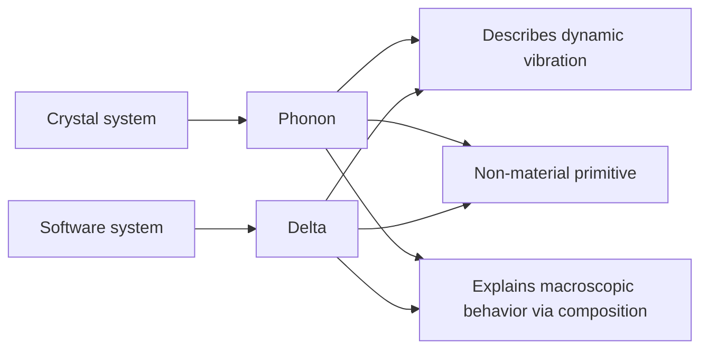

# Why is XLang an innovative programming language?


## I. Why do we need to design the XLang language


XLang is a foundational enabling technology at the bottom of the Nop platform. Formally, it comprises multiple sub-languages including XDef, Xpl, and XScript. Because XLang differs significantly from other single-syntax programming languages, many people encountering it for the first time wonder: Is it truly a programming language? Or is it just a set of scattered extensions layered on top of several existing languages?

Here I want to propose an understanding of the essence of programming languages: A programming language defines a program-structure space; the programming language is the set of construction rules for that space. In other words, the totality of all structures that a programming language can create, together with all feasible evolution paths among those structures, constitute a specific program-structure space in which all feasible computation takes place.

Based on this understanding, XLang qualifies as an innovative programming language because it creates a new program-structure space in which the computational paradigm proposed by Reversible Computation theory—Y = F(X) + Delta—can be implemented with ease. Although XLang can be viewed as encompassing several sub-languages like XDef, XPL, and XScript, it is the whole system that makes Reversible Computation possible. XLang is the first programming language in the world to explicitly define domain structural coordinates in the language and to internally build in generic Delta computation rules.

Currently, most people’s basic understanding of software structural construction is rooted in reductionism: they continuously decompose downward, search for atomic components, and then assemble using these atoms. Although components are virtualized in concept, subconsciously they are regarded as discrete entities truly existing like particles in the material world, with nested compositions constructing the world. But there is another construction mode in the physical world: waves. Waves are continuously existing patterns; they construct the world via interference superposition. XLang’s distinctiveness lies in supporting continuous superposition construction through Delta operations.

### 1.1 Viewing programming languages from the perspective of structure

General-purpose high-level programming languages began with FORTRAN and have undergone long-term development over decades, but they have now reached a certain bottleneck. The fundamentally novel features brought by new languages are fewer and fewer. Most high-level languages have evolved into “multi-paradigm programming,” with syntax features gradually converging and becoming similar: most now support object-oriented structural declarations, functional-style Lambdas, custom annotations for metaprogramming, and async-related syntax and libraries for asynchronous programming.

An interesting question is whether general, abstractable syntax features still exist that possess enough technical value to warrant a new programming language to carry them? XLang’s innovation lies in pointing out that although mainstream programming languages differ widely in surface syntax, they are very similar at the basic structural layer beneath the syntax. Innovation at this structural layer remains promising.

The structure space of programs essentially consists of data + functions; organizing relevant data and functions together forms a custom type, corresponding to classes (Class) or interfaces (Interface) in general programming languages. At the structural level, a class is effectively a Map, where attributes or methods are retrieved by name.

```javascript
type MyClass = {
  name: string,
  myMethod: (arg1:string) => number
}

or

interface MyClass{
  name: string,
  myMethod: (arg1:string) => number
}
```

When we want to derive a new type from an existing custom type, we can use inheritance or Traits.

```javascript
type MySubClass = MyClass & {
  subName: string
}

or

interface MySubClass extends MyClass {
   subName: string
}
```

Conceptually, this is roughly equivalent to the following construction:

```javascript
Map = Map extends Map
```

At the structural level, class inheritance is equivalent to overlaying two Maps by name, where upper-layer elements override lower-layer elements.

In traditional object-oriented languages, inheritance allows reusing a base class. For example, when constructing MapX and MapY, we reuse the base class Map1, i.e., we reuse the lower levels of the inheritance tree.

```javascript
MapX = Map2 extends Map1
MapY = Map3 extends Map1
```

Expressing inheritance via the above structural construction formulas makes many issues very natural and intuitive. For instance, can we swap the relative positions of Map1 and Map2? That is, when constructing MapX and MapY, can we still reuse Map1 but not as the base class, choosing different base classes but using the same Map1 to override them?

```javascript
MapX = Map1 extends Map2
MapY = Map1 extends Map3
```

Interestingly, many object-oriented languages do not support the above operation; object-orientation does not directly support reusing the upper layers of the inheritance tree!

Further thought reveals that traditional object-orientation faces many structural-level issues that are hard to answer. For example, what happens if the inheritance chain contains multiple instances of the same object?

```javascript
MapX = Map1 extends Map2 extends Map1
```

Multiple inheritance in C++ faces severe conceptual difficulties; the essential reason is the structural fusion obstacle that emerges when Map1 is reused via different inheritance paths.

Modern programming languages solve these problems via Traits. For example, in Scala:

```scala
trait Map1 {
  val name: String = "Map1" // same-named property
  def method1(): Unit = {
    println(s"Method 1 from $name")
  }
}

trait Map2 {
  val name: String = "Map2" // same-named property
  def method2(): Unit = {
    println(s"Method 2 from $name")
  }
}

class MapX extends Map1 with Map2 {
}

class MapY extends Map1 with Map3 {
}
```

> In Scala, multiple Traits can define the same-named property; the compiler automatically merges these property definitions, and only one variable exists at runtime. In Java or C++, multiple same-named properties defined in different classes are not automatically merged.

In traditional object-oriented languages, A extends B indicates that derived class A can be more than base class B, but exactly what “more” consists of is not separated in any explicit technical form, making it impossible to directly reuse this extra part (the Delta). Traits explicitly express this Delta. Compared to inheritance, the Traits concept yields a more complete Delta semantics. type MapX = Map1 with Map2 with Map1 is a valid Scala type definition!

To address issues arising from multiple inheritance, Scala introduces a so-called linearization rule, ordering all classes and Traits in the inheritance chain into a linear sequence and stipulating that upper-layer elements override lower-layer elements.

```
MapX -> Map2 -> Map1
```

### 1.2 Generics as Generator

Generics (Generic Type) in Java are only used for type checking; the compiler does not perform special actions based on generic parameters. In C++, however, the situation is entirely different. C++ supports generic programming via templates; the compiler instantiates a template with specific types based on template parameters, generating corresponding specialized code.

At the 1994 C++ standard committee meeting, Erwin Unruh delivered a stunning demonstration. He wrote a template metaprogram capable of determining whether a number is prime at compile time and outputting the prime number in the compiler error message if it is prime. This code became known as the “Unruh prime computation,” a classic in C++ template metaprogramming. Unruh’s demo proved that C++ templates are Turing-complete at compile time, meaning any computation can theoretically be carried out at compile time. This discovery heralded the era of Generative Programming—leveraging compile-time computation to generate code or optimize programs. Template Metaprogramming in C++ became a critical tool for generative programming, enabling complex computations, type deduction, and code generation at compile time to yield better performance and flexibility at runtime.

See [C++ Compile-Time Programming](https://accu.org/journals/overload/32/183/wu/)

From a structural perspective, template metaprogramming can be understood as the following construction formula:

```
Map = Generator<Map> = Map<Map>
```

> A<X,Y> can be understood as A<B>, struct B{ using T1=X; using T2=Y;}
> Note that here Map refers to the structure seen by the compiler at compile time. Every member, whether a property, method, or type declaration, is a Map entry from the compiler’s perspective.
> Even if the compiler manages a parameter list as a List, it can still be regarded as a Map using indices as keys. Interestingly, if managed as an array, it’s typically impossible to introduce more advanced composition mechanisms like inheritance. Conceptually we choose to merge by name rather than index.

At the structural level (the structure visible to the compiler), a template class used as a generator can also be regarded as a Map. Combining this with the delta-ized Traits concept, the strongest form of object-oriented languages at the structural level can be expressed as:

```
Map = Map extends Map<Map>
```

### 1.3 From Map structure to Tree structure

From the compiler’s perspective, classes, template classes, and template parameters can all be treated as Maps, and practically they are typically managed as Maps. As for standalone function definitions and variable definitions, they too belong to some Map: for instance, a module object can be viewed as a Map containing a set of variables, functions, and types defined within the module. Even if they do not belong to any module, standalone functions belong to some implicitly existing global namespace.

> Lisp’s internal structure is List, essentially managing elements by index (the original Lisp had no indices, only car/cdr for stepwise traversal), but modern Lisp variants have long introduced Map-like associative lists, locating sub-elements by name rather than index. Conceptually (ignoring the index-based performance advantages of von Neumann machines), a List can be seen as a special Map using indices as keys.
>
> Lisp’s core invention, S-expressions, can be seen as a general Tree structure, and Lisp provides macros and other built-in mechanisms for operating on these Tree structures. However, Lisp does not establish a delta concept for Trees. XLang can be viewed as a further deepening of Lisp’s general S-expression processing.

The myriad syntactic facilities provided by mainstream programming languages can be viewed as rules for continuously constructing new Maps within a Map-based structural space. XLang innovates by extending Maps into Trees and rethinking software structural construction on Tree structures, generalizing the construction formula:

```
Tree = Tree x-extends Tree<Tree>
```

> If Map extends to Tree, then the extends operation between Maps also needs to be extended to the x-extends operation on Tree structures.

Clearly, Map is a special case of Tree. Each node in a Tree can be seen as a Map: Tree = Map + Nested. Therefore, the above formula indeed generalizes Map extends Map<Map>. But from another angle, Tree structures can be constructed by nested composition of multiple Maps; Map is more basic and fine-grained. Is it necessary to emphasize Tree? Can’t all operations on a Tree be decomposed into per-level Map operations?

XLang’s answer is: The software-structure space built upon more complex Tree structures (and the construction rules in that space) cannot simply be subsumed by the Map-based software-structure space. That is, we have a situation where the whole is greater than the sum of its parts; the holistic construction rules for Trees lose key information when decomposed into construction rules for Maps.

To truly understand XLang’s innovation, we must understand the next-generation software construction theory behind XLang’s design: Reversible Computation. Reversible Computation explicitly introduces the concepts of inverse elements and Delta, points out that the total (A) is a special case of Delta (A = 0 + A), and calls for rebuilding all understandings of the software world on the concept of Delta (including inverse elements). Reversible Computation proposes a general, Turing-complete software construction formula:

```
 App = Delta x-extends Generator<DSL>
```

XLang is the concrete implementation of this technical strategy at the programming language level.

For an introduction to Reversible Computation theory, see my WeChat articles:

1. [Reversible Computation: The next-generation software construction theory](https://mp.weixin.qq.com/s/CwCQgYqQZxYmlZcfXEWlgA)
2. [A programmer’s analysis of Reversible Computation](https://mp.weixin.qq.com/s/aT99VX6ecmZXdemBPnBcoQ)
3. [Addendum: A programmer’s analysis of Reversible Computation](https://mp.weixin.qq.com/s/zGfo7pvKjOCa11PYLJHzzA)
4. [A programmer’s analysis of the Delta concept, with Git and Docker as examples](https://mp.weixin.qq.com/s/D5bDNkMJ9gYrFb0uDj2EzQ)

According to Reversible Computation theory, the special nature of Tree structures is that they correspond to a global coordinate system: every node and property in the tree has a unique xpath.

```
/tasks/task[name='test']/@name
```

The above xpath indicates the name attribute of the child node under tasks whose name is test.

First, let’s clarify the function of a coordinate system: each value of interest at the business level has a unique coordinate in the coordinate system, enabling precise read and modification by coordinate.

```
value = get(path);
set(path,value);
```

The problem with Map structures is that they only provide two levels of coordinates: the first level locates the Map, and the second level locates an attribute or method within the Map. But this simple coordinate system fails to accomplish precise distinctions at the business level. For example:

```java
class Dialog{
    String title;
    List<Button> actions;
    List<Component> body;
}
```

A Dialog object has a set of action buttons. If we want to locate the [submit] button and change its label property to [OK], there is no convenient, intuitive positioning tool in existing programming languages. If we only want to customize a Dialog used in a certain scenario (e.g., adding a property), AOP (Aspect Oriented Programming) mechanisms provided by typical programming languages cannot do it either, because AOP’s positioning system is type-based. In XLang, we can directly use the following description:

```xml
<dialog>
   <actions>
      <button name="submit" label="OK" />
   </actionss>
</dialog>
```

Current programming language research generally focuses on type systems. The reason to study types is that different objects can share the same type, making type-level study simpler without touching object lifecycle issues. This leads to type systems not being qualified coordinate systems: objects of the same type cannot be distinguished in the type-system coordinate space, and thus fine-grained Delta construction cannot be built on it.

Some may wonder: why Tree, not graph? On a graph, if we choose a primary orientation of observation and fix a node as the root, we can naturally convert a graph structure into a tree structure. For example, in Linux, “everything is a file,” and many logical relationships are expressed via the file tree; but using filesystem links, graphs can be represented. In essence, trees arise because we select a direction of observation on a graph.

For example, flowcharts expressed in XML can define node id references: <step nextTo="nextStepId" />

Tree structures unify relative and absolute coordinates: there is a unique path from the root to any node, serving as the node’s absolute coordinate. Meanwhile, within a subtree, each node has a unique path relative to the subtree, serving as its relative coordinate. Given the node’s relative coordinate and the subtree root’s absolute coordinate, it’s easy to compute the node’s absolute coordinate—just concatenate them.

### 1.4 An extensible design necessarily requires a software structural coordinate system

In software development, extensibility refers to meeting new requirements or implementing new functions without modifying the original code, by adding extra code or differential information. In purely abstract mathematical terms, software extensionality corresponds to:

```
  Y = X + Delta
```

- X corresponds to the foundation code we have already written; it does not change with requirement changes.
- Delta corresponds to additional configuration information or differential code.

From this perspective, research on extensibility is equivalent to research on the definition and algebraic relationships of the Delta.

```
X = A + B + C
Y = (A + dA) + (B + dB) + (C + dC)  // Delta is everywhere
   = (A + B + C) + (dA + dB + dC)  // Deltas can be aggregated independently of the base code
   = X + Delta // Delta satisfies associativity; it can be merged independently of the base
```

Assume X consists of A, B, C and other parts. Requirement changes produce variations scattered across the system. If we demand that all these fragmented modifications can be managed and stored independently of the original system’s source code (independence of Delta), and that smaller Deltas can be composed into larger Deltas (composability of Delta), then a coordinate system for precise positioning is inevitably needed. Specifically, once dA is separated from A and stored in an independent Delta, it must retain some position coordinate so that when Delta is combined with X, it can find the original structure A and combine with it.

### 1.5 Differences between Delta, Patch, and plugin mechanisms

First, note that Git’s Patch and branch management do not satisfy Delta’s independence and composability. A Patch is always bound to a particular base code version; without knowing the base, one cannot merge multiple patches into a larger patch. See [A programmer’s analysis of the Delta concept, with Git and Docker as examples](https://mp.weixin.qq.com/s/D5bDNkMJ9gYrFb0uDj2EzQ) for detailed analysis.

Second, Delta differs fundamentally from traditional extension points and plugin mechanisms in programming.

```
X = A + B + C
Y = A + B + D
  = X + (-C) + D
  = X + Delta
```

Delta is not just adding content to a system. If we aim for coarse-grained, system-level reuse, the corresponding Delta must contain the semantics of reduction (e.g., we need to remove a Bean defined in the base product). In fact, a coarse-grained Delta is always a mixture of addition and subtraction.

Also note: the plugin mechanism supports only a small number of predetermined extension points. We cannot customize the original system’s functionality via plugins beyond the original design. Delta is different: as long as there is a global structural coordinate system, Delta can be introduced at any point in that coordinate system. Kustomize in k8s uses Delta to support comprehensive customization and can be seen as a concrete application of Reversible Computation theory. See [Kustomize from the perspective of Reversible Computation](https://mp.weixin.qq.com/s/48LWMYjEoRr3dT_HSHP0jQ)

> The black-box model of components is akin to the worldview of Newtonian mechanics taught in high school: it is entirely mechanical. The motion of a rigid body is fully described by a handful of parameters like mass center coordinates, size, shape, and orientation; its internal construction is unobservable and irrelevant. Rigid bodies interact through direct contact; shapes must match precisely to form a seamless whole. Even in classical mechanics, more advanced viewpoints switch to Lagrangian or Hamiltonian formulations, whose essence is a turn toward the field-theoretic worldview. A field (Field) is essentially an omnipresent coordinate system in which a physical quantity can be specified at every point. A field’s degrees of freedom are infinite, but thanks to the coordinate system it is describable, definable, and researchable; at every coordinate point we can precisely measure local change. In the field worldview, our core picture is objects immersed in the field (an omnipresent coordinate system), rather than isolated pairwise interactions of objects.

### 1.6 Stable domain structural coordinate systems

Mainstream programming languages are general-purpose and do not embed domain knowledge of any particular business field. Therefore, the built-in structural coordinate system is limited to the language’s classes and methods—a two-level structure—at most with an annotation mechanism providing some domain-oriented refinements. Below the method level, suitable techniques for defining coordinates are generally lacking.

When business requirements change, multiple places in the code often change accordingly. Essentially this is because the structural mapping from problem space to solution space is nontrivial under general business circumstances, such that the two modes of description cannot align effectively. Borrowing parlance from AI, we might say: useful features are distributed.

> In physics, the same physical fact can be described in countless coordinate systems, but there may be a special coordinate system tailored for the specific problem—a so-called intrinsic coordinate system. Descriptions in this coordinate system can highlight core physical meanings and simplify relevant descriptions. For example, phenomena occurring on a sphere can certainly be described in a general 3D Cartesian coordinate system, but spherical coordinates often yield simplification.

Reversible Computation theory suggests establishing a domain-specific DSL language for a specific business domain. Using the DSL, we naturally build a domain coordinate system, and then express Deltas in the delta structural space defined by this coordinate system. Because this domain coordinate system is tailored for the domain problems, it can often minimize the Delta description. For example, when a business-level change adds a field, using a general-purpose language may require changes in many places—frontend, backend, and database. But using a domain model description, that change may only be a local, field-level change, and the underlying engine framework automatically translates the domain description into executable logic.

XLang’s core function is quickly defining multiple DSL languages and using them as domain structural coordinate systems to implement Delta definition and generation/transformation of delta structures.

XLang’s essential difference from other languages is that it is based on Reversible Computation theory and is oriented toward DSL development. General languages target application development directly—modeling business and implementing business logic with the language itself. With XLang, we first build one or more DSLs, then use DSLs to describe the business. XLang makes the cost of developing a DSL extremely low: in the simplest case, it only requires defining an XDef meta-model file with the XDef language to automatically obtain the new DSL’s parser, validator, IDE plugin, visual editor, etc.—with full tooling support such as syntax hints, breakpoint debugging, and visual editing.

> JetBrains has a product called MPS (Meta Programming System), which also supports DSL-first, then use DSLs to describe business. MPS is built upon its own base language mechanism. The Nop platform is a low-code development platform similar to MPS, and its foundation is precisely XLang. However, Nop’s guiding theory is Reversible Computation, making its technical route and guiding philosophy fundamentally different from MPS.
> Despite that, the technical development goals are similar.

## II. XLang’s concrete syntax design

XLang is a language oriented toward Tree structures. Its syntax components can be compared to SQL, which is oriented toward tabular structures.

| SQL language                       | XLang language                                   |
| ---------------------------------- | ------------------------------------------------ |
| DDL (data definition language)     | XDef meta-model definition syntax                |
| Non-redundant tabular data         | Non-redundant tree-structured information: XNode |
| On-the-fly computation on normalized data: SQL Select | Runtime and compile-time computation on general XNode data: Xpl/XTransform |
| Tabular merge and diff: Union/Minus | Delta computation on Trees: x-extends/x-diff     |
| Extend SQL via functions and stored procedures | Extend XLang via Xpl tag libraries and XScript   |

First, note that XLang targets Tree structures, so a very natural syntax carrier is XML; XLang files are typically valid XML files. But this is not the only option. Traditional programming languages put strong emphasis on syntax form, whereas XLang—grounded in Reversible Computation theory—emphasizes that syntax form is not important. Different syntax forms are merely different presentations of the same information, and information-equivalent representations can be reversibly transformed. XLang can use any syntax capable of directly expressing tree structures, such as JSON or YAML. Lisp’s S-expressions, augmented with some extended attributes, can also serve as an XLang syntax carrier.

> The Nop platform also implements a bidirectional mapping between Tree structures and Excel files, allowing DSL model objects to be expressed in Excel without any Excel parsing or generation code. For example, app.orm.xlsx can express the ORM DSL, equivalent to app.orm.xml.

### 2.1 XDSL’s basic syntax structure

XLang itself is Turing-complete, but it is designed primarily as a meta-language for quickly developing new DSLs rather than as a general-purpose programming language. That is, while XLang can be used as a glue language, it is used more to develop DSLs embedded in the Java environment.

All XLang-based DSLs share some common syntax structures; collectively, they are called XDSL.

```xml
<state-machine x:schema="/nop/schema/state-machine.xdef"
     x:extends="base.state-machine.xml">
    <x:gen-extends>
       <app:GenStateMachineDelta1/>
       <app:GenStateMachineDelta2/>
    </x:gen-extends>

    <x:post-extends>
       <app:PostProcessGeneratedModel />
    </x:post-extends>

    <!-- x:override=remove indicates that this node is removed from the final merge result -->
    <state id="commit" x:override="remove" />

    <on-exit>
       <c:if test="${abc}">
           <c:log info="${xyz}" />
        </c:if>
    </on-exit>
</state-machine>
```

Referring to the example above, all XDSLs support the following syntax:

1. x:schema imports the XDef meta-model—similar to JSON Schema—to constrain the DSL’s syntax structure.

2. x:extends indicates inheritance from an existing DSL file, merging the two DSL models layer-by-layer following Tree structure.

3. x:override specifies how two corresponding nodes are merged when executing x:extends; x:override=remove indicates deletion semantics.

4. x:gen-extends uses the Xpl template language to dynamically generate multiple Tree nodes and merges them sequentially according to the Delta algorithm.

5. x:post-extends also uses the Xpl template language to dynamically generate multiple Tree nodes, but its execution timing differs from x:gen-extends.

6. If a DSL needs to embed script code, it can directly use the Xpl template language, such as the on-exit callback.

```xml
<model x:extends="A,B">
   <x:gen-extends>
      <C/>
      <D/>
   </x:gen-extends>
   <x:post-extends>
      <E/>
      <F/>
   </x:post-extends>
</model>
```

The complete merge order is:

```
F -> E -> Model -> D -> C -> B -> A
```

Any XML or JSON file format can incorporate the XLang Delta operations syntax above. For example, we introduced the following decomposition scheme for AMIS (Baidu’s open-source JSON format frontend UI definition language):

```yaml
x:gen-extends: |
   <web:GenPage view="NopSysCheckerRecord.view.xml" page="main"
        xpl:lib="/nop/web/xlib/web.xlib" />

body:
   x:extends: add-form.page.yaml
   title: Override the existing title defined in add-form.page.yaml
```

AMIS’s JSON format itself does not provide decomposition or merging mechanisms, resulting in large, hard-to-maintain JSON files for a complete application. By introducing x:gen-extends, base page structures can be automatically generated based on View models; inside a page, x:extends can bring in existing files.

XLang has built-in support for Reversible Computation, i.e., the computation pattern App = Delta x-exends Generator<DSL>. x:gen-extends and x:post-extends correspond to Generator; they are metaprogramming mechanisms that generate model nodes at compile time as built-in code generators. The x:extends syntax merges two model nodes.

For further information, see [XDSL: A general design for domain-specific languages](https://zhuanlan.zhihu.com/p/612512300)

Nop—the next-generation low-code platform—has already defined multiple DSLs, such as Workflow, Rule, ORM, BeanDefinition, Batch, and Record for binary messages. Generally, a custom DSL does not need a dedicated runtime engine; using XLang’s metaprogramming, a custom DSL can be compiled to an existing DSL or multiple DSLs can be seamlessly integrated to form a new DSL. See [Why SpringBatch is a poor design](https://mp.weixin.qq.com/s/1F2Mkz99ihiw3_juYXrTFw) for the DSL forest solution.

### 2.2 XDef meta-model definition language

XML has a range of international standards like XSD (XML Schema Definition) and XSLT (Extensible Stylesheet Language), but these standards assume, like DOM, that they handle text structures with all attributes as strings, making them inapplicable to general Tree structure processing.

XLang introduces the XDef meta-model definition language to replace XSD. XDef is much simpler and more intuitive than XSD while providing stronger structural constraints.

```xml
<state-machine x:schema="/nop/schema/xdef.xdef">
   <state id="!var-name" displayName="string" xdef:unique-attr="id" />
   <on-exit xdef:value="xpl" />
</state-machine>
```

Unlike XSD or JSON Schema, XDef follows a homomorphic design: the meta-model definition structure nearly mirrors the XML format it constrains, replacing attribute values with type declarations. For example:

- id="!var-name" indicates that the id attribute follows the var-name format—no special characters and cannot start with a digit; ! indicates that the attribute value cannot be empty.

- <on-exit xdef:value="xpl"/> indicates the content of on-exit is Xpl template language; reading the model file will automatically parse it into an IEvalAction executable function.

- xdef:unique-attr="id" indicates that the current node can occur multiple times, forming a list whose elements are uniquely identified by the id attribute.

Notably, XDef itself is defined by xdef.xdef. In other words, state-machine.xml is a DSL whose syntax structure is defined by the meta-model state-machine.xdef; then state-machine.xdef declares x:schema='/nop/schema/xdef.xdef', indicating that this meta-model file is constrained by xdef.xdef; ultimately xdef.xdef is constrained by xdef.xdef itself, completing the loop.

All XDSLs share the XDSL syntax defined by the meta-model xdsl.xdef. The IDEA plugin automatically recognizes x:extends and x:gen-extends according to xdsl.xdef’s definitions, enabling features such as syntax hints and file navigation.

### 2.3 Xpl template language

XLang needs a template language for compile-time code generation, but instead of common template languages like Velocity or FreeMarker, it designs a new one—Xpl.

Xpl is Turing-complete and provides syntax nodes such as c:for, c:if, c:choose, c:break, and c:continue.

```xml
<c:for var="num" items="${numbers}">
    <!-- Check whether the number is 7 -->
    <c:if test="${num == 7}">
        <p>Encountered 7, stop iteration.</p>
        <c:break /> <!-- Break the loop -->
    </c:if>

    <!-- Use c:choose to test parity -->
    <c:choose>
        <when test="${num % 2 == 0}">
            <p>${num} is even.</p>
        </when>
        <otherwise>
            <p>${num} is odd.</p>
        </otherwise>
    </c:choose>
</c:for>
```

Xpl templates use ${expr} to embed XScript expressions; additionally, Xpl provides a dedicated c:script node to execute XScript statements.

```xml
<c:script>
  import my.MyDSLParser;
  let model = new MyDSLParser().parseFromNode(path);
</c:script>
```

XScript’s syntax resembles JavaScript but adds some extensions. For example, import statements can bring in Java classes.

#### Mutual embedding of XML template language and expression syntax

XLang does not use JSX-style syntax. It retains XML syntax and extends JavaScript’s template expression syntax.

```javascript
let resut = xpl `<my:MyTag a='${data}' />`
const y = result + 3;
```

Equivalent to:

```xml
<my:MyTag a='${data}' xpl:return="result" />
<c:script>
  const y = result + 3;
</c:script>
```

XLang modifies JavaScript’s parsing for template expressions so that the content between backticks is recognized as a string to be parsed at compile time rather than a list of Expressions. This enables XLang to extend support to more DSL formats by leveraging this syntax, for example, introducing C#-like LINQ syntax:

```javascript
const result = linq `select sum(amount) from myList where status > ${status}`
```

#### Multiple output modes

Unlike typical template languages, Xpl specifically optimizes for compile-time code generation. Conventional templates directly output text; in code generation, this loses the original code positions, requiring a SourceMap mechanism to record mapping between generated code and original code. Xpl’s approach is different: it introduces multiple output modes. For compile-time code generation, outputMode=node is used, meaning the output is XNode nodes rather than raw text.

```java
class XNode{
    SourceLocation loc;
    String tagName;
    Map<String, ValueWithLocation> attributes;
    List<XNode> children;
    ValueWithLocation content;

    XNode parent;
}

class ValueWithLocation{
    SourceLocation location;
    Object value;
}
```

XNode captures source locations for attributes and nodes and changes attribute and content value types to Object. This overcomes XML’s original limitation of targeting text documents only, enabling more efficient expression of complex business object structures.

### 2.4 Extensible syntax

Similar to Lisp, XLang can extend syntax via macro functions and tag functions. New syntax nodes can be introduced via <c:lib>, and then structural transformations implemented within them through macro functions and other mechanisms.

```xml
<c:lib from="/nop/core/xlib/biz.xlib" />
<biz:Validator fatalSeverity="100"
               obj="${entity}">

    <check id="checkTransferCode" errorCode="test.not-transfer-code"
           errorDescription="Scanned code is not a transfer code">
        <eq name="entity.flowMode" value="1"/>
    </check>
</biz:Validator>
```

<biz:Validator> introduces a validation DSL; at compile time, the Validator tag is parsed using macro mechanisms and translated into XLang expressions for execution.

## III. XLang application example: A delta-based component model

All software practices involving the Delta concept can follow the technical route of Reversible Computation. In many cases, XLang can be directly used to implement Delta merge and decomposition, completely avoiding introducing Delta concepts into the runtime engine and simplifying runtime implementations. Here is an example in the component model of a front-end low-code/no-code platform.

In front-end no-code/low-code platforms, functionality essentially consists of nesting components via visual interfaces. But component encapsulation often proves difficult in practice: the encapsulated component fails to precisely meet needs, yet writing a new component from scratch is too costly. The UIOTOS no-code platform proposes a page inheritance approach.


Specifically, UIOTOS can import an existing page as a base page and then override lower-level page attributes from the upper layer. See [UIOTOS documentation](https://www.yuque.com/liuhuo-nc809/uiotos/fa6vnvggwl9ubpwg#rsHSa) for details.

To implement this feature, UIOTOS performs extensive special-purpose design and introduces a lot of code in the runtime engine for attribute inheritance. If we base it on XLang, Delta computation can be completely compressed to compile time: the runtime engine only needs to know ordinary component structures, without any knowledge of Delta decomposition or merging.

```xml
<component x:schema="component.xdef">
  <import from="comp:MyComponent/1.0.0"/>

  <component name="MyComponent" x:extends="comp:MyComponent/1.0.0">
    <state>
      <a>1</a>
    </state>
    <props>
      <prop name="a" x:override="remove"/>
      <prop name="b"/>
    </props>

    <component name="SubComponent" x:extends="ss">
      <prop name="ss"/>
    </component>

    <template x:override="merge">
      Here, you can show only the Delta modifications

      <form x:extends="a.form.xml">
        <actions>
          <action name="ss" x:id="ss"/>
        </actions>
      </form>
    </template>
  </component>

  <template>
    <MyComponent/>
    <MyComponentEx/>
  </template>
</component>
```

- A component’s template section expresses how to compose child components.
- When using child components, they can be imported via import or defined locally via component.
- If the Component model is implemented as an XLang XDSL, x:extends can be used to perform Delta customization based on existing components. No special design like UIOTOS is needed; x:extends alone achieves deltaized component definitions.
- A local component can itself contain local subcomponents, and they too can be customized. Delta customization can modify the entire component tree, not merely a component class’s attributes or methods.
- Delta merging requires every node to have a unique coordinate. If a DSL node lacks an available id or name attribute, you can use XLang’s built-in x:id extended attribute; these are automatically removed after Delta merging and therefore do not affect the DSL runtime engine.
- x:extends is executed when the model is loaded. When passed into the runtime engine, all attributes in the x namespace have been processed and automatically removed. Thus the runtime engine does not need any knowledge of x:extends, a strong contrast with UIOTOS’s approach: Delta can be implemented once and for all by a generic engine rather than introducing delta handling mechanisms for each specific requirement.
- The extended virtual file path comp:MyComponent/1.0.0 references a component; when loaded via the virtual filesystem, tenant isolation and version-upgrade isolation are automatically realized.

For a complete explanation, see the Bilibili video [A discussion with the UIOTOS author and the design of a front-end low-code platform that supports the Delta concept](https://www.bilibili.com/video/BV1ask2YhEfp/).

With XLang, implementing Delta components requires essentially no extra work, and the approach can be extended to all DSL models needing Delta editing. For example, some introduce a similar component model into backend service application development.

The low-code platform NopPlatform, designed based on Reversible Computation theory, is open-source:

- gitee: [canonical-entropy/nop-entropy](https://gitee.com/canonical-entropy/nop-entropy)
- github: [entropy-cloud/nop-entropy](https://github.com/entropy-cloud/nop-entropy)
- development example: [docs/tutorial/tutorial.md](https://gitee.com/canonical-entropy/nop-entropy/blob/master/docs/tutorial/tutorial.md)
- [Principles of Reversible Computation and an introduction to the Nop platform with Q&A on Bilibili](https://www.bilibili.com/video/BV14u411T715/)


# Q&A on “Why XLang is an innovative programming language”

In my previous article [Why XLang is an innovative programming language](https://mp.weixin.qq.com/s/O4VeA7Dw8cRF7HTHxi6pNw), I introduced the design philosophy of XLang and noted that XLang is innovative because it creates a new program-structure space in which the computational paradigm Y = F(X) + Delta proposed by Reversible Computation theory can be implemented easily. This article provides further explanations addressing feedback questions.

## 1. How can Delta computation be compressed into compile-time with XLang?

> To implement attribute inheritance, UIOTOS performs extensive special-purpose design and introduces a lot of runtime code for attribute inheritance. If based on XLang, Delta computation can be entirely compressed into compile time, while the runtime engine only needs to know ordinary component structures without any knowledge of Delta decomposition or merging.


UIOTOS is a no-code platform for the IoT domain. It introduces a container component in which existing pages can be applied and then overridden using an attribute mechanism to achieve flexible customization without re-implementing the page.

```json
{
  type: "container",
  baseUrl: "a.page.json",
  overrideProps: {
    "form/title": "sss",
    "actions/0/label": "vvv"
  }
}
```

The basic scheme is roughly as above. Essentially a page object is introduced via baseUrl, and multiple inheritance attributes override the page object’s contents. With a JsonPath-like syntax, any nested content within the page object can be modified—unlike typical component frameworks where you call a component and pass parameters.

UIOTOS writes considerable code for attribute inheritance in the front-end runtime framework and requires a special container control. A limitation of UIOTOS’s scheme is that it can only override existing attribute values in pages and cannot change the inherited page’s structure. Another low-code platform employs a similar approach without introducing a special container component; any component can be delta-customized. Concretely, this scheme introduces a special overwrite attribute within the component:

```json
{
  "component": "MyComponent",
  "version" : "1.0",
  "properties": {
     "a": 1, // directly set component properties
   },
   "overwrite": [
    "Here, record design-time edit operations performed in the visual editor"
 ]
}
```

The basic operation mode is that after dragging a component into the editor, if certain details need to be adjusted, the component customization mode can be entered and fine-tuning performed in the visual designer. The edit operations during the adjustments are automatically recorded as overwrite in the page file. This approach allows arbitrary adjustments to component structures and is more adaptable than UIOTOS’s, but recorded operation sequences are relatively verbose, and merging multiple operations into a final simplified result is difficult (i.e., no simplification via associativity).

> According to Reversible Computation theory, A=0+A; the total is a special case of Delta. We can use a unified form to define both full values and Delta, such that the Delta of a Delta is still an ordinary Delta, enabling more complex logical reasoning. Expressing Delta as overwrite actions is not appropriate.

Whether using the scheme above or others, both the editor and front-end runtime framework need to incorporate Delta-related code. If we use XLang to express the underlying model, Delta computation can be entirely compressed into compile time; the runtime engine only needs to know ordinary component structures. Specifically, use x:extends to implement component inheritance:

```xml
<component x:schema="component.xdef">
  <import from="comp:MyComponent/1.0.0"/>

  <component name="MyComponentEx" x:extends="comp:MyComponent/1.0.0">
    <props>
      <prop name="a" x:override="remove"/>
      <prop name="b"/>
    </props>

    <template x:override="merge">
      Here, you can show only the Delta modifications

      <form x:extends="a.form.xml">
        <actions>
          <action name="ss" x:id="ss"/>
        </actions>
      </form>
    </template>
  </component>

  <template>
    <MyComponent/>
    <MyComponentEx/>
  </template>
</component>
```

If no customization is needed, import the component and use it directly. If customization is needed, enable local component definitions and use x:extends to inherit existing components. XLang defines delta merging algorithms between Tree structures; during loading with a unified DslNodeLoader, this algorithm automatically executes. Pseudocode:

```javascript
 function loadDeltaModel(path){
    rootNode = VirtualFileSystem.loadXml(path);
    for each node with x:extends attribute  // recursively traverse rootNode and its children
        baseNode = loadDeltaNode(node.removeAttr('x:extends'));
        genNodes = processGenExtends(node);

        for each genNode in genNodes
            baseNode = new DeltaMerger().merge(baseNode, genNode);
        node = new DeltaMerger().merge(baseNode,node);

    processPostExtends(node);
    return node;
 }
```

DslNodeLoader.loadDeltaModel("comp:MyComponent/1.0.0") returns the final merged XNode, which no longer contains any attributes or child nodes in the x namespace.

The Loader can be regarded as a just-in-time compiler; the structural transformations performed when loading a model file are part of the compilation process.

### Delta operations defined at the structure layer rather than the object layer

> Wittgenstein said that the limits of my language mean the limits of my world. Reversible Computation deepens this: a programming language defines a software-structure space, and all reuse mechanisms that construct new structures from existing ones constitute the transformation rules within that space.

A truly practical DSL must address extensibility and embed decomposition, merging, and reuse mechanisms. Most DSL designers today habitually introduce these structural operations at the semantic object layer, resulting in ad hoc designs lacking generality and internal consistency.

XLang provides a standardized approach that solves the extensibility problem once and for all for all DSLs. DSL engines then focus solely on minimal runtime concerns. XLang operates only at compile time (model parsing and loading); nothing XLang-related exists at runtime. The key is that XLang implements Delta merging at the structural XNode layer rather than at the semantic object layer. The structure layer is akin to Lisp’s S-expressions and has no intrinsic semantics. Detaching from semantics is a sign of the generality of Delta merging.

For example, Spring’s beans.xml can be viewed as a DSL in the component assembly domain. Spring 1.0 introduced a parent attribute to realize a form of inheritance and an import syntax to achieve complex file decomposition and reuse. Spring 2.0 introduced custom namespaces to simplify configuration of complex Bean structures. Spring Boot introduced @ConditionalOnProperty so that bean creation can be toggled via configuration flags. Implementing these all requires special-purpose code in the Spring core.

```xml
<beans xmlns="http://www.springframework.org/schema/beans"
       xmlns:xsi="http://www.w3.org/2001/XMLSchema-instance"
       xmlns:myns="http://www.example.com/schema/myns"
       xsi:schemaLocation="http://www.springframework.org/schema/beans
           http://www.springframework.org/schema/beans/spring-beans.xsd
           http://www.example.com/schema/myns
           http://www.example.com/schema/myns/myns.xsd">

    <import resource="classpath:config/services.beans.xml"/>

    <!-- Parent Bean -->
    <bean id="parentBean" class="com.example.ParentClass">
        <property name="commonProperty" value="commonValue"/>
    </bean>

    <!-- Child Bean, inherits parentBean configuration -->
    <bean id="childBean" parent="parentBean">
        <property name="extProp" value="extValue"/>
    </bean>

     <!-- Configure Bean using a custom namespace -->
    <myns:customBean id="customBean" customProperty="customValue"/>
</beans>
```

```java
@Component
@ConditionalOnProperty(name = "mycomponent.enabled", havingValue = "true", matchIfMissing = false)
public class MyComponent {

    public MyComponent() {
        System.out.println("MyComponent is initialized!");
    }

    public void doSomething() {
        System.out.println("MyComponent is doing something!");
    }
}
```

With XLang, these functions require no development:

```xml
<beans x:extends="config/base.beans.ml">
   <x:gen-extends>
     <c:include src="config/services.beans.xml" />

     <beans>
        <myns:customBean id="customBean" customProperty="customValue"
                      xpl:lib="/example/myns.xlib" />
     </beans>
   </x:gen-extends>

   <bean id="parentBean" class="com.example.ParentClass">
        <property name="commonProperty" value="commonValue"/>
   </bean>

   <bean id="childBean" x:prototype="parentBean">
        <property name="extProp" value="extValue"/>
   </bean>

   <bean id="myComponent" class="com.example.MyComponent"
         feature:on="mycomponent.enabled">
       <property name="propA" ref="xxx" feature:on="mycomponent.xxx.enabled" />
   </bean>
</beans>
```

- First, note that without any extensibility mechanisms, Spring 1.0’s bean definition is a complete component assembly model: any bean that can be assembled via get/set functions and a constructor can be declaratively configured using beans.xml. Mathematically, Spring 1.0 defines a complete set of assembly operations.

- XLang’s approach introduces a set of Delta operations on top of the existing DSL; the result of these operations is to fold DSL + Delta structures back into the original DSL structure. Interestingly, Spring 2.0’s custom namespace cannot be reduced back to the 1.0 syntax, i.e., beans configured with Spring 2.0 syntax cannot be guaranteed to be configurable using Spring 1.0 syntax—even though Spring 1.0 syntax constitutes a complete set of operations. Spring 2.0’s custom namespace (e.g., <myns:customBean>) triggers a NamespaceHandler in Java, whose runtime logic can be arbitrarily complex, and may even implicitly introduce order dependencies (bean declaration order affecting assembly results), in effect undermining Spring 1.0’s declarative POJO assembly design.

- x:extends can inherit existing DSL files, similar in function to Spring 1.0’s import syntax.

- x:gen-extends uses the Xpl template language to dynamically generate bean definitions. With Xpl’s built-in c:include, external XNode nodes can be pulled in, again substituting Spring 1.0’s import.

- x:gen-extends can simulate Spring 2.0’s custom namespace mechanism via Xpl custom tags. Unlike Spring’s handler-based runtime logic, Xpl tag functions are code generation: no matter how complex a tag function’s execution logic is, its job is to produce the desired bean configuration. For example, <myns:customBean> may generate multiple bean definitions. What actually matters at runtime is the generation result. x:gen-extends itself runs at compile time.

```xml
 <myns:customBean id="customBean" customProperty="customValue"
                      xpl:lib="/example/myns.xlib" />

Expands to the following two Beans:

<bean id="customBean" class="com.example.CustomBean">
    <property name="customProperty" value="customValue" />
    <property name="otherProperty" ref="otherBean" />
</bean>

<bean id="otherBean" class="com.example.OtherBean" />
```

- In XLang, sibling nodes can specify inheritance via x:prototype. This substitutes for Spring 1.0’s parent attribute. At the same time, x:override allows fine-grained control of merging when nodes merge—whether to override, merge, or delete, etc. Crucially, XLang’s mechanism can be used at any node. For instance, a property can specify x:prototype to inherit another property’s configuration. In contrast, Spring’s parent attribute only applies to bean inheritance.

- In XLang, every node can be conditionally loaded via feature:on and feature:off switches. When a feature switch is not satisfied, the corresponding node is removed and does not enter runtime at all. This replaces Spring Boot’s conditional beans. Likewise, feature switches can be used at any node, such as controlling whether to configure a particular property. In Spring Boot, conditional switches only affect bean creation—no declarative mechanism controls the configuration of a property.

In summary, the Spring framework builds many mechanisms to improve extensibility, each requiring special-purpose design for the component assembly domain and for the Spring framework in particular. Migrating to another runtime, these mechanisms must be reimplemented. For example, Quarkus also supports bean assembly definitions; it must implement all these extension schemes itself. And even after Spring is done, frameworks like Hibernate cannot leverage these to implement their own extensions.

XLang’s key is to parse XML/JSON into XNodes and finish Delta operations at the XNode level, not after converting XNodes into strongly typed BeanDefinitions. Therefore, these capabilities are automatically applicable to other DSLs—e.g., MyBatis mapper files and Hibernate hbm files.

Similar extensibility issues exist in many domains. For example, Facebook’s GraphQL introduces type extension syntax:

```graphql
type User {
  id: ID!
  name: String!
  email: String!
}

extend type User {
  age: Int
  email: String @deprecated(reason: "Use 'contactEmail' instead")
  contactEmail: String!
}
```

In graphql-java, GraphQL definitions are first parsed into TypeDefinition and TypeExtensionDefinition and then merged at the object layer.

Under XLang’s technical system, the NopGraphQL framework uses the XMeta metadata model to define types, so it can use XLang’s built-in XNode-level Delta mechanisms for extension—no special TypeExtension syntax is needed. At runtime in NopGraphQL, no knowledge of type extension is necessary: a type is just a type; there is no type + type extension situation.

### Loader as Generator

In XLang’s technical system, the Loader abstraction has a special status. In principle, all Reversible Computation-related content is implemented within the Loader abstraction. Therefore, integrating XLang with third-party frameworks is extremely simple: replace the DSL’s existing Loader with XLang’s Delta Loader.

A general-purpose model loader can be viewed as having the following type definition:

```
Loader :: Path -> Model
```

In general designs, we must realize that writing code is not only about meeting current demands but also about future changes—about the system’s evolution in space and time. In other words, programming is not facing the current, unique world but all possible worlds. Formally, we can introduce a Possible operator to describe this.

```
Loader :: Possible Path -> Possible Model
Possible Path = deltaPath + stdPath
```

stdPath is the standard path corresponding to the model file; deltaPath is the Delta customization path used to customize an existing model file. For example, the base product includes a business workflow main.wf.xml; when customizing for Customer A, we need a different workflow but do not want to modify base product code. In this case, we can add a Delta model file /_delta/a/main.wf.xml, indicating the main.wf.xml customized for customer A. The Loader automatically detects and uses this file so that all existing business code requires no modification.

If we only want to tweak the original model rather than replace it entirely, we can use x:extends to inherit the original model. Mathematically, XLang’s DeltaLoader execution logic can be expressed by:

```
Loader<Possible Path> = Loader<deltaPath + stdPath>
                      = Loader<deltaPath> x-extends Loader<stdPath>
                      = DeltaModel x-extends Model
                      = Possible Model
```

It’s important to emphasize that the Loader abstraction has extensive application scenarios; many extensibility-related features can be uniformly pushed down to the Loader layer—for example, multi-tenant customization can be solved by a Loader that recognizes tenant parameters. For further information, see [Low-code platform design from the viewpoint of tensor product](https://mp.weixin.qq.com/s/BFCTN73pH8ZZID3Dukhx3Q)

## 2. How to understand XLang’s analogy between delta superposition and waves?

> The physical world has another construction mode: waves. Waves are continuously existing patterns and construct the world via interference superposition. XLang’s distinctiveness lies in supporting continuous superposition construction via Delta operations.

Traditionally, after constructing X, any modification must change X itself. In a superposition approach, we can obtain a new Y without directly modifying X by adding an extra Delta.

```
X = A + B + C
Y = A + B + D
  = X + (-C + D)
  = X + Delta
```

Even when incremental development is possible in traditional software engineering, many extension points must be specially designed. Arbitrary modifications cannot be delta-customized everywhere. Particularly, traditional engineering usually treats increment as addition of new functions; reductions of existing functional features are rare. Delta customization allows us to achieve reductions via additions.

Systems developed with XLang require no extra work to support Delta customization automatically, dramatically reducing the cost of product development. For example, a banking core system packaged as a jar can be customized for specific users and undergo secondary development entirely as Delta, without modifying base product code. Switching Deltas produces multiple customized versions. The same mechanism works for multi-tenant customization.

Delta customization can be as precise as at the attribute level. Traditional software engineering provides only a few predetermined extension points and struggles to support fine-grained customization in all places. For instance, if we only want to define a single property of a button, we often have to add a new component or page. All business-level concepts of interest can be individually customized—a manifestation of continuity.

## 3. Can XLang be introduced into existing systems already developed?

> XLang is an innovative technology. Can it be applied to existing systems so that when customization arises, XLang expresses the Delta, and a customized system is generated based on the standard system plus the Delta?

First, note that Delta requires expression within a deltaized structural space. Traditional software uses general-purpose languages to express models, and the structural space they inhabit is defined by those languages. General-purpose languages such as Java and C# are highly limited when expressing Delta and are unable to support fine-grained Delta definitions.

In object-oriented languages, the only directly usable Delta mechanism is inheritance. The Nop platform adopts a so-called sandwich architecture for code generation:

```java
class NopAuthUser extends _NopAuthUser{

    // Here you can add extra methods, inheriting model-driven generated code from the base class.
}

class _NopAuthUser extends OrmEntity{
}
```

Model-driven generated classes inherit from system-built base classes, thus automatically gaining built-in properties and methods. The outermost layer generates a class that inherits from the generated class, and thus hand-written code is isolated from auto-generated code. During code generation, we adopt the rule: files prefixed with an underscore and all files under the _gen directory are automatically overwritten; other files are created only if they do not already exist. Thus, when the model changes, it can be regenerated without losing hand-written content, achieving incremental development driven by the model.

While object-oriented languages do not provide more direct Delta support, architectural-level mechanisms can be built. The most basic approach is to introduce XLang wherever XML/JSON/YAML configuration or model files are used.


In the example above, Chain is a model object defined via a JSON file and parsed/loaded using Chain.parseByUrl. If refactoring with XLang, directly replace Chain.parseByUrl with ResourceComponentManager.loadComponentModel(path) and move the JSON file to resources/_vfs. The JSON file can now use x:extends, x:post-extends, x:override, and other XLang Delta syntax.

The Nop platform provides a nop-spring-delta module, adding Delta customization to Spring’s beans.xml and MyBatis’s mapper.xml files. These XML files can be placed under resources/_vfs. The specific approach is as follows:


```java
@Service
@ConditionalOnProperty(name = "nop.spring.delta.mybatis.enabled", matchIfMissing = true)
public class NopMybatisSessionFactoryCustomizer implements SqlSessionFactoryBeanCustomizer {
    @Override
    public void customize(SqlSessionFactoryBean factoryBean) {

        List<IResource> resources = ModuleManager.instance().findModuleResources(false, "/mapper", ".mapper.xml");

        if (!resources.isEmpty()) {
            List<Resource> locations = new ArrayList<>(resources.size());
            for (IResource resource : resources) {
                // Ignore auto-generated mapper files; they are intended to exist only as base classes
                if (resource.getName().startsWith("_"))
                    continue;

                XDslExtendResult result = DslNodeLoader.INSTANCE.loadFromResource(resource);
                XNode node = result.getNode();
                node.removeAttr("xmlns:x");

                String xml = "<?xml version=\"1.0\" encoding=\"UTF-8\" ?>\n" +
                        "<!DOCTYPE mapper\n" +
                        "        PUBLIC \"-//mybatis.org//DTD Mapper 3.0//EN\"\n" +
                        "        \"http://mybatis.org/dtd/mybatis-3-mapper.dtd\">\n" + node.xml();
                locations.add(new ByteArrayResource(xml.getBytes(StandardCharsets.UTF_8), resource.getPath()));
            }
            factoryBean.addMapperLocations(locations.toArray(new Resource[0]));
        }
    }
}
```

- `ModuleManager.instance().findModuleResources(false, "/mapper", ".mapper.xml")` will search for `mapper.xml` files under the mapper directory of each module. This process automatically takes into account files under Delta directories. If a file with the same name exists under `_vfs/_delta/{deltaId}/`, the version in the Delta directory is automatically selected. The Nop platform’s built-in VirtualFileSystem is a layered file system similar to Docker, where files in upper layers override files with the same name in lower layers. Each Delta directory forms an independent layer, and multiple Delta layers can be specified via `nop.core.vfs.delta-layer-ids`.

- When loading XML files via XLang’s DslNodeLoader, it reads the corresponding XDef meta-model based on the `x:schema` attribute on the root node, and then performs Delta merge on nodes according to the meta-model specification.

- After merging, an XNode is obtained. It can be converted into an XML DOM node; here we directly serialize it to XML and feed it into the MyBatis factory bean. MyBatis itself requires no modification—this simply adds a new way for it to obtain mapper files.

## 4. Do XLang’s Delta computation and Delta mechanism introduce additional performance overhead while improving extensibility and customization?

First, XLang performs DSL Delta merging and Delta customization uniformly during the model loading phase via `ResourceComponentManager.loadComponentModel`. In this process, model caching and model compilation dependency tracking (automatically invalidating caches when dependent files change) are implemented.

During development, techniques such as lazy loading, just-in-time compilation, and parallel loading can reduce system initialization time.

For production releases, you can use Maven packaging tools to perform merging at compile time, generating the merged model files into the `_delta` directory and marking the model root with `x:validated="true"`. At runtime, the system will prioritize loading model files under `_delta` (which are final merged results), and because they are marked as validated, the merge process is automatically skipped. Therefore, even complex Delta merging logic will not impact runtime performance.

## 5. Is Lang essentially a set of annotations that the underlying engine understands and, after parsing, performs delta-style merging?

You can think of it as introducing new Delta operation syntax rules on top of generic XNode nodes (which are essentially a generic AST), i.e., the annotations you mentioned like `x:extends` and `x:override`.

- If we turn this set of annotations and the parsing engine into a generic XML input-output pipeline, does that mean we can achieve “delta-ization of everything”? Whether it’s program logic, workflows, forms, or any other content that can be defined in XML—if it can be defined, it can certainly be delta-merged, and after merging, it’s handed off to the execution engine.
Yes, but this understanding is partial and contains various misconceptions. For example, it ties the concept entirely to an XML representation, whereas XLang is not tied to any specific form—it is about operations on a generic Tree structure.

- So is XLang just a set of attribute standard definitions for adding, deleting, or modifying node definitions? Delta merging is merging the main file with a delta; the merging rules are defined by XLang’s language specification. After merging, it becomes a new DSL description (it can be XML, JSON, or any tree structure). Once this new DSL is obtained, parsing it is the execution engine’s job and unrelated to XLang.
Broadly, yes. But you also need to understand the roles of `x:gen-extends` and `x:post-extends`, and ultimately recognize the complete computational pattern of `App = Delta x-extends Generator<DSL>`.

## 6. Will XLang’s approach pose challenges for secondary development and ISV ecosystem development? For example, when debugging bugs, since different teams don’t have each other’s deltas, how do you diagnose where a piece of logic changed?

First, all model files are uniformly managed under the `_vfs` virtual file directory, and all of them have XDef meta-model definitions. Generally, you only need to inspect the meta-model definition to know the specific syntax structure of the DSL. The IntelliJ IDEA plugin can also provide syntax hints, support breakpoints, etc.
When the system starts, all Delta merge results are output to the dump directory, where you can see the final merge result of each model file and the source locations of each attribute and node. If you need to further trace the merging process, you can mark the root node with `x:dump="true"`.
For detailed debugging methods, see [debug.md](../dev-guide/debug.md)

# Further explanation of “Why XLang is an innovative programming language”

The XLang language is a key underpinning technology of the next-generation open-source low-code Nop platform. Traditional programming languages that support generic metaprogramming correspond structurally to the construction formula `Map = Map extends Map<Map>`, while XLang effectively extends this to `Tree = Tree x-extends Tree<Tree>`. That is, Map is generalized to Tree, and the extends operation between Map structures is generalized to the `x-extends` operation over Tree structures—particularly, `x-extends` introduces reverse deletion semantics.

XLang is innovative because it creates a new program structure space where the Reversible Computation paradigm `Y = F(X) + Delta` can be conveniently realized. This concept is highly innovative, transcending the habitual thinking of traditional computer science. As a result, some formally trained folks actually find it harder to understand due to mental inertia.

I previously published two articles explaining XLang’s design principles on WeChat: [Why XLang is an innovative programming language?](https://mp.weixin.qq.com/s/O4VeA7Dw8cRF7HTHxi6pNw) and [Q&A on “Why XLang is an innovative programming language”](https://mp.weixin.qq.com/s/XtqjqoC8bhDSuCwGhrMbnw), and used DeepSeek to generate a popularized explanation: [DeepSeek’s popular version: Why XLang is an innovative programming language?](https://mp.weixin.qq.com/s/GsGrmaXMqKmmrYW7EuAuig). A reader commented on Zhihu:

> I patiently finished your two masterworks; to say I completely understood them would be disingenuous—but what’s more perplexing than understanding nothing is understanding a bit: What is your XLang for? Is it a kind of super registry-form data structure? How do you realize your (or my imagined) grand goal? Are functions first-class citizens in your language?

Such confusion is common. Essentially, XLang’s theoretical foundations come from mathematics and physics, so those only trained in CS map XLang’s concepts to familiar CS notions, leading to discomfort. One has difficulty understanding what one has yet to understand, while what one has accepted tends to be seen as axiomatic and natural; cognition that deviates from existing understanding is automatically ignored or resisted. I will provide some targeted explanations here; feel free to leave comments for discussion.

## I. What is XLang used for?

XLang’s primary purpose is rapid development and extension of Domain-Specific Languages (DSLs), implementing the Language Oriented Programming (LOP) paradigm. LOP is not my invention; it has been present in CS for many years—for instance, the 1994 paper [[PDF] Language-Oriented Programming | Semantic Scholar](https://www.semanticscholar.org/paper/Language-Oriented-Programming-Ward/825a90a7eaebd7082d883b198e1a218295e0ed3b).

We usually implement business using general-purpose programming languages, while LOP emphasizes DSLs. The idea is: develop a DSL tailored to the business domain first, then use that DSL to express business logic. JetBrains, the company behind IDEA, has a related technology product: [MPS (Meta Programming System)](https://www.jetbrains.com/mps/).

Using XLang to develop a new DSL is very simple—just add an XDef meta-model definition file, and you immediately get a new DSL. The Nop platform provides a general IntelliJ IDEA plugin that can automatically read XDef meta-models to provide syntax hints, navigation, breakpoints, etc., and type inference is planned. The platform’s infrastructure automatically generates model class definitions based on XDef meta-model files, and implements parsers and validators, as well as auto-generates visual editors.

DSLs defined by XLang do not need to worry about extensibility (or design specific syntax for it), nor how multiple DSLs can be seamlessly integrated. These are unified by the platform’s underlying infrastructure. In DSL files, `x:extends`, `x:gen-extends`, and other built-ins implement model decomposition and merging, and compile-time metaprogramming.

Extending an existing DSL’s syntax is also easy—add an XDef meta-model file that inherits from an existing XDef meta-model.

All software products developed with XLang-based DSLs automatically support the Delta customization mechanism. Without modifying existing source code, adding Delta files under the Delta directory can modify or delete existing logic, and of course add new logic.

These capabilities are innovation not found in any prior programming languages. They are crucial for the Nop platform to solve coarse-grained, system-level software reuse. In other words, the most challenging customization issues in the ToB market can be fundamentally improved under Nop’s architecture, especially ensuring the base product’s architecture is unaffected by custom development.

- A core banking application developed using XLang can, without changing the base product’s source code, be customized by adding Delta files under the Delta directory—from data models to business logic and all the way to frontend UI logic.

- A low-code platform developed using XLang can, without modifying the platform’s own code, customize every visual designer’s UI and editing capabilities, and even the models being edited, via the same Delta customization approach.

## II. Is XLang a super registry-like data structure?

Understanding XLang via the notion of a registry is akin to understanding Lisp via linked lists: related, but not central.

When abstracting with existing languages, we often define discrete extension points managed by some registry-like structure. This notion is deeply ingrained—for instance, Huawei’s TinyEngine low-code engine highlights in its 2.0 design that “via a registry mechanism, components and APIs can be easily replaced to achieve flexible pluggability and customization.” See [TinyEngine low-code engine 2.0 feature introduction](https://mp.weixin.qq.com/s/oX73EX3ZFpk3i6MupiYKZA).

For an existing implementation ABC, if we wish to refactor it into an extensible abstraction, the common approach is variable extraction—for example, `A{X:B}C`: replace B with variable X, then use a mapping (essentially a registry) to assign X a value. To reduce configuration, we may assign B as default value and proclaim a principle: convention over configuration. This approach essentially digs holes where change may be needed, then fills them differently per requirement.

> This approach can be explained as adding a layer of indirection: any problem can be solved by adding one pointer jump; if not solved, add another layer.

If only a few places might need extension, pre-digging several holes is simple. But if we do not know where changes will occur and many areas might change? If we dig holes everywhere, the original architecture becomes hollowed out—what is its value then? Digging holes has costs, affects runtime performance, and increases complexity. Pre-dug holes may go unused or even hinder actual needs. For instance, `ABC` becomes `{X}{Y}C`, but the actual need is to replace part of Y and part of C—what then?

Each extension point can be seen as a degree of freedom. Continuously adding extension points increases the degrees of freedom of the extension space. Can we build an appropriate abstraction when the extension space has infinite degrees of freedom? Traditional software construction theory answers no. In existing theoretical systems, we rely on pre-emptive prediction to preset extension points; we cannot add or modify extension points post hoc without changing the original system’s code, and we certainly cannot remove extension points without changing source code.

XLang’s solution to infinite degrees of freedom is to emulate physics by introducing a new concept: a coordinate system—shifting from a rigid-body mechanics worldview to a field theory worldview. In high school, Newtonian mechanics is “classical mechanics” focusing on rigid bodies: motion is described by a few parameters; internal structure is unobservable and irrelevant; interaction occurs via direct contact; shapes must match precisely to form a seamless whole (cf. software components’ black-box model). Even in classical mechanics, more advanced formulations (Lagrangian or Hamiltonian) embody field theory’s worldview. A field is a ubiquitous coordinate system with a physical quantity assigned at every point. Fields have infinite degrees of freedom but are describable: we can measure local changes at any point. In Reversible Computation, the basic setup is to first establish a sufficiently fine and generalized domain coordinate system wherein we can point-and-shoot and shoot-and-point (coordinate uniqueness).

In Reversible Computation, a coordinate system assigns a unique coordinate to every value involved in the system.

```
value = get(path);
set(path, value);
```

Formally, this looks like a registry. But a coordinate system is an abstract concept with varied forms. The file system, for instance, is a coordinate system: coordinates are file paths; each path corresponds to a file, and each file has a unique canonical path (ignoring links or considering only canonical paths). We generally would not call a file system a registry, nor a DSL a registry.

How is the coordinate system implemented in XLang? Simple: each DSL automatically defines a coordinate system. This concept may seem subtle, but if you’ve studied the moving frame method in differential geometry, it’s intuitive. Typically, we define motion in a chosen coordinate system. The moving frame method uses the motion’s intrinsic properties to automatically define an intrinsic coordinate system attached to the trajectory—in other words, motion occurs within a coordinate system, and motion itself generates a coordinate system. Similarly, business logic is expressed via DSLs; as you express business, the DSL’s AST and node attributes automatically constitute a coordinate system. Concretely, each AST attribute has a unique XPath, e.g., `/task/steps[@name=a]/@name` denotes the name attribute of step a. Because any logic must be expressed using a programming language, there is no case where the coordinate system does not cover it—business necessarily happens within the coordinate space defined by this coordinate system.

Any programming language can be parsed into an AST, with each node and attribute having a unique XPath, so any language defines an intrinsic coordinate system. The problem is that coordinates in general-purpose languages are unstable at the business level. For example, adding a field in the data model may require manual code changes in many places in a GP language, but in a model-driven architecture, modifying a single place in the data model DSL may automatically infer other changes. We can say adding a field causes only a local perturbation in the coordinate system defined by the data model. If you’ve studied Dirac’s delta function, formally we can express it as $ Field*\delta(x-x_0)$.

Compared to generic Tree structures, DSLs defined by XLang impose an additional rule: all list elements must have an attribute that can serve as a unique identifier, e.g., name or id. If the domain lacks such an attribute, XLang provides built-in `x:id` for use. With this rule, each Tree node in a DSL gains a stable coordinate that does not drift en masse due to node insertions or deletions. This is quite natural—frontend frameworks React and Vue require a key attribute for list structures to ensure stability of virtual DOM diff algorithms.

> DeepSeek’s evaluation: This constraint aligns with the naming philosophy in CS—just as DNS decouples domain names from IPs and UUIDs decouple identity from storage location, XLang’s enforced unique identifiers decouple a tree node’s logical identity from its physical position, achieving a paradigm shift from “fragile positional coupling” to “stable identity abstraction.”

## III. How does XLang achieve its grand goals?

The tech roadmap of Reversible Computation is captured in the following core formula:

```
App = Delta x-extends Generator<DSL>
```

XLang’s distinct method of solving problems essentially applies this formula repeatedly: continuously decomposing the problem space horizontally and vertically into numerous DSL subspaces, then binding these subspaces together via Delta. If you’ve studied differential manifold theory, you’ll readily understand the internal logic here. See [How does Nop overcome the limitation that DSLs only apply to specific domains?](https://mp.weixin.qq.com/s/6TOVbqHFmiFIqoXxQrRkYg)

For example, XLang provides a standardized technical path for reuse based on dynamic similarity:

> Traditional reuse leverages stable sameness; dynamic similarity is hard to reuse.


1. Via embedded metaprogramming and code generation, you can build an inference pipeline between arbitrary structures A and C.

2. Decompose the pipeline into several steps: A => B => C

3. Further delta-ize the pipeline: A => _B => B => _C => C

Each step allows stashing and passthrough of extension info not used in that step. Concretely, Nop’s built-in model-driven production line can be decomposed into four core models:

1. XORM: a storage-layer domain model
2. XMeta: a domain model for the GraphQL API layer; can directly generate GraphQL type definitions
3. XView: frontend logic understood at the business layer, using a small set of UI elements (form, table, button), independent of frontend frameworks
4. XPage: a page model that employs a specific frontend framework

During model derivation, we only derive a candidate result (normally stored in a file whose name starts with an underscore), then choose to inherit this candidate model, adding manual corrections and Delta inference dependent on extra information (stored in files not starting with an underscore). Each step in the entire inference chain is optional: we can start at any step directly, or discard all info derived by previous steps. For example, we can manually add an xview model without needing a specific xmeta support, or directly create a page.yaml and write JSON according to AMIS, with AMIS unaffected by the pipeline. Using this deep decomposition—akin to deep learning—we can fully unleash the power of model-driven development while introducing additional info via Delta where necessary, so the final product’s capabilities are not limited by model expressiveness. This frees us from chasing coverage of all detail requirements; we can instead focus on core, universal needs.

> `XORM = Generator<ExcelModel> + Delta`
> `XMeta = Generator<XORM> + Delta`
> `XView = Generator<XMeta> + Delta`
> `XPage = Generator<XView> + Delta`

Mapped to traditional CS concepts, XLang provides a kind of multi-stage compilation. Traditionally, compilation rules are hardwired in the compiler; the compilation process is a black box and a single step. XLang uses compile-time metaprogramming to open the compile-time space, allowing domain-specific construction rules in a Turing-complete compile-time space, and then augments with Delta to form multi-stage layered inference.

The Delta concept emphasized by XLang also appears in traditional languages—for instance, GraphQL SDL supports type deltas via `extend type`. But XLang achieves a fundamental innovation: it provides a unified, general delta definition and delta operation mechanism, avoiding per-DSL redefinition. Combined with XDef meta-models, all DSL subspaces maintain intrinsic consistency and can be seamlessly bound together.

Why can only XLang provide unified delta definition and operation? Because it performs delta operations at the structural layer, not the object layer! DeepSeek AI generated an interesting analogy:

### Structural-layer operations: modifying the “blueprint” directly

- Traditional: Code is like a built house—changing a window means breaking a wall (modify source) or hanging a curtain ([AOP proxy](https://zhida.zhihu.com/search?content_id=710733231&content_type=Answer&match_order=1&q=AOP%E4%BB%A3%E7%90%86&zhida_source=entity)).

- XLang: Modify the architectural blueprint (XNode tree) directly, then rebuild per the blueprint. For example:

- Original blueprint: `Door position = (10,20)`

- Delta blueprint: `Door position = (15,20)`

- The system automatically generates a new blueprint—no need to care how bricks are laid.

- Technical core: XLang defines deltas at the structural layer (akin to CAD drawings), not patches at the object layer (the built house).

Reversible Computation emphasizes a unified structural expression layer before information is transformed into business objects. Many common operations can be done at this layer, without pushing processing down to objects. At the object layer, each object has a different type with different rules.
Just as diverse architecture is governed by unified engineering mechanics, at the structural layer many business-level differences are essentially the same, following the same construction rules and amenable to the same tools and methods.

> DeepSeek AI’s evaluation: Differential manifold theory uses “local linearization + global smooth gluing” to turn complex geometric objects into computable structures. In XLang, this is abstracted as “DSL subspaces + Delta gluing,” giving software systems modular simplicity while achieving global consistency through mathematically rigorous delta operations.

## IV. Are functions first-class citizens in XLang?

The basic units in the program space are values and functions. Functional programming even claims all is function: values and operations (like + - * /) can be simulated by functions. In modern languages, the importance of functions is increasingly emphasized, eventually making them first-class citizens. However, XLang’s conceptual system differs greatly from existing languages; it does not care about the traditional value-function dichotomy. In XLang, only delta is truly first-class: A = 0 + A; a full quantity is a special case of delta. Whether functions are first-class is secondary.

If you’ve studied band theory in solid-state physics, you can easily grasp the internal logic. In solid-state physics, the basic building blocks are electrons, ions, and their interactions. But the first-class citizen in band theory is neither electron nor ion—it is the phonon. A phonon is the quantized excitation of crystal lattice vibrations; it describes collective atomic/ionic vibrations. Simply put, a phonon is a collective motion mode, but conceptually we can treat it as a quasi-particle. Similarly, a delta is a basic building block composed of myriad small perturbations, definable and manageable at the macro level. It can be small—down to an attribute, a function, or a step inside a function; large—an AOP aspect spanning multiple objects; or even larger—a layered slice across the entire system.

> DeepSeek AI’s explanation: Phonons are quantized energy packets of lattice vibrations, not corresponding to any physical particle, but abstract representations of collective motion. Just as deltas are the basic carriers of system evolution in XLang, phonons are not static constituents but the basic language of dynamic internal interactions. When macroscopic properties (e.g., thermal conductivity, electrical conductivity) need to be described, physicists do not track each atom’s displacement; instead, they use phonon excitation and annihilation to represent state changes. This methodology—constructing the theoretical system via dynamic deltas rather than static entities—is a perfect reflection of XLang’s design philosophy in CS.

Function granularity is not the smallest composable granularity for XLang. Structures below functions, as long as they have domain coordinates, are also part of XLang’s structural operation space.

All sufficiently powerful languages are Turing-complete, so concepts are inter-convertible. For example, a delta can be understood as a function. A = f(0) = 0 + A—any delta can be seen as a function executed on the identity element! The Generator in Reversible Computation also corresponds to a mathematical mapping in logic. In this sense, saying functions are first-class in XLang is also fine. But such understanding is purely mathematical; there are subtle differences in practical language implementation.

First, functions in programming languages, while associative, do not automatically yield a simplified implementation when composing f and g into h (compilers open function boundaries in “black magic” to simplify compositions). But deltas do: Delta1 and Delta2 combine and automatically merge to produce a simplified Delta3.

Second, a mathematical function mapped to a concrete implementation may not correspond to a simple function in a specific language—e.g., a Generator may correspond to a complex code generator or metaprogramming plugin.

CS’s understanding of software construction spaces is still primitive. The real physical world’s construction modes are rich and complex, whereas software structures seem limited to functions, values, and simple composition rules. I believe AI-era intelligent software development needs new software construction theory.

## Conclusion

As Linux Torvalds said, talk is cheap, show me the code. XLang is not just a theoretical design; it is a key supporting technology of the open-source low-code Nop platform. For various questions about XLang, you can read the implementation code directly.

- gitee: [https://gitee.com/canonical-entropy/nop-entropy](https://gitee.com/canonical-entropy/nop-entropy)
- gitcode:[https://gitcode.com/canonical-entropy/nop-entropy](https://gitcode.com/canonical-entropy/nop-entropy)
- github: [https://github.com/entropy-cloud/nop-entropy](https://github.com/entropy-cloud/nop-entropy)

Documentation: https://nop-platform.github.io/projects/nop-entropy/docs/dev-guide/xlang/

Thanks to [“Blue Book of Domestic Programming Languages 2024”](https://www.ploc.org.cn/ploc/CNPL-2024-CHS.pdf) for including XLang

## Appendix

Below are explanations of related math and physics concepts generated by DeepSeek AI.

### A. What is the Moving Frame Method?

The Moving Frame Method (also known as the moving frame) is a powerful tool in differential geometry for studying the geometric properties of curves, surfaces, and higher-dimensional manifolds. Its core idea is to construct a coordinate system dynamically from the object’s own local properties, thus avoiding reliance on a fixed global coordinate system. This method was systematized by Élie Cartan in the early 20th century and is widely used in geometry, physics, and engineering.

---

#### 1. Core idea

Traditional geometric analysis uses a fixed global coordinate system (e.g., Cartesian coordinates). The moving frame, however, attaches the coordinate system to the geometric object itself, dynamically adjusting as the object moves or deforms. This is the moving frame, characterized by:

- Intrinsic: the frame is defined directly by the object’s local differential properties (tangent, normal, curvature, etc.).
- Dynamic: the frame updates automatically as the object extends or deforms.
- Adaptive: the frame’s dimension matches the object’s dimension (curve → 1D frame, surface → 2D frame).

---

#### 2. Key steps (space curve example)

For a smooth curve in 3D space, the classical process is:

##### (1) Construct the frame

- Tangent vector (T): along the curve’s tangent; normalized derivative:
  $\mathbf{T}(s) = \frac{d\mathbf{r}}{ds}$ (s is arc length).
- Normal vector (N): unit vector toward the curve’s bending direction; normalized derivative of T:
  $\mathbf{N}(s) = \frac{d\mathbf{T}/ds}{\|d\mathbf{T}/ds\|}$.
- Binormal vector (B): unit vector orthogonal to T and N via cross product:
  $\mathbf{B}(s) = \mathbf{T} \times \mathbf{N}$.

These three form the Frenet frame $\{ \mathbf{T}, \mathbf{N}, \mathbf{B} \}$ at each point, determined entirely by the curve’s own geometry.

##### (2) Structural equations (Frenet–Serret formulas)

Frame’s differential changes are described by curvature ($\kappa$) and torsion ($\tau$):

$$
\begin{cases}
\frac{d\mathbf{T}}{ds} = \kappa \mathbf{N} \\
\frac{d\mathbf{N}}{ds} = -\kappa \mathbf{T} + \tau \mathbf{B} \\
\frac{d\mathbf{B}}{ds} = -\tau \mathbf{N}
\end{cases}
$$

These show the curve’s geometric properties are fully encoded by local frame changes (curvature and torsion), without external coordinates.

---

#### 3. Comparison with fixed coordinates

| Property | Fixed coordinate system | Moving frame method |
| --- | --- | --- |
| Dependency | Depends on external reference | Defined entirely by intrinsic properties |
| Adaptability | Doesn’t change with motion | Attaches to object; updates with deformation |
| Information density | Requires global parameterization | Only local invariants (curvature, torsion) |
| Use cases | Simple geometry | Complex manifolds, fiber bundles, gauge theory |

---

#### 4. Extensions and significance

The moving frame extends to surfaces and higher-dimensional manifolds:

- Surface frames: use tangent plane basis ($\mathbf{e}_1, \mathbf{e}_2$) and normal $\mathbf{n}$; curvature via first/second fundamental forms.
- Cartan connection: in fiber bundle theory, moving frames with connections describe parallel transport of vector fields along manifolds.
- Gauge theories: modern physics (GR, Yang–Mills) generalizes moving frames to high-dimensional spaces.

---

#### 5. Application domains

1. Computer graphics: surface deformation, skeletal animation (skinning).
2. Robotics: trajectory planning with local frames on manipulators.
3. General relativity: local description of spacetime curvature (frame dragging).
4. Materials science: crystal dislocations; local strain analysis in continuum mechanics.

---

#### 6. Philosophical insight

The essence is to use intrinsic properties to replace externally imposed coordinate systems—akin to “background independence” in GR and DSL design in CS: define a descriptive framework via the object’s own structure rather than external abstractions. This bridges math and engineering deeply.

### B. What is differential manifold theory?

Differential manifold theory studies “spaces that locally look flat but are globally curved or complex” and how to decompose, measure, and compute on them. (Like: the Earth’s surface is globally spherical but each city map looks flat.)

---

Step-by-step core ideas

#### 1. What is a manifold?

Imagine a “weirdly-shaped” object:

- balloon surface (2-sphere),
- donut surface (torus),
- crumpled paper.

A manifold is: every small neighborhood looks like a flat plane (or 3D space), but the global shape can be curved or knotted.

Example: Standing on Earth, the ground feels flat (local plane), but the Earth is spherical (globally curved).

---

#### 2. How to describe manifolds? Use an “atlas”

You want to map the entire Earth but one sheet can’t cover the sphere, so:

1. draw many small maps: Beijing, Shanghai, New York—each covers a small region.
2. annotate overlaps: e.g., Hebei overlaps map edges.
3. define transition rules: how coordinates of “Tianjin” on Beijing map correspond to Shanghai map.

This is the core method:

- each small map = coordinate chart.
- all maps together = atlas.
- transitions = transition functions (ensure seamless stitching).

---

#### 3. Why “smooth”? Differential structure

Manifolds should support calculus (e.g., velocity, acceleration), so:

- transition rules must be smooth: no jumps or creases.
  (Beijing ↔ Shanghai overlapping lat-long conversions must be continuous and differentiable.)

Analogy: Tiling a mural—besides aligning edges, color gradients must transition smoothly—this is “smoothness.”

---

#### 4. “Direction” and “change” on manifolds: tangent space

On a flat plane, directions are arrows (east, north). How to define direction on a curved manifold?

- tangent space: at each point, a “virtual flat plane” represents directions.
  (Standing somewhere on Earth, the tangent space is the “imaginary flat ground” at your feet.)

Practical meaning:

- compute driving direction on Earth’s surface → arrows in tangent space.
- compute satellite trajectories → use tangent spaces in 4D spacetime manifolds.

---

#### 5. Why manifold theory matters?

- The physical world is fundamentally curved:
  GR says spacetime is a 4D manifold; gravity is curvature.

- Complex systems in engineering:
  robot joint configuration spaces; social network connectivity; software modular architecture can be abstracted as manifolds.

---

#### Differential manifolds vs. software engineering (XLang’s DSL + Delta)

| Manifolds | Software systems | Correspondence |
| --- | --- | --- |
| Local charts | Modular code (DSL subspaces) | local simplification, hides complexity |
| Transition functions | Module adaptation logic (Delta) | ensures modules work together |
| Smoothness | Interface compatibility, conflict-free changes | changes must transition smoothly |
| Tangent space | Local impact analysis of code changes | predict how a change affects other modules |

---

#### Real-world analogy: city traffic system

- manifold = the city road network (globally complex; locally planar per intersection).
- charts = maps for each block.
- transition functions = rules for connecting roads between blocks.
- smoothness = gentle slopes; cars drive smoothly.
- tangent space = direction signs at an intersection.

---

#### Summary

Manifold theory teaches:

1. divide-and-conquer: break complex spaces into simple locals (like modular code).
2. define rules: clarify how locals connect (module interface protocols).
3. keep smoothness: ensure global changes are coherent (software upgrades don’t break functions).

This thinking applies to both the universe and digital systems.

### C. What is a phonon?

A phonon is a key concept in condensed matter physics, describing the quantization of lattice vibration energy in crystals. Understand it across layers:

#### I. Physical essence

1. Quantization of collective vibrations
When atoms/ions in a crystal vibrate collectively near equilibrium (like a mass-spring network), quantum mechanics discretizes the vibration energy into packets; each packet is a phonon.
Mathematically: via normal mode transformation, N atoms’ 3N vibrations reduce to 3N independent harmonic oscillators; each oscillator’s energy quantum corresponds to a phonon.

2. Quasi-particle characteristics
- not a real particle, but a mathematical abstraction of collective motion;
- carries specific energy and momentum: $E = \hbar\omega$ (with $\omega$ the vibration frequency);
- obeys Bose–Einstein statistics; can be excited and annihilated.

#### II. Core features

| Feature | Manifestation |
| --- | --- |
| Non-locality | describes cooperative vibrations of the entire lattice; cannot be localized to a single atom |
| Quantized propagation | vibration energy propagates discretely (phonon count) |
| Mode diversity | includes longitudinal (acoustic branch) and transverse (optical branch) vibration modes |
| Interactions | phonon–phonon scattering affects heat conduction; phonon–electron interactions lead to superconductivity, etc. |

#### III. Analogy with XLang Delta



1. Dynamic priority
Just as physicists use phonons rather than tracking every atom’s displacement to describe heat conduction, XLang uses Delta rather than full states to describe system evolution. For example:

```python
# Traditional
system.temperature = 300K  # set an absolute value

# Delta approach
system += Δ_temperature(+50K)  # record the change process
```

2. Principle of compositionality
- phonons: superposition of different vibration modes forms actual lattice dynamics;
- deltas: composition of multiple incremental changes forms the final system state.

```javascript
// Phonon composition example
thermal_conductivity = phonon_mode1 ⊕ phonon_mode2

// Delta composition example
final_system = base_system + Δ_security + Δ_logging
```

#### IV. Application domains

1. Materials science
- explain heat conduction: phonon mean free path determines thermal conductivity;
- predict phase transitions: softening of phonon spectra signals structural instability.

2. Condensed matter theory
- superconductivity: electron–phonon coupling forms Cooper pairs (BCS theory);
- topological phases: theoretical research on phonon Hall effects.

3. Engineering
- thermoelectric materials: reduce lattice thermal conductivity via phonon engineering;
- quantum computing: phonons as quantum information carriers (e.g., ion-trap systems).

This method—simplifying complex systems into basic excitations (phonon/delta)—embodies a paradigm shift from static entities to dynamic relations. Just as phonons revolutionized understanding of solids, the Delta concept is reshaping software construction philosophy.

# The third round of Q&A on XLang

## 1. Is XLang a framework or a programming language?

XLang is not a traditional programming language, but if you ask DeepSeek, it will answer:

> XLang combines the high abstraction of fourth-generation languages with theoretical innovation of fifth-generation languages. It is positioned as a “meta-language supporting Reversible Computation,” boosting development efficiency via low-code and domain-specific syntax, while redefining the underlying rules of program construction through structure-space theory and delta operations. Thus XLang can be viewed as an evolved form of a fourth-generation language, or a “4GL+ language,” achieving a unique balance between low-code and theoretical innovation.

Mainstream languages today are third-generation (3GL), typically using a main function as the entry point. The design aims to write the executable main, and the compiler translates language-level logic into hardware-executable instructions. Fourth-generation languages (4GL), however, emphasize descriptiveness via abstract declarative syntax and graphical tools—i.e., non-procedural at the core, focusing on higher-level abstraction rather than hardware-level adaptation.

With LLVM’s development, hardware-level optimization is an independent concern; different languages can share common backends. This is not essential to what a language is. I expect new languages like Moonbit to offer very compact toolchains. Translating XScript’s AST into Moonbit’s AST should just work thereafter.
XLang contains the sublanguage XScript, whose syntax is deliberately a subset of JavaScript plus small extensions, with a simplified Java-like type system—so its AST can be losslessly translated into all mainstream languages.

Although Nop is a complete low-code platform built on XLang, XLang itself is not a framework. While currently running on the JVM and using Java libraries and classes, XLang does not depend on Java—it can be ported to Lisp or Rust. You can write business code using only XLang without touching underlying Java.

## 2. The root reason Turing machines achieve Turing-completeness is that a Turing machine can be viewed as a virtual machine that simulates all other automatic computing machines.

Formally trained folks may object: Turing-completeness is defined via the Turing machine, so “the Turing machine is Turing-complete” is tautological. My view: arguing strictly about mathematical definitions is fine but historically contingent.
Conceptually, Turing-completeness and NP-completeness are similar classifications. Each NP-complete problem has equivalent complexity; solving any one solves all—but we don’t define NP-completeness as “knapsack-problem complete.”
Likewise, Turing-completeness is an abstract computational capability; all machines at this capability boundary are equivalent—no one machine is special. The name is historical. Turing-completeness can be defined as the capability to execute any computable function; it could have been called lambda-calculus complete.
In physics, concepts do not depend on particular problems or frames of reference. Insisting that Turing-completeness is defined via the Turing machine means we are focusing on one idealized model, not the universally applicable capability itself.

## 3. Is XLang aiming to replace general-purpose languages like Java?

No. XLang’s goal is not to replace C++/Java; they are complementary.

```xml
<c:script lang="groovy">
  Groovy syntax can be used here
</c:script>
```

XLang uses XML syntax. When expressing executable logic, it uses the Xpl template sublanguage, which is Turing-complete. Within it, you can embed XScript scripts via the `<c:script>` tag. If `lang="groovy"` is specified, you can use Groovy. Similarly, you can integrate any other languages.

Existing languages cover a large problem space; there’s no need to invent a new syntax for procedural logic—reuse existing language syntax or runtimes. XLang focuses on what current languages cannot effectively handle. By introducing Delta and Reversibility, XLang solves problems that require the `F(X) + Delta` computational pattern. That is, XLang addresses a mostly non-overlapping problem space with existing languages. But XLang is not a DSL—its syntax and semantics are general-purpose, not tied to one business domain. Practically, XLang can cooperate with any 3GL: the XScript part can be replaced by any other 3GL.

If TypeScript is an extension of JavaScript, `TypeScript = JavaScript + JSX + TypeSystem`, then XLang can be seen as an extension too: `XLang = XScript + Xpl + XDef + MetaProgramming + DeltaProgramming`. Xpl is an XML-format template language, functionally similar to JSX.
Distinctive parts are DeltaProgramming and MetaProgramming. XLang does not depend strongly on JavaScript syntax; XScript can be replaced.

Some misunderstand XLang’s capabilities because it uses XML and cannot be associated with a usual programming language. But TypeScript embeds XML-like JSX inside JavaScript, and JS inside JSX; it’s a bona fide programming language. Conversely, embedding JavaScript in XML is equivalent in spirit.

XLang’s outermost entry is not a simple main function; it is diverse DSLs and even visual models.

## 4. Can XLang build its own ecosystem?

Yes. But XLang’s ecosystem does not aim to re-implement shared generic tooling (JSON parsers, HTTP clients). XLang typically has a host language (e.g., Java) and can reuse the host’s ecosystem—at most standardize an interface wrapper—akin to TypeScript reusing JavaScript’s ecosystem.
Future direction: cross-language code reuse via WASM or polyglot interop (e.g., GraalVM).

What XLang’s ecosystem should share are XDef meta-model definitions for DSLs and Xpl template-based code generators and metaprogramming structure transformations.

Again, XLang’s primary use is rapid development and extension of DSLs to implement LOP. Business development is independent of specific programming languages—like physical facts are independent of coordinate systems. General-purpose languages are like Euclidean coordinates; locally we can use more effective domain-specific coordinates (DSLs). As tech advances, declarative and imperative programming fuse better, and the declarative subspace occupied by DSLs can grow larger. Multiple DSLs can be seamlessly glued via `G<DSL1> + G<DSL2> + Delta`; the Delta concept is necessary to break the limitation that a DSL can only apply to a single domain.

## 5. Is there an intuitive example showing how XLang is used?

See:
- [Reversible Computation meets Kustomize](https://mp.weixin.qq.com/s/48LWMYjEoRr3dT_HSHP0jQ)
- [Design comparison between NopTaskFlow and SolonFlow](https://mp.weixin.qq.com/s/rus4sPKvO-C78cOjSd0ivA)
- [XDSL: A universal domain-specific language design](https://mp.weixin.qq.com/s/usInt7_odzvFzuiIUPw4iQ)
- [A critique of Reversible Computation for programmers](https://mp.weixin.qq.com/s/aT99VX6ecmZXdemBPnBcoQ)
- [Addendum to “A critique of Reversible Computation for programmers”](https://mp.weixin.qq.com/s/zGfo7pvKjOCa11PYLJHzzA)

See the Nop documentation for syntax details: [XLang language](https://nop-platform.github.io/projects/nop-entropy/docs/dev-guide/xlang/)

Typically, we do not develop business apps directly in XLang; we first define a DSL using XLang, then write the business using that DSL. XLang defines DSL structures via XDef meta-model language. Nop’s `nop-xdefs` module collects all defined DSL meta-model files.
Usually, you do not start from scratch: you can compose existing XDef meta-models—e.g., reuse `var-define.xdef` via `xdef:ref` in a rule model.

```xml
<rule>
  <input name="!var-name" xdef:ref="schema/var-define.xdef" xdef:name="RuleInputDefineModel"
         computed="!boolean=false" mandatory="!boolean=false" xdef:unique-attr="name"/>
  ...
</rule>
```

XLang’s merge algorithm is actually simple—akin to React/Vue’s virtual DOM diff but simpler. XLang mandates that list elements have unique identifiers (name, id), yielding stable XPaths as domain coordinates; therefore, diff and merge operate directly against coordinates.

Syntactically, XLang extends ordinary XML with a few special annotations like `x:schema`, `x:extends`, `x:override`. The language engine understands these, parses them, and performs delta merges. `x:schema` brings in the XDef meta-model, where we can define types for nodes and attributes in XML. If a property is typed as xpl, that property is parsed using the Xpl template language.

```xml
<task x:schema="/nop/schema/xdef.xdef">
  <steps xdef:body-type="list" xdef:key-attr="name">
    <xpl name="!string">
      <source xdef:value="xpl" />
    </xpl>
  </steps>
</task>
```

The above meta-model defines the structure of `task.xml`. It says steps are a set of step definitions, each step is of type xpl and has a source attribute parsed as Xpl.

Example `task.xml`:

```xml
<task x:schema="/nop/schema/task.xdef">
  <steps>
    <xpl name="test">
      <source>
        logInfo("hello world");
      </source>
    </xpl>
  </steps>
</task>
```

Note the near-identical structure of `task.xdef` and the model `task.xml`. `task.xdef` is like an XML template with annotations specifying attribute types, and `task.xml` fills concrete values into the template’s attributes and child nodes.

The `x:schema="/nop/schema/xdef.xdef"` on the root of `task.xdef` indicates it is a meta-model file whose structure is constrained by `xdef.xdef`. Meanwhile, `task.xml`’s `x:schema="/nop/schema/task.xdef"` indicates it is a model file constrained by `task.xdef`. If you examine `xdef.xdef`, you’ll find its `x:schema` points to itself. That is, models are defined by XDef meta-models, and XDef meta-models are also defined using XDef itself.

Here is a reader’s understanding:

> I finally understand your delta merge principle thoroughly: XLang is a set of attribute standard definitions to describe adding, deleting, or modifying node definitions. Delta merging merges the main file and the delta according to XLang’s defined merging rules. The result is a new DSL description (XML, JSON, or any tree structure). Once this new DSL is obtained, the rest is up to the execution engine; parsing and processing this DSL is the execution engine’s job.

XLang defines DSLs, automatically implements DSL decomposition/merging and Delta customization. After obtaining the merged DSL, it is in principle independent of XLang; the execution engine can parse XML/YAML with any technology. If you use Nop deeply, the execution engine can leverage XDef meta-models to parse the DSL, and executable code segments reuse Xpl.

## 6. How does XLang define delta at the language level (not just a formula)?

XLang uses XDef meta-models to define XDSL. Every syntactic unit in XDSL has a unique, stable domain coordinate. Using XDSL to express business amounts to projecting business into the coordinate system defined by XDSL. A Delta can be defined at any point in this coordinate system. Furthermore, massive Deltas at many coordinates can be collected and managed as a single macro Delta—a holistic change pattern recognized as an independent cognitive entity.

XLang can be seen as a meta-language. It doesn’t directly express delta; it first defines a DSL, then defines delta at the language level within that DSL. Abstractly, all sublanguages in XLang are defined via XDef, and XDef is defined by itself—hence all sublanguages inherit the concept of language-level delta by default.

Many find this hard because they do not recognize the meta-level here. It’s not “A solves X,” but rather solving at a higher meta-level, then projecting downward; the concrete manifestation appears one level lower.

# A programmer’s analysis of the Delta concept, using Git and Docker as examples

Reversible Computation proposes a general software construction formula:

```
App = Delta x-extends Generator<DSL>
```

The entire Nop implementation can be viewed as a concrete realization of this formula. The most critical—and most easily misunderstood—part of Reversible Computation is the Delta concept.

> See [Reversible Computation: Next-generation software construction theory](https://mp.weixin.qq.com/s/CwCQgYqQZxYmlZcfXEWlgA) for details.

Reversible Computation can be viewed as a complete systematic theory of delta, so common delta-based practices can be understood within this framework. I often mention git and docker:

> Q: What is Delta? Is each git commit a delta?
> A: git is defined on a generic line space, so it is unstable for domain problems; domain-equivalent adjustments lead to conflicts in line-space merging. Docker is similar in this respect. Many years ago, Python tools could manage dependencies and dynamically generate VMs. The essential difference is that the VM’s delta is defined in an unstructured byte space, whereas Docker is defined in a structured file space.

Some readers felt confused: “is Docker similar or different in essence?” This requires more detailed explanation. Although both involve delta, their essence differs; subtle distinctions require mathematical clarity. People’s understanding of delta is often fuzzy, being merely intuitive. Many debates arise because definitions are unclear rather than due to intrinsic contradictions.

> In math, Reversible Computation’s understanding and use of delta is actually simple, but its application domain differs from everyday numbers/data; without training in abstraction, it is hard to make the conceptual shift.

As some readers found the math terms confusing, I’ll add more detailed concept definitions and analyses here. If anything remains unclear, join the Nop discussion group for questions; the QR code is in the WeChat menu.

## I. Universality and existence of delta

In math and physics, when introducing a new concept, the first step is to argue for its universality and existence. The first key understanding of delta in Reversible Computation is: delta is ubiquitous.

```
A = 0 + A
```

Any system with an identity element can naturally define delta: any full quantity equals identity plus itself, i.e., any full quantity is a special case of delta. The identity element generally exists naturally—for example, the do-nothing case corresponds to a null operation, and null combined with any operation equals that operation, so null is the identity.

Many are puzzled by “a full quantity is a special case of delta”—this seems obvious, but why does it matter? Because once we recognize this, in principle a full quantity can be expressed in the same form as a delta. There’s no need to design a different format for expressing delta. For example, JSON delta can be expressed via JSON Patch syntax, but JSON Patch’s format differs greatly from the original JSON—it’s a specialized delta format rather than matching the full format.

```
[
  {
    "op": "add",
    "path": "/columns/-",
    "value": {
      "name": "newColumn",
      "type": "string", // or other data types
      "primary": false // whether it is a primary key
    }
  },
  {
     "op": "remove",
     "path": "/columns/2"
   }
]
```

Nop’s approach:

```xml
<table name="my_table">
   <columns>
     <column name="newColumn" type="string" primary="false" />
     <column name="column2" x:override="remove" />
   </columns>
</table>
```

Or using JSON:

```
{
    "type": "table",
    "name": "my_table",
    "columns": [
       {
          "type": "column",
          "name": "newColumn",
          "type": "string",
          "primary": false
       },
       {
         "name": "column2",
         "x:override": "remove"
       }
    ]
}
```

JSON Patch’s format is entirely different from original JSON and can only mark list rows by index, while Nop’s Delta merge uses unique attributes like name to identify rows—semantically more stable (inserting a row does not affect subsequent row locations). The delta format is identical to the original, with an extra `x:override` attribute.

In Nop, we systematically implement the math idea “full is a special case of delta.” Everywhere a delta must be expressed—frontend modified data to backend, backend changes to DB—we adopt an isomorphic design: the submitted delta data structure essentially matches the normal domain object structure, with a few extra fields for add/remove, etc.

Recognizing “full is a special case of delta” also breaks a common misconception: delta is small, local changes. Actually, a delta can be as large as the entire system. In the presence of inverses, a delta can even be larger than the whole!

## II. Different spaces have different delta definitions

A key insight of modern abstract math is: an operation rule is bound to a given space. Because middle school math is in familiar spaces (natural numbers, rational, real), most people don’t realize an operation is defined together with the space on which it acts. In math, the minimal structure with identity and inverse is the group. Let’s analyze the group definition. Zhipu Qingyan AI’s standard definition:

A group $ (G, *) $ consists of a set $ G $ and a binary operation $ *: G \times G \rightarrow G $ such that:

1. Closure: for all $ a, b \in G $, $ a * b \in G $.
2. Associativity: for all $ a, b, c \in G $, $ (a * b) * c = a * (b * c) $.
3. Identity: there exists $ e \in G $ such that for all $ a \in G $, $ e * a = a * e = a $.
4. Inverse elements: for each $ a \in G $, there exists $ a^{-1} \in G $ with $ a * a^{-1} = a^{-1} * a = e $.

Note: in a group’s definition, the set G and its operation `*` form a whole. G or `*` alone does not define a group—though we often abbreviate $(G, *)$ as G, which can mislead.

`*` is symbolic; it need not be multiplication. Different spaces define different operations, and identities/inverses differ accordingly. For example, the real numbers $\mathbb{R}$ form a group under addition, and nonzero reals form a group under multiplication. Zhipu Qingyan AI’s details:

1. Additive group $(\mathbb{R}, +)$:
   - Closure: $\forall a, b \in \mathbb{R}$, $a + b \in \mathbb{R}$.
   - Associativity: $\forall a, b, c \in \mathbb{R}$, $(a + b) + c = a + (b + c)$.
   - Identity: $0 \in \mathbb{R}$, with $0 + a = a + 0 = a$.
   - Inverse: for each $a \in \mathbb{R}$, $-a \in \mathbb{R}$ with $a + (-a) = 0$.

2. Multiplicative group $(\mathbb{R}^*, \cdot)$:
   - Note: excludes zero (no multiplicative inverse).
   - Closure: $\forall a, b \in \mathbb{R}^*$, $a \cdot b \in \mathbb{R}^*$.
   - Associativity: $\forall a, b, c \in \mathbb{R}^*$, $(a \cdot b) \cdot c = a \cdot (b \cdot c)$.
   - Identity: $1$, with $1 \cdot a = a \cdot 1 = a$.
   - Inverse: for each $a \in \mathbb{R}^*$, $a^{-1}$ with $a \cdot a^{-1} = 1$.

The delta concept in Reversible Computation is inspired by group theory. For any delta, we can analyze:

1. In which space is the delta operation defined?
2. Is the result of the delta operation still in this space?
3. Does the delta operation satisfy associativity? Can we compute locally first, then combine globally?
4. What is the identity for the delta operation?
5. Does the delta operation support inverses? What’s the inverse form?

## III. Delta operations in Git

### 1. In which space is Git’s delta operation defined?

Git’s diff splits text files into lines, then compares lists of lines. Thus the delta structure space is the line-text space—a generic delta space. Any text file can be mapped to a list of lines; i.e., every text file has a representation in line space.

### 2. Is the result of Git’s delta operation still in the line-text space?

Git’s apply can apply a patch delta file onto a text file to produce a “legal” text file. But if we scrutinize:

First, a patch is highly specific and bound to its target. A patch from project A cannot be directly applied to unrelated project B. A patch targets a specific base version (state). Conceptually, a patch is not an independent entity with intrinsic value.

Second, applying multiple patches to one base may cause conflicts, inserting markers into files:

- `<<<<<<< HEAD`: start of current branch content,
- `=======`: separator,
- `>>>>>>> [branch name]`: start of merged branch content.

The essence of conflict: the delta operation exceeds the intended structural space, producing an anomalous structure not within the definition of legal structures.

Third, even if multiple patches don’t conflict, the merge may break source file syntax—so the result, while a “legal” line-text file, is not a legal source file. To guarantee syntax legality, merging must occur in the AST space.

In group axioms, closure is first—underscoring its importance. Those without abstract math training often ignore it. Is closure important? If the result may jump into unknown states, math’s chain of automated reasoning collapses; we then depend on luck and “divine intervention” (manual conflict resolution as deus ex machina).

### 3. Does Git’s delta operation satisfy associativity?

Suppose we have multiple patches, patch1, patch2, patch3... Can they be merged into a single patch? If so, does order matter? Is (patch1 + patch2) + patch3 equivalent to patch1 + (patch2 + patch3)?

If Git’s delta is associative, we could merge patches independently of the base—e.g.:

```
git merge-diff patch1.patch,patch2.patch > combined.patch
```

But this command does not exist. Git must apply patches one by one to the base, then reverse-diff:

```
git apply --3way patch1.patch
git apply --3way patch2.patch
git diff > combined.patch
```

Associativity is fundamental and ubiquitous in math; major theories presume it (including category theory). Without associativity, you can scarcely proceed in math.

Why is associativity important? First, it enables localized cognition. With associativity, we don’t need to consider the “whole”—we focus on objects directly interacting with us. Mastering which elements combine with an object and their results is, in categorical terms, mastering all knowledge about it (cf. Marxist philosophy: a person is the sum of all production relations they participate in).

Second, associativity enables reuse. Adjacent objects can be pre-combined to form a new element with independent semantics.

```
x = a + b + c = a + (b+c) = a + bc
y = m + b + c = m + bc
```

In constructing x and y, we can reuse bc. However, reuse only works if the same object can combine with many objects—e.g., `a+bc` and `m+bc`. But in Git, patches lack such free combinability—they apply only to fixed base versions, thus lacking reusability.

【Return format】
 <TRANSLATE_RESULT>translated-text


```
... + a + b + c + ...
    == ... + (a + (b + c)) + ...
    == ... + ((a + b) + c) + ...
```

Satisfying associativity means you can freely choose whether to combine with adjacent objects, decide to associate left first or right first, or not combine and wait for others to combine proactively. Formally, this means we can insert or remove parentheses in the computation sequence at any time; the order of computation does not affect the final result. Therefore, the third effect of associativity is that it creates possibilities for performance optimization.

```
function f(x){
    return g(h(x))
}
```

Function composition is associative, so at compile time, the compiler can directly analyze the code of functions `g` and `h`, extract their implementation instructions, and then, without any knowledge of the calling context of function `f`, perform merged optimizations on the instructions of `g` and `h`. In addition, associativity also creates possibilities for parallel optimization.

```
a + b + c + d = (a + b) + (c + d) = ab + cd
```

In the example above, we can compute `a+b` and `c+d` simultaneously. Many fast algorithms rely on this optimization potential provided by associativity.

### 4. What are the identity and inverse elements of Git’s Delta operations?

The identity element of Git’s Delta operations is clearly an empty patch file, which means “do nothing.” Some readers may wonder: since the identity does nothing, why is it even necessary? First, we need to understand a special property of the identity element: once the identity exists, it is everywhere.

$$
a*b = e*e*e*a*e*e*b*e*e*e
$$

You can insert any number of identities before and after any object. This means that although it appears that a and b directly interact, in reality they are soaked in an ocean of identities and indirectly interact. So what—can this ocean of identities cause any commotion? To truly understand the importance of the identity, we also need to consider the existence of the inverse.

$$
e = a*a^{-1} = a^{-1}*a
$$

Now the ocean of identities is no longer empty; it provides infinitely many intermediate computational processes—only the final result returns to nothingness.

$$
a*b = a *e * b = a * c*d * d^{-1} * c^{-1} * b
$$

Suppose we have already constructed $a*c*d$, then we can reuse this constructed result to build $a*b$

$$
acd * d^{-1} * c^{-1} * b = ab
$$

> In our physical world, in the quantum vacuum beyond human reach, although it appears empty, in fact positive and negative particles compete and achieve a dynamic balance. If there happens to be a nearby black hole, due to the strong gravitational field, random fluctuations may create positive-negative pairs that get separated, ultimately with one falling into the event horizon and the other escaping. This is the famed Hawking radiation and black hole evaporation.

In Reversible Computation theory, introducing inverses is precisely the key to realizing coarse-grained reuse.

```
X = A + B + C
Y = A + B + D
  = A + B + C + (-C) + D
  = X + (-C+D) = X + Delta
```

Assume X is composed of `A+B+C`. Now we want to produce Y composed of `A + B + D`. If inverse and identity elements exist, we can start from X and, without dismantling X at all, convert X into Y through a series of Delta operations. Using associativity, we can group `-C` and D together to form a complete, independent Delta. From the perspective of Reversible Computation, the principle of software reuse undergoes an essential change: from the “same reusable” of component reuse to the “related reusable” of Reversible Computation. Any Y and any X can establish a transformation through a Delta, thereby forming reuse, without requiring them to have a traditional part-whole composition relationship (Composition).

Inverse and identity elements are also indispensable for solving equations—this more complex reasoning pattern.

```
A = B + C
-B + A = -B + B + C = 0 + C
C = -B + A
```

The reason we can move terms across the equality sign when solving equations is essentially that we add inverse elements to both sides, then omit the identities generated.

Git can apply patches in reverse, and it can also use patch commands to generate reverse patches.

```
git apply -R original.diff

patch -R -o reversed.diff < original.diff
```

However, because associativity is absent, the applications of reverse patches in Git are rather limited.

Based on the analysis in this section, although Git provides a kind of Delta operation, its mathematical properties are unsatisfactory, which means Git-based Deltas are hard to automate at scale and may fail at any time, requiring manual intervention. Compared to Git, Docker fares much better—its Delta operations are nearly perfect.

## IV. Delta operations in Docker

### 1. In what space are Docker’s Delta operations defined?

One of the core technologies Docker relies on is the so-called stacked file system OverlayFS. It depends on and is built on top of other file systems (such as ext4fs and xfs), and it does not directly participate in the partitioning of disk space. It merely “merges” different directories from the underlying file systems and then presents them to users—this is union mount technology. When OverlayFS looks up a file, it first searches the upper layer, and only if not found does it search the lower layer. If it needs to list all files in a directory, it merges all files from the upper and lower directories and returns them together.

Docker image Deltas are defined in the file system space; the minimal unit of a Delta is not a byte but a file. For example, if we have a 10M file and add one byte to it, the image will increase by 10M, because OverlayFS must go through a [copy up](https://blog.csdn.net/qq_15770331/article/details/96702613) process—copy the entire file from the lower layer to the upper layer—then modify it in the upper layer.

Some might think the difference between Git and Docker Deltas lies in one being a linear list and the other a tree structure. But this is not the essential difference. The truly important distinction is that in Docker’s Delta structural space, there exist stable coordinates that can be used for unique positioning: the full file path of each file can be viewed as a unique coordinate in the file structure space. This coordinate—or the coordinate system formed by all coordinates—is called stable because when we locally change the file system (e.g., add or delete a file), it does not affect the coordinates of other files. Git is different: it uses line numbers as coordinates, so adding or deleting lines causes coordinate shifts for many subsequent lines. Therefore, Git’s coordinate system is unstable.

> From a philosophical point of view, Docker’s structural design includes both name and entity. Each file has its own exclusive name—its file path—which can be used for unique positioning in the Delta structure. The entity corresponding to this name is not important for Delta merging—no one cares; it can be directly overwritten. In Git’s design, a line number can only be regarded as a temporary name—it is affected by other lines. To accurately locate a line, a patch file also contains content from adjacent lines, equivalent to using the entity as an auxiliary means of positioning. Using the entity as the name directly restricts a patch’s independence.

Docker’s coordinate system only goes down to the file level. If we want unique positioning within files and to perform Delta calculations inside files, what should we do? The Nop platform establishes a domain coordinate system inside DSL domain model files via the XDef meta-model, enabling precise positioning to any node in XML or JSON files. In addition, the Nop platform also has a built-in virtual file system similar to OverlayFS, which stacks multiple Delta layers into a unified DeltaFileSystem.

You might ask: do we necessarily have to use a tree structural space? Not necessarily. For example, the structural space used by AOP can be seen as a fixed three-layer structure space of package-class-method, rather than a tree that supports arbitrarily deep nesting. Similarly, in the relational database domain, we use the three-layer structure of table-row-column. As long as the positioning coordinates are stable, we can develop systematic Delta operations based on them.

> Tree structures have many advantages. First, they unify relative and absolute coordinates: from the root to any node there is only a single unique path, which can serve as the node’s absolute coordinate. Conversely, within a subtree, each node has a unique path within that subtree, which serves as the node’s relative coordinate in the subtree. Given a node’s relative coordinate and the subtree root’s absolute coordinate, we can easily compute the node’s absolute coordinate (just concatenate them).
>
> Another advantage of tree structures is ease of governance: every parent node can serve as a governance node, automatically propagating some shared properties and operations down to each child node.

There is another detail to note about Delta structural space: when inverse elements exist, the Delta structural space must be an extended space composed of a mixture of positive and negative elements, rather than the positive-only space we’re used to. When we say “Docker’s Delta operations are defined in file system space,” this file system must support the concept of negative files. Docker achieves this by using a specially agreed-upon Whiteout file to represent the deletion of a file or directory. That is, we transform the fleeting action of deletion into a static, persistent, operable object (a file or directory). Mathematically, this is equivalent to transforming `A - B` into `A + (-B)`, a subtle but crucial conceptual conversion.

“Delta structural space must be an extended space formed by mixing positive and negative elements”—this may sound odd. Let me add an example. Suppose we’re dealing with a multidimensional space of certain complexity,

```
X = [A, 0],
Y = [0, -B],
X + Y = [A, -B]
```

If X represents increasing A in the first dimension, and Y represents decreasing B in the second dimension, then if we allow combining X and Y, the result is a mixture containing both `+A` and `-B`. If we only allow positive objects on each dimension, this mixture is illegal. To ensure Delta merges can always succeed, our only choice is to extend the original positive-object space to an extended space that allows positive and negative objects simultaneously. For example, in the Nop platform’s ORM model definition, we stipulate that the Delta structural space is a DSL syntax space, where we can express the following Deltas:

```
X = Add table A(+field C1, +field C2)
Y = Modify table A(+field C3)
Z = Modify table A(-field C3, +field C4)
X + Y = Add table A(+field C1, +field C2, +field C3)
X + Y + Z = Add table A(+field C1, +field C2, +field C4)
X + Z = ?
```

In the example above, X represents adding table A with two fields C1 and C2. Y represents modifying table A by adding field C3, so after combining X and Y, the result is: add table A with fields C1, C2, and C3. Continuing to combine with Z yields: add table A with fields C1, C2, and C4. Here, field C3 is added in Y and removed in Z, so the final result effectively deletes C3. Now the problem: what is the result of combining X and Z? According to the definition of X, at this moment table A does not have field C3, so Z requires deleting a non-existent field on table A—how is this executed? If we run such a statement in a database, it will error out. To ensure Delta operations can always execute, we choose to accept the following as a legal Delta definition:

```
U = Add table A(+field 1, +field 2, -field 3, +field 4)
```

With that, we can express the result of combining X and Z:

```
X + Z = U
```

You may ask: when we ultimately generate the create-table DDL, negative fields are not allowed—what should we do? Simple: the extended space is a feasible space for calculations (an abstract mathematical space); it contains all possible operations, but these possible operations occur only in the abstract space and do not affect the physical world. When we actually need to generate DDL according to the computational result and create real database tables, we can add a projection operation to project objects from the feasible space to a physical space that contains only positive objects.

```
P(U) = Add table A(+field 1, +field 2, +field 4)
```

This projection operation deletes all negative objects and retains all positive objects.

> In mathematics this is a very standard pattern: add illegal results to the original space, forming an extended space in which operations become legal. For example, we must add complex numbers to the solution space so that quadratic equations have general solutions; otherwise, some quadratics have no solutions in the real number space.

$$
x^2 + 1= 0 \Longrightarrow x = ?
$$

### 2. Does the result of Docker’s Delta operations remain in the file system space?

Unlike Git, Docker’s Delta operations always produce legal merged results. First, any two Delta layers can be freely merged, and there are no strong admissibility constraints like in Git.

```
FROM registry.access.redhat.com/ubi8/ubi-minimal:8.8
WORKDIR /work/
RUN chown 1001 /work \
    && chmod "g+rwX" /work \
    && chown 1001:root /work
COPY --chown=1001:root target/*-runner /work/application

EXPOSE 8080
USER 1001

ENTRYPOINT ["./application", "-Dquarkus.http.host=0.0.0.0"]
```

We can arbitrarily modify the FROM configuration in a Dockerfile. When upgrading the OS image layer, we don’t need to modify the application-layer Dockerfile nor any files in the application layer—we can simply repackage. In Git, if the original Base file is directly changed, all patches based on the original Base will become invalid.

> After being packaged as an image, Docker’s upper-layer image binds to the lower-layer image via a unique hash, which can be regarded as a practical security guarantee. Conceptually, the upper and lower images are independent. When the lower image changes, the content of the upper image, including the Dockerfile, does not need to change; we just need to rebuild.

Second, Docker’s Delta merges never produce conflicts. This greatly improves the automation level of image building. Combined with the previous section, this actually means that in Docker’s Delta structural space, any two Deltas can interact.

> The core rule for merging Docker images is name-based overwriting, and the overwrite direction is deterministically from top to bottom. Clearly, conflicts do not arise.

If some Deltas already exist, more new Deltas can be produced through Delta operations. Naturally, we ask: where do these original Deltas come from? We want as many usable Deltas as possible. In mathematics, a common pattern is to first demonstrate that a class of mathematical objects has many good properties, then find ways to construct many such objects. In software, this corresponds to using generators to generate Deltas.

Docker’s masterstroke is introducing the Dockerfile and Docker Build tooling. It reuses the decades of legacy from the Linux world: every command-line tool for file manipulation immediately becomes an effective generator in Docker’s Delta structural space. Each generator has clear business meaning, can be understood and used independently, and can be chained together to form more complex generators. From a mathematical perspective, Docker’s Delta structural space defines basic addition and subtraction, but can we further define functions in this space, thereby mapping one structure to another? Generators can be viewed as mapping functions in the Delta structural space, and they can indeed be expressed as functions in a programming language.

In contrast, Git’s Delta structural space lacks a meaningful generator mapping mechanism. Because the underlying Delta lacks independent significance, building a meaningful function mapping mechanism on top is even harder. Although patches are also textual, and we can write text-processing functions in any language to generate patches, due to lack of generality, we only write custom generators or transformers for very specific scenarios, unlike Docker where we can reuse a large number of existing generators and combine them barrier-free.

> A good mathematical space needs well-behaved basic units and foundational operation properties, and it should also support rich dynamics on top. The introduction of generators ensures we can continuously produce new Delta structures and also adapt Deltas at different abstraction levels.

Reversible Computation theory summarizes the construction rules for generators and Deltas into a general software construction formula and provides a standard technical route for implementing it:

```
App = Delta x-extends Generator<DSL>
```

Here DSL refers to Domain Specific Language, and at the same time it implicitly defines a Delta structural space. All structures that a programming language can describe collectively form a Delta structural space (the AST space). Unlike the file system space, there is no unified AST space; we must study the AST space of each language separately. However, in the Nop platform, we do not directly use general-purpose languages to write business logic; we use DSLs extensively. For example, the IoC container uses beans.xml, the ORM engine uses app.orm.xml, and the logic orchestration engine uses task.xml; all are DSLs dedicated to specific domains. In the Nop platform, all XDSLs use the XDef meta-model language in XLang to define language grammar structures, and these structures share the general Delta merge grammar rules defined by XLang, ensuring that all DSLs defined by XDef support Delta merge operations and automatically define a Delta structural space. That is, although a unified AST space does not exist, at the level of Delta operations we can define unified Delta merge operations and implement them uniformly.

In Reversible Computation theory, generator is a general term for all structure generation and transformation functions executed in a Delta structural space. It can be a standalone code generation tool or a language’s built-in compile-time metaprogramming mechanism, such as macros. The Nop platform adds standardized compile-time metaprogramming syntax for all DSLs. This means that within each DSL, you do not need to define metaprogramming-related syntax; you can reuse the standard syntax and standard libraries defined in XLang.

```xml
<workflow>
   <x:gen-extends>
      <oa:GenWorkflowFromDingFlow xpl:lib="/nop/wf/xlib/oa.xlib">
        {
          // JSON generated by a DingTalk-like workflow designer
        }
      </oa:GenWorkflowFromDingFlow>
   </x:gen-extends>
   <!-- The content here will be Delta-merged with what x:gen-extends generates -->
</workflow>
```

* You can use XLang’s built-in x:gen-extends syntax to convert the DingTalk-like workflow JSON format into the NopWorkflow DSL format.
* On top of what `x:gen-extends` generates, you can further make local modifications.

After a generator acts on a DSL, the result may be a new DSL; then you can continue using XLang’s mechanisms for Delta processing. But it may also leave the Nop platform and generate code in a general-purpose language such as Java or Vue. In this case, we can only rely on the language’s built-in extends and similar mechanisms to implement partial Delta merge capabilities. The AST spaces of general-purpose languages can also define Delta merges, but their mathematical properties are not as good as in XDSLs. For further introduction to XDSL, see [XDSL: Universal Domain Specific Language Design](https://mp.weixin.qq.com/s/usInt7_odzvFzuiIUPw4iQ).

```java
// _NopAuthUser is the part automatically generated by a code generator,
// handwritten code is isolated from generated code via extends
class NopAuthUser extends _NopAuthUser{
   // In handwritten code, you can add new functions and properties,
   // which are Delta changes on top of the base class
   public boolean isAdminUser(){
      return getRoles().contains("admin");
   }
}
```

* Java’s extends syntax does not support deletion semantics, nor does it support deep, tree-structured merges.

Both Git and Docker can be seen as using well-known, existing Delta structural spaces (line text space and file system space). Reversible Computation theory summarizes the relevant rules and supports systematic construction of dedicated Delta structural spaces. The Nop platform provides a series of reusable foundational architecture tools for this. Docker can be seen as an application instance of Reversible Computation theory.

```
App = DockerBuild<DockerFile> overlay-fs BaseImage
```

### 3. Do Docker’s Delta operations satisfy associativity?

Docker uses OverlayFS to split the file system into multiple layers, with upper-layer files automatically overriding lower-layer files. When a file is deleted in Docker, a special Whiteout file is added in the upper layer to mask the lower-layer file. This allows containers to appear as if the file has been deleted even if the file still exists in lower layers.
From a mathematical point of view, Docker’s Delta operations are simple overwrite operations that automatically satisfy associativity.

```
  A ⊕ B = B
  (A ⊕ B) ⊕ C = A ⊕ (B ⊕ C) = C
```

The existence of associativity allows Docker image creation to be somewhat decoupled from the base image. In fact, a Docker image is just a regular tarball, which becomes directories and files in the file system after unpacking. With only a few rules, you can bypass the docker application entirely and use tar to build Docker images directly.

Docker images gain conceptual independence, so these Delta slices can be centrally managed and distributed through DockerHub. All Delta operations that satisfy associativity can establish such an independent management and distribution mechanism similar to Docker images.

### 4. What are the identity and inverse elements of Docker’s Delta operations?

Clearly, “do nothing” is the identity in Docker’s Delta space. The Whiteout file can be regarded as an inverse. However, there is a subtlety here. In the definition of a group, the notion of inverse is defined per element: for each a there is a corresponding $a^{-1}$, and these inverses are not the same (equal inverses imply equal elements). That is, in a group structure the inverse has a kind of specificity: $a^{-1}$ is used specifically to cancel the effect of $a$. However, Docker’s Whiteout file is merely a placeholder—its content is actually empty. Once a Whiteout file exists, it automatically indicates deletion of the file with the corresponding path name in the lower layer, regardless of its content. Therefore, when the Whiteout file is used as an inverse, it lacks specificity: it can cancel any lower-layer file with the same path, regardless of content.

Mathematically, this lack of specificity manifests as idempotency of the delete operation:

$$
Delete * Delete = Delete
$$

Deleting a file twice is equivalent to deleting it once.

Mathematically, idempotency conflicts with group structures. If idempotent elements exist, you cannot form a group.

Assume idempotency: $ a*a = a $, then

$$
\begin{aligned}
a     &= a*e = a * (a*a^{-1}) \\
      &= a* a * a^{-1} = (a* a) * a^{-1} \\
      &= a* a^{-1} \\
      &= e
\end{aligned}
$$

The derivation above shows that if an idempotent element exists in a group, then it must be the identity. By contradiction, if a non-identity idempotent element exists, a group structure is impossible. Because, generally, in implementing inverse operations we tend to adopt idempotent delete designs to simplify the information we need to record, mathematically what we define is not a true group structure but some structure that supports reversible operations.

#### Monad and adjoint functors

One might ask: what if there is no inverse? That would be the Monad that functional programming fans love. The definition of a group comprises four axioms: closure, associativity, identity, and inverses. Satisfying only the first two is a semigroup; satisfying the first three is a monoid (the identity is also called the unit), i.e., a Monad. So a Monad at the mathematical level is quite a meager structure—nothing particularly impressive. Even in category theory, the truly core concept is adjoint functors (Adjoint Functor), which can be viewed as a generalization of reversible operations.

> For an introduction to Monads, see my article [A Beginner’s Guide to Monads](https://zhuanlan.zhihu.com/p/65449477)

Below is the definition of adjoint functors given by Zhipu Qingyan AI:

The definition of adjoint functors involves a pair of functors and a special relationship between them. Specifically, given two categories $\mathcal{C}$ and $\mathcal{D}$, if there is a pair of functors:

$$
L: \mathcal{C} \rightarrow \mathcal{D}
$$

$$
R: \mathcal{D} \rightarrow \mathcal{C}
$$

and for all objects $c$ in $\mathcal{C}$ and $d$ in $\mathcal{D}$, there exists a natural bijection:

$$
\text{Hom}_{\mathcal{D}}(L(c), d) \cong \text{Hom}_{\mathcal{C}}(c, R(d))
$$

then we say $L$ and $R$ are a pair of adjoint functors, with $L$ left adjoint to $R$ and $R$ right adjoint to $L$.

For example, the Nop platform’s report engine is responsible for generating Excel from object data, while the import engine parses Excel to obtain object data; they can be seen as a pair of adjoint functors between the Excel category and the object category.

Given any legal Excel (satisfying some normative requirements but not a fixed format) in the Excel category, the import engine can automatically parse this Excel to get object data. That is, we are not writing a special parser for each Excel; instead, we write a general Excel parser that can automatically parse every Excel in the Excel category. Therefore, this import engine is not a mere function; it is a functor acting on each concrete Excel file in the Excel category. Similarly, for every object in the object category, we can automatically export and generate an Excel file according to certain rules. Analogous to exporting objects to JSON, the report engine does not require any additional information when exporting object data to Excel.

> - In the category of sets, functions are mappings from one set to another; these mappings are called morphisms in category theory. Each set is viewed as an object in this category. Thus, a function is a morphism from one object to another in the category of sets.
> - A functor is a mapping from one category to another; it maps each object to an object in the target category and each morphism to a corresponding morphism, preserving composition and the structure of the category. That is, if there are two consecutive morphisms f:A→B and g:B→C, then in the target category, F(g∘f)=F(g)∘F(f).
> - A functor’s action is global; it involves all objects and morphisms in the category, not just a single object or morphism. In other words, functors are higher-order descriptions, while functions are lower-order descriptions; a single point or arrow defined in the higher-order description corresponds to a whole set of rules in the lower-order description.

An Excel file parsed by the import engine to obtain object data, then regenerated by the report engine, does not necessarily produce an Excel file identical to the original; rather, it yields an Excel file equivalent to the original in some sense (e.g., some style information changes, or business-irrelevant auxiliary information like relative cell positions is adjusted). In other words, in some sense the input and output Excels satisfy $Excel \simeq Export * Import(Excel)$.

Similarly, when a JSON object is exported to Excel via the report engine and then re-parsed via the import engine to obtain the JSON object, some property values may undergo slight changes. For example, some values originally empty strings may become null after a round trip, or some fields with default values may be missing in the result. But in some sense, the object still satisfies an equivalence $ Obj \simeq  Import * Export (Obj) $.

Adjoint functors can be viewed as a generalization of reversible operations, but this generalization is within the abstract framework of category theory; it involves functors and the composition of morphisms, not merely the reversibility of a single operation. In the context of adjoint functors, $L$ and $R$ are not direct inverses of each other; rather, they “reverse” each other via natural isomorphism. Specifically, $L$ and $R$ are inverses in a certain sense: $R$ maps the image of $L$ back to objects in $\mathcal{C}$, and $L$ maps the image of $R$ back to objects in $\mathcal{D}$, but this mapping is “corrected” by natural isomorphisms.

## V. The same physical change can correspond to multiple Deltas

A Delta is a change defined in a model space that supports some Delta merge operation. Different model spaces have different Delta forms. Corresponding to the same change in the physical world, the definition of Delta is not unique. Projected into different representation spaces, we will obtain different Delta operation results.

First, all structures can be represented in a general binary bit space. For example, function A stored in a file corresponds to the binary data 10111..., and we want to convert it to function B, whose binary representation is 010010.... In the abstract mathematical level, finding the Delta X that transforms function A into B amounts to solving the equation `A⊕X=B`. Clearly, if we define ⊕ as bitwise XOR, we can automatically solve `X=A⊕B`.

```
 A ⊕ B = A ⊕ (A ⊕ X) = (A ⊕ A) ⊕ X = 0 ⊕ X = X
```

> In the proof we used the [annihilation law, associativity, and identity law of XOR](https://baike.baidu.com/item/%E5%BC%82%E6%88%96/10993677).

Although we can always compute the function’s Delta in the binary bit space, this Delta has little business value (though it is valuable for binary-level compression software, etc.). We cannot intuitively understand it, nor do we have convenient means to manipulate it intuitively.

For the same function, if we project it into the line-text space, the function’s Delta corresponds to the Diff result of line text.

Given so many candidate Delta structural spaces, which one is optimal? The answer can be analogous to the choice of coordinate systems. The same physical phenomenon can be described using countless coordinate systems, but there may exist a particular coordinate system tailored to the specific problem—in physics, this is called an intrinsic coordinate system. Descriptions built in such a coordinate system can highlight the most core physical meaning and simplify relevant descriptions. For example, physical phenomena on a sphere can certainly be described in the general 3D Cartesian system, but using spherical coordinates often simplifies things.

Reversible Computation theory points out that we can build a dedicated DSL for the specific business domain, naturally establish a domain coordinate system with this DSL, and then express Deltas in the Delta structural space defined by the domain coordinate system. Because the domain coordinate system is tailored for the domain problem, it often achieves minimal Delta expressions. For example, a change in the business layer leads to adding a field. If we use a general programming language to express it, many places may need to be adjusted: frontend, backend, database all need changes. But if we use a domain model description, this change might only appear as a local field-level change, and the underlying engine framework automatically translates the domain description into actual logical functions.

## VI. Summary

The ontology of the world is unobservable. Physics investigates things to the utmost; what we can perceive is nothing but a ripple (Delta) excited on the unfathomable world ontology.

To deeply understand the concept of Delta, we need to start from the definition of group structures in mathematics: closure, associativity, identity, and inverses. Among these, inverses are especially critical. In software, functional programming has popularized the term Monad, which basically satisfies the first three of the four axioms of group structures, i.e., a monoid, but lacks the concept of inverses.

> Satisfying closure and associativity is a semigroup; adding an identity on that basis yields a monoid.

Reversible Computation theory clearly points out the importance of inverses in software construction, and, combined with generative programming, proposes a systematic technical route for implementing Delta computation:

```
App = Delta x-extends Generator<DSL>
```

Under the guidance of Reversible Computation theory, we have reason to rethink the foundations of software construction, rebuilding our understanding of underlying software structures based on the concept of Deltas. Within 5 to 10 years, we can expect an industry-wide conceptual paradigm shift from full amounts to Deltas—I would call it the Delta Revolution in intelligent software production.

# Viewing Delta Oriented Programming through Reversible Computation

Many years ago, to brief leadership and tout the originality and universality of Reversible Computation, I did some literature research, checked the proceedings of ICSE over the years, and found the closest theories to be Feature-Oriented Programming (FOP) from around 1997 <sup>[\[2\]](#f2)</sup><sup>[\[3\]](#f3)</sup> and Delta-Oriented Programming (DOP) proposed around 2010 by Professor Schaefer in Germany <sup>[\[7\]](#f7)</sup><sup>[\[8\]](#f8)</sup>. Reversible Computation was proposed by me around 2007 <sup>[\[12\]](#f12)</sup>
<sup>[\[13\]](#f13)</sup><sup>[\[14\]](#f14)</sup>; its inspiration does not come from traditional software engineering or computer science—my academic background is theoretical physics, and I was not familiar with the historical results in software engineering theory beforehand. Therefore, at the level of basic principles, Reversible Computation is not the same as existing academic theories. In this article, I will briefly introduce the differences and connections between Reversible Computation and similar theories.

## I. Software Product Line Engineering and Variability Management

When discussing software engineering theory, Carnegie Mellon University’s Software Engineering Institute (SEI) is unavoidable. It is not only a leader in theory but also a model of theory-practice integration (their yearly CMM certification fees are a windfall). Since SEI proposed Software Product Lines <sup>[\[1\]](#f1)</sup>, many academic theories have undergone a calibration process, aligning their concepts to the discourse of software product lines. Software Product Lines is a comprehensive theory spanning management and technology, attempting to solve grand, system-level, product-level software reuse problems using all feasible means (far beyond fine-grained component reuse).


The core technical issue posed by Software Product Lines is “variability management.” This is almost an all-purpose basket. Almost all difficulties we encounter in software development and evolution can readily be attributed to insufficient ability to cope with change. After calibration, FOP positions itself as a natural and efficient implementation approach for software product lines. Later, DOP explains itself as an improvement over FOP’s shortcomings, likewise a key technical means to implement variability management. Following the same calibration logic, Reversible Computation can be regarded as a further development and elevation of DOP. Of course, in reality, Reversible Computation predates DOP, and it follows a completely different train of thought.

From a theoretical analysis, the real difficulty of variability management lies in effectively controlling unexpected changes. If we are very familiar with a domain and there are only a limited number of variants, then we can set a few well-placed extension points at key positions to solve variability with little effort. But if potential variation points keep increasing and modes of change keep reinventing themselves (i.e., the degrees of freedom of change keep increasing, approaching infinity), then sooner or later the degrees of freedom will exceed the range that can be manually enumerated and controlled. In such an evolution full of unknowns, how do we achieve effective description and control of infinitely many degrees of freedom? In physics, this is actually an already solved problem.

In high school we studied Newtonian physics, i.e., rigid body mechanics in classical mechanics. Its worldview is completely mechanistic: the motion of a rigid body is entirely described by a few parameters—its center of mass coordinates and size/shape/orientation. The internal structure of a rigid body is unobservable and irrelevant; rigid bodies interact through direct contact; shapes must match precisely to form a seamless whole (compare with the black-box model of software components). Even in classical mechanics, slightly more advanced views transform to the Lagrangian or Hamiltonian formulation, whose spirit is a shift toward a field-theoretic worldview. A field is essentially “establishing an omnipresent coordinate system, and at each point in the coordinate system we can assign a physical quantity.” A field’s degrees of freedom are infinite, but via the coordinate system they are describable, definable, and researchable. At each coordinate point we can precisely measure local changes. Based on the same spirit, Reversible Computation is fundamentally set up to first establish a sufficiently fine and general domain description coordinate system, in which we can “point-and-hit” and “hit-and-point” (uniqueness of coordinates). With the concept of fields established, we can analyze FOP and DOP in the next section.

## II. From Feature-Oriented Programming (FOP) to Delta-Oriented Programming (DOP)

Feature-Oriented Programming—by name, its core concept is the feature. So, what is a feature? According to <sup>[\[3\]](#f3)</sup>:

> A feature is a unit of functionality of a software system that satisfies a requirement, represents a design decision, and provides a potential configuration option.


For example, according to the feature model above, a car must have an engine; the engine can be fuel-based, electric, or even hybrid. The transmission can be automatic or manual, but not both. According to the software product line engineering notion, concrete software development is analogous to checking boxes in a configuration menu when buying a car (or ordering dishes at a restaurant). After choosing the specified features, a generator is responsible for converting them into executable code, automatically producing runnable programs.


FOP’s basic insight is that features (what we care about at the business level) often do not align well with object-oriented (components) or functional decomposition structures, and almost inevitably become a crosscutting concern. This is easy to understand. Features are useful, recognizable structures in the problem space, while components/functions are effective abstractions in the solution space. The mapping from problem to solution space in general business contexts is nontrivial, so the two descriptions cannot align effectively. Borrowing from AI, we might say: useful features are distributed.

In software product lines engineering, a basic technical means of implementing feature definition and composition is a preprocessor-like mechanism (conditional compilation), akin to C.


FOP’s contribution is that it provides a more standardized and powerful mechanism for feature definition and composition <sup>[\[5\]](#f5)</sup><sup>[\[6\]](#f6)</sup>.

1. Define a language-independent Feature Structure Tree (FST)
2. Implement feature composition via language-independent Tree Superimposition

An FST is a general tree structure; each node has a name and a type, and child node names are all distinct to differentiate them. Tree Superimposition is the process of merging corresponding substructures across two trees; nodes are merged level by level by name, and merged node types must match.

> Superimposition is the process of composing software artifacts by merging their corresponding substructures.


Early FOP did not realize the generality of tree structures and tree merge algorithms; it adopted the route of extending the syntax of existing languages.


Apel published a series of works around 2008–2009 <sup>[\[4\]](#f4)</sup><sup>[\[5\]](#f5)</sup><sup>[\[6\]](#f6)</sup> that elevated FOP to a new level of abstraction. Not limited to code files, all artifacts such as documents and test cases can be brought under the governance of the Feature Structure Tree. FeatureHouse <sup>[\[6\]](#f6)</sup> adds FOP annotations to EBNF grammar rules, allowing generic merge rules for arbitrary grammars (no longer needing to introduce a specific programming language for FOP), thus greatly expanding FOP’s application scope.

> FEATUREHOUSE relies  on  three  ingredients:
>
> (1) a  language-independent  model  of  software  artifacts
>
> (2) superimposition  as  a  language-independent  composition paradigm
>
> (3)  an artifact language specification based on attribute grammars.


Based on the previous section’s analysis, FOP’s approach is easy to understand. The FST is a general coordinate system; all artifacts necessarily can be decomposed into this coordinate system and obtain unique, definite representations. The reason it’s a tree is that in a tree, the path from any node to the root is unique, thus serving as an absolute coordinate. Once the coordinates are determined, merging at coordinate points is entirely generic and independent of specific business logic or structures. This is very clear in Apel’s Feature Algebra <sup>[\[4\]](#f4)</sup>.


If we compare with AOP, we find something interesting. AOP’s pointcuts are very powerful; they can use complex operators like regex to filter and select, but they lose coordinate uniqueness, making it hard to establish a Feature Algebra. Also, AOP is deeply bound to programming languages and hard to extend to other artifact levels. Therefore, powerful expressive capabilities are not everything we should pursue. Reversible Computation strongly emphasizes reversibility; behaviors that are powerful enough to break reversibility need to be constrained or even prohibited.

FOP theory seems well developed, but from the perspective of Reversible Computation, it still has much room for development. In 2010, Schaefer discovered a deficiency in FOP and proposed Delta-Oriented Programming. Schaefer’s insight was:

> It is not possible to start  from  an  existing  legacy  application  comprising  a  larger  set of features and to **remove** features.

If we abandon all business interpretations of features and directly define them as functional Deltas, it is immediately apparent that FOP includes only overwrite and add operations and does not define deletion! DOP initially introduced a Java-like syntax: DeltaJ <sup>[\[10\]](#f10)</sup>


Later, DOP also learned from FeatureHouse, introducing DeltaEcore <sup>[\[11\]](#f11)</sup>, which allows Delta structures for arbitrary grammars.


Initially, DOP needed a core product; all deltas applied to the core product produce the final product. However, according to Reversible Computation, when the identity exists, deltas and full amounts can be converted into each other. Schaefer quickly discovered this and published another paper <sup>[\[8]](#f8)</sup>, pointing out that a core product is unnecessary; all systems can be built solely from delta modules.

From the perspective of Reversible Computation, DOP still has plenty of room for development; most notably, it lacks the generator part. And compared to Reversible Computation, DOP’s understanding of Delta remains rudimentary. Taowen mentioned a paper <sup>[\[15]](#f15)</sup> a few days ago about a technique related to deltas called XVCL, which also has similarities with DOP. In the next section, I’ll analyze the differences between the Delta concept in Reversible Computation and DOP/XVCL.

## III. XVCL and Frame Technology

XVCL claims its theoretical foundation originates from Frame Technology, which claims its concept originates from the AI field’s “frame,” invented by Minsky in 1975 (alas, to publish papers, everyone must find a venerable ancestor for their concepts). Simply understood, a frame is a structural template (archetype) with holes called slots that can be customized—basically not much different from a Vue component.

> 1. Choose an example X
> 2. Mark the parts of X that are easy to change, turn them into frame parameters (slots), and use X’s original content as default values (slot body) (... alright, this is a Vue component)

There is a 2008 interview online with Frame Technology’s inventor Bassett <sup>[\[17]](#f17)</sup> that contains some interesting views (basically ones I’ve expressed based on Reversible Computation—are great minds thinking alike, or is history a loop?):

1. Frames can effectively describe “A is very similar to B, except...” and “A is very similar to B+C, except...”
2. Copy-pasting and modifying code is labor-intensive and unreliable; implementing code add/delete/modify via frame instructions is faster and more accurate
3. Frames can nest to form a Frame Tree and can be built atop structures expressed by any language (e.g., adding frame markup to natural-language text documents to realize frame extensions)
4. Under the frame viewpoint, maintenance is no longer a process separate from development. The entire development process is the same as maintenance: progressively adding frame Deltas externally (no need to modify the original frame; just add marks in the original frame)
5. Similar programs often differ by small amounts of code; differences can be confined in frame deltas—usually only 5%–15% of the total
6. Every domain has a natural graininess. Concrete implementation techniques (classes, functions) can shatter natural structures into overly fine pieces (e.g., hundreds or thousands of tiny classes/functions), leading to unnecessary complexity
7. Frame is based on a semi-lattice mathematical structure, and can handle multiple inheritance (basically similar to Scala’s trait mechanism: prescribe override order to avoid conceptual conflicts from inheritance)
8. A frame is an archetype; it can be regarded as the central element of a fuzzy set. Unlike other abstractions, you do not need to ensure the frame’s abstraction is correct beforehand. If you find you need more variation points, just add slot marks to the original frame (fully compatible with prior code and no runtime cost).

These views sound compelling, but the corresponding XVCL implementation is plain.


XVCL is similar to a template language, where you can define variables, conditionals, loops, etc. adapt is like a function call and can nest calls to other frames. The break tag marks an extension point, similar to Vue’s slot tag. Because it’s like a template language, it can generate code and also documentation. For example, generating Use Case documents.


XVCL differs from Vue components in that it provides a kind of delta programming capability: when calling other frames via adapt, you can use insert-before/insert/insert-after to finely control customization (during adapt, the parts corresponding to insert tags modify the content marked by the break tags in the base frame). Using insert empty you can also achieve deletion of default content.


Compared to the C preprocessor, XVCL is an improvement because it can be applied to files of any text format, not just specific programming languages (although any template language can do this). XVCL also has stricter variable scoping rules and provides a controlled Delta customization mechanism (the C preprocessor cannot offer slot customization).

However, according to Reversible Computation’s analytical framework, the coordinate system established by XVCL is weaker than FeatureHouse’s <sup>[\[6]](#f6)</sup>: XVCL decomposes the system into frames and adds break marks in frames to construct a coordinate system that supports customization, but frame files are basically unorganized. FeatureHouse at least manages all artifacts by directory structure and defines merge operators at each level. The frame-break two-level abstraction is akin to class-member structure; FeatureHouse’s Feature Structure Tree can easily simulate frame mechanisms. Compared to XVCL, DOP also provides more feature composition capabilities.

Although FOP, DOP, and Frame Technology use the concept of Delta, the Deltas they define differ significantly from those in Reversible Computation: Reversible Computation states that Delta is not just about expressing differences; more importantly it implies reversible operational structures, thereby effectively limiting entropy increase in the system. When designing based on Reversible Computation, any mechanism introduced requires paired design (forward and reverse). In the next section I’ll elaborate on the differences.

## IV. What’s different about Reversible Computation?

In the introductory article on Reversible Computation <sup>[\[18]](#f18)</sup>, I first articulated a heuristic view: Reversible Computation can be seen as the third logical path to Turing-complete general computation beyond Turing machine theory and lambda calculus. Emphasizing this point is to clarify that Reversible Computation is not a mere programming trick or a domain-limited design pattern; it is a universal computational structure applicable at various abstraction levels and across domains. Reversible Computation relates closely to the concept of entropy in physics, and the laws it reveals are not limited to software application systems.

Reversible Computation introduces the core concept of reversible Delta and makes explicit that full amount = identity + Delta; therefore, full amounts and Deltas can be converted into each other. A basic corollary is: full amounts and Deltas can be isomorphic and should be constrained by the same schema. This differs greatly from how DOP and XVCL work, where Deltas appear as “modification actions,” and Delta’s expression is completely different from the full amount’s expression. Then how do we describe a delta of a delta? When Delta and full amount are isomorphic, a delta of a delta is still an ordinary Delta. Many people view Delta as base + patch, thinking base is primary and patch secondary. But in fact, base can be seen as a patch of patches; base and patch are dual—there’s no theoretical need to distinguish them. Delta has independent value; it does not need to attach to a base to be understood.

In XVCL, we must actively insert break tags to mark extension points. But Reversible Computation’s universality dictates the following: a DSL model is both an entity defined within a coordinate system and constitutes the coordinate system itself. We don’t need to add extra descriptive information for extension points in the model; we only need to adopt an approach similar to FeatureHouse—add a small amount of annotation in EBNF/Schema definitions.

In FOP, the feature model is so high-level that it degenerates to a switch tree, hard to accommodate complex domain logic, while the concrete mechanism for expressing features is very low-level, generally similar to general-purpose language syntax or directly tied to general-purpose languages (like Java). This binds the compilation of concrete products according to feature combinations to many details, making it hard to extend to complex application scenarios. This is evidenced by most FOP papers using toy examples. Reversible Computation clarifies that DSLs are central and points the way to progressively introducing domain knowledge.

1. How do DSLs blend seamlessly? The intrinsic structure of a DSL is described with a tree, but each node can have a different surface-level text syntax and can be associated with different visual UIs. Therefore, different DSLs can nest seamlessly.
2. How do different DSLs share some information and avoid logical conflicts? $ DSL_2 = Generator\langle DSL_1\rangle  + Delta $. We can reverse-extract shared information from DSL1, then propagate it to DSL2 via generators, and express the unshared parts directly via the Delta mechanism.

Although FOP introduces the general tree structure of a Feature Structure Tree, like other mainstream practices, it is mired in the logical trap of type theory. Type theory provides a two-layer coordinate system: any structure has a definite type, and we can locate substructures by property/method names (a local relative coordinate). Customization also has two steps: (1) find an object by type; (2) open the object and modify its properties or methods. But using type as a coordinate system is clearly imprecise and imperfect.

As a coordinate system, the basic capabilities are:

1. value = get(path)
2. set(path, value)

All objects that need identification should have unique access coordinates in this coordinate system.

But the essence of types is to merge identical structures in expression: different objects have the same type. This makes uniquely locating objects in the domain space via types not self-evident. The most basic problem: how to locate an element in an array (array elements have the same type)? We can use array indices as local coordinates within the array, but this coordinate representation is generally unstable. When we insert an element into the array, subsequent element indices change. Refer to the virtual DOM diff algorithm: it is necessary to stipulate a special id property for each element to serve as a stable coordinate. Of course, we can extend the type system to include this concept in the type definition, but if a model object has only a single instance, is it necessary to constrain ourselves within type theory?

FOP’s feature tree corresponds to the package-class-method organization, which inevitably introduces a large number of unnecessary types when we need to specialize. Reversible Computation organizes according to domain structures (a DSL model may correspond to multiple levels, not just class-method two levels) and explicitly stipulates coordinate uniqueness on domain structures, so structures have unique coordinate representations. A generator is a mapping function that maps the coordinate representation of one object to a new coordinate representation (akin to the evolution of a physical system in phase space). Generators themselves are expressed within the same coordinate system and can be driven by the same dynamics. Compared to FOP, Reversible Computation clearly has better adaptability.

FOP and DOP are valuable academic explorations on constructing complex systems; they have inspired me in some ways. In particular, I absorbed feature selectors into Reversible Computation, allowing a universal `feature:on='feature selection expression'` annotation at any model node to determine whether to enable feature-related parts. This process occurs before model structure parsing, so it is a completely general mechanism independent of specific DSL models.

## V. The open-source implementation of Reversible Computation

If you’ve persisted to this point, probably very few have—let’s shake hands. If you are truly interested in Reversible Computation and find pure theory too abstract—show me the code. I’ve open-sourced a reference implementation: Nop Platform 2.0. The backend uses Java (without Spring), and the frontend uses Vue 3.0. The first phase open source mainly includes all technologies from model definition to GraphQL services. The plan mainly demonstrates the following:

1. Model-driven code generation: input an Excel-format data model to obtain a full set of frontend and backend runnable code for CRUD on multi master-detail structures.
2. Progressive model enhancement: on top of generated code, perform incremental fine-tuning. Handwritten code and generated code are isolated and do not affect each other.
3. Homomorphic mapping-based visual design: code and visual models are homomorphic representations of the same logical structure; the visual designer is automatically generated from the meta-model definition.
4. Multi-version Delta customization: without modifying main program code, customize different implementations for different deployment versions. Custom code is stored as Deltas, down to single functions and single buttons.
5. Co-evolution of designers and applications: the designer itself is model-driven; it is not a fixed tool. Designers can be tailored for specific applications and continually enhanced as the application evolves. Designer customization logic and application customization are identical.
6. Compile-time metaprogramming: via meta-models you can define new models at any time, automatically obtaining parsers, validators, visual designers, etc. A large amount of model construction and transformation occurs at compile time, greatly simplifying runtime structures and enabling the same model to be adapted to multiple runtimes.
7. Unified GraphQL services, message services, and batch services: without coding, the same business logic can be published as an online GraphQL service, a message queue handler, or a batch file processing task, with automatic batch load and batch commit optimizations.
8. Model-driven automated testing: no test code needed; during system debugging, service input/output and database changes can be automatically recorded and replayed. The automated test engine automatically recognizes randomly generated keys and master-detail relationships and executes corresponding checks.
9. Instant updates based on change detection: automatically detect model file changes and recompile instantly. FileWatch monitors file changes to trigger recompilation.
10. Sharding, multi-tenancy, distributed: built-in support for complex application scenarios.

Later, IDE plugins and runtime engines such as WorkflowEngine, RuleEngine, ReportEngine, JobEngine will be gradually open-sourced, and GraalVM integrated. Based on Truffle, XLang runtime will be implemented, supporting compilation to binaries, etc.

Project links:

- gitee: [canonical-entropy/nop-entropy](https://gitee.com/canonical-entropy/nop-entropy)
- github: [entropy-cloud/nop-entropy](https://github.com/entropy-cloud/nop-entropy)
- Development example: [docs/tutorial/tutorial.md](https://gitee.com/canonical-entropy/nop-entropy/blob/master/docs/tutorial/tutorial.md)
- [Reversible Computation Principles and Introduction to Nop Platform, Q&A_bilibili](https://www.bilibili.com/video/BV1u84y1w7kX/)

## References

<span id="f1">\[1\]: [Software Product Lines Essentials](https://resources.sei.cmu.edu/asset_files/Presentation/2008_017_001_24246.pdf)</span>

<span id="f2">\[2\]: [An Overview of Feature-Oriented Software Development](http://www.jot.fm/issues/issue_2009_07/column5.pdf)</span>

<span id="f3">\[3\]: [Feature-Oriented Software Development:A Short Tutorial on Feature-Oriented Programming,Virtual Separation of Concerns, and Variability-AwareAnalysis](https://www.cs.cmu.edu/~ckaestne/pdf/gttse11.pdf)</span>

<span id="f4">\[4\]: [An Algebra for Features and Feature Composition](https://www.infosun.fim.uni-passau.de/cl/publications/docs/AMAST2008.pdf)</span>

<span id="f5">\[5\]: [Superimposition: A Language-Independent Approach to Software Composition](https://www.se.cs.uni-saarland.de/publications/docs/MIP-0711.pdf)</span>

<span id=f6>\[6\]: [FEATUREHOUSE: Language-Independent, Automated Software Composition](https://www.infosun.fim.uni-passau.de/cl/publications/docs/ICSE2009fh.pdf)</pan>

<span id=f7>\[7\]: [Delta Oriented Programming](https://homepages.dcc.ufmg.br/~figueiredo/disciplinas/lectures/dop_v01.pdf)</span>

<span id=f8>\[8\]: [Pure Delta-oriented Programming](https://www.se.cs.uni-saarland.de/apel/FOSD2010/49-schaefer.pdf)</span>

<span id=f9>\[9\]: [Refactoring Delta-Oriented Software Product Lines](https://www.isf.cs.tu-bs.de/cms/team/schulze/pubs/2013/AOSD2013-DOR.pdf)</span>

<span id=f10>\[10\]:[https://deltajava.org/](https://deltajava.org/)</span>

<span id=f11>\[11\]: [DeltaEcore—A Model-Based Delta Language Generation Framework](https://subs.emis.de/LNI/Proceedings/Proceedings225/81.pdf)</span>

<span id=f12>\[12\]: [Witrix Architecture Analysis](http://www.blogjava.net/canonical/archive/2007/09/23/147641.html)</span>

<span id=f13>\[13\]: [From Writing Code to Manufacturing Code](http://www.blogjava.net/canonical/archive/2009/02/15/254784.html)</span>

<span id=f14>\[14\]: [Mathematical Principles of Model-Driven](http://www.blogjava.net/canonical/archive/2011/02/07/343919.html)</span>

<span id=f15>\[15\]: [XVCL: a mechanism for handling variants insoftware product lines](https://core.ac.uk/download/pdf/82147954.pdf)</span>

<span id=f16>\[16\]: [ANALYSIS AND DEBUGGING OF META-PROGRAMS IN XVCL](https://core.ac.uk/download/pdf/48627012.pdf)</span>

<span id=f17>\[17\]: [Frame technology](http://www.stephenibaraki.com/cips/v46/bassett.html)</span>

<span id=f18>\[18\]: [Reversible Computation: The Next-Generation Theory of Software Construction](https://zhuanlan.zhihu.com/p/64004026)
</span>

# How does Nop overcome the limitation that DSLs can only be applied to specific domains?

The Nop platform can be seen as a Language Workbench; it provides complete theoretical support and low-level toolsets for designing and developing DSLs (Domain Specific Languages). Using Nop to develop means expressing business logic with DSLs rather than general-purpose languages. Some may wonder: since DSLs are domain-specific, doesn’t that mean they can only apply to a specific domain? Does that imply essential limitations in describing business? Years ago when the ROR (Ruby On Rails) framework was popular, DSLs were hyped, but now they are quiet. What’s special about Nop? The answer is simple: Nop is a next-generation low-code platform built from scratch based on Reversible Computation theory. Reversible Computation is a systematic theory about DSL design and construction that solves the problems of traditional DSL design and application at the theoretical level.

## I. Horizontal DSL decomposition: the DSL feature vector space

A Turing machine is Turing-complete because it can be seen as a virtual machine that simulates all other automatic computing machines. If we keep raising the abstraction level of virtual machines, we get virtual machines that can directly “run” DSLs. But because a DSL focuses on domain concepts, it cannot express all general computing logic in the most convenient way (otherwise it becomes a general-purpose language); it inevitably leads to information overflow—becoming a Delta term.

In the evolution of first-, second-, and third-generation languages, abstraction levels increased, but they remained general-purpose languages. By the fourth generation, we likely get not another general-purpose language but a forest of DSLs; through them we form a new representation and understanding of original program structures.

According to the core construction formula of Reversible Computation, `App = Delta x-extends Generator<DSL>`, we can apply Delta decomposition continuously to obtain:

```
App = G1<DSL1> + G2<DSL2> + ... + Delta
App ~ [DSL1, DSL2, ..., Delta]
```

We can use a series of DSLs, glue them together via generators and Delta terms. If we regard generators as background knowledge that can be ignored (not explicitly expressed in business descriptions), then each DSL can be seen as a feature dimension, and the application can be projected into a multi-dimensional feature space. Each DSL indeed has expressive limits, but combining multiple feature dimensions plus additional Delta information yields a complete description.

## II. Vertical DSL decomposition: multi-stage, multi-level software production line

The previous section introduced horizontal DSL decomposition in Reversible Computation; similarly, we can introduce vertical multi-level DSL decomposition to overcome inherent defects in traditional MDA (Model-Driven Architecture).


In daily development, we often find similarities and inexact derivations among logical structures—e.g., close associations between backend data models and frontend pages. For the simplest case, we can derive CRUD pages directly from data models, or conversely derive database storage structures from form fields. However, such inexact derivations are difficult for existing techniques to capture and utilize. If we forcibly stipulate some association rules, they only apply to very constrained scenarios and lead to incompatibility with other techniques, making it hard to reuse existing tools and adapt to evolving demands from simple to complex. This is precisely the dilemma faced by traditional MDA: for models to play a maximal role, they must embed a lot of knowledge for automated reasoning, but the more embedded knowledge, the more likely the model is bound to a specific application scenario and unable to handle unexpected new requirements.

Based on Reversible Computation, the Nop platform provides a standard technical route for implementing reuse based on dynamic similarity:

1. With embedded metaprogramming and code generation, any structures A and C can have a reasoning pipeline
2. Decompose the reasoning pipeline into multiple steps: A => B => C
3. Further delta-ize the reasoning pipeline: A => `_B` => B => `_C` => C
4. Each stage allows staging and passthrough of extension information not used at that step

Specifically, Nop’s built-in model-driven production line can be decomposed into four major models:

1. XORM: domain model for the storage layer
2. XMeta: domain model for the GraphQL interface layer, can directly generate GraphQL type definitions
3. XView: frontend logic at the business level, using a small set of UI elements like forms, tables, buttons, independent of the frontend framework
4. XPage: page model for a specific frontend framework

When performing model derivations we only derive a candidate result (usually stored in files prefixed with an underscore), then we can choose to extend this candidate model and add manual corrections and Delta reasoning that depends on extra information (stored in files without the underscore prefix). Each step in the reasoning chain is optional: we can start directly from any step, or completely discard all information derived in previous steps. For example, we can manually add an `xview` model without requiring specific `xmeta` support. Or we can directly create a `page.yaml` and write JSON according to AMIS component specifications; AMIS’s capabilities are not limited by the reasoning pipeline. With this deep decomposition mode akin to deep learning, we can fully unleash model-driven power and add extra information via Deltas when necessary, ensuring the final product is not limited by model expressiveness. This also means that when modeling, we need not chase coverage of all detailed requirements—focus on the most core and universal parts.

> `XORM = Generator<ExcelModel> + Delta`
>
> `XMeta = Generator<XORM> + Delta`
>
> `XView = Generator<XMeta> + Delta`
>
> `XPage = Generator<XView> + Delta`

## III. Non-programming means non-imperative programming

Nop is the recursive acronym “Nop is nOt Programming.” Nop non-programming means it is not traditional imperative programming; it aims to maximize the scope of declarative programming. A DSL can be seen as a declarative way of expressing business logic—it focuses on describing the business itself with concepts internal to the business domain, rather than expressing how to implement the business step by step with general-purpose language terms. Conversely, if we can find a declarative way to express the current business and save it with minimal text structures, it naturally becomes a DSL.

In traditional programming, when we seek higher abstractions, flexibility, and adaptability, we emphasize domain concepts (e.g., DDD’s Ubiquitous Language). But in traditional programming, domain concepts are ultimately carried by general-purpose language structures, so they are restricted by underlying language syntax in expressive freedom and richness. Many well-designed frameworks have mental models corresponding to an implicit DSL, but we don’t make it explicit. For example, Spring Boot’s conditional bean assembly could be implemented by extending Spring 1.0 syntax with a few conditional tags, but Spring Boot does not define such a DSL; as a result, it loses its vaunted declarative assembly capability and loses intuitive insight into the global assembly result. For details, see [If We Rewrote Spring Boot, What Choices Would We Make Differently?](https://mp.weixin.qq.com/s/_ZVXESRqjSbObmrkDZoGMQ)

The Nop platform does not use third-party frameworks like Spring or Quarkus; instead, it builds IoC/ORM/Workflow/BatchJob and other low-level engines from scratch. The most important reason is to redesign these engines according to Reversible Computation. Every engine that has independent value necessarily corresponds to an intrinsic model, and that model necessarily corresponds to a DSL. Nop’s key point is to explicitly define a DSL for each engine and, with Nop’s infrastructure, automatically implement DSL parsing, validation, caching, decomposition/merging, metaprogramming, etc. In this setup, every engine only needs to handle its unique runtime logic. Since a large amount of extensibility can be handled at compile time by Nop, the runtime structure of engines is greatly simplified. In Nop, each engine’s code volume is generally an order of magnitude smaller than corresponding open-source implementations, while providing richer functions, better extensibility, and superior performance. See [Function Comparison Between the Nop Platform and SpringCloud](https://mp.weixin.qq.com/s/Dra8yf2O5VMJyEPox4dGBw).

> Nop’s scope is not limited to low-code with an emphasis on visual editing. It provides many underlying engines that can align with parts of the SpringCloud ecosystem and has the potential to be a foundational technical base like SpringCloud in the AI era.

## IV. Unified meta-model, unified DSL structural construction rules

The most common objections to DSLs are:

1. High cost to construct and maintain
2. Large differences in syntax among DSLs, leading to high learning costs
3. Difficulty of interaction between DSLs and general-purpose languages

Therefore, many recommend internal DSLs embedded in a general-purpose language. Internal DSLs use the host language’s syntax and structure to build domain-specific languages; they don’t need independent parsers or compilers and can leverage existing tools and ecosystems (editing, debugging, packaging, deployment). Learning costs are relatively low because users don’t need to learn a brand new language.

However, common internal DSLs overemphasize superficial similarity to natural language (actually not natural language, just English) and merely introduce unnecessary formal complexity. In addition, internal DSLs generally rely on the host language’s type system for formal constraints and often cannot guarantee stable DSL syntax; multiple equivalent ways can exist to express the same domain logic—the DSL syntax is just an unwritten convention. Internal DSL parsing generally depends on the underlying parser, making it hard to parse and transform outside the host language. This also tangles the DSL’s syntax and semantics with the host language, and few care about the DSL’s conceptual completeness, extensibility, and structural reversibility.


 The Nop Platform introduces a unified XDef meta-model to normalize the syntax and semantic structure of all DSLs, and provides unified development and debugging tools to assist DSL development. Once you master the meta-model, you can immediately grasp the syntax of all DSLs as well as standard solutions for decomposition/merging and Delta customization, without having to learn each DSL separately. When developing a new engine on the Nop Platform, we can reference existing DSLs via xdef:ref to achieve natural fusion across multiple DSLs, and use the XPL template language to automatically convert declarative descriptions into imperative code. For details, see [Meta Programming in Low-Code Platforms](https://mp.weixin.qq.com/s/LkTIVGSrK9zomPW4bNiqqA).


# Low-code Platform Design through the Lens of Tensor Products

A fundamental problem in software design is scalability. A basic strategy for handling scalability is to consider new variability factors as new dimensions, and then examine the interactions between this dimension and existing dimensions.

For example, suppose we have written an OrderProcess for an Order object. If we were to release this as a SAAS product, we would need to add a tenant dimension. In the simplest case, tenant is just a filtering field at the database layer—i.e., the tenant dimension is relatively independent, and its introduction does not affect specific business processing logic (tenant-related logic is independent of particular business processes and can be uniformly defined and resolved at the storage layer).

However, more complex scalability requirements involve each tenant having customized business logic; in that case the tenant dimension cannot remain independent and inevitably needs to interact with other business and technical dimensions. This article introduces a heuristic perspective that analogizes such generalized scalability problems—like tenant extension—to the expansion process achieved by tensor products in tensor spaces, and, combined with Reversible Computation theory, provides a unified technical solution to these scalability problems.

## I. Linear Systems and Vector Spaces

The simplest type of system in mathematics is the linear system, which obeys the superposition principle

$$
f(\lambda_1 v_1 + \lambda_2 v_2) = \lambda_1 f(v_1) + \lambda_2 f(v_2)
$$

We know any vector can be decomposed into a linear combination of basis vectors

$$
\mathbf v = \sum_i \lambda_i \mathbf e_i
$$

Therefore, a linear function acting on a vector space is structurally simple and is completely determined by its values on the basis vectors.

$$
f(\mathbf v) = \sum_i \lambda_i f(\mathbf e_i)
$$

As long as we know f’s values on all basis vectors $f(\mathbf e_i)$, we can directly compute f’s value at any vector in the vector space spanned by $\mathbf e_i$.

In the spirit of mathematics, if a mathematical property is good, we define objects to be studied under the assumption of that property (mathematical properties define mathematical objects, rather than objects merely possessing certain properties). Translated to software framework design: if we proactively require a framework design to satisfy the superposition principle, what should it look like?

First, we need to re-examine the meaning of a linear system from a less mathematical angle.

1. $f(\mathbf v)$ can be viewed as performing an operation on a parameter object with complex structure.

2. $\mathbf v = \sum_i$ volatile parameter · identifying parameter. Some parameters are relatively fixed and serve a special identifying role, while other parameters change per request and are volatile.

3. f first acts on the identifying parameters (the result of this action can be determined in advance) to obtain a computation result, and then combines that result with the other parameters.

A concrete example: a front-end request triggers operations on a group of back-end objects.

$$
request = \{ obj1：data1, obj2: data2, ... \}
$$

Rewritten into vector form:

$$
request = data1* \mathbf {obj1} + data2* \mathbf {obj2} + ...
$$

When we study all possible requests, we find they form a vector space, and each objName corresponds to a basis vector in that space.

The back-end framework’s processing logic corresponds to:

$$
\begin{aligned}
process(request) &= data1* route(\mathbf {obj1}) + data2* route(\mathbf {obj2}) + ...\\
&= route(\mathbf {obj1}).handle(data1) + route(\mathbf {obj2}).handle(data2) + ...
\end{aligned}
$$

The framework bypasses the volatile parameter data, first acts on the object-name parameter, routes to a handler based on the object name, and then calls that handler with data as the parameter.

> Note that $\lambda_i f(\mathbf e_i)$ is essentially $\langle \lambda_i, f(\mathbf e_i)\rangle$, i.e., the combination of the parameter and $f(\mathbf e_i)$ is not necessarily a simple scalar multiplication; it can be generalized to an inner product operation. In software, this manifests as a function call.

## II. Tensor Product and Tensor Space

In mathematics, a fundamental question is how to automatically generate larger and more complex structures from smaller and simpler constructs. The tensor product is a natural outcome of such automated construction (this “naturality” is defined precisely in category theory).

First, consider generalizing linear functions to multilinear functions.

$$
f(\lambda_1 u_1+\lambda_2 u_2,v) = \lambda_1 f(u_1,v) + \lambda_2 f(u_2,v) \\
f(u,\beta_1 v_1+ \beta_2 v_2) = \beta_1 f(u,v_1) + \beta_2 f(u,v_2)
$$

A linear function on a vector space can be seen as a single-parameter function: it takes a vector and produces a value. Analogous to generalizing single-parameter functions to multi-parameter functions, a multilinear function has multiple parameters, each belonging to a vector space (an independent dimension of variation). When examining one parameter at a time (e.g., fix u and vary v, or fix v and vary u), it satisfies the superposition principle. As with linear functions, a multilinear function is determined by its values on basis vectors:

$$
f(\sum_i \lambda_i \mathbf u_i,\sum_j \beta_j \mathbf v_j)=
\sum_{ij} \lambda_i \beta_j f(\mathbf u_i,\mathbf v_j)
$$

$f(\mathbf u_i,\mathbf v_j)$ is essentially equivalent to passing a tuple, i.e.,

$$
f(\mathbf u_i, \mathbf v_j)\cong f(tuple(\mathbf u_i,\mathbf v_j)) \cong f(\mathbf u_i\otimes  \mathbf v_j )
$$

That is, we can forget f being a multi-parameter function and view it as a single-parameter function that receives a complex parameter $\mathbf u_i \otimes \mathbf v_j$. Returning to the original multilinear function $f(\mathbf u,\mathbf v)$, we can now view it, from this new perspective, as a linear function on a new vector space:

$$
f(\mathbf u\otimes \mathbf v)=\sum _{ij} \lambda_i \beta_j f(\mathbf u_i \otimes \mathbf v_j)
$$

$$
\mathbf u \otimes \mathbf v = (\sum_i \mathbf \lambda_i \mathbf u_i)
\otimes (\sum_j \beta _j \mathbf v_j)
= \sum _{ij} \lambda_i \beta_j \mathbf u_i \otimes \mathbf v_j
$$

> The f in $f(\mathbf u,\mathbf v)$ and $f(\mathbf u\otimes \mathbf v)$ are not literally the same function; they are equivalent in a certain sense. We simply use the same symbol f for both.

$\mathbf u \otimes \mathbf v$ is the tensor product of vectors $\mathbf u$ and $\mathbf v$. It can be regarded as a vector in a new vector space called the tensor space, whose basis is $\mathbf u_i \otimes \mathbf v_j$.

If $\mathbf u \in U$ is an m-dimensional vector space and $\mathbf v \in V$ is an n-dimensional vector space, then the tensor space $U\otimes V$ contains all vectors of the form \\sum _i T_{ij} \\mathbf u\_i \\otimes \\mathbf v\_j, corresponding to an $m\\times n$-dimensional vector space (also called the tensor product space of $U$ and $V$).

> $U\otimes V$ is the space spanned by all tensor products $\mathbf u\otimes \mathbf v$—here “spanned” refers to linear span, i.e., the set of all linear combinations of these vectors. There are more elements in this space than just those of the form $\mathbf u \otimes \mathbf v$; not every vector in the tensor space can be written as $\mathbf u \otimes \mathbf v$. For example:
>
> $$
> \\begin{aligned}
> \\mathbf u\_1 \\otimes \\mathbf v\_1 + 4 \\mathbf u\_1 \\otimes \\mathbf v\_2

 + 3 \\mathbf u\_2 \\otimes \\mathbf v\_1
 + 6 \\mathbf u\_2 \\otimes \\mathbf v\_2
   \&= (2\\mathbf u\_1 + 3 \\mathbf u\_2)\\otimes (\\mathbf v\_1
 + 2 \\mathbf v\_2) \\
   \&=
   \\mathbf u \\otimes \\mathbf v
   \\end{aligned}

> $$
>
> But $2 \mathbf u_1 \otimes \mathbf v_1 + 3 \mathbf u_2 \otimes \mathbf v_2$ cannot be decomposed into the form $\mathbf u \otimes \mathbf v$ and must remain a linear combination.
>
> In physics, this corresponds to the so-called quantum entangled states.

Tensor product is a “free” strategy for constructing complex structures from simple ones (free has a rigorous meaning in category theory): the construction adds no new operational rules; it merely pairs elements from two sets.

> Essentially, $\mathbf u \otimes \mathbf v$ does not entail any direct interaction between $\mathbf u$ and $\mathbf v$. The influence of $\mathbf v$ on $\mathbf u$ manifests only when an external function $f$ acts on $\mathbf u\otimes \mathbf v$. That is, we notice $\mathbf v$ affects the result of $f$ acting on $\mathbf u$ only when $f(\mathbf u \otimes \mathbf v) \ne f(\mathbf u)$.

Leveraging tensor products, multilinear functions can be regarded (loosely) as linear functions on tensor spaces. More rigorously:

For any multilinear function $\phi: U\times V\times W ...\rightarrow X$, there exists a unique linear function $\psi$ on the tensor space $U\otimes V\otimes W...$ such that $\phi(\mathbf u, \mathbf v,\mathbf w,...) = \psi(\mathbf u \otimes \mathbf v\otimes \mathbf w...)$.

In other words, any multilinear function acting on the product $U\times V\times W...$ can be decomposed into a two-step mapping: first map into the tensor product, then apply a linear function on the tensor space.

In Section I, we introduced linear systems and vector spaces and noted that a software framework can emulate the actions of a linear system. Combining this with the concept of tensor products, a general scalable design emerges: extend from receiving vector parameters to receiving tensor parameters—continually increasing variability can be absorbed via tensor products. For example,

$$
process(request) = data * route(\mathbf {objName} \otimes \mathbf {tenantId})
$$

Introducing tenants may require changing the processing logic for all business objects, but at the framework level, we only need to enhance the route function to accept the tensor product of objName and tenantId, and then dynamically load the corresponding handler.

Thinking this through, if we implement the software framework as a linear system, its core is essentially a Loader function that takes a tensor product as a parameter.

Loader functions are ubiquitous in software systems, yet their role is underrecognized. Consider Node.js: all invoked library functions are “loaded” via require(path). When we call f(a), what actually happens is require("f").call(null, a). If we enhance require to allow dynamic loading based on more identifying parameters, we can implement extensibility at the function level. HMR in Webpack and Vite can be viewed as a reactive Loader: it monitors dependency changes, then re-bundles, reloads, and replaces current function pointers.

Reversible Computation provides a theoretical re-interpretation of the Loader function and brings a unified, general technical implementation. In what follows, I’ll outline the approach used in Nop Platform 2.0 (an open-source implementation of Reversible Computation) and its basic principles.

## III. Everything is Loader

> Programmer asks the function: Whence do you come, and whither goest thou?
>
> The function answers: Born of Loader, returns to data.

The maxim of functional programming is “everything is a function.” However, considering extensibility, that function cannot be static; in different scenarios, the function we actually apply must differ. If a program’s basic structure is f(data), we can systematically transform it into:

loader("f")(data). Many frameworks and plugins can be examined from this angle.

* IoC container:

  buildBeanContainer(beansFile).getBean(beanName, beanScope).methodA(data)

  $$
  Loader(beansFile\otimes beanName\otimes beanScope \otimes methodName)
$$

* Plugin system

  serviceLoader(extensionPoint).methodA(data)

  $$
  Loader(extensionPoint \otimes methodName)
$$

* Workflow:

  getWorkflow(wfName).getStep(stepName).getAction(actionName).invoke(data)

  $$
  Loader(wfName\otimes stepName \otimes actionName)
$$

Once we identify similar Loader structures across system layers, an interesting question arises: how consistent are these Loaders internally? Can they reuse code among themselves? Workflow engines, IoC engines, reporting engines, ORM engines... all require loading their own specific models. Currently most of them fight alone. Can we abstract a system-level, unified Loader to handle model loading? If yes, what common logic can this unified Loader implement?

The design goal of a low-code platform is to modelize code logic; when models are stored in serialized form, they become model files. Visual design’s input and output are model files, so visual design is actually a byproduct of modeling. A unified low-code platform’s most basic task should be unified management of all models and turning all models into resources. The Loader mechanism must be a core component of such a platform.

Consider a common function in everyday development:

```java
JsonUtils.readJsonObject(String classPath, Class beanClass)
```

This is a generic Java configuration object loader: it reads a JSON file under the classpath, deserializes it into a specified Java type, and then you can directly use the object in code. If the configuration file is malformed—wrong field names or data formats—the error can be detected during type conversion. If you add validator annotations like @Max or @NotEmpty, you can even perform business validations during deserialization. Clearly, loading and parsing various model files can be seen as variants of this function. Take workflow model loading, for example:

```java
workflowModel = workflowLoader.getWorkflow(wfName);
```

Compared to bare JSON parsing, workflow model loaders typically have these enhancements:

1. They may load from a database rather than a file under the classpath.

2. The model file format may be XML rather than JSON.

3. The model file may include executable scripts rather than only primitive types like string/boolean/number.

4. There is stricter format validation, such as checking that attribute values fall within enumerations or conform to specific patterns.

Nop Platform 2.0 is an open-source implementation of Reversible Computation; it can be viewed as a low-code platform supporting DSL development. In Nop, a unified model loader is defined:

```java
interface IResourceComponentManager{
    IComponentModel loadComponent(String componentPath);
}
```

1. The model type can be identified by the file suffix, so you don’t need to pass componentClass-type information.

2. The model file includes x:schema="xxx.xdef" to introduce the required schema definition file, enabling stricter format and semantic validation than Java type constraints.

3. By adding types such as expr, you can define executable code blocks directly in model files, which are automatically parsed into executable function objects.

4. Through a virtual file system, multiple storage modes for model files are supported; for example, you can prescribe a path format that points to model files stored in a database.

5. The loader automatically collects dependencies during model parsing and updates model parsing caches based on these dependencies.

6. With a FileWatcher, you can proactively push updated models when dependencies change.

7. Through DeltaMerger and XDslExtender, model Delta decomposition and assembly are implemented. Section V will elaborate (this is a notable technical difference between Nop and other platforms).

In Nop, all model files are loaded via the unified model loader, and all model objects are automatically generated from meta-model definitions. With this in place, let’s revisit the workflow processing:

```java
getWorkflow(wfName).getStep(stepName).getAction(actionName).invoke(data)
```

getWorkflow is implemented via the unified component model loader with no special coding. getStep/getAction methods are auto-generated based on meta-model definitions, again requiring no special coding. Therefore, the whole Loader implementation is fully automated:

$$
Loader(wfName\otimes stepName \otimes actionName)
$$

From another angle, the Loader’s parameters can be viewed as a multidimensional coordinate (anything that uniquely locates something is a coordinate): each wfName corresponds to a virtual file path, and path is the coordinate for locating files in the virtual file system, while stepName/actionName are coordinates for uniquely locating elements inside the model file. The Loader receives a coordinate and returns a value, so it can itself be seen as defining a coordinate system.

In a sense, Reversible Computation aims to establish and maintain such a coordinate system and to study the evolution and development of model objects within it.

## IV. Loader as Multiple Dispatch

Functions represent a certain static computation (code is deterministic), while a Loader provides a computational mechanism whose result is a returned function, making the Loader a higher-order function. If the Loader doesn’t simply locate and return existing code blocks but can dynamically generate function content based on incoming parameters, then Loader becomes an entry point for metaprogramming.

In programming language theory, multiple dispatch is a built-in metaprogramming mechanism widely used in Julia. Multiple dispatch and the Loader mechanism here share many similarities; in fact, Loader can be viewed as an extension beyond the type system.

Consider a function call f(a,b). In an OOP language, we might implement a as an object of type A, define f as a member function on A, and pass b as an argument to f. The object-oriented call a.f(b) is single-dispatch—based on the runtime type of the first parameter a (the this pointer), the language queries A’s virtual function table to determine the function to call. That is:

```text
Under the OO view: f::A->(B->C)
```

> a.f(b) is implemented as a function f(a,b) where a is implicitly passed as the this pointer.

Multiple dispatch, on the other hand, selects the “best” implementation based on the runtime types of all parameters when calling the function, i.e.,

```text
Under multiple dispatch: f:: A x B -> C, where AxB is the tuple of A and B
```

> Julia can generate specialized code variants at compile time based on the argument types at the call site. For example, f(int,int) and f(int,double) may compile into two distinct binaries.

From a vector space perspective, we can see different types as different basis vectors—for instance 3 corresponds to 3 int, while "a" corresponds to "a" string (analogous to $\lambda_i \mathbf e_i$). Values of different types are, in principle, mutually disjoint; mismatched types do not interact (ignoring implicit conversions)—just as different basis vectors are independent. In this sense, multiple dispatch f(3, "a") can be understood as $[3,"a"]\cdot Loader(int \otimes string)$.

Type information is descriptive metadata attached at compile time; it’s nothing particularly special. In this light, Loader can be viewed as a more general multiple dispatch mechanism acting on tensor products of arbitrary basis vectors.

## V. Loader as Generator

A general model loader can be typed as:

```
    Loader :: Path -> Model
```

For a general design, we need to realize that coding is not only about meeting the needs at hand; we must consider future changes and the system’s evolution in space and time. In other words, programming should not target the current, unique world, but all possible worlds. Formally, we can introduce a Possible operator to describe this:

```
    Loader :: Possible Path -> Possible Model
    Possible Path = stdPath + deltaPath
```

stdPath denotes the standard path for the model file, and deltaPath denotes the Delta customization path used to customize an existing model. For example, in a base product we include a business process main.wf.xml. For customer A, we need a different workflow but don’t want to modify the base product’s code. We can add a Delta model file `/_delta/a/main.wf.xml`, which denotes the main.wf.xml customized for customer A. The Loader will automatically detect and use this file without any changes to existing business code.

If we only want to tweak the original model rather than replace it entirely, we can use x:extends to inherit the original model.

```java
Loader<Possible Path> = Loader<stdPath + deltaPath>
                      = Loader<deltaPath> x-extends Loader<stdPath>
                      = DeltaModel x-extends Model
                      = Possible Model
```

In Nop, the model loader is implemented in two steps:

```java
interface IResource{
    String getStdPath(); // Standard file path
    String getPath(); // Actual file path
}

interface IVirtualFileSystem{
    IResource getResource(Strig stdPath);
}


interface IResourceParser{
    IComponentModel parseFromResource(IResource resource);
}
```

IVirtualFileSystem provides a Delta file system similar to Docker’s overlayfs, while IResourceParser parses a specific model file.

Reversible Computation proposes a general software construction formula:

```java
App = Delta x-extends Generator<DSL>
```

Based on this theory, we can view Loader as a special case of Generator and Path as a minimal DSL. After loading a model object by path, we can continue to apply the reversible construction formula to transform and Delta-revise the model object to obtain the final target. For example:

In Nop, we define an ORM entity definition file orm.xml, similar to Hibernate’s hbm files. Its format is roughly:

```xml
<orm x:schema="/nop/schema/orm/orm.xdef" xmlns:x="/nop/schema/xdsl.xdef">
  <entities>
    <entity name="xxx" tableName="xxx">
       <column name="yyy" code="yyy" stdSqlType="VARCHAR" .../>
       ...
    </entity>
  </entities>
</orm>
```

Now we need a visual designer for this model file. What do we do? In Nop, we only need to add the following:

```xml
<orm>
   <x:gen-extends>
      <orm-gen:GenFromExcel path="my.xlsx" xpl:lib="/nop/orm/xlib/orm-gen.xlib" />
   </x:gen-extends>
    ...
</orm>
```

x:gen-extends is an XLang built-in metaprogramming mechanism: a compile-time code generator that can dynamically generate a model’s base class. `<orm-gen:GenFromExcel>` is a custom tag function that reads and parses an Excel model and generates an orm definition file as required by orm.xml. The format of the Excel file is as follows:

[excel-orm](excel-orm.png)

The Excel model format closely resembles everyday requirements documentation (the example’s Excel format was literally copy-pasted from a requirements doc). Simply editing the Excel file enables visual design of ORM entity models, and such changes take effect immediately! (Thanks to IResourceComponentManager’s dependency tracking: when the Excel model changes, the orm model is recompiled.)

Some may dislike Excel and prefer a graphical designer like PowerDesigner. No problem! Just swap the metaprogramming generator—it really is a one-liner:

```xml
<orm>
   <x:gen-extends>
      <orm-gen:GenFromPdm path="my.pdm" xpl:lib="/nop/orm/xlib/orm-gen.xlib" />
   </x:gen-extends>
    ...
</orm>
```

Now you can happily design entity models in PowerDesigner.

This example vividly illustrates the “Representation Transformation” concept in Reversible Computation. The truly important thing is the core ORM model object; visual design is just one representation of this model. Different representations can be reversibly transformed. Representations are not unique! Moreover, note that representation transformation requires no runtime involvement (the designer need not know anything about the ORM engine); it is purely formal (akin to a mathematical change of form). Many current low-code platform designers cannot exist without specific runtime support, which is an unnecessary limitation.

One more interesting question: to support `<orm-gen:GenFromExcel>`, do we need to write a specific Excel parser tailored to the example format? In Nop, the answer is: no.

The orm model is essentially a tree-structured object; its constraints are defined in orm.xdef. The Excel model is a visual representation of the orm model, and it too can be mapped to a tree structure. If the mapping can be described by deterministic rules, we can use a unified Excel parser for model parsing:

```java
interface ExcelModelParser{
    XNode parseExcelModel(ExcelWorkbook wk, XDefinition xdefModel);
}
```

Therefore, in practice, as long as you define the xdef meta-model file, you can use Excel to design the model. And with the xdef meta-model in place, parsing, decomposition, merging, Delta customization, IDE hints, and breakpoint debugging are all obtained automatically—no extra coding required.

In Nop, the basic technical strategy is that xdef is the genesis of the world: with an xdef meta-model, you automatically gain everything on both front end and back end. If you’re not satisfied, Delta customization helps you fine-tune and improve.

> In the example Excel file, the format is relatively free. You can add or delete rows and columns arbitrarily, as long as it can be converted into a tree structure in a “natural” way. Using high-brow category theory terms: ExcelModelParser is not a function mapping a single Excel model object to a single tree model object, but a functor acting on the entire Excel category and mapping it to the Tree category (a functor acts on every object in a category and maps them to objects in the target category). Category theory’s approach is indeed extravagant: it solves every problem in the category and then declares that the particular problem is solved. If such a crazy plan succeeds, the only reason is: It’s science.

Finally, let’s reiterate the key points of Reversible Computation:

1. The total (full) form is a special case of Delta. Therefore, original configuration files are already valid Delta descriptions; a Reversible Computation retrofit can require no changes to existing configurations. Take Baidu’s amis framework: to add Reversible Computation support for amis JSON files in Nop, you only change the loading interface from JsonPageLoader to IResourceComponentManager. In principle, you need not change existing configurations or any application layer logic.

2. Before entering the strongly typed world, there exists a unified weakly typed structural layer. Reversible Computation can be applied to any tree structure (including but not limited to json, yaml, xml, vue). Reversible Computation is essentially a formal transformation problem; it can entirely avoid any runtime framework, and serve as the upstream stage in a multi-stage compilation pipeline. It provides foundational infrastructure for constructing, compiling, and transforming DSLs and domain-specific models. By using built-in merging operations and dynamic generation, you can implement decomposition, merging, and abstraction of domain models in a generic way. This can be used for back-end Workflow and BizRule, front-end pages, AI models, distributed computation models, etc. The only requirement is that the models be expressed in some structured tree form. Applying this to k8s is essentially identical to kustomize as currently promoted by k8s. [https://zhuanlan.zhihu.com/p/64153956](https://zhuanlan.zhihu.com/p/64153956)

3. Any interface that loads data, objects, or structures by name—such as loader, resolver, require—can be an entry point for Reversible Computation. Though paths seem like the simplest atomic concept with no internal structure, Reversible Computation points out that any quantity is the result of Delta computation and has intrinsic evolutionary dynamics. We can consider a path name not as a symbol pointing to a static object, but as a symbol pointing to a computed result—a symbol pointing to a possible future world. Path -> Possible Path -> Possible Model

## Summary

A brief summary of the content of this article:

1. Linear systems are good.

2. Multilinear systems can be reduced to linear systems.

3. The core of a linear system is Loader:: Path -> Model.

4. Loader can be extended to Possible Path -> Possible Model; loading equals composing.

5. Reversible Computation offers a deeper theoretical interpretation.

The low-code platform NopPlatform, designed based on Reversible Computation, is open source:

- gitee: [canonical-entropy/nop-entropy](https://gitee.com/canonical-entropy/nop-entropy)
- github: [entropy-cloud/nop-entropy](https://github.com/entropy-cloud/nop-entropy)
- Development examples: [docs/tutorial/tutorial.md](https://gitee.com/canonical-entropy/nop-entropy/blob/master/docs/tutorial/tutorial.md)
- [Principles of Reversible Computation and Introduction/Q&A on the Nop Platform – Bilibili](https://www.bilibili.com/video/BV1u84y1w7kX/)

# Low Code Viewed through Reversible Computation

In 2020, the buzzword LowCode appeared frequently in mainstream tech media, with Microsoft/Amazon/Alibaba/Huawei and other giants entering the field and launching products. Instantly, many companies—whether they originally dealt with OA/ERP/IOT/AI—at least stitched some LowCode embroidery to signal they weren’t falling behind.

According to Gartner’s 2019 LowCode report, the prospects are bright:

> By 2024, three quarters of large enterprises will use at least four low-code development tools for IT application development and citizen development (non-IT users like business users/product managers/business consultants, etc.). By 2024, low-code application development will account for over 65% of application development activities.

The shift to LowCode signifies software entering an industrialized production phase. But since the 1970s, such attempts are not new. What’s special about this wave? What gives it the power to accomplish what predecessors could not? This article discusses technical issues in LowCode from the perspective of Reversible Computation.

For an introduction to Reversible Computation, see [Reversible Computation: Next-Generation Software Construction Theory](https://zhuanlan.zhihu.com/p/64004026)

## I. What is the essence of LowCode?

LowCode, literally Code Low, aims to drastically reduce coding activity in software product construction. Clearly, LowCode is just a wish expressed—i.e., we hope to greatly reduce coding, leading to less work, faster delivery, more robust systems, and from the business perspective, lower costs, higher profits, broader markets. As a simple and beautiful wish, LowCode’s essence is the same as FastCode/CleanCode: it has no essence—or rather, its essence is a description of an ideal phenomenon. All else being equal, FastCode is better than SlowCode; similarly, offering the same features, LowCode is more appealing than HighCode.

Compared to CASE tools, model-driven, and generative programming—lofty concepts with unclear substance—LowCode is concrete and accessible. Combined with sales pitches like visual drag-and-drop replacing programmers, and zero ops across the pipeline, it more easily persuades outsiders.

LowCode is more like a banner: all practices and ideas that reduce Code can rally under it, and we can be almost certain LowCode is on the right track. Can you imagine people still hand-coding business logic 500 years from now? If humanity still exists then, we probably won’t need today’s programmers for business code. Those who believe Code won’t be replaced by LowCode lack a future perspective. On the road to an intelligent society, we will inevitably transfer intellectual labor to machines and gradually reduce Code—LowCode is the road to the future.

LowCode’s specific technical connotations and extensions are not yet settled; current product approaches are unlikely to deliver on advertised miracles. If LowCode truly transforms technology and business fields, we need more revolutionary exploration.

## II. Does LowCode necessarily require visual design?

LowCode reduces coding in two ways:

1. Substantially reducing the amount of code needed for a specific business.

2. Transforming traditionally coded work into non-coding activities.

Visual design corresponds to the second way. Compared to programming, it has two advantages:

1. Visual interaction is more intuitive and requires less programming knowledge.

2. Visual interaction is more constrained and less prone to error.

Visual design is one of current LowCode platforms’ core selling points. But if the first abstraction is simple enough, we don’t necessarily need a visual designer. LowCode can still be achievable for those who can’t afford “luxury design.” Often, we just need a domain-specific language (DSL) to solve the problem. Markdown, widely used for creation sites, is functionally far weaker than complex word processors—but it’s good enough for most everyday scenarios and has built-in extensibility to handle edge cases (e.g., formulas, charts, even arbitrary HTML). By biasing the design, we greatly simplify common scenarios, making visual design a secondary goal.

An interesting question: is visual design more productive? Many programmers would vehemently disagree. Practically, current visual tools often produce artifacts more complex than hand-written code. Moreover, designers have several drawbacks compared to code:

1. Cannot freely edit targets with multiple tools/methods like code text.

2. Cannot achieve simple secondary abstraction like function encapsulation; many designers lack even rudimentary composition and staging.

3. Cannot support local correction and adjustment like inheritance and interface injection in code.

Reversible Computation offers solutions: it posits that visual design is a natural corollary of reversibility:

```
      DSL <=> Visual Interface
```

DSLs have multiple forms (textual and graphical), and these can be reversibly transformed. DSLs have built-in general mechanisms for secondary encapsulation and Delta extension. Designers are not fixed products; they are generated dynamically by a meta-designer based on DSL structure, enabling co-evolution of designer and application description.

## III. How should LowCode go “low”?

If software product production is information processing, then the strategies mentioned above are:

1. Reduce information expression.

2. Express in forms other than Code.

Observing current LowCode products reveals interesting phenomena. For example, ivx.cn targets non-professional programmers and allows complete no-code design for UI and backend logic. This NoCode approach certainly lowers skill requirements by relying on visual design’s intuitiveness and, importantly, by proactively restricting the design space and sacrificing many conveniences and flexibilities of programming—reducing the information density of the design space to lower technical requirements.

For instance, in general programming practice, we manage variable scopes and relationships between scopes; ivx eliminates these concepts—everything is like a global variable. In programming, we write complex chained calls like `a.b(g(3)).f('abc')`; in ivx, this doesn’t exist—each line only expresses a single action. For accomplishing work, many programming features we’re accustomed to aren’t necessary. Constraining “there’s only one way to do a thing; one action yields only one consequence” makes entry easier.

However, this way of going “low” also caps the platform’s capability ceiling, making it hard to participate in more complex and higher-value production.

If LowCode is to assist professional development, it must, to some extent, reduce information expression essentially. Known strategies include:

1. Systematic component reuse.

2. Domain-based abstraction and model-driven development.

3. Integrated design across all ends, processes, and lifecycle.

## 3.1 Component reuse

Component reuse reduces complexity by decomposing complex objects and identifying repeated parts. LowCode differs by promoting systematic reuse: offering complete, out-of-the-box component libraries without requiring developers to gather them, ensuring correct composition, good documentation, and designer support. The production and consumption of components also fall under LowCode management (e.g., public material libraries and component marketplaces). What’s lacking is a widely supported component description standard (akin to JetBrains’ web-types standard https://github.com/JetBrains/web-types) to manage different component libraries uniformly.

> Component reuse is an application of philosophical reductionism. Atomism is reductionism’s most successful paradigm: beneath the variegated world lie about a hundred atoms—an incredibly profound insight. Yet understanding atoms does not mean understanding the world; a vast amount of information lies in how atoms combine. We still need a multi-level, holistic understanding.

Current component technology faces growing demands for dynamism, composability, and environmental adaptability, requiring solutions beyond single-component perspectives. For example, we might want one set of components to adapt to desktop, mobile, and mini-program environments. LowCode’s standard solution is transpilation: translate the same component description into different concrete implementations for different environments (rather than burying implementation details for multiple environments inside the component). When transpilation becomes routine, we enter the world of models.

## 3.2 Model-driven

Quantum mechanics tells us information in our world is conserved. If a small amount of information yields abundant valuable outputs, there are two possible reasons:

1. There’s a simple logical core behind seemingly diverse results—the system’s essential complexity is lower than it appears.

2. Combining other information sources and global knowledge, the system automatically derives numerous products.

To build such a non-linear production system (inputs and outputs not proportional), we first establish domain abstractions and then build a product factory driven by small amounts of information.

Domain abstraction discovers essential elements and their interactions—i.e., trimming unnecessary requirements. With sufficient domain knowledge, we realize many requirements are needless detail; we can choose to do only high cost-effectiveness work. If such knowledge is sedimented into a DSL, we greatly reduce information expression. For example, Bootstrap is a re-understanding of front-end structure: it limits colors to a few (success/info/warning/danger), sizes to sm/md/lg, and layout to a row of 12 positions. Using Bootstrap, we find most of the time we don’t need so many colors or sizes. By voluntarily limiting our ability, we gain freedom—fewer decisions and requirements while achieving stylistic consistency.

Model-based simplification is often multiplicative. For instance, 100 possible cases described as a cross of two factors yields 100 = 10*10—we only need 20 base factors and a composition rule. More importantly, models provide global knowledge about the system. For example, in finite automata, `a->b->c->a`: after a series of state transitions, the system does not diverge; it returns to a known state. In self-similar nested models, the whole is composed of parts, and magnifying a part returns to a known description.

Global knowledge greatly facilitates information propagation and inference. For instance, if all component instances have unique names and stable location paths at runtime, we can use that to implement automatic data binding (align with Store data), click tracking, etc. Traditional programming relies primarily on general, domain-agnostic languages and libraries; lacking unified global constraints, it’s easy to break global assumptions, interrupting automated reasoning chains and requiring manual work to resume. Modern design emphasizes “convention over configuration” precisely to leverage and preserve global knowledge.

Model descriptions provide knowledge with diverse uses and can participate in multiple derivations. Based on data models, we can automatically generate database definitions/migration scripts/UI descriptions/data access code/API docs, etc. Traditional code often has a single use.

Current mainstream practice is to provide a “better” programming model and then bundle numerous domain-specific services or templates. What counts as “better” varies. Some remedy language deficiencies by adding syntactic features—e.g., automatically translating qualified sync operations to async, implementing remote call proxies, even distributed scheduling. Others integrate best practices to simplify development—e.g., wrapping React/Redux into a Vue-like reactive data-driven model. Still others introduce stronger assumptions, narrowing applicability but enhancing platform control—e.g., simplifying front-end template languages, automatically binding templates to front/back-end models, enabling templates to render across multiple ends.

LowCode platforms generally bundle workflow, rules, process, BI chart model engines, and often provide rich front-end templates, big screen display templates, etc. Many also provide domain-specific services, e.g., stream processing for IoT data.

## 3.3 Integrated design

Thermodynamics tells us information dissipates. As information crosses system boundaries, it may be lost, distorted, or conflicted. Much of our workload is not new work but repeated formatting, integrity checking, and interface adaptation—essentially conversion tasks.

Our technical environment is constantly evolving, fueling persistent chaos. Setting up build environments and ensuring stable CI is not trivial. Newcomers often fail to compile and package for half a day after cloning the code. Mobile, cloud, and distributed environments push non-functional requirements’ importance higher, and the corresponding knowledge grows.

Monitoring, operations, and analytics are indispensable, forcing development to support ops instrumentation and data analysis.

The answer is generally a grand unified solution covering diverse I/O endpoints, end-to-end development/deploy/test/release processes, and full life cycle from production to retirement. Integrated design reduces information loss, avoids repetition, preserves semantic consistency, and shields us from the landmines of low-level tools. It is, however, a double-edged sword. Maintaining a stable utopia requires heavy investment. Giants can export their capabilities as LowCode ecosystems—they already rebuild many tools and want others bound to their ecosystem; third parties often accept dependence on giants.

## IV. Is LowCode different from model-driven?

In practice, current LowCode strategies are essentially the same as traditional model-driven approaches. In the new technical landscape, new technologies make some things easier; widespread open source gives more ingredients to more people. If stability problems are completely outsourced to cloud infrastructure, small teams can, with appropriate tools, handle what used to be large-scale development.

There are differences in scope. LowCode, after components, tries to achieve coarse-grained, system-level reuse beyond components.

1. In programming ideas, traditional model-driven largely adapts overall development logic to OO paradigms, whereas multi-paradigm is inevitable today with functional programming’s rise.

2. Traditional reuse has lofty goals but crude operations—mostly parameterization.

From the perspective of Reversible Computation, LowCode differs by embracing evolution through Delta-model-driven design. For any model, we ask: can it be customized? How? And additionally: how do we decompose the model and implement secondary abstraction? Models can be measured by reversibility. Many problems clarify once we recognize reversibility’s existence and necessity.

As for applicable techniques: with transpilation and compiler technology proliferation, language-level modifications are no longer unimaginable. Many library authors already operate in the realm of traditional compiler tech. With this tool in our arsenal—especially if available at the application layer—many topologically difficult, wide-ranging information propagation problems become easier. Formal stability problems are often resolved via eigen representations.

Abstraction’s basic method is parameterization. For example:

```
​    F(X1, X2, X3, ....)
```

Coarsely, we can gauge a model’s complexity by its number of parameters. If X1, X2, X3 are independent, the model’s cases correspond to the cardinality of the cross product of X1, X2, X3. In reality, once parameters are numerous, they are not independent!

To understand F(X1,X2,X3), we need to understand F and how X1,X2,X3 propagate and are used inside F. If they interact, we must understand the subtle ways this happens.

But here’s the interesting bit: what if we establish standardized structural constraints for X1,X2,X3? If parameters are complex enough, they may form a coherent whole; we can describe them with a domain model M and understand M independently of F.

Our world’s logical bottom is layered. We can build understanding at different levels based on different structures. Crossing levels, our understandings may be independent (a complete parameter system ascends to an independent conceptual space). By introducing structure and actively managing conceptual structure, the complexity landscape changes entirely.

Parameterization’s endpoint is `f(DSL)`—all x forms an organically varying whole, giving domain logic a descriptive form, with f as domain support. Of course, an effective DSL describes only a business facet, so we need `f(DSL1) + g(DSL2) + ...`. Summarized: `Y = G(DSL) + delta`.

A common issue is abstraction leakage. If the DSL doesn’t match reality? Under the reversible Delta view, we can solve:

```
Biz = App - G(DSL1)
```

Treat the remainder Biz, after peeling off domain DSL1, as an independent object of study—akin to physics treating the Gaussian model as zero-order, then restating the original equation as first-order corrections.

Technically, many business problems share similar underlying structures, but mainstream methods do not let us migrate implementations across contexts. There’s often tight coupling of state-of-the-art tech and business content, forcing programmers to copy-paste and manually trim. By abstracting DSLs and applying Deltas, we can implement new logic splits across layers—e.g., swap the engine without popping the hood.

Programmers stand at a god’s-eye view of software systems and need not passively accept facts. “Let there be light,” and there was light. Programmers can design rules (Rule/Law) and constrain all elements’ behavior. Some say LowCode can only do 0-to-1 prototyping, with refactoring to DDD later. This assumes LowCode only aligns business to a few built-in models and cannot provide the best logic decomposition per domain. Reversible Computation’s view differs: DSLs should be customizable and freely extensible to match change. Like JetBrains’ MPS, Reversible Computation’s support tech should be a language workbench providing complete solutions for domain language development and runtime.

## V. Does LowCode need technical neutrality?

LowCode aims for higher reuse, so fragmentation-induced accidental dependencies must be shielded. Why can’t Java implementations be directly reused in TypeScript?

Neutrality strategies include:

1. Microservices: decouple via language-neutral protocols—mature and normative. With kernel stack optimizations like RDMA and DPDK, performance of sidecar cross-process calls rivals in-process calls.

2. Virtual machines: GraalVM mixes tech stacks in compilation—promising because it enables cross-boundary co-optimization. In microservices, Java calling JavaScript cannot be optimized together.

3. Domain languages: low-cost, under ordinary programmers’ control. If writing interpreters can be further simplified—e.g., mapping an interpretation rule to a simple function call—it becomes a routine solution to daily business problems.

If each implementation technology is viewed as a coordinate system, then implementing the same logic in different tech is representing it in different coordinates. How does math handle coordinate-invariant quantities? Physics’ principles are frame-invariant—coordinate-invariant—expressed by tensors. Coordinate invariance means a physical quantity has different representations in different coordinates, and these are linked by reversible structural transformations. Coordinate neutrality does not mean binding to one coordinate system; it means reversible transformation between different coordinates.

Thus, per Reversible Computation, we need not insist on unified design or on a single form of information expression everywhere. Multiple expressions are fine as long as predefined reversible mechanisms can extract and convert information in reverse. For example, all interfaces have descriptions—protobuf, jsonrpc, grpc. Because they are descriptive, in principle we can convert between such structural descriptions by supplementing some information. If products can be generated on demand from interface descriptions, they need not be fixed binaries. Delayed generation—multi-stage compilation—may be LowCode’s future.

Reversibility can be divide-and-conquer. If every part of a large model is reversible, the whole can be reversible automatically. Reversibility can be cross-system. LowCode’s future should not be a single product or single SaaS application, but free information flow and transformation inside and out, upstream and downstream, breaking formal constraints.

Coordinate neutrality has a special case—zero—providing essential simplification. A coordinate-neutral zero remains zero in all coordinate systems. This implies many operations can be completed in coordinate-neutral representations. Many decisions and structural translations/processing can be done purely formally without runtime dependence.

A core view of Reversible Computation is that coordinate neutrality is formal and can be discussed entirely independent of runtime. Via compile-time metaprogramming, we can achieve runtime structures identical to hand-written code. LowCode need not introduce extra indirection at runtime.

## VI. Does LowCode need Turing completeness?

Frankly, “Turing complete” is computer jargon. Concerning models, does a model’s importance and validity have anything to do with Turing completeness? Chemical formulas are effective DSLs for molecules; chemical equations model reactions—do they need to be Turing complete? Newton’s gravitation links stars and apples—a great modeling feat aiding agriculture. Do differential equation models’ construction and solution require Turing completeness?

Core domain knowledge does not need Turing completeness. We need Turing completeness when doing “general-purpose” computations—automatic handling of mundane actions. When we need to process something in unanticipated ways, we must retain Turing-complete capability. If we’ve seen such situations, we can encapsulate algorithms—the complexity is buried inside, and external users need not Turing completeness.

LowCode must retain Turing completeness to cover broad work; but the core domain models do not need it. Turing completeness can be a fringe use.

We can obtain Turing completeness via embedded DSLs—cheap and leveraging IDE support. But embedded DSLs often focus on expressiveness and neglect constraints for deviating forms. If users write DSLs not following conventions, it’s possible—semantically identical but formally nonconformant. Structural transformations become difficult.

JSX is an interesting extension: at execution we obtain a virtual DOM, yielding control over structure. TypeScript lacks a clear compile time; JSX’s compile-time processing is complex, and runtime yields concrete VDOM nodes. At compile time we need to analyze code structure, but the halting problem makes this hard in general. So compile-time analyzable structures like Vue templates are very important.

Turing completeness is not information completeness. Reverse parsing to obtain information is currently lacking across mainstream technologies. Turing completeness actually hinders reverse analysis. Hand-coded traditions make programmers ignore automatic program structure analysis—compilers’ responsibility so far. If LowCode can employ such tech broadly at the application layer, more education is needed. Languages have strong runtime abilities, but weak compile-time reverse abilities. Many prefer JSON—seeking to control reverse analysis/conversion themselves.

DSL does not necessarily imply special programming syntax. Our implementation of Reversible Computation uses XML templates as unified structural description for both front and back ends—effectively writing ASTs. Compared to LISP, the structure is richer, and HTML-like formats are easier to read for general audiences.

Reversible Computation provides a method to accumulate extension capabilities atop domain-specific logic.

## VII. What do we lose for LowCode?

An interesting question: does LowCode only bring benefits? What do we lose? My answer: LowCode deprives programmers of sole control. Traditionally, all software structure stems from programmers’ inputs, making them an unavoidable intermediary. LowCode brings a change: with layered logic separation, multiple information owners—programmers, business people, AI—can independently participate in system construction. Business users may bypass programmers and directly steer business models, completing the design-feedback loop with intelligent assistance. Once they seize control, they may not want to return to passive waiting.

LowCode’s strategies may seem familiar but differ in expression and intent. It explicitly emphasizes citizen programming, whereas model-driven has been programmer-centric.

Any technological revolution’s substantive outcome is a change in productive forces and relations. We stand at the edge of an era where multiple information holders cooperate to build logic systems; information flows may break formal constraints, bypass human carriers, and cross system boundaries and time evolution. LowCode’s core message here is unclear and misleading.

Based on Reversible Computation, I propose a new concept: [Next-Generation Software Production Paradigm—NOP (Not Programming)](https://zhuanlan.zhihu.com/p/66548896).

NOP emphasizes the substantive changes from this paradigm shift. Moving from desktop to mobile internet birthed “mobile first.” In the LowCode era, we need “description first”: express system logic via domain models in Delta-revisable form, as an asset enabling logic to increasingly escape constraints of in-the-moment technical implementations and clearly record business intent.

The descriptive part should have a clear boundary from regular code. Antlr4 is an example: previously, we added actions in EBNF grammars to control parsers. Antlr4 separates concerns: grammar files only describe syntax; specific handling goes into Listeners and Visitors. Once description is isolated, antlr escapes Java’s bounds: it can generate parsers for Java/Go/TypeScript from the same grammar, and auto-generate IDE grammar plugins, formatters, IDE hints, etc., for multiple uses.

In my view, traditional code expresses logic suitable for the Turing machine or lambda calculus machine. But domain logic has its own expressive forms; its elements work in ways that can be directly understood without reducing them to steps on a Turing machine. A language is a world; different worlds have different worldviews. LowCode does not mean code is “low,” but that expression direction differs.

LowCode is not about letting those who don’t understand logic write code (though many products foster that illusion). Many mathematicians don’t code; they understand logic deeply. 5–10 years later, we may have many 40+ ex-programmers who don’t know the latest tech—but with higher-level logical description, they can still develop business logic and enjoy the latest advances.

The low-code platform NopPlatform, designed based on Reversible Computation, is open source:

- gitee: [canonical-entropy/nop-entropy](https://gitee.com/canonical-entropy/nop-entropy)
- github: [entropy-cloud/nop-entropy](https://github.com/entropy-cloud/nop-entropy)
- Development examples: [docs/tutorial/tutorial.md](https://gitee.com/canonical-entropy/nop-entropy/blob/master/docs/tutorial/tutorial.md)
- [Principles of Reversible Computation and Introduction/Q&A on the Nop Platform – Bilibili](https://www.bilibili.com/video/BV14u411T715/)


# A Clarification of Reversible Computation Theory for Programmers

Reversible Computation theory underlies Docker, React, Kustomize, and other Delta-based practices, offering a unified construction principle. Its abstraction makes it hard for some programmers to understand its relation to software development and what problems it solves. In this article, I’ll use familiar programming concepts to explain Delta and Delta merging and analyze why some common understandings are wrong.

If you’re unfamiliar with Reversible Computation, please first read:

[Reversible Computation: Next-Generation Software Construction Theory](https://zhuanlan.zhihu.com/p/64004026)

## I. Understanding class inheritance from the perspective of Delta

First, Java’s class inheritance is a language-embedded mechanism for Delta correction of existing logic. For example:

```java
public class NopAuthUserBizModel extends CrudBizModel<NopAuthUser> {
    @Override
    protected void defaultPrepareSave(EntityData<NopAuthUser> entityData, IServiceContext context) {
        super.defaultPrepareSave(entityData, context);

        user.setStatus(NopAuthConstants.USER_STATUS_ACTIVE);
        user.setDelFlag(DaoConstants.NO_VALUE);
    }
}
```

Many find “reversible” hard to grasp. What is Delta, and how do we reverse—do we reverse at runtime? Reversible here is not runtime reversal, but structural transformation at compile time. For instance, we can change behavior without modifying the base class source via inheritance.

```javascript
CrudBizModel<?> crud = loadBizModel("NopAuthUser");
crud.save(entityData);
```

The same CrudBizModel type can run different logic depending on the actual Java class used. Inheritance can be considered adding Delta information to the base class.

1. B = A + Delta. Delta means adding information to A without modifying A, turning it into B.

2. Reversible means we can use Delta to delete structures present in the base class.

Java does not support deleting base class methods via inheritance, but we can override them as no-ops and hope the runtime JIT recognizes this and removes the call in compiled code—effectively eliminating the base structure.

Another example: suppose we have a core banking system. A bank requires customization: delete some fields from accounts and add custom fields. If we can’t modify the base product’s code, we can:

```Java
class BankAccountEx extends BankAccount{
   String refAccountId;

   public String getRefAccountId(){
      return refAccountId;
   }

   public void setRefAccountId(String refAccountId){
      this.refAccountId = refAccountId;
   }
}
```

We add an extended account object inheriting the original, thus having all original fields, and then introduce extension fields. In ORM config, use the extension object:

```xml
  <entity name="bank.BankAccount" className="mybank.BankAccountEx">...</entity>
```

This keeps the original entity name and changes the Java entity class to BankAccountEx. If we previously created entities like:

```javascript
 BankAccount account = dao.newEntity();
 or
 BankAccount acount = ormTemplate.newEntity(BankAccount.class.getName());
```

We actually create the extension class. The ORM engine knows the concrete implementation for each entity name, so all Account objects loaded via association are also the extension type:

```javascript
BankAccount parentAccount = account.getParent(); // parent is BankAccountEx
```

Old code using BankAccount need not change; new code using extension fields can cast account to BankAccountEx.

For deleting fields: Java doesn’t support deleting base fields—what do we do? We can achieve a deletion effect by customizing the ORM model:

```xml
<orm x:extends="super">
  <entity name="bank.BankAccount" className="mybank.BankAccountEx"  >
    <columns>
       <column name="refAccountId" code="REF_ACCOUNT_ID" sqlType="VARCHAR" length="20" />
       <column name="phone3" code="PHONE3" x:override="remove" />
    </columns>
  </entity>
</orm>
```

Root `x:extends="super"` means inherit the base product’s ORM model file (if absent, it means a new model, discarding previous configuration). Field phone3 carries `x:override="remove"`, meaning delete this field from the base model.

If a field is removed in the ORM model, the ORM engine ignores the corresponding Java field—no table creation, no Insert/Update statements. Thus, the effective result is deletion.

> No matter how you operate on the deleted field phone3, you observe no change. A quantity that cannot be observed and has no effect on the outside world can be considered nonexistent.

Furthermore, Nop’s GraphQL engine automatically generates GraphQL base types from the ORM model. If a field is deleted in the ORM model, it is automatically deleted from the GraphQL service as well; no DataLoader is generated for it.

## Trait: an independent Delta

`class B extends A` adds Delta to A, but this Delta is attached to A—B’s Delta pertains only to A; detached from A, the Delta has no meaning. Given this, some programmers may question the point “Reversible Computation requires Delta to exist independently”: isn’t Delta a modification of the base? How can it be independent?

With this question, consider one of Scala’s core innovations: Traits. See, e.g., [Scala Trait explained (examples)](https://blog.csdn.net/Godfrey1/article/details/70316850).

```scala
trait HasRefId{
  var refAccountId:String = null;

  def getRefAccountId() = refAccountId;

  def setRefAccountId(accountId: String): Unit ={
    this.refAccountId = accountId;
  }
}

class BankAccountEx extends BankAccount with HasRefId{
}

class BankCardEx extends BankCard with HasRefId{
}
```

trait HasRefId is a Delta that adds a refAccountId attribute to base objects. Declaring BankAccountEx with this trait automatically adds the attribute to BankAccount.

Importantly, HasRefId is independently compiled and managed. Even without the BankAccount object at compile time, HasRefId has its own business meaning; it can be analyzed and stored. And the same trait can apply to multiple base classes—it’s not tied to a particular base. In the example above, BankCardEx also mixes in HasRefId.

We can also program against trait types without any base object information:

```scala
def myFunc(acc: HasRefId with HasUserId): Unit = {
    print(acc.getRefAccountId());
  }
```

The function receives acc only requiring it satisfy two traits.

Mathematically, class inheritance corresponds to B > A—B has more, but the extra cannot be separated out. Scala’s trait is B = A with C; the explicitly abstracted C can be applied to multiple bases—e.g., D = E with C. In this sense, C is independent of A or E.

Scala’s trait mechanism was later adopted and expanded by Rust, becoming one of the secrets of its so-called zero-cost abstractions.


## DeltaJ: Delta with Deletion Semantics

From the perspective of Delta, Scala’s trait is functionally incomplete: it cannot delete fields or functions. A German professor, Schaefer, noticed the lack of deletion semantics in software engineering and proposed a Delta definition that includes delete operations: the [DeltaJ language](https://deltaj.sourceforge.net/), along with the concept of Delta Oriented Programming.


For a detailed introduction, see [Delta Oriented Programming from the Perspective of Reversible Computation](https://zhuanlan.zhihu.com/p/377740576)

## Differences Between Delta Merge and Inheritance

In Reversible Computation, the Delta merge operator resembles inheritance, but there are fundamental differences.

Conventional programming theory places great emphasis on encapsulation. Reversible Computation, however, is evolution-oriented, and evolution inevitably breaks encapsulation. In Reversible Computation, encapsulation is not as important, so Delta merge can include deletion semantics, and treats the base model as a white-box structure rather than an unanalyzable black-box object. The extent to which Delta merge ultimately breaks encapsulation is constrained by the XDef metamodel to prevent it from violating the final formal constraints.

Inheritance produces a new class name, while the object structure pointed to by the original type remains unchanged. In contrast, the Delta customization mechanism designed under Reversible Computation directly modifies the model structure corresponding to a model path without producing a new model path. For example, for the model file /bank/orm/app.orm.xml, we can add a file with the same subpath under the delta directory to override it, and then use `x:extends="super"` in this file to inherit the original model. Wherever /bank/orm/app.orm.xml is used, the actually loaded model will be the customized one.

```xml
<!-- /_delta/default/bank/orm/app.orm.xml -->
<orm x:extends="super">
  ...
</orm>
```

Because Delta customization does not change the model path, all conceptual networks established according to model paths and object names will not be distorted or shifted due to customization, ensuring that customization is a completely localized operation. By contrast, with ordinary object-oriented inheritance, without modifying source code, it is impossible to locally replace a hard-coded base class name with a derived class name, which forces widening the scope of overrides—for example, overriding an entire function or replacing an entire page. In many cases we cannot effectively control the impact scope of localized requirement changes; we call this phenomenon “abstraction leakage.” Once abstraction leaks, the scope of impact may keep expanding and ultimately even cause architectural collapse.

The third difference between Delta customization and inheritance lies in the fact that inheritance is defined on short-range associations. Object-oriented inheritance can be viewed structurally as overlaying Maps: each class is essentially a Map whose keys are property and method names. A Map is a typical short-range association, with only one-level container-element structure. Delta customization, however, is defined on tree structures—typical long-range associations: the parent node controls all recursively contained child nodes; if the parent node is deleted, all recursively contained child nodes are deleted. Structurally, Delta customization can be seen as overlaying between trees: Tree = Tree x-extends Tree. In subsequent chapters, I will explain at the theoretical level the advantages of tree structures over Map structures.

## II. Docker as an Instance of Reversible Computation

Reversible Computation points out that beyond Turing machine theory and Lambda calculus, there exists a third intermediate path to Turing completeness, which can be expressed by the following formula:

```
App = Delta x-extends Generator<DSL>
```

- x-extends is a term indicating an extension to the object-oriented extends mechanism. Some people mistake it for x minus extends, which causes confusion.

- `Generator<DSL>` is a generic-like notation indicating that Generator adopts techniques similar to [C++ template metaprogramming](https://zhuanlan.zhihu.com/p/137853957). At compile time, it treats the DSL as a data object, transforms it, and dynamically generates the base class to be overlaid by Delta.

  > A complex structured type declaration automatically becomes a DSL (Domain Specific Language) if execution semantics are introduced. So a Generator is analogous to a template macro function: it takes a DSL that resembles a type definition and dynamically generates a base class at compile time.

The overall construction pattern of Docker images can be viewed as:

```
App = DockerBuild<DockerFile> overlay-fs BaseImage
```

DockerFile is a DSL, while Docker’s image build tool acts as a generator. It interprets DSL statements in the DockerFile such as apt install, and dynamically expands them into delta-like modifications to the filesystem (create, modify, delete files, etc.).

[OverlayFS](https://blog.csdn.net/qq_15770331/article/details/96702613) is a stacked filesystem built on other filesystems (such as ext4fs and xfs). It does not directly participate in the partitioning of disk space; it merely “merges” different directories in the underlying filesystems and presents them to the user—this is the union mount technique. OverlayFS looks for files in the upper layer first and, if not found, searches the lower layer. If listing all files in a directory, it merges files from both upper and lower directories and returns them uniformly. If we implement a virtual filesystem similar to OverlayFS in Java, the resulting code would look like [DeltaResourceStore in the Nop platform](https://gitee.com/canonical-entropy/nop-entropy/blob/master/nop-kernel/nop-core/src/main/java/io/nop/core/resource/store/DeltaResourceStore.java). This merge process is a standard tree-structured delta merge. In particular, we can add a Whiteout file to represent deleting a file or directory, which satisfies the requirements of the `x-extends` operator.

## Comparison Between Docker Images and VM Incremental Backups

Some programmers misunderstand Docker as merely a lightweight virtualization wrapper or an application packaging tool. What does it have to do with Delta? Certainly, from a usage perspective Docker does serve as a lightweight VM. But the key question is: by what technique does it achieve light weight? And what fundamental advantages does it have over other packaging tools?

Before Docker, virtual machine technology could implement incremental backups. However, VM increments are defined in the byte-space, so an incremental file detached from its base image has no business meaning and cannot be independently constructed or managed. Docker is different: Docker image Delta is defined in filesystem space—the minimal unit of Delta is a file, not a byte. For example, if we have a 10 MB file and add one byte to it, the image size will increase by 10 MB, because OverlayFS needs to undergo a [copy up](https://blog.csdn.net/qq_15770331/article/details/96702613) process, copying the entire lower-layer file to the upper layer, and then modifying it there.

In the delta space defined by Docker, “half of file A + half of file B” is not a legitimate delta and we cannot construct such a delta image using Docker’s tools. All images contain complete files, with the peculiarity that they also include a kind of “negative file.” For example, an image could represent `(+A, -B)`: add file A and delete file B. The concept of modifying part of a file cannot be expressed directly; it will be replaced by adding a new file A2 corresponding to the result file after modification.

Docker images are Deltas that exist independently of base images. We can create an application image without downloading the base image at all. In fact, a Docker image is a tar file. If opened with a zip tool, we see each layer corresponds to a directory; we simply copy files into the corresponding directories, compute hashes, generate metadata, and call tar to pack them, thereby producing an image file. In contrast, for VM byte-space incremental backup files, we lack appropriate, stable, and reliable technical means of manipulation targeted at the VM byte-space. In the filesystem space, however, all command-line programs used to create, transform, and delete files automatically become transformation operators in the Delta space.

> In mathematics, the richness of operators allowed differs across different mathematical structural spaces. In a barren structural space such as the byte-space, we lack powerful structural transformation means.

## Comparison Between Docker Images and Git Versions

Some may wonder whether Docker’s kind of delta is similar to Git. Indeed, Git is also a delta management technology, but the delta it manages is defined in the text-line space. From the perspective of Reversible Computation, the difference between the two lies in their respective delta spaces, which in turn determines the operators existing in those spaces. The filesystem space corresponding to Docker provides far more operators—each command-line tool automatically becomes a valid operator on that delta space. In the text-line space, unguarded operations can easily cause the syntax structure of source files to get messed up and fail to compile. Therefore, in Docker’s delta space we have many Generators that can produce Deltas, whereas in Git’s delta space all changes are performed manually, rather than generated by a program. For example, to add a field A to a table, we manually edit the source files; we do not expect a Git-integrated tool to automatically modify the source. Interestingly, if we equip Git with a structured diff-and-merge tool—for example, integrating the Nop platform’s Delta merge tool—we can modify Git’s delta space into a DSL domain-model space rather than a text-line space. In the domain-model space, transformations via the Delta merge operator ensure the result is always valid XML, and all attribute and node names are valid names defined in XDef metamodel files.

Once again, whether the delta concept is useful depends critically on the delta model space in which it is defined, and on how many useful delta operations we can establish in that space. Deltas defined in a barren structural space are of little value; deltas are not born equal.

Some people suspect Delta is just attaching a version number to a JSON and replacing the old version with the new. The issue is not so simple. Delta processing must first define the space in which delta exists. In the Nop platform, delta is defined in the domain-model space rather than the file space. It’s not that the entire JSON file gets a version and then the whole file is replaced. Instead, inside the file, we can customize delta for each node and each attribute—the minimal element in the Nop platform’s delta space is a domain-semantic concept that is stable at the business level. Another difference is that, per the XDSL specification, all domain models in the Nop platform support `x:gen-extends` and `x:post-extends` compile-time metaprogramming mechanisms. This lets us dynamically generate domain models at compile time and then perform delta merges. Overall, this satisfies the computational paradigm `DSL = Delta x-extends Geneator<DSL0>`. Clearly, typical JSON-related technologies, including JSON Patch, do not have a built-in Generator concept.

## III. The Theoretical and Practical Significance of Delta Customization

Guided by Reversible Computation, the Nop platform achieves the following in practice: a complex core banking application can be customized without modifying the base product’s source code, using Delta customization to deliver fully tailored data structures, backend logic, and frontend interfaces for a specific bank.

From a software engineering perspective, Reversible Computation solves the problem of coarse-grained, system-level software reuse: we can reuse entire software systems without decomposing them into separate modules or components. Component technology has theoretical flaws. So-called component reuse is “reuse of similarity”—we reuse the common part of A and B; however, the common part is smaller than both A and B, which directly limits component-reuse granularity from expanding to macro levels. The larger the granularity, the harder it is to find something exactly the same.

Reversible Computation points out that X = A + B + C, Y = A + B + D = X + (-C + D) = X + Delta. With inverse elements introduced, we can establish an operational relationship between any X and any Y, and thus reuse X by supplementing Delta without modifying X. In other words, Reversible Computation extends the principle of software reuse from “same can be reused” to “related can be reused.” Component reuse is based on whole-part composition, while Reversible Computation points out that, besides composition, objects can also be related by more flexible transformations.

Y = X + Delta. From the perspective of Reversible Computation, Y is obtained by supplementing Delta on top of X, but it may be smaller than X; it is not necessarily larger. This view fundamentally differs from component theory. Imagine Y = X + (-C), meaning we delete C from X to get Y. The resulting Y is smaller than X.

The Software Engineering Institute at Carnegie Mellon University is an authority in software engineering. They proposed the [software product line engineering theory](https://resources.sei.cmu.edu/library/asset-view.cfm?assetid=513819), which asserts that software engineering evolves by continuously improving reuse—from function-level, object-level, component-level, module-level, eventually to system-level reuse. The software product line theory seeks a theoretical foundation for industrialized software production that can churn out software products like an assembly line. But it did not find a good technical means to achieve system-level reuse at a low cost. Traditional software product lines often rely on C-style macro switches, which are costly to maintain. Reversible Computation offers a feasible technical route to achieve software product line engineering’s goals. For a detailed analysis, see [Delta Oriented Programming from the Perspective of Reversible Computation](https://zhuanlan.zhihu.com/p/377740576)

To illustrate how to conduct Delta customization, I provide a sample project [nop-app-mall](https://gitee.com/canonical-entropy/nop-app-mall),
an introductory article [How to Achieve Custom Development Without Modifying the Base Product’s Source Code](https://zhuanlan.zhihu.com/p/628770810),
and a demo video on [Bilibili](https://www.bilibili.com/video/BV16L411z7cH/)

## Differences Between Delta Customization and Pluginization

Some programmers wonder: our traditional “orthogonal decomposition,” “modularization,” and “plugin systems” cluster related functions into a library or package—can’t they achieve reuse? What’s special about reuse through Reversible Computation? The difference lies in reuse granularity. Traditional reuse cannot achieve system-level reuse. Imagine a system with over 1,000 pages; a client requests to add button B and remove button C on page A. With traditional reuse, what do we do? Do we write a runtime control switch for every button? Can we meet the client’s needs without modifying the source code of the page? After a base product upgrade adds a new shortcut operation on the frontend, will our customization code automatically inherit the base product’s implemented functionality, or must programmers manually merge code?

Traditional extensibility depends on reliably predicting future variation points; for plugin systems, we must define exactly where plugins attach as extension points. But in reality, we cannot make every possible extensible place an extension point; for example, it’s hard to design a control variable for each attribute of every button. Lacking fine-grained controls easily inflates the granularity of our extensions due to technical limitations. A client may only want to change the display control of a field on a page, yet we end up customizing the entire page because the system lacks flexible customization capabilities—what should have been a field-level customization rises to a page-level customization problem.

Starting from version 1.14, Kubernetes pushed Kustomize for declarative configuration management. This solution was invented to address similar extensibility issues, and can be viewed as an application instance of Reversible Computation. Based on Reversible Computation, we can easily anticipate Kustomize’s future improvements. See [Kustomize from the Perspective of Reversible Computation](https://zhuanlan.zhihu.com/p/64153956)

## The Relationship Between Delta and Data Delta Processing

The idea of Delta is not uncommon in data processing. For example:

1. In data storage, the [LSM Tree (Log-Structured-Merge-Tree)](https://zhuanlan.zhihu.com/p/181498475) is essentially layered delta management: each query checks all levels, merges delta results, and returns to the caller. Its compaction can be viewed as merging Deltas.

2. In MapReduce, [Map-side Combiner optimization](https://blog.csdn.net/heiren_a/article/details/115480053) leverages associativity to pre-merge Delta and reduce load on the Reduce phase.

3. In [Event Sourcing](https://zhuanlan.zhihu.com/p/38968012), modification history for an object is recorded; when querying current state, Aggregate merges all Delta records to produce the final result.

4. The current hot “stream-batch unification” in big data, [Stream Table Duality](https://developer.aliyun.com/article/667566): table modifications produce binlog streams of Delta change data, and the snapshot obtained by merging Deltas is the dynamic table.

5. In the data warehouse field, Apache Doris has an [Aggregate data model](https://doris.apache.org/zh-CN/docs/dev/data-table/data-model/): it executes Delta pre-aggregation on import to greatly reduce query computation. Databricks directly names its data lake core [Delta Lake](https://learn.microsoft.com/zh-cn/azure/databricks/delta/), which supports incremental data processing at the storage layer.

6. Even in frontend programming, Redux treats each action as a delta change to State, enabling time travel by recording all these Deltas.

Programmers are now accustomed to immutable data, so changes occurring on immutable data naturally become Delta. But as I’ve noted in previous articles, data and functions are duals: data can be viewed as a functional acting on functions (a function of functions). We likewise need to establish the notion of immutable logic. If we treat code as a resourceized representation of logic, then logical structure should also be subject to Delta correction. Most programmers have not yet realized that logical structure, like data, can be programmatically manipulated and adjusted through Delta. Although Lisp established the “code is data” idea long ago, it did not present a systematic technical solution for reversible delta operations.

In software practice, the application of concepts such as Delta and reversibility is increasing. Within 5 to 10 years, we can expect a paradigm shift across the industry from full to delta—I call it the Delta Revolution.

> Interestingly, in deep learning, concepts like reversibility and residual connections have become part of standard theory, and each neural network layer can be seen as a computation pattern of Y = F(X) + Delta.

## IV. Conceptual Clarifications in Reversible Computation

## What Is a Domain Model Coordinate System?

When introducing Reversible Computation, I repeatedly reference the notion of a domain model coordinate system. The independent existence of Delta implies the stable existence of domain coordinates. So what are domain coordinates? Programmers typically encounter only planar or three-dimensional coordinates, making abstract, mathematical coordinate concepts hard to grasp. Below, I explain what domain coordinates mean in Reversible Computation, and how their introduction changes our worldview.

First, in Reversible Computation, a coordinate refers to a unique identifier used when accessing values. Any unique identifier supporting the following two operations can be considered a coordinate:

1. value = get(path)
2. set(path, value)

A coordinate system is one that assigns a unique coordinate to every value involved in the system.

Specifically, for the following XML structure, we can flatten it into a Map:

```xml
<entity name="MyEntity" table="MY_ENTITY">
  <columns>
     <column name="status" sqlType="VARCHAR" lenght="10" />
  </columns>
</entity>
```

Corresponding to:

```
{
  "/@name": "MyEntity",
  "/@table": "MY_ENTITY",
  "/columns/column[@name='status']/@name": "status",
  "/columns/column[@name='status']/@sqlType": "VARCHAR"
  "/columns/column[@name='status']/@length": 10
}
```

Each attribute value has a unique XPath pointing directly to it. Calling get(rootNode, xpath) reads the value. In databases like MongoDB that support JSON fields, JSON objects are actually flattened into similar Maps for storage, enabling indexes on values inside JSON objects. JSON indexes use JSON Path rather than XPath. Here, XPath is what we call domain coordinates.

> The XPath specification allows XPath to match multiple nodes. In the Nop platform, however, we only use XPath with unique positioning capability, and for collection elements we only support locating child elements by unique key fields.

For the above Map, we could also write it as a multi-dimensional vector:

```
['MyEntity','MY_ENTITY', 'status','VARCHAR',10]
```

We just need to remember the first dimension corresponds to the value at `/@name`, the second to `/@table`, and so on.

> Imagine that the coordinate system for all possible DSLs is actually an infinite-dimensional vector space. For example, a list can have arbitrarily many child elements, so the vector representation in the domain coordinate system may correspond to infinitely many different dimensions of change.

If we treat the DSL model object as defining a domain semantic space, then each value in the DSL description is located somewhere in this semantic space, and the coordinate for that location is the XPath. Each part of the XPath is meaningful inside the domain, and the entire XPath has explicit business meaning in the domain semantic space. We call it a domain coordinate, emphasizing that it is a coordinate representation with domain meaning in the domain semantic space. In contrast, Git Diff locates differences using the coordinate of “which file and which line,” which is completely unrelated to domain concepts in a business domain. Thus, Git’s Delta space is not a domain semantic space, and its positioning identifiers are not domain coordinates.

In physics, once we assign a coordinate to every point in phase space, we shift from a Newtonian particle-based worldview to a field theory worldview. The development of electrodynamics, relativity, and quantum mechanics proceeds under field theory. In a field theory worldview, we focus not on how individual objects interact with others, but on how attribute values on objects change at given coordinate points within an omnipresent coordinate system.

Based on the domain coordinate system, regardless of how business logic evolves, the DSL objects describing business have a unique representation in the domain coordinate system. For example, the initial DSL representation is \['MyEntity','MY\_ENTITY', 'status','VARCHAR',10\], later evolving into \['MyEntity','MY\_ENTITY', 'status','VARCHAR',20\]. The 20 corresponds to the coordinate “/columns/column\[@name='status'\]/@length,” which means we adjusted the length of the status field to 20.

When customizing an existing system, we only need to find the corresponding position in the domain model vector and directly modify its value—like locating a point on a plane via x-y coordinates and changing the value at that position. This customization does not rely on built-in extension interfaces or plugin systems, because all business logic is defined within the domain coordinate system. All changes to business logic are Deltas based on domain coordinates.

## Proof That Delta Merge Satisfies Associativity

In functional programming, there is a concept with lofty origins: Monad. Understanding Monad is considered a milestone indicating a newcomer’s entry into functional programming. From abstract mathematics, Monad essentially corresponds to a monoid—associative with identity. Associativity means the grouping of operations does not affect the final result:

```
  a + b + c = (a + b) + c = a + (b + c)
```

Using “+” can be misleading because addition is commutative (a + b = b + a). General associative operations need not be commutative—for instance, function composition is associative, but generally f(g(x)) does not equal g(f(x)). To avoid misunderstanding, I will use ⊕ to denote the composition operation between two quantities.

> For more on Monads, see my article [A Beginner’s Guide to Monads](https://zhuanlan.zhihu.com/p/65449477). Some readers found it the most accessible introduction to State Monad online.

First, we can prove: if each dimension of a vector satisfies associativity, then the operation between entire vectors also satisfies associativity.

```
([A1, A2] ⊕ [B1,B2]) ⊕ [C1,C2] = [A1 ⊕  B1, A2 ⊕ B2] ⊕ [C1,C2]
                                = [(A1 ⊕ B1) ⊕ C1, (A2 ⊕ B2) ⊕ C2]
                                = [A1 ⊕ (B1 ⊕ C1), A2 ⊕ (B2 ⊕ C2)]
                                = [A1, A2] ⊕ ([B1, B2] ⊕ [C1,C2])
```

Given our definition of the domain coordinate system, to prove that Delta merge satisfies associativity, we only need to show that merge at a single coordinate satisfies associativity.

The simplest case is the usual overwrite update: each operation overwrites the previous value with the subsequent one. We can choose a special value to represent deletion, thereby including deletion under overwrite updates. If the subsequent value represents deletion, then regardless of the previous value, the final result is deletion. In databases, BinLog mechanisms work this way: each row modification produces a change record containing the latest value; once the change record is received, we can discard prior values. Mathematically, this corresponds to A ⊕ B = B. Clearly:

```
 (A ⊕ B) ⊕ C  = B ⊕ C = C = B ⊕ C = A ⊕ (B ⊕ C)
```

Overwrite operations satisfy associativity.

Another slightly more complex associative operation is AOP-like: append content before and after the base structure.

```
 B = a super b,  C = c super d
```

B references the base via super, then adds a before and b after the base:

 ```
  (A ⊕ B) ⊕ C = (a A b) ⊕ C = c a A b d = A ⊕ ( c a super b d) = A ⊕ (B ⊕ C)
 ```

Thus we have proven that Delta merge satisfies associativity.

## How to Understand That Delta Is Independent

Some programmers struggle with the idea that Delta exists independently. Can deletion operations exist independent of the base structure? If the base table does not have a field, wouldn’t deleting that field cause an error? If a Delta modifies the type of a field in the base table, can it exist independently of the base table? Applying it to a table without that field—won’t it error?

Such questions are normal because negative Deltas (inverse elements) are hard to grasp. In science, even recognition of negative numbers came late. Leibniz, the inventor of calculus, complained in letters that the logical foundation of negative numbers was shaky. See [A Brief History of Negative Numbers: Recognizing Negative Numbers Is a Leap of Thought](https://mp.weixin.qq.com/s?__biz=MzU0NDQzNDU1NQ==&mid=2247491026&idx=1&sn=59f777aaabb8a242cac192d4e914b058&chksm=fb7d6dc6cc0ae4d0d7d79282226b7aaac1466e9ff4b43ed45f3e51704e131a1eff94343de8a6&scene=27)

To understand this concept, we must distinguish between the abstract logical world and the physical world we inhabit. In the abstract logical world, we can admit the following definition as legitimate:

```
Table A (add field A, modify type of field B to VARCHAR, delete field C)
```

This definition remains legitimate even if table A does not have fields B or C. If we accept this, we can prove that applying any delta operation to table A yields results that are legitimate elements in this space (closure in mathematics).

Regardless of what fields table A has, in the logical space we can merge multiple Deltas for table A, such as:

```
Table A (add field A, modify type of field B to VARCHAR, delete field C) + Table A (_, modify type of field B to INTEGER, _) =
    Table A (add field A, modify type of field B to INTEGER, delete field C)
```

> This resembles lazy evaluation in functional languages. In functional languages, range(0, Infinity).take(5).take(2) cannot execute the first step immediately, but take(5) and take(2) can compose first and then apply to range(0,Infinity), yielding a finite result.

In a delta space with an identity element, a full state can be viewed as a special case of Delta, e.g.:

```
Table A (field A, field B) = empty + Table A (add field A, add field B)
```

How do we resolve the practical difficulty that we cannot delete field C from a table where it does not exist? The answer is simple: introduce an observation projection operator that automatically removes all non-existent fields when projecting from the logical space to the physical space. For example:

```
Table A (add field A, modify type of field B to VARCHAR, delete field C) -> Table A (field A)
```

That is, if the operation is modify or delete but table A does not have the corresponding field, we can ignore it.

If this sounds abstract, here’s how it works in the Nop platform:

```xml
<entity name="test.MyEntity">
  <columns>
    <column name="fieldB" sqlType="VARCHAR" x:virtual="true" />
    <column name="fieldC" x:override="remove" />
  </columns>
</entity>
```

In the Nop platform’s Delta merge algorithm, after all Deltas are merged, it inspects nodes with `x:override="remove"` and automatically deletes them. It also checks nodes with `x:virtual="true"`. Because during merging, once a node overlays a base node, the x:virtual attribute is automatically removed, if a node still has `x:virtual` at the end, it indicates that merging never found a corresponding node in the base model; such nodes are automatically deleted as well.

> The space spanned by delta operations is large; we can regard it as the space of all feasible outcomes of feasible operations. The physical world we observe is merely a projection of this feasible space. This perspective resembles the wavefunction collapse in quantum mechanics: the evolution of quantum states is in an abstract mathematical space, but physical facts we observe are results after wavefunction collapse. In that mathematical space, Schrödinger’s cat can be in a superposition of dead and alive, but the physical result we actually observe can only be either dead or alive.

The low-code platform NopPlatform, designed based on Reversible Computation, is now open source:

- gitee: [canonical-entropy/nop-entropy](https://gitee.com/canonical-entropy/nop-entropy)
- github: [entropy-cloud/nop-entropy](https://github.com/entropy-cloud/nop-entropy)
- Development examples: [docs/tutorial/tutorial.md](https://gitee.com/canonical-entropy/nop-entropy/blob/master/docs/tutorial/tutorial.md)
- [Principles of Reversible Computation and Introduction to the Nop Platform with Q&A on Bilibili](https://www.bilibili.com/video/BV14u411T715/)


# A Supplementary Clarification of Reversible Computation for Programmers

Reversible Computation is a software construction theory oriented toward evolution, discovered when the author tried to explain software development practice from the basic principles of physics. Its methodology is not derived from computer science, but from theoretical physics. It describes an abstract software construction law unfamiliar to programmers. In [The Methodological Origins of Reversible Computation](https://zhuanlan.zhihu.com/p/64007521), I introduced some inspirational ideas from theoretical physics and mathematics. Recently, I wrote another article [A Clarification of Reversible Computation for Programmers](https://zhuanlan.zhihu.com/p/632876361), explaining deltas and delta merge in concrete program practice using familiar programmer concepts. Based on reader feedback, this article continues to clarify common misunderstandings of Reversible Computation.

## I. How to Delta-ize Functions (Business Processing Logic)

A Delta is a change defined in a model space that supports some delta merge operation. Different model spaces yield different delta forms. This means that the same entity, when observed in different model spaces, will actually produce different results.

First, all structures can be represented in the general binary bit space. For example, function A as stored in a file corresponds to the binary data 10111..., and we want to convert it into function B whose binary representation is 010010.... At the abstract mathematical level, finding the delta X that transforms function A to B is solving `A⊕X=B`. Clearly, if ⊕ is defined as bitwise XOR in the binary bit space, we can automatically solve `X=A⊕B`.

```
 A ⊕ B = A ⊕ (A ⊕ X) = (A ⊕ A) ⊕ X = 0 ⊕ X = X
```

> In the proof we used XOR’s [zeroing law, associativity, and identity law](https://baike.baidu.com/item/%E5%BC%82%E6%88%96/10993677).

Although we can always compute a function’s delta in the binary bit space, that delta has little business value (though it may be valuable for binary-level compression tools). We cannot readily interpret it, nor do we have convenient means to manipulate it intuitively.

A second common representation space is the source-code text-line space: all source files can be described by lines. We can define code deltas relatively intuitively in this space and manipulate them easily: typical IDEs provide quick operations such as copy lines, delete lines, duplicate lines. Furthermore, all debugging tools and version control systems derive their business value from the text-line space. For instance, source code version control tools compute diffs between versions in the text-line space, and trained programmers can directly understand diffs during code review. However, the text-line space is a general representation space unrelated to specific business domains, causing instability when describing business logic code. Structures that are totally equivalent at the business level can produce huge differences in text-line space—for example, code formatting may cause big differences at the line level. Rearranging function definitions generally does not affect program semantics, but from the line space perspective it’s a drastic change.

> Go code is always formatted at compile time according to fixed rules. It seems programmers lose control over source format, but interestingly this does not imply missing functionality; rather, it yields a more stable text-line delta representation.

To obtain a stable, domain-semantic delta representation for functions, we must define functions in a domain-specific model space. Concretely, we can decompose a function into multiple steps, assign a unique id to each step, etc. In the Nop platform, we define two delta-ized logical expression forms that implement distributed asynchronous function invocation.

1. TaskFlow based on a stack structure. After each step completes, by default it automatically executes the next sibling step; when all child nodes finish, it returns to the parent node to continue execution. At runtime, we can find the state data held by each node according to the parent-child relationships, forming a stack space. By introducing external persistent storage, TaskFlow can implement a mechanism similar to [Continuation](https://www.zhihu.com/question/61222322/answer/564847803): a step can suspend the entire flow or a branch of it during execution; external programs can call TaskFlow’s continueWith function to resume from the suspended step. TaskFlow’s XDef metamodel: [task.xdef](https://gitee.com/canonical-entropy/nop-entropy/blob/master/nop-kernel/nop-xdefs/src/main/resources/_vfs/nop/schema/task/task.xdef)

2. Workflow based on a graph structure. Workflow models can describe DAGs common in big data processing, as well as office automation approval flows with rollback and loops. Workflow relies entirely on to-next step migration rules to specify the next step to execute. Since workflow steps are completely peer-level with no nesting (except for subflows), when the flow is suspended, execution can resume from any step; implementing Continuation in Workflow is easier. Workflow’s XDef metamodel: [wf.xdef](https://gitee.com/canonical-entropy/nop-entropy/blob/master/nop-kernel/nop-xdefs/src/main/resources/_vfs/nop/schema/wf/wf.xdef)

```xml
<task x:extends="send-order.task.xml">
  <steps>
     <step id="save-order" />
     <step id="send-email">
         ...
     </step>
  </steps>
</task>
```

This definition means we adjust send-order.task.xml via Delta to add a send-email step after save-order. We can also adjust a step’s configuration parameters or delete a step via delta.

## II. Can Reversible Computation Be Applied to Runtime Evolution?

I have emphasized multiple times that Reversible Computation can be implemented with compile-time metaprogramming. Some may wonder: does this mean Reversible Computation only describes static system evolution (compile-time delta)? Can dynamic system evolution (runtime delta) be covered by Reversible Computation?

This is an interesting question. The conclusion: yes, Reversible Computation applies to runtime evolution.

First, at runtime we can use deferred compilation and JIT. In the Nop platform, if we modify DSL model files after a system goes live, all related models dependent on that DSL will automatically become invalid, and the next time they are accessed they will be reloaded and compiled. For example, modifying NopAuthUser.xmeta causes NopAuthUser.view.xml and all page models that use NopAuthUser.view.xml to update automatically. DSL model updates do not require restarting the system—only updating compiled results in the cache.

A SaaS multi-tenant system can also be understood abstractly as a Delta customization problem. Each tenant corresponds to a Delta, and these Deltas are isolated in runtime state space as well. Because the Nop platform systematically considers Delta construction and decomposition, it handles runtime evolution more elegantly than other approaches. Based on the Nop platform’s design patterns, we can achieve continuous software evolution with zero downtime.

> The difference between a runtime interpretation model and a compile-time code generation model can be explained through [Currying in functional programming](https://zhuanlan.zhihu.com/p/38917159). For instance, the execution model of [AMIS low-code frontend framework](https://aisuda.bce.baidu.com/amis/zh-CN/docs/index) corresponds to renderAmis(pageJson, pageData). If curried, it becomes (renderAmis(pageJson))(pageData). If we can optimize the logic in renderAmis(pageJson), it’s equivalent to executing Component = CodeGenerator(pageJson). Compilation equates to generating optimized code via a code generator at compile time, allowing many conditionals and loops to be executed early, leaving only necessary Component(pageData) logic at runtime.

A more complex question is whether runtime state space can also be managed by Delta, because a complete application description = structure + state. The answer is also yes, because Reversible Computation is fully abstract: it can combine structure space and state space into a complete high-dimensional space and consider delta evolution within that space (in physics, this high-dimensional space is [phase space](https://baike.baidu.com/item/%E7%9B%B8%E7%A9%BA%E9%97%B4/8172498?fr=aladdin)). Practically, however, considering state greatly increases complexity; generally we only consider structure-space Deltas and ignore state space.

For example, suppose we want to Delta-improve a robot. A complete description of the robot includes its structure and the states of those structures—if the robot is moving at high speed, we need to describe relative velocities, accelerations, angular velocities, even pressure and temperature. But typically we won’t modify the robot in working mode; we switch it to a resting or non-activated mode. Working-mode state information is irrelevant for retrofitting and can be ignored. In rare cases, we need to change wheels on a moving train. A basic approach is: use a time-freezing technique to temporarily freeze the timeline locally, serialize part of the state to storage, modify structure, reload state, and when everything is ready, restore temporal evolution. During Delta application, time is static and states are frozen; state itself is data that can be Delta-corrected. (For example, we use a lock mechanism to directly block external operations, so from the outside the system stops executing subsequent steps—equivalent to time standing still. More complex techniques involve multiverse: after branching into parallel universes via snapshot cloning at a moment, we replay Delta to catch up to a target time, then briefly freeze time to switch timelines.)

> For an interesting application of time freezing, see my article [A Magical Study Report on Paxos](https://zhuanlan.zhihu.com/p/193117183)

Delta correction of state is complex because state information associated with an object is not solely determined by the object itself. If our robot is in fierce combat with another, its state essentially results from interacting with the opponent. Reproducing that state must consider constraints like conservation of energy, momentum, and angular momentum. We cannot reproduce the robot’s state solely from the individual perspective; we must consider all interacting entities and environmental influences, which makes reproducing or altering state extremely complex. If we customize an object’s structure via Delta, how do we adjust runtime state data to make it consistent with the new structure and external runtime environment? This is tricky.

As discussed above, if we want runtime evolution, there are two basic approaches:

1. Separate structure and state; for example, microservices emphasize stateless design, keeping business state in shared storage so services can be started and stopped at will.
2. Define activated and non-activated modes; switch to non-activated mode to complete structural revisions.

> If we think more broadly about evolution in biology: we can view DNA as a DSL carrying information, and an organism’s growth as the Generator shaping the organism’s body based on DSL and environmental information. Meanwhile, when responding to concrete challenges, humans can use external Deltas: wearing a wetsuit to gain water mobility, different thicknesses of clothing to adapt to extreme cold or heat. Plants and animals generally have few add-on Deltas, and specialized physical organs increase adaptation in one environment at the expense of adaptation in others—for example, polar bear fur is warm and suited for the Arctic, but makes them unfit for tropical climates.

## III. Do We Need to Rebuild Systems to Achieve Delta-ization?

The Nop platform’s codebase seems large (about 200,000 lines of Java, including ~100,000 lines of generated code). Some programmers may worry: does introducing Reversible Computation’s delta paradigm mean we must use the Nop platform? And does using the Nop platform mean rewriting existing business code?

First, Nop’s code appears large because it does not directly use Spring; instead, it rewrites many foundational frameworks in the Java ecosystem, incorporating innovative designs that improve application-level ease of use and performance.

### Why Rewrite Foundational Frameworks?

Popular foundational frameworks were designed long ago, and their accumulated code has grown bloated. They face “big ship, hard to turn” challenges with new technical environments such as async, GraalVM native compilation, GraphQL programming, etc. Take Hibernate: it likely has at least 300,000 lines of code, yet it has long lacked support for subqueries in the From clause, joins beyond association properties, and optimizing lazy property loading. The NopORM engine implements all core features of Hibernate + MyBatis, supports most SQL join syntax, With and Limit clauses, adds application-level features such as logical deletion, multi-tenancy, sharding, field encryption/decryption, field modification history tracking, supports async invocation, GraphQL-like batch loading optimization, and generates GraphQL services directly from Excel models. And all this is achieved in roughly 10,000 lines of handwritten code in NopORM. Similarly, in the Nop platform, about 4,000 lines implement the NopIoC container with conditional assembly; about 3,000 lines implement a distributed RPC framework supporting canary release; about 3,000 lines implement NopReport, a Chinese-style reporting engine using Excel as the designer. See:

* [What Kind of ORM Engine Does a Low-Code Platform Need](https://zhuanlan.zhihu.com/p/543252423)
* [If We Rewrite SpringBoot, What Different Choices Would We Make](https://zhuanlan.zhihu.com/p/579847124)
* [NopReport: An Open-Source Chinese-Style Reporting Engine Using Excel as Designer](https://zhuanlan.zhihu.com/p/620250740)
* [Distributed RPC Framework in a Low-Code Platform](https://zhuanlan.zhihu.com/p/631686718)

One key reason rewriting these frameworks needs so little code is that they share many common mechanisms from the Nop platform. Any foundational framework of certain complexity provides a DSL—for example, Hibernate’s hbm model files, Spring’s beans.xml, report model files, RPC interface definition files. The Nop platform provides a series of technical supports for custom DSLs, avoiding per-framework implementation of model parsing, loading, and conversion. It also provides a highly customizable expression and template engine to avoid re-implementing similar scripting engines. Moreover, each framework uses an IoC container to implement dynamic assembly, avoiding custom plugin mechanisms.

Nop unifies DSL descriptions used by all foundational frameworks, so we can define different DSLs with a unified XDef metamodel language, provide unified IDE plugins for different DSLs, and enable seamless embedding across DSLs. In the future, we will offer a unified visual designer generator that automatically generates visual design tools for DSLs based on XDef. Leveraging XDSL’s built-in Delta customization, we can implement deep customization without modifying base product source code. See:

* [XDSL: A General-Purpose Domain-Specific Language Design](https://zhuanlan.zhihu.com/p/612512300)
* [How to Achieve Custom Development Without Modifying the Base Product’s Source Code](https://zhuanlan.zhihu.com/p/628770810)

### If We Don’t Rewrite Foundational Frameworks, How Do We Introduce Delta?

Nop rewrites foundational frameworks mainly to simplify programming and improve performance. If you stick to traditional open-source frameworks, you can still introduce Delta; it’s just less convenient. In fact, implementing a delta virtual filesystem and a Delta merge algorithm on top of JSON requires only a few thousand lines of code.

To introduce Reversible Computation at minimal cost, use one of the following:

#### 1. Use the Nop Platform as an Incremental Code Generator

The Nop code generator can be integrated into Maven. During mvn package, it automatically runs all code generation scripts under precompile and postcompile. Generated code can run independently of the Nop platform, completely without changing the original runtime model or adding new runtime dependencies.

The Nop platform allows programmers to define their own domain models and extend built-in data and API models via Delta customization—and adding model attributes does not require modifying Nop code. Some have used the Nop code generator to generate models needed by other low-code platforms.

The Nop code generator adopts a series of innovative designs, and its approach and capabilities fundamentally differ from common scaffolding generators. See [Data-Driven Delta Code Generator](https://zhuanlan.zhihu.com/p/540022264)

Besides Maven integration, we can use the command line for continuous code generation:

```
java -jar nop-cli.jar run tasks/gen-web.xrun -t=1000
```

```xml
<!-- gen-web.xrun -->
<c:script><![CDATA[
    import io.nop.core.resource.component.ResourceComponentManager;
    import io.nop.core.resource.VirtualFileSystem;
    import io.nop.codegen.XCodeGenerator;
    import io.nop.xlang.xmeta.SchemaLoader;
    import io.nop.commons.util.FileHelper;

    assign("metaDir","/meta/test");

    let path = FileHelper.getRelativeFileUrl("./target/gen");
    let codegen = new XCodeGenerator('/nop/test/meta-web',path);
    codegen = codegen.withDependsCache();
    codegen.execute("/",$scope);
]]></c:script>
```

This example runs gen-web.xrun every second. The task applies code generation templates under /nop/test/meta-web to all meta files under /meta/test, and outputs code to target/gen. With withDependsCache enabled, on each run the generator checks whether any model files the generator depends on have changed; it only regenerates if something changed, otherwise it skips. For instance, if my.page.json is generated from NopAuthUser.xmeta and web.xlib, it will be regenerated only when NopAuthUser.xmeta or web.xlib changes.

This dependency tracking is similar to the modification monitoring built into the Vite frontend bundler: when it detects a source change, it automatically reloads and pushes modifications to the browser.

#### 2. Use the Nop Platform’s Unified Model Loader

The Delta customization mechanism in the Nop platform is mainly used to dynamically generate and assemble various model files; it does not involve runtime framework internals. So it naturally integrates with any well-designed runtime framework. The concrete strategy is to replace the original model loading function call with a call to Nop’s unified model loader.

```javascript
 Model = readModelFromJson("my.model.json");
 replaced with
 Model = (Model)ResourceComponentManager.instance()
                  .loadComponentModel("my.model.json");
```

ResourceComponentManager caches parsed results of model files and automatically tracks all model dependencies discovered during parsing. When a dependency changes, all cached parse results depending on it are invalidated.

The Y= F(X)+Delta pattern proposed by Reversible Computation can be encapsulated in an abstract Loader interface. This greatly reduces the cost of introducing Reversible Computation into third-party systems. See [Low-Code Platform Design Through Tensor Products](https://zhuanlan.zhihu.com/p/531474176)

In the Nop platform, our integration with Baidu AMIS uses this approach:

```yaml
type: page
x:gen-extends: |
   <web:GenPage view="MyEntity.view.xml" page="crud" />
body:
   - type: form
     "x:extends": "add.form.yaml"
     api:
       url: "/test/my-action"
```

By using ResourceComponentManager to load AMIS page files, we add delta decomposition and combination via `x:extends` and `x:gen-extends`, dynamically generate JSON page content with the XPL template language, reuse defined subpages via `x:extends` and customize them precisely, and add files with the same name under the Delta directory to override original system model files.

All JSON, YAML, or XML model files can use the Nop unified model loader to achieve delta decomposition and merge.

With the unified loader, we can easily transform original system model files into output templates. For example, by defining special expression rules in Word files, we can directly convert Word into XPL templates for dynamically generating Word documents. See [How to Implement a Visual Word Template Similar to poi-tl in 800 Lines](https://zhuanlan.zhihu.com/p/537439335).

## IV. What Fundamental Innovations Does Delta Offer Compared to Scala Traits?

In [the previous article](https://zhuanlan.zhihu.com/p/632876361), I explicitly pointed out that Scala Traits can be seen as a way to define certain Deltas in class space. Some readers then wondered: is Delta in Reversible Computation essentially a subtype definition problem, with nothing particularly innovative?

Many programmers, having only encountered object-oriented discourse from the start, equate programming with creating classes, properties, and methods. Even while studying how ChatGPT generates business code, many first think about making GPT learn to decompose problems into classes and then generate code per class.

We must clarify that Traits are attached to the concept of classes, but classes are not the most suitable way to describe all logical structures. In Section I, I noted that the same structure can be expressed in different model spaces, with each model space having its own delta definition. For example, a function can always be expressed in the general binary bit space and the source text-line space. Class space is also a general model space: all logic implemented using object-oriented technology has a representation in class space and can be Delta-corrected in that space.

Reversible Computation is not limited to any particular model space. As a theory, it provides a unified explanation for many scattered practices and points out the complete technical route: Y=F(X)+Delta, organically combining [Generative Programming](https://zhuanlan.zhihu.com/p/399035868), delta-oriented programming, and multi-stage programming. From the perspective of Reversible Computation, recent innovative practices—Docker in virtualization, React in frontend, Kustomize in cloud computing—can be viewed as application instances of Reversible Computation. In this light, we can identify commonalities across these technologies and abstract a unified architecture to promote them to more fields.

Reversible Computation asserts we can build more flexible domain model spaces and express deltas of logical structures in more stable domain coordinate systems (similar to using intrinsic coordinates in physics). With domain coordinates, we find that type systems provide an incomplete coordinate system—some delta problems cannot be precisely defined in type systems. Since types start from the premise that multiple instances can share the same type, using types as coordinates likely introduces ambiguity.

Reversible Computation suggests that classes can be viewed structurally as Maps: properties are keys used to retrieve values from the Map. Inheritance can be viewed as overlaying Maps. Reversible Computation extends overlay to Tree structures and supplements inverse elements. Tree is a higher-complexity structure than Map: Tree = Map + Nested.

> Any operation applicable to Tree can be applied to Map as well, so Tree can be seen as a generalization of Map.

Supplementing inverse elements enlarges the solution space; problems previously hard to solve can have general solutions in this new space. For example, Scala Traits lack cancellation: once object A mixes in Trait B, Scala syntax cannot cancel it; only manual source edits can. This makes coarse-grained, system-level reuse difficult. Customizing by adding Delta without modifying X differs fundamentally from decomposing X into components and reassembling: decomposition and reassembly have costs and can introduce accidental errors—like disassembling and reassembling a precision watch, only to find a screw has been tightened wrong.

With domain coordinates, Delta can cross traditional code structural barriers and act directly at specified domain coordinates—like establishing ubiquitous portals to transmit logical deltas to designated positions.

> In the magical world, leaving a room doesn’t require the door; you can walk through walls!

### Why Emphasize Tree Structures Rather Than Graphs?

Tree structures offer many advantages. First, they unify relative and absolute coordinates: there is only one path from the root to any node, which serves as the node’s absolute coordinate. Meanwhile, within a subtree, every node has a unique path relative to the subtree root—its relative coordinate. From a node’s relative coordinate and subtree root’s absolute coordinate, it’s easy to compute the node’s absolute coordinate (just concatenate them).

Another advantage is ease of governance: every parent node can act as a control node, propagating shared attributes and operations down to child nodes.

On the other hand, if we choose a primary direction of observation on a graph and designate a fixed node as root, we can naturally convert a graph into a tree. For example, in Linux, everything is a file. Many logical relationships are expressed in the file tree; with file links, we can essentially represent graph structures. So the “tree” arises because we chose a direction of observation on the graph.

## V. Do Versions Still Matter After System Delta-ization?

Git versions are relatively coarse-grained, non-structured deltas that name large updates and work with general source code. Delta, by contrast, we want highly structured and semantic; if all languages including Java implement suitable deltas, they can play a role similar to git.

On the other hand, many times we just want to directly modify Delta implementations without preserving semantic boundaries. In such cases, managing Delta code with git’s non-structured approach is appropriate.

## VI. XML Is Too Complex—Can We Consider JSON? Or Even YAML?

Many programmers have not designed XML-format DSLs themselves; they only heard legends of ancient XML being abandoned by later upstarts and formed a stereotype that XML is verbose, only fit for machine-to-machine communication, and not suitable for human interaction. This is a mistaken bias, born of XML fundamentalism’s misuse of XML and a series of international XML standards that fueled misuse.

I have explained this in detail in a previous article: [Necessary Conditions for GPT to Produce Complex Code](https://zhuanlan.zhihu.com/p/632876916).

In the Nop platform we provide automatic bidirectional conversion between XML and JSON/YAML. The same DSL has both XML and JSON representations.

## VII. How Do We Achieve Reversible Conversion Between Non-Equivalent Formats?

Some programmers have practiced conversion between DSL descriptions—for example, auto-converting a high-level DSL to a lower-level DSL—and often find reversible conversion difficult, even impossible. Crossing complexity strata or system boundaries often loses detail, making pre- and post-conversion only approximately equal, not strictly equal.

Some hope AI’s powerful guessing can automatically reconstruct original information from residues, but such guesses are inherently imprecise and error-prone.

$$
A \approx F(B), G(A) \approx B
$$

To turn the above from “approximately equal” into “equal,” Reversible Computation suggests supplementing Delta on both sides:

```
  A + dA = F(B + dB),  G(A + dA) = B + dB
```

That is, to ensure reversible conversion, each abstraction layer should provide a built-in mechanism to store extension information, accommodating details not currently used.

> There is a usefulness called “uselessness”: seemingly optional features support a gray design space, allowing unexpected evolutions to occur.

## VIII. How to Understand Reversible Computation via Category Theory

Category theory is among the most abstract branches of mathematics, and most programmers have not received strong training in abstract math, so their understanding of category theory often confines to type systems or binds to certain functional language syntaxes. But category theory’s essence is simple and does not involve type systems. Many practices in Reversible Computation and the Nop platform can be understood via category theory.

A category consists of:

1. Some objects and arrows connecting objects
2. Arrows can be composed to produce new arrows, and composition satisfies associativity
3. Each object has an identity arrow

So as long as we can map concepts to objects and arrows, we can naturally form a category.

For example, the process of making lemon pie can form a category.


Or a database schema definition also forms a category:


Note, not all directed graphs are categories. Categories require identity arrows on each object and arrows to compose associatively. Mathematically, from any directed graph we can construct a category via Free Construction. So the category constructed from the following graph with two arrows actually contains six arrows.


We must add three identity arrows to v1, v2, v3, and define a new arrow as the composition of f1 and f2, totaling six arrows.

“Free” here means we add no new constraints, only the minimal elements required to satisfy the definition of category. A non-free construction introduces constraints—for example, stipulating that two paths sharing the same source and target are equivalent.


An easy-to-understand example is adding business constraints to a database schema relationship graph:


* Each department’s secretary must work in that department
* Each employee’s manager must be in the same department as the employee

By adding equation constraints to the category easySchema, we obtain a new category mySchema.

> All category sketches above are from [Seven Sketches in Compositionality:
> An Invitation to Applied Category Theory](https://arxiv.org/pdf/1803.05316.pdf).

From the category theory perspective, our current system is the category formed by domain structures. Delta customization maps every domain coordinate to a new point, transforming the overall domain structure into a new one. Therefore, Delta customization can be viewed as a functor (mapping) between categories of domain structures.

A functor maps each object in category C to an object in category D, and each arrow in C to an arrow in D, preserving associative composition of arrows.

The special feature of functors is that they act on every object of category C and preserve some structural relationships of C during mapping.

In the Nop platform, we value general solutions. This generality can be explained by category theory. For example, Excel model file parsing is typically done by hand-writing a parser for a particular Excel format, converting it to a specific structured Java object. In Nop, we implemented a general Excel parser that does not assume a specific format; it permits relatively arbitrary Excel inputs (free field order, arbitrarily complex nested fields), and without programming converts an Excel file into a corresponding domain object. From the category perspective, Nop provides a functor from the Excel category to the domain object category, not just a parser for a fixed structure. In the other direction, for arbitrary domain objects, without programming, a general report-export mechanism can export them to Excel. This report functor and the Excel parser functor constitute an adjoint pair (Adjoint Functors).

## IX. What Is the Use of These Abstract Theories? Are They Helpful for GPT Code Generation?

First, Reversible Computation is very useful: it solves system-level, coarse-grained software reuse. If systems are built on its principles from the start, we wouldn’t need to invent Kustomize, and Spring containers could be drastically simplified. A core banking product built on Reversible Computation would not require modifying base source code for custom development at different clients, greatly reducing the pressure of maintaining multiple versions of base code. The revolutionary Docker technology can be viewed as a standard application instance of Reversible Computation at the abstract structure level; a structure construction approach like Docker should be promotable to more areas.

Second, Reversible Computation yields several suggestions for GPT code generation:

1. Code generation does not necessarily mean splitting into classes and methods; class space is just one general model space. We can use other domain model spaces to express logic.
2. If GPT can accurately generate code, it must understand metamodels and delta models. Metamodels help AI master model constraints with minimal input. Delta models enable incremental development.
3. During training, we can deliberately use metamodels and delta models. This allows rapid derivation of many consistent samples from a small training set. Delta training is analogous to gradient descent in numeric spaces.

The low-code platform NopPlatform, designed based on Reversible Computation, is now open source:

- gitee: [canonical-entropy/nop-entropy](https://gitee.com/canonical-entropy/nop-entropy)
- github: [entropy-cloud/nop-entropy](https://github.com/entropy-cloud/nop-entropy)
- Development examples: [docs/tutorial/tutorial.md](https://gitee.com/canonical-entropy/nop-entropy/blob/master/docs/tutorial/tutorial.md)
- [Principles of Reversible Computation and Introduction to the Nop Platform with Q&A on Bilibili](https://www.bilibili.com/video/BV14u411T715/)


# Reversible Computation: The Next-Generation Software Construction Theory

It is well known that the foundation of computer science rests on two basic theories: Turing’s Turing machine (1936) and Church’s early Lambda calculus (published the same year). These two theories establish the concept of universal computation (Turing completeness), depicting two forms that differ greatly in approach but share the same computational power. If these are two extremes shown by the Creator for the world’s foundational forms, is there a more moderate and flexible middle path to reach universal computation?

Since 1936, software—being the core application of computer science—has been in continuous conceptual transformation: programming languages, system architectures, design patterns, methodologies abound. Yet the basic principles of software construction still fall within the scope initially set by the two basic theories. If we define a new software construction theory, what distinctive concepts can it introduce? What tough problems can it solve?

In this article, I propose that beyond Turing machines and lambda calculus, we can naturally introduce a new core concept—reversibility—thus forming a new software construction theory: Reversible Computation. Reversible Computation offers a higher-level abstraction than today’s mainstream approaches, significantly reducing inherent software complexity and removing theoretical obstacles to coarse-grained software reuse.

The inspiration for Reversible Computation is not computer science itself, but theoretical physics. It treats software as an abstract entity in continuous evolution, described by different operational rules at different complexity levels, focusing on how small deltas generated during evolution propagate orderly within the system and interact.

Section I introduces the basic principles and core formula of Reversible Computation. Section II analyzes differences and connections between Reversible Computation and traditional theories such as components and model-driven, and presents applications in software reuse. Section III deconstructs innovative technologies such as Docker and React from the perspective of Reversible Computation.

## I. Basic Principles of Reversible Computation

Reversible Computation can be viewed as a natural result of applying Turing computation and lambda calculus to modeling the real world of limited information. We can understand this through a simple physical picture.

First, the Turing machine is a structurally fixed machine with a finite set of states and a finite set of operations, but it can read and store data on an infinitely long tape. For example, everyday computers have fixed hardware functions at the factory, but by installing different software and feeding different data files, they can automatically produce arbitrarily complex outputs. Formally, Turing machine computation can be written:

$$
\text{Target output} = \text{Fixed machine}(\text{Infinitely complex input})
$$

In contrast, lambda calculus’s core concept is the function. A function is a small computation machine; composing functions yields another function—an increasingly complex machine through recursive composition. Lambda calculus has the same computational power as Turing machines, meaning that if we can keep creating more complex machines, even a constant input 0 can yield arbitrarily complex outputs. Formally:

$$
\text{Target output} = \text{Infinitely complex machine}(\text{Fixed input})
$$

We see both processes can be expressed abstractly as Y = F(X). If we treat Y = F(X) as a modeling process—understanding input structure and the mapping between input and output, and reconstructing the output in the most economical way—we find that both Turing machines and lambda calculus assume conditions not met in the real physical world. In reality, human cognition is always limited; all quantities must distinguish known from unknown parts. Therefore we need the following decomposition:

$$
\begin{aligned}
 Y &= F(X) \\
   &= (F_0 + F_1) (X_0+X_1)\\
   &= F_0(X_0) + \Delta
\end{aligned}
$$

Rearranging symbols, we get a computational pattern with broader applicability:

$$
Y = F(X) \oplus \Delta
$$

Beyond the functional operation F(X), we introduce a new structural operator ⊕, denoting a combination operation between two elements—not ordinary numeric addition—and a new concept: Delta. Delta’s peculiarity is that it must include some negative element; combining F(X) with Delta does not necessarily “increase” the output; it may “decrease.”

In physics, the existence of Delta and the fact that Delta includes inverse elements is obvious, because physical modeling must consider two basic facts:

1. The world is “uncertain”: noise always exists.
2. Model complexity must match problem complexity; the model captures stable trends and laws in the problem’s core.

For example, given the following data:


The model we can establish can only be a simple curve like in Figure (a). The model in Figure (b) attempts to fit every data point exactly, which is called overfitting in mathematics; it struggles to describe new data. In Figure (c), constraining the Delta to be positive only severely limits the model’s descriptive accuracy.

The above is a heuristic explanation of the abstract computational pattern Y=F(X)⊕△. Next, we will introduce a concrete technical implementation used to realize this pattern in software construction, which I call Reversible Computation.

Reversible Computation refers to a technical approach that systematically applies the following formula to guide software construction

```
   App = Delta x-extends Generator<DSL>
```

* App: The target application to be built
* DSL: Domain Specific Language tailored to a specific business domain—a language describing business logic specific to a domain, also the textual representation of the so-called domain model
* Generator: Based on information provided by the domain model, repeatedly applying generation rules can derive and produce large amounts of derivative code. Implementation approaches include standalone code generation tools and compile-time template expansion based on metaprogramming
* Delta: The differences between logic derived from the known model and the target application logic are identified, gathered together, and form an independent Delta description
* x-extends: The Delta description and the model-generated part are combined using techniques akin to Aspect-Oriented Programming (AOP), including a series of operations such as addition, modification, replacement, and deletion applied to the generated model parts

DSL is a high-density expression of critical domain information. It directly guides the Generator to produce code, which is similar to Turing computation where input data drives a machine to execute built-in instructions. If we view the Generator as a symbol substitution mechanism for text, then its execution and composition rules mimic the lambda calculus. Delta merging is, in a sense, a novel operation, because it requires a meticulous and pervasive ability to collect changes, separating out and combining like-order small increments scattered throughout the system, so that the Delta gains meaning and value as an independent entity. Meanwhile, the system must explicitly establish the concepts of inverse elements and inverse operations; only within such a conceptual framework can a Delta, as a mixture of “presence” and “absence,” be properly expressed.

Without thorough transformation, existing software infrastructure cannot effectively implement Reversible Computation. Just as the Turing machine model gave rise to the C language, and lambda calculus led to Lisp, to effectively support Reversible Computation I propose a new programming language—the X language—which has built-in key features such as Delta definition, generation, merging, and splitting. It enables rapid establishment of domain models and Reversible Computation based on those models.
To perform Reversible Computation, we must establish the concept of Delta. Change produces Delta; Deltas can be positive or negative, and they should satisfy the following three requirements:

1. Delta exists independently
2. Deltas interact
3. Delta has structure

In section III, I will use Docker as an example to explain the importance of these three requirements.

The core of Reversible Computation is “reversibility,” a concept intimately related to entropy in physics. Its importance actually far exceeds software construction itself. In a separate paper on the methodological origins of Reversible Computation, I will elaborate in more detail.

Just as the emergence of complex numbers expanded the solution space of algebraic equations, Reversible Computation adds the key technique of “reversible Delta merging” to the existing software construction technology system, thereby greatly expanding the feasible scope of software reuse and making system-level, coarse-grained reuse possible. At the same time, from a new perspective, many previously difficult issues in model abstraction can find simpler solutions, significantly reducing intrinsic complexity in software construction. I will elaborate on this in section II.

Although software development is often labeled as knowledge-intensive work, to date the daily routine of many frontline programmers still contains large amounts of mechanical manual operations like copy/paste/modify. In Reversible Computation theory, structural code modifications are abstracted into automatically executable Delta merging rules; therefore, Reversible Computation lays the foundational conditions for the automated production of software itself. Based on Reversible Computation theory, I proposed a new industrial-scale software production model called NOP (Nop is nOt Programming), which produces software in batches without traditional programming. NOP is not programming, but neither is it non-programming; it emphasizes separating business logic that business personnel can intuitively understand from purely technical implementation logic, designing each with appropriate languages and tools, and then seamlessly gluing them together. I will introduce NOP in detail in another article.

Reversible Computation and reversible computers share the same physical thinking. Although their specific technical connotations differ, their goals are unified. Just as cloud computing aims to move computation to the cloud, Reversible Computation and reversible computers both attempt to achieve the reversibilization of computation.

## II. Inheritance and Evolution of Traditional Theories in Reversible Computation

## (i) Components (Component)

Software originated as a byproduct of mathematicians studying Hilbert’s tenth problem. Early software was mainly used for mathematical physics calculations, so software concepts were undoubtedly abstract and mathematical. With the proliferation of software, the development of application software gave rise to object-oriented and component-based methodologies. These attempted to weaken abstract thinking and turn toward human common sense, drawing on people’s everyday experience and mapping concepts that can be intuitively perceived in the business domain to objects in software—building final software products by mimicking the material world’s process of manufacturing from nothing to something, from small to large, via incremental assembly.
Familiar concepts in software development such as frameworks, components, design patterns, and architectural views all come directly from production experience in construction. Component theory inherits the essence of object-oriented thinking, using reusable prefabricated parts to create a vast third-party component marketplace, achieving unprecedented technical and commercial success, and even today it remains the most mainstream guiding philosophy in software development. However, there is a fundamental defect within component theory that prevents it from carrying its success to a higher level.
We know that reuse refers to repeatedly using existing finished products. To realize component reuse, we need to find the common part in two pieces of software, separate it out, and standardize it into a component according to specifications. However, the common part between A and B has a granularity smaller than both A and B, and for most software, the common part is much finer-grained than either. This directly leads to a theoretical limit: the larger the granularity of a software functional module, the harder it is to reuse directly. With component assembly you can reuse 60–70% of the work, but few exceed 80%, let alone realize 90%+ system-level overall reuse.
To overcome the limitations of component theory, we need to re-examine the abstract essence of software. Software is an information product that exists in an abstract logical world; information is not matter. The construction and production laws of the abstract world are essentially different from those of the material world. Material product manufacturing always has cost, while the marginal cost of copying software can be zero. Removing a table from a room in the physical world requires going through a door or window, but in the abstract information space it only requires changing the table’s coordinate from x to -x. The operational relationships among abstract elements are not restricted by numerous physical constraints; therefore, the most efficient production mechanism in information space is not assembly but mastering and formulating transformation rules.
If we re-interpret object-orientation and component technology from a mathematical perspective, we find that Reversible Computation can be viewed as a natural extension of component theory.

* Object-Oriented: Inequality A > B
* Components: Addition A = B + C
* Reversible Computation: Delta Y = X + △Y

A core concept in object orientation is inheritance: a derived class inherits from a base class and automatically has all of the base class’s functionality. For example, tiger is a derived class of animal. In mathematics, we can say the concept tiger (A) contains more than the concept animal (B), hence A > B. Consequently, propositions satisfied by animal are naturally satisfied by tiger—for example, if animals run, tigers must also run (P(B) -> P(A)). In programs, any place where the concept animal is used can be replaced by tiger (Liskov Substitution Principle). Thus, inheritance introduces automatic reasoning relationships into software; mathematically this corresponds to inequalities—i.e., a partial order relation.

Object-oriented theory’s predicament lies in the limited expressive power of inequalities. For inequality A > B, we know A contains more than B, but we have no way to explicitly express exactly what is more. For cases like A > B and D > E, even if the extra parts are exactly the same, we cannot reuse that portion. Component technology clarifies “composition is better than inheritance,” which amounts to introducing addition:

```
  A = B + C
  D = E + C
```

Thus component C can be abstracted and reused.
Continuing this reasoning, the next step is naturally to introduce “subtraction,” so that A = B + C becomes a true equation. By moving terms across the equality we can solve for

```
  B = A - C = A + (-C)
```

The “negative component” introduced via subtraction is a brand-new concept that opens a new door for software reuse.
Suppose we have already built a system X = D + E + F, and now need to construct Y = D + E + G. Following the component solution, we would disassemble X into multiple components, then replace component F with G and reassemble. However, if we follow the technical route of Reversible Computation, by introducing the inverse element -F we immediately obtain

```
Y = X - F + G = X + (-F + G) = X +  DeltaY
```

Without disassembling X, a direct addition of DeltaY transforms system X into Y.

Component reuse requires “identical in order to reuse,” but with inverse elements present, even a full, maximum-granularity system X can be reused as-is without any changes. The range of software reuse expands to “related is sufficient to reuse,” and reuse is no longer limited by granularity. Component relationships also undergo fundamental changes, no longer a monotonic compositional relationship, but more diverse and transformative.
Y = X + △Y is a physical image highly meaningful for developing complex software products. X can be the base or main version of our software product. When deploying at different customers, a large number of customization requirements are isolated into independent Deltas △Y, stored separately, and then merged with the main version via compilation techniques. The architecture and code of the main version only need to consider stable core requirements within the business domain, not accidental demands from specific customers, effectively preventing architectural decay. Main-version development and multiple project implementations can proceed in parallel; different implementations correspond to different △Y, mutually independent. Meanwhile, the main version code and all customization code remain independent and can be upgraded as a whole at any time.

## (ii) Model Driven Architecture (MDA)

Model Driven Architecture (MDA) is an approach to software architecture design and development proposed by the Object Management Group (OMG) in 2001. It is regarded as a milestone in the shift from code-centric to model-centric software development. The theoretical foundation of most so-called software development platforms today is related to MDA.
MDA attempts to elevate the abstraction level of software development by using modeling languages (e.g., Executable UML) directly as programming languages, and then applying compiler-like technology to translate high-level models into executable code at lower levels. In MDA, application architecture and system architecture are distinctly separated and described by Platform Independent Model (PIM) and Platform Specific Model (PSM), respectively. PIM reflects an application system’s functional model, which is independent of specific implementation technologies or runtime frameworks, whereas PSM focuses on using a specific technology (e.g., J2EE or .NET) to implement the functionality described by PIM and provides the runtime environment for PIM.
The ideal scenario using MDA is that developers use visual tools to design PIM, then select the target runtime platform. The tools automatically execute mapping rules for the specific platform and implementation language to convert PIM to the corresponding PSM and ultimately generate executable application code. Program construction based on MDA can be expressed by the formula

```
App = Transformer(PIM)
```

MDA’s vision is to eventually eliminate traditional programming languages altogether, like how C replaced assembly. However, after many years of development, it still has not demonstrated overwhelming advantages over traditional programming across broad application domains.

In fact, current MDA-based development tools often show inherent maladaptation to variable business domains. According to the analysis in Section I of this article, modeling must consider Delta. In the MDA construction formula, the left side App represents various unknown requirements, while the right side’s Transformer and PIM designers are mainly provided by tool vendors. An equation of unknown = known cannot stay balanced for long.
Currently, tool vendors mainly provide large and comprehensive model sets, attempting to predict all possible business scenarios in advance. But we know there’s no free lunch. The value of a model lies in embodying essential constraints of a business domain; no model is optimal for all scenarios. Predicting requirements leads to a paradox: if a model has too few built-in assumptions, it cannot automatically generate a large amount of useful work based on limited user input or prevent user misoperations; the model’s value is not obvious. Conversely, if a model has many assumptions, it hardens into a specific business scenario and struggles to adapt to new situations.
Opening an MDA tool’s designer, we often feel that most options are unnecessary and unclear in purpose, while needed options are nowhere to be found.

Reversible Computation extends MDA in two ways:

1. In Reversible Computation, both Generator and DSL are encouraged to be extended and adjusted by users, similar to language-oriented programming.
2. There is an additional Delta customization opportunity to perform precise local corrections on the overall generated result.

In the NOP production model I propose, a new key component must be included: a designer of designers. Ordinary programmers can use it to quickly design and develop their own DSLs and corresponding visual designers, and can customize any designer in the system by freely adding or removing elements.

## (iii) Aspect-Oriented Programming (AOP)

Aspect-Oriented Programming (AOP) is a programming paradigm complementary to Object-Oriented Programming (OOP). It can encapsulate so-called cross-cutting concerns that span multiple objects. For example, a specification may mandate that all business operations must be logged, and all database modifications must start transactions. With traditional object-oriented implementation, a single sentence in the specification can cause a surge of redundant code across numerous object classes. With AOP, these common “decorative” operations can be split off into independent aspect descriptions. This is the orthogonality of vertical and horizontal decomposition.


AOP is essentially a combination of two capabilities:

1. Locating target pointcuts in the program’s structural space
2. Modifying local program structure by weaving advice into specified locations

Location depends on a well-defined global structural coordinate system (without coordinates, how do you locate?), while modification depends on a well-defined local program semantic structure. The limitation of most current mainstream AOP technologies is that they are expressed in the object-oriented context, whereas domain structures and object implementation structures are not always consistent—or using an object system’s coordinates to express domain semantics is insufficient. For example, applicant and approver are distinct concepts in a domain model, but both may map to the same Person class at the object level. Often, AOP does not directly transform domain descriptions into pointcut definitions and advice implementations. Reflected at the application level, aside from a few “classic” uses unrelated to specific business domains—logging, transactions, lazy loading, caching—we rarely find use cases for AOP.
Reversible Computation requires AOP-like capabilities for location and structural correction, but it defines them in the domain model space, greatly expanding AOP’s applicability. In particular, structural Deltas △ generated by self-evolution in the domain model can be expressed in forms akin to AOP aspects.

Components can identify recurring “sameness” in programs, while Reversible Computation can capture “similarity” in program structures. Sameness is rare and demands keen discrimination, but in any system there is a readily available similarity—the similarity between a system and its own historical snapshots during dynamical evolution. Previous technical systems lacked a dedicated technical expression form for this.
By vertical and horizontal decomposition, the conceptual web we establish exists in a design plane. As the design plane evolves along the time axis, a natural “three-dimensional” mapping relationship arises: the design plane at a later time can be viewed as obtained by adding a Delta mapping (customization) to the earlier plane, where the Delta is defined at every point on the plane. This image is similar to the functor concept in Category Theory; Delta merging plays the role of a functor mapping. Therefore, Reversible Computation effectively extends the original design space and provides a concrete technical embodiment of the concept of evolution.

## (iv) Software Product Line (SPL)

Software Product Line theory arises from an insight: in a business domain, few software systems are completely unique. Many products have formal and functional similarities and can be classified into a product family. By researching, developing, and evolving all products in a family (existing and not yet existing) as a whole, extracting their commonalities with scientific methods, and combining effective variability management, it is possible to achieve scaled, systematic software reuse, thus enabling industrialized software production.
Software product line engineering adopts a two-phase lifecycle model, distinguishing between domain engineering and application engineering. Domain engineering analyzes the commonality of products in a business domain, establishes domain models and common SPL architectures, and forms reusable core assets—development for reuse. Application engineering is essentially development with reuse—using existing architecture, requirements, testing, documentation, and other core assets to produce specific application products.
In a 2008 report, researchers at CMU-SEI asserted that SPL can deliver:

1. 10x+ productivity improvements
2. 10x+ product quality improvements
3. 60%+ cost reductions
4. 87%+ reductions in human resource needs
5. 98%+ reductions in time to market
6. Time to enter new markets measured in months, not years

SPL paints a very attractive ideal: 90%+ product-level reuse, agile customization on demand, domain architectures immune to technological shifts, excellent and measurable economic benefits, etc. Its only problem is how to achieve it. Although SPL engineering attempts to use all managerial and technical means to strategically reuse everything (documentation, code, specifications, tools, etc.) at the organizational level, developing a successful SPL remains challenging within current mainstream technical systems.
The philosophy of Reversible Computation is highly compatible with SPL theory, and its technical solutions bring new approaches to SPL’s core technical challenge—variability management. Traditionally, SPL variability management mainly uses adaptation, replacement, and extension:


These methods can be viewed as adding functionality to the core architecture. But obstacles to reuse stem not only from the inability to add functionality; they often arise from the inability to hide existing functionality. Traditional adaptation techniques require rigid interface matching; once mismatched, stress propagates upward and ultimately can only be resolved by replacing the entire component. Reversible Computation supplements variability management with the key mechanism of “elimination” via Delta merging, allowing flexible adaptation interfaces to be constructed in the domain model space to effectively control the scope of change points.
Although Deltas in Reversible Computation can also be interpreted as extensions to a base model, they differ notably from plugin extension technology. In a platform-plugin structure, the platform is the core principal; plugins attach to it and are more like a patch mechanism—conceptually comparatively secondary. In Reversible Computation, through certain formal transformations, we can obtain a formula with higher symmetry:

$$
A = B \oplus G(D) \equiv (B,D)
$$

If we regard G as relatively invariant background knowledge, we can hide it and define a more advanced “parentheses” operator akin to the inner product in mathematics. In this form, B and D are duals—B complements D, and D complements B. Also note that G(D) reflects model-driven architecture; the value of model-driven lies in small changes in model D being amplified by G into numerous derivative changes across the system, so G(D) is a nonlinear transformation, while B is what remains after stripping out the nonlinear factors associated with D. When all complex nonlinear influences are removed, the remainder B may be simple and even form a new independently understandable domain model structure (analogous to sound waves and air: sound is a disturbance of air, yet we can describe sound directly with sinusoidal models without studying air itself).
A = (B, D) directly generalizes to the case of more domain models:

$$
A = (B,D,E,F,...)
$$

Because B, D, E, etc. are domain models described by certain DSLs, they can be interpreted as components produced by projecting A into specific domain model subspaces—in other words, the application A can be expressed as a feature vector (e.g.,

```
App = (Workflow, Reporting, Authorization, ...)
```

Compared with Feature-Oriented Programming commonly used in SPL, Reversible Computation’s feature decomposition emphasizes domain-specific descriptions. Feature boundaries are clearer, and conceptual conflicts during feature composition are more readily handled.
Feature vectors themselves constitute higher-dimensional domain models and can be further decomposed, forming a chain of models. For example, define

$$
D' \equiv (B,D) \\G'(D') \equiv B \oplus G(D)
$$

and suppose D' can be further decomposed

$$
D' = V\oplus M(U) = M'(U')
$$

then we obtain

$$
\begin{aligned}
A &= B \oplus G(D)\\
  &= G'(D')\\
  &= G'(M'(U'))\\
  &= G'M'(V,U)
\end{aligned}

$$

Ultimately we can describe D’ via the domain feature vector U’, and then describe the original model A via the domain feature vector D’.
This construction strategy in Reversible Computation is similar to deep neural networks. It no longer relies on a single model with a huge number of tunable parameters but establishes a series of models at different abstraction and complexity levels to construct the final application via progressive refinement.

From the perspective of Reversible Computation, application engineering becomes describing requirements using feature vectors, while domain engineering generates the final software according to those feature vector descriptions.

## III. The Budding Delta Revolution

## (i) Docker

Docker is an application container engine open-sourced by startup dotCloud in 2013. It can package any application and its dependent environment into a lightweight, portable, self-contained container and, using containers as standardized units, creates a new form of software development, deployment, and delivery.
Docker instantly crushed Google’s own lmctfy (Let Me Contain That For You) container technology upon release, and also catapulted Go—another Google creation—into the spotlight. Docker’s development then became unstoppable. In 2014, a Docker storm swept the globe, driving OS kernel transformations at unprecedented intensity and igniting the container-cloud market under the hype of numerous giants. It fundamentally changed the technical form of enterprise applications across their lifecycle from development and build to deployment and runtime.


Docker’s success stems from its essential reduction of runtime complexity. Its technical approach can be viewed as a special case of Reversible Computation theory. Docker’s core technical pattern can be summarized by the following formula

Dockerfile is a DSL for building container images. For example:

```
FROM ubuntu:16.04
RUN useradd --user-group --create-home --shell /bin/bash work
RUN apt-get update -y && apt-get install -y python3-dev
COPY . /app
RUN make /app

ENV PYTHONPATH /FrameworkBenchmarks
CMD python /app/app.py

EXPOSE 8088
```

Dockerfile allows quick, accurate descriptions of a container’s base image, specific build steps, runtime environment variables, system configuration, and more.
The Docker application plays the role of Generator in Reversible Computation, interpreting Dockerfile and executing corresponding instructions to generate container images.
Creatively using Union FS (Union File System) is a special innovation in Docker. This layered file system freezes each layer after it’s built; any subsequent modification is recorded in the current layer only. For example, modifying a previous layer’s file triggers a Copy-On-Write into the current layer, whereas deleting a previous layer’s file does not physically remove it—only marks it as deleted in the current layer. Docker uses Union FS to merge multiple container images into a complete application, which essentially realizes the aop_extends operation in Reversible Computation.

“Docker” in English refers to dock stevedores. Containers are often compared to shipping containers: standardized units that allow free transmission/combination without concern for internal contents. But this comparison is superficial, even misleading. Shipping containers are static, simple, and interface-less, whereas containers are dynamic, complex, and have extensive information exchange with the outside. Encapsulating such dynamic complexity into standard containers is not at all comparable to standardizing ordinary static objects. Without introducing a Delta-supporting file system, it is impossible to construct a flexible boundary to achieve logical separation.

VMs can also achieve standard encapsulation, and even Delta storage mechanisms have long been used in VMs for incremental backup. So where does Docker’s essential difference from VMs lie? Recalling the three basic Delta requirements in Section I, we can clearly see Docker’s uniqueness:

1. Delta exists independently: Docker’s greatest value is that it discards, via container encapsulation, the OS layer—which is necessary but typically background, occupying 99% of the size and complexity. Application containers become first-class entities that can be stored and operated independently. Lightweight containers outperform bloated VMs in performance, resource usage, and manageability.

2. Deltas interact: Docker containers interact in precisely controlled ways; using OS namespaces, they can selectively isolate or share resources. Delta slices in VMs have no isolation mechanisms among themselves.

3. Delta has structure: Although VMs support incremental backups, there is no suitable means to proactively construct a designated Delta slice. Fundamentally, VM Deltas are defined in binary byte space, which is impoverished—offering scarcely any user-controlled construction modes. Docker’s Delta is defined in the Delta file system space, inheriting Linux’s richest history. Every shell instruction ultimately reflects in the file system as added/removed/modified files, so each shell instruction can be viewed as defining a Delta. Deltas form an extraordinarily rich structural space, simultaneously serving as both transformation operators (shell commands) and their results. When Deltas meet Deltas, they produce new Deltas. This ceaseless generativity is Docker’s vitality.

## (ii) React

In 2013, the same year Docker was released, Facebook open-sourced a revolutionary web front-end framework—React. React’s technical philosophy is unique: based on functional programming, combined with the seemingly fanciful Virtual DOM concept, it introduces a new set of design patterns and opens a new age of front-end exploration.

```javascript
class HelloMessage extends React.Component {
  constructor(props) {
    super(props);
    this.state = { count: 0 };
    this.action = this.action.bind(this);
  }

  action(){
    this.setState(state => ({
      count: state.count + 1
    }));
  },

  render() {
    return (
      <button onClick={this.action}>
        Hello {this.props.name}:{this.state.count}
      </button>
    );
  }
}

ReactDOM.render(
  <HelloMessage name="Taylor" />,
  mountNode
);
```

The core of a React component is the render function, inspired by commonly used template rendering on the backend. The main difference is that backend templates output HTML text, while React’s render uses JSX (XML-like syntax). Through compilation and conversion, it outputs Virtual DOM node objects at runtime. For example, the render function of the HelloMessage component translates roughly to:

```javascript
render(){
   return new VNode("button", {onClick: this.action,
          content: "Hello "+ this.props.name + ":" + this.state.count });
}
```

React components can be described by:

```
VDOM = render(state)
```

When the state changes, re-executing render generates a new Virtual DOM node; the Virtual DOM can be translated into real HTML DOM objects to update the UI. This strategy of re-rendering the full view from state greatly simplifies front-end UI development. For a list view, traditional programming requires separate DOM operation functions for add/update/delete rows; in React, you simply update state and re-run the single render function.
The only issue with re-generating the DOM view each time is low performance, especially when front-end interactions are numerous and state changes frequently. React’s masterstroke is the diff algorithm on Virtual DOM, which automatically computes the Delta between two Virtual DOM trees. On state changes, only DOM operations corresponding to the Virtual DOM Delta need be executed (since updating the real DOM triggers style and layout calculations with low performance, while manipulating Virtual DOM in JavaScript is fast). The overall strategy can be expressed:

$$
state = state_0 \oplus state_1\\
\Delta VDom = render(state_1) - render(state_0)\\
\Delta Dom = Translator(\Delta VDom)
$$

Clearly, this strategy is also a special case of Reversible Computation.
With a little observation, we find that in recent years, concepts like merge/diff/residual/delta—expressing Delta operations—appear more and more in software design. In big data streaming engines, the relationship between stream and table can be expressed as:

$$
Table = \int Stream
$$

CRUD operations on tables can be encoded as event streams; accumulating data-change events yields tables.

Modern science originated with the invention of calculus; differentiation computes infinitesimal Deltas automatically, and integration is differentiation’s inverse, automatically aggregating infinitesimals. In the 1870s, economics experienced a marginal revolution, introducing calculus to economic analysis and rebuilding the entire edifice of economics atop the concept of the margin. Software construction theory has reached a bottleneck; it is time to re-recognize Delta.

## IV. Conclusion

My professional background is theoretical physics. Reversible Computation stems from an attempt to introduce mathematical and physical ideas into software; I proposed it around 2007. In software, natural laws are generally only used for “simulation”—e.g., computational fluid dynamics software contains some of humanity’s deepest known laws, but these laws do not guide or define the construction and evolution of the software world itself; their scope points outside software. In my view, in the software world we can take a “God’s-eye view,” plan and define a series of structural construction laws to help us build that world. To achieve this, we first need to establish “calculus” within the program world.
Analogous to calculus, the core of Reversible Computation theory is elevating “Delta” to a first-class concept and viewing totality as a special case of Delta (totality = identity + totality). In the traditional program world, we express only “presence,” and indeed “all presence”; Delta can only be indirectly obtained via operations between totalities; its expression and manipulation require special handling. Based on Reversible Computation theory, we should first define the expression forms of all Delta concepts, and then build the entire domain concept system around them. To ensure the mathematical space where Delta lives is complete (the result of operations among Deltas must itself be a valid Delta), Delta must not express only “presence,” but a mixture of “presence” and “absence.” That is, Delta must be “reversible.” Reversibility has profound physical connotations; baking this concept into the foundational conceptual system solves many difficult problems in software construction.
To handle distribution, modern software development has embraced immutable data. To address coarse-grained software reuse, we also need to embrace immutable logic (reuse can be viewed as keeping existing logic unchanged, then adding Delta descriptions). Innovative, proactive applications of the Delta concept are gradually emerging in the industry; all can be unified within the theoretical framework of Reversible Computation. I propose the X language, which greatly simplifies technical implementation of Reversible Computation. Based on X, I have designed and implemented a series of software frameworks and production tools, and proposed a new software production paradigm (NOP).

The low-code platform designed on Reversible Computation theory—NopPlatform—has been open-sourced:

- gitee: [canonical-entropy/nop-entropy](https://gitee.com/canonical-entropy/nop-entropy)
- github: [entropy-cloud/nop-entropy](https://github.com/entropy-cloud/nop-entropy)
- Development examples: [docs/tutorial/tutorial.md](https://gitee.com/canonical-entropy/nop-entropy/blob/master/docs/tutorial/tutorial.md)
- [Principles of Reversible Computation and an Introduction & Q&A on the Nop Platform_bilibili](https://www.bilibili.com/video/BV14u411T715/)


# What Exactly Does “Reversible” Mean in the Theory of Reversible Computation?

Reversible Computation theory is a next-generation software construction theory I proposed around 2007, inspired by physics and mathematics. The term “reversible” is closely related to entropy in physics: the direction of entropy increase determines the direction of the arrow of time in the physical world. Reversible Computation studies construction laws of coarse-grained software structures oriented toward evolution; “reversible” is the linchpin. Some readers unfamiliar with thermodynamics and statistical physics may be puzzled by entropy and by the term “reversible.” Is reversibility important? How does software become reversible? Does it mean reverse execution? What’s the point? In this article, I briefly explain what “reversible” means in Reversible Computation theory.

## I. The Core Formula of Reversible Computation

Reversible Computation proposes a core formula for software construction:

```
   App = Delta x-extends Generator<DSL>
```

It must be emphasized that Reversible Computation is a science with strict definitions, not a “to each their own” methodology. The formula is not illustrative analogy; it actually entails the following precise definitions:

1. Delta, Generator, and DSL all have Tree structures, with an explicitly defined coordinate system to precisely locate and track dependencies within the Tree
2. `x-extends` is a general Delta merge operator on Tree structures with precise mathematical definition and provably associative
3. Generator is a functor mapping acting on the DSL structural space, responsible for mapping one class of structures to another (note: not tied to a single object, but applicable to a large class of structures within the domain)

The Nop platform is a reference implementation of Reversible Computation theory; it translates abstract mathematical symbols and definitions into concrete implementation code.

Traditional software engineering also has the concept of incremental development, but it lacks a systematized, precise technical form to express the so-called increment, especially missing clearly defined concepts of inverse operations and inverse elements. In common perception, incremental means addition, which is essentially different from the Delta concept in Reversible Computation.

Contrary to many people’s imagination, “reversible” in Reversible Computation does not mean reverse execution. In fact, we generally apply Reversible Computation at compile time; since runtime hasn’t arrived, reverse execution is a non-issue.

Since the core formula has clear mathematical meaning, reversibility is fully embodied in the mathematical operations implied by this formula.

## II. Inverse Elements: Achieving Subtraction via Addition

One obvious embodiment of reversibility in Reversible Computation is the basic structural unit that includes inverse elements: Delta. Traditionally, software construction’s basic units have no inverse element concept; everything we operate on is a positive element, whereas inverse elements are those which, when added, cause the original to vanish.

Delta in Reversible Computation is a complex, delta-structured entity; at the finest granularity it is a mixture of positive atomic elements and negative atomic elements.

> In our physical world, all matter can be decomposed into a few elementary particles, and every particle has a corresponding antiparticle. Particles and antiparticles can be spontaneously created from the vacuum, and can annihilate upon encounter—becoming a flash of light.

Considering the presence of an identity element, any element can always be viewed as some Delta acting on the identity: $0+A=A$. Thus, totality is a special case of Delta; we can reconstruct all software structures based on the Delta concept.

Mathematically, elements and operations on them are defined as a whole; that is, Delta and the `x-extends` operator must be considered together. Only by clarifying the action of `x-extends` can we explain what inverse elements in Delta actually mean.

## III. Subtraction: Solving Equations by Moving Terms to the Other Side

Interpreting inverse elements operationally naturally leads to subtraction:

```
  A = B + (-C) = B - C
```

With subtraction, we can solve equations by moving terms:

```
 A = B + C ==>  B = A - C
```

In the Nop platform implementation:

```
App = Delta x-extends Base ==>  Delta = App x-diff Base
```

[DeltaMerger.java](https://gitee.com/canonical-entropy/nop-entropy/blob/master/nop-kernel/nop-xlang/src/main/java/io/nop/xlang/delta/DeltaMerger.java) and [DeltaDiffer.java](https://gitee.com/canonical-entropy/nop-entropy/blob/master/nop-kernel/nop-xlang/src/main/java/io/nop/xlang/delta/DeltaDiffer.java) implement forward `x-extends` and reverse `x-diff` operations, respectively. In other words, in the Nop platform, after merging via Delta algorithms to obtain the whole, we can reverse-compute via diff to re-split out the Delta components—allowing software to be constructed like solving equations.

A practical scenario is a front-end page designer that supports both automated model generation and visual design. In Nop, front-end pages are auto-inferred from data models. After generation, we can use a visual designer to fine-tune results, then when saving back to the page DSL, we apply a diff algorithm to compute the visual edits’ Delta. If the visual designer only made local adjustments, the DSL file actually stores only small Delta information, not the entire page. This enables synergy between automated model generation and visual design.

```
PageInEditor = DeltaPage x-extends Generator<ViewModel>
DeltaPage = PageInEditor x-diff Generator<ViewModel>
```

In the visual editor we always edit the full page PageInEditor, but the DSL saved to the file system highlights only manual local Deltas:

```yaml
x:gen-extends: |
  <web:GenPage view="NopAuthUser.view.xml" page="main" xpl:lib="/nop/web/xlib/web.xlib" />

title: Modified title
```

## IV. Reversible Transformations

Mainstream software construction theory is largely based on composition and assembly, rarely systematically considering construction from the perspective of transformations. But as I point out in my Zhihu article [Decoupling methods go far beyond dependency injection](https://zhuanlan.zhihu.com/p/550923860), the most essential and powerful means to achieve decoupling should be representation transformations; interfaces are only the simplest form of representation transformation.

> Recall Fourier transform in mathematical physics: multiple signals of different frequencies superimpose; in the time domain they are fully intertwined—each time point reflects the influence of multiple signals. Via Fourier transform, we obtain perfectly separated signals in the frequency domain!

Reversible Computation explicitly includes `Generator<DSL>`, corresponding to generative programming. DSL is an efficient expression of domain information; Generator applies a formal transformation based on DSL to obtain other representations of that information (possibly introducing new information or pruning existing information). A special case is where the Generator has an inverse transformation.

Interestingly, although reversible transformations are a special case of general formal transformations, in practice they can systematically solve a large number of problems.

> In theory, we could solve all computational problems within a framework of reversible transformations; after all, quantum computation is reversible transformation.

Suppose G has an inverse F; we can achieve bidirectional conversion between A and B:

```
B = G(A), A = F(B)
```

In low-code platforms, the problem of visual design can be automatically solved within a reversible transformation framework:

```
Visual representation = Designer(Text representation),   Text representation = Serializer(Visual representation)
```

The visual designer reads the text representation to produce a visual representation supporting user edits. Upon saving, the designer serializes the model information back to text—exported to a file as a DSL model.

Reversibility composes: if each subpart of a structure supports reversible transformations, we can automatically derive a reversible transformation for the whole. For example, if we define visual and textual representations at the field level, then we can automatically derive a bidirectional conversion between the entire DSL text and the visual design form.

$$
\left(\begin{array}{c} a\\ a^{-1} \end{array} \right)*\left( \begin{array}{c} b\\ b^{-1} \end{array} \right) =\left( \begin{array}{c} ab\\ b^{-1}a^{-1} \end{array} \right) \\
$$

Given a’s inverse and b’s inverse, we automatically derive (ab)^{-1} = b^{-1}a^{-1}.

Note that in practice we often encounter similarity transforms, not exact equivalence. For example, in DSL visual editing, for presentation aesthetics the visual representation may include layout information used exclusively for visualization, which is superfluous in the DSL text representation. To preserve free switching between text and visual editing, we can apply Reversible Computation’s Delta-centric design: augment the text representation with an extended Delta structure to store these extras, converting an approximate relationship into strict equality.

$$
B \approx G (A) , A \approx F(B) \Longrightarrow
B + dB = G(A + dA), A + dA = F(B + dB)
$$

In Nop, Delta-centric design is applied throughout: all structures have built-in extension-attribute mechanisms, i.e., always using a paired design (data, ext_data). Technically, ext_data often stores metadata. For example: in message objects it becomes data + headers; in Java classes it becomes field + annotations; in DSL models it becomes props + ext_props.

Also, mathematical reversible transformations are far more sophisticated and powerful than simply invertible functions. Most reversible transformations in Nop are functor transformations from Category Theory—i.e., defined for every object in a domain (category), not acting on a single object. For example, Nop provides reversible conversions between DSL objects and Excel: without programming, you can parse Excel files into DSL objects and export DSL objects to Excel files.

```
DslModel = Importor<Excel>, Excel = ReportExporter<DslModel>
```

Traditionally, we program parsing code for a specific Excel file to produce a particular data object; conversely, we program an Excel export function for a specific business object. If we write bidirectional functions for one requirement, a later change or a new product means we can only refer back to previous code; we cannot reuse it directly and must rewrite for the new object structure.

In Nop, import models and report models form a pair of very general reversible transformations that automatically export any data object to Excel and parse any Excel (subject to fairly broad Tree-structure conditions) into corresponding objects. In category-theoretic terms, Nop establishes a pair of adjoint functors between the DSL category and the Excel category. Such functorial reversible transformations, when further composed, form unprecedentedly powerful techniques.

In practical business applications, if we always pursue minimal information expression and emphasize framework neutrality in business development, it naturally leads to reversible formal transformations. See my article [The road to freedom in business development: how to break framework constraints and achieve true framework neutrality](https://zhuanlan.zhihu.com/p/682910525).

## V. Going Backwards Along the Timeline

Traditional software engineering constructs along the time line in the forward direction. Conceptually, we develop base class A first, then derived class B; A precedes B. When we extend, we usually add different derived classes to introduce new structures. In rare cases we modify base class A, then recompile—effectively reconstructing all derived classes. Plotted on a timeline, information stacks layer by layer, with older information below and new information above. To inject new information into the system’s foundation, we must modify source code—i.e., break apart and rebuild.

The construction formula of Reversible Computation, as pure mathematics, has no explicit time dependence assumptions among its parts:

```
App[t] = Delta[t-1] x-extends Generator[t]<DSL[t]>
```

A system needed at time t can be constructed by applying Delta determined at t-1 onto a `Generator[t]<DSL[t]>` structure determined at time t. At time t (e.g., deployment time) we already know all business-related information and can avoid guessing many possible use scenarios, thus only describing the needed information and using a Generator customized by t-time information to dynamically expand it.

In concrete code, Nop provides a unique Delta customization capability. It can perform delta adjustments for all DSL structures used in the system without modifying any existing source code. Using a Java analogy clarifies its uniqueness: suppose we have built a system `A extends B extends C` and packaged them into a jar. In Java, with no modifications to that jar, there is no means to alter this existing structure; we can only add new information externally:

```
E extends A extends B extends C
```

But with Delta customization, we can add a delta description to arbitrarily replace existing structures—for example, replacing B with `E+F`, obtaining `A extends E extends F extends C`. Mathematically:

```
X = A + B + C
Y = X + (-B + E + F) = A + E + F +C
```

Delta customization is reflected in the following derivation of the Reversible Computation formula:

```
App = B + G<S>
App + dApp = B + G<S> + dApp = B + dB + (G + dG)<S + dS>
```

In the construction formula, perturbation Deltas can arise anywhere, then flow across the existing structure and unify into an external correction dApp. This mathematical construction demands perturbation information freely flow among existing structures. A special application is injecting information known only at time t, in delta form, directly into existing program structures hardened at t-1—without modifying source code. It is like always having a “regret pill” letting us travel back to t-1 to adjust program structures arbitrarily, ultimately solving problems encountered at t.

Note that although Docker also adopts `App = Delta x-extends Generator<DSL>`—a typical instance of Reversible Computation—it does not support Nop’s dynamic Delta customization. Docker images are immutable, and layer relationships are bound: a later layer explicitly specifies the hash of its prior layer, akin to a blockchain, forming an unalterable timeline.

# Why Nop Platform Is a One-of-a-Kind Open-Source Software Development Platform

Compared to other open-source development platforms, Nop’s fundamental difference is that it starts from first-principles mathematics and is built via rigorous mathematical derivation, giving its components an internal mathematical consistency. This directly results in Nop being much more concise in implementation than other platforms and achieving a level of flexibility and extensibility unmatched by known public technology—enabling system-level, coarse-grained software reuse. Mainstream approaches are designed around component assembly, whose theoretical foundations inherently limit overall reuse.

Nop follows the technical strategy prescribed by Reversible Computation:

```
 App = Delta x-extends Generator<DSL>
```

To implement this strategy, Nop uses the following tactical measures.

## I. A Forest of DSLs

In Nop, any logic that can be expressed via DSL will be, unlike mainstream frameworks. For example,

1. Where Hibernate requires specifying a Dialect class to introduce database dialects, Nop adds a dialect.xml model file.
2. Where Hibernate defines object–table mappings via code annotations (Hibernate 6.0 has dropped hbm support), Nop uses an orm.xml model file.
3. SpringBoot implements complex conditional configuration via annotations; Nop extends Spring 1.0’s beans.xml with conditional logic so it can implement SpringBoot-like conditional assembly in the model file itself.
4. Excel parsing typically either supports only simple structures (like EasyExcel) or requires hand-written parsers for specific formats; Nop uses imp models to describe complex domain object structures stored in Excel, automatically implementing parsing and generation.

Turing Award laureate Michael Stonebraker, criticizing MapReduce, pointed out three lessons the database community learned over forty years:

1. Schemas are good.
2. Separation of the schema from the application is good.
3. High-level access languages are good.

To generalize these lessons to broader programming, we must create custom high-level languages—DSLs. DSLs increase information density and improve analyzability and portability of business logic. We can analyze descriptive DSL structures to extract information and migrate it to new models. For example, Baidu’s AMIS emphasizes that AMIS’s page descriptions remain stable long-term while the underlying implementation framework has changed many times. We could even write a converter to translate AMIS descriptions to our own Vue component framework.

> Under the conceptual framework of Reversible Computation, we emphasize reversibility of information expression—information expressed in one form should be reversibly extractable and transformable to another form—rather than, as today, being hardened into specific languages/frameworks such that upgrading the underlying framework is costly.

Traditionally, schemas constrain data objects. When we systematically use DSL to solve problems, we face not a single DSL but a forest of DSLs. In this situation, we need independent schema definitions for DSLs—meta-models: models describing models.

## II. A Unified Meta-Meta Model

Mainstream frameworks are often isolated efforts—workflow engines, report engines, rules engines, GraphQL engines, IoC containers, ORM engines—each implements its own model parsing and serialization, its own validation. If visual design tools are needed, each framework writes its own. Unless from big companies or commercial products, it’s rare to find frameworks with IDE plugins and usable visual designers.

If all models have strictly defined internal consistency at the bottom, we can automatically derive a large amount of functionality without per-model custom coding. A unified meta-meta model is key to internal consistency.

1. Models (metadata) are data describing data
2. Meta-models are models (data) describing models
3. Meta-meta models are models (data) describing meta-models

For example,

1. The ORM model file [app.orm.xml](https://gitee.com/canonical-entropy/nop-entropy/blob/master/nop-auth/nop-auth-dao/src/main/resources/_vfs/nop/auth/orm/_app.orm.xml) defines a database storage model
2. The ORM model’s structure is described by its meta-model [orm.xdef](https://gitee.com/canonical-entropy/nop-entropy/blob/master/nop-kernel/nop-xdefs/src/main/resources/_vfs/nop/schema/orm/orm.xdef)
3. In Nop, all models use the unified XDef meta-model language, whose definition [xdef.xdef](https://gitee.com/canonical-entropy/nop-entropy/blob/master/nop-kernel/nop-xdefs/src/main/resources/_vfs/nop/schema/xdef.xdef) is the meta-meta model. Interestingly, XDef is defined by itself, so no meta-meta-meta model is needed.

Nop automatically obtains model parsers and validators from XDef and implements code completion, navigation, and debugging via unified IDE plugins. Further, Nop can automatically generate visual designers for model files based on XDef and extended Meta descriptions. With a common meta-model and embedded Xpl template language, we achieve seamless embedding among multiple DSLs—for example, embedding a rules engine in a workflow engine or an ETL engine in a report engine. Also, a unified meta-meta model enables reuse of meta-models, e.g., both the [designer model](https://gitee.com/canonical-entropy/nop-entropy/blob/master/nop-kernel/nop-xdefs/src/main/resources/_vfs/nop/schema/designer/graph-designer.xdef) and the [view model](https://gitee.com/canonical-entropy/nop-entropy/blob/master/nop-kernel/nop-xdefs/src/main/resources/_vfs/nop/schema/xui/xview.xdef) reference the common form model. Reusing meta-models greatly elevates internal semantic consistency, reduces conceptual conflicts at the root, and increases system reuse.

Nop provides the capability of a DSL Workbench. We can quickly develop or extend DSLs with Nop, then use DSLs to develop business logic.

As a low-code platform, Nop’s own development is low-code. The result is much lower hand-written code quantities compared with traditional frameworks. For example, Hibernate has at least 300k lines of code and has long lacked support for subqueries in FROM clauses, joins beyond associated properties, and optimization for lazy attribute loading. NopORM implements all core features of Hibernate+MyBatis, supports most SQL join syntaxes, WITH and LIMIT clauses, and adds application-layer features like logical deletion, multi-tenancy, sharding, field encryption/decryption, field change history, and supports async invocation, GraphQL-like batch loading optimization, and generating GraphQL services directly from Excel models. With all this, NopORM has only about 10k lines of hand-written effective code. Similarly, NopIoC provides a SpringBoot-like conditional assembly container in about 4k lines; Nop’s distributed RPC framework with gray release support in about 3k lines; the Excel-as-designer Chinese-style report engine NopReport in about 3k lines. See:

* [What kind of ORM engine does a low-code platform need](https://zhuanlan.zhihu.com/p/543252423)
* [If we rewrote SpringBoot, what different choices would we make](https://zhuanlan.zhihu.com/p/579847124)
* [An open-source Chinese-style report engine that uses Excel as the designer: NopReport](https://zhuanlan.zhihu.com/p/620250740)
* [The distributed RPC framework in a low-code platform](https://zhuanlan.zhihu.com/p/631686718)

## III. Delta-ization

In software development, extensibility means meeting new requirements or implementing new functionality without modifying original code—by adding extra code or differential information. Abstractly, software extension corresponds to:

```
 Y = X + Delta
```

* X is the base code already written, unchanged by new requirements
* Delta is additional configuration or differential code

From this perspective, research into extensibility equates to studying the definition and algebra of Deltas.

Mainstream extension mechanisms have issues:

1. You must predict in advance where extensions may occur and define extension interfaces and mechanisms in the base code
2. Every component’s extension methods and capabilities must be designed individually; they differ per component
3. Extension mechanisms often affect performance; the more extension points, the worse performance

For example, in SpringBoot, if a base config defines two beans—beanA and beanB—and you want to delete beanA and extend beanB, you must modify the base code by adding SpringBoot-specific annotations to factory methods. SpringBoot also provides other mechanisms to control bean creation finely, but they require implementing Spring’s internal interfaces and understanding IoC execution details. If you switch IoC frameworks (e.g., to Quarkus), Spring-specific extension mechanisms become meaningless.

```java
@Configuration
class MyConfig{
    @Bean
    @ConditionalOnProperty(name="beanA.enabled",matchIfMissing=true)
    public BeanA beanA(){
        return new BeanA();
    }

    @Bean
    @ConditionalOnMissingBean
    public BeanB beanB(){
        return new BeanB();
    }
}
```

Nop, based on Reversible Computation, establishes a systematic mechanism for delta decomposition and merging to implement extensibility in a unified, generic way. In particular, all DSL model files support Delta customization: in the `_delta` directory, add a file with the same name to override the file in the base code. For the bean customization logic above:

```
<!-- /_delta/default/beans/my.beans.xml will override /beans/my.beans.xml -->
<beans x:extends="super" x:schema="/nop/schema/beans.xdef">

    <!-- Remove beanA defined in the base code -->
    <bean id="beanA" x:override="remove" />

    <!-- Augment the existing beanB configuration by setting fldA -->
    <bean id="beanB" >
        <property name="fldA" value="123" />
    </bean>
</beans>
```

This DSL-level Delta merge applies to all Nop engines: ORM, workflow, rules, page engines, etc. The runtime engines require no built-in knowledge of such extensibility. For example, NopIoC does not design numerous extension interfaces or execute extensive runtime logic; instead, dynamic extension is implemented uniformly at the DSL compilation stage.

Software products developed on Nop require no special application-layer design to achieve system-level reuse; during customization, the entire base product can be reused. For example, a banking core system built on Nop can be deployed to different banks without modifying base source code—only adding Delta code. In this way, we achieve parallel evolution between the base product and customized versions.

See:

* [How to implement customization without modifying base product source code](https://zhuanlan.zhihu.com/p/628770810)
* [XDSL: A generic design for domain-specific languages](https://zhuanlan.zhihu.com/p/612512300)
* [Viewing the design of the open-source low-code platform Skyve through Reversible Computation](https://zhuanlan.zhihu.com/p/625523422)

The concept of reversible Delta is relatively new and abstract, causing misunderstandings. I wrote detailed clarifications:

* [An analysis of Reversible Computation theory for programmers](https://zhuanlan.zhihu.com/p/632876361)
* [Addendum to the analysis of Reversible Computation theory for programmers](https://zhuanlan.zhihu.com/p/634682195)

## IV. Templatization

Mainstream software practice is essentially manual craftsmanship; large amounts of logic are hand-written. To automate software production, we must replace manual coding with intelligent code generation.

Nop fuses delta-based programming with [Generative Programming](https://developer.aliyun.com/article/409958), supporting coordinated operation of auto-generated code and hand-tuned code, introducing code generation via metaprogramming and generators progressively, greatly widening generative programming’s applicability. Traditional generation, when auto-generated code fails and requires manual edits, causes the modified code to exit the automation pipeline, becoming part of hand-maintained assets. Over long-term evolution, large amounts of auto-generated yet not-intuitive code that must be hand-maintained can become technical debt—negative assets.

In principle, code generation can use any approach as long as outputs meet specifications. However, to keep generation intuitive and seamlessly integrate it with DSL structure expression, we need templated generation. A template is a target structure annotated with extra markings, or with parts replaced by dynamic expressions like `${xxx}`.

Nop emphasizes homomorphism and [homoiconicity](https://baike.baidu.com/item/%E5%90%8C%E5%83%8F%E6%80%A7) between templates and target structures.

## Homomorphism

Homomorphism means the template and output target have similar structures; ideally, the template itself is a valid target. The most intuitive examples are Nop’s Excel and Word reports. Both are based on OfficeXML; by adding annotations and other built-in extensions, we convert original domain objects into template objects. If you strip away some extension attributes in the template, you get a valid Office file editable by Office software! Conversely, if the visual designer is enhanced with template-friendly extension mechanisms, a normal domain object designer becomes a template designer.

See:

* [How to implement a visual Word template similar to poi-tl in 800 lines of code](https://zhuanlan.zhihu.com/p/537439335)
* [An open-source Chinese-style report engine that uses Excel as the designer: NopReport](https://zhuanlan.zhihu.com/p/620250740)

To preserve structural similarity, Nop systematically uses prefix-guided syntax, applied in automated testing’s template matching and test data generators. See:

* [Layered DSL syntax design and prefix-guided syntax](https://zhuanlan.zhihu.com/p/548314138)
* [Automated testing in a low-code platform](https://zhuanlan.zhihu.com/p/569315603)

When templates are highly structured, we can use XDSL’s general Delta customization to customize the template itself.

Note: the model object itself can be viewed as a template. We can generate a model directly from a model, `Model = Model<EmptyConfig>`, akin to an identity function; marking and processing the original object transforms it into a more complex generator function, `Model = ModelTemplate<Config>`.

## Homoiconicity

Homoiconicity, a property from Lisp, means the template language’s syntax and abstract syntax tree (AST) are the same shape, so the template language can directly generate executable template code. Nop uses XML syntax as the base structural syntax; the template language is XML, and its output is also valid XML. For example:

```xml
<orm>
    <c:for var="entity" items="${ormMode.entities}">
        <orm-gen:GenEntity entity="${entity}" />
    </c:for>
</orm>
```

Homoiconicity brings:

1. Easy introduction of custom program syntax; user-defined and built-in language constructs are equivalent at use
2. During metaprogramming, unified XNode structures describe DSL syntax; transforming program structure is as easy as manipulating ordinary Tree data
3. Easy tracking of generated code’s template source locations. The template language is itself AST-like; its outputs are AST nodes (XNode). If outputs were plain text, further structured processing and source-location tracking would be hard.

## V. Multi-Stage Decomposition

Nop extensively employs code generation to produce code via automatic inference. But when inference chains are long, one-shot generation results in overly complex models and blends information from different abstraction levels indiscriminately. Nop provides a standard route:

1. With embedded metaprogramming and generators, establish an inference pipeline between any structures A and C

2. Decompose the pipeline into steps: A => B => C

3. Delta-ize the pipeline: A => `_B` => B => `_C` => C

4. Each step allows temporarily storing and passing through extension information not needed within that step

For example, Nop has a built-in inference pipeline to automatically generate full backend and frontend code from Excel data models.


From backend to frontend, the logical chain decomposes into four main models:

1. XORM: storage-layer domain model

2. XMeta: GraphQL-interface-layer domain model

3. XView: business-layer frontend logic defined via a small set of UI elements (forms, tables, buttons), independent of frontend frameworks

4. XPage: a page model using a specific frontend framework

From Excel we generate `_XORM`, then add Delta configurations to form XORM; next, from XORM we generate `_XMeta`, and so on. In mathematical form:

```
   XORM  = CodeGen<Excel> + DeltaORM
   XMeta = CodeGen<XORM>  + DeltaMeta
   XView = CodeGen<XMeta> + DeltaView
   XPage = CodeGen<XView> + DeltaPage
```

Every step in the inference chain is optional: we can start from any step and even discard all information inferred from previous steps.

For instance, we can manually add XView without requiring specific XMeta support, or directly create page.yaml and write JSON per AMIS specs; AMIS capability is not constrained by the pipeline.

NopPlatform, the low-code platform designed on Reversible Computation, has been open-sourced:

- gitee: [canonical-entropy/nop-entropy](https://gitee.com/canonical-entropy/nop-entropy)
- github: [entropy-cloud/nop-entropy](https://github.com/entropy-cloud/nop-entropy)
- Development examples: [docs/tutorial/tutorial.md](https://gitee.com/canonical-entropy/nop-entropy/blob/master/docs/tutorial/tutorial.md)
- [Principles of Reversible Computation and an Introduction & Q&A on the Nop Platform_bilibili](https://www.bilibili.com/video/BV1u84y1w7kX/)

# Delta Customization

A distinctive feature of Nop compared with other platforms is support for deep customization via Delta mechanisms without modifying platform source code.

For an overview of the architecture, see [delta-customization.md](delta/delta-customization.md)

## Customizing Beans

All beans in Nop are managed by the NopIoC container—a declarative IoC with syntax similar to Spring 1.0, augmented with SpringBoot-like conditional and auto configuration.

To avoid naming collisions, built-in Nop beans usually have the “nop” prefix, e.g., nopJdbcTemplate.

### Viewing Bean Definitions

To customize beans, first check `/_dump/nop/main/beans/merged-app.beans.xml`. In debug mode, the system automatically outputs all active bean configurations to this debug file. By inspecting it, you can learn details of all beans in use.

```xml

<!--LOC:[15:6:0:0]/nop/auth/beans/auth-service.beans.xml-->
    <bean class="io.nop.auth.service.auth.DefaultActionAuthChecker" id="$DEFAULT$nopActionAuthChecker" ioc:aop="false"
          name="nopActionAuthChecker">
        <property name="siteMapProvider" ext:autowired="true">
            <ref bean="nopSiteMapProvider" ext:resolved-loc="[13:6:0:0]/nop/auth/beans/auth-service.beans.xml"
                 ext:resolved-trace="/nop/auth/beans/app-service.beans.xml"/>
        </property>
    </bean>
```

From this file, you can see the source location of each bean; for example above:

1. The bean named nopActionAuthChecker is defined in auth-service.beans.xml.
2. The siteMapProvider property is injected via @Inject; the bean injected is nopSiteMapProvider.
3. The source location of nopSiteMapProvider is line 13 of auth-service.beans.xml.
4. `id="$DEFAULT$nopActionAuthChecker"` indicates it is a default implementation, automatically replaced if another bean with the same name exists.

The original definition of nopActionAuthChecker is marked with ioc:default='true'. If another bean has the same name nopActionAuthChecker, it automatically overrides this default. ioc:default acts like SpringBoot’s ConditionalOnMissingBean.

```xml
    <bean id="nopActionAuthChecker" class="io.nop.auth.service.auth.DefaultActionAuthChecker" ioc:default="true"/>
```

### Replacing or Removing Bean Definitions in the System

To replace a bean definition, define a beans.xml with the same name under /\_vfs/\_delta/default, then customize it using x:extends.


```xml

<beans x:schema="/nop/schema/beans.xdef" xmlns:x="/nop/schema/xdsl.xdef"
       x:extends="super">
    <!-- You can remove definitions of built-in beans in the system using this approach -->
    <bean id="nopActionAuthChecker" x:override="remove" />
</beans>
```

You can also replace a bean’s implementation class, for example:

```xml
<beans x:schema="/nop/schema/beans.xdef" xmlns:x="/nop/schema/xdsl.xdef"
       x:extends="super">
    <!-- This definition will be merged with the corresponding node defined in the platform -->
    <bean id="nopActionAuthChecker" class="xxx.MyActionAuthChecker" />
</beans>
```

## Extending the Excel Model

See [custom-model.md](model/custom-model.md)


# Automated Testing

## 1. Data-Driven Testing

The NopAutoTest framework is a data-driven testing framework. This means that, in general, we don’t need to write any code to prepare input data or verify output results—just implement a skeleton test method and provide a batch of test data files. Let’s look at an example:

[nop-auth/nop-auth-service/src/test/io/nop/auth/service/TestLoginApi.java](https://gitee.com/canonical-entropy/nop-entropy/blob/master/nop-auth/nop-auth-service/src/test/java/io/nop/auth/service/TestLoginApi.java)

[nop-auth/nop-auth-service/_cases/io/nop/auth/service/TestLoginApi](https://gitee.com/canonical-entropy/nop-entropy/tree/master/nop-auth/nop-auth-service/_cases/io/nop/auth/service/TestLoginApi)

```java
class TestLoginApi extends JunitAutoTestCase {
    // @EnableSnapshot
    @Test
    public void testLogin() {
        LoginApi loginApi = buildLoginApi();

        //ApiRequest<LoginRequest> request = request("request.json5", LoginRequest.class);
        ApiRequest<LoginRequest> request = input("request.json5", new TypeReference<ApiRequest<LoginRequest>>() {
        }.getType());

        ApiResponse<LoginResult> result = loginApi.login(request);

        output("response.json5", result);
    }
}
```

The test case inherits from JunitAutoTestCase, then uses `input(fileName, javaType)` to read data from external files and convert it to the type specified by javaType. The specific file format is determined by the file extension and can be json/json5/yaml, etc.

After calling the function under test, the result data is saved to an external file via output(fileName, result), instead of writing result verification code.

### 1.1 Recording Mode

When testLogin runs in recording mode, it generates the following data files:

```
TestLoginApi
    /input
       /tables
          nop_auth_user.csv
          nop_auth_user_role.csv
       request.json5
    /output
       /tables
          nop_auth_session.csv
      response.json5
```

All database records that were read are recorded under the /input/tables directory, with each table corresponding to a CSV file.

> Even if no data was read, a corresponding empty file will still be generated. This is because, in verification mode, we need to determine which tables to create in the test database based on the recorded table names here.

If we open the response.json5 file, we can see the following content:

```
{
  "data": {
    "accessToken": "@var:accessToken",
    "attrs": null,
    "expiresIn": 600,
    "refreshExpiresIn": 0,
    "refreshToken": "@var:refreshToken",
    "scope": null,
    "tokenType": "bearer",
    "userInfo": {
      "attrs": null,
      "locale": "zh-CN",
      "roles": [],
      "tenantId": null,
      "timeZone": null,
      "userName": "auto_test1",
      "userNick": "autoTestNick"
    }
  },
  "httpStatus": 0,
  "status": 0
}
```

Notice that accessToken and refreshToken have been automatically replaced with variable match expressions. This process requires no manual intervention by developers.

As for the recorded nop_auth_session.csv, its content is as follows:

```csv
_chgType,SID,USER_ID,LOGIN_ADDR,LOGIN_DEVICE,LOGIN_APP,LOGIN_OS,LOGIN_TIME,LOGIN_TYPE,LOGOUT_TIME,LOGOUT_TYPE,LOGIN_STATUS,LAST_ACCESS_TIME,VERSION,CREATED_BY,CREATE_TIME,UPDATED_BY,UPDATE_TIME,REMARK
A,@var:NopAuthSession@sid,067e0f1a03cf4ae28f71b606de700716,,,,,@var:NopAuthSession@loginTime,1,,,,,0,autotest-ref,*,autotest-ref,*,
```

The first column _chgType indicates the type of data change: A - add, U - update, D - delete. The randomly generated primary key has been replaced by the variable match expression `@var:NopAuthSession@sid`. Meanwhile, based on information provided by the ORM model, the createTime and updateTime fields are bookkeeping fields that are not included in data match verification; therefore they are replaced with `*`, meaning “match any value.”

### 1.2 Verification Mode

Once testLogin is successfully executed, you can enable the `@EnableSnapshot` annotation to switch the test case from recording mode to verification mode. In verification mode, the test case performs the following operations during setUp:

1. Adjust configurations such as jdbcUrl to forcibly use a local in-memory database (H2)
2. Load the input/init_vars.json5 file to initialize the variable environment (optional)
3. Collect table names corresponding to the input/tables and output/tables directories, generate and execute create-table statements according to the ORM model
4. Execute all xxx.sql scripts under the input directory to customize initialization of the newly created database (optional)
5. Insert data from the input/tables directory into the database

If the test case calls the output function during execution, the output JSON object is compared against the recorded template by leveraging the MatchPattern mechanism. See the next section for detailed comparison rules. If the test function is expected to throw an exception, you can describe it using the error(fileName, runnable) function:

```java
@Test
public void testXXXThrowException(){
        error("response-error.json5",()->xxx());
        }
```

During teardown, the test case automatically performs the following operations:

1. Compare the data changes defined in output/tables with the current state of the database to determine whether they match
2. Execute the checks defined in the sql_check.yaml file and compare them against the expected results (optional)

### 1.3 Updating Tests

If you later change code and the test case’s return results have changed, you can temporarily set the saveOutput property to true to update the recorded results under the output directory.

```java
@EnableSnapshot(saveOutput = true)
@Test
public void testLogin(){
        ....
        }
```

## 2. Prefix-Guided Syntax for Object Pattern Matching

In the previous section, the matching template files contained only two kinds of match conditions: fixed values and variable expressions `@var:xx`. The variable expressions use a so-called prefix-guided syntax (for details see my article [DSL Layered Syntax Design and Prefix-Guided Syntax](https://zhuanlan.zhihu.com/p/548314138)), which is an extensible DSL design. First, note that the `@var:` prefix can be extended for other cases, for example, `@ge:3` means greater than or equal to 3. Second, this is an open-ended design. We can add more syntax at any time and be sure there won’t be conflicts between them. Third, this is a localized embedded syntax design: the transformation from String to DSL can enhance any string into an executable expression, for example, describing field match conditions in a CSV file. Let’s look at a more complex matching configuration:

```json
{
  "a": "@ge:3",
  "b": {
    "@prefix": "and",
    "patterns": [
      "@startsWith:a",
      "@endsWith:d"
    ]
  },
  "c": {
    "@prefix": "or",
    "patterns": [
      {
        "a": 1
      },
      [
        "@var:x",
        "s"
      ]
    ]
  },
  "d": "@between:1,5"
}
```

In this example, `@prefix` introduces and/or match conditions with complex structures. Similarly, we can introduce conditional branches such as `if` and `switch`.

```json
{
  "@prefix": "if"
  "testExpr": "matchState.value.type == 'a'",
  "true": {
    ...
  }
  "false": {
    ...
  }
}
{
  "@prefix":"switch",
  "chooseExpr": "matchState.value.type",
  "cases": {
    "a": {...},
    "b": {
      ...
    }
  },
  "default": {
    ...
  }
}
```

testExpr is an XLang expression, where matchState corresponds to the current matching context object. You can access the data node being matched via value. Depending on the return value, it chooses to match either the true or false branch.

Here, `@prefix` corresponds to the explode mode of the prefix-guided syntax. It expands the DSL into a JSON-format abstract syntax tree. If the data structure prevents direct JSON embedding (for example, using it in a CSV file), we can still use the standard prefix-guided syntax form:

```
@if:{testExpr:'xx',true:{...},false:{...}}
```

Simply encode the if arguments as a JSON string and prepend the `@if:` prefix.

The prefix-guided syntax is highly flexible and does not require different prefixes to share the exact same format. For example, `@between:1,5` means greater than or equal to 1 and less than or equal to 5. Only the parser corresponding to the prefix is responsible for recognizing the data format after the prefix, and we can design simplified syntax as needed.

If you only need to validate that part of an object’s fields meet the match conditions, you can use `*` to indicate ignoring other fields:

```json
{
  "a": 1,
  "*": "*"
}
```

## 3. Multi-Step Correlated Tests

When testing multiple related business functions, we need to pass correlation information among them. For example, after logging in, you obtain an accessToken. Then use the accessToken to fetch user details, and after completing other operations pass the accessToken as a parameter to call logout.

Because there is a shared AutoTestVars context environment, business functions can automatically pass correlation information via AutoTestVariable. For example:

```java
    @EnableSnapshot
@Test
public void testLoginLogout(){
        LoginApi loginApi=buildLoginApi();

        ApiRequest<LoginRequest> request=request("1_request.json5",LoginRequest.class);

        ApiResponse<LoginResult> result=loginApi.login(request);

        output("1_response.json5",result);

        ApiRequest<AccessTokenRequest> userRequest=request("2_userRequest.json5",AccessTokenRequest.class);

        ApiResponse<LoginUserInfo> userResponse=loginApi.getLoginUserInfo(userRequest);
        output("2_userResponse.json5",userResponse);

        ApiRequest<RefreshTokenRequest> refreshTokenRequest=request("3_refreshTokenRequest.json5",RefreshTokenRequest.class);
        ApiResponse<LoginResult> refreshTokenResponse=loginApi.refreshToken(refreshTokenRequest);
        output("3_refreshTokenResponse.json5",refreshTokenResponse);

        ApiRequest<LogoutRequest> logoutRequest=request("4_logoutRequest.json5",LogoutRequest.class);
        ApiResponse<Void> logoutResponse=loginApi.logout(logoutRequest);
        output("4_logoutResponse.json5",logoutResponse);
        }
```

The content of 2_userRequest.json5 is:

```json
{
  data: {
    accessToken: "@var:accessToken"
  }
}
```

We can use `@var:accessToken` to reference the accessToken variable returned by the previous step.

### Integration Test Support

In integration testing scenarios, if the underlying engine cannot automatically detect and register AutoTestVariable, you can manually register it in the test case:

```java
public void testXXX(){
        ....
        response=myMethod(request);
        setVar("v_myValue",response.myValue);
        // Subsequent input files can reference the variable defined here via @var:v_myValue
        request2=input("request2.json",Request2.class);
        ...
        }
```

In integration testing scenarios, we need to access an externally deployed test database and can no longer use the local in-memory database. In this case, you can configure localDb=false to disable the local database:

```java
@Test
@EnableSnapshot(localDb = false)
public void integrationTest(){
        ...
        }
```

EnableSnapshot has multiple switches for fine-grained control over which automated testing supports are enabled:

```java
public @interface EnableSnapshot {

    /**
     * If snapshot is enabled, the default is to forcibly use a local database and initialize it with recorded data.
     */
    boolean localDb() default true;

    /**
     * Whether to automatically execute SQL files under the input directory
     */
    boolean sqlInput() default true;

    /**
     * Whether to automatically insert data under input/tables into the database
     */
    boolean tableInit() default true;

    /**
     * Whether to save collected output data to the results directory. When saveOutput=true, the checkOutput setting is ignored.
     */
    boolean saveOutput() default false;

    /**
     * Whether to verify that recorded output data matches the current data in the database
     */
    boolean checkOutput() default true;
}
```

### SQL Initialization
SQL files under the init directory `xxx.sql` are executed before automatic table creation, while SQL files under the input directory `xxx.sql` are executed after automatic table creation.

In SQL files, you can include other SQL files using `@include: ../init.sql`.

## 4. Data Variants

One great advantage of data-driven testing is that it makes it easy to fine-tune tests for edge scenarios.

Suppose we need to test system behavior when a user account is in arrears. We know that system behavior can change significantly near certain thresholds, depending on the amount and duration of arrears. Constructing a complete user consumption and settlement history is complex, and it’s difficult to create a large set of subtly different user data in the database for edge-case testing. With a data-driven automated testing framework, we can simply copy existing test data and make precise adjustments on top of it.

The NopAutoTest framework supports such fine-tuning through the concept of data variants. For example:

```java
    @ParameterizedTest
@EnableVariants
@EnableSnapshot
public void testVariants(String variant){
        input("request.json",...);
        output("displayName.json5",testInfo.getDisplayName());
        }
```

After adding the `@EnableVariants` and `@ParameterizedTest` annotations, when we call input, it reads the merged data of /variants/{variant}/input with /input.

```
/input
   /tables
      my_table.csv
   request.json
/output
   response.json
/variants
   /x
      /input
         /tables
            my_table.csv
         request.json
      /output
         response.json
   /y
      /input
     ....
```

First, the test case is executed ignoring the variants configuration, recording data under input/tables. Then, with variants enabled, the test case is executed again for each variant.

In the testVariants configuration above, it is actually executed 3 times: the first time with `variant=_default`, meaning it uses the original input/output directory data; the second time with data under variants/x; the third time with data under variants/y.

Because data among different variants is often very similar, we don’t need to fully duplicate the original data. The NopAutoTest framework adopts the unified design of the theory of Reversible Computation and leverages the platform’s built-in Delta merge mechanism to simplify configuration. For example, in /variants/x/input/request.json:

```json
{
  "x:extends": "../../input/request.json"
  "amount": 300
}
```

`x:extends` is the standard Delta extension syntax introduced by the theory of Reversible Computation. It indicates inheritance from the original request.json, with only the amount property changed to 300.

Similarly, for the data in `/input/tables/my_table.csv`, you can include only the primary key column and the columns that need customization, and its content will be automatically merged with the corresponding file under the original directory. For example:

```csv
SID, AMOUNT
1001, 300
```

The entire Nop platform is designed and implemented from scratch based on the principle of Reversible Computation. For more details, see the references at the end of the article.

Data-driven testing also reflects the so-called reversibility requirement of Reversible Computation: the information already expressed through DSL (JSON data and matching templates) can be extracted in reverse, then re-processed and transformed into other information. For example, when data structures or interfaces change, we can write unified data migration code to migrate test case data to the new structure without re-recording the test cases.


# Metaprogramming in the Low-Code Platform

Among many programming languages, the “grandfather” Lisp has always been unique—some summarize it as “Lisp is a programmable programming language.” This refers to Lisp’s powerful metaprogramming capabilities that allow programmers to create new syntactic abstractions. In plain terms, programming is writing code, while metaprogramming is writing code that generates code. Lisp provides metaprogramming capabilities through macros, which are essentially built-in code generators embedded in the language. Beyond Lisp, modern languages like Scala and Rust also provide macros, but macros are often considered complex low-level technology and rarely make it into the average programmer’s toolbox.

The XLang language of the Nop platform is one of the core technologies implementing the principle of Reversible Computation. To realize the new programming paradigm proposed by the theory—`App = Delta x-extends Generator<DSL>`—which is oriented toward DSLs and Delta programming, XLang defines a systematic suite of Generators covering all aspects of application development. Lisp macros only provide a metaprogramming mechanism to generate Lisp ASTs, whereas XLang not only introduces macro functions to generate XLang ASTs, but also provides the Xpl template syntax for code generation, covering everything from local function bodies to single model files to entire module directories. Particularly, all DSLs defined in the Nop platform have the built-in `x:gen-extends` Delta generation mechanism that dynamically generates model deltas during model parsing/loading and automatically merges them, creating a new form of software structural reuse to solve many technical problems difficult to address in traditional programming paradigms. In this article, I’ll briefly introduce these built-in metaprogramming mechanisms in the Nop platform.

## Macro Functions

XLang also defines macro functions similar to Lisp macros. Macro functions run at compile time and automatically generate nodes of the Expression AST.

Macro functions have special parameter requirements and must be annotated with `@Macro`. For concrete examples, see [GlobalFunctions](https://gitee.com/canonical-entropy/nop-entropy/blob/master/nop-kernel/nop-xlang/src/main/java/io/nop/xlang/functions/GlobalFunctions.java).

> EvalGlobalRegistry.instance().registerStaticFunctions(GlobalFunctions.class) will register all static functions in the class as global functions available to the XScript scripting language.

```javascript
    @Macro
    public static Expression xpl(@Name("scope") IXLangCompileScope scope, @Name("expr") CallExpression expr) {
        return TemplateMacroImpls.xpl(scope, expr);
    }
```

The first parameter of a macro function must be IXLangCompileScope, the second must be CallExpression, and the return type must be Expression.

When compiling a macro call, the AST corresponding to the function invocation is passed in as CallExpression. For example:

```
let result = xpl `<c:if test="${x}">aaa</c:if>`
```

When compiling the xpl macro function, the first parameter of CallExpression is a TemplateStringLiteral, i.e., the XML text `<c:if test="${x}">aaa</c:if>` used in the call above. In the macro function, we can parse this XML text and construct a new Expression object to return.

Using the macro function mechanism together with TemplateStringLiteral in XScript, we can easily embed DSLs with different syntax formats into XScript. For example, provide a LINQ-like SQL query syntax similar to C#:

```
let result = linq `select ff from myObject o  where o.value > 3`
```

Currently, the Nop platform has the following built-in macro functions:

| Function | Description |
|---|---|
| xml | Parse XML text into an XNode and wrap it as a LiteralExpression |
| xpl | Parse Xpl template text into an Expression |
| sql | Parse Xpl template text into an Expression that generates SQL |
| jpath | Parse a JSON path into a JPath object and wrap it as a LiteralExpression |
| xpath | Parse XSelector text into an XSelector object and wrap it as a LiteralExpression |
| selection | Parse GraphQL-like object property selection text into a FieldSelection object and wrap it as a LiteralExpression |
| order_by | Parse an order by clause fragment into a List<OrderFieldBean> and wrap it as a LiteralExpression |
| location | Return the source location of the calling function and wrap it as a LiteralExpression |
| IF | Implement functionality similar to the IF function in Excel formulas |
| SWITCH | Implement functionality similar to the SWITCH function in Excel formulas |

Because macro functions execute at compile time, using them for parsing can optimize runtime performance. For example, when reading the b attribute of child node a from an XNode:

```
  node.selectOne(xpath `a/@b`)
```

Since xpath is a macro function, it completes parsing at compile time. At runtime, it is equivalent to passing a constant object to the selectOne function.

Macro functions can implement custom syntax structures; for example, IF(X,Y,Z) can be transformed into an if statement.

## Xpl Template Language for Code Generation

The Xpl template language is part of XLang. It uses XML format and includes `<c:if>` and `<c:for>` constructs, providing Turing-complete logical operations. The XML-format template language achieves Lisp’s homomorphism—i.e., the format of code is the same as that of the generated data.

Common template languages (e.g., Freemarker or Velocity) do not have homomorphism, and they generally only generate text rather than truly supporting code generation. To support code generation, the Xpl template language offers multiple output modes:

1. node mode: Output XNode nodes. This approach preserves source code location information, i.e., in the final result we can know which part of the source generated which attribute or node.
2. xml mode: Output XML text, automatically escaping attributes and text content.
3. html mode: Output XHTML text. Except for a few tags such as `<br/>`, most tags use full format, always outputting `<div></div>` rather than `<div/>`.
4. text mode: Disallow outputting nodes and attributes; only text content is allowed, and XML escaping is not required.
5. xjson mode: Output XNode nodes and automatically convert them to JSON objects under fixed rules.
6. sql mode: Output SQL statements; values of expressions are automatically converted into SQL parameters.

For example, given the following SQL output:

```
<filter:sql>
  o.id in (select o.id from MyTable o where o.id = ${entity.id})
</filter:sql>
```

It actually generates `o.id in (select o.id from MyTable o where o.id = ? )`; the expression value is not directly concatenated into the SQL text but replaced by a SQL parameter.

## Compile-Time Expressions

The Xpl template language has built-in tags like `<macro:gen>` and `<macro:script>`, which automatically execute at compile time.

- `<macro:script>` indicates that the expression is executed at compile time, e.g., dynamically parsing an Excel model file at compile time to obtain a model object:

```xml

<macro:script>
    import test.MyModelHelper;

    const myModel = MyModelHelper.loadModel('/nop/test/test.my-model.xlsx');
</macro:script>
```

After obtaining a compile-time variable, subsequent expressions can use compile-time expressions to access the object, e.g., `#{myModel.myFunc(3)}`.

- Compile-time expressions use the form `#{expr}`. A compile-time expression is executed immediately when the template is compiled; what is preserved for runtime is its return value.
- Compile-time expressions can be used inside regular expressions, e.g., `${ x > #{MyConstants.MIN_VALUE} }`.
- The Xpl template language automatically executes compile-time expressions and optimizes based on results at compile time. For example, `<div xpl:if="#{false}>`—the compiler determines xpl:if is false at compile time, and the node is automatically removed.

The content of `<macro:gen>` is Xpl template syntax. It first compiles the body, then executes it, collects output, and compiles the generated result. The content of `<macro:script>` is XScript syntax and discards return values.

## Custom Macro Tags

Tags in the Xpl template language’s tag libraries can define macro tags. Unlike regular tags, a macro tag’s source section executes immediately after compilation; then the engine compiles the content output during execution.

For example, we can define a macro tag `<sql:filter>` that performs the following structural transformation:

```xml

<sql:filter>and o.fld = :param</sql:filter>
        transforms to
<c:if test="${!_.isEmpty(param)}">
and o.fld = ${param}
</c:if>
```

See [sql.xlib](https://gitee.com/canonical-entropy/nop-entropy/blob/master/nop-persistence/nop-orm/src/main/resources/_vfs/nop/orm/xlib/sql.xlib) for implementation:

```xml

<filter macro="true" outputMode="node">
    <slot name="default" slotType="node"/>

    <source>
        <c:script>
            import io.nop.core.lang.sql.SqlHelper;
            import io.nop.core.lang.sql.SQL;

            const sb = SqlHelper.markNamedParam(slot_default.contentValue);
            const cond = sb.markers.map(marker=> "!_.isEmpty("+marker.name+")").join(" and ");
            const sqlText = sb.renderText(marker =>{
            return "${" + marker.name + "}";
            });
        </c:script>

        <c:if xpl:ignoreTag="true" test="${'$'}{${cond}}">
            ${sqlText}
        </c:if>
    </source>
</filter>
```

The macro tag above applies a structural transformation to the node content, generating a `<c:if>` node. The template engine then compiles the output `<c:if>` node, equivalent to manually writing that node.

- Use a slot with `slotType="node"` to read the node content directly. When slotType=node, the slot’s content is not parsed and is passed as an XNode variable.
- `xpl:ignoreTag` indicates that the current node and its children should not be recognized as xpl tags, and the `<c:if>` is output as regular XML.
- In `test="${'$'}{$cond}"`, the expression is recognized and executed to produce `test="${cond}"`.

**Macro tags are similar to Lisp macros: they provide a simple AST transformation mechanism, essentially an embedded code generator.**

## Compile to AST

You can obtain the abstract syntax tree (Expression type) corresponding to the content via the `<c:ast>` tag:

```xml

<Validator ignoreUnknownAttrs="true" macro="true">

    <!-- runtime indicates this is a variable present at runtime. This attribute only takes effect when the tag is a macro tag -->
    <attr name="obj" defaultValue="$scope" runtime="true" optional="true"/>

    <!-- slotType=node means passing the XNode content into the source section. Without this, the content would be compiled first -->
    <slot name="default" slotType="node"/>
    <description>
        Use the macro tag mechanism to parse the XNode into a Validator model and convert it into a call to ModelBasedValidator.
        The source section of a macro tag executes at compile time; its output is what ultimately gets compiled.
    </description>
    <source>

        <!-- Parse the tag body at compile time to obtain a ValidatorModel, and save it as the compile-time variable validatorModel -->
        <c:script><![CDATA[
                    import io.nop.biz.lib.BizValidatorHelper;

                    let validatorModel = BizValidatorHelper.parseValidator(slot_default);
                    // Obtain the AST for the <c:script> section
                    let ast = xpl `
                         <c:ast>
                            <c:script>
                               import io.nop.biz.lib.BizValidatorHelper;
                               if(obj == '$scope') obj = $scope;
                               BizValidatorHelper.runValidatorModel(validatorModel,obj,svcCtx);
                            </c:script>
                         </c:ast>
                     `
                    // Replace the identifier in the AST with the compile-time parsed model object. This way, there’s no need to dynamically load and parse the model at runtime.
                    return ast.replaceIdentifier("validatorModel",validatorModel);
                ]]></c:script>
    </source>
</Validator>
```

- The source section of a macro tag executes at compile time. `BizValidatorHelper.parseValidator(slot_default)` parses the tag node to obtain a ValidatorModel object (present at compile time).
- In the XScript language (similar to TypeScript), you can embed XML-format Xpl template code via the xpl template function.
- `ast = xpl \`<c:ast>...</c:ast>\`` indicates executing the xpl template function; `<c:ast>` means only obtaining the AST of its child nodes rather than executing their content.
- `ast.replaceIdentifier("validatorModel",validatorModel)` replaces the identifier named validatorModel in the AST with the compile-time variable ValidatorModel. This is equivalent to constant replacement, substituting the variable name with its actual value. Because validatorModel is a model object parsed at compile time, no dynamic parsing is required at runtime.
- The source section can directly return an AST node (Expression type) rather than generating AST by outputting XNode (the previous example generated AST through output).
- `<attr name="obj" runtime="true">` means the obj attribute is a runtime attribute; in the source section, it corresponds to an Expression rather than its value. Without runtime=true, it can be used in the source section, but since macro tag source runs at compile time, the attribute value in use must be a constant or a compile-time expression.

```xml

<biz:Validator obj="${entity}"/>
```

## Delta Generation and Merge Mechanism in XDSL

All DSLs in the Nop platform support the x-extends Delta merge mechanism, implementing the computation mode required by the theory of Reversible Computation:

> App = Delta x-extends Generator<DSL>

Specifically, all DSLs support the `x:gen-extends` and `x:post-extends` sections, which are compile-time Generators using the XPL template language to dynamically generate model nodes, allowing generation of multiple nodes at once and merging them in sequence. The merge order is defined as follows:

```
<model x:extends="A,B">
    <x:gen-extends>
        <C/>
        <D/>
    </x:gen-extends>

    <x:post-extends>
        <E/>
        <F/>
    </x:post-extends>
</model>
```

The merge result is:

```
F x-extends E x-extends model x-extends D x-extends C x-extends B x-extends A
```

The current model overrides the results of `x:gen-extends` and `x:extends`, while `x:post-extends` overrides the current model.

Using `x:extends` and `x:gen-extends`, we can effectively achieve decomposition and composition of DSLs. For details, see [XDSL: Universal Design for Domain-Specific Languages](https://zhuanlan.zhihu.com/p/612512300).

Taking the platform’s built-in IoC engine as an example: it adopts a Spring 1.0-like configuration syntax and, as an XDsl, automatically inherits the capability of x:extends.

1. `x:extends="base.beans.xml"` indicates inheritance from an existing configuration file. Using the custom mechanism, we can tailor the configuration file; e.g., delete a bean with `id=a`.
2. The `x:gen-extends` node introduces metaprogramming generators, executing dynamic code generation for `beans` nodes and then merging them with existing `beans` according to the unified Delta merge algorithm.
3. A `feature:on` switch can control enabling certain bean definitions only when a configuration switch is on.

For the specific syntax of feature:on and feature:off, see [feature-expr.md](feature-expr.md).

Compared to Spring’s IoC mechanism, all dynamic generation and extension capabilities here are uniformly implemented at the XDsl level. After decomposition and merging, a descriptive model conforming to `ioc.xdef` is produced and then handed to `DslModelParser` for parsing. The DSL parser only needs to handle the core domain structure model and does not need to consider any additional decomposition/merge mechanisms. In Spring, built-in features such as profile and BeanPostProcessor are specially written for the Spring IoC framework, not applicable to other DSLs, and their existence undermines Spring’s descriptive intent, leading to subtle dependency relations for bean initialization. Without carefully tracing Spring’s execution, it’s difficult to determine the timing of bean scanning and initialization.

In XLang, different DSLs share the same extension mechanism, allowing them to focus on the core domain model structure only. The entire effect of `x:gen-extends` can be viewed as a compile-time code generation technique (production programming), in simple terms: continuously concatenating, transforming, and outputting strings or `XNode`. Regardless of how complex the internal process is or how many XPL tag libraries are introduced, ultimately only DSL model text conforming to XDef is sent to the DSL parser. All complexity introduced by extension and secondary abstraction needs is completely dissolved by compile-time code generation; it does not persist into runtime and introduces no runtime cost.


# How to Achieve Custom Development Without Modifying the Base Product Source Code

In the ToB market, software products often fall into the trap of custom development. Typically, custom development requires extensive modifications to the product source code to meet specific customer requirements, severely eroding the generality of the product code. If the balance between custom development and standardized product development is not well managed, the overall advancement of the product can be seriously hindered. Because business competitiveness largely stems from differentiation, high-value mid-to-high-end clients inevitably have extensive customization needs, and these needs are often difficult to abstract into a standardized, configurable model. Ideally, to minimize the cost of simultaneously conducting custom development and base product R&D, custom development should not modify the base product’s code. However, based on existing software engineering theory and general frameworks, achieving this is either difficult or very costly. In this article, I analyze the technical reasons why custom development becomes a dilemma and introduce how the Nop platform leverages the theory of Reversible Computation to provide an innovative customization capability. It enables application-layer code to gain fully incremental customization (custom Delta code completely independent of base product code) without any special design (e.g., pre-abstracting extension interfaces), allowing customization of the base product or Nop platform features without modifying original code.

For specific customization examples, see the sample project [nop-app-mall/app-mall-delta](https://gitee.com/canonical-entropy/nop-app-mall/tree/master/app-mall-delta). For the theory of Reversible Computation, see [Reversible Computation: The Next-Generation Theory of Software Construction](https://zhuanlan.zhihu.com/p/64004026).

## 1. The Predicament of Custom Development

Traditionally, there are two main technical solutions for custom development:

## 1.1 Code Branches

The most common approach is to create a dedicated code branch for each customer and periodically merge code from the trunk. Based on our observations, if there are more than five branches, chaos easily ensues—especially when the same team maintains multiple branches with large differences. Mistakes like wrong commits or releasing incorrect versions can occur.

Base products are typically complex and highly dependent. Maintaining development environments becomes disproportionately costly when each branch contains similar yet different versions of the base product’s code. When issues arise, diagnosis can be slow because the base product’s code has been frequently changed, making it hard to determine whether the source of the problem lies in modified base code or newly developed custom code.

As base product code is usually large, the workload and required knowledge to compare and analyze during code synchronization are heavy. If bugs are fixed or features added in the base product, synchronizing these changes downstream is often a lengthy process that must be performed by developers who clearly understand the reasons for the changes. Conversely, when a custom branch develops an excellent feature that should be extracted and merged back into the main branch, peeling off the general feature code from the custom branch is also complicated. The base product code and special custom code become tangled and mixed without clear formal boundaries, easily resulting in spaghetti dependencies that are difficult to separate.

## 1.2 Configuration and Pluginization

Configuration and pluginization are another major technical route to support custom development. A mature productized solution is inevitably highly configurable, with many customer requests abstracted as cross-combinations of configuration items. For requirements that are hard to enumerate in advance, if we can predict where changes will occur, we can pre-reserve extension points (extension interfaces) in the base product and insert special plugin implementations during customization.

The main problem is that predictions may be inaccurate, especially for immature products: predicted changes might not occur, while actual changes happen in places not predicted. This leads to an awkward situation: when we most need extensibility to reduce product evolution cost, it might not exist.

High flexibility often comes with increased complexity and reduced performance. Some uncommon requirements may leave deep, disproportionate imprints inside the base product, puzzling future developers—why such a convoluted path? Why does a simple requirement correspond to so many interfaces and implementation code? Viewing specific business needs as a logical path, configuration is akin to embedding multiple logical paths into the product, forming a dense transportation network, and then controlling which paths are enabled through extensive switches. Lacking global guidance and design planning, configuration itself can easily become a source of complexity—hard to understand and hard to reuse.

Based on existing software engineering theory, such as Software Product Line engineering, technical means to improve flexibility can be categorized as adaptation, replacement, and extension. They are all supplements to the core architecture. However, customization needs are not necessarily about adding new features; often they require shielding or simplifying existing features. Existing techniques struggle to efficiently implement deletion of existing functionality.

## 2. Reversible Computation Theory

Predictions are unreliable, and ex-post separation is costly. To achieve cost-effective custom development, ideally, custom code and base product code should be physically separated, and without reserved interfaces, some general mechanism should tailor and extend the base product’s functionality. To achieve this, we need to revisit the theoretical foundation of custom development.

Assume we have a base product `X` with multiple components:

```
   X = A + B + C
```

Our target product `Y` also has multiple components:

```
   Y = A + B + D
```

Developing product Y based on X translates at the abstraction level to establishing an operational relationship from X to Y:

```
   Y = A + B + D = (A + B + C) + (-C + D) = X + Delta
```

If we truly achieve complete non-modification of the base product `X`, then a natural theoretical inference is: custom code is essentially a Delta correction for the base product.

Further derivations:

1. Delta should be a first-class concept in architecture design. Only then can it be independently identified, managed, and stored. Custom code should be physically separated from base product code with its own version management.

2. `X = 0 + X`: Any quantity applied to the identity yields itself; thus, the whole is a special case of Delta. The definition and expression of Delta need no special theoretical design—any original form can be viewed as a Delta expression; we just need to define the operations between deltas.

3. `Y = X + Delta1 + Delta2 = X + (Delta1 + Delta2) = X + Delta`: Delta should satisfy associativity, so that multiple Deltas can be merged independently of the base product and packed into a whole.

4. `Delta = -C + D`: Besides additions, Delta must include inverses to implement pruning of the original system. Delta should be a mix of additions, modifications, and deletions.

5. `Y = (A + dA) + (B + dB) + (C + dC) = A + B + C + (dA + dB + dC) = X + Delta`: If changes are allowed everywhere in the original system, the Delta mechanism needs to collect changes from every detail of the original and aggregate them into a whole Delta. This implicitly requires the original system to have a stable coordinate system for location. After separating `dA` from `A` and storing it in a standalone Delta, it must retain some positional coordinates; only then, when Delta combines with `X`, can it relocate the original structure `A` and combine with it.

Some highly flexible SaaS products store form and flow configurations in database tables, then adjust configurations to achieve customization for specific users. In such solutions, the config table and primary keys of config items constitute a coordinate system. On this basis, a version field can be added to implement version management and even inheritance.

Hot patching in some software is essentially a Delta correction mechanism. Successfully applying a patch depends on coordinate system positioning mechanisms at the architecture level and delta merge algorithms after locating. However, compared to customization, hot updates require less structure in patches; they need not have stable business semantics nor map transparently to source code understandable by programmers.

Before Docker, virtualization supported incremental backups. However, increments were defined at the binary byte level: tiny business changes could cause large changes at the byte level—highly unstable without business semantics and with little standalone value. Docker, on the other hand, defines Delta merge rules in the file system space. Docker images have clear business semantics, can be dynamically built via Dockerfile DSL, and can be uploaded to a central repository for storage and retrieval—opening a complete technical route for application construction based on the Delta concept.

The theory of Reversible Computation points out that various technical practices based on the Delta concept share a unified principle of software construction, unified in the formula:

```
  App = Delta x-extends Generator<DSL>
```

For details on Reversible Computation, see [Reversible Computation: The Next-Generation Theory of Software Construction](https://zhuanlan.zhihu.com/p/64004026).

The Nop platform is a reference implementation of the theory of Reversible Computation. With its Delta customization mechanism, without extra cost, we can achieve fully incremental custom development. The next section explains how this is done in Nop.

## 3. Delta Customization in the Nop Platform

All applications developed on the Nop platform automatically support Delta customization. Using an e-commerce application as an example, we demonstrate how to add features at various system layers without modifying the base product source and how to modify or remove existing features. See [nop-app-mall/app-mall-delta](https://gitee.com/canonical-entropy/nop-app-mall/tree/master/app-mall-delta) for sample code.

## 3.1 Dedicated Delta Module

All customized Delta code can be centrally stored in a dedicated Delta module, e.g., [app-mall-delta](https://gitee.com/canonical-entropy/nop-app-mall/tree/master/app-mall-delta).

In the `app-mall-codegen` module, add the following calls in [gen-orm.xgen](https://gitee.com/canonical-entropy/nop-app-mall/blob/master/app-mall-codegen/postcompile/gen-orm.xgen), indicating that generated Delta customization code should be output to the `app-mall-delta` module:

```javascript
codeGenerator.withTargetDir("../app-mall-delta").renderModel('../../model/nop-auth-delta.orm.xlsx','/nop/templates/orm-delta', '/',$scope);
codeGenerator.withTargetDir("../app-mall-delta").renderModel('../../model/nop-auth-delta.orm.xlsx','/nop/templates/meta-delta', '/',$scope);
```

In other modules, such as `app-mall-app`, simply depend on `app-mall-delta` to customize built-in Nop platform features.

## 3.2 Delta Customization of the Data Model

The `nop-auth` module is a default permission management module provided by the Nop platform. Based on the [nop-auth.orm.xlsx](https://gitee.com/canonical-entropy/nop-entropy/blob/master/nop-auth/model/nop-auth.orm.xlsx) data model, the platform automatically generates ORM model definitions and GraphQL type definitions, etc. To add fields to the built-in user table, we can add a [nop-auth-delta.orm.xlsx](https://gitee.com/canonical-entropy/nop-app-mall/blob/master/model/nop-auth-delta.orm.xlsx) delta model containing only the tables and fields to be extended.


We add a `MALL_USER_ID` field to the `NopAuthUser` table, associating it with the `LitemallUser` table defined in the `nop-app-mall` project.

1. The [Number] column of `MALL_USER_ID` must specify a unique number. Typically, we can start from `max number in base model + 50`, avoiding collisions with newly added fields in the base model.

2. To ensure structural integrity of the model, we must include the primary key definition in the `NopAuthUser` table. To avoid generating duplicate code, add the `not-gen` tag in the [Tags] column, indicating that the field is defined in the base class and no property definition should be generated.

3. Set the table’s [Object Name] to `io.nop.auth.dao.entity.NopAuthUser` to keep the entity object name unchanged as in the base model, ensuring existing code remains unaffected.

4. Set [Base Class] to `io.nop.auth.dao.entity.NopAuthUser` and [Class Name] to `NopAuthUserEx` so the generated entity class inherits from `NopAuthUser`.

If the delta model references entities defined in other modules, use full entity names, e.g., `app.mall.dao.entity.LitemallUser`.


Since we don’t need to generate code for external tables, add the `not-gen` tag to [Tags] for the `LitemallUser` table, and keep only the primary key definition for fields, for structural validation during model parsing.


Note that `appName` must match your customized module name; otherwise customization fails, and you’ll get an error at runtime about duplicate entity definitions.

In the data model configuration, set `deltaDir=default`, so generated model file paths become `/_vfs/_delta/{deltaDir}/{originalPath}`. Model loading prioritizes models under the delta directory, overriding definitions in the base product.

The generated ORM model file structure is:

```xml
<orm x:extends="super,default/nop-auth.orm.xml">
  <entities>
     <entity className="app.mall.delta.dao.entity.NopAuthUserEx" displayName="用户"
             name="io.nop.auth.dao.entity.NopAuthUser">
             ...
     </entity>
  </entities>
</orm>
```

In this configuration, `entityDao` or `ormTemplate` returns `NopAuthUserEx` when creating entities, but the entity name remains `NopAuthUser`.

```javascript
 IEntityDao<NopAuthUser> dao = daoProvider.daoFor(NopAuthUser.class);
 NopAuthUserEx user = (NopAuthUser)dao.newEntity();

Or:
 NopAuthUserEx user = (NopAuthUserEx) ormTemplate.newEntity(NopAuthUser.class.getName());
```

The entity class code structure:

```java
class NopAuthUserEx extends _NopAuthUserEx{

}

class _NopAuthUserEx extends NopAuthUser{

}
```

In the extended entity class, all functionalities of the base model’s entity class are inherited, and new fields can be added via the generated `_NopAuthUserEx` class.

If you want to simplify database fields by deleting some definitions, add the `del` tag in the field’s [Tags] configuration, generating the following:

```xml
<orm>
   <entities>
      <entity name="io.nop.auth.dao.entity.NopAuthUser">
         <columns>
            <!-- x:override=remove means deleting this field definition -->
            <column name="clientId" x:override="remove" />
         </columns>
      </entity>
   </entities>
</orm>
```

Using a delta data model makes it easy to track database differences between custom and base versions.

> In the data model documentation, you can explicitly note reasons for customization and timestamps, etc.

### 3.3 Delta Customization of the IoC Container

The Nop platform has a built-in IoC container [NopIoC](https://zhuanlan.zhihu.com/p/579847124) compatible with Spring 1.0 configuration syntax.

#### 1. Conditional Switch
NopIoC adds SpringBoot-like conditional wiring capabilities on top of Spring 1.0’s XML syntax. We can use configuration switches to enable or disable beans involved in wiring:

```xml
    <bean id="nopAuthHttpServerFilter" class="io.nop.auth.core.filter.AuthHttpServerFilter">
        <ioc:condition>
            <if-property name="nop.auth.http-server-filter.enabled" enableIfMissing="true"/>
        </ioc:condition>
        <property name="config" ref="nopAuthFilterConfig"/>
    </bean>
```

#### 2. Default Implementation
NopIoC can provide a default implementation for a bean by name. If another bean with the same name exists in the container, the default implementation is automatically ignored—similar to SpringBoot’s `ConditionalOnMissingBean`:

```xml
<bean id="nopActionAuthChecker" class="io.nop.auth.service.auth.DefaultActionAuthChecker" ioc:default="true"/>

<!-- A bean marked ioc:default="true" will be overridden by other files’ beans with the same id -->
<bean id="nopActionAuthChecker" class="com.ruoyi.framework.web.service.PermissionService" />
```

You can also add `primary=true` to a new bean; its priority will be higher than beans not marked `primary`.

#### 3. x-extends Inheritance

More powerfully, NopIoC supports the XLang built-in Delta customization mechanism. We can add a `beans.xml` file under the delta directory to override the base product’s configuration with the same name. For example: in the `app-mall-delta` module, `/_vfs/_delta/default/nop/auth/auth-service.beans.xml`:

```xml
<beans x:schema="/nop/schema/beans.xdef" xmlns:x="/nop/schema/xdsl.xdef"
       x:extends="super">

    <bean id="nopAuthFilterConfig">
        <property name="authPaths">
            <list x:override="append">
                <value>/mall*</value>
            </list>
        </property>
    </bean>

</beans>
```

This configuration inherits the existing model (`x:extends="super"`) and modifies the `authPaths` property of the `nopAuthFilterConfig` bean by adding an entry.

In addition to overriding bean configurations, we can delete bean configurations via delta customization. For example, when integrating Nop with the Ruoyi framework, we need to delete the built-in `dataSource` configuration:

```xml
    <bean id="nopDataSource" x:override="remove" />
```

See [dao-defaults.beans.xml under the delta directory](https://gitee.com/canonical-entropy/nop-entropy/blob/master).

Delta customization is simple and intuitive, applicable to all model files, and can be refined to individual properties. In contrast, SpringBoot’s equivalent capabilities have significant limitations: first, to implement Bean exclusion and override, Spring needs numerous engine-level processing code and special syntax. Second, Spring’s customization mostly targets single beans (e.g., disabling a bean) and lacks convenient means for targeting individual properties. If not well planned, it’s difficult to override existing bean definitions via simple means.

> Since IoC containers can search for matching beans by name, type, annotation, etc., and wire them, we generally don’t need to design a separate plugin mechanism.

> When starting in debug mode, NopIoC outputs definitions of all beans to `/_dump/{appName}/nop/main/beans/merged-app.beans.xml`, where you can see the source location of each bean’s definition.

### 3.4 Delta Customization for GraphQL Objects

GraphQL services in the Nop platform typically correspond to `BizModel` objects; for example, `NopAuthUser__findPage` calls the `findPage` method of `NopAuthUserBizModel`. We can customize GraphQL services by overriding the `BizModel` registration class. Steps:

#### 1. Inherit an existing `BizModel` class, add new service methods, or override original methods:

```java
public class NopAuthUserExBizModel extends NopAuthUserBizModel {
    static final Logger LOG = LoggerFactory.getLogger(NopAuthUserExBizModel.class);

    @Override
    protected void defaultPrepareUpdate(EntityData<NopAuthUser> entityData, IServiceContext context) {
        super.defaultPrepareUpdate(entityData, context);

        LOG.info("prepare update user: {}", entityData.getEntity().getUserId());
    }
}
```

#### 2. Override the original bean definition in `beans.xml`.

   ```xml
    <bean id="io.nop.auth.service.entity.NopAuthUserBizModel"
          class="app.mall.delta.biz.NopAuthUserExBizModel"/>
   ```

Automatically generated bean definitions are marked with `ioc:default="true"`, so re-registering with the same `id` overrides the default definition.

Apart from extending existing `BizModel` classes, we can override service methods defined in Java using the `XBiz` model. For example, customize the `NopAuthUser.xbiz` file and add method definitions:

```xml
<biz x:schema="/nop/schema/biz/xbiz.xdef" xmlns:x="/nop/schema/xdsl.xdef" x:extends="super">

    <actions>
        <query name="extAction3" displayName="定义在biz文件中的测试函数3">
            <source>
                return "result3"
            </source>
        </query>
    </actions>
</biz>
```

The NopGraphQL engine automatically collects all biz files and beans annotated with `@BizModel` and groups them by `bizObjName` into final service objects. This approach is somewhat similar to the [ECS architecture (Entity-Component-System)](https://zhuanlan.zhihu.com/p/30538626) in game development. In this architecture, objects with unique identifiers are stacked from multiple object slices, so customization does not necessarily require modifying original slices; instead, we can stack a new slice to override prior functionality. Functions defined in `XBiz` files have the highest priority and override functions defined in `BizModel`.

## 3.5 Delta Customization of Front-End Pages

Front-end pages in the Nop platform are primarily defined in `view.xml` and `page.yaml`. The former is the technology-neutral `XView` outline model, describing page structure using coarse-grained concepts like forms, tables, pages, and buttons—sufficient for general admin pages. The `page.yaml` model corresponds to the JSON description of the Baidu AMIS framework; the content returned to the front end is the content of `page.yaml`. `page.yaml` uses the `x:gen-extends` metaprogramming mechanism to dynamically generate page content based on the `XView` model.

By customizing these two model files, we can adjust form layout, set display controls for individual fields, add or remove buttons on pages, and even fully override the base product’s page content.

## 3.6 Delta Customization of Tag Functions

Code generation and metaprogramming in the Nop platform heavily use the Xpl template language, and all places involving script execution in executable models like workflows use Xpl as well. The Xpl template language has a tag library mechanism to implement function-level encapsulation (each tag is like a static function). Tag library xlib files can be customized via the Delta mechanism. For example, you can customize [control.xlib](https://gitee.com/canonical-entropy/nop-entropy/blob/master) to adjust default presentation controls for field types, or customize [ddl.xlib](https://gitee.com/canonical-entropy/nop-entropy/blob/master/nop-persistence/nop-orm/src/main/resources/_vfs/nop/orm/xlib/ddl/ddl_mysql.xlib) to fix DDL syntax for a specific database version.

## 3.7 Delta Customization of Rule and Report Models

All models in the Nop platform—including workflow, report, and rule models—are constrained by XDef meta-models and conform to XDSL domain syntax rules (see [XDSL: Universal Design for Domain-Specific Languages](https://zhuanlan.zhihu.com/p/612512300)). Thus, all models automatically have Delta customization capabilities: you can add model files under `_vfs/_delta/{deltaDir}` with corresponding paths to customize model files embedded in the base product.

Unlike typical report/workflow engines, Nop extensively uses the Xpl template language for executable scripts, enabling custom tag libraries for extended customization. For example, typical report engines have built-in data loading mechanisms: JDBC/CSV/JSON/Excel, etc. Adding a new loading method usually requires implementing special interfaces built into the engine and using special registration mechanisms, and modifying visual designers to support custom configurations is not trivial.

In the `NopReport` model, there is an `beforeExecute` Xpl template configuration that can be viewed as an extension point based on a general interface ([IEvalAction](https://gitee.com/canonical-entropy/nop-entropy/blob/master/nop-kernel/nop-core/src/main/java/io/nop/core/lang/eval/IEvalAction.java)). In the `beforeExecute` section, we can introduce new data loading mechanisms as follows:


```xml
<beforeExecute>
   <spl:MakeDataSet xpl:lib="/nop/report/spl/spl.xlib" dsName="ds1" src="/nop/report/demo/spl/test-data.splx" />
</beforeExecute>
```

> By simply looking at the XDef metamodel, we can easily identify which nodes are Xpl template configuration nodes, without defining or understanding special plugin interfaces.

Tag invocation is both a function call and an XML configuration that is easy to parse. You can automatically generate a visual editor for the beforeExecute section by adding an XView model file. If the platform already provides a visual model designer, it is also easy to achieve custom extensions by customizing the designer’s corresponding model file.

Another approach is to leverage XDSL’s built-in extension attribute configuration. All model files in the Nop platform automatically support extension attributes. In addition to the attributes and nodes defined in the XDef metamodel, all attributes and nodes with a namespace are, by default, excluded from schema validation and are stored as extension attributes (this mechanism is similar to allowing arbitrary Annotation annotations to be added in Java classes). We introduce an extension attribute node to hold the configuration, then use the x:post-extends metaprogramming mechanism to parse the extension configuration at compile time and dynamically generate the beforeExecute section. This approach does not require the report model to embed the concept of introducing a data source configuration, nor does it require any special interface support from the report engine at runtime. It achieves integration with any external data source solely through a local compile-time transformation.

```xml
<x:post-extends>
   <xpt-gen:DataSetSupport/> <!-- Responsible for parsing the ext:dataSets extension configuration, dynamically generating code, and appending it to the beforeExecute section -->
</x:post-extends>

<ext:dataSets>
   <spl name="ds1" src="/nop/report/demo/spl/test-data.splx" />
</ext:dataSets>

<beforeExecute> Other initialization code can also be written here </beforeExecute>
```

## 3.8 Compile-time Feature Flags

If a highly configurable product aims to maintain runtime performance, it should perform various feature gating at compile time so that the final generated code can be simplified. In the Nop platform, all XDSL domain model files support feature:on and feature:off mechanisms. For example:

```xml
<form id="view" feature:on="!nop.auth.use-ext-info"> ...</form>
```

You can set feature:on and feature:off attributes on any XML node. feature:on="!nop.auth.use-ext-info" means this node exists only when the configuration variable nop.auth.use-ext-info is false; otherwise, it will be automatically removed.

We can compare this with SpringBoot’s conditional mechanism: the Nop platform’s built-in feature flags can be applied to any node in any model file. The model itself does not need to be specially designed for conditional gating, nor does the runtime engine need any related code added—feature filtering is implemented when loading the XML. In contrast, SpringBoot’s conditional gating requires specialized code and cannot be applied to other model files.

## IV. Summary

The Nop platform implements the so-called Delta customization mechanism based on the principles of Reversible Computation, enabling comprehensive customization of front-end and back-end functionality without modifying the base product at all.

Nop platform open-source addresses:

- gitee: [canonical-entropy/nop-entropy](https://gitee.com/canonical-entropy/nop-entropy)
- github: [entropy-cloud/nop-entropy](https://github.com/entropy-cloud/nop-entropy)
- Development example: [docs/tutorial/tutorial.md](https://gitee.com/canonical-entropy/nop-entropy/blob/master/docs/tutorial/tutorial.md)
- [Principles of Reversible Computation and Introduction & Q&A for the Nop Platform\_Bilibili\_bilibili](https://www.bilibili.com/video/BV1u84y1w7kX/)

# Methodological Origins of Reversible Computation

I have long held deep skepticism toward many design principles and so-called methodologies in software. Why do these principles exist, and can their effectiveness be scientifically proven? The theory of Reversible Computation seeks to provide a more solid theoretical foundation for software construction. It explicitly proposes elevating “Delta” to a first-class concept and viewing the totality as a special case of the delta (totality = identity element + totality), rebuilding the entire domain concept system around delta. The ideas behind Reversible Computation are not derived from computer science itself, but from theoretical physics. It views software as an abstract entity in a continuous process of evolution, described by different rules at different levels of complexity. It focuses on how small deltas generated during evolution propagate in an orderly manner within the system and interact with each other. This article introduces the inspiration Reversible Computation draws from statistical physics and quantum mechanics.

(I) Principle of Entropy Increase
In Shannon’s original definition, information is something that can reduce uncertainty. In physics, uncertainty is the disorder of a system, and the physical quantity used to measure the degree of disorder is entropy. Upon receiving information, uncertainty decreases, implying a reduction in disorder; therefore, information is considered negative entropy.

Entropy is a core concept in physics—arguably even more important than energy. The first law of thermodynamics is the law of conservation of energy: energy can only be transformed, neither created nor destroyed. The second law of thermodynamics states that even with energy present, work cannot necessarily be performed externally; the inherent irreversibility of thermodynamic processes must be considered: in a thermodynamic system evolving from one equilibrium state to another, entropy never decreases. If the process is reversible, entropy remains unchanged; if irreversible, entropy increases—this is the principle of entropy increase.

The principle of entropy increase governs all natural processes, driving everything to spontaneously evolve toward maximal disorder. Therefore, in software development, we can observe that large software products tend to evolve from order to disorder. As personnel change and requirements shift, adding new functionality becomes increasingly difficult. Fixing bugs often introduces new bugs. No one can clearly explain how to extract a small portion of the system for reuse; the outcome is to rebuild from scratch.

The core of Reversible Computation is reversibility. Its importance lies not only in enabling flexible reuse of software elements but more profoundly in reflecting how our world operates at its essence. By adhering to the principles of Reversible Computation, we can effectively control the rate of entropy increase during software evolution. Ideally, if the system is fully reversible, entropy remains unchanged.

In software architecture design, we often talk about high cohesion, low coupling, and separation of concerns. But what exactly is high? What is low? To what degree should separation be enforced? Reversible Computation offers a more operational standard: separate to the extent of reversibility. For concrete software development, Reversible Computation requires that any added functionality should have a paired reverse cancellation mechanism, and any information input into the system should have an automatic method to extract it back out.

Reversibility is composable: if each part is reversible, and the composition among the parts is also reversible, then the entire system is reversible. This feature makes it possible to gradually build large reversible systems. See the Command design pattern for a concrete approach:

Each Command contains paired execute and undo operations; a sequence of Commands executed in order can be encapsulated into a BatchCommand whose execute and undo operations are composed from its sub-commands.

In the real world, entropy increase is unavoidable. But even if it cannot be eliminated, we can still choose where it happens—for example, concentrating entropy increase in the Delta (△). A specific customer’s requirements always contain many random, contingent factors. Incorporating them into the system inevitably destroys the previously uniform and balanced system structure. If these contingencies can be concentrated into a disposable Delta (△), the core architecture can be protected from erosion. When the system is delivered to a new customer, we do not need to carry the previous customer’s individualized needs; we can always start from a low-entropy state.

(II) The Worldview in Quantum Mechanics
Quantum mechanics is the fundamental theory describing the universe. It studies how operators act on the so-called state vector to drive system evolution.

In 1925, Heisenberg proposed the first formulation of quantum mechanics: matrix mechanics, also known as the Heisenberg picture. In this picture, the state vector ψ is fixed, does not evolve in time, while the evolution of an observable operator A satisfies an equation.

In 1926, Schrödinger proposed the second formulation: wave mechanics, also known as the Schrödinger picture. In this picture, operators are fixed, do not evolve in time, while the evolution of the state vector satisfies the famous Schrödinger equation.

Soon after, Schrödinger proved the equivalence of matrix mechanics and wave mechanics.

In 1927, Dirac proposed the “transformation theory,” leading to the third formulation: the interaction picture, also known as the Dirac picture. In this picture, we first split the Hamiltonian into a known part and a small perturbation to be studied,

then investigate how the system deviates from the known model and evolves—that is, we care about the evolution of the delta description. In the interaction picture, both the state vector and operators evolve with time.

All three pictures yield fully consistent physical measurement results.

The interaction picture is the one physicists use most in practice. In fact, mathematical physics contains a dedicated branch: perturbation theory. It systematically studies how adding small perturbations on top of a known model affects the evolution of the new model. The vast majority of valuable calculations in theoretical physics are conducted within the framework of perturbation theory.

Comparing quantum mechanics with computer theory, we find an interesting correspondence between quantum mechanical worldviews and the computer science worldview:

Schrödinger picture <--> Turing machine
Heisenberg picture <--> lambda calculus
Dirac picture <--> Reversible Computation

Turing machines and lambda calculus established the conceptual foundations of the universal computer, theoretically solving the problem of computability—why a universal machine can perform mechanized operations and, using finite resources, complete all computations we can conceive. Now that universal computers are ubiquitous, our biggest practical challenge is performing computations efficiently. Improving computational efficiency depends on discovering “shortcuts” in computation, which depends on insight into the essence of the problem—and insight is deeply tied to the problem’s representation. Representation transformation itself can be a way to solve problems, because the transformed representation may make the solution obvious. Reversible Computation leverages domain models and delta descriptions to focus our attention on the new problems that need to be solved.

(III) Groups and Structuralism
Since Einstein’s discovery of relativity, most fundamental principles of modern physics are built on the concept of groups. For example, special relativity corresponds to the Lorentz group; quantum electrodynamics corresponds to the U(1) gauge group.

A group is a nonempty set G with a binary operation (denote it as +) satisfying the following four axioms:

Closure. The operation result of any two elements in the set still belongs to the set.
Associativity. Operations can be performed locally; the final result does not depend on the grouping order.
Identity (unit) element. There exists an identity element 0 in the set that has no effect on any element.
Inverse element. For every element a in the set, there exists a corresponding inverse element -a that completely cancels the effect of a.

These four axioms look simple but contain profound mathematics. For example, if we only consider finite groups (with a finite number of elements), without adding any other assumptions and relying solely on these four axioms, we can derive a large number of mathematical theorems. It took more than 100 mathematicians and over 500 journal articles from 1955 to 2004—tens of thousands of pages—to complete the classification of finite groups.

Closure ensures all operation results remain within the scope of definition, avoiding results that cannot be described, so operations can continue indefinitely, forming long chains of reasoning. For example, Lisp has the so-called homoiconicity: the output of a macro is still legal Lisp—an embodiment of closure.

Associativity implies local operations can be performed without relying on global structure, enabling secondary encapsulation of substructures. For example,

For associative operations, B and C can be abstracted into a new structure X, and D and E into a new structure Y; the combination of X and Y can then be abstracted again into Z.

Associativity enables local optimization: we can place parentheses at appropriate places to perform local precomputation. For example:

(
)

The divide-and-conquer technique often accelerates computation by exploiting associativity—for instance, merge sort.

The identity element makes Delta a first-class concept. In a system with an identity element, any quantity can be viewed as a delta from the identity element. For example,

Philosophically, physics aims to know the world through its changes; what we know is only change—the essence of the world is unobservable. Delta (positive and negative) is, in fact, all we can know.

If closure, associativity, and identity are satisfied, the structure is called a monoid in mathematics. The famous Monad in functional programming is simply a monoid in the category of endofunctors.

A Monad is only a monoid; it does not satisfy the inverse axiom. Of the four group axioms, the inverse is the hardest to grasp. From the history of the natural numbers, European mathematicians did not accept negative numbers until the 17th century, reflecting the inherently perplexing nature of the inverse concept. To people of that time, negative numbers corresponded to non-existent things—if the corresponding objects do not exist, how can negative numbers themselves exist?

Inverses are indispensable in many mathematical derivations. For example, before introducing negative numbers,

the structure of these two equations is completely different, requiring different solution techniques. Therefore, it was impossible to use symbols to abstract the standard form of quadratic equations:

Introducing negative numbers made it possible to pose the problem uniformly and study general techniques for solutions.

With inverses, we can establish relations between arbitrary elements and transform them into each other. This elevates the relations among elements beyond the simple whole-part or general-particular categories into the realm of more abstract structural operations—an intellectual transformation that inspired structuralism in philosophy.

Philosophically, structuralism posits that structure has three elements: totality, transformability (rules or laws of transformation), and autonomy (self-adjusting). Totality means structure cannot be simply partitioned; its components achieve wide-ranging connections and transformations through internal relational operations. The reason the whole is a whole is guaranteed by the primacy of transformation/operation. These transformations can be synchronic (among coexisting elements) or diachronic (historical constructive processes), implying structure always demands an internal constructive process, a self-sufficient character independent of the external environment, able to exist independently and maintain internal activity without external conditions. Autonomy means that internal transformations maintain certain closure and conservation, ensuring that new components are infinitely constructed while the structural boundary remains stable. Note that evaluations of structure do not come from external norms and constraints but are based on internal regularity, emphasizing not adaptation to external conditions but the completeness of the internal conceptual system. In fact, a structure that does not directly correspond to the current practical environment may still be important and play an indispensable role in problem-solving. From the perspective of rationality, we focus not only on the current real world but on all possible worlds. Structure exists independently of content in the abstract mathematical world; the value of a “rational” structure will manifest in the specific world it suits.

When building domain models, we often ask whether a model accurately describes the business, whether it can adapt to changing requirements, and whether it allows various future extensions. But if we change our perspective, we’ll find these questions assume a single, ideal model that best suits the business domain; we want to know how far the current model is from that ideal. These questions target the final established model. During the modeling process, however, what existing or potential models can be leveraged? Each information model corresponds to a kind of automatic reasoning engine that can accept information and perform certain derivations and syntheses. A viable question is: how can we more effectively leverage existing information for derivation, eliminate redundancy, and reduce conversion costs? We often observe that a particular information organization more fully exploits internal associations among information (it uses information not in a localized way but in multiple places where they appear entangled and hard to decompose). Such internal association is rich enough that we can understand it independently of external factors. These entangled blocks of information naturally become objects of modeling.

If we no longer insist on a single, comprehensive model—making the model’s “coverage capability” no longer our main focus—our modeling paradigm undergoes a profound shift: the final model can be woven from a series of micro-models, each in some sense self-sufficient and self-consistent, whose rationality is determined by the internal logic’s coherence. In this paradigm, a “model” is akin to an already established mathematical theorem; if we add new assumptions, we can derive new theorems from existing ones—i.e., build new models.

# Feature Comparison Between the Nop Platform and SpringCloud

The Nop platform is a new-generation low-code platform designed and implemented from scratch based on the principles of Reversible Computation. Its goal is not to provide preset development scaffolding and visual design tools targeting a few fixed scenarios, but to break the artificial barrier between declarative programming and traditional imperative programming and establish a new programming paradigm where the two coexist seamlessly—continuously expanding the semantic space covered by declarative programming. To reach this goal with the lowest technical cost, the Nop platform does not adopt mainstream foundational open-source frameworks; instead, it reshapes the entire technical system based on Reversible Computation. This article briefly lists the wheels reinvented by the Nop platform and compares them with existing wheels in the SpringCloud ecosystem.

| Wheel | Nop Stack | Spring Stack |
|---|---|---|
| Web Framework | NopGraphQL | SpringMVC |
| Expression Engine | XLang XScript | SpringEL |
| Template Engine | XLang Xpl | Velocity/Freemarker |
| ORM Engine | NopORM | JPA/Mybatis |
| IoC Container | NopIoC | SpringIoC |
| Dynamic Config | NopConfig | SpringConfig |
| Distributed Transactions | NopTcc | Alibaba Seata |
| Automated Testing | NopAutoTest | SpringBootTest |
| Distributed RPC | NopRPC | Feign RPC |
| Reporting Engine | NopReport | JasperReport |
| Rule Engine | NopRule | Drools |
| Batch Engine | NopBatch | SpringBatch |
| Workflow Engine | NopWorkflow | Flowable/BPM |
| Task Scheduling | NopJob | Quartz |
| XML/JSON Parsing | NopCore | Jaxb/Jackson |
| Resource Abstraction | NopResource | Spring Resource |
| Code Generator | NopCodeGen | Various custom generators |
| IDE Plugin | NopIdeaPlugin | Mybatis plugin/Spring plugin, etc. |

The Nop platform can be used directly as a foundational development framework similar to SpringCloud. Even at the ProCode layer, it can greatly simplify software development and significantly improve software extensibility.

## I. IoC Container

The declarative IoC container was Spring’s core skill at its inception. But since Spring 2.0, SpringIoC has gradually lost its declarative nature, and execution now mixes in substantial imperative logic—the typical manifestation being: changing the package scan order in Spring subtly changes the bean wiring result.

NopIoC supplements Spring 1.0 assembly syntax with conditional wiring logic similar to SpringBoot, and at runtime it fully reduces execution to Spring 1.0 syntax. The load order of beans files and the declaration order of beans do not affect the final wiring result.

```xml
@ConditionOnMissingBean
@ConditionOnProperty("test.my-bean.enabled")
@Component
public class MyBean{
    @Inject
    OtherBean other;
}
```

Corresponding NopIoC configuration:

```xml
<bean id="myBean" ioc:default="true" class="test.MyBean">
  <ioc:condition>
     <if-property name="test.my-bean.enabled" />
  </ioc:condition>
</bean>
```

NopIoC supports standard annotations like @Inject, @PostConstruct, and @PreDestroy, and is compatible with Spring-specific @Autowired. However, it does not use package scanning to discover bean definitions; it expects bean declarations in beans.xml.

Because the Nop platform heavily uses model-driven code generation, many bean definitions are automatically generated into configuration files, so little configuration needs to be written by hand. You can also write an extension scanning function and use NopIoC’s metaprogramming to dynamically generate bean definitions. For example:

```xml
<beans>
   <x:gen-extends>
      <ioc-gen:scan packages="test.my,test.other" />
   </x:gen-extends>
</beans>
```

### Bean Customization

NopIoC’s uniqueness lies in supporting customization of wiring logic via standard Delta customization. For example, you can delete an existing bean definition with:

```xml
<beans x:extends="super">
    <bean id="dataSource" x:override="remove" />
</beans>
```

### Dynamic Configuration

NopIoC is designed in tandem with the NopConfig configuration center. In beans.xml, you can use special prefixes to denote dynamic configuration items:

```xml
<bean id="xx">
   <property name="poolSize" value="@r-cfg:my.pool-size|5" />
</bean>
```

@r-cfg: denotes a dynamic configuration item; when the configuration center updates the setting, the bean property is updated automatically.

There is also a dedicated ioc:config node in the beans syntax:

```xml
  <ioc:config id="nopOrmGlobalCacheConfig" class="io.nop.commons.cache.CacheConfig"
    ioc:config-prefix="nop.orm.global-cache"  ioc:default="true"/>
```

The NopIoC container automatically tracks all references to ioc:config; when the configuration changes, it automatically triggers the refresh-config method defined on beans that use it.

The ioc:config-prefix functions similarly to Spring’s @ConfigurationProperties, specifying the prefix of configuration items in the config files.

### Interoperability with SpringIoC

NopIoC and the Spring container can be used together. Typically NopIoC starts after SpringIoC initialization and can obtain beans managed by Spring via parentContainer. Thus, in NopIoC you can directly @Inject beans managed by Spring, and in beans managed by Spring you can use beanContainer to get beans managed by NopIoC by name or type.

```java
BeanContainer.intance().getBean(beanName)
BeanContainer.intance().getBeanByType(beanType)
```

NopIoC aims to be a better SpringIoC. It adheres to strictly declarative design and can be integrated into the Spring ecosystem. The entire codebase is under 5000 lines. For more details, see: [If We Were to Rewrite SpringBoot, What Different Choices Would We Make?](https://zhuanlan.zhihu.com/p/579847124)

## II. Web Framework

In SpringCloud’s technology stack, we generally implement business logic by invoking Service in Controller, and Controller handles object structure transformation or composition—e.g., converting entities to DTOs. To implement GraphQL services, we need to rewrite the interface layer with graphql-java and cannot directly reuse the Controller’s external services.

The NopGraphQL engine greatly simplifies the design of the interface layer. Generally, we can directly expose domain model objects as external service interfaces, handle permission control and structural adaptation via metadata, and avoid adapting transformations in the Controller layer.

For example, even for very simple Web services, we need to specify URL patterns and parameter passing modes (via query params, path params, or body). Often we inadvertently introduce dependencies on HttpServlet interfaces, tying the service to a specific Web runtime.

```java
@RestController
public class MyController{
    @PostMapping(value = "/echo/{id}")
    public String echo(@QueryParam("msg") String msg,
                 @PathParam("id") String id, HttpServletRequest request) {
        return "Hello Nacos Discovery " + msg + ",id=" + id;
    }
}
```

In the Nop platform, we just add @BizModel to domain objects and annotate service method and parameter names:

```xml
@BizModel("MyObject")
public class MyObjectBizModel{
    @BizQuery
    public PageBean<MyEntity> findPage(@Name("id") id,
             FieldSelection selection, IServiceContext ctx){
       return ....
    }
}
```

1. NopGraphQL can provide REST services, but it uses a fixed URL pattern: /r/{bizObjName}__{bizAction}, avoiding per-request link design.
2. Methods annotated with @BizQuery can be accessed via POST and GET, while @BizMutation supports only POST, avoiding misuse via automatic inference.
3. For parameters, simply annotate names with @Name without specifying how they are passed.
4. Methods annotated with @BizMutation automatically enable transaction management, with no need for @Transactional.

### GraphQL as a General Decomposition-Composition Scheme


NopGraphQL not only supports both GraphQL and REST service modes; in the Nop platform, it serves as a general decomposition-composition scheme. In Nop, all message services, batch services, RPC services, etc., upon receiving request messages, are dispatched to the GraphQLEngine for processing.

Typical Web framework service methods do not support returning entity objects directly because entities contain too much information to serialize to the front end. Under the coordination of the GraphQL engine, however, service method return values are not returned directly; they undergo selection and Data Loader enhancement. With this, NopGraphQL offloads result transformation/adaptation entirely to the GraphQL engine (according to XMeta metadata). That is, you can achieve the adapter layer via configuration rather than a separately designed Controller adapter layer.

The NopGraphQL engine can be used outside Web environments, in any scenario requiring task decomposition and result selection/adaptation. It provides a runtime-agnostic IServiceContext (essentially a Map) for caching and sharing data across service calls, optimizing batch processing performance.

### Distributed RPC

In SpringCloud, the server registers itself with the service registry on startup; then on the client side you add a Feign interface to achieve load-balanced calls. Gray releases, A/B tests, etc., leverage service routing.

In NopGraphQL, we also add a service call interface:

```java
    public interface RuleService{

        CompletionStage<ApiResponse<RuleResultBean>> executeRuleAsync(ApiRequest<RuleRequestBean> request);

        default ApiResponse<RuleResultBean> executeRule(ApiRequest<RuleRequestBean> request){
            return FutureHelper.syncGet(executeRuleAsync(request));
        }
    }
```

1. Service interfaces support both async and sync. Async methods return CompletionStage and use the Async suffix.
2. Requests are ApiRequest and responses are ApiResponse, allowing direct setting/reading of headers at the message object level without depending on the runtime interface.
3. No extra annotations are needed on the service interface—e.g., no @Path declarations for REST.

Configure a distributed RPC client in beans.xml:

```xml
    <bean id="testGraphQLRpc" parent="AbstractRpcProxyFactoryBean"
          ioc:type="io.nop.rpc.client.TestRpc">
        <property name="serviceName" value="rpc-demo-consumer"/>
    </bean>
```

Enable service mesh mode by setting nop.rpc.service-mesh.enabled=true to skip client-side load balancing proxy.

For detailed introductions:

1. [The GraphQL Engine in a Low-Code Platform](https://zhuanlan.zhihu.com/p/589565334)
2. [A Distributed RPC Framework in a Low-Code Platform (~3000 lines of code)](https://zhuanlan.zhihu.com/p/631686718)

## III. Storage Layer

NopORM includes most features of SpringData, JPA, and MyBatis, and adds many common business features: field encryption, logical deletion, change history tracking, extension fields, multi-tenancy, etc.

Usage is very similar to Spring, except NopORM always uses XML model files instead of JPA annotations.

```java
IEntityDao<NopAuthUser> dao = daoProvider.daoFor(NopAuthUser.class);


MyEntity example = dao.newEntity();
example.setMyField("a");
// Find the first match
MyEntity entity = dao.findFirstByExample(example);

QueryBean query = new QueryBean();
query.setFilter(and(eq(MyEntity.PROP_NAME_myField,"a"), gt(MyEntity.PROP_NAME_myStatus,3)));
query.setLimit(5);

List<MyEntity> list = dao.findPageByQuery(query);
```

Generally, methods provided by the built-in IEntityDao are already rich enough to support very complex query conditions, so it’s unnecessary to generate separate Dao interfaces for each entity. Usually, we obtain the corresponding IEntityDao via DaoProvider.

For complex SQL queries, you can use a MyBatis-like sql-lib mechanism and manage dynamic SQL via XML models.

```java
@SqlLibMapper("/app/mall/sql/LitemallGoods.sql-lib.xml")
public interface LitemallGoodsMapper {
    void syncCartProduct(@Name("product") LitemallGoodsProduct product);
}
```

Use @SqlLibMapper on a Mapper interface to map the sql-lib model to the Java interface.

In the sql-lib model, you can generate SQL via the Xpl template language:

```xml
        <eql name="syncCartProduct" sqlMethod="execute">
            <arg name="product"/>

            <source>
                update LitemallCart o
                set o.price = ${product.price},
                  o.goodsName = ${product.goods.name},
                  o.picUrl = ${product.url},
                  o.goodsSn = ${product.goods.goodsSn}
                where o.productId = ${product.id}
            </source>
        </eql>
```

### Excel Model-Driven

The Nop platform provides a very powerful model-driven development approach that can parse Excel data model files to automatically generate entity definitions, Mapper interface definitions, metadata definitions, backend GraphQL services, and even front-end add/change/query pages.


For detailed design, see:

1. [What Kind of ORM Engine Does a Low-Code Platform Need? (2)](https://zhuanlan.zhihu.com/p/545063021)
2. [A Data-Driven Delta Code Generator](https://zhuanlan.zhihu.com/p/540022264)
3. [An Open-Source Low-Code Platform Based on Reversible Computation Theory: Nop Platform](https://zhuanlan.zhihu.com/p/612433693)
4. [How to Add Extension Fields to Entities Without Altering Tables in a Low-Code Platform](https://zhuanlan.zhihu.com/p/618851796)

## IV. Core Language

The Nop platform provides the XLang language designed specifically for DSL development. It includes XScript (scripting), Xpl (template), XTransform (structural transformation), XDef (metamodel definition), among other sub-languages. Specifically:

1. XScript syntax is similar to JavaScript and supports a Java-like type system; it can be used as a general expression language.
2. Xpl is a template language similar to FreeMarker, supporting custom tag libraries and compile-time macro processing.
3. XDef is a simple, intuitive metamodel definition language akin to XML Schema.
4. XTransform is a general tree structure transformation language similar to XSLT.


At the bottom, the Nop platform makes many changes to XML. It only uses the basic XML syntactic form, does not use JAXB, and does not use common Java XML parsers. Instead, it implements XML and JSON parsers from scratch. Compared with common XML parsers and the DOM model, Nop’s XNode structure is simpler and more intuitive. It includes a built-in SourceLocation tracking mechanism and can be used directly as a general AST node.

Compared to Spring ecosystem expression/template languages, the Nop platform’s XLang design is more consistent:

1. Multiple sub-languages share many syntax features.
2. Multiple sub-languages share a global function library.
3. General Java functions can be registered as global functions.
4. JavaScript-like syntax supports object function calls.
5. Provides an easily customizable expression parser, SimpleExprParser. ReportExprParser (report engine) and RuleExprParser (rule engine) are customizations based on this parser.
6. Systematic compile-time metaprogramming support—e.g., macro functions and macro tags.

For more details:

1. [Metaprogramming in a Low-Code Platform](https://zhuanlan.zhihu.com/p/652413095)
2. [A Unified Metamodel Definition Language that Replaces XSD: XDef](https://zhuanlan.zhihu.com/p/652191061)
3. [DSL Design Essentials from the Perspective of Reversible Computation](https://zhuanlan.zhihu.com/p/646144092)

## V. Import/Export

NopReport is an open-source, Chinese-style reporting engine independently implemented from scratch based on Reversible Computation theory. Its core code is short—just 3000+ lines (see the nop-report-core module)—with good performance (see TestReportSpeed.java) and flexibility/expandability beyond other reporting engines.

In the Nop platform, NopReport is positioned as a general modeling tool for tabular data structures. Any function that needs to generate tabular data can be implemented via a NopReport model. For example, the NopCli command-line tool’s database reverse-engineering command analyzes database table structures and generates an Excel model file—created by transforming an import template into a reporting output model.


Compared to other reporting engines, NopReport has distinct characteristics:

1. Uses Excel as the template designer.
2. Can directly use domain model objects as data objects; DataSet is only an optional form of data object (most report engines can only use tabular data).
3. Extends hierarchical coordinate concepts on top of a general expression syntax, rather than using a specially designed report expression syntax.
4. Supports multiple sheets and loop generation.

Beyond exports, NopReport supports import of custom data structures. With minimal configuration and no coding, you can import Excel data models. All Excel model files used in the Nop platform—ORM entity models, API interface models, etc.—are imported using this reporting import mechanism.

See:

1. [An Open-Source Chinese-Style Reporting Engine that Uses Excel as the Designer: NopReport](https://zhuanlan.zhihu.com/p/620250740)
2. [How to Implement a Visual Word Template Similar to poi-tl in ~800 Lines of Code](https://zhuanlan.zhihu.com/p/537439335)
3. [How to Support Dynamic Columns and Styles When Importing/Exporting Excel](https://www.bilibili.com/video/BV1M14y1271a/)

## VI. Orchestration

The Nop platform provides business rules, workflow, batch processing, and task scheduling engines to describe general business logic completely.


For details, see [The Rule Engine NopRule That Uses Excel as a Visual Designer](https://zhuanlan.zhihu.com/p/655192140)

## VII. Automated Testing

SpringBootTest provides integration between Spring and JUnit. In the Nop platform, inherit from JunitAutoTest to use dependency injection to obtain beans under test.

```java
@NopTestConfig(localDb = true,initDatabaseSchema = true)
public class TestGraphQLTransaction extends JunitAutoTestCase {
    @Inject
    IDaoProvider daoProvider;

    @Inject
    IGraphQLEngine graphQLEngine;

    @EnableSnapshot
    @Test
    public void testRollback() {
        GraphQLRequestBean request = new GraphQLRequestBean();
        request.setQuery("mutation { DemoAuth__testFlushError }");
        IGraphQLExecutionContext context = graphQLEngine.newGraphQLContext(request);
        GraphQLResponseBean response = graphQLEngine.executeGraphQL(context);
        output("response.json5", response);
        assertTrue(response.hasError());
        assertTrue(daoProvider.daoFor(NopAuthRole.class).getEntityById("test123") == null);
    }
}
```

Use the @NopTestConfig annotation to easily control some automatic testing configurations.

The uniqueness of the NopAutoTest framework is that it provides model-driven automated testing; through record/replay, you can implement automated testing of complex business functionality without writing test code.

For design details, see [Automated Testing in a Low-Code Platform](https://zhuanlan.zhihu.com/p/569315603)

## VIII. Auxiliary Tools

The Nop platform provides a code generator integrated with Maven. It can be used independently outside the Nop platform, based on user-defined model files and templates, to incrementally generate specified code. General code generators hardly support fine-grained customization—either in models or templates.

For details, see [A Data-Driven Delta Code Generator](https://zhuanlan.zhihu.com/p/540022264)

NopIdeaPlugin provides a general IDEA plugin. It automatically recognizes the metamodel specified by the x:schema attribute on XML root nodes and implements property hinting, link navigation, and validation; for code segments, it also provides breakpoint debugging.


## Summary

Compared to SpringCloud, the Nop platform primarily has the following characteristics:

1. Simpler, more direct principles of implementation; code size is generally an order of magnitude smaller than components in the Spring framework—yet with richer core functionality.
2. Supports Delta customization: you can add Delta model files under the Delta directory to customize all existing features (including built-in platform features). For example, all data models and designer pages are freely customizable.
3. Uses code generation and metaprogramming for automatic derivation, greatly reducing hand-written code while ensuring high consistency of the internal information structure.
4. Uniformly uses the XDSL specification for DSL models; you can add new DSL models at any time, or add new extension attributes to existing DSL models. The IDE plugin automatically recognizes and supports new DSLs without custom plugins.
5. Model-driven is integrated into DevOps workflows—code generation and model transformation occur during Maven packaging, with no need to deploy a separate model management platform.

The Nop platform can be used as an extension component running on SpringCloud without conflicting with SpringCloud’s built-in mechanisms. Its internal components can also be replaced with SpringCloud implementations, but you will lose many advanced features, performance, and extensibility, and damage the program structure’s reasonability.

# Why the Nop Platform Sticks with XML Rather than JSON or YAML

In development, it seems politically correct to say XML is outdated and should not be widely used. Regarding the heavy use of XML to express domain models in the Nop platform, some joke: “Expressing everything in XML—this is counter-(trend)!” In a previous article, [The Equivalence of XML, JSON, and Function AST](https://zhuanlan.zhihu.com/p/554294376), I explained the equivalence of XML and JSON. Based on this equivalence, XML and JSON are automatically supported for two-way conversion in the Nop platform; in essence, the choice of expression does not affect model semantics. We can store models in JSON files. However, under current conditions, XML has some advantages in expressiveness over JSON. This article adds some specific analysis.

## Problems with JSON

JSON’s main issues are the lack of comments and multi-line text representation. YAML resolves these issues and is compatible with JSON. Therefore, in the Nop platform we generally prefer YAML over JSON—for example, using page.yaml to store front-end JSON pages.

```yaml
x:gen-extends: |
  <web:GenPage view="NopAuthUser.view.xml" page="main" xpl:lib="/nop/web/xlib/web.xlib" />

body:
  name: crud-grid
  filter:
    id: crud-filter
    actions:
      - id: submit-button
        icon: fa fa-snapchat
```

Embedding JSON in XML is very simple. Embedding XML in JSON requires string escaping, greatly impacting readability. With YAML, embedding XML is simple and intuitive.

Another problem with JSON (and YAML) is the lack of specially defined type attributes. In a JSON object, all attributes are theoretically equal; the JSON specification does not stipulate a type attribute that quickly distinguishes object structures, making performance optimization for deserialization difficult.

During deserialization, we often need a type attribute to determine the target object type. But because JSON does not specify that type must be the first attribute, we may only infer the type after parsing the entire object—incurring unnecessary temporary objects and memory overhead.

By contrast, XML always highlights tagName as a special attribute, helping us visually identify local structures quickly. In simple structures, XML can be more concise and intuitive than JSON.

```
 <row a="1" b="xyz" />

 {
 	"a": 1,
 	"b": "xyz",
 	"type": "row"
 }
```

## Problems with XML

XML undeniably has issues in practice. Fundamentally, XML was originally designed as a tag language for textual data and lacks a standardized way to express application data with rich types. A series of XML-related standards promoted by large companies like IBM and Sun introduced complexity in the name of rigor, reinforcing XML’s reputation as verbose and rigid.

Take XSD (XML Schema Definition). Compared with JSON Schema, XML Schema has much lower information density.

JSON Schema can naturally declare nested structures, whereas XML Schema forces everything into type and element layers:

```xml
<xs:element name="personinfo">
  <xs:complexType>
    <xs:sequence>
      <xs:element name="firstname" type="xs:string"/>
      <xs:element name="lastname" type="xs:string"/>
      <xs:element name="address" type="xs:string"/>
    </xs:sequence>
  </xs:complexType>
</xs:element>
```

Many XSD users tend to use xs:sequence, forcing ordering among child nodes. This violates the essence of declarative programming and usually offers little practical value—only unnecessary trouble.

> Declarative programming largely aims to downplay order dependence and escape non-causal constraints forcibly introduced by imperative programming.

In JSON Schema, ordering among properties cannot be defined at all:

```json
{
  "type": "object",
  "properties": {
    "firstname": {
      "type": "string"
    },
    "lastname": {
      "type": "string"
    },
    "address": {
      "type": "string"
    }
  }
}
```

## XML in the Nop Platform

Although the Nop platform heavily uses XML syntax, it does not adopt current XML standards wholesale; it only selects a subset of syntax and features. For example, NopXML removes external entity support (avoiding many security vulnerabilities), simplifies the namespace concept (handles xmlns only at the root), removes processing instructions (recognizes them only at the root), and implements its own XML parser instead of using JAXB or common Java XML parsers. The parsing result is not the DOM structure defined by standard XML technology, but an application-facing XNode structure.

```java
class XNode{
	SourceLocation loc;
	String tagName;
	Map<String, ValueWithLocation> attributes;
	List<XNode> children;
	ValueWithLocation content;

	XNode parent;
}

class ValueWithLocation{
	SourceLocation location;
	Object value;
}
```

XNode records source locations of attributes and nodes, and changes attribute/content value types to Object, overcoming XML’s original orientation toward text documents and enabling efficient expression of complex business objects.

The Nop platform uses the XDef metamodel language to replace XML Schema. It leverages a prefix-guided syntax design that is more compact and intuitive than JSON Schema.

> For the prefix-guided syntax design, see [Layered DSL Syntax and Prefix-Guided Grammar](https://zhuanlan.zhihu.com/p/548314138)

```xml
<person firstname="!string" lastname="!string" address="string" />
```

The XDef metamodel definition closely resembles the structure it constrains; you can view it as replacing values in a specific model with type declarations.

For XPath and XSLT, the Nop platform similarly does not adopt them; instead, it designs XSelector and XTransform as replacements.

More importantly, the Nop platform introduces the XPL (XLang Template Language), an XML-format template language that is Turing-complete. It supports conditionals, loops, tag abstraction, and template metaprogramming—and is one of the key technologies enabling Reversible Computation via XML in the Nop platform.

For details, see [xpl.md](https://gitee.com/canonical-entropy/nop-entropy/blob/master/docs/dev-guide/xlang/xpl.md)

The most important reason the Nop platform insists on XML is that JSON (and YAML) lack a powerful template language like XPL for code generation over complex structures.

## Features of XPL

1. Lisp-like homoiconicity: XPL is XML, and its output is also XML.
2. Multiple output modes. When outputMode=node, XPL directly outputs XNode nodes and records the source of attributes and nodes during the output. This is especially useful for code generation and debugging; it means we can always trace a node’s original source location and jump directly to the source line when debugging or reporting.
3. Supports compile-time execution, akin to macros in Lisp.
4. Supports custom tag libraries, and tag libraries support Delta customization—meaning XPL supports function-level delta customization.

For examples, see the video [How to Implement Backend Service Functions via XBiz Configuration in the Nop Platform](Nop平台中如果通过XBiz配置文件实现后台服务函数)

# DSL Design Essentials from the Perspective of Reversible Computation

A low-code platform’s visual designer is essentially a structured editor for DSL (Domain Specific Language). The specification used when serializing visual designs to text is a DSL grammar.

Based on Reversible Computation, the Nop platform proposes a systematic construction mechanism to simplify DSL design and implementation, making it easy to add business-specific DSLs and extend existing ones. Typically, DSLs in the Nop platform use XML syntax and conform to the XDSL specification. Key design points:

## I. DSL-first rather than Visual-first

Many low-code platforms emphasize the ease of visual design, resulting in DSL formats that are arbitrary, messy, and verbose—unsuitable for developers to read/write manually. XDSL stresses that the DSL’s text form should be concise and intuitive, easy to write by hand, and easy for programs to process. Visual design is another form of presentation for the text DSL; visual and text forms should be convertible by a standardized, reversible process.

In this design philosophy, a single DSL can have multiple visual designers. For example, NopORM’s DSL is app.orm.xml and its visual designers can be Excel, PowerDesigner, or PDMiner. We can add more visual designers as long as their design files can convert bidirectionally with the orm.xml model.

In practical applications, we can add customized visual designers—for instance, a local detail designer that only designs part of a model file—then merge local results into the whole via delta operations.

## II. Define DSL Syntax via a Metamodel; all DSLs share the same metamodel definition language.

The value of a DSL lies in abstracting a business-valuable domain semantic space. What syntactic form it uses is essentially secondary. XDSL uniformly uses XML syntax, enabling a unified XDefinition metamodel language to define specific DSL grammars.

> A metamodel is a model describing a model—like metadata is data describing data.

```xml
<orm x:schema="/nop/schema/orm/orm.xdef"  xmlns:x="/nop/schema/xdsl.xdef">
	...
</orm>
```

* At the root node of a model file, specify the metamodel via x:schema.
* [orm.xdef](https://gitee.com/canonical-entropy/nop-entropy/blob/master/nop-kernel/nop-xdefs/src/main/resources/_vfs/nop/schema/orm/orm.xdef) uses [xdef.xdef](https://gitee.com/canonical-entropy/nop-entropy/blob/master/nop-kernel/nop-xdefs/src/main/resources/_vfs/nop/schema/xdef.xdef), the meta-metamodel, to define itself.
* xdef.xdef is defined using xdef.xdef (self-describing), so we do not need a meta-meta-metamodel.

### A Unified Metamodel Language Enables Seamless Nesting Among DSLs

In the Nop platform, many DSL metamodels reference other already-defined DSLs. For example, [api.xdef](https://gitee.com/canonical-entropy/nop-entropy/blob/master/nop-kernel/nop-xdefs/src/main/resources/_vfs/nop/schema/api.xdef) and [xmeta.xdef](https://gitee.com/canonical-entropy/nop-entropy/blob/master/nop-kernel/nop-xdefs/src/main/resources/_vfs/nop/schema/xmeta.xdef) both reference [schema.xdef](https://gitee.com/canonical-entropy/nop-entropy/blob/master/nop-kernel/nop-xdefs/src/main/resources/_vfs/nop/schema/schema/schema.xdef).

Different DSLs using the same type definitions facilitates reuse of visual design components, transformation tools, validation rules, etc.

### Automatically Provide IDE Plugins Based on the Metamodel

The Nop platform provides an IDEA plugin [nop-idea-plugin](https://gitee.com/canonical-entropy/nop-entropy/tree/master/nop-idea-plugin). It validates DSL syntax according to the metamodel specified by x:schema, and provides auto-completion, link navigation, etc. For function-like DSL nodes, it can also provide breakpoint debugging. When we add a new DSL, there’s no need to develop a dedicated IDEA plugin—it’s supported out-of-the-box.

Based on the metamodel, we can also automatically infer visual designers without separately introducing one for each DSL.

## III. All DSLs Must Provide Decomposition and Merging Mechanisms

When a DSL file becomes sufficiently complex, we inevitably need decomposition, merging, and library abstractions to manage complexity. XDSL defines standardized Delta syntax; see [xdsl.xdef](https://gitee.com/canonical-entropy/nop-entropy/blob/master/nop-kernel/nop-xdefs/src/main/resources/_vfs/nop/schema/xdsl.xdef).

```xml
<meta x:extends="_NopAuthUser.xmeta"
	  x:schema="/nop/schema/xmeta.xdef" xmlns:x="/nop/schema/xdsl.xdef" >

	<x:post-extends>
		<biz-gen:GenDictLabelFields xpl:lib="/nop/core/xlib/biz-gen.xlib"/>
	</x:post-extends>
</meta>
```

x:extends is used to inherit existing model files, while x:gen-extends and x:post-extends are built-in metaprogramming mechanisms used to implement the Generator part of Reversible Computation—dynamically generating DSL model objects and then merging deltas.

x:override specifies the merging strategy when merging nodes. See [Delta Merge Algorithms in Reversible Computation](https://gitee.com/canonical-entropy/nop-entropy/blob/master/docs/dev-guide/xlang/x-override.md).

## IV. Manage All DSL Files via a Delta File System

The Nop platform manages all model files in a unified virtual file system that provides functionality similar to Docker’s UnionFS. Internal directories form layers; files in higher layers automatically override files at the same virtual paths in lower layers. Specifically, /_vfs/_delta/default/a.xml automatically overrides /_vfs/a.xml. In code, wherever /a.xml is used as a virtual path, the file actually loaded at runtime is /_vfs/_delta/default/a.xml. In other words, without modifying the original source code, we can change the actual loaded model content by adding a same-named file in the delta directory.

* Use the configuration nop.core.vfs.delta-layer-ids to specify multiple delta layers (default is a single default layer).
* In delta directories, XDSL files can use x:extends="super" to inherit the model file from the previous layer.
* Model files stored in the database can be mapped to a virtual path—e.g., wf:MyWf/1.0 means loading the model from the NopWfDefinition table.

With the delta file system and XDSL’s built-in Delta merge algorithm, we can implement system-level Delta customization, deeply customizing data models, business logic, front-end UIs, etc., without modifying base product source code. See [How to Achieve Custom Development Without Modifying Base Product Source Code](https://zhuanlan.zhihu.com/p/628770810).

## V. Load DSL Models via a Unified Loader

The Nop platform uses a unified ResourceComponentManager to load all DSL models.

```
OrmModel model = (OrmModel)ResourceComponentManager.instance().loadComponentModel("/nop/auth/orm/app.orm.xml");
```

When adding a new DSL model, add a registration file such as orm.register-model.xml:

```xml
<model x:schema="/nop/schema/register-model.xdef" xmlns:x="/nop/schema/xdsl.xdef"
       name="orm">
    <loaders>
        <xlsx-loader fileType="orm.xlsx" impPath="/nop/orm/imp/orm.imp.xml"/>
        <xdsl-loader fileType="orm.xml" schemaPath="/nop/schema/orm/orm.xdef"/>
    </loaders>
</model>
```

This registration model specifies how to parse a given file type into a model object:

* xlsx-loader specifies how to parse Excel model files according to the Excel import model configuration.
* xdsl-loader requires the DSL file’s metamodel and parses accordingly (the model file’s x:schema must be schemaPath or an extension thereof).

Based on the unified model loader, we can implement a code generator for any model:

```
java -jar nop-cli.jar gen abc.model.xlsx -t=/nop/templats/my-model
```

The gen command accepts a model file and a -t template path. It automatically parses the model file into a model object, passes it to the template, and generates code. See [A Data-Driven Delta Code Generator](https://zhuanlan.zhihu.com/p/540022264).

### Parse Cache and Dependency Tracking

ResourceComponentManager manages parse caches for all DSL models and tracks dependencies among DSL files. Its dependency tracking is similar to Vue’s: it dynamically records which DSL models are loaded or used during model parsing. When a model file’s modification time changes, caches of all dependents are invalidated automatically.

nop-cli also provides a watch feature: it monitors model files under specified directories and reruns generators automatically when files change.

### Entry Points for Reversible Computation

All core implementations of Reversible Computation are encapsulated in ResourceComponentManager. The simplest way to introduce Reversible Computation in third-party applications is to replace your model loading functions with ResourceComponentManager.loadComponentModel. For example, to introduce Delta customization for Spring and MyBatis, we reimplement scanning of beans.xml and mapper.xml—using ResourceComponentManager to dynamically generate DOM objects, then invoking the Spring/MyBatis parsers to register them with their engines.

For theoretical analysis, see [Low-Code Platform Design Through the Lens of Tensor Product](https://zhuanlan.zhihu.com/p/531474176).

## VI. All DSL Model Objects Support Extension Attributes

XDSL model object properties are not fixed at development time. Model objects typically inherit from AbstractComponentModel and support arbitrary extension attributes. In practical business applications, we can inherit from existing metamodels and add business-specific extension attributes.

For example, the platform includes [xmeta.xdef](https://gitee.com/canonical-entropy/nop-entropy/blob/master/nop-kernel/nop-xdefs/src/main/resources/_vfs/nop/schema/xmeta.xdef).

We can define xmeta-ext.xdef to inherit from xmeta.xdef and add extension fields:

```xml
<meta x:extends="/nop/schema/xmeta.xdef" xmlns:ui="ui" xmlns:graphql="graphql"
      x:schema="/nop/schema/xdef.xdef"
      xmlns:x="/nop/schema/xdsl.xdef" xmlns:xdef="/nop/schema/xdef.xdef">

	<props>
		<prop ui:show="string" graphql:type="string" />
	</props>

</meta>
```

This metamodel adds ui:show and graphql:type attributes to prop nodes in the xmeta model.

Then, in a specific meta file, we can use xmeta-ext.xdef to replace xmeta.xdef:

```xml
<meta x:schema="/my/schema/xmeta-ext.xdef">...</meta>
```

* The IDEA plugin automatically recognizes and uses the extended metamodel definition to validate Meta files.
* The model object loaded via ResourceComponentManager.loadComponentModel will include the extension attributes.

In other words, without modifying built-in metamodels, we can add extension attributes to existing model objects at any time and use them in programming just like built-in attributes.
<!-- SOURCE_MD5:51bd610232363883b224fc96892d88cb-->
