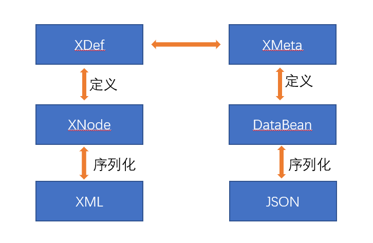

# Equivalence of XML, JSON, and Function ASTs

The Nop Platform’s overarching technical strategy can be said to revolve around Tree structures. How to express Tree structures is the first tactical problem the Nop Platform needs to solve. In Java backend architectures, XML used to be the preferred way to represent Tree structures; Spring, Hibernate, SOA, BPMN, and others are classic application cases of XML. However, for a long time there has also been a chorus of criticism that XML is verbose and slow. Are these truly inherent flaws of XML? With the rise of the Web frontend, JSON—which is easy to parse and manipulate in JavaScript—has gradually replaced XML and become the de facto standard for expressing complex data objects. Does that mean XML is completely outdated? The rise of low-code brings a new requirement: how do we structurally express executable function logic? How do we perform transformations and processing of ASTs in a natural and intuitive way? This article briefly introduces the basic abstractions of Tree structures in Nop Platform 2.0, as well as the equivalent conversion schemes among XML, JSON, and AST.

The Nop Platform holds that Everything is Tree. A Tree can be serialized in multiple forms such as XML and JSON, and bidirectional conversion can be achieved between XML and JSON. If each Tree node is assigned an interpreter, it automatically becomes an AST (Abstract Syntax Tree) and acquires executable semantics.

## I. Problems with XML

The DOM structure produced by XML parsing indeed suffers from serious design issues, essentially because it was originally intended for textual documents rather than general-purpose application data structures. Consider the following text:

```xml
<book>
   <title>aaa</title>
   <!--销售价格-->
   <price>30</price>
</book>
```

To ensure that a textual document can be read and then losslessly re-serialized back to the original, the DOM inserts additional text nodes, causing the DOM structure to be mismatched with application semantics.

```javascript
Element("book")
   Text(Blank)
   Element("title")
      Text("aaa")
   Text(Blank)
   Comment("Sales price")
   Text(Blank)
   Element("price")
      Text("30")
   Text(Blank)
```

In the DOM structure, the book node does not have two children but seven, because four extra text nodes containing only spaces and line breaks are needed to preserve the original file’s formatting information, and one comment node is needed to preserve the comment. Meanwhile, the content of the price child node is not the number 30, but a Text node, whose string content is "30".

Clearly, using the DOM structure to organize application data introduces a great deal of redundancy while losing the most basic distinction among atomic data types—it is not a universally applicable choice. Back in the day, Primeton EOS hyped the so-called XML data bus technology: pull all business data into DOM nodes, then read and write through the DOM API, allegedly to simplify programming and unify processing. My first reaction was: what were they thinking? Or were the founders returning from abroad, indoctrinated by XML fundamentalism?

Beyond being dragged down by the DOM structure, some fundamentalist design exemplars also deepened misperceptions about XML. For example, though the following expression would suffice:

```xml
<MyFunction a="xxx" b=”3“ />
```

The fundamentalist design would be:

```xml
<function>
    <name>MyFunction</name>
    <args>
        <arg>
            <name>a</name>
            <value>xxx</value>
        </arg>
        <arg>
            <name>b</name>
            <value>3</value>
        </arg>
    </args>
</function>
```

The original intent of XML was a minimalist design, and attributes can be viewed as a redundant feature to some extent, so purists tend to avoid attribute mechanisms. Some even argue that self-closing syntax like `<node/>` should be eliminated, since `<node></node>` already expresses closure.

At the same time, since XML evolved from a markup language, in its original use case markup was ancillary to business data. That is, if you remove all tags and attributes, the remaining text is all the business data, so some have long insisted that business data must be expressed via text nodes, with attributes used only for non-user-visible identifiers like ids.

Such practices were once prevalent, e.g., the pom.xml format used by Maven projects, and the XML serialization format used by SOAP.

Although XML has its issues, they are not insurmountable. On top of the DOM, one can provide simplified APIs to abstract away DOM complexity. For instance, the dom4j library provides elements/elementText and other APIs to directly retrieve non-whitespace nodes. Going a step further, we can actually discard the DOM structure entirely and parse XML directly into a general Tree structure.

As for XML only supporting textual attributes, the simplest solution is to add a small extension to the XML syntax: for numeric and boolean attributes, drop the quotes around attribute values, for example:

```xml
<Window enabled=true size=3 />
```

In fact, HTML parsers can parse the tag structure above; they merely force the parsed value to be a text value.

The JSX syntax introduced by React can be seen as another variant of XML—it expands attribute value types to expressions via the {} syntax, e.g.:

```xml
<Control size={3} enabled={true}>
</Control>
```

If you still want to strictly conform to XML, you can introduce template syntax, e.g.:

```xml
<Control size="${3}" enabled="${true}">
</Control>
```

Or use the prefix-guided syntax I introduced in the previous article, Layered DSL Syntax Design and Prefix-Guided Syntax:
https://zhuanlan.zhihu.com/p/548314138

```xml
<Control size="@:3" enabled="@:true">
</Control>
```

## II. XNode: A General-Purpose Tree Structure

The Nop Platform uses XNode to represent general Tree structures:

```java
class XNode implements ITreeStructure{
    String comment;
    String tagName;
    Map<String, ValueWithLocation> attributes;
    List<XNode> children;
    ValueWithLocation content;
}
class ValueWithLocation{
    SourceLocation location;
    Object value;
}
```

1. XNode removes support for XML namespaces. This feature is rarely used in business, but it has a noticeable performance impact.

2. For comments, we simplify by supporting only comments above a node.

3. When parsing XML into XNode, all whitespace text nodes are directly ignored.

4. If there are no child nodes, the node content is stored in content.

5. Both attributes and node values are of type Object and carry the corresponding SourceLocation.

Unlike typical template languages, the Xpl template language in the Nop Platform has syntax features specifically designed for code generation.

1. Xpl templates have multiple output modes. If outputMode=node is chosen, it outputs XNode nodes instead of text. ValueWithLocation records the source location corresponding to the output value. Compared with JavaScript’s SourceMap mechanism, this is much simpler and far more stable. Meanwhile, XNode.dump() will print the source location of attributes and nodes in comments, making it easier to diagnose issues during debugging.

2. XNode attribute values are not allowed to be null. Setting an XNode attribute value to null is equivalent to deleting that attribute. This can simplify the generation of optional attributes.

```xml
<prop name="a" mandatory="${model.mandatory ? true: null}" />
For mandatory=false, the actual output will be
<prop name="a" />
```

## III. Bidirectional Conversion between XML and JSON

In the Nop Platform, the conversion path between XML and JSON is as follows:



The XDefinition metamodel (similar to XML Schema Definition, XSD) defines the structure of XNode (Tree), while the XMeta metamodel (similar to JSON Schema) defines the structure of DataBean objects (Class). Bidirectional conversion between XDefinition and XMeta follows certain rules, e.g., XNode nodes map to objects, node attributes map to object properties, and XML names are transformed via camelCase to obtain object property names.

```java
objMeta = new XDefToObjMeta().transform(xdef);
bean = new DslXNodeToJsonTransformer(forEditor,xdef).transformToObject(node);
node = new DslModelToXNodeTransformer(objMeta).transformToXNode(bean);
```

There is a subtlety in converting from XNode to DataBean: the result is not necessarily unique. We can convert an XNode into different DataBean structures for different purposes. If you view a DataBean as a representational form (Representation) of a complex domain model structure, then at least two use cases exist: editing the domain model in a visual editor, and executing the domain model in an interpreter. If the domain model contains function definitions, editing only needs textual code definitions, whereas execution requires compiling the function definition into executable objects such as IEvalAction. In the Nop Platform, we distinguish these two scenarios through the forEditor parameter to decide whether function code needs to be compiled when converting an XNode.

Common workflow engines or rule engines today do not have a clear concept of multiple representations, resulting in considerable code duplication between editors and runtime engines.

When no XDefinition metamodel is provided, the Nop Platform also defines a simple bidirectional conversion mechanism between XML and JSON. For example:

```xml
<root a="1">
   <child name="c1">child value</child>
</root>
```

is converted to

```json
{
    "$tag": "root",
    "a": "1",
    "$body": [
       { "$tag": "child", "name":"c1", "$body": "child value"}
    ]
}
```

Use the $tag property to denote the XML tag name, and the $body property to denote the XML node’s content.

The JSON format used in the Baidu AMIS framework is actually quite close to this. It uses the type property to denote the tag name and the body property to denote the node content.
https://aisuda.bce.baidu.com/amis/zh-CN/components/form/index

```json
{
  "type": "page",
  "body": {
    "type": "form",
    "api": "/amis/api/mock2/form/saveForm",
    "body": [
      {
        "type": "input-text",
        "name": "name",
        "label": "姓名："
      },
      {
        "name": "email",
        "type": "input-email",
        "label": "邮箱："
      }
    ]
  }
}
```

However, the consistency of the AMIS format is not great—this rule does not apply uniformly to all components. Early on, container components had a messy naming of body, with controls/content/body coexisting. After a unification cleanup, things improved somewhat, but it still cannot be automatically converted to XML. Additional descriptive information is required.

One inconvenience of JSON in practice is the lack of comments. To address this, the Nop Platform also supports JSON5 and YAML at the bottom layer, treating them as extended forms of JSON, while internally processing them uniformly as JSON objects.

## IV. From XNode to AST

Function calls can be viewed as a general Tree structure definition—everything can be expressed in the form (name, arg, arg, ...). This insight is the cornerstone of the Lisp language.

If we take a closer look at the form of function calls:

```javascript
myFunc(1,"xx")
```

It is equivalent to named-argument form:

```javascript
myFunc({a:1,b:"xx"})
```

> Positional argument passing is a historical legacy: at the machine language level, parameters are passed via the stack. In modern software framework design, named argument passing has become the norm. For example, parameters of loader functions in GraphQL are named. The inability of Java to retrieve function parameter names via reflection is considered a flaw that needs fixing. In the frontend Vuex framework, the function parameter payload is forcibly constrained to a single Map-like object.

If we then move the function name inside the parentheses, we get a JSON-style function call:

```json
{
    "$fn":"myFunc",
    "a": 1,
    "b": "xx"
}
```

If we treat the function name as a component name and the function arguments as component parameters, then function calls can actually be edited using a visual component designer. Currently, common visual designers in the low-code space are implemented for form models. Although many have attempted to decouple visual designers from specific component libraries, we can go further by stripping out layout logic as well—and a designer without built-in layout logic can be used to configure function composition logic.

In the Nop Platform, the primary mechanism for converting XNode into executable logic is the custom tag library mechanism in the Xpl template language. For example, in a workflow action definition:

```xml
<action id="approve">
 <source>
   <c:lib from="/test/oa.xlib" />
   <oa:SendMail receiver="a@b.com">
      <content>data</content>
   </oa:SendMail>
 </source>
</action>
```

Each node can correspond to a custom tag, and the tag library is responsible for translating the node content into executable code. If we view XNode as an abstract syntax tree, then custom tags are analogous to syntax-directed translation in compiler theory. This translation process is context-free: regardless of the nesting structure of the tags, as long as the corresponding tag name is found, it translates to the same executable logic.

> In its early implementation, the Baidu AMIS framework deviated from this principle: the translation from JSON to components was not uniquely determined by the type name; the entire JSON node path had to be considered.

In common workflow engines, to simplify user configuration, a large number of business-specific implementations are often built into the engine, and the designer must be customized accordingly. In the Nop Platform, with metaprogramming and the XTransform mechanism, we can move a large amount of extension code completely outside the engine. For example:

```xml
In the config file
<email-action>
   <content>data</content>
</email-action>
can be transformed into an engine-built-in supported action node via the following mapping rules
<xt:mapping>
   <match tag="email-action">
     <action xt:node=".">
       <source>
          <c:lib from="/test/oa.xlib" />
          <oa:SendMail receiver="a@b.com">
             <xt:copy-node xpath="content" />
          </oa:SendMail>
       </source>
     </action>
   </match>
</xt:mapping>
```

The underlying engine does not need to embed a large number of executable actions. Through AST transformations, we can perform extensive structural transformations at the XNode level, and finally obtain executable semantics via the custom tag mechanism of the Xpl template language.
<!-- SOURCE_MD5:6a027fb037401229081409c189b1a679-->
