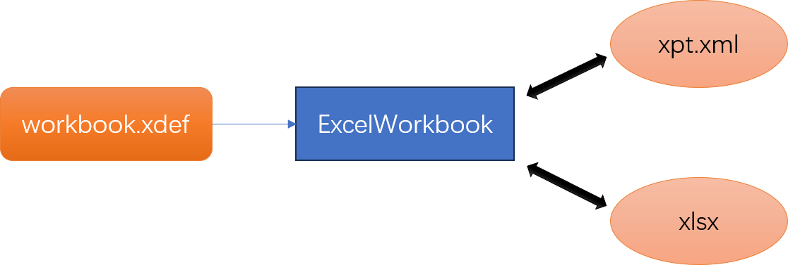
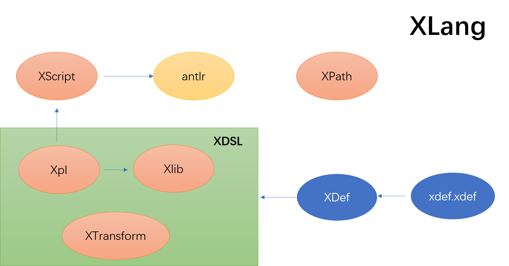

# Those used in Nop code generator DSL

Nop platform is based on so-called reversible computing theory from scratch writing, its overall implementation can be seen as the following software construction formula applied across different abstract layers:

> `App = Delta x-extends Generator<DSL>`

To realize this abstract formula into specific technical implementation, Nop platform integrates a series of generic mechanisms for implementing Generator, defining DSL (Domain-Specific Language), splitting and merging Delta, etc. The essential difference lies in that Nop platform provides **reversible computing theory-guided general solutions**. From the traditional technical perspective, DSL design is essentially an AdHoc-style edge-case solution, relying heavily on luck, while truly generic solutions are practically non-existent.

We often encounter the following statement:

> Redefine a set of DSL to replace developers' familiar Java language, why would one have more confidence in language-designers than in language itself? Moreover, the development process still requires various IDE, debug environments, and tools.

It's only human that we cannot understand things we haven't understood yet. Because the current mainstream technical体系没有解决方案，导致 many people believe that certain problems lack a general solution, leading them to subconsciously think that some problems are either unsolvable or not worth solving:

> **Intractable problems will be unconsciously deemed unnecessary to solve**.

The design goal of Nop platform is to become a general Domain-Specific Language Workbench (DSL Workbench), meaning it provides a series of technical supports for creating new DSL, striving to reduce the cost of developing new DSL. The most critical part of Domain-Specific Language is its semantic structure (what domain-specific atomic concepts exist and how they interact), while syntactic aspects are secondary. **Implementing a DSL doesn't require starting from scratch; instead, it can leverage a series of generic infrastructure**. The emergence of Nop is a natural outcome of generalizable language design reaching its peak, followed by further development of its own infrastructure after standardization of language基础设施. In fact, developing a new generalizable language in 2024 costs far less than it did 20 years ago—for example, a small team like Moonbit can develop a new language. Furthermore, the runtime of a DSL language doesn't demand the strict performance requirements that a general-purpose language does—Generator translates well into general-purpose language, and its cost is much lower.

Nop platform systematizes the use of DSL to solve traditional software engineering problems, which in turn introduces numerous custom DSLs. To someone unfamiliar with Nop, this might seem like just a collection of xdef, xpl, xrun, xdsl, even antlr—so many different suffixes on DSL files, how do they all work together? This text takes the execution process of XCodeGenerator as an example to explain the various DSL used in Nop code generator.

## 1. Execution Process of XCodeGenerator

`App = Delta x-extends Generator<DSL>`

This formula mentions Generator, which is an abstract concept referring to anything related to domain-specific transformation mechanisms, whether it's a standalone code generation tool or a built-in macro function and meta-programming mechanism within a programming language. XCodeGenerator is a generic code generator integrated into Nop platform.

> See [The strongest model-driven code generator NopCodeGen](https://mp.weixin.qq.com/s/rd36AFh5pmjwtRFmApRswg)

Generally, you can use Maven plugin to call XCodeGenerator:


Alternatively, you can use the nop-cli command line tool to invoke XCodeGenerator:


When executing the following command via CLI:

```bash
java -jar nop-cli.jar gen model/test.orm.xlsx -t=/nop/templates/orm
```

The logic is pseudocoded as follows (note: this is not actual Java code):

```javascript
templateDir = "/nop/templates/orm"
modelPath = "model/test.orm.xlsx"
// Specify template directory and input file directory via parameters
codegen = new XCodeGenerator(templateDir, targetDir);
codegen.renderModel(modelPath, scope);
```

The renderModel function of XCodeGenerator performs the actual logic (pseudocode):

```javascript
def renderModel(modelPath, scope):
    read_model(modelPath)
    generate_code(scope)
    output_result()
```

```markdown
# XCodeGenerator

## 1. renderModel Function
```javascript
void renderModel(modelPath, scope){
    // Parse model file to get model object
    codeGenModel = ResourceComponentManager.instance().loadComponentModel(modelPath);
    
    // Set parsed model to context
    scope.setLocalValue("codeGenModel", codeGenModel);
    
    // Execute model rendering
    execute(scope);
}
```

## 2. execute Function (Pseudo-Code)
```javascript
void execute(scope){
    // Run initialization file
    runInitFile("@init.xrun", scope);
    
    // Retrieve nested loop object from context
    codeGenLoop = scope.getValue("codeGenLoop");
    
    // Recursively process each template path
    // Use nested loop to determine how many times each template should be processed
    // For each variable combination, execute the generation logic
    processDir(codeGenLoop);
}
```

## 3. DSL Overview


## 4. Parsing Excel Files
### 1. Loading Excel Workbook
```javascript
ExcelWorkbookParser parser = new ExcelWorkbookParser();
ExcelWorkbook wk = parser.parseFromFile(file);
```

### 2. Generating Excel Output
```javascript
ExcelTemplate template = new ExcelTemplate(wk);
template.generateToFile(file, XLang.newEvalScope());
```

### 3. Key Characteristics
1. **No Apache POI Dependency**: The Nop platform does not rely on external libraries like Apache POI for Excel processing.
2. **Model-Driven Approach**: Excel workbooks are treated as models that can be parsed and used to generate other formats.

### 4. Model Transformation


1. **Define the workbook.xdef model**:
   - This defines how data in an Excel workbook should be transformed into another format.
   - The transformation rules are specified using a domain-specific language (DSL).

2. **Mapping Rules**:
   - Similar to JSON serialization, where `XDef` defines the structure and transformations.
   - Nop supports multiple output formats by leveraging its built-in DSL.

3. **Implementation Notes**:
   - While not supporting all Excel features, the Nop platform provides sufficient capabilities for common use cases.
   - The focus is on maintaining a consistent model representation across different formats.

3. ExcelWorkbook and xlsx file format conversion is implemented using ExcelWorkbookParser and ExcelTemplate. The Nop platform does not use the POI library but instead performs self-contained parsing of the xlsx files (which are essentially a zip package containing multiple XML files).

**Note:**  
- The Nop platform does not use Java's built-in XML parser nor the DOM node interfaces specified in XML standards. Instead, it uses its own XNodeParser and custom XNode structure.
- There is a persistent misconception that XML is outdated and that any technology using XML is lagging behind. However, XML itself does not have significant issues; most problems stem from over-complex implementations of XML specifications. The Nop platform avoids these issues by implementing its own XML structure parser, transformer, and validator. For details, see [Why Does the Nop Platform Stick with XML Instead of JSON or YAML](https://zhuanlan.zhihu.com/p/651450252).

One important point is that the corresponding DSL file format for ExcelWorkbook is typically `xpt.xml`, referred to as the Xpt report model file. In the design of the Nop platform, an Excel file without any dynamic expansion logic is still considered a valid template file. Therefore, any ExcelWorkbook can be directly saved as a valid `xpt.xml` file.

## 3. Parsing ExcelWorkbook into ModelObject

The Nop platform extensively uses models to express requirement information, such as data models for defining database structures and API models for defining backend service interfaces. These models can be expressed using XML-based DSL. However, since business users are more familiar with Excel, allowing them to directly edit and view model information in Excel ensures that the documentation can be used as input for code generation tools, ensuring that models remain consistent with the code.

The Nop platform provides a generic [ImportExcelParser](https://gitee.com/canonical-entropy/nop-entropy/blob/master/nop-entropy/blob/master/nop-excel/src/main/java/io/nop/excel/imp/ImportExcelParser.java) class, which can automatically parse ExcelWorkbook into ModelObject based on the ImportModel configuration. During parsing, it performs detailed field validation and executes complex transformation logic if errors are detected.

### Example:
The traditional approach requires writing specific parsing code for each file format, ultimately requiring strict consistency between Excel formats and parsing configurations. Minor changes, such as adding blank lines or adjusting cell order, can break the parsing logic and lead to failures.

The Nop platform's generic parser determines how to parse an ExcelWorkbook based on the ImportModel configuration. It extracts field values from cells and executes transformation/ validation logic to construct a strongly typed Java object. In the reverse direction, for a given ModelObject, it uses ReportModel configuration to generate an ExcelWorkbook.

### Key Points:
- **Forward Direction:** ExcelWorkbook → ModelObject  
  The parser reads cell values based on ImportModel's mapping and applies transformation/ validation rules to create a ModelObject.

- **Reverse Direction:** ModelObject → ExcelWorkbook  
  Using ReportModel, the NopReport engine generates an ExcelWorkbook with structured data. This process handles complex nesting and conditional logic, making it more advanced than simple JSON serialization.

### Syntax Example:
```xml
<ExcelWorkbook>
    <ImportModel>
        <!-- Mapping configuration -->
    </ImportModel>
    <!-- Data transformations and validations -->
</ExcelWorkbook>
```

The Nop platform's approach allows for a flexible yet consistent way to map Excel data to Java objects, ensuring that models remain aligned with the codebase.

---

### Report Model (ReportModel)
The Nop platform provides a versatile [NopReport](https://mp.weixin.qq.com/s/_nKUiryetF2O5zSrPfU8FQ) engine for complex row-wise operations. This open-source Chinese-style report engine supports intricate row and column operations, making it suitable for scenarios where Excel expertise is valuable.

When generating an ExcelWorkbook from ModelObject, the NopReport engine executes dynamic row and column operations based on the ModelObject's structure. This includes handling nested objects, conditional formatting, and complex calculations, which goes beyond simple JSON or YAML processing.

### Example Code:
```java
import io.nop.excel.ImpExcel;
```

[ImportExcelParser](https://gitee.com/canonical-entropy/nop-entropy/blob/master/nop-entropy/blob/master/nop-excel/src/main/java/io/nop/excel/imp/ImportExcelParser.java) is a generic parser that accepts an ImportModel configuration to determine how to process Excel files.

---

### Summary:
The Nop platform's approach to parsing Excel data into Java objects eliminates the need for custom parsers for each file format. By using its own XML parser and transformer, it ensures flexibility while maintaining consistency between models and code. This avoids the pitfalls of traditional approaches that require tailored solutions for specific Excel formats.


The `ReportModel` is defined in the `ExcelWorkbook` foundation, expanding the required model information for report generation.

```
ReportModel = ExcelWorkbook + XptWorkbookModel
```

The Nop platform provides multiple expression ways for `ReportModel`:

1. **DSL Model File (`xpt.xml`)**: Can be parsed using `xpt.xml` to obtain `ReportModel`. The `xpt.xml` uses the `workbook.xdef` meta-model for constraints.

2. **Excel-Based Model**: Offers model definitions within standard Excel files, supporting additional configurations through annotations.

3. **Configuration File (`imp.xml`)**: Imports model configurations using `imp.xml`, combining with an empty `template` to derive a `ReportModel`.


## Four. Unified Model Loader

The Nop platform handles numerous model file formats, with the same model corresponding to multiple file formats. For instance, the `orm` model can be stored in both `nop-auth.orm.xlsx` and `app.orm.xml`.

Nop adheres to a **Language-Oriented Programming (LOP)** approach. Before solving business problems, we define a DSL tailored to the current domain, then employ this DSL for problem resolution. To uniformly manage multiple DSLs, Nop provides a unified model loader.

```javascript
model = ResourceComponentManager.instance().loadComponentModel(path)
```

The `ResourceComponentManager` loads all models. It determines file-to-model format correspondence through the standard `register-model.xml` configuration.

```xml
<!-- orm.register-model.xml -->
<model x:schema="/nop/schema/register-model.xdef" xmlns:x="/nop/schema/xdsl.xdef" name="orm">
    <loaders>
        <xlsx-loader fileType="orm.xlsx" impPath="/nop/orm/imp/orm.imp.xml"/>
        <xdsl-loader fileType="orm.xml" schemaPath="/nop/schema/orm/orm.xdef"/>
    </loaders>
</model>
```

Upon platform startup, the system automatically scans the virtual file directory for files matching `*/nop/core/registry/*.register-model.xml`, registering their extensions to model parsers.

In the example:
- Files ending with `.orm.xlsx` use `ImportExcelParser`.
- Those ending with `.orm.xml` use `DslModelParser`.


## Five. Code Generation Template

The code generation template uses `xrun`, `xgen`, and similar tools, all stemming from XPL template language.

```xml
<!-- xpl.register-model.xml -->
<model x:schema="/nop/schema/register-model.xdef" xmlns:x="/nop/schema/xdsl.xdef"
       name="xpl">
    
    <loaders>
        <loader fileType="xpl" class="io.nop.xlang.xpl.loader.HtmlXplModelLoader"/>
        <loader fileType="xgen" class="io.nop.xlang.xpl.loader.HtmlXplModelLoader"/>
        <loader fileType="xrun" class="io.nop.xlang.xpl.loader.NoneXplModelLoader"/>
    </loaders>
</model>
```

Through the `xpl.register-model.xml` file, the relationship and differences between them can be clearly understood.

* xpl and xgen are the same. However, when used in code generation, xgen is a specially identified suffix. After execution, the generated files will remove the xgen suffix. For example, `test/a.java.xgen` will generate `test/a.java`.

* xrun is also an xpl template file but does not allow output and is only used for executing code.

In debug mode, when the Nop platform starts, it will output all register-model contents in the `/nop/main/registry/app.registry.xml` file. This file can be viewed to determine which file suffixes are identified by the unified model loader. For details, refer to this file.

### XLang Language

The xpl template language is part of the larger XLang family. XLang is a critical infrastructure within the Nop platform and provides multiple sub-languages that collectively form an embedded language supporting delta concepts and compile-time meta-programming, supporting `Delta x-extends Generator<DSL>` patterns for a computational mode language family. For detailed information, refer to [xlang.md](https://gitee.com/canonical-entropy/nop-entropy/blob/master/docs/dev-guide/xlang/xlang.md).



* The xpl template language supports a mechanism similar to Vue tags, using the Xlib DSL to express tag libraries.

* The xpl template language can use the built-in `<c:script>` tag to invoke XScript scripting language.

* XScript is a syntax similar to TypeScript and its parser is generated by antlr. For more details, refer to [Antlr4: How Antlr4 automatically generates AST instead of ParseTree](https://zhuanlan.zhihu.com/p/534178264).

* When generating XLangASTParser, you need to use XCodeGenerator, which in turn uses XScript. This creates a circular dependency. The Nop platform manually writes XLangASTParser and XLangASTBuildVisitor before transitioning to automatic generation of these components.

* In the Nop platform, all XML-formatted files use xdef meta-models to define their structure, referred to as XDSL. For example, the xpl template language corresponds to `xpl.xdef`, while tag libraries correspond to `xlib.xdef`.

* The xdef meta-model itself is constrained by `xdef.xdef`. However, in implementation, XDefinitionParser manually parses xdef files without automatic generation to avoid circular dependencies when parsing xdef.

* Although xpl uses XML syntax, its parsed AST and XScript are consistent with XLangAST, which is also consistent with XScript.

```xml
<c:unit>
    <c:for var="x" items="${list}">
        ...
    </c:for>
    <c:script>
        for(let x of list){
            // ...
        }
    </c:script>
</c:unit>
```

The `<c:for>` and `<c:script>` tags in the above example translate to `ForOfStatement` in ForOfStatement.

## 6. DSL Behind the Unified Structure Construction Rules
# Nop: A New Paradigm for Problem Solving

Nop is not merely a specific development framework. **It is a completely new way of thinking**. The approach taken by Nop is to define a domain-specific language (DSL) and build a local description framework within this DSL. This process allows us to create individual points in the vast model space, and then establish automated conversion paths between different models. Through fully automated reasoning, we can freely navigate through the model space.

In traditional programming approaches, each structural component must be manually coded to establish connections. However, in the Nop world, we can achieve a higher-level view of the world by leveraging meta-models. By observing the uniform decomposition, integration, and transformation rules hidden behind the DSL, we can perform unified logical coding on the meta-model. This allows us to automatically adapt to each specific model object.

# Limitations of Existing Low-Code Platforms

Existing low-code platforms attempt to create ad hoc development models for specific purposes, then try to improve the visualization editor to make it easier for users to configure models. However, Nop addresses entirely different concerns. It focuses on uncovering the underlying construction rules of all models and enabling automated derivation of a visualization designer. It seeks to establish free conversion between model pairs.

# The Unique Nature of Nop

Nop deals with a fundamentally different set of problems compared to traditional programming languages or even most existing low-code platforms. Instead of focusing on how to connect individual components, Nop explores the underlying patterns that govern all models and seeks to automate the process of translating these patterns into a coherent visualization.

