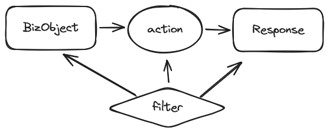

# Nop Getting Started: How to Implement Complex Queries

Bilibili video: https://www.bilibili.com/video/BV1c1421i72k/

The execution process of query services in the Nop platform consists of three main parts:

1. Locate the service object
2. Invoke the service function on the service object
3. Post-process the returned result

In all three parts, we can inject filtering and ordering conditions.

For example, `/r/NopAuthSite__findList?@selection=id,resources{resoureName}`
The invocation link can be mapped to the findList method of the business object NopAuthSite, and then selectively return specified result fields.



## I. Object-level filtering and ordering conditions

You can add filter and orderBy sections in the XMeta metadata model file. All operations involving this service object will automatically append the corresponding conditions. In particular, when creating and updating, entity properties will also be automatically set to satisfy the filter configuration.

```xml

<meta>
  <filter>
    <eq name="siteId" value="main"/>
  </filter>
</meta>
```

This mechanism can be used to store multiple business-distinct entities in a single database table. For example, in warehouse management, the concrete attributes of a material entity may vary significantly by type. Adding a separate XMeta file for each material type allows you to customize different extension fields and UI for different material types.

In addition, different object names can be mapped to different data authorization configurations.

```xml

<data-auth x:schema="/nop/schema/data-auth.xdef" xmlns:x="/nop/schema/xdsl.xdef">
  <objs>
    <obj name="NopAuthUser">
      <role-auths>
        <role-auth roleId="nop-admin">
        </role-auth>

        <role-auth roleId="user">
          <filter>
            <eq name="tenantId" value="${$context.tenantId}"/>
          </filter>
        </role-auth>
      </role-auths>
    </obj>
  </objs>
</data-auth>
```

We can choose to inherit from an existing XMeta model to create a new business object. By configuring the corresponding BizModel in app.beans.xml, the service object name will be automatically associated with the corresponding XMeta meta-model.

```xml

<bean id="NopAuthResourceBizModel_main" class="io.nop.auth.service.entity.NopAuthResourceBizModel">
  <property name="bizObjName" value="NopAuthResource_main"/>
</bean>
```

The `/nop/auth/model/NopAuthResource/NopAuthResource_main.xmeta` file can choose to inherit from the existing NopAuthResource.xmeta file.

```xml

<meta x:extends="NopAuthResource.xmeta">
  ...
</meta>
```

## II. Add filtering and ordering conditions in the XBiz model file via Xpl tags

Adding filters in XMeta affects the save and update functions. If you only want to add filters for a specific business query—such as querying records that are currently active—you can configure it in the XBiz model.

```xml

<biz x:schema="/nop/schema/biz/xbiz.xdef" xmlns:x="/nop/schema/xdsl.xdef"
     x:extends="_NopAuthUser.xbiz" xmlns:bo="bo" xmlns:c="c">

  <actions>
    <query name="active_findPage" x:prototype="findPage">

      <source>
        <c:import class="io.nop.auth.api.AuthApiConstants"/>

        <bo:DoFindPage query="${query}" selection="${selection}" xpl:lib="/nop/biz/xlib/bo.xlib">
          <filter>
            <eq name="status" value="${AuthApiConstants.USER_STATUS_ACTIVE}"/>
          </filter>
        </bo:DoFindPage>
      </source>
    </query>
  </actions>
</biz>
```

* x:prototype indicates that the input parameters and return type definitions are inherited from the existing findPage function.
* bo.xlib provides wrappers for helper functions such as doFindPage/doUpdate, allowing additional processing logic to be passed in when invoking these functions. <bo:DoFindPage> leverages the encapsulation capabilities of the xpl template language to provide a very intuitive way to configure filters.
* The xbiz model file can be regarded as an XML-formatted configuration file. You can design function implementation logic online with a visual designer, and use the model dynamic loading capability in the Nop platform to perform live updates.

For further details, see [filter.md](../../dev-guide/recipe/filter-list.md)

## III. Add association query configuration for prop in XMeta

The return value of a service function in the Nop platform is not serialized directly to JSON and returned to the frontend; instead, it goes through the result mapping of the NopGraphQL engine, during which very complex DataFetcher data-loading logic can be executed.

When we need to add filtering and ordering conditions to child-table records, we can configure the graphql:queryMethod attribute on the prop node in XMeta, thereby leveraging OrmEntityConnectionFetcher to implement child-table filtering and ordering.

```xml

<meta x:schema="/nop/schema/xmeta.xdef" xmlns:x="/nop/schema/xdsl.xdef" x:extends="_NopAuthSite.xmeta"
      xmlns:graphql="graphql">
  <props>
    <prop name="resourcesList" displayName="Resource List"
          graphql:queryMethod="findList" lazy="true">
      <schema bizObjName="NopAuthResource"/>

      <graphql:filter>
        <eq name="siteId" value="@prop-ref:siteId"/>
      </graphql:filter>

      <graphql:orderBy>
        <field name="orderNo" desc="false"/>
      </graphql:orderBy>
    </prop>
  </props>
</meta>
```

* graphql:queryMethod supports multiple enum values such as findCount/findFirst/findList/findPage/findConnection, each corresponding to a different return type. However, in all cases the input parameter type is GraphQLConnectionInput.
* Use the bizObjName attribute to specify the associated child-table entity object.
* An ORM-level association between the current entity and the related entity is not required. You can add association query conditions via <graphql:filter>. The @prop-ref: prefix indicates that a property value is taken from the current entity for the associated query.
* For entities with logical deletion enabled, by default all queries will automatically append logical-deletion filters. If you want to change this behavior, you can mark graphql:disableLogicalDelete=true on the prop so that the associated query will skip the logical-deletion filter.

For example, if you want to return the number of entries in the child table, you can use graphql:queryMethod="findCount", or use graphql:queryMethod="findPage" and access xxx{total} to get the total attribute from the returned PageBean.

If there is an ORM-level association property, the configuration above can be simplified:

```xml

<meta x:schema="/nop/schema/xmeta.xdef" xmlns:x="/nop/schema/xdsl.xdef" x:extends="_NopAuthSite.xmeta"
      xmlns:graphql="graphql">
  <props>
    <prop name="resourcesList" displayName="Resource List"
          graphql:queryMethod="findConnection" lazy="true"
          graphql:connectionProp="resources">
      <schema bizObjName="NopAuthResource"/>
      <graphql:orderBy>
        <field name="orderNo" desc="false"/>
      </graphql:orderBy>
    </prop>
  </props>
</meta>
```

* By using graphql:connectionProp you can specify the ORM-level association property, from which graphql:filter can be inferred automatically. If graphql:filter is also configured, it will be treated as additional conditions on top of the association query condition.
* findConnection corresponds to a return type of GraphQLConnection. For details, see [connection.md](../../dev-guide/graphql/connection.md)

In REST calling mode, you can pass child-table filter conditions using the form _subArgs.{propName}.filter_xx=yy

```
http://localhost:8080/r/NopAuthSite__get?id=main&%40selection=id,displayName,resourcesList%7Bitems%7Bid,displayName%7D%7D&_subArgs.resourcesList.filter_status=1
```

* You can pass GraphQL-like field mapping via @selection, but note that special characters such as @ and curly braces must be URL-encoded; otherwise the backend will fail to parse the URL and return a 400 error code.

When invoking via GraphQL, you can pass more complex and/or conditions:

```graphql
query($filter:Map){
    NopAuthSite_get(id:"main"){
        id
        displayName
        resourcesList(filter:$filter,limit:10,offset:0){
            items{
                id
                displayName
            }
        }
    }
}

variables:
  filter: {
     "$type": "or",
     "$body": [
        { "$type": "eq", "status", 1},
        { "$type": "eq", "status", 2}
     ]
  }
```

With GraphQL's alias mechanism, we can return different query results using the same child-table property:

```graphql
query($filter1:Map, $filter2: Map){
    NopAuthSite_get(id:"main"){
        id
        displayName
        activeResources: resourcesList(filter:$filter1,limit:10,offset:0){
            items{
                id
                displayName
            }
        }
        inactiveResources: resourcesList(filter:$filter2,limit:10,offset:0){
            items{
                id
                displayName
            }
        }
    }
}
```

## IV. Filter parent records based on child-table properties

You can add a custom field in XMeta, then use graphql:transFilter to translate the custom field condition into the SQL statement corresponding to the child-table query. The underlying implementation leverages the transformFilter function provided by QueryBean to structurally transform the query conditions submitted by the frontend.

For example, for a custom query condition like `/r/NopAuthSite__findPage?filter__myCustomFilter=1`, we define the transformation logic in XMeta via the prop node's graphql:transFilter child node.

```xml

<prop name="myCustomFilter" queryable="true">
  <graphql:transFilter>
    <filter:sql>
      exists( select o2 from NopAuthResource o2 where o2.siteId= o.id
      and o2.status >= ${ filter.getAttr('value') }
      )
    </filter:sql>
  </graphql:transFilter>
</prop>
```

* Properties with queryable="true" can be used in query conditions passed from the frontend. The field does not need to be a property of the entity.
* graphql:transFilter is a function. The context contains a filter object, which corresponds to a TreeBean whose name is the specified property name.
* <filter:sql> is a tag defined in filter.xlib. It wraps a dynamically generated SQL statement into a TreeBean object with $type=sql for use as a database query condition.

The actual EQL statement translated is:

```sql
select o
from NopAuthSite o
where
  exists( select o2 from NopAuthResource o2 where o2.siteId= o.id
    and o2.status >= 1
  )
```

### Advanced features

The type of graphql:transFilter is xpl-fn. Its return value is required to be of type XNode, but it does not support output directly. To output an XNode using xpl, you need to wrap it in a node and set outputMode.

```xml

<graphql:transFilter>
  <and xpl:outputMode="node">
    <alwaysTrue/>
    <filter:sql>
      exists(select o2 from NopAuthResource o2 where o2.siteId= o.id
      and o2.status >= ${filter.getAttr('value')})
    </filter:sql>
  </and>
</graphql:transFilter>
```

Additionally, when graphql:transFilter is configured, you can still set allowFilterOp to multiple ops. During code generation, you can check filter.tagName to determine which op was sent from the frontend.

### Frontend-specified left join

When passing a QueryBean-type parameter from the frontend, you can use leftJoinProps to specify which associated object properties are accessed via left join.

For security reasons, only designated properties are allowed to be included in the leftJoinProps collection. These properties are specified on the root node of the meta file via the biz:allowLeftJoinProps attribute. If you set its value to *, all associated object properties are allowed to be included in leftJoinProps.

When the platform returns child-table objects in list queries, it automatically enables the BatchLoader mechanism to optimize loading and avoid the n+1 problem. Specifically, it first loads the parent objects and then batch-loads the child objects. Currently, loading is optimized for both to-one and to-many association properties in ORM. However, queries like graphql:queryMethod="findList" that define their own association conditions are not yet optimized.

### Grouped aggregation queries

The methods in IEntityDao and CrudBizModel require returning entity objects, so they do not support implementing grouped aggregation queries by passing a QueryBean from the frontend. You can write your own service function in the backend and call IOrmTemplate.findListByQuery to implement it. Use limit and offset in QueryBean to set pagination parameters. If limit is not set, all data will be queried.

```javascript
@BizQuery
public List<Map<String,Object>> findGroupData(@Name("offset") int offset){
  QueryBean query = new QueryBean();
  query.setSourceName(NopAuthGroupUser.class.getName());
  query.fields(forField("group.name"), forField("id").count());
  query.addOrderField("group.name", true);
  query.addGroupField("group.name");
  query.setOffset(offset);
  query.setLimit(10);

  List<Map<String, Object>> list = ormTemplate.findListByQuery(query);
  return list;
}
```

For more complex master-detail association queries, see [mdx-query.md](../../dev-guide/orm/mdx-query.md)

### Specify field sort order in query conditions

You can specify the query_orderBy parameter using SQL-like ordering syntax. QueryBeanArgsNormalizer will recognize this parameter, normalize it into the orderBy property of the query object, and parse it into a List<OrderByBean> structure.

```
query_orderBy=name asc, status desc
```
<!-- SOURCE_MD5:2b984eb91313dbbc0efc45e288513938-->
