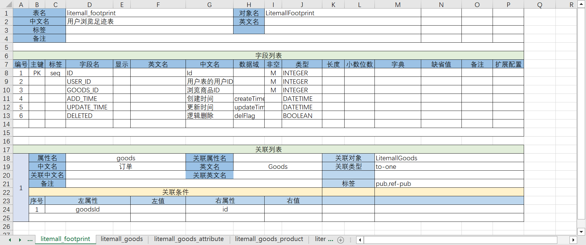

# Development Example

Video demonstration: [Complete example of developing a product list page using the Nop platform](https://www.bilibili.com/video/BV1384y1g78L/)

The Nop platform is a concrete implementation of reversible computing theory. To demonstrate the relevant concepts of reversible computing theory, it includes an integrated low-code development workflow for the backend management system. This allows for rapid development of the backend management system without the need for special design, leveraging the platform's built-in mechanisms to provide productized customization capabilities. The following example details the low-code development workflow integrated into the `nop-app-mall` project.

> `nop-app-mall` is a simple e-commerce example application. The project codebase is [nop-app-mall](https://gitee.com/canonical-entropy/nop-app-mall)

> Nop platform open-source URLs:
>
> * gitee: [https://gitee.com/canonical-entropy/nop-entropy](https://gitee.com/canonical-entropy/nop-entropy)
> * github: [https://github.com/entropy-cloud/nop-entropy](https://github.com/entropy-cloud/nop-entropy)

## I. Excel Data Model Design

First, we need to design an Excel data model within which database tables, fields, and table relationships are defined.



The following information can be specified in the Excel model:

1. **Label**: Used for additional tagging of tables, fields, etc. For example, `seq` indicates that the field value is generated by `SequenceGenerator`, while `var` means the field value will be initialized as a random value and must be marked as a dynamic variable in automated unit testing.

2. **Visibility**: Controls whether a field is displayed or allowed to be updated. The front-end automatically generates list and form pages based on this information provided here.

3. **Domain**: For fields with specific business semantics, a domain can be specified. Once the system recognizes the domain, it can uniformly handle the data. For example, `domain=createTime` indicates that the field is a creation time field, which will automatically initialize to the current time when a new entity is created.

4. **Dictionary**: Limits the values of a field to specific options through a dictionary. The dictionary can be an `enum` class in Java, such as `io.nop.xlang.xdef.XDefOverride`, or defined in a YAML file, such as `mall/aftersale-status` corresponding to the file `/nop/dict/mall/aftersale-status.dict.yaml`.

5. **Table Relationships**: Table relationships can be configured via "Relationship List." The property name is the attribute name in the child entity corresponding to the parent entity's property, while the relationship property name refers to the collection of entities in the parent entity. For example, the `parentId` field in the department table corresponds to a property named `parent`, and the relationship property name is `children`. If the ORM does not need to access entity collections directly, the relationship property name can be omitted.

Dictionaries can be defined directly within the Excel model, and during code generation, the model will automatically generate a `dict.yaml` definition for the dictionary files.


For more detailed configuration explanations, refer to the document [excel-model.md](../dev-guide/model/excel-model.md).

### Reverse Engineering

Video demonstration: [How to generate an Excel data model through reverse engineering](https://www.bilibili.com/video/BV1Rc411u79d)

In addition to manually defining database models, we can connect an existing database and use the `nop-cli` command-line tool for reverse analysis of the database structure to generate an Excel model.

```java
java -Dfile.encoding=UTF8 \
    -jar nop-cli.jar \
    reverse-db litemall \
    -c=com.mysql.cj.jdbc.Driver \
    --username=litemall \
    --password=litemall123456 \
    --jdbcUrl="jdbc:mysql://127.0.0.1:3306/litemall?useUnicode=true&characterEncoding=utf-8&useSSL=true&serverTimezone=UTC"
```

The `reverse-db` command in `nop-cli` requires a parameter for the database schema name, such as `litemall`, and can be passed additional information like JDBC connection strings via options like `--jdbcUrl`.

After generating the `orm.xlsx` model file using reverse engineering, we need to adjust configuration details such as Maven module names and package names in the "Configuration" form.

  
  

### Importing PowerDesigner Model or PDManer Model

Using the `nop-cli` tool's `gen-orm-excel` command, you can generate Excel data models based on the PowerDesigner design tool's physical model (`pdm`) or the open-source alternative PDManer.

```shell
java -Dfile.encoding=UTF8 -jar nop-cli.jar gen-orm-excel model/test.pdm
```

PowerDesigner is a paid software, and an open-source alternative is the [PDManer metadata modeling tool](https://gitee.com/robergroup/pdmaner).

Using the `nop-cli` tool, you can also generate Excel data models based on PDManer's model files:

```shell
java -Dfile.encoding=UTF8 -jar nop-cli.jar gen-orm-excel model/test.pdma.json
```

According to reversible computation theory, Pdm models, PDManer models, and Excel models are all merely visual representations of ORM domain models. **These snapshots contain the same information in principle and can be converted into each other**. Leveraging Nop's meta-programming capabilities, we can generate ORM model files at compile time based on Pdm models, allowing PowerDesigner or PDManer to be used as visualization tools for ORM models within the Nop platform.

```xml
<!-- app.orm.xml -->
<orm x:schema="/nop/schema/orm/orm.xdef"
     x:extends="base.orm.xml" x:dump="true"
     xmlns:x="/nop/schema/xdsl.xdef" xmlns:xpl="/nop/schema/xpl.xdef">
    <x:gen-extends>
        <pdman:GenOrm src="test.pdma.json" xpl:lib="/nop/orm/xlib/pdman.xlib"
                      versionCol="REVISION"
                      createrCol="CREATED_BY" createTimeCol="CREATED_TIME"
                      updaterCol="UPDATED_BY" updateTimeCol="UPDATED_TIME"
                      tenantCol="TENANT_ID"
        />
    </x:gen-extends>
</orm>
```

The `x:gen-extends` mechanism is a runtime mechanism that dynamically generates extendable base models when the `app.orm.xml` model file is loaded. It then applies the `x-extends` algorithm to perform incremental modifications on the inherited content.

> The `x:gen-extends` mechanism is part of XLang, a built-in language syntax. For detailed documentation, refer to [xdsl.md](../dev-guide/xlang/xdsl.md).

## II. Generating Initial Project Code

If you already have an Excel data model, you can use the `nop-cli` command-line tool's `gen` command to generate initial project code:

```shell
java -jar nop-cli.jar gen model/app-mall.orm.xlsx -t=/nop/templates/orm
```

The generated content includes:

```
├─app-mall-api       Exposes interface definitions and message definitions for external use
├─app-mall-codegen   A helper project for code generation based on ORM models to update the current project's code
├─app-mall-dao       Database entity definitions and ORM mappings
├─app-mall-service   Implementation of GraphQL services
├─app-mall-web       AMIS page files and View model definitions
├─app-mall-app       A testing package containing the built project
└─deploy             SQL statements for database table creation based on Excel models
```

Nop platform provides Maven-like integration for code generation. To enable this in your project, add the following configuration to your `pom.xml`:


```xml
<pom>
    <parent>
        <artifactId>nop-entropy</artifactId>
        <groupId>io.github.entropy-cloud</groupId>
        <version>2.0.0-SNAPSHOT</version>
    </parent>

    <build>
        <plugins>
            <plugin>
                <groupId>org.codehaus.mojo</groupId>
                <artifactId>exec-maven-plugin</artifactId>
            </plugin>
        </plugins>
    </build>
</pom>
```

> If the project does not inherit from the `io.github.entropy-cloud:nop-entropy` module's POM file, additional detailed configurations for the `exec-maven-plugin` plugin need to be added.

When using Maven to build the project, it automatically executes scripts in the `precompile` and `postcompile` directories of the project, specifically `xgen` code generation. The `precompile` stage runs before the compile phase and provides access to all dependent libraries but not to the current project's class directory. In contrast, the `postcompile` stage runs after the compile phase and allows access to compiled classes and resource files. For example, in the `app-mall-codegen` module, the `precompile/gen-orm.xgen` file contains the following content:

```xml
<c:script>
// Generates DAO and entity classes based on ORM models
codeGenerator.withTargetDir("../").renderModel('../../model/app-mall.orm.xlsx', '/nop/templates/orm', '/', $scope);
</c:script>
```

This command is equivalent to manually executing the `nop-cli gen` command. Therefore, **once the initial project is generated, you can use Maven commands to update the project's code based on Excel data models without needing to use the nop-cli tool anymore**. The Nop platform employs an incremental code generation design, which means that re-generation will not overwrite manually adjusted business logic. For more details on how this works, refer to the article

[Data-Driven Code Generator](https://zhuanlan.zhihu.com/p/540022264)

For convenience during debugging, the initial generated code includes two test classes: `AppMallCodeGen.java` and `AppMallWebCodeGen.java`. These can be directly run in IDEA to execute code generation.

The generated code based on ORM models includes complete front-end to back-end code. You can use the following command to compile and run the application without additional configurations:

```shell
mvn clean install -DskipTests -Dquarkus.package.type=uber-jar

java -Dfile.encoding=UTF8 \
    -Dquarkus.profile=dev \
    -jar app-mall-app/target/app-mall-app-1.0-SNAPSHOT-runner.jar
```

The `app-mall-app` project uses an embedded H2 in-memory database and automatically creates database tables based on the ORM model during startup. The default user is `nop`, with a password of `123`.

## 3. Configuring Menus and Permissions

The generated code includes a permission definition file: `app-mall-web/src/resources/_vfs/app/mall/auth/_app-mall.action-auth.xml`. This file defines default menu items for each backend entity, corresponding to standard CRUD pages.

You can manually add new menu items or mark menu items for deletion in the `app-mall.action-auth.xml` file.

```xml
(resource id="goods-manage" displayName="Goods Management" icon="ion:grid-outline" resourceType="TOPM"
           routePath="/goods-manage" component="layouts/default/index">
     <children>
         <resource id="mall-goods-list" displayName="Goods List"
                   icon="ant-design:appstore-twotone" component="AMIS"
                   resourceType="SUBM" url="/app/mall/pages/LitemallGoods/main.page.yaml"/>
         <resource id="mall-goods-create" displayName="Goods Upload"
                   icon="ant-design:appstore-twotone" component="AMIS"
                   resourceType="SUBM" url="/app/mall/pages/LitemallGoods/add.page.yaml"/>
         <resource id="mall-goods-comment" displayName="Goods Comments"
                   icon="ant-design:appstore-twotone" component="AMIS"
                   resourceType="SUBM" url="/app/mall/pages/LitemallComment/main.page.yaml"/>
     </children>
 </resource>
```

The menu structure follows the design of the `jeecgboot` project, where the top-level menu configuration has `resourceType=TOPM`, `component=layouts/default/index`, and specific page configurations have `resourceType=SUBM`, `component=AMIS`, with `url` set to the virtual path of the page file.

## Four. Perfecting Backend Services

The Nop platform automatically generates Meta metadata description files and corresponding GraphQL service objects based on Excel data models. **With simple configuration, you can achieve a fully functional GraphQL backend service**. Comparing the `app-mall` project's `LitemallGoodsBizModel.java` with the original `litemall` project's `AdminGoodsService.java`, it is evident that the Nop platform avoids a lot of repetitive code, typically requiring only deviations from standard CRUD logic to be implemented.

### 4.1 Adding Entity Methods

Only fixed logic based on entity fields can be directly implemented as methods in the entity object. For example, the `retailPrice` field in the Goods table corresponds to the lowest price of the related product.

```java
class LitemallGoods extends _LitemallGoods {
    /**
     * retailPrice records the current good's lowest price
     */
    public void syncRetailPrice() {
        LitemallGoodsProduct minProduct = Underscore.min(getProducts(), LitemallGoodsProduct::getPrice);
        BigDecimal retailPrice = minProduct == null ? minProduct.getPrice() : new BigDecimal(Integer.MAX_VALUE);
        setRetailPrice(retailPrice);
    }
}
```

With the help of the NopOrm data access engine, you can easily access related object collections.

> All related objects and related object collections are lazily loaded. You can utilize the `BatchLoadQueue` mechanism to pre-load them, thus avoiding Hibernate's common N+1 issue. See [orm.md](../dev-guide/orm/orm.md) for details.

### 4.2 Adding Additional CRUD Logic

The Nop platform leverages information defined in XMeta files to automatically implement all CRUD logic, such as:

1. Automatically validate parameter validity (whether non-empty, whether within dictionary table range, whether meeting format requirements, etc.)

2. Implement complex query conditions and pagination/sorting

3. Submit parent entity information in one go and automatically detect changes in child entities

4. Enable logical deletion by automatically adding the `deleted=false` query condition

5. Verify that unique key constraints have not been violated, such as preventing duplicate product names

6. Automatically record audit information like creator, creation time, updater, and update time

7. When deleting the current entity, automatically delete all associated objects marked with `cascade-delete`

When enhancing standard CRUD operations, you can override methods like `defaultPrepareSave` in the derived class of `CrudBizModel`. For example, when saving product information, it automatically synchronizes the redundant field `retailPrice`.

```java
@BizModel("LitemallGoods")
public class LitemallGoodsBizModel extends CrudBizModel<LitemallGoods> {
    public LitemallGoodsBizModel() {
        setEntityName(LitemallGoods.class.getName());
    }

    @Override
    protected void defaultPrepareSave(EntityData<LitemallGoods> entityData, IServiceContext context) {
        entityData.getEntity().syncRetailPrice();
    }

    @Override
    protected void defaultPrepareQuery(QueryBean query, IServiceContext context) {
        TreeBean filter = query.getFilter();
        if (filter != null) {
            TreeBean keywordsFilter = filter.childWithAttr("name", LitemallGoods.PROP_NAME_keywords);
            if (keywordsFilter != null) {
                Object value = keywordsFilter.getAttr("value");
                TreeBean orCond = or(contains(LitemallGoods.PROP_NAME_name, value), contains(LitemallGoods.PROP_NAME_keywords, value));
                filter.replaceChild(keywordsFilter, orCond);
            }
        }
    }
}
```

In the above example code, `defaultPrepareQuery` is also overridden. In this function, we modify complex query conditions submitted from the frontend, such as transforming a `keywords` search field into a query that simultaneously searches the database for both `keywords` and `name` fields.

### 4.3 Increasing Database Access

If you've added a `mapper` tag to the database table in your Excel model, a `sql-lib.xml` file and a corresponding `Mapper` interface will be automatically generated. We can use the more convenient and powerful `SqlLibManager` mechanism for database access instead of MyBatis. The `sql-lib` file supports EQL object query syntax or native SQL syntax. EQL object query syntax is recommended for most relational databases due to its adaptability via Dialect models.


```xml
<!-- LitemallGoods.sql-lib.xml -->
<sql-lib x:schema="/nop/schema/orm/sql-lib.xdef" xmlns:x="/nop/schema/xdsl.xdef">
    
    <sqls>
        <eql name="syncCartProduct" sqlMethod="execute">
            <arg name="product"/>

            <source>
                update LitemallCart o
                set o.price = ${product.price},
                  o.goodsName = ${product.goods.name},
                  o.picUrl = ${product.url},
                  o.goodsSn = ${product.goods.goodsSn}
                where o.productId = ${product.id}
            </source>
        </eql>
    </sqls>
</sql-lib>
```

Similar to MyBatis, in the `source` section of `sql-lib`, EL expressions are automatically replaced with SQL parameters. Additionally, due to the EQL syntax's ability to infer field types based on ORM models, there is no need to explicitly define JDBC parameter types for each expression as in MyBatis. For detailed documentation, refer to [sql-lib.md](../dev-guide/orm/sql-lib.md).

Incorporate corresponding Java methods into Mapper interfaces:

```java
@SqlLibMapper("/app/mall/sql/LitemallGoods.sql-lib.xml")
public interface LitemallGoodsMapper {

    void syncCartProduct(@Name("product") LitemallGoodsProduct product);
}
```

The `IEntityDao` interface in the Nop platform is similar to Spring's `JpaRepository`, but it provides additional functionality. For detailed documentation, refer to [dao.md](../dev-guide/orm/dao.md).

### 4.4 Adding Query/Mutation/Loader for GraphQL

You can convert a regular Java method into a GraphQL service method by adding the `@BizQuery/@BizMutation/@BizLoader` annotations.

```java
@BizModel("NopAuthRole")
public class NopAuthRoleBizModel extends CrudBizModel<NopAuthRole> {
    public NopAuthRoleBizModel() {
        setEntityName(NopAuthRole.class.getName());
    }

    @BizLoader
    @GraphQLReturn(bizObjName = "NopAuthUser")
    public List<NopAuthUser> roleUsers(@ContextSource NopAuthRole role) {
        return role.getUserMappings().stream()
                .map(NopAuthUserRole::getUser)
                .sorted(comparing(NopAuthUser::getUserName))
                .collect(Collectors.toList());
    }

    @BizMutation
    public void removeRoleUsers(@Name("roleId") String roleId,
                                @Name("userIds") Collection<String> userIds) {
        removeRelations(NopAuthUserRole.class,
                "roleId", "userId",
                roleId, userIds);
    }
}

# 4.5 Define Xbiz Models

The **No-Code Development Platform** provided by Nop offers built-in support for defining GraphQL models without modifying Java source files. Through the `xbiz` model, we can add, modify, or extend the backend GraphQL models (`Query`, `Mutation`, `DataLoader`) online without altering the Java code.

The `xbiz` model incorporates a finite state machine (FSM) model. This allows us to handle simple state transitions through configuration rather than writing complex Java logic. For example, we can define basic approval workflows using configuration alone.

Using XDSL's built-in `x:gen-extends` mechanism, we can easily integrate workflow support into the `xbiz` model with a single line of configuration:

```xml
<biz>
   <x:gen-extends>
      <!-- Dynamically generate backend service functions related to workflows for business objects -->
      <biz-gen:GenWorkflowSupport/>
   </x:gen-extends>
</biz>
```

> The integration of the workflow engine is currently in its initial phase.

## Five. Refine Frontend Pages

### 5.1 Fine-Tune Forms and Tables

The **View Model** (`view.xml`) is a domain-specific language (DSL) that abstracts away from the specific implementation framework, focusing solely on business domain requirements. It encapsulates key UI elements such as `grid`, `form`, `layout`, `page`, `dialog`, and `action`. With this configuration, we can succinctly describe common CRUD operations without delving into general page descriptions. For instance, adjusting the layout for adding and modifying product objects requires only the following layout description:


  

```xml
[cell id="pid"]
    <requiredOn>${level == 'L2'}</requiredOn>
    <visibleOn>${level == 'L2'}</visibleOn>
</cell>
```

### 5.3 Adjusting Interface Buttons and Navigation Logic

Common CRUD pages, single-form pages (`simple`), and multi-tab pages can be defined and adjusted in the view hierarchy model within the page model. The predefined forms and tables can be directly referenced in the page model.

> More page models can be supported by customizing the `xview.xdef` meta-model file.

```xml
        <crud name="main" grid="list">
            <listActions>
                <!--
                Modify the functionality of the edit and add buttons to navigate to the respective pages
                -->
                <action id="add-button" x:override="merge-replace" actionType="link" url="/mall-goods-create">

                </action>
            </listActions>

            <!-- Bounded-merge indicates that merged results are within the current model's scope. The base model includes child nodes not present in the current model, which will be automatically deleted.
                 The default generated code already defines `row-update-button` and `row-delete-button`, with `x:abstract="true`.
                 Therefore, declaring the id here enables inheritance of the buttons without repetitive coding.
             -->
            <rowActions x:override="bounded-merge">
                <!--
                    Use a drawer instead of a dialog box to display the edit form
                -->
                <action id="row-update-button" actionType="drawer"/>

                <action id="row-delete-button"/>
            </rowActions>
        </crud>
```

When generating code, each business object will automatically generate corresponding CRUD pages and operation buttons. These are stored in `_view` files prefixed with an underscore, such as `_LitemallGoods.view.xml`. Therefore, when adjusting button configurations in `LitemallGoods.view.xml`, you only need to specify the changes without writing the entire button from scratch.

### 5.4 Visualization Designer

The current front-end framework used by the Nop platform is [Baidu AMIS Framework](https://aisuda.bce.baidu.com/amis/zh-CN/docs/index), which uses JSON format for page files. You can directly input the backend's `page.yaml` file in the browser address bar to view the content (**without needing to register in the front-end routing**)，for example:

```
http://localhost:8080/index.html?#/amis/app/mall/pages/LitemallGoods/main.page.yaml
```

This corresponds to the actual page located at `src/main/resources/_vfs/app/mall/pages/LitemallGoods/main.page.yaml`, whose content is:

```yaml
x:gen-extends: |
    <web:GenPage view="LitemallGoods.view.xml" page="main"
         xpl:lib="/nop/web/xlib/web.xlib" />
```

This file indicates that the AMIS description is generated based on the `page` defined in the `LitemallGoods.view.xml` view hierarchy model.

1. If the page you need to implement is special and cannot be effectively described using the view hierarchy model, you can directly write the `page.yaml` file, bypassing the view hierarchy model configuration. In other words, **the front-end pages of AMIS framework have full capabilities and are not restricted by the view hierarchy model**.

2. Even if `page.yaml` is manually written, we can still use `x:gen-extends` to introduce local `form` or `grid` definitions, simplifying page creation. (Dynamic generation of nested JSON nodes can also be represented using `x:gen-extends` or `x:extends`.)

3. The view model defines the page display logic that is independent of the specific implementation technology. In principle, it can be adapted to any frontend framework. The Nop platform will consider integrating Alibaba's `LowCodeEngine` in subsequent versions.

4. On the basis of automatically generated JSON pages, we manually modify the generated code in the `page.yaml` file (utilizing XDSL's Delta merge technology for built-in delta merging).

In debug mode, there are two design buttons located in the top-right corner of all AMIS front-end pages.


1. If the backend manually modifies the `page.yaml` or `view.xml` model file, clicking "Refresh Page" will update the frontend.

2. Clicking the JSON Design button opens the YAML editor, allowing direct modification of the JSON description and immediate display of the updated UI.

3. Clicking the Visualization Design button opens the AMIS Editor, enabling developers to adjust page content using the visualization interface. **After clicking save, it will reverse-calculate the complete page and generate the difference, then save only the difference portion to the `page.yaml` file.**

   

For example, after modifying the title of the "Goods上架" (LitemallGoods) page to "新增-商品" (Add - Goods) in the visualization designer and saving it, the `add.page.yaml` file will contain:

```yaml
x:gen-extends: |
  <web:GenPage view="LitemallGoods.view.xml" page="add" xpl:lib="/nop/web/xlib/web.xlib" />
title: '@i18n:LitemallGoods.forms.add.$title|Add - Goods'
```

The saved content has been converted into delta form.

### 5.5 Custom Module Integration

The source code of the Nop platform's front-end framework is located in the [nop-chaos](https://gitee.com/canonical-entropy/nop-chaos) project. Under normal circumstances, we only need to import the precompiled `nop-web-site` module into the Java backend, without needing to recompile the front-end `nop-chaos` project.

The front-end framework primarily uses Vue 3.0, Ant Design Vue, and Baidu's AMIS framework for development. We have made some extensions to the AMIS framework; detailed documentation is available in [amis.md](../dev-guide/xui/amis.md). The `nop-chaos` module includes built-in SystemJs module loading capabilities, allowing dynamic loading of front-end modules, for example:

```json
{
    "xui:import": "demo.lib.js",
    // Demo.xxx can be used to access content defined in the demo module within the same level or child nodes.
}
```

## Six. Development and Debugging

The Nop platform systemizes the use of meta-programming and domain-specific languages (DSL) for development, and it provides a series of auxiliary tools to assist with development and debugging.

1. All compiled models are output to the `_dump` directory, where each node and property's source code location is printed.

2. The `nop-idea-plugin` module provides an IDEA development plugin that implements auto-completion, code formatting, and other features based on `xdef` meta-models. It also supports debugging for XScript scripts and Xpl template languages with breakpoint support.

3. The Quarkus framework includes the `graphql-ui` development tool, allowing online viewing of all backend GraphQL type definitions and providing code suggestions, auto-completion, etc.

Detailed documentation is available in [debug.md](../dev-guide/debug.md).


## Seven. Automated Testing

The Nop platform includes a model-driven automated testing framework that allows for test data preparation and validation without requiring special programming.

```java
public class TestLitemallGoodsBizModel extends JunitAutoTestCase {

    @Inject
    IGraphQLEngine graphQLEngine;

    @EnableSnapshot
    @Test
    public void testSave() {
        ContextProvider.getOrCreateContext().setUserId("0");
        ContextProvider.getOrCreateContext().setUserName("test");

        ApiRequest<?> request = input("request.json5", ApiRequest.class);
        IGraphQLExecutionContext context = graphQLEngine.newRpcContext(GraphQLOperationType.mutation,
                "LitemallGoods__save", request);
        Object result = FutureHelper.syncGet(graphQLEngine.executeRpcAsync(context));
        output("response.json5", result);
    }
}
```

`NopAutoTest` employs a recording-and-replay mechanism to construct test cases

1. Inherits from `JunitAutoTestCase` class
2. Write test methods using the `input` function to read input data, and use the `output` function to output result data. The first execution will record input data and output data into the `cases` directory.
3. After successful execution, mark the test method with `@EnableSnapshot`, enabling the recorded snapshot data.
4. When snapshot is enabled and run again, it will use the recorded data to initialize an in-memory database and automatically validate the returned result data and database modifications against the recorded data.

For more detailed information, refer to [autotest.md](../dev-guide/autotest.md)

## Eight. Custom Delta

All XDSL model files are stored in the `src/resources/_vfs` directory, forming a virtual file system. This virtual file system supports Delta layered additions (similar to Docker's `overlay-fs` layered file system), with a default layer of `/_delta/default` (configurable to add more layers). Thus, if both `/_vfs/_delta/default/nop/app.orm.xml` and `/nop/app.orm.xml` files exist, the former will be used. In Delta custom files, you can inherit a specific base model using `x:extends="raw:/nop/app.orm.xml"` or indicate inheritance from the previous layer's base model with `x:extends="super"`.

Compared to traditional programming language customization mechanisms, **Delta customization rules are highly generic and intuitive, independent of application implementation details**. For example, when extending Hibernate's built-in `MySQLDialect`, you need some knowledge of the Hibernate framework and Spring integration specifics to locate the dialect and configure it in the current `SessionFactory`. However, on the Nop platform, adding a file `/_vfs/default/nop/dao/dialect/mysql.dialect.xml` is sufficient to ensure all MySQL dialect usages are updated to use the new Dialect model.

Delta customization code is stored in a separate directory, allowing it to be decoupled from the main application code. For instance, package Delta custom files into the `nop-platform-delta` module and import it when needed. You can also import multiple Delta directories and control their order using the `nop.core.vfs.delta-layer-ids` parameter. For example, configuring `nop.core.vfs.delta-layer-ids=base,hunan` enables two Delta layers: the base product layer and a specific deployment version's Delta layer. Through this method, we can achieve **minimal development cost**: when implementing a feature, the same well-developed base product can be used across all clients without modifying its core code—only adding Delta customization code is needed.

  
  In the development of specific applications, we can use the delta customization mechanism to fix platform bugs or enhance platform functionality. For example, in the `app-mall` project, by customizing the `/_delta/default/nop/web/xlib/control.xlib` tag library, additional field control supports are added. For instance, if the data domain of a field is set to `string-array` in the Excel data model, the front-end interface will automatically use AMIS's `input-array` component to edit that field.

For more detailed information, refer to [xdsl.md](../dev-guide/xlang/xdsl.md).

## 9. GraalVM Native Compilation

[GraalVM](https://www.graalvm.org/) is a next-generation Java virtual machine developed by Oracle, supporting multiple languages such as Python, JavaScript, and R. It can compile Java bytecode into binary machine code for direct execution as an exe file, eliminating the dependency on JDK. Native programs start much faster (potentially up to 10 times faster), consume less CPU and memory, and occupy smaller disk space.

The Nop platform further simplifies GraalVM support based on the Quarkus framework, enabling easy compilation of application modules into native executables.

1. The Quarkus framework has already adapted many third-party libraries for GraalVM.
2. The Nop platform analyzes IOC container configurations to identify all beans that need dynamic creation and generates GraalVM configuration accordingly.
3. In the Nop platform, all reflection operations are performed via the `ReflectionManager` helper class. It collects reflection information during debug mode and automatically generates GraalVM configuration in the `src/resources/META-INF/native-image` directory.

For example, to compile the `app-mall` project into a native executable:

```shell
cd app-mall-app
mvn package -Pnative
```

The compiled output is located at `target/app-mall-app-1.0-SNAPSHOT-runner.exe`. Currently, the exe file size is relatively large (146M), primarily due to the `graalvm.js` engine occupying nearly 60M. If dynamic JS execution is not required, dependencies on the `nop-js` module can be removed.

> The `nop-js` module should only be used during debugging. In production mode, static JS files are generated and executed directly by the system runtime.

## Summary

The Deltaized Software Production Line in the Nop platform is illustrated as follows:


It can be expressed with the following formula:

$$
\begin{aligned} XORM   &= Generator\langle XExcel \rangle + \Delta XORM \\
XMeta &= Generator\langle XORM \rangle + \Delta XMeta \\
GraphQL &= Builder\langle XMeta \rangle + BizModel \\
\\
XView &= Generator\langle XMeta \rangle  + \Delta XView \\
XPage &=  Generator\langle XView \rangle  + \Delta XPage \\
\end{aligned}
$$

Each step in the reasoning process is optional: **we can start from any step or completely skip all previous steps' results.** For example, we can manually add an `xview` model without requiring specific `xmeta` support, or directly create a `page.yaml` file following AMIS component specifications to write JSON code. The capabilities of the AMIS framework are not affected by the delta pipeline.

In daily development, we often encounter logical structures that share similarities and **imprecise derivative relationships**, such as the close connection between backend data models and front-end pages. For simple cases, we can derive the corresponding CRUD page directly from the data model or infer the database storage structure based on form field information. However, capturing and utilizing these imprecise derivative relationships with existing technical tools is challenging. If we enforce some association rules, they are only applicable to highly constrained specific scenarios and may lead to incompatibilities with other technical methods, making it difficult to reuse existing tools and adapt to evolving demands from simple to complex.

The Nop platform provides a standard technical route based on reversible computing theory to implement this dynamic similarity reuse:

1. Utilizing embedded meta-programming and code generation, **any structure A and C can establish a reasoning pipeline**
2. **Decompose the reasoning pipeline into multiple steps: A > B > C**


3. **Further Incrementalization of the Reasoning Pipeline**: A → `_B` → B → `_C` → C

4. **Each Stage Allows Temporary Storage and Propagation of Information Not Required for the Current Step**

Specifically, the reasoning chain from backend to frontend can be decomposed into four main models:

1. XORM: Domain Model for the Storage Layer
2. XMeta: Domain Model for the GraphQL Interface Layer, capable of directly generating GraphQL type definitions
3. XView: Frontend Logic at the Business Level, using a minimal set of UI elements such as forms, tables, and buttons, independent of frontend frameworks
4. XPage: Page Model that Specifically Uses a Certain Frontend Framework