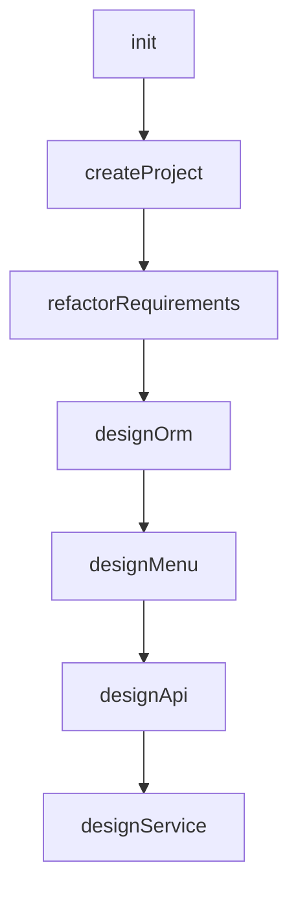
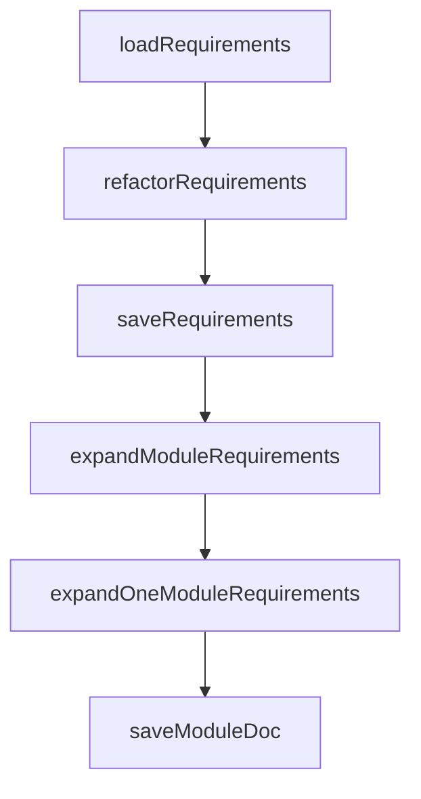
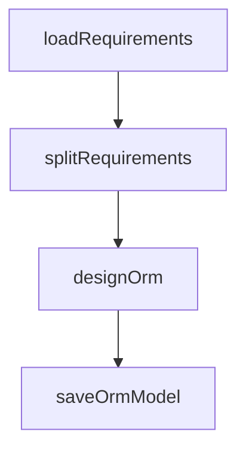
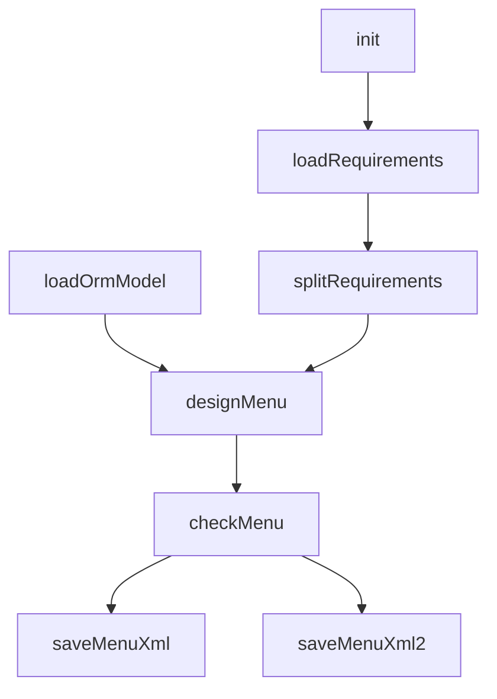
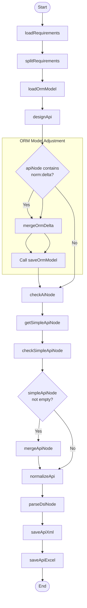

# AI Code Generation Tasks

## Core Workflow: ai-coder.task.xml

### Brief Description:
1. Overall Workflow:
  - This is an AI-driven primary workflow for application code generation, orchestrating multiple subtasks to cover the full development cycle
  - Sequential execution: Initialize → Create Project → Requirements Refactoring → ORM Design → Menu Design → API Design → Service Design
  - Built on Nop platform’s task extension mechanism (`x:extends` inherits the base task template)

2. Key Steps:
  - init: Initialization stage
    - Compute the requirements document path (`requirementsPath`)
  - createProject: Create project skeleton
    - Invoke the `ai-create-project.task.xml` subtask
    - Inputs: Maven group ID, application name, base package name, output directory
  - refactorRequirements: Requirements document refactoring
    - Invoke the `ai-biz-analyzer.task.xml` subtask
    - Use conditional flags (`flags match="req or EMPTY"`) to control execution
    - Standardize and expand the requirements document
  - designOrm: ORM model design
    - Invoke the `ai-orm-design.task.xml` subtask
    - Generate the data model based on the refactored requirements
  - designMenu: Menu and permissions design
    - Invoke the `ai-menu-design.task.xml` subtask
    - Generate menu structure and permission configuration
  - designApi: API interface design
    - Invoke the `ai-api-design.task.xml` subtask
    - Design system API specifications
  - designService: Service layer design
    - Invoke the `ai-service-design.task.xml` subtask
    - Complete business logic service design

3. Input Parameters:
  - Required parameters: `mavenGroupId`, `appName`, `basePackageName`, `outputDir`, `inputRequirementsPath`, `needExpand`
  - AI optional parameters: `aiProvider`, `aiModel`, `sessionId` (passed to each design subtask)
  - Conditional execution: Control subtask execution via the `flags` attribute (e.g., `flags match="menu or EMPTY"`)

4. Design Highlights:
  - Modular design: Decompose the development process into independent, reusable subtasks
  - AI-driven: Each design stage uses AI subtasks to automate generation
  - Extensibility: Flexibly control execution nodes via conditional flags (`flags`)
  - Project conventions: Adhere to standard Maven project structure (`mavenGroupId`)
  - Configuration inheritance: AI parameters (provider/model) propagate through the entire design flow

This master control task delivers a complete AI-assisted development flow from project creation to detailed design, chaining multiple domain-specific AI design subtasks to automatically convert the requirements document into usable project code. Each design stage can be independently enabled or skipped via conditional flags, offering flexible flow control.

## Business Analysis: ai-biz-analyzer.task.xml

### Brief Description:

1. Task Structure:

- Defines five input parameters: `inputRequirementsPath`, `basePackageName`, `outputDir`, `needExpand`, `sessionId`
- Configures AI chat options (`ai:chatOptions`), using dynamically provided AI parameters
- Extends the base task template `/nop/task/lib/common.task.xml` via `x:extends`
- Enables the `ai-coder` and `file-utils` namespaces

2. Core Workflow:

- loadRequirements: Read the requirements document
  - Uses the custom type `file-utils:ReadText`
  - Reads the raw requirements from `inputRequirementsPath`
  - Output: Raw requirements text (`inputRequirements`)
- refactorRequirements: Refactor the requirements document
  - Uses an AI task step (`ai:TaskStep`) to refactor the requirements
  - Applies the `coder/refactor-requirements` prompt template
  - Inputs: Raw requirements text and the expansion flag (`needExpand`)
  - Output: Structured requirements document (`requirementsDoc`)
- saveRequirements: Save the refactored requirements
  - Saves the refactored requirements to `docs/requirements/refactored-requirements.md`
- expandModuleRequirements: Parallel processing of module requirements
  - Iterates over all submodules under "3.2 Core Functional Modules" in the requirements document
  - Creates a parallel processing branch for each module
- expandOneModuleRequirements: Expand requirements for a single module
  - Uses AI to expand a specific module’s requirements
  - Applies the `coder/expand-module-requirements` prompt template
  - Adds a concurrency throttle (`throttle`), with max concurrency of 1
- saveModuleDoc: Save the module document
  - Saves the expanded module requirements to `docs/requirements/sections/{sectionNo}.md`

3. Key Features:

- AI-driven document refactoring: Use AI to restructure the raw requirements into a standard format
- Parallel processing: Use `fork` to process at the module level in parallel
- Concurrency control: Use `throttle` to limit AI call rate (max concurrency 1)
- Modular storage: Save expanded requirements per module number (`sectionNo`)
- Templated AI prompts: Use predefined AI prompt templates (`promptName`) to guide processing

This task implements an automated requirements processing pipeline: Read → AI Refactor → Save → Parallel Module Expansion → Per-module Save. The core is converting raw requirements into a structured, standardized technical document via AI, with deep expansion for core functional modules.

## ORM Design: ai-orm-design.task.xml

### Brief Description:

1. Task Structure:

- Defines a task with seven input parameters: `requirementsPath`, `appName`, `basePackageName`, `outputDir`, `aiProvider`,
  `aiModel`, `sessionId`
- Configures AI chat options (`ai:chatOptions`), using dynamically provided AI provider and model parameters
- Extends the base task template `/nop/task/lib/common.task.xml` via `x:extends`

2. Process Steps:

- loadRequirements: Load the Markdown requirements document
  - Uses the custom type `ai-coder:LoadMarkdown`
  - Inputs: requirements file path and template path
  - Output: Structured document object (`requirementsDoc`)
- splitRequirements: Split the requirements document
  - Extracts the section tagged `ORM` from `requirementsDoc`
  - Output: ORM-related requirements text (`ormRequirements`)
- designOrm: Design the ORM model
  - Uses the custom type `ai:TaskStep` to invoke AI capabilities
  - Input: ORM requirements text
  - Output: ORM model (`ormModel`)
  - Enables response caching (`ai:useResponseCache="true"`)
- saveOrmModel: Save the ORM model
  - Calls the save step from the external task library (`ai-coder.task-lib.xml`)
  - Inputs: the generated ORM model and application name

3. Key Features:

- AI-assisted code generation (`ai-coder` namespace)
- Supports multiple AI providers (Ollama/DeepSeek/VolcEngine etc.)
- Templated document processing (`.tpl.md` templates)
- Modular requirements splitting (`selectSectionByTplTag`)

This task automates the flow from requirements parsing → ORM requirements extraction → AI model design → model persistence, with AI turning natural-language requirements into an ORM data model.

## Menu Design: ai-menu-design.task.xml

### Brief Description:

1. Task Structure:

- Defines a task with seven input parameters: `requirementsPath`, `appName`, `basePackageName`, `outputDir`, `aiProvider`,
  `aiModel`, `sessionId`
- Configures AI chat options (`ai:chatOptions`), using dynamically provided AI provider and model parameters
- Extends the base task template `/nop/task/lib/common.task.xml` via `x:extends`

2. Core Workflow:

- init: Initialization step
  - Generates an application ID (`appId`) by replacing hyphens in the application name with slashes
- loadRequirements: Load the requirements document
  - Loads the Markdown requirements via the custom type `ai-coder:LoadMarkdown`
  - Applies templates to process document structure
- splitRequirements: Split the requirements document
  - Extracts the section tagged `MENU` from the document
- loadOrmModel: Load the ORM model
  - Loads the pre-generated ORM data model from the specified path (`model/ai-gen.orm.xml`)
- designMenu: Design the menu structure
  - Uses AI to design menus and role permissions based on menu requirements and the ORM model
  - Enables response caching (`ai:useResponseCache="true"`)
- checkMenu: Validate the menu design
  - Uses AI to validate and optimize the designed menus
- saveMenuXml: Save the menu configuration
  - Saves the menu design as a DSL-formatted XML file
- saveMenuXml2: Save a backup menu configuration
  - Saves the menu design to an application-specific path

3. Key Features:

- Dual-path persistence: Menu configuration is saved both to the standard path (`model/ai-gen.action-auth.xml`) and an application-specific path
- AI-assisted design: Use AI to generate menu structures and permission configurations
- Design validation: A dedicated `checkMenu` step ensures menu design quality
- Templated processing: Use predefined Markdown templates (`requirements.tpl.md`) to parse the requirements

This task delivers the full workflow from requirements parsing → menu requirements extraction → ORM model loading → AI menu design → design validation → dual-path persistence, converting natural-language requirements into menu permission configurations.

## API Design: ai-api-design.task.xml

### Process Description

1. Input Stage

- Accept external parameters: `requirementsPath`, `appName`, `basePackageName`, `outputDir`, `aiProvider`, `aiModel`, `sessionId`

2. Requirements Handling

- `loadRequirements`: Load the Markdown requirements and parse the structure
- `splitRequirements`: Extract API-related requirements text

3. Model Loading

- `loadOrmModel`: Load the existing ORM model from the file system

4. API Design

- `designApi`: Use AI to generate the initial API model (based on requirements text and the ORM model)

5. ORM Model Adjustment

- Check whether the API node contains ORM changes (`orm:delta`)
- If changes exist: merge into the ORM model → save the updated model file

6. API Model Validation

- `checkAiNode`: AI validates the reasonableness of the API model
- `getSimpleApiNode`: Extract a simplified API model
- `checkSimpleApiNode`: AI performs a second validation on the simplified model

7. Model Merge

- When the simplified model is valid, merge it into the original API model

8. API Normalization

- Set the fully qualified service class path
- Reset the propId attribute of message fields

9. Output

- `parseDslNode`: Parse the DSL node into an API model object
- `saveApiXml`: Persist the API definition in XML format
- `saveApiExcel`: Generate the API documentation in Excel format

### Key Features

1. AI Integration:

- Use `ai:TaskStep` to call AI services for design/validation tasks
- Configure AI parameters (model/session) via `ai:chatOptions`

2. Conditional Execution:

- ORM adjustment and model merge are triggered by `<when>` conditions
- Depend on the output state of preceding steps

3. Model-Driven:

- Based on XDef schema definitions (`/nop/schema/*.xdef`)
- Supports DSL node operations (extract/merge/parse)

4. File Operations:

- Multi-format output (XML/Excel)
- Paths are dynamically configured via `outputDir`

5. Extension Mechanism:

- Inherit the base task template via `x:extends`
- Reuse custom step logic via `customType`

<!-- SOURCE_MD5:fa2d97518900dc12a6596e443dfca0b4-->
