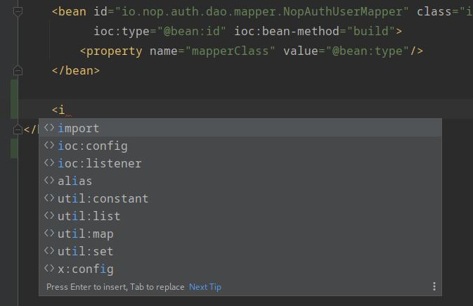
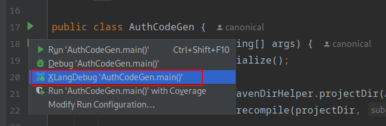

# XLang DSL Plugin

In the Nop platform, all DSLs use the XML syntax and a unified xdef meta-model to provide normalized formal constraints and basic attribute semantics. Based on the xdef meta-model, we can implement unified syntax completion, cross-reference analysis, breakpoint debugging, and other features without writing separate IDE plugins for each DSL.

> For compilation and installation of the plugin, refer to: [idea.md](../../dev-guide/ide/idea.md)

## DSL Syntax Format

XLang DSL uses an XML format. The root node must specify the corresponding xdef meta-model via the `x:schema` attribute, for example:

```xml
<beans x:schema="/nop/schema/beans.xdef"
       xmlns:x="/nop/schema/xdsl.xdef" ...>
</beans>
```

## Syntax Completion

When entering tag names, attribute names, or attribute values, the information defined in the xdef will pop up.




## Syntax Checking

The plugin checks the format of tag names, attribute names, and attribute values according to the xdef definition. Noncompliant syntax elements will be marked with Error.


## Quick Documentation

When hovering over tag names, attribute names, or attribute values, documentation defined in the xdef file is displayed.


## Path Links

When hovering over attribute values in path format while holding the CTRL key, a prompt appears to jump to the file corresponding to the path.
For XPL template tags, it suggests jumping to the definition in the tag library.


## XScript Code Highlighting

Within the `<c:script/>` tag, XScript supports code highlighting, documentation, navigation, completion, etc.


## Enhanced DSL Documentation Format

For documentation content within DSLs, we recommend the following form:

```xml
<example xmlns:x="/nop/schema/xdsl.xdef"
    x:schema="/nop/schema/xdef.xdef"
>
    <!-- [This is a node]
    > - Level-1 list #1
    > - Level-1 list #2
    > - Level-1 list #3
    >   - Level-2 list #1
    >   - Level-2 list #2
    >   - Level-2 list #3

    @type [This is the node type]
        > Attribute usage instructions
        > - Note 1
        > - Note 2
    @name [This is the node name]
        > Description xxx
    -->
    <node type="!#generic-type=string" name="string"/>

</example>
```

- The opening `[xxx]` in the documentation indicates the tag or attribute name is `xxx`.
- The leading `> ` (including a space) on other lines can be used only at the beginning of nested lists to prevent removal of leading whitespace that would otherwise break correct rendering of Markdown nested lists.

Node documentation rendering result:


Attribute documentation rendering result:


To prevent malicious links, the URLs of links and images in Markdown are displayed in full so users can verify whether the link is trustworthy:


## Breakpoint Debugging


You can add breakpoints in XScript scripts or Xpl template snippets.
The plugin adds an executor, `XLangDebug`, at the same level as the `Run` and `Debug` actions. When launched through it, both the Java debugger and the XLang scripting language debugger start.




To debug XLang, include the `nop-xlang-debugger` module:

```xml
<dependency>
    <groupId>io.github.entropy-cloud</groupId>
    <artifactId>nop-xlang-debugger</artifactId>
    <version>2.0.0-SNAPSHOT</version>
</dependency>
```
<!-- SOURCE_MD5:c63a62192bfed6fc5414b42a12297a01-->
