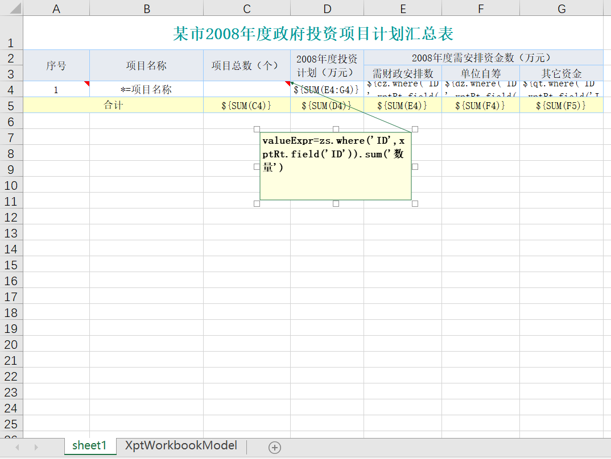
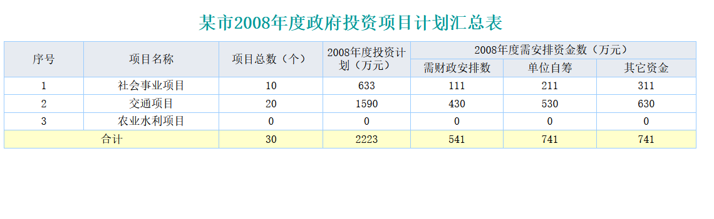
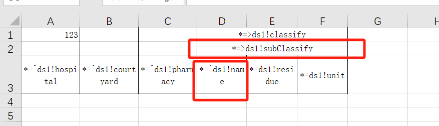

# Open-source Chinese-style reporting engine using Excel as the designer: NopReport

Chinese-style reports are synonymous with complex-structure reports. They broadly refer to summary reports commonly found in domestic information systems, presenting multi-source data in the form of row-column cross-tabulation, multi-level headers, and free cell splitting/merging.

[Why is there the notion of "Chinese-style reports"](https://www.zhihu.com/question/519875794)

> The founder of [Raqsoft Report](http://www.raqsoft.com.cn/about#aboutme), Bu-xing Jiang, is a legendary figure inscribed in Chinese history (the first Chinese gold medalist in the International Mathematical Olympiad, from Shihezi, Xinjiang; see [Prof. Gu Xianfeng’s recollection](https://blog.sciencenet.cn/blog-2472277-1160241.html)). He invented the theoretical foundations of the Chinese-style report model and led a whole generation of reporting software technology trends.

Currently, commercial reporting tools in China all support Chinese-style report production. However, among open-source report engines, only [UReport](https://gitee.com/youseries_admin/ureport) supports Chinese-style reports, and it is no longer maintained.

NopReport is an open-source Chinese-style reporting engine independently implemented from scratch based on the theory of Reversible Computation. Its core code is short—just over 3,000 lines (see the [nop-report-core](https://gitee.com/canonical-entropy/nop-entropy/tree/master/nop-report/nop-report-core) module). It delivers high performance (performance test code: [TestReportSpeed.java](https://gitee.com/canonical-entropy/nop-entropy/blob/master/nop-report/nop-report-demo/src/test/java/io/nop/report/demo/TestReportSpeed.java)) and offers flexibility and extensibility that are difficult for other report engines to match.

Within the [Nop Platform](https://gitee.com/canonical-entropy/nop-entropy), NopReport is positioned as a general modeling tool for tabular data structures. Any functionality that needs to generate tabular data can be implemented by converting it into NopReport report model objects. For example, the NopCli command-line tool’s database reverse-engineering command analyzes database table structures and generates an Excel model file. This Excel model file is produced by **converting the import template into a report output model**.

Compared to other report engines, NopReport has the following distinctive characteristics:

## I. Use Excel as the designer

[Operational demo video](https://www.bilibili.com/video/BV1Sa4y1K7tD/)

According to the principles of Reversible Computation, the essence of a report engine is a DSL defined for tabular data structures (see the metamodel definition [workbook.xdef](https://gitee.com/canonical-entropy/nop-entropy/blob/master/nop-xdefs/src/main/resources/_vfs/nop/schema/excel/workbook.xdef)), and the visual designer is merely a visual presentation of this DSL. To enable a model-driven code generator, the Nop Platform has already implemented Excel file parsing and generation. With a small amount of additional annotation, Excel itself can be used as the report designer. Specifically, we treat Excel comments as extended information and recognize expression syntax in cell text. NopReport currently supports the following types of reports:

### Archive-style report


### Paragraph detail report


### Complex multi-source report




### Cross table — bi-directional data expansion


### YoY/MoM and other financial statistic tables


### Parallel expansion of sibling nodes



Expanding the column parent cell D2 will cause D3 to be duplicated multiple times, and when D3 performs row expansion, multiple sibling nodes execute row expansion in parallel.
When sibling nodes expand rows, they automatically share newly created rows. Therefore, the final number of rows to which the parent node is expanded is determined by the total expansion count across all child nodes.

### Excel model extension

The NopReport model can be viewed as an extension of the Excel model. In cell comments, we can specify the cell’s expansion direction and contents via properties such as expandType, expandExpr, and field. Additionally, we can write expressions directly in cell text. The advantage is that expression content is visible directly in the UI without opening comments. Two text-expression formats are supported:

1. EL expressions: e.g., ${entity.myField}
2. Expansion expressions: they use `*=` as a prefix
   A. `*=fieldName` is equivalent to configuring field=fieldName
   B. `*=^ds1!fieldName` is equivalent to configuring expandType=r, ds=ds1, field=fieldName
   C. `*=>ds1!fieldName` is equivalent to configuring expandType=c, ds=ds1, field=fieldName
   D. `*=^fieldName@entity.children` is equivalent to configuring expandType=r, field=fieldName, expandExpr=entity.children

For detailed instructions, see [xpt-report.md](../dev-guide/report/xpt-report.md)

## II. Highly flexible data object support

Typical report engines only target flat table data structures at the data management layer. The basic process is to first create a DataSource, then a DataSet. A DataSet corresponds to a table or view in the database and manages row-by-row data records.

This approach has the advantage of making the report engine relatively generic and able to run independently of business systems. The drawback is obvious: the report engine cannot directly use domain model objects already constructed within the application, nor can it leverage the intrinsic structural relationships in the domain model for performance optimization.

NopReport adopts a more flexible and open layered design. At runtime, it directly targets domain model objects, and DataSet is only an optional data organization form. For example, in the archive-style report introduced in the previous section, report data is constructed directly via a JSON variable:


To expand [Education Experience], you only need to configure expandType=r, expandExpr=entity.educations. Meanwhile, report tools like FineReport require defining multiple datasets such as ds_study, ds_work, etc., and then configuring relational filters between these datasets. In NopReport, we simply assume user information is organized as a tree structure. A user object retrieved from the NopOrm engine can be passed directly to the report engine as input data, without redefining a dataset specifically for report export inside the report engine.

NopOrm has already optimized access to object association properties (e.g., addressing the ORM engine’s common [N+1 problem](https://zhuanlan.zhihu.com/p/545063021)), and its usage aligns well with business intuition: parent-child relationships in table cells directly correspond to property associations on entity objects.

NopReport imposes no special requirements on data sources. In the 【Before Expansion】 configuration, we can freely process data using the Xpl template language. Typical report engines may design datasets in a visual designer; in NopReport, built on the principles of Reversible Computation, we can easily emulate this.

For example, in 【Before Expansion】 we can introduce Xpl tag abstractions that encapsulate how a concrete dataset is retrieved as Xpl tags.

```xml
<xpt-rt:UseJdbcDataSet dsName="ds1" xpl:lib="/nop/report/xlib/xpt-rt.xlib">
  <soure> select xx from yy where type=${type} </soure>
</xpt-rt:UseJdbcDataSet>
```

We can view tags like `<xpt-rt:UseJdbcDataSet>` as a kind of configuration file. Using the Nop Platform’s GenericTreeEditor (currently under development), a visual dataset designer can be generated automatically.

With the Nop Platform as the technical foundation, we can accumulate data model definitions tailored to our own domain instead of relying solely on built-in platform models.

## III. Use a general-purpose expression syntax

A distinctive feature in Chinese-style report theory is the so-called [hierarchical coordinates](https://help.fanruan.com/finereport/doc-view-3802.html). For example, B2\[A2:+1\] returns the value of the next B2 cell vertically expanded under the A2 cell as the parent cell (the “next” here is relative to the B2 cell within the current row). To support hierarchical coordinate expressions, report engines typically introduce a report-specific expression engine with its own syntax and functions, which differs greatly from the expression syntax used in general business development. As a result, code cannot be reused directly and the specialized syntax must be learned.

NopReport directly reuses the XScript expression engine and extends hierarchical coordinate syntax on top of XScript (whose syntax is similar to JavaScript). In fact, only a few dozen lines of code are needed to add hierarchical coordinate support to the expression engine; see [ReportExpressionParser.java](https://gitee.com/canonical-entropy/nop-entropy/blob/master/nop-report/nop-report-core/src/main/java/io/nop/report/core/expr/ReportExpressionParser.java).

Each coordinate expression returns an ExpandedCellSet object,

```java
class ExpandedCellSet implement Iterable<Object>{
   List<ExpandedCell> cells;

    @Override
    public Iterator<Object> iterator() {
        return cells.stream().map(ExpandedCell::getValue).iterator();
    }

    public ExpandedCellSet filter(Predicate<ExpandedCell> filter) {
        List<ExpandedCell> list = cells.stream().filter(filter).collect(Collectors.toList());
        return new ExpandedCellSet(loc, expr + "{ filter }", list);
    }
}
```

NopReport’s hierarchical coordinate syntax does not support Filter conditions, but the returned ExpandedCellSet object has a filter method, which we can call to achieve similar effects.

ExpandedCellSet implements the Iterable interface, so in report functions it can be used directly as a list of values—for example, in the SUM function:

```java
public static Number SUM(@Name("values") Object values) {
        if (values == null)
            return null;

        Iterator<Object> it = CollectionHelper.toIterator(values, true);
        Number ret = 0;

        while (it.hasNext()) {
            Object value = it.next();
            if (!(value instanceof Number))
                continue;
            ret = MathHelper.add(ret, value);
        }
        return ret;
    }
```

We do not need to specially detect the ExpandedCellSet type for special handling.

In NopReport, support for hierarchical coordinates on datasets is completely encapsulated within the ReportDataSet type, with no need for any customization in the expression engine.

```java
class ReportDataSet{
     @EvalMethod
    public Number sum(IEvalScope scope, String field) {
        List<Object> items = current(scope);
        Number ret = 0;
        for (Object item : items) {
            Object value = getFieldValue(item, field);
            if (!StringHelper.isEmptyObject(value)) {
                ret = MathHelper.add(ret, value);
            }
        }
        return ret;
    }
}
```

`@EvalMethod` is an annotation recognized by XScript, indicating that the scope environment object will be automatically passed when the expression is invoked. For example, `ds.sum('金额')` actually calls the method `ReportDataSet.sum(IEvalScope, String)`. The current function uses the implicitly passed scope to determine the hierarchical coordinates of the current cell, and then determines which data items satisfy those hierarchical coordinate conditions.

In the complex multi-source report in the previous section, to obtain the project total, we used an expression configured as valueExpr=zs.where('ID',xptRt.field('ID')).sum('数量'), which is a regular JavaScript function call. In FineReport’s configuration, you need to configure relational filter conditions between datasets and agree on specialized dataset invocation expressions like `zs.求和(数量)`.

On the Nop Platform, we can easily introduce our own wrapper functions into expression evaluation, without requiring that all functions be prebuilt into the report engine. For example, in the 【Before Expansion】 configuration we can add functions for the current report without registering them as global functions.

```
function myFunc(a){
    return ...
}
assign("myFunc",myFunc); // You can then use the myFunc function in expressions within the current report.
```

> Static functions added to the [ReportFunctions](https://gitee.com/canonical-entropy/nop-entropy/blob/master/nop-report/nop-report-core/src/main/java/io/nop/report/core/functions/ReportFunctions.java) class automatically become globally registered report functions in ReportFunctionProvider.INSTANCE.

## IV. Design friendly to performance optimization

NopReport employs numerous performance-optimized structural designs and significantly simplifies the hierarchical expansion algorithm in the report.

The fundamental expanded-cell object uses a singly-linked list design, which improves performance when cells are frequently inserted.

```java
class ExpandedCell{
  ExpandedCell down;
  ExpandedCell right;

  ExpandedCell rowParent;
  ExpandedCell colParent;

  ExpandedRow row;
  ExpandedCol col;

  Map<String, List<ExpandedCell>> rowDescendants;

  Map<String, List<ExpandedCell>> colDescendants;
}

class ExpandedRow {
  ExpandedCell firstCell;
}

class ExpandedCol{
  ExpandedCell firstCell;
}

class ExpandedTable{
  List<ExpandedCell> rows;
  List<ExpandedCell> cols;
}
```

ExpandedCell objects have extended attribute support. During expression evaluation, these extended attributes are used to cache intermediate results that can be reused.

```java
class ExpandedCell{
    /**
     * Cache dynamically computed values related to the cell
     */
    private Map<String, Object> computedValues;

    public Object getComputed(String key, Function<ExpandedCell, Object> fn) {
        if (computedValues == null) {
            computedValues = new HashMap<>();
        }
        return computedValues.computeIfAbsent(key, k -> fn.apply(this));
    }

}
```

For example, the PROPORTION function calculates what proportion a cell’s value accounts for in the sum of all cells that meet the condition.

```java
    @EvalMethod
    public static Number PROPORTION(IEvalScope scope,
                                    @Name("cell") ExpandedCellSet cell,
                                    @Name("range") @Optional ExpandedCellSet range){
        IXptRuntime xptRt = IXptRuntime.fromScope(scope);
        Object value = cell.getValue();
        if (value == null)
            return null;

        Number v = ConvertHelper.toNumber(value, err -> new NopException(err).source(cell).param(ARG_EXPR, cell));

        String cellName = cell.getCellName();

            ExpandedCell rangeCell = range.getCell();
            // Use the computed properties of the first cell to cache the aggregated result
            Number sum = (Number) rangeCell.getComputed(cellName + '_' + XptConstants.KEY_ALL_SUM,
                    c -> SUM(rangeCell.getChildSet(cellName, xptRt)));
            return MathHelper.divide(v, sum);
    }
```

We leverage the extended attributes on rangeCell to cache the aggregated sum of all its child cells with the specified name.

## V. Multi-Sheet support and looped generation

NopReport’s design supports multiple Sheet pages. You can add multiple Sheets in Excel, each with its own configuration. Additionally, you can configure a 【Loop Variable】 to dynamically determine how many Sheets to generate and what each Sheet’s name should be. Using this mechanism, archive-style reports can be generated more easily.

## VI. Invoke from Java

For concrete examples, see [TestReportFile.java](https://gitee.com/canonical-entropy/nop-entropy/tree/master/nop-report/nop-report-core/src/test/java/io/nop/report/core/TestReportFile.java)

```javascript
IReportEngine reportEngine = newReportEngine();
File xptFile = attachmentFile("test.xpt.xlsx");
ExcelWorkbook xptModel = new XptModelLoader().loadModelFromResource(new FileResource(xptFile));
ITemplateOutput output = reportEngine.getRendererForXptModel(xptModel, "xlsx");

IEvalScope scope = XLang.newEvalScope();
scope.setLocalValue("title", "Test report, title displayed in the upper right");

File outputFile = getTargetFile("output.xlsx");
output.generateToFile(outputFile, scope);
```

You can pass variables to the report via the scope object. These variables can be used in report expressions and can be further processed, computed, etc., during stages such as 【Before Expansion】.

In the 【Before Expansion】 configuration, you can use the xpl template language and XScript to dynamically process data.

* You can use import to bring in Java classes
* You can use inject(beanName) to inject beans defined in the IoC container

## Conditional styles
Cell styles can be computed dynamically based on conditions.

1. In the report template, add a Sheet page named XptWorkbookModel and define named styles within it.


2. Configure the cell’s styleIdExpr
```
styleIdExpr=cell.ev == 2002 ? 'red' : null
```

## PDF export
For examples, see unit tests in nop-report-pdf

1. Include the nop-report-pdf module
2. Fonts used must be saved as `/_vfs/fonts/{fontName}.ttf`, `/_vfs/fonts/{fontName}-{Bold}{Italic}.ttf`
3. The default font must be saved as `/_vfs/fonts/default.ttf`
4. Use the `renderType` parameter as `pdf` when exporting

```
 reportEngine.getRenderer("/test/test-pdf.xpt.xlsx", "pdf").generateToFile(file, XLang.newEvalScope());
```

<!-- SOURCE_MD5:258670e71a0d6a82561ab96751f43e66-->
